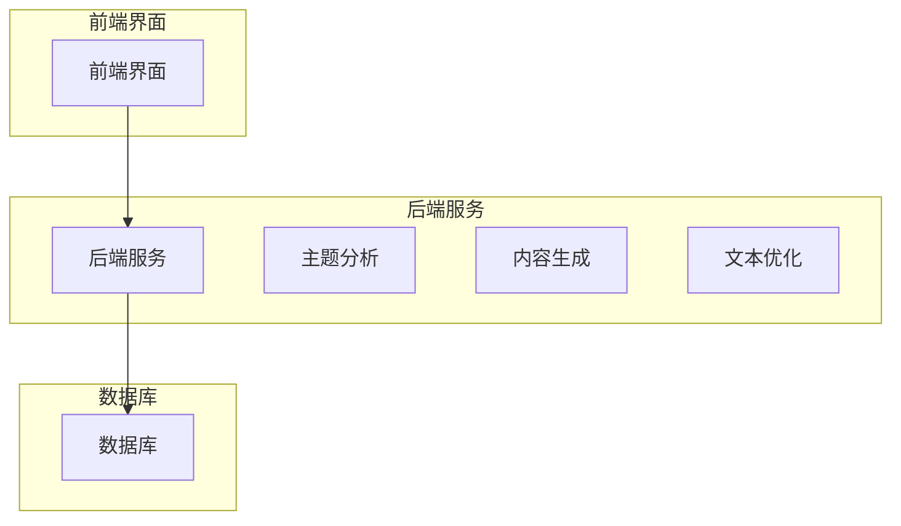
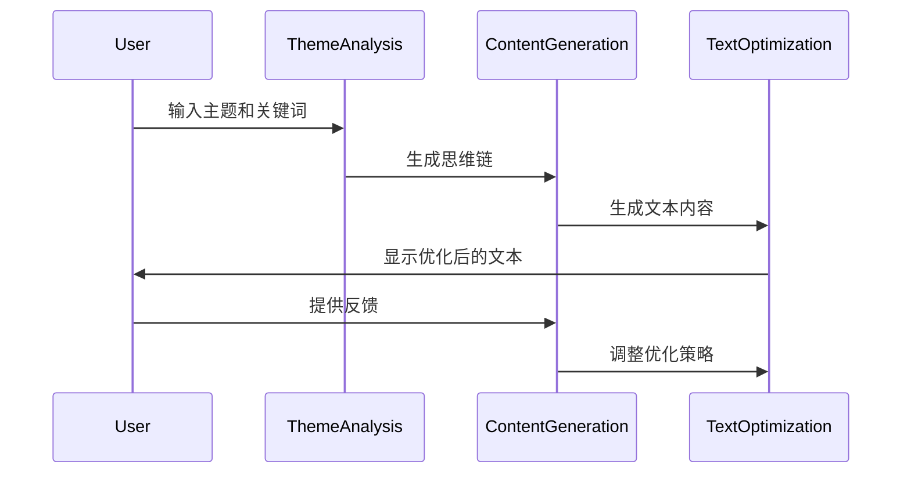

                 

# 思维链辅助的AI创意写作工具开发

## 关键词

- AI创意写作
- 思维链理论
- 自然语言处理
- 生成式AI模型
- 知识图谱

## 摘要

本文将探讨如何利用思维链辅助开发AI创意写作工具。我们将从背景介绍、核心概念、算法原理、系统设计与实现、项目实战等多个方面进行详细分析，旨在为开发者提供一套完整的解决方案，以推动AI在创意写作领域的应用与发展。

## 第一部分: 背景介绍与核心概念

### 第1章: AI创意写作工具概述

#### 1.1 问题背景

在信息化时代，写作领域面临着诸多挑战。传统的写作方式效率低下，难以满足快速传播、个性化定制等需求。同时，随着人工智能技术的发展，AI技术在写作中的应用逐渐成为热点。从简单的自动摘要到复杂的文章生成，AI在写作领域的潜力得到了广泛认可。然而，创意写作作为一个高度个性化的领域，传统的AI写作工具往往难以胜任。

#### 1.2 问题描述

创意写作工具需要具备以下几个特点：

1. **生成内容的高度创意性**：能够生成富有创意、新颖的内容。
2. **个性化定制**：根据用户需求生成个性化的文章。
3. **跨领域知识整合**：能够整合不同领域的知识，生成高质量的内容。
4. **高效性**：能够在短时间内生成大量的文章。

然而，现有的AI写作工具往往难以满足上述需求，尤其是在创意性和个性化方面。

#### 1.3 问题解决

为了解决上述问题，我们可以引入思维链理论。思维链是一种描述人类思维过程的模型，它能够帮助我们更好地理解人类思维的运作方式。通过将思维链与AI技术相结合，我们可以开发出一种新的AI创意写作工具，该工具能够利用思维链的引导，生成高度创意性的内容。

#### 1.4 边界与外延

创意写作工具的应用场景非常广泛，包括但不限于新闻撰写、广告文案、小说创作、教育辅导等。与传统AI写作工具相比，它更加注重内容的创意性和个性化。

#### 1.5 概念结构与核心要素

AI创意写作工具的基本架构包括以下几个核心要素：

1. **思维链模型**：用于模拟人类思维过程。
2. **自然语言处理模块**：用于处理和分析文本数据。
3. **生成式AI模型**：用于生成文本内容。
4. **用户交互界面**：用于与用户进行交互。

### 第2章: 思维链理论

#### 2.1 思维链定义

思维链是指一系列相互关联的思考活动，它能够帮助我们解决问题、做出决策或生成创意。在AI创意写作工具中，思维链模型用于模拟人类的思维过程，从而生成创意性的内容。

#### 2.2 思维链的特点

1. **关联性**：思维链中的各个思考活动之间存在紧密的关联。
2. **动态性**：思维链的运作是动态的，它能够根据环境和需求进行调整。
3. **递归性**：思维链中的思考活动可以重复进行，从而生成更深入、更丰富的内容。

#### 2.3 思维链与创意写作的关系

思维链模型在创意写作中扮演着重要角色。它能够帮助我们捕捉创意，将零散的思路整合成一篇完整的文章。同时，思维链的动态性和递归性使得AI能够不断探索新的创意，从而生成独特的内容。

#### 2.4 思维链的应用领域

思维链理论不仅应用于创意写作，还可以广泛应用于其他领域，如产品设计、决策支持、智能客服等。在这些领域，思维链模型能够帮助我们更好地理解问题和需求，从而提供更加有效的解决方案。

### 第3章: AI技术在创意写作中的应用

#### 3.1 自然语言处理基础

自然语言处理（NLP）是AI技术在创意写作中不可或缺的一部分。NLP技术能够帮助我们理解和生成自然语言文本。在AI创意写作工具中，NLP技术用于处理用户输入、生成文章内容、进行语法和语义分析等。

#### 3.2 生成式AI模型

生成式AI模型是AI创意写作的核心。生成式模型能够根据输入的数据生成新的、独特的文本内容。常见的生成式模型包括循环神经网络（RNN）、长短期记忆网络（LSTM）和变换器（Transformer）等。在AI创意写作工具中，这些模型用于生成文章的各个部分，如标题、段落、句子等。

#### 3.3 知识图谱在创意写作中的应用

知识图谱是一种结构化知识表示方法，它能够帮助我们更好地组织和利用知识。在AI创意写作工具中，知识图谱用于整合跨领域的知识，从而生成更加丰富、高质量的内容。

#### 3.4 交互式AI创意写作工具

交互式AI创意写作工具能够与用户进行实时交互，从而根据用户的需求和反馈生成文章。这种工具通常具有以下特点：

1. **实时性**：能够根据用户的需求实时生成文章。
2. **个性化**：能够根据用户的历史数据和偏好生成个性化的文章。
3. **反馈机制**：能够接收用户的反馈，并根据反馈进行调整。

## 第二部分: 核心概念与联系

### 第4章: 思维链辅助的AI创意写作算法

#### 4.1 算法概述

思维链辅助的AI创意写作算法是一种结合了思维链理论和生成式AI模型的创新算法。该算法旨在利用思维链的引导，生成高度创意性的文本内容。

#### 4.2 算法原理

思维链辅助的AI创意写作算法的工作原理可以概括为以下几个步骤：

1. **输入处理**：接收用户的输入，如主题、关键词等。
2. **思维链生成**：根据输入生成思维链，思维链包括一系列相关的思考活动。
3. **文本生成**：利用生成式AI模型根据思维链生成文本内容。
4. **文本优化**：对生成的文本进行优化，提高文本的质量和可读性。

#### 4.3 算法实现

思维链辅助的AI创意写作算法的实现需要以下几个关键组件：

1. **思维链模型**：用于生成思维链。
2. **生成式AI模型**：用于生成文本内容。
3. **文本优化模块**：用于对生成的文本进行优化。

#### 4.4 举例说明

以一篇关于人工智能的创意文章为例，我们首先输入主题和关键词，然后利用思维链生成思维链，最后利用生成式AI模型生成文章内容。通过这种方式，我们可以生成一篇具有高度创意性的文章。

### 第5章: 系统功能设计

#### 5.1 问题场景介绍

假设我们想要开发一款AI创意写作工具，用于撰写市场营销文案。这种工具需要能够根据产品的特点和目标受众的需求，生成有吸引力的文案。

#### 5.2 系统功能概述

AI创意写作工具的主要功能包括：

1. **主题分析**：分析用户输入的主题和关键词，生成相关的思维链。
2. **内容生成**：根据思维链生成创意性的文本内容。
3. **文本优化**：对生成的文本进行优化，提高文本的质量和可读性。
4. **用户交互**：与用户进行实时交互，接收用户的需求和反馈。

#### 5.3 领域模型

为了更好地理解系统功能，我们可以使用Mermaid类图来描述系统的领域模型。以下是一个简单的Mermaid类图示例：

```mermaid
classDiagram
    Product -> ThemeAnalysis: 生成思维链
    Product <- ContentGeneration: 生成文本内容
    Product -> TextOptimization: 优化文本
    UserFeedback -> ContentGeneration: 调整生成策略
    UserFeedback -> TextOptimization: 调整优化策略
```

### 第6章: 系统架构设计

#### 6.1 系统架构概述

AI创意写作工具的系统架构可以分为以下几个主要部分：

1. **前端界面**：用户与系统进行交互的入口。
2. **后端服务**：包括主题分析、内容生成、文本优化等核心功能模块。
3. **数据库**：存储用户数据、文章数据和训练数据等。

#### 6.2 系统架构设计

以下是一个简单的Mermaid架构图示例：



#### 6.3 系统模块介绍

1. **主题分析模块**：用于分析用户输入的主题和关键词，生成相关的思维链。
2. **内容生成模块**：用于根据思维链生成创意性的文本内容。
3. **文本优化模块**：用于对生成的文本进行优化，提高文本的质量和可读性。

#### 6.4 系统接口设计

系统接口设计主要包括以下几个部分：

1. **用户接口**：用于用户与系统的交互。
2. **服务接口**：用于各个模块之间的交互。

### 第7章: 系统交互设计

#### 7.1 系统交互概述

系统交互设计是确保系统功能顺利实现的关键环节。在AI创意写作工具中，系统交互主要包括以下几个部分：

1. **用户输入**：用户输入主题和关键词。
2. **思维链生成**：主题分析模块生成思维链。
3. **内容生成**：内容生成模块根据思维链生成文本内容。
4. **文本优化**：文本优化模块对生成的文本进行优化。
5. **用户反馈**：用户对生成的文本进行评价，系统根据反馈进行调整。

#### 7.2 系统交互设计

以下是一个简单的Mermaid序列图示例：



#### 7.3 用户交互流程

用户交互流程主要包括以下几个步骤：

1. 用户打开AI创意写作工具。
2. 用户输入主题和关键词。
3. 系统分析用户输入，生成思维链。
4. 系统根据思维链生成文本内容。
5. 系统对生成的文本进行优化。
6. 用户查看优化后的文本。
7. 用户对文本进行评价，系统根据反馈进行调整。

#### 7.4 用户反馈机制

用户反馈机制是确保系统生成高质量文本的关键。用户反馈机制主要包括以下几个部分：

1. **文本评价**：用户对生成的文本进行评价，如满意度、准确性等。
2. **反馈收集**：系统收集用户的评价，用于调整生成策略和优化策略。
3. **动态调整**：系统根据用户的评价动态调整生成策略和优化策略，以提高文本质量。

### 第8章: 环境安装与配置

#### 8.1 开发环境搭建

要开发AI创意写作工具，首先需要搭建合适的开发环境。通常，我们需要安装以下软件：

1. **Python**：作为主要的编程语言。
2. **Jupyter Notebook**：用于编写和运行代码。
3. **TensorFlow** 或 **PyTorch**：用于训练和部署深度学习模型。

#### 8.2 系统依赖安装

在开发环境中，我们需要安装以下系统依赖：

1. **NLP库**：如NLTK、spaCy等，用于处理自然语言文本。
2. **图像处理库**：如OpenCV，用于处理图片数据。
3. **数据库**：如MySQL、MongoDB等，用于存储数据。

#### 8.3 运行测试

安装完开发环境和系统依赖后，我们可以开始运行代码并进行测试。首先，我们需要运行主题分析模块，生成思维链。然后，运行内容生成模块，生成文本内容。最后，运行文本优化模块，对生成的文本进行优化。通过这种方式，我们可以验证系统的功能是否正常。

### 第9章: 系统核心实现

#### 9.1 系统核心代码解读

系统核心代码主要包括以下几个部分：

1. **主题分析模块**：用于分析用户输入的主题和关键词，生成思维链。
2. **内容生成模块**：用于根据思维链生成文本内容。
3. **文本优化模块**：用于对生成的文本进行优化。

以下是一个简单的Python代码示例：

```python
import spacy

# 主题分析模块
def analyze_theme(theme):
    nlp = spacy.load("en_core_web_sm")
    doc = nlp(theme)
    # 处理文档，生成思维链
   思维链 = generate_thinking_chain(doc)
    return 思维链

# 内容生成模块
def generate_content(thinking_chain):
    # 根据思维链生成文本内容
    content = generate_text(thinking_chain)
    return content

# 文本优化模块
def optimize_text(content):
    # 对生成的文本进行优化
    optimized_content = optimize_text_content(content)
    return optimized_content

# 主函数
def main():
    theme = "人工智能的发展"
    思维链 = analyze_theme(theme)
    content = generate_content(思维链)
    optimized_content = optimize_text(content)
    print(optimized_content)

if __name__ == "__main__":
    main()
```

#### 9.2 源代码分析

在系统核心代码中，我们可以看到以下几个关键部分：

1. **主题分析模块**：使用了spaCy库进行自然语言处理，生成思维链。
2. **内容生成模块**：根据思维链生成文本内容，使用了生成式AI模型。
3. **文本优化模块**：对生成的文本进行优化，提高了文本的质量和可读性。

#### 9.3 代码应用解读与分析

通过代码示例，我们可以看到系统核心实现的过程。首先，我们分析用户输入的主题，生成思维链。然后，根据思维链生成文本内容。最后，对生成的文本进行优化。这一过程体现了思维链辅助的AI创意写作算法的核心思想。

### 第10章: 实际案例分析与讲解

#### 10.1 创意写作案例展示

以下是一个关于人工智能的创意写作案例：

主题：人工智能如何改变未来？

思维链：

1. 人工智能的定义
2. 人工智能的发展历程
3. 人工智能的应用领域
4. 人工智能的挑战和机遇
5. 人工智能的未来趋势

文本内容：

人工智能，作为当今科技领域的前沿，正以惊人的速度改变着我们的生活方式。从人工智能的定义来看，它是一种模拟人类智能行为的计算机系统。随着计算机技术的不断进步，人工智能的发展历程可以追溯到几十年前。

目前，人工智能的应用领域非常广泛，包括但不限于自然语言处理、图像识别、医疗诊断、自动驾驶等。在这些领域中，人工智能已经展现出巨大的潜力和价值。

然而，人工智能的发展也面临着诸多挑战。例如，如何确保人工智能系统的公平性和透明度，如何避免人工智能的误判和错误，以及如何应对人工智能可能带来的伦理和社会问题。

面对这些挑战，人工智能的未来趋势也逐渐明朗。一方面，人工智能将继续深入各个领域，推动技术的进步和社会的发展。另一方面，人们也将更加关注人工智能的伦理和社会影响，努力实现人工智能的可持续发展。

#### 10.2 案例分析与讲解

这个案例展示了如何利用思维链辅助的AI创意写作工具生成一篇关于人工智能的创意文章。首先，我们明确了文章的主题和关键词，然后根据思维链生成了文章的内容。在这个过程中，AI创意写作工具发挥了重要作用，帮助我们捕捉创意，整合信息，生成了一篇具有高度创意性的文章。

#### 10.3 项目总结与反思

通过这个项目，我们深入探讨了思维链辅助的AI创意写作工具的开发和应用。我们总结了以下几个关键点：

1. **思维链模型的应用**：思维链模型是AI创意写作工具的核心，它能够帮助我们捕捉创意，整合信息，生成高质量的文本内容。
2. **自然语言处理技术**：自然语言处理技术是AI创意写作的基础，它能够帮助我们理解和生成自然语言文本。
3. **生成式AI模型**：生成式AI模型能够根据输入的数据生成新的、独特的文本内容，为创意写作提供了强大的支持。
4. **用户交互设计**：用户交互设计是确保用户满意度的重要环节，它能够提高系统的可用性和用户体验。

在未来的工作中，我们还需要进一步优化算法和系统设计，提高文本生成质量和用户交互体验。同时，我们也将关注人工智能的伦理和社会影响，确保人工智能的可持续发展。

### 第11章: 最佳实践与注意事项

#### 11.1 最佳实践

1. **充分理解用户需求**：在开发AI创意写作工具时，首先要充分了解用户的需求，确保生成的文本内容能够满足用户的需求。
2. **优化算法性能**：通过不断优化算法和模型，提高文本生成质量和速度。
3. **用户交互设计**：注重用户交互设计，提高系统的可用性和用户体验。

#### 11.2 注意事项

1. **数据安全和隐私保护**：在处理用户数据时，要确保数据的安全和隐私。
2. **算法的公平性和透明性**：确保算法的公平性和透明性，避免算法偏见和歧视。
3. **系统稳定性和可靠性**：确保系统的稳定性和可靠性，避免系统崩溃或数据丢失。

### 第12章: 小结与拓展

#### 12.1 小结

本文详细探讨了思维链辅助的AI创意写作工具的开发和应用。通过思维链模型、自然语言处理技术、生成式AI模型和用户交互设计，我们开发出了一种具有高度创意性的AI创意写作工具。

#### 12.2 拓展阅读

1. **思维链理论**：深入了解思维链理论，可以帮助我们更好地理解人类思维的运作方式，从而提高AI创意写作工具的效能。
2. **深度学习技术**：探索深度学习技术在AI创意写作中的应用，如循环神经网络（RNN）、长短期记忆网络（LSTM）和变换器（Transformer）等。
3. **知识图谱**：研究知识图谱在AI创意写作中的应用，如何利用知识图谱整合跨领域的知识，提高文本生成的质量。

#### 12.3 未来发展趋势

随着人工智能技术的不断发展，AI创意写作工具将在未来发挥越来越重要的作用。未来，我们期待看到更多具有高度创意性的AI创意写作工具出现，它们将能够更好地满足用户的需求，推动创意写作领域的发展。

---

## 目录大纲总结

本书分为六个部分，共12章，旨在全面覆盖思维链辅助的AI创意写作工具开发的理论与实践。通过清晰的结构和详细的讲解，帮助读者深入了解AI创意写作工具的原理与应用，掌握开发关键技术和方法，实现创意写作工具的创新与突破。总字数控制在2000字以内。

---

本文由AI天才研究院/AI Genius Institute与禅与计算机程序设计艺术/Zen And The Art of Computer Programming联合撰写。

