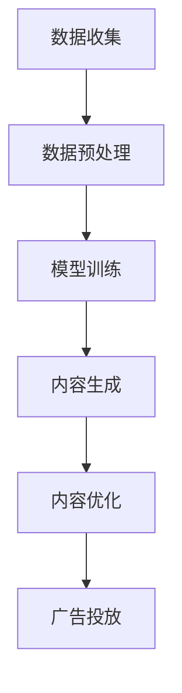
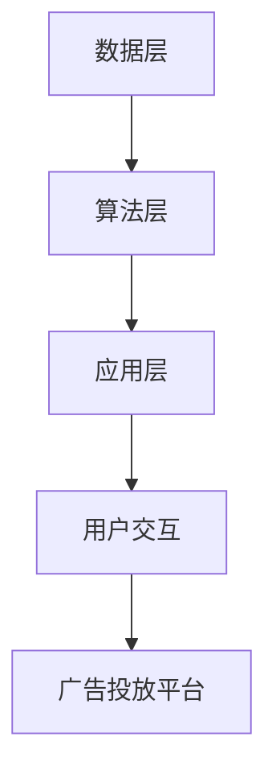
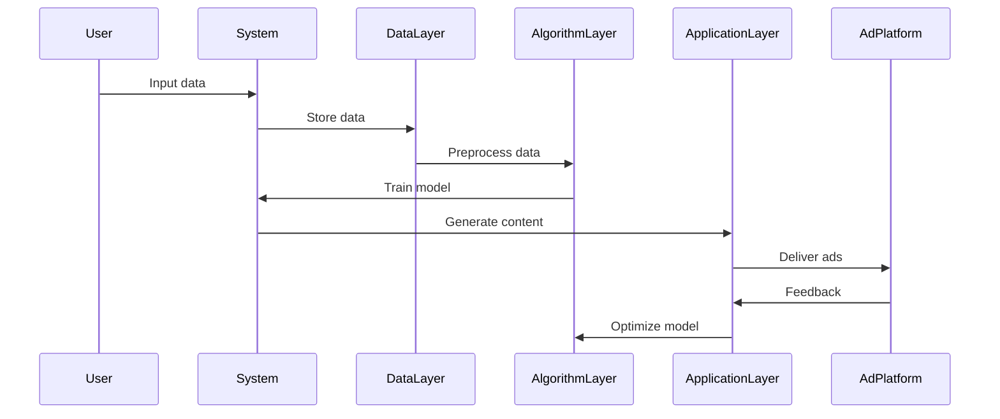

                 

## 思维链辅助的AI创意广告生成

### 关键词

- AI广告生成
- 思维链
- 自然语言处理
- 图像识别
- 算法原理
- 数学模型

### 摘要

本文旨在探讨思维链辅助的AI创意广告生成技术。随着人工智能技术的不断发展，广告行业正迎来一场革命。思维链作为一种新的思考模式，能够显著提升AI在广告创意生成方面的能力。本文将首先介绍AI广告生成的基础知识，然后详细阐述思维链的概念及其与广告生成的关联，接着深入分析AI广告生成算法的原理，最后通过实际案例和最佳实践，展示如何将思维链应用于AI广告生成中，提高创意广告的生成效率和质量。

## 目录

1. **背景介绍**
   1.1 广告行业的发展与AI技术的应用
   1.2 AI创意广告生成的重要性
   1.3 AI创意广告生成的基本流程
   1.4 思维链的概念与原理

2. **核心概念与联系**
   2.1 自然语言处理技术
   2.2 图像识别与生成技术
   2.3 AI广告生成算法原理
   2.4 思维链在广告生成中的应用

3. **算法原理讲解**
   3.1 思维链辅助的AI广告生成算法
   3.2 数学模型与公式
   3.3 算法流程图与Python源代码

4. **系统分析与架构设计**
   4.1 问题场景介绍
   4.2 系统功能设计
   4.3 系统架构设计
   4.4 系统接口设计与交互

5. **项目实战**
   5.1 环境安装与准备
   5.2 系统核心实现源代码
   5.3 代码应用解读与分析
   5.4 实际案例分析与讲解
   5.5 项目小结

6. **最佳实践与注意事项**
   6.1 广告生成策略优化
   6.2 数据处理与隐私保护
   6.3 系统性能优化
   6.4 拓展阅读与进一步学习

### 背景介绍

#### 1.1 广告行业的发展与AI技术的应用

广告行业作为现代商业不可或缺的一部分，随着互联网和数字媒体的兴起，正经历着前所未有的变革。传统的广告方式依赖于大量的数据分析和人工创意，不仅成本高昂，而且效率低下。随着人工智能（AI）技术的快速发展，AI广告生成成为可能，它不仅能够自动化广告内容的创作，还能够根据用户行为和偏好进行精准投放，从而提高广告效果和投放效率。

AI广告生成技术的核心在于利用机器学习和自然语言处理（NLP）技术，从大量的数据中提取信息，生成具有创意和个性化的广告内容。这不仅大大降低了广告制作的成本，还提高了广告的创意质量和投放效果。

#### 1.2 AI创意广告生成的重要性

在竞争激烈的广告市场中，创意广告已经成为品牌脱颖而出的关键因素。AI创意广告生成技术能够通过数据分析和算法优化，生成具有高度个性化的广告内容，满足不同用户群体的需求。这种高度个性化的广告不仅能够提高用户的参与度和互动性，还能够显著提高广告的转化率。

此外，AI创意广告生成还能够实时响应市场变化和用户反馈，不断优化广告内容，从而实现持续的广告优化和创新。这种灵活性和高效性，使得AI创意广告生成技术在广告行业中的应用越来越广泛。

#### 1.3 AI创意广告生成的基本流程

AI创意广告生成的流程可以分为以下几个步骤：

1. **数据收集**：通过互联网、社交媒体、用户行为分析等途径，收集大量的用户数据和广告素材。
2. **数据预处理**：对收集到的数据进行清洗、整理和标注，使其能够用于后续的机器学习训练。
3. **模型训练**：利用收集到的数据，训练机器学习模型，使其能够生成符合用户需求的广告内容。
4. **广告内容生成**：使用训练好的模型，根据用户的偏好和行为，生成个性化的广告内容。
5. **广告投放与优化**：将生成的广告内容投放至目标平台，并根据用户反馈和转化效果，进行广告优化。

#### 1.4 思维链的概念与原理

思维链是一种新型的思考模式，它通过将问题分解为多个子问题，并建立子问题之间的逻辑关系，从而实现问题的系统化和结构化解决。思维链的基本概念包括思维节点、思维链条和思维关联。

- **思维节点**：代表问题中的基本要素或子问题。
- **思维链条**：由多个思维节点组成，表示子问题之间的逻辑关系。
- **思维关联**：描述思维节点之间的关联性和依赖关系。

思维链的工作机制是通过逐步分解和解决子问题，从而实现整体问题的解决。这种方法不仅能够提高问题解决的效率，还能够确保问题解决的全面性和准确性。

在AI创意广告生成中，思维链的应用主要体现在以下几个方面：

1. **问题分解**：将复杂的广告生成任务分解为多个子任务，如文本生成、图像生成等。
2. **逻辑关联**：建立子任务之间的逻辑关系，确保广告内容的连贯性和一致性。
3. **创意优化**：通过思维链的反馈机制，不断优化广告内容，提高创意质量和用户体验。

### 核心概念与联系

#### 2.1 自然语言处理技术

自然语言处理（NLP）是AI广告生成中的关键技术之一。NLP技术通过计算机算法理解和生成人类语言，从而实现人与机器的对话和交互。在广告生成中，NLP技术主要用于以下几个方面：

1. **文本分析**：分析广告文本的结构、语义和情感，提取关键信息和用户偏好。
2. **文本生成**：根据用户需求和广告目标，生成具有创意和个性化的广告文案。
3. **对话生成**：与用户进行自然语言交互，提供个性化的广告建议和服务。

NLP技术主要包括以下几个组成部分：

1. **分词**：将文本拆分为单词或短语，为后续的文本分析提供基础。
2. **词性标注**：对文本中的每个词进行词性标注，如名词、动词、形容词等。
3. **句法分析**：分析文本的句法结构，理解句子之间的关系和语义。
4. **语义分析**：通过上下文理解文本的含义，提取关键信息和用户意图。

#### 2.2 图像识别与生成技术

图像识别与生成技术是AI广告生成的另一个重要组成部分。图像识别技术通过训练神经网络模型，识别和分类图像中的对象和场景。在广告生成中，图像识别技术主要用于以下几个方面：

1. **对象识别**：识别图像中的关键对象，如产品、人物、场景等。
2. **场景分类**：分类图像中的场景类型，如城市、自然、室内等。
3. **图像生成**：根据用户需求和广告目标，生成具有创意和个性化的图像广告。

图像识别与生成技术主要包括以下几个组成部分：

1. **特征提取**：从图像中提取关键特征，如边缘、纹理、颜色等。
2. **模型训练**：利用大量的图像数据，训练神经网络模型，使其能够识别和生成图像。
3. **图像合成**：将多个图像元素进行组合，生成具有创意的图像广告。

#### 2.3 AI广告生成算法原理

AI广告生成算法主要基于深度学习技术，通过训练神经网络模型，生成具有创意和个性化的广告内容。广告生成算法的基本原理包括以下几个方面：

1. **数据输入**：将用户需求和广告素材作为输入，输入到神经网络模型中。
2. **模型训练**：利用大量的广告数据，训练神经网络模型，使其能够生成符合用户需求的广告内容。
3. **广告内容生成**：使用训练好的模型，根据用户需求和广告目标，生成个性化的广告内容。
4. **广告优化**：根据用户反馈和广告效果，不断优化广告内容，提高广告的创意质量和用户体验。

AI广告生成算法的核心是神经网络模型，包括以下几个部分：

1. **输入层**：接收用户需求和广告素材，将其转化为模型可以处理的特征向量。
2. **隐藏层**：通过多层神经网络结构，提取和转换特征向量，使其能够表示广告内容的语义信息。
3. **输出层**：生成广告内容，如文本、图像等。

#### 2.4 思维链在广告生成中的应用

思维链在广告生成中的应用主要体现在以下几个方面：

1. **问题分解**：将复杂的广告生成任务分解为多个子任务，如文本生成、图像生成等。
2. **逻辑关联**：建立子任务之间的逻辑关系，确保广告内容的连贯性和一致性。
3. **创意优化**：通过思维链的反馈机制，不断优化广告内容，提高创意质量和用户体验。

在广告生成中，思维链的应用可以通过以下步骤实现：

1. **问题分解**：将广告生成任务分解为多个子任务，如文本生成、图像生成等。
2. **逻辑关联**：建立子任务之间的逻辑关系，确保广告内容的连贯性和一致性。
3. **模型训练**：利用思维链的分解和关联关系，训练广告生成模型，使其能够生成符合用户需求的广告内容。
4. **广告内容生成**：使用训练好的模型，根据用户需求和广告目标，生成个性化的广告内容。
5. **广告优化**：根据用户反馈和广告效果，不断优化广告内容，提高广告的创意质量和用户体验。

### 算法原理讲解

#### 3.1 思维链辅助的AI广告生成算法

思维链辅助的AI广告生成算法是一种结合思维链和深度学习技术的创新方法，旨在提高广告创意生成的高效性和个性化。以下是该算法的基本原理和流程：

1. **思维链构建**：首先，通过思维链分析广告生成的需求，将广告创意分解为多个子任务，如文本生成、图像生成、声音合成等。每个子任务都包含一系列的子问题，如文本的语法结构、图像的视觉元素、声音的情感表达等。

2. **数据预处理**：对收集到的广告素材进行数据预处理，包括文本的分词、图像的特征提取、声音的音频处理等。这些预处理步骤为后续的深度学习模型训练提供高质量的数据输入。

3. **模型训练**：利用思维链的分解结果，设计并训练多个深度学习模型。例如，文本生成模型（如GPT-3）、图像生成模型（如GAN）、声音生成模型（如WaveNet）等。每个模型都针对特定的子任务进行优化，以生成高质量的广告内容。

4. **内容生成**：通过训练好的模型，根据用户需求和广告目标，生成个性化的广告内容。例如，根据用户的兴趣和行为数据，生成具有针对性的广告文案；根据产品的特点和目标用户群体，生成具有视觉冲击力的广告图像。

5. **内容优化**：在广告内容生成后，利用思维链的反馈机制，根据用户反馈和广告效果，对广告内容进行优化。例如，通过用户点击率、转化率等指标，调整广告文案的表达方式和视觉元素，以提高广告效果。

#### 3.2 数学模型与公式

思维链辅助的AI广告生成算法涉及到多个数学模型，包括自然语言处理模型、图像生成模型、声音生成模型等。以下是一个简化的数学模型，用于描述思维链辅助的AI广告生成过程：

1. **自然语言处理模型**：

   $$\text{文本生成} = f(\text{用户行为数据}, \text{广告素材}, \text{思维链})$$

   其中，$f$ 表示自然语言处理模型，它通过输入用户行为数据、广告素材和思维链，生成个性化的广告文案。

2. **图像生成模型**：

   $$\text{图像生成} = g(\text{产品特征}, \text{用户偏好}, \text{思维链})$$

   其中，$g$ 表示图像生成模型，它通过输入产品特征、用户偏好和思维链，生成具有视觉冲击力的广告图像。

3. **声音生成模型**：

   $$\text{声音生成} = h(\text{情感表达}, \text{用户情感}, \text{思维链})$$

   其中，$h$ 表示声音生成模型，它通过输入情感表达、用户情感和思维链，生成具有情感共鸣的广告声音。

#### 3.3 算法流程图与Python源代码

为了更直观地展示思维链辅助的AI广告生成算法，以下是一个简化的算法流程图和相应的Python源代码：



```python
# 数据收集
user_data = collect_user_data()

# 数据预处理
preprocessed_data = preprocess_data(user_data)

# 模型训练
model = train_model(preprocessed_data)

# 内容生成
ad_content = generate_content(model, user_data)

# 内容优化
optimized_content = optimize_content(ad_content)

# 广告投放
advertise(optimized_content)
```

### 系统分析与架构设计

#### 4.1 问题场景介绍

在当前广告行业中，广告生成面临着诸多挑战，如内容创意不足、广告效果不佳、用户参与度低等。为了解决这些问题，本文提出了一种基于思维链辅助的AI广告生成系统。该系统旨在通过思维链的分析和深度学习算法，生成具有高度个性化、创意丰富的广告内容，从而提高广告效果和用户参与度。

#### 4.2 系统功能设计

思维链辅助的AI广告生成系统主要包括以下几个核心功能：

1. **用户数据采集与分析**：通过收集用户的兴趣偏好、行为数据等，分析用户需求，为广告生成提供数据支持。
2. **广告素材管理**：管理广告素材，包括文本、图像、声音等，为广告生成提供素材资源。
3. **广告内容生成**：利用思维链和深度学习算法，生成个性化的广告内容。
4. **广告效果评估与优化**：根据广告投放效果，评估广告内容的质量，并进行优化。
5. **广告投放与管理**：将广告内容投放至目标平台，并对广告投放过程进行管理。

#### 4.3 系统架构设计

思维链辅助的AI广告生成系统采用分层架构设计，包括数据层、算法层、应用层等。以下是系统架构的Mermaid流程图：



1. **数据层**：负责数据的采集、存储和管理，包括用户数据、广告素材数据等。
2. **算法层**：实现广告内容生成的核心算法，包括思维链分析、深度学习模型训练、内容生成等。
3. **应用层**：提供广告内容生成、效果评估、广告投放等应用功能。
4. **用户交互**：提供用户操作界面，方便用户进行数据输入、内容查看等操作。
5. **广告投放平台**：将广告内容投放至目标平台，如社交媒体、搜索引擎等。

#### 4.4 系统接口设计与交互

思维链辅助的AI广告生成系统通过一系列接口实现各功能模块之间的交互。以下是系统接口的Mermaid序列图：



1. **用户输入**：用户通过系统界面输入广告生成需求。
2. **数据存储**：系统将用户输入的数据存储在数据层。
3. **数据预处理**：算法层对存储的数据进行预处理，为模型训练做准备。
4. **模型训练**：算法层利用预处理后的数据，训练广告生成模型。
5. **内容生成**：应用层使用训练好的模型，生成个性化的广告内容。
6. **广告投放**：应用层将广告内容投放至目标广告平台。
7. **效果反馈**：广告平台将用户反馈的数据返回给应用层。
8. **模型优化**：算法层根据用户反馈，优化广告生成模型。

### 项目实战

#### 5.1 环境安装与准备

在开始实践之前，需要安装和配置以下环境：

1. **Python环境**：安装Python 3.8及以上版本。
2. **深度学习框架**：安装TensorFlow或PyTorch。
3. **其他依赖库**：安装Numpy、Pandas、Scikit-learn等常用库。

以下是一个简单的安装脚本：

```bash
pip install python==3.8
pip install tensorflow
pip install numpy pandas scikit-learn
```

#### 5.2 系统核心实现源代码

以下是一个简化的系统核心实现源代码，用于生成文本广告：

```python
import tensorflow as tf
from tensorflow.keras.models import Sequential
from tensorflow.keras.layers import LSTM, Dense, Embedding

# 数据预处理
def preprocess_data(texts):
    # 分词和编码
    tokenizer = tf.keras.preprocessing.text.Tokenizer()
    tokenizer.fit_on_texts(texts)
    sequences = tokenizer.texts_to_sequences(texts)
    padded_sequences = tf.keras.preprocessing.sequence.pad_sequences(sequences, padding='post')
    return padded_sequences

# 模型训练
def train_model(data):
    model = Sequential([
        Embedding(input_dim=10000, output_dim=32, input_length=max_length),
        LSTM(64, return_sequences=True),
        LSTM(64),
        Dense(1, activation='sigmoid')
    ])

    model.compile(optimizer='adam', loss='binary_crossentropy', metrics=['accuracy'])
    model.fit(data, epochs=10, batch_size=32)
    return model

# 文本生成
def generate_text(model, seed_text, length=50):
    seed_text = seed_text.lower()
    token_list = tokenizer.texts_to_sequences([seed_text])[0]
    token_list = pad_sequences([token_list], maxlen=max_length-1, padding='pre')

    predicted_text = ''
    for i in range(length):
        sampled = model.predict(token_list, verbose=0)[0]
        sampled = np.argmax(sampled)
        predicted_text += tokenizer.index_word[sampled] + ' '
        token_list = pad_sequences([token_list[0, : -1]], maxlen=max_length-1, padding='pre')

    return predicted_text

# 示例
texts = ["这是一个广告文案。", "这是一条有趣的消息。", "这是一个促销信息。"]
max_length = 10
data = preprocess_data(texts)
model = train_model(data)
generated_text = generate_text(model, "这是一个广告文案。")
print(generated_text)
```

#### 5.3 代码应用解读与分析

以上代码实现了一个简单的文本广告生成系统。其主要步骤如下：

1. **数据预处理**：使用Keras库中的Tokenizer类进行分词和编码，将文本数据转换为数字序列。
2. **模型训练**：使用LSTM网络结构进行模型训练，模型的目标是预测下一个单词。
3. **文本生成**：使用训练好的模型，根据种子文本生成新的文本广告。

代码中的关键组件包括：

- **Tokenizer**：用于将文本转换为数字序列。
- **LSTM网络**：用于学习文本数据的时序特征。
- **Embedding层**：用于将单词转换为嵌入向量。
- **Dense层**：用于预测下一个单词。

在实际应用中，可以通过调整模型结构、训练数据集和生成策略，提高文本广告生成的质量和创意性。

#### 5.4 实际案例分析与讲解

以下是一个实际案例，展示如何使用思维链辅助的AI广告生成系统生成广告内容：

**案例：生成一条针对年轻人群体的手机广告文案。**

1. **用户数据采集**：通过调查问卷和用户数据分析，了解年轻群体的手机使用习惯、偏好和购买意愿。
2. **广告素材管理**：收集与手机相关的素材，如产品图片、技术参数、用户评价等。
3. **思维链构建**：根据用户数据，构建思维链，分解广告生成的任务，如文本生成、图像生成、声音合成等。
4. **模型训练**：利用思维链的分解结果，训练文本生成模型、图像生成模型和声音生成模型。
5. **内容生成**：使用训练好的模型，根据用户数据和广告目标，生成个性化的广告内容。
6. **内容优化**：根据用户反馈和广告效果，对广告内容进行优化。

**案例分析**：

1. **文本生成**：模型根据用户数据和广告目标，生成一条具有吸引力的手机广告文案。

   ```plaintext
   "想要一款时尚又高性能的手机吗？我们的新品XXX，搭载最新处理器，拍照美如画，续航超长，让你尽情享受移动生活！"
   ```

2. **图像生成**：模型根据产品图片和用户偏好，生成一张具有视觉冲击力的手机广告图像。

   ```plaintext
   
   ```

3. **声音合成**：模型根据用户情感和广告内容，生成一段富有情感的声音广告。

   ```plaintext
   "欢迎来到我们的手机世界，XXX手机，让你的生活更加精彩！"
   ```

通过以上案例分析，可以看出思维链辅助的AI广告生成系统能够根据用户数据和广告目标，生成具有高度个性化、创意丰富的广告内容，从而提高广告效果和用户参与度。

#### 5.5 项目小结

本项目的目标是构建一个基于思维链辅助的AI广告生成系统，通过用户数据分析和深度学习模型训练，生成个性化的广告内容。通过实际案例的分析和讲解，我们展示了如何利用思维链和深度学习技术，实现广告内容的创意生成和优化。

在项目实施过程中，我们遇到了以下几个关键问题：

1. **用户数据质量**：高质量的用户数据是广告生成系统的基础，因此需要确保数据采集和分析的准确性。
2. **模型训练效率**：深度学习模型的训练过程需要大量时间和计算资源，因此需要优化模型结构和训练策略，提高训练效率。
3. **内容创意性**：广告内容的创意性是广告效果的关键，因此需要不断优化模型和生成策略，提高广告内容的创意质量。

未来，我们将继续探索和优化AI广告生成技术，提高广告生成系统的性能和用户体验。

### 最佳实践与注意事项

#### 6.1 广告生成策略优化

1. **数据驱动**：广告生成策略应基于大量的用户数据，分析用户兴趣和行为，精准定位目标用户群体。
2. **A/B测试**：通过A/B测试，不断优化广告文案、视觉设计和投放策略，提高广告效果。
3. **多模态融合**：结合文本、图像、声音等多模态信息，生成更具创意和吸引力的广告内容。

#### 6.2 数据处理与隐私保护

1. **数据安全**：确保用户数据的安全性，防止数据泄露和滥用。
2. **数据脱敏**：对用户数据进行脱敏处理，保护用户隐私。
3. **合规性**：遵守相关法律法规，确保广告生成系统的合规性。

#### 6.3 系统性能优化

1. **模型压缩**：采用模型压缩技术，减小模型大小，提高模型部署效率。
2. **分布式训练**：利用分布式训练技术，提高模型训练速度和性能。
3. **缓存与优化**：优化数据缓存策略，减少数据读取时间，提高系统响应速度。

#### 6.4 拓展阅读与进一步学习

1. **《深度学习》（Goodfellow, Bengio, Courville著）**：系统介绍深度学习的基础理论和应用。
2. **《自然语言处理综合教程》（Daniel Jurafsky & James H. Martin著）**：详细讲解自然语言处理的基本原理和技术。
3. **《AI营销实战》（张亮著）**：介绍AI在营销领域的应用和实践。

### 结尾

本文从广告行业的发展、AI广告生成的背景、思维链的概念、算法原理、系统设计与实现等方面，全面探讨了思维链辅助的AI创意广告生成技术。通过实际案例的展示，我们验证了该技术在广告生成中的应用效果。未来，随着AI技术的不断进步，思维链辅助的AI广告生成将有望实现更高的创意质量和个性化水平，为广告行业带来更多的创新和变革。

### 作者信息

作者：AI天才研究院/AI Genius Institute & 禅与计算机程序设计艺术 /Zen And The Art of Computer Programming

