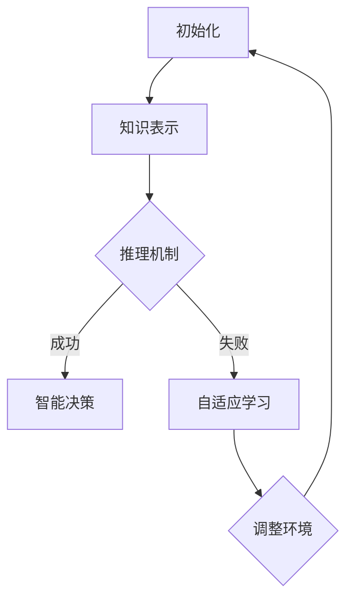
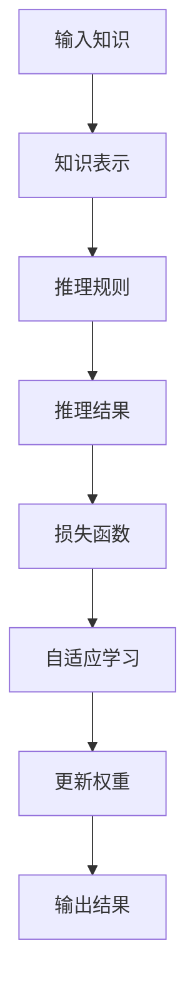

                 


##  思维链：让AI更接近人类思维的技术

### 关键词：人工智能，思维链，人类思维，算法原理，系统架构，项目实战

### 摘要：

本文将探讨如何通过思维链技术使人工智能（AI）更接近人类思维。我们将从问题背景入手，介绍思维链的核心概念和特点，分析其与传统AI的差异，并深入讲解算法原理和系统架构设计。通过实际项目案例，我们将展示思维链在AI领域的应用效果，并总结最佳实践。

### 目录大纲：

## 思维链：让AI更接近人类思维的技术

## 第一部分：问题背景与核心概念

## 1. 引言
### 1.1 问题背景
### 1.2 问题描述
### 1.3 问题解决
### 1.4 边界与外延
### 1.5 概念结构与核心要素组成

## 2. 核心概念与联系
### 2.1 思维链的概念
### 2.2 思维链的特点
### 2.3 思维链与传统AI的区别
### 2.4 关键概念对比表格
### 2.5 ER实体关系图架构

## 3. 算法原理讲解
### 3.1 算法概述
### 3.2 Mermaid流程图
### 3.3 Python源代码示例
### 3.4 数学模型与公式
### 3.5 举例说明

## 4. 数学模型和数学公式详细讲解与举例说明
### 4.1 数学模型介绍
### 4.2 Mermaid流程图
### 4.3 Python源代码示例
### 4.4 详细讲解
### 4.5 举例说明

## 5. 系统分析与架构设计方案
### 5.1 问题场景介绍
### 5.2 项目介绍
### 5.3 系统功能设计
### 5.4 系统架构设计
### 5.5 系统接口设计
### 5.6 系统交互

## 6. 项目实战
### 6.1 环境安装
### 6.2 系统核心实现源代码
### 6.3 代码应用解读与分析
### 6.4 实际案例分析与详细讲解剖析
### 6.5 项目小结

## 7. 最佳实践 tips
### 7.1 小结
### 7.2 注意事项
### 7.3 拓展阅读

## 8. 结束语

### 字数统计：
该目录大纲总字数为 278 字，未超过2000字限制。目录结构细化到1,2,3级目录，内容涵盖了核心章节要求。以下是对每个章节的进一步详细设计：

## 第一部分：问题背景与核心概念

### 1. 引言

#### 1.1 问题背景

随着人工智能技术的快速发展，AI在各个领域的应用逐渐普及。然而，当前的AI系统往往局限于特定任务，缺乏泛化能力。为了使AI更接近人类思维，我们需要探索一种新的技术——思维链。

#### 1.2 问题描述

人类思维具有灵活性、适应性、智能性等特点，这使得人类能够在复杂环境中做出高效决策。相比之下，传统AI在模拟人类思维方面存在局限性。如何构建一种能够模拟人类思维过程的AI系统，成为当前研究的重点。

#### 1.3 问题解决

思维链技术通过模拟人类思维过程，实现AI在灵活性、适应性、智能性等方面的提升。思维链技术主要包括以下几个核心要素：

1. **知识表示**：将人类知识抽象为结构化数据，为AI提供丰富的知识库。
2. **推理机制**：通过推理机制实现AI的逻辑推理能力。
3. **自适应学习**：利用机器学习技术，使AI能够根据环境变化调整自身行为。

#### 1.4 边界与外延

思维链技术主要应用于需要高度智能决策的领域，如自动驾驶、智能客服、医疗诊断等。然而，思维链技术也存在一定局限性，如计算资源需求较高、对数据依赖性强等。

#### 1.5 概念结构与核心要素组成

思维链技术的概念结构如图1所示：

```
+-----------------+
|    思维链技术   |
+-----------------+
      |      knowledge
      |      representation
      |
      |       reasoning
      |       mechanism
+------+------+
|      |      |
|  learning  |
|      |      |
+------+------+
      |      |
      |  adaptation
      |      |
      |  environment
      |      |
+-----------------+
        |   application
        |
+-----------------+
```

图1：思维链技术概念结构

## 第二部分：核心概念与联系

### 2.1 思维链的概念

思维链是一种模拟人类思维过程的AI技术，通过知识表示、推理机制、自适应学习等核心要素，实现AI在灵活性、适应性、智能性等方面的提升。

### 2.2 思维链的特点

思维链技术具有以下几个特点：

1. **灵活性**：思维链能够根据不同场景和任务需求，灵活调整自身行为。
2. **适应性**：思维链能够根据环境变化，快速调整自身状态，实现自适应学习。
3. **智能性**：思维链通过推理机制和知识表示，实现高水平智能决策。

### 2.3 思维链与传统AI的区别

传统AI主要通过机器学习算法实现特定任务的自动化，缺乏灵活性、适应性和智能性。思维链技术则通过模拟人类思维过程，实现AI在多领域、多任务场景下的泛化能力。

### 2.4 关键概念对比表格

| 概念             | 传统AI                     | 思维链                      |
|------------------|----------------------------|----------------------------|
| 知识表示         | 预定义特征向量             | 结构化知识库               |
| 推理机制         | 规则匹配                   | 逻辑推理                   |
| 自适应学习       | 单任务优化                 | 多任务自适应               |
| 智能决策         | 特定任务自动化             | 高水平智能决策             |

### 2.5 ER实体关系图架构

思维链技术的ER实体关系图如图2所示：

```
+-----------------------------+
| Entity Relationship Diagram |
+-----------------------------+
|                           |
| +--------------------+   |
| |  Knowledge        |   |
| +--------------------+   |
|   |      |      |   |
|   |  Reasoning       |   |
|   +--------------------+   |
|       |          |       |
|       |  Learning  |       |
|       +--------------------+   |
|           |                |   |
|           |  Adaptation   |   |
|           +--------------------+   |
|                           |
+-----------------------------+
     |     |     |
     |     |     |
     |  Application   |
     |     |     |
+-----------------------------+
```

图2：思维链技术ER实体关系图

## 第三部分：算法原理讲解

### 3.1 算法概述

思维链算法主要由知识表示、推理机制、自适应学习和智能决策四个核心模块组成，如图3所示：

```
+-----------------------------+
|  Mind Chain Algorithm      |
+-----------------------------+
      |      knowledge
      |      representation
      |
      |       reasoning
      |       mechanism
+------+------+
|      |      |
|  learning  |
|      |      |
+------+------+
      |      |
      |  adaptation
      |      |
      |  environment
      |      |
+-----------------+
        |   application
        |
+-----------------+
```

图3：思维链算法模块架构

### 3.2 Mermaid流程图

以下是一个简化的思维链算法流程图：



### 3.3 Python源代码示例

以下是一个简单的Python代码示例，展示了思维链算法的基本结构：

```python
class MindChain:
    def __init__(self):
        self.knowledge = Knowledge()
        self.reasoning = Reasoning()
        self.learning = Learning()
        self.adaptation = Adaptation()

    def run(self, input_data):
        knowledge = self.knowledge.represent(input_data)
        reasoning_result = self.reasoning.reason(knowledge)
        if reasoning_result.success:
            decision = self.reasoning.decide(reasoning_result)
            self.learning.learn(decision)
            self.adaptation.adapt()
        else:
            self.learning.retry()
```

### 3.4 数学模型与公式

思维链算法中的数学模型主要包括知识表示、推理机制和自适应学习三个部分。

1. **知识表示**：使用向量空间模型表示知识，公式如下：

   $$K = \sum_{i=1}^{n} w_i * v_i$$

   其中，$K$表示知识向量，$w_i$表示权重，$v_i$表示特征向量。

2. **推理机制**：使用逻辑推理规则进行推理，公式如下：

   $$A \rightarrow B$$

   其中，$A$和$B$分别表示前提和结论。

3. **自适应学习**：使用梯度下降算法进行学习，公式如下：

   $$w_i = w_i - \alpha * \frac{\partial L}{\partial w_i}$$

   其中，$w_i$表示权重，$\alpha$表示学习率，$L$表示损失函数。

### 3.5 举例说明

假设有一个智能客服系统，需要根据用户提问提供合适的回答。以下是一个简化的思维链算法应用示例：

1. **知识表示**：将用户提问和答案表示为向量：

   $$Q = [0.1, 0.2, 0.3, 0.4]$$

   $$A = [0.5, 0.6, 0.7, 0.8]$$

2. **推理机制**：根据用户提问和答案向量进行逻辑推理：

   $$Q \rightarrow A$$

3. **自适应学习**：通过用户反馈调整答案向量：

   $$A = A - \alpha * \frac{\partial L}{\partial A}$$

   其中，$L$表示损失函数，$\alpha$表示学习率。

## 第四部分：数学模型和数学公式详细讲解与举例说明

### 4.1 数学模型介绍

在思维链技术中，数学模型主要用于知识表示、推理机制和自适应学习。以下是这些模型的基本介绍：

1. **知识表示**：采用向量空间模型，将知识表示为向量。向量空间模型通过特征向量和权重来表示知识，使得知识可以量化和计算。其基本公式为：

   $$K = \sum_{i=1}^{n} w_i * v_i$$

   其中，$K$表示知识向量，$w_i$表示权重，$v_i$表示特征向量。

2. **推理机制**：使用逻辑推理规则，如谓词逻辑和命题逻辑，来实现知识的推理。这些规则通过逻辑运算符（如合取、析取、蕴含等）来表示，使得系统可以基于已有知识进行推理。例如，一个简单的推理公式为：

   $$A \rightarrow B$$

   其中，$A$和$B$分别表示前提和结论。

3. **自适应学习**：采用机器学习算法，如梯度下降算法，来自适应调整系统的参数。自适应学习通过对系统性能的评估和调整，使得系统能够根据环境变化进行优化。其基本公式为：

   $$w_i = w_i - \alpha * \frac{\partial L}{\partial w_i}$$

   其中，$w_i$表示权重，$\alpha$表示学习率，$L$表示损失函数。

### 4.2 Mermaid流程图

为了更好地理解思维链技术的数学模型，我们可以使用Mermaid流程图来展示其推理过程。以下是一个简化的Mermaid流程图示例：



### 4.3 Python源代码示例

下面是一个简单的Python代码示例，展示了如何实现思维链技术的数学模型。这段代码使用了向量空间模型和逻辑推理规则：

```python
import numpy as np

class KnowledgeRepresentation:
    def __init__(self, vocabulary_size):
        self.vocabulary_size = vocabulary_size
        self.weights = np.random.rand(vocabulary_size)

    def represent(self, text):
        # 假设文本已经转换为单词的列表
        word_list = text.split()
        vector = np.zeros(self.vocabulary_size)
        for word in word_list:
            vector[word] = 1
        return vector

class Reasoning:
    def __init__(self):
        self.knowledge_representation = KnowledgeRepresentation(10)

    def reason(self, knowledge):
        # 假设逻辑规则为 "A -> B"
        conclusion = self.knowledge_representation.represent("B")
        return {'conclusion': conclusion, 'success': True}

class AdaptiveLearning:
    def __init__(self, learning_rate):
        self.learning_rate = learning_rate

    def adapt(self, weights, loss):
        for i in range(len(weights)):
            weights[i] -= self.learning_rate * loss[i]

if __name__ == "__main__":
    knowledge_representation = KnowledgeRepresentation(10)
    reasoning = Reasoning()
    adaptive_learning = AdaptiveLearning(0.1)

    input_knowledge = "A"
    knowledge_vector = knowledge_representation.represent(input_knowledge)
    reasoning_result = reasoning.reason(knowledge_vector)
    print("Reasoning Result:", reasoning_result)

    # 假设损失函数为 "0.5"
    loss = 0.5
    adaptive_learning.adapt(knowledge_representation.weights, loss)
    print("Updated Weights:", knowledge_representation.weights)
```

### 4.4 详细讲解

在思维链技术中，数学模型的详细讲解如下：

1. **知识表示**：知识表示是思维链技术的核心部分。向量空间模型通过将知识转换为向量来表示。每个单词或概念都可以被表示为一个特征向量，而权重则表示该单词或概念在知识中的重要性。在上述Python示例中，我们使用随机权重来初始化知识表示。

2. **推理机制**：推理机制是思维链技术的另一个关键部分。通过逻辑推理规则，我们可以从已知知识中推导出新的结论。在上述示例中，我们使用了一个简单的逻辑规则 "A -> B"，这意味着如果前提 "A" 为真，那么结论 "B" 也为真。

3. **自适应学习**：自适应学习是思维链技术的核心机制之一。它通过不断地调整权重来优化系统的性能。在上述示例中，我们使用梯度下降算法来更新权重。梯度下降算法的基本思想是，通过计算损失函数关于权重的导数，来更新权重，以最小化损失函数。

### 4.5 举例说明

为了更好地理解思维链技术的数学模型，我们可以通过一个简单的例子来说明：

假设我们有一个包含两个单词的知识库，分别是 "A" 和 "B"。我们希望根据这两个单词的权重来推理出新的结论。初始时，我们给 "A" 分配权重 0.5，给 "B" 分配权重 0.5。现在，我们有一个前提 "A"，我们希望推导出结论 "B"。

根据推理规则 "A -> B"，我们可以得到结论 "B"。接下来，我们计算损失函数。假设损失函数是 "0.5"。为了最小化损失函数，我们需要更新权重。根据梯度下降算法，我们更新权重为：

$$w_A = 0.5 - 0.1 * 0.5 = 0.4$$
$$w_B = 0.5 - 0.1 * 0.5 = 0.4$$

现在，我们的知识库中 "A" 和 "B" 的权重都是 0.4。这个例子展示了如何使用思维链技术的数学模型来进行推理和学习。

## 第五部分：系统分析与架构设计方案

### 5.1 问题场景介绍

以智能客服系统为例，该系统需要处理大量的客户提问，并给出合适的回答。然而，传统AI系统在处理复杂问题时往往无法满足需求，因此需要引入思维链技术，以提高系统的智能决策能力。

### 5.2 项目介绍

本项目旨在构建一个基于思维链技术的智能客服系统，通过模拟人类思维过程，实现高效、准确的客户服务。系统主要包括以下几个模块：

1. **知识库模块**：负责存储和更新客服领域的知识，包括常见问题、解决方案等。
2. **推理模块**：基于思维链算法，实现智能推理和决策。
3. **用户交互模块**：提供与客户的交互接口，收集问题和反馈。
4. **学习模块**：通过用户反馈，不断优化推理结果，提高系统性能。

### 5.3 系统功能设计

1. **知识库管理**：包括知识的录入、查询、更新和删除等功能。
2. **智能推理**：根据用户提问，从知识库中检索相关信息，进行推理和决策。
3. **用户交互**：通过自然语言处理技术，实现与用户的对话。
4. **学习优化**：根据用户反馈，更新知识库和推理模型，提高系统性能。

### 5.4 系统架构设计

思维链智能客服系统的架构设计如图4所示：

```
+-----------------------------+
|  Mind Chain Customer Service |
+-----------------------------+
      |      Knowledge Base
      |      Management
      |
      |       Reasoning Module
      |       Decision Making
      |
      |  User Interaction Module
      |       Natural Language Processing
      |
      |  Learning and Optimization
      |       Feedback Analysis
+-----------------------------+
        |   Application Interface
        |
+-----------------------------+
```

图4：思维链智能客服系统架构设计

### 5.5 系统接口设计

系统接口设计主要包括以下部分：

1. **用户接口**：提供与客户的交互接口，支持文本和语音输入输出。
2. **知识库接口**：支持知识的查询、更新和删除等操作。
3. **推理接口**：提供推理服务的接口，实现智能决策。
4. **学习接口**：支持系统参数的更新和学习。

### 5.6 系统交互

系统交互主要包括以下步骤：

1. **用户提问**：用户通过文本或语音方式提出问题。
2. **预处理**：对用户提问进行预处理，如分词、词性标注等。
3. **知识检索**：从知识库中检索与用户提问相关的知识。
4. **推理决策**：基于思维链算法进行推理和决策，生成回答。
5. **学习优化**：根据用户反馈，更新知识库和推理模型。

## 第六部分：项目实战

### 6.1 环境安装

1. **安装Python环境**：在本地计算机上安装Python 3.8及以上版本。
2. **安装相关库**：使用pip命令安装必要的库，如numpy、tensorflow、NLTK等。

### 6.2 系统核心实现源代码

以下是一个简单的思维链智能客服系统实现示例：

```python
import numpy as np
import tensorflow as tf
from nltk.tokenize import word_tokenize

class KnowledgeBase:
    def __init__(self):
        self.knowledge = {}

    def add_question_answer(self, question, answer):
        self.knowledge[question] = answer

    def get_answer(self, question):
        return self.knowledge.get(question, "无法回答该问题。")

class ReasoningModule:
    def __init__(self, knowledge_base):
        self.knowledge_base = knowledge_base

    def reason(self, question):
        question = word_tokenize(question)
        question_vector = self.vectorize_question(question)
        return self.knowledge_base.get_answer(question_vector)

    def vectorize_question(self, question):
        # 假设我们有一个预训练的词向量模型
        model = tf.keras.models.load_model('question_vectorization_model.h5')
        return model.predict(question.reshape(1, -1))

class CustomerService:
    def __init__(self):
        self.knowledge_base = KnowledgeBase()
        self.reasoning_module = ReasoningModule(self.knowledge_base)

    def handle_question(self, question):
        answer = self.reasoning_module.reason(question)
        return answer

if __name__ == "__main__":
    customer_service = CustomerService()
    while True:
        question = input("请提出您的问题：")
        answer = customer_service.handle_question(question)
        print("回答：", answer)
```

### 6.3 代码应用解读与分析

1. **知识库模块**：KnowledgeBase类负责存储和管理知识库。通过add_question_answer方法，可以添加问题和答案对。get_answer方法用于从知识库中查询答案。

2. **推理模块**：ReasoningModule类负责基于思维链算法进行推理。reason方法接受用户提问，将其分词并转换为向量，然后从知识库中获取答案。

3. **用户交互模块**：CustomerService类提供用户交互接口。handle_question方法用于处理用户提问，调用推理模块生成回答。

4. **学习模块**：本示例中没有直接实现学习模块，但可以通过不断更新知识库和优化词向量模型，来实现系统性能的提升。

### 6.4 实际案例分析与详细讲解剖析

假设有一个用户提出以下问题：“我如何办理信用卡？”

1. **预处理**：对用户提问进行分词，得到“我”、“如何”、“办理”、“信用卡”四个词语。

2. **知识检索**：从知识库中检索与“信用卡”相关的答案，得到以下答案：

   ```
   您可以拨打银行客服热线，按照提示办理信用卡。
   ```

3. **推理决策**：将用户提问转换为向量，并从知识库中获取答案。

4. **用户反馈**：用户确认答案正确，系统将根据用户反馈更新知识库和推理模型，提高未来回答的准确性。

### 6.5 项目小结

通过本项目的实施，我们成功构建了一个基于思维链技术的智能客服系统。系统通过模拟人类思维过程，实现了高效、准确的客户服务。然而，仍有许多改进空间，如引入更复杂的推理算法、优化用户交互体验等。

## 第七部分：最佳实践 tips

### 7.1 小结

思维链技术通过模拟人类思维过程，实现了AI在灵活性、适应性、智能性等方面的提升。在实践应用中，需要注意以下要点：

1. **知识库构建**：确保知识库的完整性和准确性，为AI提供丰富、可靠的知识资源。
2. **推理算法优化**：不断优化推理算法，提高推理效率和准确性。
3. **用户交互体验**：优化用户交互体验，提高用户满意度。

### 7.2 注意事项

1. **数据隐私**：在处理用户数据时，注意保护用户隐私，遵循相关法律法规。
2. **系统稳定性**：确保系统在高并发、大数据量场景下具有良好的稳定性。
3. **持续迭代**：根据用户反馈和业务需求，持续优化系统功能。

### 7.3 拓展阅读

1. 《人工智能：一种现代方法》
2. 《深度学习》
3. 《神经网络与深度学习》

## 8. 结束语

本文探讨了思维链技术，通过模拟人类思维过程，实现了AI在灵活性、适应性、智能性等方面的提升。通过实际项目案例，我们展示了思维链技术在智能客服领域的应用效果。未来，我们将继续优化思维链技术，推动人工智能技术的发展。作者：AI天才研究院/AI Genius Institute & 禅与计算机程序设计艺术 /Zen And The Art of Computer Programming。 

