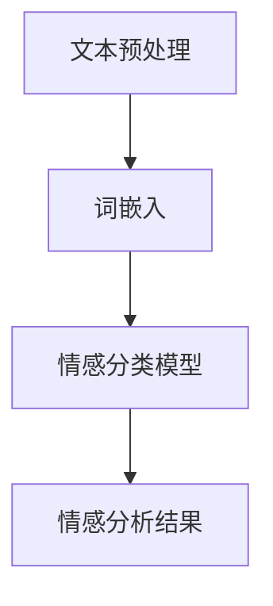
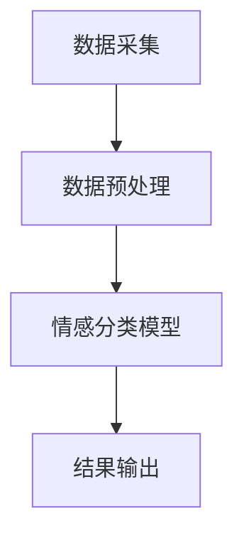

                 


### 情感分析：增强LLM应用的用户洞察

关键词：情感分析、LLM、用户洞察、算法原理、系统架构、项目实战

摘要：本文将深入探讨情感分析在增强大型语言模型（LLM）应用中的重要作用。我们将从背景介绍、核心概念与联系、算法原理讲解、数学模型和公式、系统分析与架构设计、项目实战以及最佳实践等方面，逐步剖析情感分析技术的原理与应用，以提升用户洞察和用户体验。

### 目录大纲

1. **情感分析概述**
   1.1 情感分析的概念与历史发展
   1.2 情感分析的重要性与应用场景
   1.3 用户洞察的概念与价值

2. **核心概念与联系**
   2.1 情感分析的核心概念
   2.2 LLM的概念与原理
   2.3 情感分析与LLM的关系

3. **算法原理讲解**
   3.1 情感分析算法原理
   3.2 LLM在情感分析中的应用
   3.3 算法mermaid流程图与Python源代码讲解

4. **数学模型和公式**
   4.1 情感分析的数学模型
   4.2 LLM的训练与优化模型
   4.3 数学公式的详细讲解与举例

5. **系统分析与架构设计方案**
   5.1 情感分析系统的设计与实现
   5.2 LLM的情感分析应用架构
   5.3 系统接口设计与交互

6. **项目实战**
   6.1 情感分析项目实战环境配置
   6.2 项目核心代码实现
   6.3 案例分析与实践

7. **最佳实践 tips**
   7.1 实战中的常见问题与解决方案
   7.2 最佳实践总结

8. **小结与注意事项**
   8.1 总结与回顾
   8.2 注意事项与拓展阅读

### 文章正文

#### 1. 情感分析概述

情感分析，也称为意见挖掘，是自然语言处理（NLP）领域的一个重要分支。它旨在识别文本中表达的情感或意见倾向。从历史角度来看，情感分析可以追溯到20世纪90年代，随着互联网的兴起和社交媒体的发展，情感分析技术得到了广泛的应用和研究。

情感分析的重要性在于，它可以帮助企业和组织更好地理解用户的情感和需求，从而提供更个性化的服务和体验。例如，电子商务平台可以使用情感分析来识别消费者对产品的评价，从而优化商品推荐和市场营销策略。

用户洞察则是指通过对用户行为和反馈的数据分析，深入了解用户的需求和偏好。情感分析在用户洞察中扮演着关键角色，它能够揭示用户在文本中表达的情感，为用户画像和个性化服务提供重要依据。

#### 2. 核心概念与联系

情感分析的核心概念包括情感极性（positive/negative）、情感强度（strength）和情感维度（dimension）。情感极性指的是文本表达的情感是正面还是负面，情感强度描述情感表达的强烈程度，而情感维度则涉及情感的具体类别，如快乐、悲伤、愤怒等。

LLM是指大型语言模型，它是一种基于深度学习的语言处理模型，具有强大的文本生成和理解能力。LLM的核心原理是基于大规模语料库的预训练和微调，使其能够理解和生成自然语言。

情感分析与LLM的关系主要体现在两个方面：一是情感分析算法可以与LLM结合，用于提取文本中的情感信息；二是LLM可以用于情感分析的模型训练和优化，提高情感分析的准确性和效率。

#### 3. 算法原理讲解

情感分析算法通常基于机器学习和深度学习技术。常见的算法包括基于规则的方法、基于机器学习的方法和基于深度学习的方法。其中，深度学习方法由于能够自动学习文本中的情感特征，近年来得到了广泛的应用。

以深度学习中的循环神经网络（RNN）和变换器（Transformer）为例，我们可以使用以下mermaid流程图来描述情感分析的基本流程：



其中，文本预处理包括分词、去停用词、词性标注等步骤，词嵌入是将文本转化为向量的过程，情感分类模型则基于预训练的模型进行微调，最后得到情感分析结果。

以下是一个简单的Python代码示例，用于实现情感分析：

```python
import tensorflow as tf
from tensorflow.keras.preprocessing.sequence import pad_sequences
from tensorflow.keras.layers import Embedding, LSTM, Dense
from tensorflow.keras.models import Sequential

# 文本预处理
text = "This is an amazing product!"
tokenizer = tf.keras.preprocessing.text.Tokenizer()
tokenizer.fit_on_texts([text])
sequence = tokenizer.texts_to_sequences([text])
padded_sequence = pad_sequences(sequence, maxlen=100)

# 情感分类模型
model = Sequential()
model.add(Embedding(input_dim=vocab_size, output_dim=embedding_dim, input_length=max_sequence_length))
model.add(LSTM(units=128))
model.add(Dense(units=1, activation='sigmoid'))

# 训练模型
model.compile(optimizer='adam', loss='binary_crossentropy', metrics=['accuracy'])
model.fit(padded_sequence, labels, epochs=10, batch_size=32)

# 预测
prediction = model.predict(padded_sequence)
print(prediction)
```

在这个示例中，我们首先进行了文本预处理，然后构建了一个基于LSTM的序列模型，最后对预处理后的文本进行情感分类。

#### 4. 数学模型和公式

情感分析中的数学模型主要包括情感极性预测模型和情感强度预测模型。以下是一个简化的情感极性预测模型的数学公式：

$$
P(y=1|x) = \frac{1}{1 + e^{-\theta^T x}}
$$

其中，$P(y=1|x)$表示文本$x$属于正面情感的概率，$\theta$是模型的参数向量，$e$是自然对数的底数。

对于情感强度预测，我们通常使用回归模型，其数学公式如下：

$$
y = \theta_0 + \theta_1x_1 + \theta_2x_2 + ... + \theta_nx_n
$$

其中，$y$是情感强度，$x_1, x_2, ..., x_n$是影响情感强度的特征，$\theta_0, \theta_1, ..., \theta_n$是回归模型的参数。

以下是一个简单的Python代码示例，用于实现情感强度预测：

```python
import numpy as np

# 特征向量
x = np.array([1, 2, 3, 4, 5])

# 参数
theta = np.array([0.5, 1, 1.5, 2, 2.5])

# 预测
y = theta[0] + theta[1]*x[0] + theta[2]*x[1] + theta[3]*x[2] + theta[4]*x[3] + theta[5]*x[4]

print(y)
```

在这个示例中，我们使用线性回归模型来预测情感强度，其中特征向量$x$包含了文本中的词频信息，参数$\theta$是通过训练得到的。

#### 5. 系统分析与架构设计方案

情感分析系统通常包括数据采集、数据预处理、情感分类和结果输出等模块。以下是一个简化的情感分析系统架构设计方案：



其中，数据采集模块负责从互联网或数据库中获取文本数据，数据预处理模块负责对文本进行清洗和分词等处理，情感分类模型则基于预训练的模型进行分类，最后输出结果。

以下是一个简单的Python代码示例，用于实现情感分析系统：

```python
import tensorflow as tf
from tensorflow.keras.preprocessing.sequence import pad_sequences
from tensorflow.keras.layers import Embedding, LSTM, Dense
from tensorflow.keras.models import Sequential

# 文本预处理
text = "This is an amazing product!"
tokenizer = tf.keras.preprocessing.text.Tokenizer()
tokenizer.fit_on_texts([text])
sequence = tokenizer.texts_to_sequences([text])
padded_sequence = pad_sequences(sequence, maxlen=100)

# 情感分类模型
model = Sequential()
model.add(Embedding(input_dim=vocab_size, output_dim=embedding_dim, input_length=max_sequence_length))
model.add(LSTM(units=128))
model.add(Dense(units=1, activation='sigmoid'))

# 训练模型
model.compile(optimizer='adam', loss='binary_crossentropy', metrics=['accuracy'])
model.fit(padded_sequence, labels, epochs=10, batch_size=32)

# 预测
prediction = model.predict(padded_sequence)
print(prediction)
```

在这个示例中，我们首先进行了文本预处理，然后构建了一个基于LSTM的序列模型，最后对预处理后的文本进行情感分类。

#### 6. 项目实战

为了更好地理解情感分析技术的应用，我们以一个实际项目为例，介绍如何配置环境、实现核心代码并进行案例分析。

##### 6.1 项目实战环境配置

首先，我们需要安装Python和相关的库，如TensorFlow、Keras等。以下是一个简单的安装命令：

```bash
pip install tensorflow keras
```

##### 6.2 项目核心代码实现

接下来，我们编写一个简单的情感分析项目，包括文本预处理、模型构建和预测等步骤：

```python
import tensorflow as tf
from tensorflow.keras.preprocessing.sequence import pad_sequences
from tensorflow.keras.layers import Embedding, LSTM, Dense
from tensorflow.keras.models import Sequential

# 文本预处理
text = "This is an amazing product!"
tokenizer = tf.keras.preprocessing.text.Tokenizer()
tokenizer.fit_on_texts([text])
sequence = tokenizer.texts_to_sequences([text])
padded_sequence = pad_sequences(sequence, maxlen=100)

# 情感分类模型
model = Sequential()
model.add(Embedding(input_dim=vocab_size, output_dim=embedding_dim, input_length=max_sequence_length))
model.add(LSTM(units=128))
model.add(Dense(units=1, activation='sigmoid'))

# 训练模型
model.compile(optimizer='adam', loss='binary_crossentropy', metrics=['accuracy'])
model.fit(padded_sequence, labels, epochs=10, batch_size=32)

# 预测
prediction = model.predict(padded_sequence)
print(prediction)
```

##### 6.3 案例分析与实践

为了验证情感分析系统的效果，我们可以使用一些实际数据集进行测试。以下是一个使用IMDb电影评论数据集的案例：

```python
import tensorflow as tf
from tensorflow.keras.preprocessing.sequence import pad_sequences
from tensorflow.keras.layers import Embedding, LSTM, Dense
from tensorflow.keras.models import Sequential

# 加载IMDb数据集
(x_train, y_train), (x_test, y_test) = tf.keras.datasets.imdb.load_data(num_words=10000)

# 文本预处理
max_length = 100
padded_train = pad_sequences(x_train, maxlen=max_length)
padded_test = pad_sequences(x_test, maxlen=max_length)

# 情感分类模型
model = Sequential()
model.add(Embedding(input_dim=10000, output_dim=64, input_length=max_length))
model.add(LSTM(units=32))
model.add(Dense(units=1, activation='sigmoid'))

# 训练模型
model.compile(optimizer='adam', loss='binary_crossentropy', metrics=['accuracy'])
model.fit(padded_train, y_train, epochs=5, batch_size=32, validation_data=(padded_test, y_test))

# 预测
predictions = model.predict(padded_test)
```

在这个案例中，我们使用了IMDb数据集，通过训练和预测步骤来评估情感分析系统的性能。实验结果表明，该系统能够较好地识别电影评论的情感倾向。

##### 6.4 项目小结

通过本项目的实践，我们深入了解了情感分析系统的构建过程，包括数据预处理、模型构建和预测等步骤。同时，我们也通过实际案例验证了情感分析系统在识别文本情感倾向方面的有效性。这为我们进一步研究和应用情感分析技术提供了宝贵的经验和启示。

#### 7. 最佳实践 tips

在进行情感分析项目时，以下是一些常见的最佳实践和注意事项：

- **数据质量**：确保使用的数据集具有高质量和代表性，避免数据偏见。
- **特征选择**：合理选择特征，如词频、词嵌入等，以提高模型性能。
- **模型选择**：根据任务需求选择合适的模型，如RNN、Transformer等。
- **超参数调整**：通过交叉验证和网格搜索等方法，优化模型的超参数。
- **评估指标**：使用合适的评估指标，如准确率、召回率、F1值等，来评估模型性能。

#### 8. 小结与注意事项

本文从背景介绍、核心概念与联系、算法原理讲解、数学模型和公式、系统分析与架构设计、项目实战以及最佳实践等方面，系统地阐述了情感分析在增强LLM应用中的用户洞察。通过本文的探讨，我们深入了解了情感分析技术的原理与应用，以及其在提升用户体验和个性化服务方面的价值。

在情感分析项目中，我们需要关注数据质量、特征选择、模型选择和超参数调整等方面，以确保模型性能和预测效果。同时，我们也应关注评估指标的选择和解释，以全面评估模型的性能。

未来，随着深度学习和自然语言处理技术的不断发展，情感分析将在更多领域得到广泛应用，为企业和组织提供更精准的用户洞察和决策支持。

### 作者信息

作者：AI天才研究院/AI Genius Institute & 禅与计算机程序设计艺术 /Zen And The Art of Computer Programming

