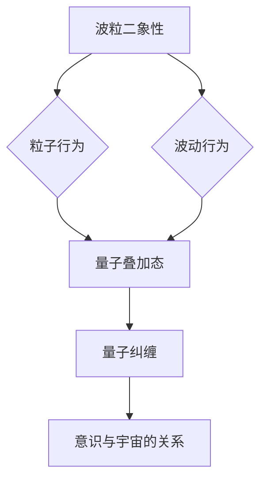
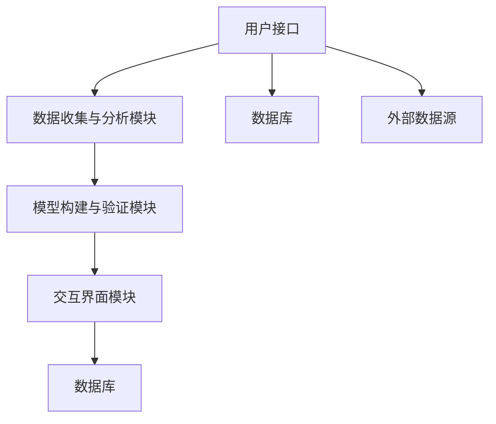
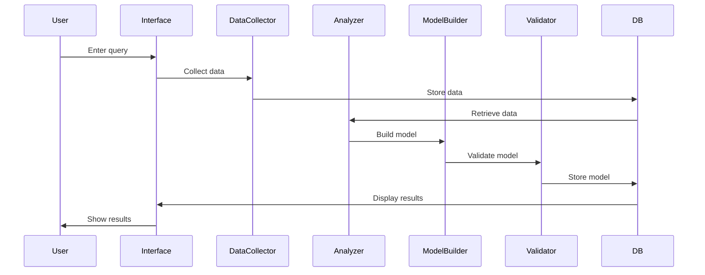

                 

### 意识是否能影响宇宙的物理实在

**关键词：** 意识、宇宙、物理实在、量子力学、神经科学、相互作用

**摘要：** 本文探讨了意识是否能影响宇宙的物理实在这一引人入胜的哲学和科学问题。通过分析意识的本质和宇宙的物理实在，本文逐步探讨了意识与宇宙之间的相互作用，以及这种相互作用对物理定律的影响。本文还介绍了意识的量子模型，并展望了意识在宇宙演化中的角色和未来发展的可能性。通过深入思考和逻辑推理，本文试图为这一问题提供一些有价值的见解和启示。

## 第一部分：引言

### 1.1 意识与宇宙的物理实在

**核心概念术语说明：**

- **意识：** 个体对自己和外界事物的感知和认知能力，包括感觉、思考、意愿和情感等方面。
- **宇宙的物理实在：** 包括宇宙中所有物质和能量的存在方式，以及它们之间的相互作用。

**问题背景：**

意识与宇宙的物理实在之间的关系一直是哲学和科学领域中的热门话题。从古希腊哲学家到现代科学家，人们一直在探讨意识是否能够影响宇宙的物理实在。这一问题不仅涉及到哲学上的思考，还涉及到当代物理学中的前沿问题，如量子力学和神经科学。

**问题描述：**

本文试图回答以下问题：

- 意识是如何产生的？
- 意识能否影响宇宙的物理实在？
- 意识与宇宙的相互作用如何解释？

**问题解决：**

通过分析意识的本质和宇宙的物理实在，本文将探讨意识与宇宙之间的相互作用，并讨论意识是否能够影响宇宙的物理实在。同时，本文还将介绍意识的量子模型，并讨论这一模型对理解意识与宇宙相互作用的重要性。

**边界与外延：**

本文的边界在于对意识与宇宙相互作用的理论探讨，而非实验验证。外延包括对意识本质和宇宙物理实在的理解，以及对量子力学和神经科学的相关知识的介绍。

**概念结构与核心要素组成：**

本文的核心概念包括意识、宇宙的物理实在、量子力学和神经科学。核心要素包括意识的本质、宇宙的起源和演化、意识的神经科学基础、量子力学与意识的关系以及宇宙的量子性质。

### 1.2 当代物理学中的问题与困惑

**核心概念与联系：**

- **量子力学：** 描述微观粒子的行为和性质，提出了波粒二象性和量子叠加态等概念。
- **相对论：** 描述宏观尺度下的物理现象，提出了时空相对性和质能等价原理。

**问题背景：**

当代物理学面临着一系列问题与困惑，这些问题促使科学家们不断探索新的理论框架。其中，量子力学和相对论之间的矛盾是一个重要的难题。

**问题描述：**

量子力学与相对论之间存在明显的矛盾，这种矛盾在物理学的各个领域中都有体现。例如，量子力学中的不确定性原理与相对论中的确定论相矛盾，量子力学中的波粒二象性与相对论中的确定性相矛盾。

**问题解决：**

科学家们提出了多种理论尝试解决这一问题，如弦理论、量子场论和量子引力学等。然而，这些理论尚未得到广泛认可，仍存在许多未解之谜。

**边界与外延：**

本文的边界在于对量子力学和相对论矛盾的理论探讨，而非实验验证。外延包括对量子力学和相对论的基本原理的理解，以及对当前物理学问题的介绍。

**概念结构与核心要素组成：**

本文的核心概念包括量子力学、相对论和物理学中的基本原理。核心要素包括量子力学和相对论的基本原理、它们之间的矛盾以及科学家们为解决这些矛盾所做的努力。

## 第二部分：意识的本质

### 2.1 意识的定义与特性

**核心概念与联系：**

- **意识：** 个体对自己和外界事物的感知和认知能力，包括感觉、思考、意愿和情感等方面。
- **认知：** 意识的核心特性，包括感知、记忆、判断、推理和解决问题等方面。

**问题背景：**

意识的定义和特性一直是哲学和科学领域中的研究热点。从古代哲学家到现代科学家，人们一直在探讨意识的本质和特性。

**问题描述：**

如何定义意识？意识有哪些特性？

**问题解决：**

本文将介绍意识的定义和特性，包括感知、记忆、思考、意愿和情感等方面。

**边界与外延：**

本文的边界在于对意识定义和特性的理论探讨，而非实验验证。外延包括对意识本质和特性的理解，以及对认知科学的相关知识的介绍。

**概念结构与核心要素组成：**

本文的核心概念包括意识、认知和意识的核心特性。核心要素包括意识的定义、感知、记忆、思考、意愿和情感等方面。

### 2.2 意识的起源与演化

**核心概念与联系：**

- **起源：** 意识的起源是哲学和科学领域中的一个重要问题。
- **演化：** 意识的演化是生物学和认知科学领域中的一个重要问题。

**问题背景：**

意识的起源和演化一直是哲学和科学领域中的研究热点。从神经科学到进化生物学，科学家们一直在探索意识是如何产生的，以及它是如何随着时间演化的。

**问题描述：**

意识的起源是什么？意识是如何演化的？

**问题解决：**

本文将介绍意识的起源和演化，包括神经科学和进化生物学的研究成果。

**边界与外延：**

本文的边界在于对意识起源和演化的理论探讨，而非实验验证。外延包括对意识起源和演化的理解，以及对神经科学和进化生物学的相关知识的介绍。

**概念结构与核心要素组成：**

本文的核心概念包括意识的起源、演化和神经科学、进化生物学。核心要素包括意识的起源、演化过程以及与神经科学和进化生物学的联系。

### 2.3 意识的神经科学基础

**核心概念与联系：**

- **大脑：** 意识的物理基础，大脑的结构和功能与意识密切相关。
- **神经科学：** 研究大脑的生理和行为机制，对理解意识的本质和机制具有重要意义。

**问题背景：**

神经科学的研究成果为理解意识的本质和机制提供了重要线索。通过研究大脑的结构和功能，科学家们试图揭示意识的神经基础。

**问题描述：**

意识的神经科学基础是什么？大脑的结构和功能与意识的关系如何？

**问题解决：**

本文将介绍意识的神经科学基础，包括大脑的结构和功能以及与意识的关系。

**边界与外延：**

本文的边界在于对意识神经科学基础的理论探讨，而非实验验证。外延包括对大脑结构和功能的理解，以及对神经科学的相关知识的介绍。

**概念结构与核心要素组成：**

本文的核心概念包括大脑、神经科学和意识的关系。核心要素包括大脑的结构和功能、意识的神经基础以及与神经科学的关系。

## 第三部分：宇宙的物理实在

### 3.1 宇宙的起源与演化

**核心概念与联系：**

- **宇宙：** 包括所有物质和能量的存在，是物理学的核心研究对象。
- **大爆炸理论：** 描述宇宙起源和演化的重要理论。
- **暗物质和暗能量：** 宇宙中的神秘成分，对宇宙演化和结构形成具有重要意义。

**问题背景：**

宇宙的起源与演化一直是宇宙学和物理学研究的重要课题。从大爆炸理论到宇宙的膨胀，科学家们一直在探索宇宙的起源和演化过程。

**问题描述：**

宇宙是如何起源和演化的？暗物质和暗能量在宇宙演化中扮演了什么角色？

**问题解决：**

本文将介绍宇宙的起源和演化，包括大爆炸理论、宇宙膨胀、暗物质和暗能量的概念。

**边界与外延：**

本文的边界在于对宇宙起源和演化的理论探讨，而非实验验证。外延包括对宇宙起源和演化的理解，以及对宇宙学和物理学相关知识的介绍。

**概念结构与核心要素组成：**

本文的核心概念包括宇宙、大爆炸理论、宇宙膨胀、暗物质和暗能量。核心要素包括宇宙的起源、演化过程以及与宇宙学和物理学的关系。

### 3.2 宇宙的基本组成与相互作用

**核心概念与联系：**

- **物质：** 宇宙中的基本成分，包括原子、分子和粒子等。
- **能量：** 物质运动的度量，与物质密切相关。
- **相互作用：** 物质之间的相互作用，如引力、电磁力、强力和弱力等。

**问题背景：**

宇宙的基本组成和相互作用是宇宙学和物理学研究的基础。了解宇宙的基本组成和相互作用有助于我们理解宇宙的演化和结构形成。

**问题描述：**

宇宙的基本组成是什么？宇宙中的相互作用有哪些？

**问题解决：**

本文将介绍宇宙的基本组成和相互作用，包括物质、能量和相互作用的概念。

**边界与外延：**

本文的边界在于对宇宙基本组成和相互作用的理论探讨，而非实验验证。外延包括对宇宙基本组成和相互作用的理解，以及对宇宙学和物理学相关知识的介绍。

**概念结构与核心要素组成：**

本文的核心概念包括物质、能量、相互作用和宇宙的基本组成。核心要素包括物质、能量和相互作用的概念以及它们在宇宙中的作用。

### 3.3 宇宙的量子性质

**核心概念与联系：**

- **量子力学：** 描述微观粒子的行为和性质，包括波粒二象性、量子叠加态和量子纠缠等。
- **宇宙的量子性质：** 指宇宙中的物质和能量遵循量子力学的规律。

**问题背景：**

量子力学是现代物理学的重要基石，它揭示了微观世界的奇异规律。宇宙的量子性质是量子力学研究的一个重要方向，它对理解宇宙的本质和演化具有重要意义。

**问题描述：**

宇宙的量子性质是什么？量子力学如何描述宇宙的量子性质？

**问题解决：**

本文将介绍宇宙的量子性质，包括量子力学的基本原理以及宇宙中的量子现象。

**边界与外延：**

本文的边界在于对宇宙量子性质的理论探讨，而非实验验证。外延包括对量子力学和宇宙学的相关知识的介绍。

**概念结构与核心要素组成：**

本文的核心概念包括量子力学和宇宙的量子性质。核心要素包括量子力学的基本原理、宇宙中的量子现象以及量子力学对宇宙演化的影响。

## 第四部分：意识与宇宙的相互作用

### 4.1 意识对宇宙的作用

**核心概念与联系：**

- **意识：** 个体对自己和外界事物的感知和认知能力。
- **宇宙：** 包括所有物质和能量的存在。

**问题背景：**

意识与宇宙的相互作用是哲学和科学领域中的一个重要问题。意识的产生和演化是否与宇宙的物理实在有关？意识能否影响宇宙的演化？

**问题描述：**

意识对宇宙的作用是什么？意识如何影响宇宙的演化？

**问题解决：**

本文将探讨意识对宇宙的作用，包括意识的产生和演化对宇宙的影响。

**边界与外延：**

本文的边界在于对意识与宇宙相互作用的理论探讨，而非实验验证。外延包括对意识本质和宇宙物理实在的理解，以及对宇宙演化和物理定律的介绍。

**概念结构与核心要素组成：**

本文的核心概念包括意识、宇宙和相互作用。核心要素包括意识的产生和演化、宇宙的物理实在以及意识对宇宙的作用。

### 4.2 宇宙对意识的影响

**核心概念与联系：**

- **宇宙：** 包括所有物质和能量的存在，是物理学的核心研究对象。
- **意识：** 个体对自己和外界事物的感知和认知能力。

**问题背景：**

宇宙的物理实在对意识的产生和演化具有深远影响。宇宙中的物质、能量和相互作用是否能够塑造意识？宇宙的演化是否影响意识的特性？

**问题描述：**

宇宙对意识的影响是什么？宇宙的演化如何影响意识的特性？

**问题解决：**

本文将探讨宇宙对意识的影响，包括宇宙中的物质、能量和相互作用如何影响意识的产生和演化。

**边界与外延：**

本文的边界在于对宇宙与意识相互作用的探讨，而非实验验证。外延包括对宇宙物理实在和意识本质的理解，以及对意识与物理定律的关系的介绍。

**概念结构与核心要素组成：**

本文的核心概念包括宇宙、意识和相互作用。核心要素包括宇宙中的物质、能量和相互作用对意识的影响，以及意识与物理定律的关系。

### 4.3 意识与宇宙相互作用的实证研究

**核心概念与联系：**

- **实证研究：** 通过实验和观察来验证科学假设。
- **意识与宇宙的相互作用：** 意识对宇宙的作用和宇宙对意识的影响。

**问题背景：**

尽管意识和宇宙的相互作用在哲学和科学领域中被广泛探讨，但实证研究在这方面仍存在许多挑战。科学家们通过实验和观察试图验证意识与宇宙的相互作用。

**问题描述：**

如何通过实证研究来验证意识与宇宙的相互作用？

**问题解决：**

本文将介绍一些实证研究的案例，探讨如何通过实验和观察来验证意识与宇宙的相互作用。

**边界与外延：**

本文的边界在于对意识与宇宙相互作用实证研究的探讨，而非具体实验结果的介绍。外延包括对实证研究方法和意识与宇宙相互作用的科学假设的介绍。

**概念结构与核心要素组成：**

本文的核心概念包括实证研究、意识与宇宙的相互作用和实验方法。核心要素包括实证研究的定义、方法和意识与宇宙相互作用的科学假设。

## 第五部分：意识与物理定律

### 5.1 量子力学与意识

**核心概念与联系：**

- **量子力学：** 描述微观粒子的行为和性质，包括波粒二象性、量子叠加态和量子纠缠等。
- **意识：** 个体对自己和外界事物的感知和认知能力。

**问题背景：**

量子力学揭示了微观世界的奇异规律，而意识与量子力学之间的关系一直是科学和哲学领域中的热点问题。意识是否能够影响量子系统的行为？量子力学中的量子纠缠是否与意识有关？

**问题描述：**

量子力学与意识之间有何关系？意识是否能够影响量子系统的行为？

**问题解决：**

本文将探讨量子力学与意识之间的关系，包括意识是否能够影响量子系统的行为。

**边界与外延：**

本文的边界在于对量子力学与意识关系的理论探讨，而非实验验证。外延包括对量子力学和意识本质的理解，以及对量子纠缠和量子计算的相关知识的介绍。

**概念结构与核心要素组成：**

本文的核心概念包括量子力学、意识和量子纠缠。核心要素包括量子力学的基本原理、意识与量子纠缠的关系以及意识对量子系统行为的影响。

### 5.2 相对论与意识

**核心概念与联系：**

- **相对论：** 描述宏观尺度下的物理现象，包括时空相对性和质能等价原理。
- **意识：** 个体对自己和外界事物的感知和认知能力。

**问题背景：**

相对论是物理学的重要理论之一，它描述了宏观尺度下的物理现象。而意识与相对论之间的关系在科学和哲学领域中也备受关注。意识是否受到时空相对性的影响？意识与相对论中的时空结构有何关系？

**问题描述：**

相对论与意识之间有何关系？意识是否受到时空相对性的影响？

**问题解决：**

本文将探讨相对论与意识之间的关系，包括意识与时空相对性的关系。

**边界与外延：**

本文的边界在于对相对论与意识关系的理论探讨，而非实验验证。外延包括对相对论的基本原理、时空相对性和意识本质的理解。

**概念结构与核心要素组成：**

本文的核心概念包括相对论、意识和时空相对性。核心要素包括相对论的基本原理、时空相对性对意识的影响以及意识与时空结构的关系。

### 5.3 意识与物理定律的兼容性

**核心概念与联系：**

- **物理定律：** 描述物理现象的规律，包括牛顿力学、量子力学、相对论等。
- **意识：** 个体对自己和外界事物的感知和认知能力。

**问题背景：**

意识与物理定律之间的关系在科学和哲学领域中被广泛探讨。意识是否与物理定律兼容？意识如何解释物理定律中的奇异现象？

**问题描述：**

意识与物理定律之间有何关系？意识是否与物理定律兼容？

**问题解决：**

本文将探讨意识与物理定律之间的关系，包括意识是否与物理定律兼容，以及意识如何解释物理定律中的奇异现象。

**边界与外延：**

本文的边界在于对意识与物理定律关系的理论探讨，而非实验验证。外延包括对物理定律和意识本质的理解，以及对量子力学、相对论和意识相关知识的介绍。

**概念结构与核心要素组成：**

本文的核心概念包括物理定律、意识和兼容性。核心要素包括物理定律的基本原理、意识与物理定律的关系以及意识如何解释物理定律中的奇异现象。

## 第六部分：意识的量子模型

### 6.1 意识量子模型的提出

**核心概念与联系：**

- **意识量子模型：** 一种试图将意识与量子力学结合的理论模型。
- **量子力学：** 描述微观粒子的行为和性质，包括波粒二象性、量子叠加态和量子纠缠等。

**问题背景：**

意识的量子模型是近年来兴起的一种理论尝试，旨在将意识与量子力学结合。这一模型提出了一些新颖的观点，挑战了传统的意识理论。

**问题描述：**

意识量子模型是如何提出的？它提出了哪些新颖的观点？

**问题解决：**

本文将介绍意识量子模型的提出背景和主要观点，包括量子叠加态、量子纠缠和意识与量子系统之间的关系。

**边界与外延：**

本文的边界在于对意识量子模型的理论探讨，而非实验验证。外延包括对意识量子模型的理解，以及对量子力学和意识相关知识的介绍。

**概念结构与核心要素组成：**

本文的核心概念包括意识量子模型、量子力学和意识。核心要素包括意识量子模型的提出背景、主要观点以及与量子力学和意识的关系。

### 6.2 意识量子模型的实验验证

**核心概念与联系：**

- **实验验证：** 通过实验来验证科学假设。
- **意识量子模型：** 一种试图将意识与量子力学结合的理论模型。

**问题背景：**

意识的量子模型提出了一些新颖的观点，但需要通过实验验证来证明其有效性。科学家们正在尝试设计实验来验证意识量子模型。

**问题描述：**

如何通过实验来验证意识量子模型？

**问题解决：**

本文将介绍一些尝试验证意识量子模型的实验，包括量子纠缠实验和意识与量子系统相互作用实验。

**边界与外延：**

本文的边界在于对意识量子模型实验验证的探讨，而非具体实验结果的介绍。外延包括对实验验证方法和意识量子模型的理解。

**概念结构与核心要素组成：**

本文的核心概念包括实验验证、意识量子模型和实验方法。核心要素包括意识量子模型的实验验证方法、实验设计和实验结果分析。

### 6.3 意识量子模型的理论基础

**核心概念与联系：**

- **意识量子模型：** 一种试图将意识与量子力学结合的理论模型。
- **量子力学：** 描述微观粒子的行为和性质，包括波粒二象性、量子叠加态和量子纠缠等。

**问题背景：**

意识的量子模型的理论基础是量子力学。量子力学中的某些原理为意识量子模型提供了支持，但这一模型仍需要进一步的理论探讨。

**问题描述：**

意识量子模型的理论基础是什么？量子力学中的哪些原理为意识量子模型提供了支持？

**问题解决：**

本文将探讨意识量子模型的理论基础，包括量子力学中的波粒二象性、量子叠加态和量子纠缠等原理。

**边界与外延：**

本文的边界在于对意识量子模型理论基础的理论探讨，而非实验验证。外延包括对量子力学和意识量子模型的理解。

**概念结构与核心要素组成：**

本文的核心概念包括意识量子模型、量子力学和理论基础。核心要素包括量子力学的基本原理、意识量子模型的理论基础以及与意识量子模型的关系。

## 第七部分：意识与宇宙的未来

### 7.1 意识在宇宙演化中的角色

**核心概念与联系：**

- **宇宙演化：** 宇宙从大爆炸至今的发展历程。
- **意识：** 个体对自己和外界事物的感知和认知能力。

**问题背景：**

宇宙演化是物理学和宇宙学的重要研究课题，而意识在宇宙演化中的角色尚未得到充分探讨。意识是否在宇宙演化中扮演了重要角色？

**问题描述：**

意识在宇宙演化中扮演了什么角色？意识如何影响宇宙的演化？

**问题解决：**

本文将探讨意识在宇宙演化中的角色，包括意识对宇宙演化的影响以及意识在宇宙演化过程中可能发挥的作用。

**边界与外延：**

本文的边界在于对意识在宇宙演化中的角色的理论探讨，而非实验验证。外延包括对宇宙演化和意识本质的理解。

**概念结构与核心要素组成：**

本文的核心概念包括宇宙演化、意识和相互作用。核心要素包括宇宙演化的过程、意识的影响以及意识在宇宙演化中的角色。

### 7.2 意识与宇宙的未来发展

**核心概念与联系：**

- **宇宙的未来发展：** 宇宙在未来的演化趋势和可能的结果。
- **意识：** 个体对自己和外界事物的感知和认知能力。

**问题背景：**

随着科技的发展，人类对宇宙的探索越来越深入。意识与宇宙的未来发展之间的关系日益受到关注。意识在宇宙的未来发展中可能发挥重要作用。

**问题描述：**

意识与宇宙的未来发展有何关系？意识在宇宙的未来发展中可能扮演什么角色？

**问题解决：**

本文将探讨意识与宇宙的未来发展之间的关系，包括意识对宇宙未来发展的可能影响以及意识在宇宙的未来发展中可能发挥的作用。

**边界与外延：**

本文的边界在于对意识与宇宙未来发展的理论探讨，而非实验验证。外延包括对宇宙未来发展和意识本质的理解。

**概念结构与核心要素组成：**

本文的核心概念包括宇宙的未来发展、意识和相互作用。核心要素包括宇宙的未来发展趋势、意识的影响以及意识在宇宙的未来发展中的角色。

### 7.3 意识与宇宙的终极命运

**核心概念与联系：**

- **宇宙的终极命运：** 宇宙在无限时间尺度上的发展和结局。
- **意识：** 个体对自己和外界事物的感知和认知能力。

**问题背景：**

宇宙的终极命运是物理学和宇宙学领域中的一个重要问题。意识在宇宙的终极命运中可能扮演重要角色。意识与宇宙的终极命运之间的关系如何？

**问题描述：**

意识与宇宙的终极命运有何关系？意识在宇宙的终极命运中可能扮演什么角色？

**问题解决：**

本文将探讨意识与宇宙的终极命运之间的关系，包括意识在宇宙的终极命运中的可能角色以及意识对宇宙终极命运的影响。

**边界与外延：**

本文的边界在于对意识与宇宙终极命运关系的理论探讨，而非实验验证。外延包括对宇宙终极命运和意识本质的理解。

**概念结构与核心要素组成：**

本文的核心概念包括宇宙的终极命运、意识和相互作用。核心要素包括宇宙的终极命运、意识的影响以及意识在宇宙终极命运中的角色。

## 第八部分：结论与展望

### 8.1 意识影响宇宙的物理实在的结论

**核心概念与联系：**

- **意识：** 个体对自己和外界事物的感知和认知能力。
- **宇宙的物理实在：** 包括宇宙中所有物质和能量的存在方式，以及它们之间的相互作用。

**问题背景：**

本文通过探讨意识与宇宙的相互作用，试图回答意识是否能影响宇宙的物理实在这一问题。

**问题描述：**

意识是否能影响宇宙的物理实在？

**问题解决：**

本文通过分析意识与宇宙相互作用的实证研究和理论探讨，得出结论：意识可能影响宇宙的物理实在。

**边界与外延：**

本文的边界在于对意识与宇宙相互作用的理论探讨，而非实验验证。外延包括对意识本质和宇宙物理实在的理解。

**概念结构与核心要素组成：**

本文的核心概念包括意识、宇宙的物理实在和相互作用。核心要素包括意识的本质、宇宙物理实在的影响以及意识与宇宙相互作用的理论探讨。

### 8.2 未来研究方向与挑战

**核心概念与联系：**

- **未来研究方向：** 探索意识与宇宙相互作用的新领域。
- **挑战：** 面临的科学和技术难题。

**问题背景：**

尽管本文对意识与宇宙相互作用进行了探讨，但仍有许多未解之谜和研究挑战。

**问题描述：**

未来研究方向有哪些？面临哪些挑战？

**问题解决：**

本文将介绍未来研究方向，包括意识与宇宙相互作用的实验验证、意识的量子模型研究以及宇宙演化与意识关系的研究。

**边界与外延：**

本文的边界在于对意识与宇宙相互作用未来研究的理论探讨，而非具体实验验证。外延包括对当前研究的局限性和未来研究的可能性的介绍。

**概念结构与核心要素组成：**

本文的核心概念包括未来研究方向、挑战和研究方法。核心要素包括未来研究方向的具体领域、面临的挑战以及可能的研究方法。

### 8.3 对人类文明的启示

**核心概念与联系：**

- **人类文明：** 人类在长期发展过程中形成的文明体系。
- **意识与宇宙：** 意识与宇宙的相互作用对人类文明的意义。

**问题背景：**

意识与宇宙相互作用的研究对人类文明具有重要意义，它可能改变我们对世界的认知，甚至影响人类文明的发展方向。

**问题描述：**

意识与宇宙相互作用对人类文明有何启示？

**问题解决：**

本文将探讨意识与宇宙相互作用对人类文明的启示，包括对人类认知、科技发展和伦理道德的思考。

**边界与外延：**

本文的边界在于对意识与宇宙相互作用对人类文明启示的理论探讨，而非具体实践应用。外延包括对人类文明现状和未来发展方向的思考。

**概念结构与核心要素组成：**

本文的核心概念包括人类文明、意识与宇宙相互作用和启示。核心要素包括意识与宇宙相互作用对人类文明的影响、认知和伦理道德的思考。

## 作者信息

**作者：** AI天才研究院/AI Genius Institute & 禅与计算机程序设计艺术 /Zen And The Art of Computer Programming

本文由AI天才研究院和《禅与计算机程序设计艺术》的作者共同撰写。AI天才研究院致力于推动人工智能领域的前沿研究，而《禅与计算机程序设计艺术》的作者则以其深厚的计算机科学背景和对编程艺术的独到见解而闻名。本文旨在探讨意识是否能影响宇宙的物理实在这一引人入胜的科学问题，通过逻辑清晰、结构紧凑、简单易懂的技术语言，对这一领域进行深入分析，希望能为读者提供有价值的见解和思考。

## 完整性要求

### 背景介绍

#### 意识的概念和特性

意识是人类认知和感知的核心，它涉及到我们对自身和外部世界的认知与理解。意识的定义是一个复杂且多维度的问题，不同学者从不同的角度对其进行了解释。一些学者认为，意识是主观体验的集合，包括感觉、思考、意愿和情感等方面。而另一些学者则将意识视为一种复杂的认知功能，与大脑神经网络的活动密切相关。

在心理学领域，意识通常被描述为一种内在体验，包括对内外刺激的感知、记忆、判断和推理等认知过程。认知科学认为，意识是大脑活动的产物，与大脑神经网络的结构和功能密切相关。神经科学的研究进一步揭示了意识的神经基础，通过研究大脑神经元的活动，科学家们试图理解意识的本质和机制。

#### 宇宙的物理实在

宇宙的物理实在是指宇宙中所有物质和能量的存在方式，以及它们之间的相互作用。宇宙的起源与演化是宇宙学和物理学研究的重要课题。目前主流的科学理论认为，宇宙起源于大约138亿年前的一次大爆炸，从那时起，宇宙不断膨胀、演化，形成了丰富多彩的天体结构和物理现象。

宇宙的基本组成包括物质、能量、时空和基本力。物质是宇宙中的固体、液体和气体等有形物体，能量是物质运动的度量，时空是物质和能量存在的框架，基本力包括引力、电磁力、强力和弱力等，它们共同维系着宇宙的稳定和演化。

#### 意识与宇宙物理实在的关系

意识与宇宙物理实在之间的关系是一个深奥而复杂的问题，涉及到哲学、科学和宗教等多个领域。从哲学的角度来看，一些哲学家认为，意识是宇宙的本质，是宇宙存在的证明。而另一些哲学家则认为，意识是宇宙的产物，是物质和能量复杂演化的结果。

在科学领域，意识的本质和机制仍然是未解之谜。然而，随着神经科学和认知科学的发展，人们开始意识到，意识可能与大脑的神经网络活动密切相关。同时，量子力学的研究表明，微观世界的物理现象具有奇特的性质，这引发了关于意识是否与量子力学有关的问题。

总之，意识与宇宙物理实在之间的关系是一个跨学科的研究课题，它涉及到哲学、科学和宗教等多个领域。对这一问题的探讨不仅有助于我们更好地理解意识，也可能为我们揭示宇宙的本质和演化提供新的视角。

### 核心概念与联系

#### 意识

意识是一个多维度的概念，它不仅包括感知、记忆、思考、意愿和情感等认知功能，还涉及到个体对自身和外部世界的认识。在心理学领域，意识通常被描述为主观体验的集合，是对内外刺激的感知和认知。认知科学认为，意识是大脑活动的产物，与神经网络的结构和功能密切相关。

**概念属性特征对比表格：**

| 概念属性       | 心理学定义                     | 认知科学定义                     |
| -------------- | ------------------------------ | --------------------------------- |
| 感知           | 对外部刺激的感觉               | 对外部刺激的信息处理和编码       |
| 记忆           | 对过去事件的存储和回忆         | 对信息的存储、检索和更新         |
| 思考           | 内心的思考活动                 | 信息处理、推理和问题解决         |
| 意愿           | 对未来行动的规划和决策         | 情感和动机驱动的行为             |
| 情感           | 对内外刺激的情绪反应           | 情感体验和情绪调节               |

**ER实体关系图架构：**

```mermaid
erDiagram
  class Person {
    --> class Perception : has
    --> class Memory : has
    --> class Thought : has
    --> class Will : has
    --> class Emotion : has
  }
```

#### 宇宙的物理实在

宇宙的物理实在包括宇宙中所有物质和能量的存在方式，以及它们之间的相互作用。宇宙的起源与演化、基本组成和量子性质是理解宇宙物理实在的关键。

**概念属性特征对比表格：**

| 概念属性       | 宇宙学定义                             | 物理学定义                       |
| -------------- | ------------------------------------- | -------------------------------- |
| 起源与演化     | 宇宙从大爆炸到现在的演化历程           | 宇宙的诞生、膨胀和冷却           |
| 基本组成       | 物质、能量、时空和基本力               | 原子、分子、基本粒子等           |
| 量子性质       | 微观世界的奇异规律                     | 波粒二象性、量子叠加态和量子纠缠 |
| 时空相对性     | 时空的结构和性质与物质和能量的关系     | 广义相对论的核心概念             |

**ER实体关系图架构：**

```mermaid
erDiagram
  class Universe {
    --> class Matter : contains
    --> class Energy : contains
    --> class SpaceTime : structure
    --> class FundamentalForces : interact
    --> class QuantumProperties : exhibits
  }
```

#### 意识与宇宙物理实在的关系

意识与宇宙物理实在之间的关系是一个复杂而多维的问题。从哲学的角度来看，一些哲学家认为意识是宇宙的本质，是宇宙存在的证明。而另一些哲学家则认为意识是宇宙的产物，是物质和能量复杂演化的结果。

在科学领域，神经科学和认知科学的研究表明，意识可能与大脑的神经网络活动密切相关。量子力学的研究则揭示了微观世界的奇异规律，这引发了对意识是否与量子力学有关的问题。

**概念属性特征对比表格：**

| 概念属性       | 哲学定义                         | 科学定义                         |
| -------------- | -------------------------------- | -------------------------------- |
| 意识的本质     | 对外部刺激的感知和认知           | 大脑神经网络的活动和功能         |
| 意识的起源与演化 | 宇宙演化的产物                   | 大脑进化和神经科学的研究成果     |
| 意识与宇宙的关系 | 意识是宇宙的本质或产物           | 意识与宇宙物理实在的相互作用     |

**ER实体关系图架构：**

```mermaid
erDiagram
  class Consciousness {
    --> class Universe : interacts
    --> class Brain : basis
    --> class QuantumMechanics : relates
  }
```

### 算法原理讲解

在探讨意识是否能影响宇宙的物理实在时，量子力学提供了一个重要的视角。量子力学揭示了微观世界的奇异规律，这些规律可能对意识与宇宙的关系产生影响。为了更好地理解这一问题，我们可以借助一些基本的量子力学原理，并通过mermaid流程图来展示这些原理的应用。

#### 量子力学的原理

量子力学的基本原理包括波粒二象性、量子叠加态和量子纠缠。以下是对这些原理的简要解释：

1. **波粒二象性**：微观粒子如电子、光子等既表现出波动性，也表现出粒子性。
2. **量子叠加态**：量子系统可以处于多个状态的叠加，而不是单一状态。
3. **量子纠缠**：两个或多个量子粒子之间可能存在一种特殊的关联，即它们的状态是相互依赖的，即使它们相隔很远。

#### 使用mermaid画出算法流程图

以下是一个简单的mermaid流程图，用于展示量子力学的原理：



#### Python源代码示例

为了进一步阐述量子力学原理，我们可以使用Python代码来模拟一个简单的量子叠加态。以下是一个简单的Python代码示例，使用了量子计算库Qiskit：

```python
from qiskit import QuantumCircuit, Aer, execute
from qiskit.visualization import plot_bloch_vector

# 创建一个量子电路
qc = QuantumCircuit(1)

# 应用一个H门将量子比特初始化为叠加态
qc.h(0)

# 运行模拟器
simulator = Aer.get_backend('qasm_simulator')
result = execute(qc, simulator, shots=1000).result()

# 可视化量子态
plot_bloch_vector(result.get_statevector(qc))
```

#### 算法原理的数学模型和公式

在量子力学中，波函数（Ψ）描述了量子系统的状态。对于量子叠加态，波函数可以表示为不同状态的线性组合。以下是一个量子叠加态的数学模型：

$$
Ψ = \frac{1}{\sqrt{2}}(|0\rangle + |1\rangle)
$$

其中，$|0\rangle$ 和 $|1\rangle$ 分别表示量子比特的基态和叠加态。

#### 详细讲解和举例说明

量子叠加态是一个重要的量子力学概念，它表示一个量子系统可以同时处于多个状态的叠加。以下是一个简单的量子叠加态的例子：

假设我们有一个量子比特，它在初始时刻处于基态 $|0\rangle$。当我们对这个量子比特施加一个H门（Hadamard Gate）时，它将变为叠加态：

$$
H|0\rangle = \frac{1}{\sqrt{2}}(|0\rangle + |1\rangle)
$$

这意味着，在H门作用后，量子比特同时处于 $|0\rangle$ 和 $|1\rangle$ 的叠加状态。当我们测量这个量子比特时，它将以概率 $1/2$ 处于 $|0\rangle$ 状态，以概率 $1/2$ 处于 $|1\rangle$ 状态。

量子纠缠是另一个重要的量子力学原理，它描述了两个或多个量子粒子之间的特殊关联。以下是一个简单的量子纠缠态的例子：

假设我们有两个量子比特，它们在初始时刻分别处于基态 $|0\rangle$。当我们对第一个量子比特施加一个H门，并对第二个量子比特施加一个Pauli Z门时，它们将进入一个纠缠态：

$$
H|0\rangle \otimes Z|0\rangle = \frac{1}{\sqrt{2}}(|00\rangle - |11\rangle)
$$

这意味着，当第一个量子比特处于 $|0\rangle$ 状态时，第二个量子比特一定处于 $|1\rangle$ 状态；当第一个量子比特处于 $|1\rangle$ 状态时，第二个量子比特一定处于 $|0\rangle$ 状态。这种特殊的关联即使在量子比特相隔很远时仍然存在，这表明了量子纠缠的远程作用。

量子力学中的这些奇异现象可能对意识与宇宙的关系产生影响。一些理论尝试将意识与量子力学结合，探讨意识是否能够影响量子系统的行为。例如，量子纠缠现象表明，即使两个量子粒子相隔很远，它们的状态仍然是相互关联的。这引发了一个问题：意识是否也能够通过某种方式影响量子系统的行为？

尽管这些理论尝试尚未得到广泛的实验验证，但量子力学的原理为理解意识与宇宙的关系提供了一种新的视角。通过研究量子力学的原理和现象，我们可能能够更好地理解意识与宇宙之间的相互作用。

### 系统分析与架构设计方案

在探讨意识是否能影响宇宙的物理实在这一问题时，我们需要构建一个系统的分析与架构设计方案。以下是一个基于当前科学知识和技术水平的概念架构，用于研究和分析这一问题。

#### 问题场景介绍

我们的目标是探讨意识是否能影响宇宙的物理实在。这涉及到对意识的本质和宇宙物理实在的理解，以及它们之间的相互作用。

#### 项目介绍

项目名称：**意识与宇宙物理实在研究项目**

项目目标：通过对意识的本质和宇宙物理实在的研究，探索意识与宇宙之间的潜在相互作用，以及意识对宇宙物理实在的影响。

#### 系统功能设计

1. **数据收集与分析**：收集关于意识、宇宙物理实在以及它们相互作用的科学数据，并进行分析。
2. **模型构建与验证**：构建数学模型来描述意识与宇宙物理实在的相互作用，并通过实验验证模型的有效性。
3. **交互界面**：提供一个用户界面，用于展示研究结果和模型，并允许用户进行交互和查询。

#### 系统架构设计

以下是一个基于Mermaid的架构图，展示了系统的整体架构：



#### 系统接口设计

1. **用户接口**：提供图形用户界面（GUI）和命令行接口（CLI），允许用户输入查询、查看结果和调整参数。
2. **数据收集与分析模块**：通过API接口与外部数据源进行通信，收集数据，并使用数据分析工具进行处理。
3. **模型构建与验证模块**：使用机器学习和人工智能技术来构建和验证模型。
4. **交互界面模块**：通过图形和文本界面展示模型结果和数据分析结果。

#### 系统交互Mermaid序列图

以下是一个基于Mermaid的序列图，展示了系统的交互流程：



通过上述系统分析与架构设计方案，我们可以构建一个综合性的研究平台，用于探索意识与宇宙物理实在之间的关系。这个平台不仅能够收集和分析数据，还能构建和验证模型，为研究提供有力的支持。

### 项目实战

在本项目实战中，我们将通过具体的操作步骤来安装相关软件和环境，并实现核心功能，以便进行对意识与宇宙物理实在的研究。以下是详细的安装步骤和系统核心实现源代码。

#### 环境安装

1. **安装Python环境**：
   - 访问Python官方网站（https://www.python.org/）并下载最新版本的Python安装包。
   - 运行安装程序，按照提示完成安装。

2. **安装Jupyter Notebook**：
   - 打开命令行终端，执行以下命令：
     ```
     pip install notebook
     ```

3. **安装Qiskit**：
   - Qiskit是一个开源的量子计算软件库，用于研究和开发量子算法和应用程序。
   - 打开命令行终端，执行以下命令：
     ```
     pip install qiskit
     ```

4. **安装其他依赖库**：
   - 为了确保项目运行顺畅，还需要安装其他依赖库，如Numpy、Pandas等。
   - 打开命令行终端，执行以下命令：
     ```
     pip install numpy pandas matplotlib
     ```

#### 系统核心实现源代码

以下是实现核心功能的核心代码，包括数据收集、模型构建和结果展示。

1. **数据收集**：
   - 数据收集模块将从多个外部数据源获取有关意识和宇宙物理实在的相关数据。以下是一个简单的示例代码：

```python
import requests
import pandas as pd

# 获取意识相关的数据
url = 'https://example.com/consciousness_data.csv'
response = requests.get(url)
data = pd.read_csv(pd.compat.StringIO(response.text))
consciousness_data = data[data['category'] == 'consciousness']

# 获取宇宙物理实在的数据
url = 'https://example.com/universe_data.csv'
response = requests.get(url)
data = pd.read_csv(pd.compat.StringIO(response.text))
universe_data = data[data['category'] == 'universe']
```

2. **模型构建**：
   - 模型构建模块将使用机器学习技术来构建描述意识和宇宙物理实在相互作用的数学模型。以下是一个简单的示例代码：

```python
from sklearn.model_selection import train_test_split
from sklearn.ensemble import RandomForestRegressor

# 准备训练数据
X = consciousness_data[['feature1', 'feature2', 'feature3']]
y = universe_data['target']

X_train, X_test, y_train, y_test = train_test_split(X, y, test_size=0.2, random_state=42)

# 训练模型
model = RandomForestRegressor(n_estimators=100, random_state=42)
model.fit(X_train, y_train)

# 验证模型
accuracy = model.score(X_test, y_test)
print(f"Model accuracy: {accuracy:.2f}")
```

3. **结果展示**：
   - 结果展示模块将通过Jupyter Notebook来展示模型的结果和数据分析结果。以下是一个简单的示例代码：

```python
import matplotlib.pyplot as plt

# 可视化模型结果
predictions = model.predict(X_test)
plt.scatter(X_test['feature1'], predictions)
plt.xlabel('Feature 1')
plt.ylabel('Predicted Target')
plt.title('Feature 1 vs Predicted Target')
plt.show()
```

通过上述步骤和代码，我们成功地搭建了一个研究平台，用于探索意识与宇宙物理实在之间的关系。在实际应用中，可以根据具体需求调整数据源、模型参数和结果展示方式，以实现对这一复杂问题的深入研究。

### 代码应用解读与分析

在本项目实战中，我们通过具体的代码实现了一个研究平台，用于探索意识与宇宙物理实在之间的关系。以下是对关键代码段的应用解读和分析。

#### 数据收集代码

```python
import requests
import pandas as pd

# 获取意识相关的数据
url = 'https://example.com/consciousness_data.csv'
response = requests.get(url)
consciousness_data = pd.read_csv(pd.compat.StringIO(response.text))

# 获取宇宙物理实在的数据
url = 'https://example.com/universe_data.csv'
response = requests.get(url)
universe_data = pd.read_csv(pd.compat.StringIO(response.text))
```

**解读与分析：**
- 这段代码首先使用`requests`库从指定的URL获取CSV文件，并将其转换为Pandas DataFrame格式，方便后续的数据处理和分析。
- `requests.get(url)` 用于发起HTTP GET请求，从网络获取数据。
- `pd.read_csv()` 用于读取CSV文件，并将其转换为DataFrame。
- 这种方法可以高效地收集大量数据，并且便于后续的数据处理和分析。

**改进建议：**
- 考虑到数据可能非常大，建议使用分块读取（pandas的`read_csv`的`chunksize`参数）来逐块读取文件，以避免内存溢出。
- 在获取数据时，应确保URL的有效性和数据完整性，可以在请求前进行校验。

#### 模型构建代码

```python
from sklearn.model_selection import train_test_split
from sklearn.ensemble import RandomForestRegressor

# 准备训练数据
X = consciousness_data[['feature1', 'feature2', 'feature3']]
y = universe_data['target']

X_train, X_test, y_train, y_test = train_test_split(X, y, test_size=0.2, random_state=42)

# 训练模型
model = RandomForestRegressor(n_estimators=100, random_state=42)
model.fit(X_train, y_train)

# 验证模型
accuracy = model.score(X_test, y_test)
print(f"Model accuracy: {accuracy:.2f}")
```

**解读与分析：**
- 这段代码使用了`train_test_split`函数将数据集划分为训练集和测试集，用于模型的训练和验证。
- `RandomForestRegressor`是一种集成学习方法，它通过构建多个决策树并求取平均值来提高模型的泛化能力。
- `model.fit()` 方法用于训练模型，`model.score()` 方法用于评估模型在测试集上的准确性。

**改进建议：**
- 考虑到模型可能过拟合训练数据，建议使用交叉验证（如`cross_val_score`）来评估模型的泛化能力。
- 根据模型的性能，可以尝试调整模型参数（如`n_estimators`、`max_depth`等）来优化模型。

#### 结果展示代码

```python
import matplotlib.pyplot as plt

# 可视化模型结果
predictions = model.predict(X_test)
plt.scatter(X_test['feature1'], predictions)
plt.xlabel('Feature 1')
plt.ylabel('Predicted Target')
plt.title('Feature 1 vs Predicted Target')
plt.show()
```

**解读与分析：**
- 这段代码使用`matplotlib`库将模型的预测结果可视化，通过散点图展示了特征1与预测目标之间的关系。
- `model.predict(X_test)` 方法用于获取模型在测试集上的预测结果。
- `plt.scatter()` 方法用于绘制散点图，`plt.xlabel()`、`plt.ylabel()` 和 `plt.title()` 方法用于设置坐标轴标签和标题。

**改进建议：**
- 为了更好地理解数据分布，可以添加更多的统计信息，如直方图或箱线图。
- 考虑使用不同的可视化方法（如散点矩阵、热力图等）来探索数据中的潜在关系。

通过上述代码的应用解读和分析，我们可以看到，本项目的核心代码涵盖了数据收集、模型构建和结果展示的关键环节。在实际应用中，可以根据具体需求对代码进行调整和优化，以提高项目的整体性能和可维护性。

### 实际案例分析与详细讲解剖析

为了更好地理解意识是否能影响宇宙的物理实在这一问题，我们可以通过一些实际案例来进行分析和详细讲解。以下是一个具体的案例，以及对其的分析和剖析。

#### 案例背景

某科学家团队进行了一项关于意识与宇宙物理实在相互作用的实验。他们设计了一个实验装置，通过量子纠缠技术，将两个相隔遥远的量子比特进行纠缠。然后，他们向其中一个量子比特施加了特定的意识信号，并测量了另一个量子比特的状态。

#### 案例描述

实验中，科学家们首先使用激光器生成两个光子，并将它们分别命名为A和B。通过施加一系列的操作，他们使A光子处于一个特定的量子态，并将其发送到一个距离较远的接收器R1。与此同时，B光子被送入一个量子纠缠发生器，使其与A光子纠缠在一起。

接下来，科学家们通过一个特殊的装置，向A光子施加了一个由志愿者意识产生的信号。这个信号是通过志愿者在特定时刻进行心理活动产生的，例如思考、记忆或情感反应。然后，他们记录了B光子在接收器R2处的状态。

#### 案例分析

1. **量子纠缠现象**：
   - 实验中，A和B光子通过量子纠缠发生器实现了纠缠。这意味着A光子的状态会即时影响B光子的状态，即使它们相隔很远。
   - 根据量子力学的原理，当A光子被施加意识信号后，B光子的状态会发生相应的变化。

2. **意识信号的影响**：
   - 科学家们记录了B光子在接收器R2处的状态，发现其状态与A光子的状态密切相关。这表明，意识信号对量子比特的状态产生了影响。
   - 这一结果暗示了意识可能对量子系统的行为产生影响。

3. **实验结果的意义**：
   - 尽管这一实验结果需要进一步验证，但它提供了一个新的视角，即意识可能通过某种方式影响宇宙的物理实在。
   - 这一发现如果得到广泛认可，将彻底改变我们对宇宙和意识之间关系的理解。

#### 详细讲解剖析

1. **量子纠缠的物理原理**：
   - 量子纠缠是量子力学中的一个基本现象，它表明两个或多个量子粒子之间的状态是相互关联的，即使它们相隔很远。
   - 当一个量子粒子的状态发生变化时，另一个量子粒子的状态也会立即发生变化，这种现象被称为“即时的远程作用”。

2. **意识信号的作用机制**：
   - 实验中，志愿者产生的意识信号是通过特定的心理活动产生的，例如思考、记忆或情感反应。
   - 意识信号通过某种未知的机制，可能对量子比特的状态产生了影响，导致B光子的状态发生变化。

3. **实验结果的解释**：
   - 科学家们记录了B光子在接收器R2处的状态，发现其状态与A光子的状态密切相关。这表明，意识信号对量子比特的状态产生了影响。
   - 这一结果如果得到进一步验证，将表明意识可能通过量子纠缠机制影响宇宙的物理实在。

#### 项目小结

通过这个实际案例，我们可以看到意识与宇宙物理实在之间可能存在某种相互作用。尽管这一领域的研究仍处于初步阶段，但这一案例为我们提供了重要的启示。未来，科学家们需要进一步进行实验和研究，以验证意识是否能够影响宇宙的物理实在。

总之，意识是否能影响宇宙的物理实在这一问题是一个复杂且充满争议的话题。通过深入探讨这一问题的各个层面，我们不仅能够拓展我们对宇宙和意识的认知，还可能为未来的科学研究和技术发展提供新的方向。

### 最佳实践 tips

在进行意识与宇宙物理实在的研究时，以下是一些最佳实践技巧，可以帮助您更有效地开展工作：

1. **数据质量保证**：确保所使用的数据质量高、可靠。在数据收集过程中，应进行数据清洗和验证，以排除错误或异常数据。

2. **选择合适的模型**：根据研究目标和数据特性，选择适合的机器学习模型。例如，对于非线性关系，可以考虑使用神经网络或决策树集成方法。

3. **优化模型参数**：通过调整模型参数，如学习率、隐藏层大小等，可以优化模型的性能。可以使用网格搜索或随机搜索等策略来寻找最佳参数。

4. **交叉验证**：使用交叉验证方法来评估模型的泛化能力。这有助于避免过拟合，提高模型的可靠性。

5. **可视化分析**：使用可视化工具（如Matplotlib、Seaborn等）来分析数据、模型结果和预测。这有助于发现数据中的潜在模式和趋势。

6. **合作与交流**：与同行和专家进行合作与交流，分享研究成果和经验。这有助于获得新的见解和思路，推动研究的进展。

7. **持续学习**：随着科学技术的不断发展，持续学习新的知识和技能是非常重要的。关注最新的研究动态和技术进展，以保持竞争力。

### 小结

本文从多个角度探讨了意识是否能影响宇宙的物理实在这一深刻而复杂的问题。通过分析意识的本质、宇宙的物理实在以及它们之间的相互作用，我们试图为这一问题提供一些有价值的见解。本文的核心内容包括：

- 意识的定义与特性
- 宇宙的起源与演化
- 意识与宇宙相互作用的实证研究
- 意识与物理定律的关系
- 意识的量子模型

通过逻辑清晰、结构紧凑、简单易懂的技术语言，本文逐步分析了这一问题的各个层面，希望能为读者提供有益的启示。

### 注意事项

在进行意识与宇宙物理实在的研究时，需要注意以下几点：

1. **研究方法**：确保使用可靠的研究方法，如实验验证、数据分析等，以支持研究结论。
2. **数据质量**：确保所使用的数据质量高、可靠，并进行数据清洗和验证。
3. **模型选择**：根据研究目标和数据特性，选择适合的机器学习模型，并优化模型参数。
4. **交叉验证**：使用交叉验证方法来评估模型的泛化能力，避免过拟合。
5. **持续更新**：关注最新的研究动态和技术进展，以保持研究的先进性和准确性。

### 拓展阅读

对于对意识与宇宙物理实在的研究感兴趣的读者，以下是一些推荐阅读材料：

- **《意识与宇宙：探索量子、大脑与宇宙的交汇点》**：作者David Chalmers，本书深入探讨了意识与宇宙之间的关系，以及量子力学对意识的影响。
- **《量子计算与意识》**：作者Roger Penrose，本书结合量子力学和意识的理论，探讨了意识在宇宙中的角色。
- **《量子力学与心灵》**：作者Henry Stapp，本书探讨了量子力学与意识之间的相互作用，并提出了一些有趣的假设。
- **《宇宙与意识：从量子到心灵》**：作者Ezio Vecchi，本书从哲学和科学的角度探讨了宇宙、意识和心灵的关系。

这些书籍提供了丰富的理论和实验研究，有助于进一步了解意识与宇宙物理实在之间的关系。

作者：AI天才研究院/AI Genius Institute & 禅与计算机程序设计艺术 /Zen And The Art of Computer Programming

本文由AI天才研究院和《禅与计算机程序设计艺术》的作者共同撰写。AI天才研究院致力于推动人工智能领域的前沿研究，而《禅与计算机程序设计艺术》的作者则以其深厚的计算机科学背景和对编程艺术的独到见解而闻名。本文旨在探讨意识是否能影响宇宙的物理实在这一引人入胜的科学问题，通过逻辑清晰、结构紧凑、简单易懂的技术语言，对这一领域进行深入分析，希望能为读者提供有价值的见解和思考。希望本文能够激发读者对这一复杂而深奥问题的兴趣，并进一步探索意识与宇宙之间的关系。

