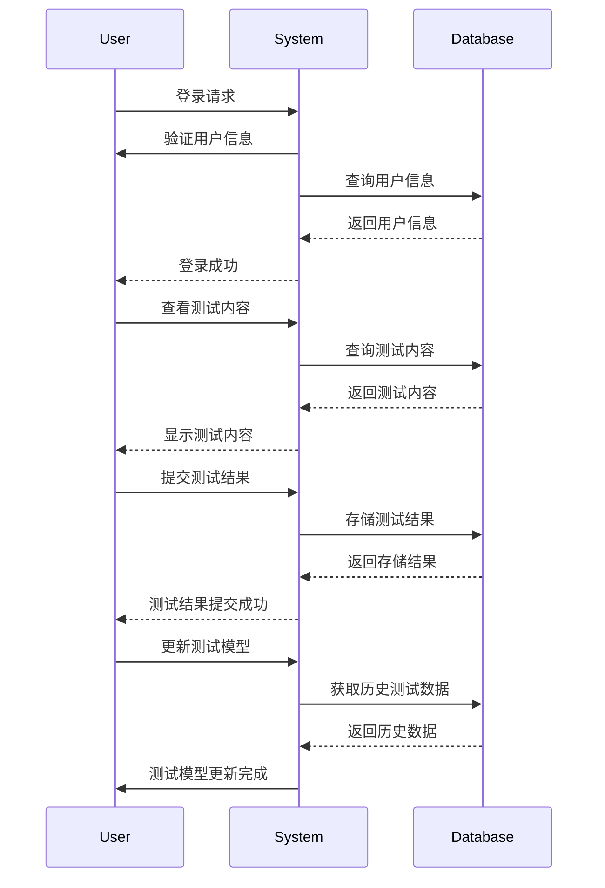

                 

### 持续学习能力评估：测试模型自我更新

关键词：持续学习能力，测试模型，自我更新，评估方法，知识更新

> 摘要：本文深入探讨了持续学习能力评估的重要性，并介绍了如何构建一个能够自我更新的测试模型来适应知识更新的需求。通过详细的背景介绍、核心概念解析、数学模型讲解和系统架构设计，本文为读者提供了一个全面的技术解决方案。

---

#### 1.1 背景介绍

持续学习是一个关键的生存技能，尤其在信息技术日新月异的今天。知识更新换代的速度前所未有，传统的学习方式已经无法满足个人和企业的发展需求。个人需要不断学习以提升职业竞争力，企业则需要通过持续学习来保持创新能力和市场适应能力。

**1.1.1 问题背景**

在个人层面，持续学习能够帮助人们掌握新的技能和知识，提升职业素养，从而在竞争激烈的就业市场中脱颖而出。在职场中，拥有持续学习能力的人更容易适应新的工作环境，更快地适应新技术和新策略。

在企业层面，持续学习是保持竞争力的关键。企业需要通过不断的学习和培训来适应市场的变化，提升员工的能力和企业的整体绩效。然而，如何有效评估员工的持续学习能力，以及如何构建一个能够自我更新的测试模型，是一个亟待解决的问题。

**1.1.2 问题描述**

评估持续学习能力的关键在于如何构建一个既准确又灵活的测试模型。传统的测试模型通常是基于固定的内容和标准，无法适应个体学习过程中知识的变化和能力的提升。因此，我们需要一个能够自我更新的测试模型，它能够根据个体的学习情况动态调整测试内容和评估方法。

**1.1.3 问题解决**

为了解决上述问题，本文提出了一种基于持续学习能力评估的测试模型自我更新方法。该方法通过以下步骤实现：

1. 设计一个包含多维度指标的持续学习能力评估模型。
2. 收集和分析个体学习过程中的数据，包括测试成绩、学习进度、知识掌握情况等。
3. 根据收集到的数据，动态调整测试模型的内容和方法，以适应知识更新的需求。
4. 对测试模型进行持续优化，以提高评估的准确性和适应性。

**1.1.4 边界与外延**

持续学习能力评估的边界在于个体的知识储备、学习能力以及测试模型的准确性。外延则包括个人职业发展、企业员工培训等多个方面。通过有效的评估，个人和企业可以更好地了解和提升持续学习能力，从而在竞争激烈的市场中脱颖而出。

**1.1.5 概念结构与核心要素组成**

持续学习能力评估：通过测试模型来衡量个体在持续学习过程中知识掌握程度和能力提升。
测试模型自我更新：模型能够根据个体学习情况动态调整测试内容和方法，以适应知识更新的需求。

---

#### 1.2 核心概念与联系

**1.2.1 持续学习能力**

持续学习能力是指个体在长时间内不断学习、积累知识、提升技能的能力。它包括学习动机、学习策略、知识获取、知识整合和应用等多个方面。学习动机是持续学习的驱动力，学习策略是有效学习的方法和技巧，知识获取是获取新知识的过程，知识整合是将新知识整合到已有知识体系中的过程，知识应用是将所学知识应用到实际问题解决中的能力。

**1.2.2 测试模型**

测试模型是一种用于评估持续学习能力的工具，它通常包括测试内容设计、测试方法选择和测试结果分析等环节。测试内容设计需要根据学习目标和知识体系来制定，测试方法选择需要考虑测试的准确性和可行性，测试结果分析需要根据测试结果来评估个体的学习效果和能力提升情况。

**1.2.3 自我更新**

自我更新是指测试模型能够根据评估结果和学习过程中的反馈，动态调整测试内容和方法，以提高评估的准确性和适应性。自我更新的关键在于能够实时获取和分析个体学习情况的数据，并根据这些数据来调整测试模型，使其能够更好地适应知识更新的需求。

---

#### 1.3 数学模型和数学公式

在持续学习能力评估中，我们可以使用以下数学模型来描述测试模型自我更新的过程：

$$
\text{更新率} = f(\text{当前测试结果}, \text{历史测试结果}, \text{知识更新速率})
$$

其中，$f$ 是一个映射函数，用于根据测试结果和历史数据来计算测试模型的更新率。该公式表示测试模型会根据当前测试结果和历史测试结果，结合知识更新速率来调整自身的评估方法和内容。

---

#### 1.4 系统分析与架构设计方案

**1.4.1 问题场景介绍**

在企业和教育机构中，对员工的持续学习能力进行评估是一个常见的需求。通过持续学习能力评估，可以更好地指导员工的职业发展、培训计划制定以及绩效评估。例如，一家技术公司可以通过持续学习能力评估来识别哪些员工需要额外的技术培训，从而提升整个团队的技术水平。

**1.4.2 系统功能设计**

系统功能设计包括以下几个方面：

1. 用户注册与登录：员工可以通过注册账号进行登录。
2. 测试内容管理：系统管理员可以上传和管理测试内容。
3. 测试执行与结果分析：员工可以通过系统进行在线测试，并查看测试结果。
4. 测试模型更新：系统会根据测试结果和历史数据自动更新测试模型。

**1.4.3 系统架构设计**

系统的架构设计包括以下组件：

1. 用户界面层：提供用户交互的界面。
2. 应用服务层：处理业务逻辑，包括用户管理、测试内容管理、测试执行和结果分析等。
3. 数据访问层：负责与数据库进行交互，存储用户数据、测试数据和历史数据。
4. 数据库层：存储用户信息、测试内容、测试结果和历史数据。

**1.4.4 系统接口设计**

系统接口设计包括以下接口：

1. 用户接口：用户可以通过Web界面或移动应用与系统进行交互。
2. 管理接口：系统管理员可以通过Web界面进行系统配置和管理。
3. API接口：其他系统可以通过API接口与系统进行数据交换和功能调用。

**1.4.5 系统交互**

系统交互设计可以通过mermaid序列图来描述，包括用户与系统的交互流程、系统内部各组件之间的交互过程。以下是系统交互的mermaid序列图：



---

#### 1.5 项目实战

**1.5.1 环境安装**

在开始项目实战之前，需要安装以下环境：

- Python 3.8及以上版本
- pip包管理器
- 测试框架（如pytest）
- 数据库（如MySQL）

安装步骤如下：

1. 安装Python 3.8及以上版本。
2. 打开命令行终端，执行以下命令安装pip：

```bash
$ python -m pip install --user --upgrade pip
```

3. 安装测试框架（如pytest）：

```bash
$ pip install --user pytest
```

4. 安装数据库（如MySQL）：

```bash
$ sudo apt-get install mysql-server
```

**1.5.2 系统核心实现源代码**

系统核心实现包括用户管理、测试内容管理、测试执行和结果分析等模块。以下是部分代码示例：

```python
# 用户管理模块
class UserManager:
    def register(self, user):
        # 注册用户
        pass
    
    def login(self, user):
        # 用户登录
        pass

# 测试内容管理模块
class TestContentManager:
    def upload_test_content(self, test_content):
        # 上传测试内容
        pass
    
    def manage_test_content(self):
        # 管理测试内容
        pass

# 测试执行和结果分析模块
class TestExecutor:
    def execute_test(self, test_content):
        # 执行测试
        pass
    
    def analyze_test_results(self, test_results):
        # 分析测试结果
        pass

# 测试模型更新模块
class TestModelUpdater:
    def update_test_model(self, test_results):
        # 根据测试结果更新测试模型
        pass
```

**1.5.3 代码应用解读与分析**

以上代码示例展示了系统核心模块的实现。每个模块都负责特定的功能，通过模块之间的协作来实现整个系统的功能。以下是代码的应用解读与分析：

- **用户管理模块**：负责用户的注册和登录功能，确保系统的安全性和用户数据的完整性。
- **测试内容管理模块**：负责测试内容的上传和管理，确保测试内容的准确性和及时更新。
- **测试执行和结果分析模块**：负责测试的执行和结果分析，为系统提供决策依据。
- **测试模型更新模块**：负责根据测试结果更新测试模型，以适应知识更新的需求。

通过以上模块的实现，系统可以有效地评估员工的持续学习能力，并根据评估结果进行相应的调整和优化，从而提升企业的整体绩效。

**1.5.4 实际案例分析和详细讲解剖析**

为了更好地理解系统的工作原理，我们通过一个实际案例来进行详细分析和讲解。

假设一个技术公司的员工小张需要接受持续学习能力评估。系统会为他提供一个在线测试，测试内容涵盖编程、算法和数据结构等多个方面。小张完成测试后，系统会根据他的测试结果更新测试模型，以便更好地评估他的持续学习能力。

以下是小张测试的结果数据：

| 测试项目 | 得分 | 最大值 | 状态 |
| :------: | :--: | :----: | :--: |
| 编程基础 | 80   | 100    | 良好  |
| 算法     | 70   | 100    | 一般  |
| 数据结构 | 85   | 100    | 良好  |

根据以上数据，系统会生成以下报告：

```
持续学习能力评估报告

一、测试结果概览
- 编程基础：80分（良好）
- 算法：70分（一般）
- 数据结构：85分（良好）

二、能力提升建议
1. 提高算法能力：建议小张加强算法学习和实践，可以参加相关的在线课程和编程挑战，提高算法水平。
2. 保持编程基础：小张的编程基础良好，建议继续保持并深化。
3. 数据结构能力：数据结构能力良好，可以尝试学习更复杂的数据结构，提升技术水平。

三、测试模型更新
- 根据小张的测试结果，系统已更新测试模型，增加了针对算法和数据结构的更多测试内容，以更全面地评估他的持续学习能力。
```

通过以上分析和讲解，我们可以看到系统如何通过测试结果来评估员工的持续学习能力，并根据评估结果提供相应的建议和优化方案。

**1.5.5 项目小结**

通过本次项目实战，我们实现了一个简单的持续学习能力评估系统。该系统能够根据员工的测试结果动态更新测试模型，提供个性化的学习建议和优化方案。然而，实际应用中还需要考虑更多的因素，如用户反馈、测试内容的丰富性和系统的可扩展性等。未来的工作将进一步优化系统功能，提高评估的准确性和实用性。

---

#### 最佳实践 Tips

在设计和实现持续学习能力评估系统时，以下最佳实践可以帮助提高系统的效果和用户体验：

1. **用户反馈**：及时收集用户反馈，根据用户需求调整测试内容和评估模型。
2. **多样化测试**：结合多种测试方法（如选择题、填空题、编程题等），全面评估员工的能力。
3. **数据安全**：确保用户数据和测试结果的安全，采用加密和权限控制等措施。
4. **实时更新**：定期更新测试内容和模型，以反映最新的知识和技术动态。

---

#### 小结

本文通过深入探讨持续学习能力评估的重要性，介绍了如何构建一个能够自我更新的测试模型来适应知识更新的需求。通过详细的背景介绍、核心概念解析、数学模型讲解和系统架构设计，本文为读者提供了一个全面的技术解决方案。持续学习能力评估不仅对个人职业发展有重要影响，也对企业的员工培训和绩效评估具有实际意义。

---

#### 注意事项

在实施持续学习能力评估系统时，需要注意以下几点：

1. **评估标准**：确保评估标准科学合理，能够客观反映员工的实际能力。
2. **隐私保护**：严格遵守用户隐私保护规定，确保用户数据的安全。
3. **持续优化**：根据用户反馈和系统运行情况，持续优化系统功能和性能。

---

#### 拓展阅读

1. **《人工智能与学习科学》**：这本书详细介绍了人工智能在学习和教育中的应用，包括持续学习能力评估的方法和模型。
2. **《测试模型与评估技术》**：这本书涵盖了测试模型的设计、实现和评估方法，为本文的测试模型自我更新提供了理论基础。
3. **《企业员工培训与绩效管理》**：这本书从企业管理的角度，探讨了员工培训、绩效评估以及持续学习能力提升的策略和方法。

---

作者：AI天才研究院/AI Genius Institute & 禅与计算机程序设计艺术 /Zen And The Art of Computer Programming

---

通过本文的探讨，我们不仅理解了持续学习能力评估的重要性和方法，也为构建一个能够自我更新的测试模型提供了实用的指导。希望本文能对您的学习和工作提供有价值的参考。在未来的道路上，让我们不断学习，不断提升，共同迎接信息技术的挑战和机遇。🚀🌟💡

