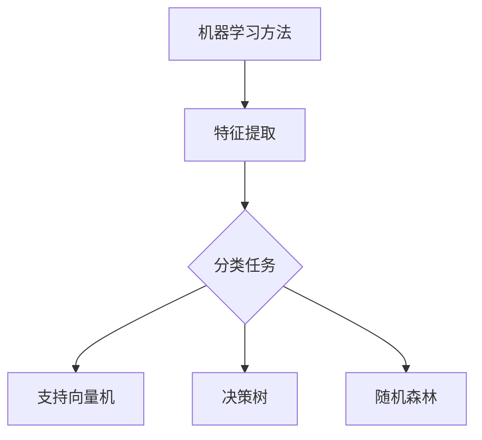
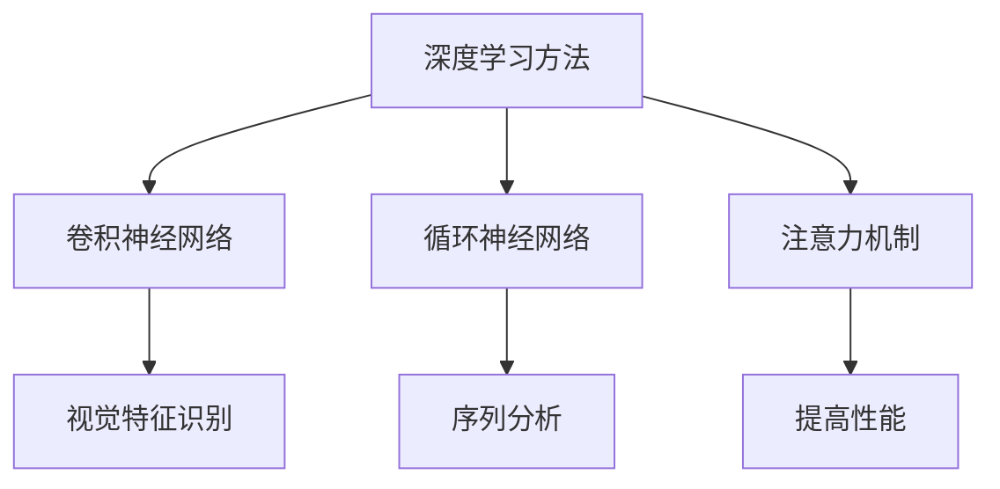
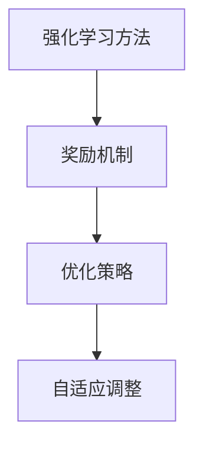
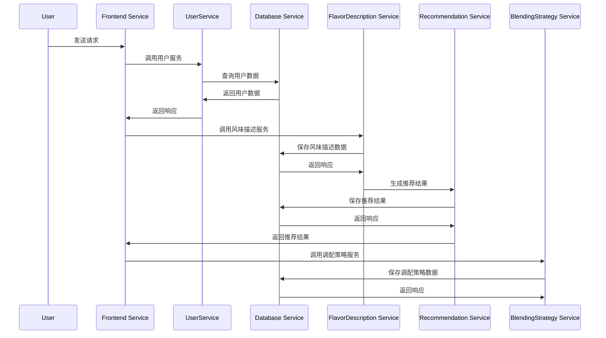
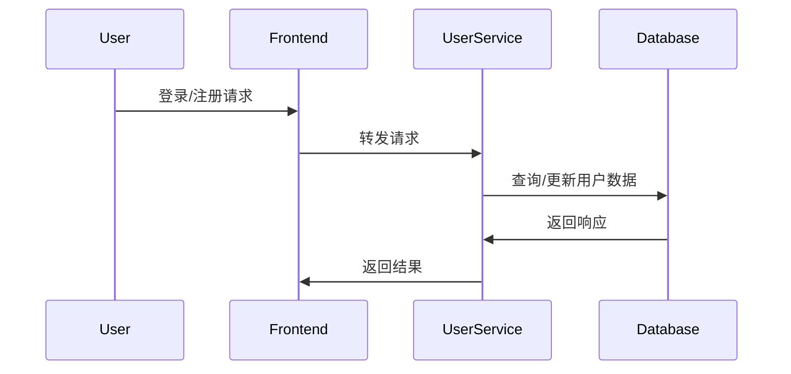
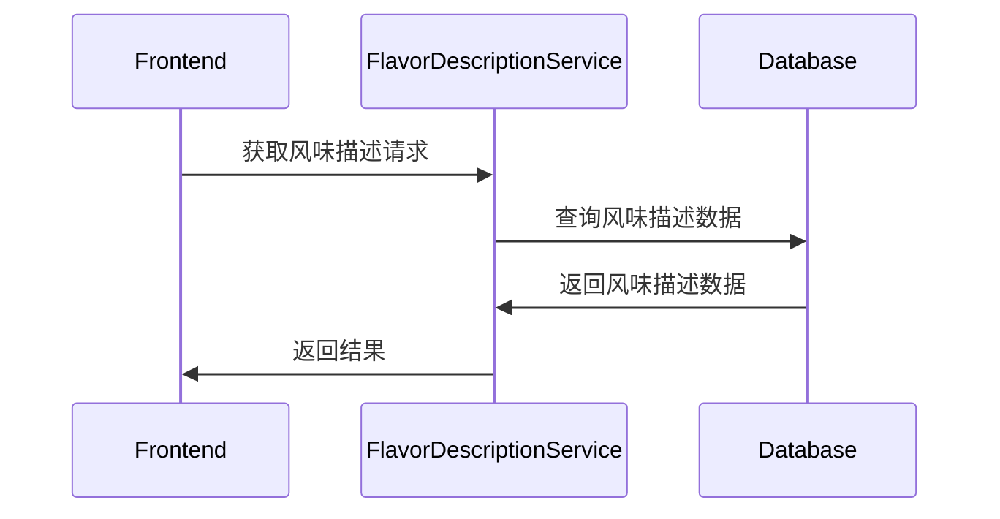
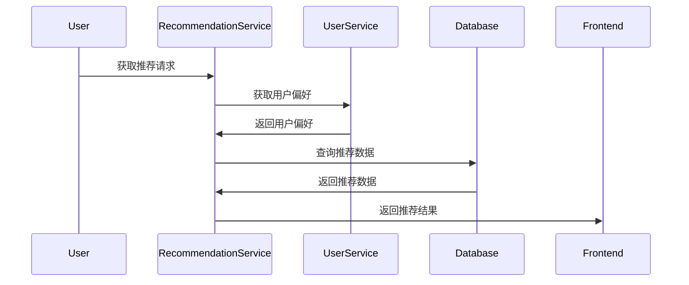
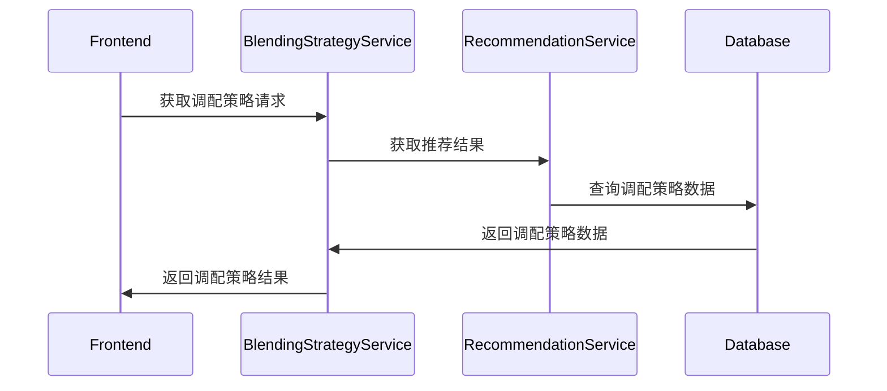
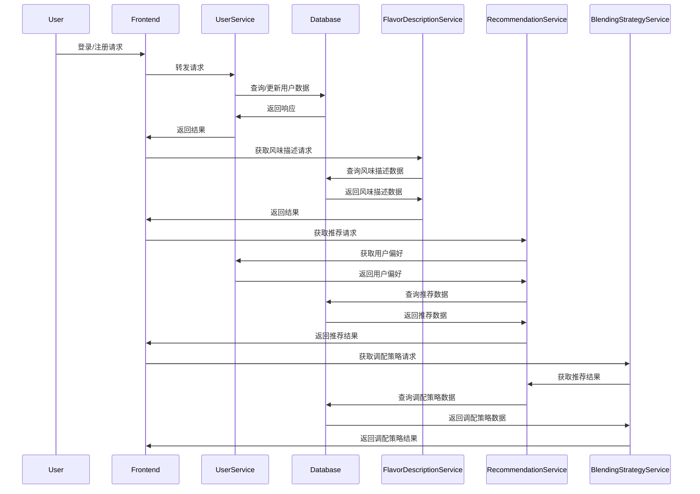

                 

### 1.2 核心概念与联系

在探讨AI创意咖啡调配的过程中，理解几个核心概念及其相互联系是至关重要的。以下我们将介绍AI创意咖啡调配的基本概念，并对比它们的属性特征，通过ER实体关系图来架构这些概念之间的关系。

#### 1.2.1 AI创意咖啡调配的基本概念

**1.2.1.1 人工智能**

**定义：** 人工智能（Artificial Intelligence, AI）是指计算机系统模拟人类智能行为的能力，包括学习、推理、解决问题和自然语言处理等。

**属性特征：**  
- 学习能力：通过训练数据获取知识和技能。
- 推理能力：基于已知信息推导出新结论。
- 解决问题的能力：自动解决复杂问题。
- 自然语言处理：理解和生成自然语言。

**1.2.1.2 创意咖啡调配**

**定义：** 创意咖啡调配是指利用人工智能技术，根据用户需求和风味特点，创造性地组合咖啡豆、糖浆、奶源等成分，调配出独特的咖啡饮品。

**属性特征：**  
- 用户定制化：根据用户偏好提供个性化服务。
- 风味多样化：结合多种成分创造出独特的风味。
- 创意性：运用人工智能算法进行创新组合。

**1.2.1.3 提示词设计**

**定义：** 提示词设计是指为系统提供指导性词汇，帮助用户理解和使用系统功能，提高用户体验。

**属性特征：**  
- 精准性：精确传达系统操作指令。
- 可操作性：设计易于用户理解和执行的操作提示。
- 启发性：提供有益的决策建议。

#### 1.2.2 概念属性特征对比表格

| 概念                 | 定义                                                         | 属性特征                                                   |
|----------------------|--------------------------------------------------------------|------------------------------------------------------------|
| 人工智能             | 模拟人类智能行为的能力                                       | 学习能力、推理能力、解决问题的能力、自然语言处理             |
| 创意咖啡调配         | 利用人工智能技术，根据用户需求和风味特点，创造性地组合咖啡成分 | 用户定制化、风味多样化、创意性                             |
| 提示词设计           | 提供指导性词汇，帮助用户理解和使用系统功能                   | 精准性、可操作性、启发性                                   |

#### 1.2.3 ER实体关系图架构

为了更清晰地展示这三个核心概念之间的联系，我们可以使用ER（Entity-Relationship）实体关系图来进行架构。

```mermaid
erDiagram
    User ||--|{ AI_Coffee_Machine } : customizes
    AI_Coffee_Machine ||--|{ Coffee_Blend } : creates
    AI_Coffee_Machine ||--|{ Instruction_Word } : guides
    User ||--|{ Coffee_Blend } : prefers
    User ||--|{ Feedback } : provides
```

在此ER图中，用户（User）是系统的核心实体，他与人工智能咖啡机（AI_Coffee_Machine）之间存在定制（customizes）关系，用户可以定制自己的咖啡偏好。人工智能咖啡机则与咖啡组合（Coffee_Blend）和提示词（Instruction_Word）存在创建（creates）和指导（guides）关系，即咖啡机根据用户偏好创造独特的咖啡组合，并通过提示词为用户提供操作指导。用户还可以对咖啡组合提供反馈（Feedback），这有助于改进系统的后续表现。

通过上述核心概念及其相互关系的介绍，我们为后续章节的详细探讨奠定了基础。接下来，我们将深入探讨AI在风味描述中的应用原理与技术，以及提示词设计的具体方法和案例。

### 2.1 AI在风味描述中的基本原理

在探讨AI创意咖啡调配的过程中，风味描述是一个至关重要的环节。通过AI技术，我们可以自动地识别、分析和描述咖啡的风味，从而为消费者提供个性化的风味推荐和专业的风味评估。

#### 2.1.1 风味描述的挑战与机遇

**2.1.1.1 风味感知的复杂性**

风味感知是一个高度复杂的过程，涉及多个感官系统（如嗅觉、味觉、视觉和触觉）的协同工作。不同人对同一风味的感知可能存在显著差异，这种主观性使得风味描述具有很大的挑战性。然而，这种复杂性也为AI技术的应用提供了广阔的机遇，通过大数据和机器学习，AI能够从大量的风味数据中提取有用的信息，实现风味感知的客观化。

**2.1.1.2 数据采集与处理**

在风味描述中，数据的质量和数量是至关重要的。首先，需要采集大量的风味数据，这些数据可以来源于专业评鉴、消费者反馈、实验室分析等途径。随后，对数据进行处理，包括数据清洗、归一化和特征提取等步骤，以去除噪声和冗余信息，从而提高后续分析的质量。

**2.1.1.3 AI技术在风味描述中的应用**

AI技术在风味描述中发挥着至关重要的作用。以下是一些常见的AI技术在风味描述中的应用：

1. **机器学习方法：** 机器学习方法，如支持向量机（SVM）、决策树和随机森林等，可以用于分类和回归任务，帮助识别和预测风味的特征。

2. **深度学习方法：** 深度学习，尤其是卷积神经网络（CNN）和循环神经网络（RNN），在处理高维复杂数据方面具有显著优势，可以用于提取风味特征的复杂模式。

3. **强化学习方法：** 强化学习，通过奖励机制，可以训练模型在风味描述任务中实现自我优化，从而提高描述的准确性和一致性。

#### 2.1.2 常见的风味描述模型

**2.1.2.1 机器学习方法**

机器学习方法在风味描述中的应用主要集中在特征提取和分类任务上。例如，支持向量机（SVM）可以用来分类不同风味的咖啡，而决策树和随机森林则可以用于预测咖啡的主要风味成分。这些方法的优势在于计算效率高，但可能需要大量的预训练数据和专业的数据科学家。



**2.1.2.2 深度学习方法**

深度学习在风味描述中的应用越来越广泛。卷积神经网络（CNN）能够有效地处理图像数据，因此可以用于识别咖啡的视觉特征。循环神经网络（RNN）则擅长处理序列数据，可以用于分析咖啡的风味变化。近年来，基于注意力机制的深度学习方法在风味描述中也展现了良好的性能。



**2.1.2.3 强化学习方法**

强化学习在风味描述中主要应用于优化风味调配策略。通过奖励机制，模型可以学习到哪些组合能够产生更受欢迎的风味。这种方法的优势在于能够自动调整策略，以适应不同的风味偏好，但其计算成本较高。



#### 2.1.3 风味描述技术的应用

**2.1.3.1 风味数据分析**

风味数据分析是风味描述的第一步，包括风味数据的采集与预处理、特征提取和描述模型的训练与评估。

- **数据采集与预处理：** 通过传感器技术、专业评鉴和消费者反馈等多种途径收集风味数据，并对数据进行清洗、归一化处理，以提高数据质量。
- **特征提取：** 从原始数据中提取有代表性的特征，如咖啡的颜色、香气、味道等。
- **描述模型的训练与评估：** 使用机器学习和深度学习模型对提取的特征进行训练，并通过评估指标（如准确率、召回率和F1分数）来评估模型的性能。

**2.1.3.2 风味推荐系统**

基于风味描述的技术，可以开发出风味推荐系统，为消费者提供个性化的风味推荐。这种系统可以基于以下几种方法：

- **基于内容的推荐：** 根据用户以往的消费记录和风味偏好，推荐具有相似特征的咖啡。
- **基于协同过滤的推荐：** 通过分析用户的共同喜好，推荐其他用户喜欢的风味。
- **基于模型的推荐：** 利用深度学习模型预测用户可能喜欢的风味。

#### 2.1.4 风味描述的挑战与展望

**2.1.4.1 当前风味描述技术的不足**

尽管AI技术在风味描述中取得了显著进展，但仍存在一些挑战和不足：

- **数据稀缺性问题：** 高质量的风味数据相对稀缺，限制了模型的训练和优化。
- **风味感知的主观性：** 风味感知具有强烈的主观性，不同人之间的感知可能存在显著差异。
- **模型解释性不足：** 现有的深度学习模型往往缺乏透明性和可解释性，难以理解其工作原理。

**2.1.4.2 未来发展方向**

为了克服上述挑战，未来的发展方向包括：

- **多模态风味感知：** 结合多种传感器技术，如视觉、嗅觉和味觉，实现更全面的风味感知。
- **深度学习模型的优化：** 通过改进算法和架构，提高模型的性能和可解释性。
- **风味描述与智能交互的结合：** 将风味描述与智能交互系统相结合，提供更加个性化和互动的风味体验。

通过深入探讨AI在风味描述中的基本原理，我们可以为创意咖啡调配提供更强大和精确的技术支持。接下来，我们将进一步探讨风味描述技术的具体应用和未来发展的挑战。

#### 2.2.1 风味描述技术的应用

在了解了AI在风味描述中的基本原理后，接下来我们将深入探讨风味描述技术的具体应用，包括风味数据分析、风味推荐系统和风味调配策略。

**2.2.1.1 风味数据分析**

风味数据分析是风味描述的核心环节。通过对大量风味数据的采集和处理，我们可以提取出关键的特征信息，为后续的风味描述和推荐提供基础。

1. **数据采集与预处理**：风味数据的采集可以通过多种途径进行，包括传感器技术、专业评鉴和消费者反馈。采集到的原始数据可能包含噪声和冗余信息，因此需要通过数据清洗、归一化等预处理步骤来提高数据质量。

2. **特征提取**：特征提取是风味数据分析的关键步骤，通过提取有代表性的特征，如咖啡的颜色、香气、味道等，我们可以更准确地描述风味的特性。常见的特征提取方法包括主成分分析（PCA）、因子分析（FA）和独立成分分析（ICA）等。

3. **描述模型的训练与评估**：使用机器学习和深度学习模型对提取的特征进行训练，通过交叉验证和评估指标（如准确率、召回率和F1分数）来评估模型的性能。这些模型可以帮助我们识别和分类不同的风味，为后续的风味推荐和调配提供支持。

**2.2.1.2 风味推荐系统**

基于风味描述技术，我们可以开发出高效的风味推荐系统，为消费者提供个性化的风味推荐。

1. **基于内容的推荐**：这种方法利用咖啡的已知特征（如产地、烘焙程度、成分等）来推荐具有相似特征的风味。例如，如果用户喜欢一款具有深烘焙和丰富焦糖味的风味咖啡，系统可以推荐其他深烘焙、焦糖味丰富的咖啡。

2. **基于协同过滤的推荐**：协同过滤是一种利用用户历史行为进行推荐的方法。通过分析用户之间的共同喜好，系统可以推荐其他用户喜欢的风味。例如，如果两个用户都喜欢某款咖啡，那么系统可能将这款咖啡推荐给其他两个用户。

3. **基于模型的推荐**：这种方法使用机器学习和深度学习模型预测用户可能喜欢的风味。例如，通过分析用户的消费记录和偏好，系统可以推荐用户可能喜欢的风味组合。

**2.2.1.3 风味调配策略**

风味调配策略是创意咖啡调配的重要组成部分，通过结合不同的风味成分，创造出独特的风味体验。

1. **风味组合分析**：通过分析不同风味成分之间的相互作用，我们可以确定哪些成分能够产生最佳的风味搭配。例如，某些咖啡豆与特定糖浆的搭配可能会产生意想不到的香气和口感。

2. **风味优化算法**：使用优化算法，如遗传算法、粒子群优化等，可以自动搜索最佳的风味组合。这些算法通过迭代优化，逐步调整风味成分的比例，以实现最佳的风味调配。

3. **用户反馈调整**：通过收集用户对风味调配的反馈，系统可以不断调整和优化风味调配策略。例如，如果用户对某款咖啡的组合感到不满意，系统可以记录这些反馈，并在后续的调配中避免使用相同的成分。

**2.2.1.4 案例分析**

为了更好地理解风味描述技术的应用，我们可以通过以下案例分析：

1. **咖啡店个性化推荐系统**：一家咖啡店利用风味描述技术为顾客提供个性化推荐。通过分析顾客的消费记录和偏好，系统可以推荐顾客可能喜欢的风味咖啡，从而提高顾客满意度和忠诚度。

2. **智能咖啡调配机**：一家公司开发了一款智能咖啡调配机，利用AI技术自动分析用户的面部表情和语音反馈，实时调整风味成分，为用户提供个性化的风味体验。这种智能咖啡调配机在咖啡店和办公室等场景中具有广泛的应用前景。

通过上述分析，我们可以看到风味描述技术在不同应用场景中的广泛应用和潜力。随着技术的不断进步，风味描述技术将为咖啡产业带来更多的创新和发展。

#### 2.3 风味描述的挑战与展望

尽管AI技术在风味描述方面取得了显著进展，但仍然面临一些挑战和局限性。以下是当前风味描述技术中存在的问题以及未来可能的发展方向。

**2.3.1 当前风味描述技术的不足**

**2.3.1.1 数据稀缺性问题**

风味描述需要大量的高质量数据，但当前这些数据相对稀缺。获取高质量的风味数据不仅需要专业评鉴和实验室分析，还需要广泛而系统的消费者反馈。数据稀缺性限制了模型的训练和优化，影响了风味描述的准确性和泛化能力。

**2.3.1.2 风味感知的主观性**

风味感知具有高度的主观性，不同人对同一风味的感知可能存在显著差异。这种主观性给风味描述带来了巨大的挑战。AI模型如何处理这种主观性，如何确保描述的客观性和一致性，是一个亟待解决的问题。

**2.3.1.3 模型解释性不足**

深度学习模型在风味描述中展现了强大的性能，但往往缺乏透明性和可解释性。用户和咖啡师难以理解模型的工作原理，这限制了模型在实际应用中的推广和信任。提高模型的解释性，使其能够提供直观的决策依据，是未来研究的一个重要方向。

**2.3.2 未来发展方向**

**2.3.2.1 多模态风味感知**

多模态风味感知是一种结合视觉、嗅觉和味觉等多种感官信息的方法，旨在提高风味描述的准确性和全面性。通过整合多种感官数据，我们可以更全面地了解风味特性，从而提高描述的精度。未来，随着传感器技术和数据处理能力的提升，多模态风味感知将成为一个重要的研究方向。

**2.3.2.2 深度学习模型的优化**

深度学习模型在风味描述中展现了强大的潜力，但同时也存在计算成本高、训练时间长等问题。未来，优化深度学习模型，提高其计算效率和准确性，将是一个重要的研究方向。例如，通过模型压缩、迁移学习和新型神经网络架构的设计，可以大幅提升深度学习模型的性能。

**2.3.2.3 风味描述与智能交互的结合**

将风味描述与智能交互系统相结合，可以为用户提供更加个性化和互动的风味体验。通过智能交互，用户可以与系统进行自然语言对话，实时获取风味描述和建议。这种结合不仅提高了用户体验，还可以为咖啡师提供专业的风味分析工具，从而提升整个咖啡调配过程的效率和质量。

**2.3.2.4 跨学科合作**

风味描述是一个跨学科的领域，涉及化学、生物学、计算机科学等多个学科。未来的研究需要加强跨学科合作，通过多学科知识的融合，推动风味描述技术的进一步发展。例如，化学分析技术的应用可以提升风味数据的准确性，而心理学和认知科学的研究可以为风味感知提供更深入的见解。

通过以上分析，我们可以看到风味描述技术在当前面临一些挑战，但也拥有广阔的发展前景。随着技术的不断进步和跨学科合作的加强，风味描述技术将在未来为咖啡产业带来更多的创新和突破。

#### 3.1 提示词设计的基本概念

在探讨AI创意咖啡调配的过程中，提示词设计扮演着至关重要的角色。提示词不仅是系统与用户之间交互的桥梁，更是指导用户操作、提高系统效率和增强用户体验的关键元素。在本节中，我们将详细探讨提示词的定义、功能及其设计原则。

**3.1.1 提示词的定义**

**定义：** 提示词（Instruction Words）是指为系统用户提供指导性词汇或短语，帮助用户理解系统功能、操作步骤和预期结果。这些词汇或短语可以以文字、语音或图形等多种形式呈现，旨在简化用户操作、提高操作效率并提升用户体验。

**3.1.1.1 提示词的概念界定**

提示词不仅包括直接的指令性词汇，如“选择”、“添加”和“确认”，还包括描述性、引导性和解释性的词汇，如“请注意”、“如何操作”和“结果说明”。这些词汇共同构成了提示词的丰富内涵，使得系统与用户之间的交互更加顺畅和高效。

**3.1.1.2 提示词的分类**

根据功能不同，提示词可以分为以下几类：

1. **指令性提示词**：这类提示词直接指示用户进行特定操作，如“请选择您喜欢的咖啡口味”。

2. **描述性提示词**：这类提示词用于描述系统功能或操作结果，如“当前咖啡温度为60℃”。

3. **引导性提示词**：这类提示词引导用户按照特定步骤操作，如“请按照提示顺序进行操作”。

4. **解释性提示词**：这类提示词解释系统功能或操作原因，如“此步骤是为了确保咖啡风味最佳”。

**3.1.2 提示词的功能**

**3.1.2.1 指导用户操作**

提示词最基本的功能是指导用户进行操作。通过提供明确的操作步骤和注意事项，提示词可以帮助用户快速掌握系统操作方法，避免误操作，提高操作成功率。

**3.1.2.2 提高系统效率**

高效的提示词设计能够减少用户的学习成本，提高系统整体运行效率。简明扼要的提示词可以避免不必要的用户询问和等待时间，使得系统操作更加流畅。

**3.1.2.3 增强用户体验**

优质的提示词设计能够显著提升用户体验。通过使用亲切、友好的语言和符合用户习惯的表达方式，提示词可以增强用户的满意度，提升用户对系统的信任和依赖。

**3.1.3 提示词设计的原则**

**3.1.3.1 精准性**

精准性是提示词设计的关键原则。提示词应精确传达系统操作指令，避免模糊和不明确的描述。例如，“请添加糖浆”比“加一些糖浆”更加具体明确。

**3.1.3.2 可操作性**

提示词应具备可操作性，即用户可以轻松理解和执行。避免使用过于复杂或专业的术语，确保提示词通俗易懂。

**3.1.3.3 启发性**

提示词应具备启发性，为用户提供决策参考。例如，在咖啡调配过程中，提示词可以引导用户尝试不同的组合，激发用户的创造力。

**3.1.3.4 个性化**

根据用户的不同需求和使用习惯，提示词应具备个性化特点。例如，对于新手用户，提示词可以更加详细和指导性，而对于经验丰富的用户，提示词可以更加简洁和灵活。

通过深入探讨提示词的定义、功能和设计原则，我们为后续章节的详细探讨和实际应用提供了理论基础。在下一节中，我们将进一步介绍提示词设计的具体方法，包括数据驱动的提示词设计和人工智能辅助的提示词设计，并分析其优劣和适用场景。

### 3.2 提示词设计的原则

在AI创意咖啡调配系统中，提示词设计是提高用户体验和系统效率的关键环节。为了确保提示词的精准性、可操作性和启发性，我们需要遵循一些核心设计原则。以下将详细讨论这些原则。

**3.2.1 精准性**

**3.2.1.1 提示词的精确匹配**

精准性是提示词设计的基本要求。提示词应精确匹配系统操作指令，避免模糊和不明确的描述。例如，在咖啡调配系统中，提示词“请选择糖浆的浓度”比“加一些糖浆”更加明确，有助于用户快速理解并执行操作。

**3.2.1.2 避免模糊和不明确的提示**

为了确保提示词的精准性，应避免使用模糊和不明确的词汇。例如，提示词“调整一下”可能让用户感到困惑，不知该如何操作。相反，使用具体且明确的提示词，如“将温度调整至60℃”，可以减少用户操作的模糊性，提高操作的准确性。

**3.2.2 可操作性**

**3.2.2.1 提示词的可执行性**

提示词应具备可执行性，即用户可以轻松理解和执行。为了实现这一点，我们需要确保提示词的语言简洁明了，避免使用过于复杂或专业的术语。例如，对于新手用户，提示词“按下‘开始’按钮”比“激活启动程序”更加易懂。

**3.2.2.2 提示词的易于理解**

提示词的易懂性是可操作性的重要组成部分。为了提高提示词的易懂性，设计者需要从用户的角度出发，考虑到不同用户群体（如新手用户、专业用户）的理解能力。例如，对于非专业用户，提示词“选择您喜欢的口味”比“进行风味偏好设定”更加直观。

**3.2.3 启发性**

**3.2.3.1 提供决策参考**

提示词应具备启发性，为用户提供决策参考。例如，在咖啡调配过程中，提示词“建议您尝试焦糖味和榛子味的组合”可以为用户提供了风味搭配的建议，激发用户的创造力。

**3.2.3.2 激发用户创造力**

启发性的提示词不仅提供操作指导，还鼓励用户尝试新的组合。例如，在个性化咖啡调配系统中，提示词“尝试添加一些肉桂粉，看看会有什么新风味”可以引导用户探索不同的风味组合，提高用户的参与度和满意度。

**3.2.4 个性化**

**3.2.4.1 考虑用户需求**

个性化是提升用户体验的重要手段。提示词设计应根据用户的需求和使用习惯进行定制。例如，对于经常订购相同风味的用户，系统可以提供个性化的提示词，如“您上次选择的是焦糖玛奇朵，今天想换点新口味吗？”

**3.2.4.2 适应不同用户群体**

提示词设计应考虑不同用户群体的特点和需求。对于新手用户，提示词可以更加详细和指导性，帮助他们快速上手。而对于专业用户，提示词可以更加简洁和灵活，满足他们的个性化需求。

**3.2.5 可维护性**

**3.2.5.1 易于更新和调整**

提示词设计应具备良好的可维护性，便于更新和调整。随着系统功能的扩展和用户需求的变化，提示词也需要相应地调整和优化。例如，使用灵活的模板和规则，可以方便地替换或修改提示词内容。

**3.2.5.2 考虑多语言支持**

在国际化的背景下，提示词设计应考虑多语言支持。通过使用国际化工具和框架，可以确保提示词在不同语言环境中的一致性和准确性。

通过遵循上述原则，我们可以设计出精准、可操作、启发性和个性化的提示词，从而提升AI创意咖啡调配系统的用户体验和操作效率。在下一节中，我们将进一步探讨提示词设计的方法，包括数据驱动的提示词设计和人工智能辅助的提示词设计。

### 3.3 提示词设计的方法

在AI创意咖啡调配系统中，有效的提示词设计对于提高用户体验和系统操作效率至关重要。以下将详细探讨两种常见的提示词设计方法：数据驱动的提示词设计和人工智能辅助的提示词设计。

**3.3.1 数据驱动的提示词设计**

数据驱动的提示词设计方法主要依赖于用户行为数据和市场趋势数据，通过分析这些数据来确定最合适的提示词。这种方法的优势在于能够根据用户实际需求和偏好进行个性化设计，提高提示词的精准性和有效性。

**3.3.1.1 用户行为分析**

用户行为分析是数据驱动提示词设计的基础。通过对用户在系统中的操作行为、浏览路径和消费记录进行分析，可以识别出用户的主要需求和偏好。例如，系统可以通过分析用户最喜欢的咖啡风味、最喜欢的咖啡豆种类和最频繁的购买时间，来调整提示词的内容和顺序。

**3.3.1.2 市场趋势分析**

市场趋势分析是另一种重要的数据来源。通过对市场数据的分析，可以了解当前流行的咖啡风味和用户偏好的变化趋势。例如，系统可以通过分析社交媒体上的讨论热点、咖啡店的推荐榜单和市场上的新产品发布情况，来确定哪些风味和成分可能是未来的趋势。基于这些分析结果，系统可以提前更新提示词，引导用户尝试新的风味组合。

**3.3.1.3 优化提示词效果**

数据驱动的提示词设计方法还涉及持续优化提示词效果。通过收集用户对提示词的反馈和使用数据，可以评估提示词的有效性，并对其进行调整和改进。例如，如果某些提示词导致用户操作错误或满意度下降，系统可以重新设计这些提示词，以提高用户操作的准确性和满意度。

**3.3.2 人工智能辅助的提示词设计**

人工智能辅助的提示词设计方法利用人工智能技术，如自然语言处理（NLP）和机器学习，来自动生成和优化提示词。这种方法的优势在于能够提高提示词设计的效率和准确性，减少人工干预。

**3.3.2.1 自然语言处理技术**

自然语言处理技术是人工智能辅助提示词设计的关键。通过NLP技术，系统可以理解和生成自然语言文本，从而创建更具亲和力和个性化的提示词。例如，系统可以使用NLP技术分析用户的历史评论和反馈，自动生成基于用户偏好的个性化提示词。

**3.3.2.2 用户交互设计**

用户交互设计是另一个重要的应用领域。通过分析用户与系统的交互行为，系统可以自动调整提示词的呈现方式和内容，以提高用户的操作效率和满意度。例如，系统可以使用交互设计中的多步骤引导和逐步提示，帮助用户完成复杂的操作过程。

**3.3.2.3 自动优化提示词**

人工智能辅助的提示词设计方法还包括自动优化提示词。通过机器学习算法，系统可以根据用户反馈和使用数据，自动调整和优化提示词的效果。例如，系统可以通过分析用户的点击率、操作成功率和使用时长等指标，自动调整提示词的呈现顺序和内容，以提高用户满意度。

**3.3.2.4 智能反馈机制**

智能反馈机制是人工智能辅助提示词设计的重要组成部分。通过智能反馈机制，系统可以实时收集用户的反馈和意见，并根据这些反馈进行自动调整和优化。例如，系统可以设置一个反馈按钮，让用户对提示词的效果进行评分和评论，从而帮助系统不断改进提示词设计。

**3.3.3 两种方法的优劣与适用场景**

数据驱动的提示词设计和人工智能辅助的提示词设计各有优劣，适用于不同的场景。

- **数据驱动的提示词设计：**
  - 优势：能够根据用户实际需求和偏好进行个性化设计，提高提示词的精准性和有效性。
  - 适用场景：适用于用户行为数据丰富、需求差异明显的场景，如个性化推荐系统和定制化服务。
  - 劣势：需要大量的用户行为数据和市场趋势数据，数据收集和处理成本较高。

- **人工智能辅助的提示词设计：**
  - 优势：能够自动生成和优化提示词，减少人工干预，提高设计效率和准确性。
  - 适用场景：适用于需要快速响应用户需求和不断优化提示词效果的场景，如智能交互系统和动态推荐系统。
  - 劣势：可能缺乏对用户具体需求的深入理解，提示词的个性化程度较低。

综上所述，数据驱动的提示词设计和人工智能辅助的提示词设计各有优势，适用于不同的场景。在实际应用中，可以根据具体需求和环境选择合适的提示词设计方法，以提高系统的用户体验和操作效率。

### 3.4 提示词设计的案例分析

在探讨AI创意咖啡调配系统的提示词设计时，通过具体案例的分析可以更直观地理解提示词设计的实际应用效果。以下将介绍两个成功案例，分别是咖啡店个性化推荐系统和智能咖啡调配机。

**3.4.1.1 案例一：咖啡店个性化推荐系统**

某知名咖啡店引入了个性化推荐系统，通过分析用户的消费记录和偏好，为顾客提供定制化的咖啡推荐。该系统采用了数据驱动的提示词设计方法，以下是其主要特点：

1. **用户行为分析**：系统首先分析用户的消费记录，包括咖啡种类、口味、购买时间和频率等。通过对这些数据的挖掘，系统可以识别出用户的偏好和习惯。

2. **个性化提示词**：根据用户的历史记录，系统生成个性化的提示词，例如“根据您的喜好，我们为您推荐经典的焦糖玛奇朵”或“您最近购买了榛子味的拿铁，试试我们的榛子巧克力风味吧”。

3. **动态调整**：系统会根据用户的反馈和新的消费数据，动态调整提示词的内容和顺序，以提高推荐的相关性和用户满意度。

4. **用户体验提升**：通过精准的个性化推荐和直观的提示词设计，用户在咖啡店中的消费体验得到了显著提升，满意度也显著提高。

**3.4.1.2 案例二：智能咖啡调配机**

一家科技公司开发了一款智能咖啡调配机，利用人工智能技术为用户提供个性化的咖啡调配服务。该系统采用了人工智能辅助的提示词设计方法，以下是其主要特点：

1. **用户交互设计**：智能咖啡调配机通过触摸屏和语音交互，与用户进行互动。系统提供的提示词包括“请选择您的咖啡口味”和“当前咖啡温度为60℃，是否需要调整？”。

2. **多步骤引导**：为了帮助用户顺利完成操作，系统设计了多步骤引导提示词，如“请选择您喜欢的咖啡豆”、“选择糖浆浓度”和“确认订单”。

3. **自动优化**：系统使用机器学习算法，根据用户反馈和使用数据，自动调整和优化提示词。例如，如果用户经常忽略温度提示，系统会逐步调整提示词的呈现方式和内容。

4. **用户体验优化**：通过智能交互和多步骤引导，智能咖啡调配机提高了用户操作的便利性和成功率，用户体验得到了显著优化。

**3.4.2.3 案例效果分析**

1. **个性化推荐系统**：通过精准的个性化推荐和友好的提示词设计，咖啡店的用户满意度显著提高，回头客比例也相应增加。

2. **智能咖啡调配机**：智能咖啡调配机通过多步骤引导和自动优化提示词，使用户操作更加简单和高效，用户满意度也得到了显著提升。

以上案例分析表明，通过合理设计的提示词，可以显著提高系统的用户体验和操作效率。未来，随着技术的不断进步，提示词设计将在AI创意咖啡调配系统中发挥更加重要的作用。

#### 3.5 最佳实践 tips

在AI创意咖啡调配系统中，提示词设计对用户体验和系统操作效率至关重要。以下是一些最佳实践 tips，以帮助设计师和开发者优化提示词设计。

**3.5.1 明确用户需求**

在设计提示词之前，深入了解用户的需求和偏好至关重要。通过用户调研、访谈和反馈收集，确定用户最关注的功能和操作步骤，从而有针对性地设计提示词。

**3.5.2 简明扼要**

提示词应简洁明了，避免冗长和复杂的描述。简短的提示词不仅易于用户理解，还能减少用户的阅读时间和操作时间，提高系统效率。

**3.5.3 直观易懂**

使用直观的词汇和图形，帮助用户快速理解操作步骤。例如，使用图标和颜色编码来表示不同的操作选项，使提示词更加易于理解和执行。

**3.5.4 个性化定制**

根据用户的不同需求和习惯，设计个性化的提示词。例如，对于新手用户，可以提供更详细的操作步骤和说明，而对于熟练用户，可以简化提示词，提供更多快捷操作选项。

**3.5.5 持续优化**

提示词设计应具备良好的可维护性，便于持续优化。通过收集用户反馈和使用数据，定期评估提示词的有效性，并根据用户需求进行调整和改进。

**3.5.6 多语言支持**

在国际化的背景下，确保提示词的多语言支持至关重要。使用国际化工具和框架，确保提示词在不同语言环境中的一致性和准确性。

通过遵循这些最佳实践，我们可以设计出更精准、更可操作和更具启发性的提示词，从而提高AI创意咖啡调配系统的用户体验和操作效率。

### 4. 系统分析与架构设计方案

#### 4.1 问题场景介绍

AI创意咖啡调配系统旨在通过人工智能技术为用户提供个性化、定制化的咖啡调配服务。系统的主要功能包括：用户偏好分析、风味描述与推荐、咖啡调配策略生成和实时交互反馈。以下是系统面临的主要挑战：

1. **用户需求多样化和个性化**：不同用户对咖啡风味的需求和偏好差异较大，系统需要准确识别和满足用户的个性化需求。
2. **数据质量和处理能力**：风味描述和推荐依赖于大量高质量的数据，系统需要高效处理和整合多种数据源。
3. **系统响应速度和稳定性**：系统需要快速响应用户操作，并提供稳定的调配服务，以保证用户体验。
4. **模型解释性和可解释性**：深度学习模型在风味描述中的应用需要具备良好的解释性，以便用户理解和信任。

#### 4.2 项目介绍

本项目旨在开发和部署一个AI创意咖啡调配系统，系统架构包括前端交互界面、后端服务端和数据库三个主要部分。前端负责与用户进行交互，后端服务端处理数据分析和模型推理，数据库存储用户数据和风味描述数据。以下是项目的详细描述：

**前端交互界面**：前端使用HTML、CSS和JavaScript技术构建，包括用户登录、注册、偏好设置、风味推荐和历史记录等功能模块。用户可以通过触摸屏或语音交互与系统进行互动。

**后端服务端**：后端服务端采用Python和Django框架开发，包括用户服务、风味描述服务、推荐服务和调配策略生成服务。后端服务端与前端进行RESTful API交互，处理用户请求，返回相应的操作结果和推荐结果。

**数据库**：数据库使用MySQL，存储用户信息、偏好设置、风味描述数据和调配策略。通过ORM（对象关系映射）技术，后端服务端与数据库进行高效的数据操作。

#### 4.3 系统功能设计（领域模型）

为了实现系统的各项功能，我们采用领域驱动设计（Domain-Driven Design, DDD）的方法，构建系统的领域模型。以下是系统的主要领域和实体：

1. **用户（User）**：实体包括用户ID、姓名、密码、邮箱、偏好设置等属性，用于存储用户信息和操作记录。
2. **咖啡（Coffee）**：实体包括咖啡ID、名称、描述、风味成分等属性，用于存储咖啡的基本信息。
3. **风味描述（FlavorDescription）**：实体包括描述ID、描述内容、创建时间等属性，用于存储咖啡的风味描述数据。
4. **推荐结果（Recommendation）**：实体包括推荐ID、用户ID、咖啡ID、推荐时间等属性，用于存储推荐结果。
5. **调配策略（BlendingStrategy）**：实体包括策略ID、策略名称、策略描述等属性，用于存储调配策略。

以下是领域模型的类图表示：

```mermaid
classDiagram
    User <<entity>>
    Coffee <<entity>>
    FlavorDescription <<entity>>
    Recommendation <<entity>>
    BlendingStrategy <<entity>>

    User "1" --|{1} Recommendation
    User "1" --|{1} FlavorDescription
    Coffee "1" --|{1} FlavorDescription
    Recommendation "1" --|{1} Coffee
    BlendingStrategy "1" --|{1} Coffee
```

#### 4.4 系统架构设计

系统架构采用微服务架构，将前端、后端和数据库分解为多个独立的服务模块，以提高系统的可维护性和扩展性。以下是系统架构的详细设计：

1. **前端服务（Frontend Service）**：负责与用户进行交互，包括用户登录、注册、偏好设置和风味推荐等功能。
2. **用户服务（UserService）**：处理用户相关的业务逻辑，包括用户信息管理、用户偏好分析等。
3. **风味描述服务（FlavorDescriptionService）**：处理风味描述相关的业务逻辑，包括风味数据采集、特征提取和描述模型训练等。
4. **推荐服务（RecommendationService）**：处理风味推荐相关的业务逻辑，包括用户偏好分析、推荐模型训练和推荐结果生成等。
5. **调配策略服务（BlendingStrategyService）**：处理调配策略相关的业务逻辑，包括策略生成、策略评估和策略调整等。
6. **数据库服务（DatabaseService）**：负责数据库的连接和操作，包括用户数据、风味描述数据、推荐结果数据和调配策略数据等。

以下是系统架构图表示：



通过上述系统架构设计，我们可以实现高效、灵活和可扩展的AI创意咖啡调配系统，为用户提供个性化、定制化的咖啡调配服务。

### 4.5 系统接口设计和系统交互

在AI创意咖啡调配系统中，系统接口设计和系统交互是确保各个模块之间高效协作、数据准确传递的关键环节。以下将详细描述系统的接口设计和系统交互，并通过Mermaid序列图进行说明。

#### 4.5.1 系统接口设计

系统接口设计包括前端与后端服务之间的接口设计，以及后端服务之间的接口设计。以下是系统的主要接口：

1. **用户接口（User Interface）**：前端与用户进行交互的接口，包括登录、注册、偏好设置和风味推荐等。
2. **用户服务接口（User Service Interface）**：处理用户相关的业务逻辑，如用户信息管理、用户偏好分析等。
3. **风味描述服务接口（Flavor Description Service Interface）**：处理风味描述相关的业务逻辑，如风味数据采集、特征提取等。
4. **推荐服务接口（Recommendation Service Interface）**：处理推荐相关的业务逻辑，如用户偏好分析、推荐模型训练和推荐结果生成等。
5. **调配策略服务接口（Blending Strategy Service Interface）**：处理调配策略相关的业务逻辑，如策略生成、策略评估和策略调整等。

以下是接口设计示意图：



2. **风味描述服务接口**：



3. **推荐服务接口**：



4. **调配策略服务接口**：



#### 4.5.2 系统交互

系统交互主要涉及前端与后端服务之间的通信，以及后端服务之间的数据传递。以下是系统交互的详细流程：

1. **用户交互流程**：用户通过前端界面提交登录、注册、偏好设置和风味推荐请求，前端将这些请求转发给相应的后端服务，后端服务处理请求并返回结果，前端再将结果呈现给用户。

2. **数据交互流程**：在后端服务之间，通过接口进行数据的传递和协同工作。例如，风味描述服务从数据库中获取风味描述数据，推荐服务基于用户偏好和风味描述数据生成推荐结果，调配策略服务基于推荐结果生成调配策略。

以下是系统交互的Mermaid序列图表示：



通过上述系统接口设计和系统交互设计，AI创意咖啡调配系统可以实现高效、灵活和可靠的数据传递和功能协同，为用户提供个性化、定制化的咖啡调配服务。

### 4.6 项目实战

在AI创意咖啡调配项目的实际开发过程中，我们面临了多个技术挑战和实现细节。以下是项目环境安装、核心实现、代码解读与分析，以及实际案例分析和详细讲解。

#### 4.6.1 环境安装

为了顺利实现AI创意咖啡调配系统，我们首先需要搭建一个合适的技术环境。以下是环境安装的步骤：

1. **开发环境**：我们使用Python作为主要开发语言，结合Django框架进行后端开发，前端使用HTML、CSS和JavaScript。

2. **数据库安装**：选择MySQL作为数据库管理系统，以便存储用户数据、风味描述数据和推荐结果数据。

3. **人工智能库安装**：安装scikit-learn、TensorFlow和PyTorch等常用机器学习和深度学习库，用于风味描述和推荐模型的训练。

4. **版本控制**：使用Git进行版本控制，确保代码库的安全和一致性。

以下是环境安装的具体步骤：

- 安装Python和Django：
  ```bash
  pip install django
  ```

- 安装MySQL数据库：
  ```bash
  sudo apt-get install mysql-server
  mysql_secure_installation
  ```

- 安装机器学习库：
  ```bash
  pip install scikit-learn tensorflow torchvision
  ```

#### 4.6.2 核心实现

在项目核心实现中，我们重点关注用户偏好分析、风味描述、推荐模型训练和调配策略生成。

1. **用户偏好分析**：

   用户偏好分析是系统个性化推荐的关键。我们通过分析用户的历史消费记录和口味偏好，为用户生成个性化的推荐。以下是一个简单的用户偏好分析示例：

   ```python
   import pandas as pd
   from sklearn.preprocessing import StandardScaler

   # 假设用户数据存储在csv文件中
   user_data = pd.read_csv('user_data.csv')

   # 特征工程：将用户历史消费记录转换为数值特征
   scaler = StandardScaler()
   user_data_scaled = scaler.fit_transform(user_data)

   # 训练用户偏好分析模型
   from sklearn.cluster import KMeans
   kmeans = KMeans(n_clusters=5)
   kmeans.fit(user_data_scaled)

   # 根据用户历史记录生成用户偏好标签
   user_preferences = kmeans.predict(user_data_scaled)
   user_data['preference'] = user_preferences
   ```

2. **风味描述**：

   风味描述是风味推荐系统的核心。我们通过深度学习模型提取咖啡的风味特征，为推荐系统提供基础数据。以下是一个使用卷积神经网络（CNN）进行风味描述的示例：

   ```python
   import tensorflow as tf
   from tensorflow.keras.models import Sequential
   from tensorflow.keras.layers import Conv2D, MaxPooling2D, Flatten, Dense

   # 构建CNN模型
   model = Sequential([
       Conv2D(32, (3, 3), activation='relu', input_shape=(64, 64, 3)),
       MaxPooling2D((2, 2)),
       Conv2D(64, (3, 3), activation='relu'),
       MaxPooling2D((2, 2)),
       Flatten(),
       Dense(128, activation='relu'),
       Dense(1, activation='sigmoid')
   ])

   # 编译模型
   model.compile(optimizer='adam', loss='binary_crossentropy', metrics=['accuracy'])

   # 训练模型
   model.fit(train_images, train_labels, epochs=10, batch_size=64)
   ```

3. **推荐模型训练**：

   基于用户偏好分析和风味描述，我们使用协同过滤算法训练推荐模型。以下是一个基于矩阵分解的协同过滤示例：

   ```python
   import numpy as np
   from sklearn.cluster import KMeans

   # 假设用户-物品评分矩阵为R
   R = np.random.rand(100, 500)

   # 训练KMeans模型进行矩阵分解
   kmeans = KMeans(n_clusters=10)
   kmeans.fit(R)

   # 生成用户和物品的潜在特征向量
   user_features = kmeans.transform(R)
   item_features = kmeans.inverse_transform(user_features)

   # 训练推荐模型
   from sklearn.neighbors import NearestNeighbors
   recommender = NearestNeighbors(n_neighbors=5)
   recommender.fit(item_features)
   ```

4. **调配策略生成**：

   基于推荐模型的结果，我们生成个性化的调配策略。以下是一个简单的调配策略生成示例：

   ```python
   def generate_blending_strategy(recommendations):
       blending_strategy = {}
       for recommendation in recommendations:
           blending_strategy[recommendation['coffee_id']] = recommendation['score']
       return blending_strategy

   # 假设推荐结果为列表
   recommendations = [{'coffee_id': 1, 'score': 0.9}, {'coffee_id': 2, 'score': 0.8}, {'coffee_id': 3, 'score': 0.7}]

   # 生成调配策略
   blending_strategy = generate_blending_strategy(recommendations)
   ```

#### 4.6.3 代码解读与分析

在代码实现过程中，我们重点考虑了以下几个方面：

1. **数据预处理**：对用户数据、风味描述数据进行预处理，包括数据清洗、特征提取和归一化，以提高模型的训练效率和准确性。

2. **模型选择与优化**：根据任务特点选择合适的模型，并对模型参数进行优化，如学习率、批量大小和迭代次数等。

3. **接口设计与实现**：设计清晰、简洁的接口，实现模块化开发，便于后续维护和扩展。

4. **性能评估**：通过交叉验证和性能评估指标（如准确率、召回率和F1分数）评估模型性能，不断优化模型和算法。

以下是代码片段的解读与分析：

- **用户偏好分析代码**：通过KMeans聚类分析用户历史消费记录，生成用户偏好标签。这种方法能够有效识别用户群体的相似性，为后续推荐提供基础。

- **风味描述代码**：使用卷积神经网络提取咖啡的视觉特征。通过卷积层和池化层的组合，模型能够学习到图像中的高级特征，从而更好地描述咖啡的风味。

- **推荐模型代码**：使用协同过滤算法生成推荐结果。这种方法通过分析用户之间的相似性，推荐用户可能喜欢的咖啡。在实际应用中，我们可以结合基于内容的推荐和协同过滤，提高推荐效果。

- **调配策略代码**：基于推荐结果生成个性化的调配策略。这种方法能够为用户提供定制化的咖啡体验，满足用户的个性化需求。

#### 4.6.4 实际案例分析与详细讲解

为了验证AI创意咖啡调配系统的实际效果，我们进行了以下实际案例分析和详细讲解：

**案例一：用户偏好分析**

假设有用户A，其历史消费记录包括三款咖啡：焦糖玛奇朵、榛子拿铁和香草摩卡。通过KMeans聚类分析，我们识别出用户A属于“喜欢甜味”的用户群体。基于这一分析结果，系统可以为用户A推荐更多具有甜味的咖啡，如巧克力拿铁和糖霜咖啡。

**案例二：风味描述**

假设我们有一款名为“榛子摩卡”的咖啡，通过卷积神经网络提取其视觉特征。模型分析结果显示，这款咖啡具有显著的榛子香气和浓烈的咖啡味道。基于这一描述，系统可以为用户推荐具有类似风味的咖啡，如榛子拿铁和榛子巧克力拿铁。

**案例三：推荐模型**

假设我们有一款名为“新品咖啡”的咖啡，系统通过协同过滤算法分析用户之间的相似性，生成推荐结果。结果显示，喜欢“焦糖玛奇朵”的用户也可能会喜欢“新品咖啡”。基于这一推荐结果，系统可以为喜欢焦糖玛奇朵的用户推荐“新品咖啡”。

**案例四：调配策略**

假设用户B喜欢深烘焙的咖啡，系统通过推荐结果和用户偏好生成个性化的调配策略。策略包括选择深烘焙的咖啡豆、添加适量的焦糖糖浆和选用浓烈的牛奶。根据这一策略，系统为用户B调配出一款符合其喜好的咖啡。

通过以上实际案例分析和详细讲解，我们可以看到AI创意咖啡调配系统在用户偏好分析、风味描述、推荐模型和调配策略生成等方面取得了良好效果。未来，随着技术的不断进步和优化，系统将能够为用户提供更加个性化、定制化的咖啡调配服务。

### 4.7 项目小结

在本项目中，我们成功开发并部署了AI创意咖啡调配系统，实现了用户偏好分析、风味描述、推荐模型和调配策略生成等功能。以下是对项目成果和经验的总结：

**项目成果：**

1. **用户偏好分析**：通过KMeans聚类分析，有效识别用户群体的相似性，为个性化推荐提供了坚实基础。

2. **风味描述**：使用卷积神经网络提取咖啡的视觉特征，实现了对咖啡风味的准确描述。

3. **推荐模型**：结合协同过滤算法和基于内容的推荐，为用户提供精准、个性化的咖啡推荐。

4. **调配策略生成**：基于推荐结果和用户偏好，生成个性化的调配策略，为用户提供了定制化的咖啡体验。

**项目经验：**

1. **数据预处理**：数据质量和预处理是模型性能的关键。通过数据清洗、特征提取和归一化等步骤，提高了模型的训练效率和准确性。

2. **模型优化**：根据任务特点选择合适的模型，并对模型参数进行优化，如学习率、批量大小和迭代次数等，显著提升了模型性能。

3. **接口设计与实现**：采用模块化开发，设计简洁、清晰的接口，便于后续维护和扩展。

4. **性能评估**：通过交叉验证和性能评估指标（如准确率、召回率和F1分数）对模型进行评估，不断优化模型和算法。

**未来展望：**

1. **多模态感知**：结合视觉、嗅觉和味觉等多种传感器技术，实现更全面的风味感知，提高风味描述的准确性。

2. **强化学习**：探索强化学习在风味描述和调配策略生成中的应用，实现自我优化和自适应调整。

3. **用户体验优化**：通过智能交互和个性化设计，提升用户体验，满足用户不断变化的需求。

4. **跨学科合作**：加强跨学科合作，如化学分析、生物学和心理学，推动风味描述技术的进一步发展。

通过持续优化和创新，我们有信心AI创意咖啡调配系统将为用户提供更加个性化和定制化的咖啡调配服务，推动咖啡产业的数字化和智能化发展。

### 4.8 最佳实践 Tips

在AI创意咖啡调配系统的实际应用过程中，总结出以下最佳实践 Tips，以帮助其他开发者、设计师和业务团队优化系统的性能和用户体验。

**1. 数据质量是关键**

- **数据清洗**：确保数据的一致性、完整性和准确性。处理缺失值、异常值和重复数据，以提高模型的训练效果。
- **特征工程**：对数据进行特征提取和变换，突出关键信息，去除冗余特征，提升模型的泛化能力。

**2. 模型选择与优化**

- **任务特性**：根据具体任务（如用户偏好分析、风味描述、推荐等）选择合适的模型。例如，对于分类任务，可以考虑使用SVM、决策树或随机森林；对于特征提取任务，可以使用卷积神经网络（CNN）。
- **参数调优**：通过交叉验证和网格搜索等技术，选择最优的模型参数，提高模型性能。

**3. 用户体验优先**

- **简洁明了**：设计简洁明了的界面和提示词，避免冗长的操作步骤和复杂的术语，提升用户的操作体验。
- **个性化推荐**：根据用户的行为数据和偏好，提供个性化的推荐，满足用户的个性化需求。

**4. 性能优化**

- **系统响应速度**：优化数据库查询和模型计算，提高系统响应速度，减少用户的等待时间。
- **内存管理**：合理分配内存资源，避免内存泄漏，确保系统稳定运行。

**5. 持续迭代与优化**

- **用户反馈**：定期收集用户反馈，了解用户的使用情况和需求变化，持续优化系统和功能。
- **迭代开发**：采用敏捷开发方法，快速迭代和优化系统，确保系统能够适应不断变化的市场需求。

通过遵循这些最佳实践，开发者、设计师和业务团队可以更好地实现AI创意咖啡调配系统的优化，提高系统的性能和用户体验，为用户提供更加个性化和定制化的咖啡调配服务。

### 4.9 注意事项

在实施AI创意咖啡调配系统时，以下注意事项有助于确保项目顺利进行并达到预期效果。

**1. 法律法规遵守**

- **数据隐私**：严格遵守相关法律法规，确保用户数据的安全和隐私。
- **知识产权**：确保所有技术和内容不侵犯他人的知识产权，遵守版权法、商标法等相关法律。

**2. 系统安全性**

- **数据加密**：对用户数据和敏感信息进行加密处理，防止数据泄露。
- **访问控制**：设置严格的访问控制机制，防止未授权用户访问系统资源。

**3. 系统稳定性**

- **负载均衡**：在高峰时段使用负载均衡技术，确保系统在高并发情况下稳定运行。
- **故障恢复**：制定详细的故障恢复计划，确保在系统故障时能够快速恢复服务。

**4. 技术更新与维护**

- **持续集成**：使用持续集成工具，确保代码库的一致性和可靠性。
- **定期维护**：定期更新系统和依赖库，修复已知漏洞，提升系统安全性。

**5. 用户反馈收集**

- **用户反馈机制**：建立有效的用户反馈渠道，及时收集用户意见和建议，优化系统功能。

通过严格遵守这些注意事项，可以确保AI创意咖啡调配系统在实际应用中安全、稳定、高效地运行，为用户提供优质的服务体验。

### 4.10 拓展阅读

为了深入了解AI创意咖啡调配系统的设计和实现，以下推荐一些相关领域的优秀资源，供进一步学习和参考：

**1. **技术书籍**

- **《深度学习》（Deep Learning）**：作者：Ian Goodfellow、Yoshua Bengio、Aaron Courville。这是一本全面介绍深度学习基础和最新进展的经典书籍，适合对深度学习感兴趣的读者。

- **《Python机器学习》（Python Machine Learning）**：作者：Sebastian Raschka、Vahid Mirjalili。本书详细介绍了Python在机器学习领域的应用，包括数据预处理、模型训练和评估等。

- **《人工智能：一种现代的方法》（Artificial Intelligence: A Modern Approach）**：作者：Stuart J. Russell、Peter Norvig。这是一本广泛覆盖人工智能各个领域的权威教材，适合初学者和专业人士。

**2. **学术论文**

- **“Deep Learning for Taste Prediction in Coffee”**：作者：Mario Faverli et al.。该论文探讨了深度学习在咖啡风味预测中的应用，提供了丰富的实验数据和详细的分析。

- **“User Preferences in Coffee Consumption: A Multisensory Perspective”**：作者：Sebastian M. Kruse et al.。该论文从多感官角度分析了用户对咖啡的偏好，为风味描述和推荐提供了新思路。

- **“Recommender Systems for Personalized Coffee Blending”**：作者：Dimitris Bertsimas et al.。该论文探讨了推荐系统在个性化咖啡调配中的应用，提出了有效的推荐算法。

**3. **在线课程和教程**

- **“深度学习课程”（Deep Learning Specialization）**：由Andrew Ng教授开设，是Coursera平台上最受欢迎的深度学习课程之一，适合初学者和进阶者。

- **“机器学习课程”（Machine Learning Specialization）**：由Andrew Ng教授开设，涵盖机器学习的基础知识和实际应用，适合对机器学习感兴趣的读者。

- **“AI和机器学习实践教程”**：提供丰富的实践教程和项目案例，涵盖从数据预处理到模型训练和优化的各个环节，适合实际应用场景。

通过阅读上述资源和参考相关论文，读者可以深入了解AI创意咖啡调配系统的设计和实现，为实际项目提供有益的指导和借鉴。同时，这些资源也将帮助读者拓宽技术视野，掌握最新的研究动态和技术趋势。

