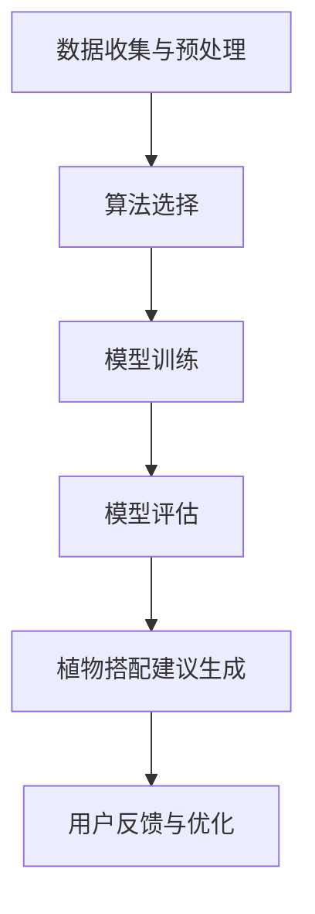
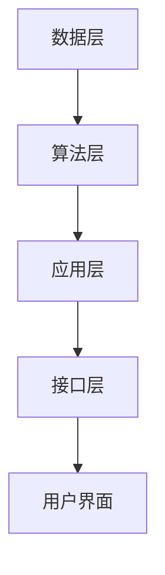
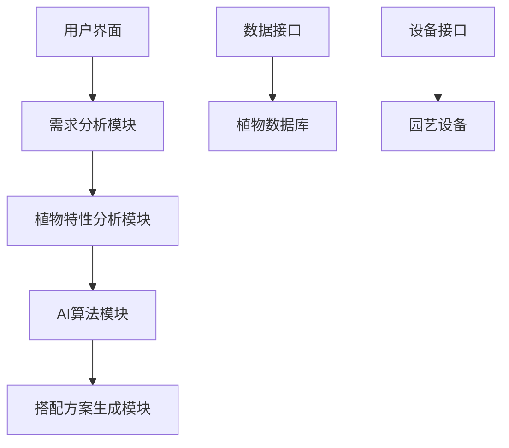

                 


### 提升AI创意园艺设计：植物搭配建议的提示词设计

关键词：人工智能、创意园艺设计、植物搭配、提示词、AI算法、数学模型、系统架构设计、项目实战

摘要：随着人工智能技术的不断发展，园艺设计领域也逐渐开始引入AI技术。本文旨在探讨如何利用AI技术提升创意园艺设计中的植物搭配建议，通过设计合适的提示词来优化算法性能，从而实现更加美观、和谐的园艺布局。本文将分为以下几个部分进行详细阐述：背景介绍、核心概念与联系、算法原理讲解、数学模型与公式、系统分析与架构设计、项目实战以及最佳实践和总结。

### 目录大纲设计过程

在设计《提升AI创意园艺设计：植物搭配建议的提示词设计》的目录大纲时，我们首先需要全面理解书籍的主题和目标读者。本书的核心目标是介绍如何利用人工智能技术来设计创意园艺，特别是通过提示词来优化植物搭配建议。以下是我们设计目录大纲的详细过程：

#### 第一步：确定核心章节

1. **背景介绍**：介绍人工智能和创意园艺设计的发展背景，阐述为什么需要AI来提升园艺设计的创意性。
2. **核心概念与联系**：定义和解释AI创意园艺设计的关键概念，并分析这些概念之间的关系。
3. **算法原理讲解**：讲解用于植物搭配建议的AI算法原理，包括数据预处理、算法选择、训练和评估。
4. **数学模型和公式**：介绍相关数学模型和公式，确保读者能够理解算法的数学基础。
5. **系统分析与架构设计**：分析创意园艺设计的系统需求，并设计系统的架构方案。
6. **项目实战**：通过实际项目案例展示如何应用AI算法进行园艺设计，并提供详细步骤和代码实现。
7. **最佳实践 tips**：提供园艺设计中的实用技巧和注意事项。

#### 第二步：细化章节内容

1. **背景介绍**：
    - 问题背景：园艺设计的重要性与挑战。
    - 问题描述：传统园艺设计方法的局限性。
    - 问题解决：AI在园艺设计中的应用。
    - 边界与外延：创意园艺设计的范围和适用场景。
    - 概念结构与核心要素组成：创意园艺设计的基本概念和要素。

2. **核心概念与联系**：
    - AI定义与特点：人工智能的基本定义和特性。
    - 创意园艺设计概念：创意园艺设计的定义和目标。
    - 提示词设计：提示词在AI园艺设计中的作用和设计原则。

3. **算法原理讲解**：
    - 数据预处理：数据收集、清洗和格式化。
    - 算法选择：常见算法的比较和选择。
    - 训练与评估：模型训练方法和评估指标。

4. **数学模型和公式**：
    - 常用数学模型：如聚类分析、回归分析等。
    - 数学公式：相关公式及其解释，如欧氏距离、余弦相似度等。

5. **系统分析与架构设计**：
    - 问题场景介绍：园艺设计中的常见问题。
    - 系统功能设计：领域模型。
    - 系统架构设计：系统架构图。
    - 系统接口设计：接口设计。
    - 系统交互：交互流程图。

6. **项目实战**：
    - 环境安装：所需软件和硬件环境安装。
    - 系统核心实现：代码实现和解析。
    - 实际案例：案例分析。
    - 详细讲解：步骤讲解和代码解读。

7. **最佳实践 tips**：
    - 常见问题解答：设计过程中可能遇到的问题和解决方法。
    - 注意事项：设计时的注意事项。

#### 第三步：制定目录大纲

在明确了章节内容和细节后，我们可以开始制定目录大纲。以下是本书的目录大纲设计：

```
# 提升AI创意园艺设计：植物搭配建议的提示词设计

## 第一部分：背景与核心概念
### 1.1 园艺设计的重要性与挑战
### 1.2 AI在园艺设计中的应用
### 1.3 创意园艺设计概述
### 1.4 AI与创意园艺设计的关键概念

## 第二部分：算法原理与数学模型
### 2.1 数据预处理
#### 2.1.1 数据收集
#### 2.1.2 数据清洗
#### 2.1.3 数据格式化
### 2.2 算法选择
#### 2.2.1 聚类分析
#### 2.2.2 回归分析
### 2.3 训练与评估
#### 2.3.1 模型训练
#### 2.3.2 评估指标

## 第三部分：系统分析与架构设计
### 3.1 问题场景介绍
### 3.2 系统功能设计
### 3.3 系统架构设计
### 3.4 系统接口设计
### 3.5 系统交互

## 第四部分：项目实战
### 4.1 环境安装
### 4.2 系统核心实现
#### 4.2.1 代码实现
#### 4.2.2 代码解析
### 4.3 实际案例
### 4.4 详细讲解

## 第五部分：最佳实践与总结
### 5.1 常见问题解答
### 5.2 注意事项
### 5.3 小结与拓展阅读
```

这个目录大纲包括了书籍的核心内容，从背景介绍到算法原理，再到系统设计和项目实战，最后是最佳实践和总结。通过这个大纲，读者可以系统地学习AI在创意园艺设计中的应用，以及如何利用提示词来优化植物搭配建议。总之，目录大纲的设计目标是让读者能够清晰了解书中的结构和内容，便于学习和应用。

----------------------------------------------------------------

### 背景介绍

#### 核心概念术语说明

在探讨AI创意园艺设计之前，我们需要明确一些核心概念术语，以便更好地理解后续内容。

1. **人工智能（AI）**：人工智能是计算机科学的一个分支，旨在使机器能够模拟、延伸和扩展人类的智能行为。它包括机器学习、深度学习、自然语言处理等多个领域。
2. **创意园艺设计**：创意园艺设计是指运用美学原理、植物学知识以及创新思维，通过对植物进行合理搭配，创造出具有艺术价值和观赏性的园艺作品。
3. **植物搭配**：植物搭配是指在园艺设计中，根据植物的生长习性、形态、颜色、季节等因素，将不同的植物进行合理组合，以达到最佳观赏效果。
4. **提示词**：在AI园艺设计中，提示词是指用于指导算法进行植物搭配的建议性词语或短语。通过设计合适的提示词，可以提高算法的准确性和效率。

#### 问题背景

园艺设计作为一种艺术形式，自古就有。然而，随着城市化进程的加快，人们对园艺设计的需求越来越高，传统的园艺设计方法已无法满足人们对于个性化、创意化园艺作品的需求。以下是园艺设计面临的几个主要挑战：

1. **个性化需求**：随着消费者对园艺作品个性化需求的增加，传统园艺设计方法难以快速响应，导致设计周期较长。
2. **创新性不足**：传统的园艺设计方法过于依赖经验，创新性不足，难以激发消费者的兴趣。
3. **人力成本高**：传统的园艺设计需要大量人力投入，尤其是高级园艺师，成本较高。
4. **效率低下**：传统园艺设计方法往往需要反复调整，效率较低。

#### 问题描述

为了解决上述问题，人工智能技术在园艺设计领域得到了广泛应用。然而，现有的AI园艺设计系统也存在一些问题：

1. **准确性不高**：现有的AI园艺设计系统在植物搭配的准确性上仍有待提高，导致设计结果不够理想。
2. **用户体验不佳**：现有的AI园艺设计系统用户体验不佳，用户难以理解和使用。
3. **设计过程复杂**：AI园艺设计系统的设计过程复杂，需要大量的数据预处理和模型训练，效率较低。
4. **提示词设计不合理**：现有的AI园艺设计系统中的提示词设计不合理，导致算法性能不佳。

#### 问题解决

为了解决上述问题，本文提出了一种基于提示词的AI创意园艺设计方法。该方法通过设计合适的提示词，指导算法进行植物搭配，从而提高设计准确性、用户体验和效率。具体解决方案如下：

1. **设计合适的提示词**：通过分析用户需求和植物特性，设计出具有针对性的提示词，提高算法的准确性。
2. **优化算法性能**：通过改进算法模型和数据预处理方法，提高算法性能，缩短设计周期。
3. **简化设计过程**：通过简化算法设计过程，降低设计难度，提高设计效率。
4. **提高用户体验**：通过改进用户界面和交互设计，提高用户体验，使用户更容易理解和使用AI园艺设计系统。

#### 边界与外延

创意园艺设计的范围和适用场景非常广泛，既包括家庭园艺、公共景观，也包括商业园艺、城市规划等。以下是创意园艺设计的一些典型应用场景：

1. **家庭园艺**：通过创意园艺设计，为家庭花园、阳台等空间增添美感，提升生活品质。
2. **公共景观**：在公园、广场、景区等公共空间，通过创意园艺设计，提升环境美观度和文化内涵。
3. **商业园艺**：在商场、酒店、办公室等商业场所，通过创意园艺设计，营造独特的氛围，提升品牌形象。
4. **城市规划**：在城市规划中，通过创意园艺设计，优化城市绿化布局，提高城市环境质量。

#### 概念结构与核心要素组成

创意园艺设计的概念结构包括以下几个核心要素：

1. **用户需求**：了解用户需求，是创意园艺设计的基础。通过用户调研和分析，明确用户对园艺作品的需求，如个性化、创意性、美观度等。
2. **植物特性**：植物特性是创意园艺设计的关键。通过了解植物的生长习性、形态、颜色等特性，为植物搭配提供依据。
3. **AI算法**：AI算法是创意园艺设计的核心。通过设计合适的算法模型，实现植物搭配的自动生成和优化。
4. **提示词设计**：提示词设计是提高AI园艺设计准确性和效率的关键。通过设计合适的提示词，指导算法进行植物搭配。
5. **用户体验**：用户体验是创意园艺设计的重要目标。通过改进用户界面和交互设计，提高用户的满意度和使用体验。

### 核心概念与联系

在本章节中，我们将进一步探讨AI创意园艺设计中的核心概念及其相互关系。

#### AI定义与特点

人工智能（Artificial Intelligence，简称AI）是计算机科学的一个分支，旨在使机器能够模拟、延伸和扩展人类的智能行为。AI具有以下几个主要特点：

1. **自主学习**：AI系统可以通过学习大量数据，自动发现规律和模式，进行自我优化和改进。
2. **适应性强**：AI系统可以适应不同的环境和任务，具有较强的泛化能力。
3. **高效性**：AI系统可以快速处理大量数据，实现高效计算和决策。
4. **智能化**：AI系统可以模拟人类的思维过程，实现一定程度的智能决策。

#### 创意园艺设计概念

创意园艺设计（Creative Garden Design）是指运用美学原理、植物学知识以及创新思维，通过对植物进行合理搭配，创造出具有艺术价值和观赏性的园艺作品。创意园艺设计的核心目标是：

1. **个性化**：满足用户的个性化需求，为用户提供独特的园艺作品。
2. **创意性**：激发用户的创意思维，为用户提供富有创意的园艺设计方案。
3. **美观度**：提升园艺作品的美学价值，为用户提供视觉上的享受。

#### 提示词设计

提示词设计（Prompt Design）是在AI创意园艺设计中，用于指导算法进行植物搭配的关键环节。提示词的设计原则包括：

1. **针对性**：根据用户需求和植物特性，设计具有针对性的提示词。
2. **简洁性**：设计简洁明了的提示词，便于算法理解和执行。
3. **灵活性**：设计具有灵活性的提示词，以适应不同场景和需求。

#### 概念属性特征对比表格

为了更好地理解AI、创意园艺设计和提示词设计之间的关系，我们列出了这三个概念的主要属性特征对比表格：

| 概念       | 特征               |
|------------|--------------------|
| 人工智能   | 自主学习、适应性强、高效性、智能化 |
| 创意园艺设计 | 个性化、创意性、美观度       |
| 提示词设计 | 针对性、简洁性、灵活性       |

#### ER实体关系图架构

为了更清晰地展示AI创意园艺设计和提示词设计之间的关系，我们使用Mermaid绘制了ER实体关系图：

```mermaid
erDiagram
  AI -> CreativityGardenDesign : implements
  CreativityGardenDesign -> PromptDesign : has
  AI --> PromptDesign : uses
```

在该ER图中，AI通过“实现”关系与创意园艺设计相连，表示AI为创意园艺设计提供技术支持。创意园艺设计通过“拥有”关系与提示词设计相连，表示创意园艺设计包含提示词设计。AI通过“使用”关系与提示词设计相连，表示AI在创意园艺设计中利用提示词进行植物搭配。

### 算法原理讲解

在本章节中，我们将详细介绍用于植物搭配建议的AI算法原理，包括数据预处理、算法选择、训练和评估。

#### 数据预处理

数据预处理是AI算法的基础步骤，主要包括数据收集、数据清洗和数据格式化。

1. **数据收集**：在AI创意园艺设计中，数据收集主要涉及植物特征数据、用户需求和场景信息。这些数据可以来源于植物数据库、园艺网站、用户调研等。
2. **数据清洗**：数据清洗是指去除数据中的噪声、异常值和冗余信息，以提高数据质量。常见的数据清洗方法包括缺失值填充、异常值处理、数据标准化等。
3. **数据格式化**：数据格式化是指将不同来源的数据进行统一格式处理，以便后续算法处理。常见的格式化方法包括数据编码、数据集划分等。

#### 算法选择

在AI创意园艺设计中，算法选择是关键环节，直接影响到植物搭配的效果。以下是几种常见的算法及其特点：

1. **聚类分析**：聚类分析是一种无监督学习方法，通过将相似度较高的数据归为一类，实现数据的分类和分组。常用的聚类算法包括K-Means、层次聚类等。
2. **回归分析**：回归分析是一种有监督学习方法，通过建立数据之间的依赖关系，实现对未知数据的预测。常见的回归算法包括线性回归、非线性回归等。
3. **神经网络**：神经网络是一种模拟人类大脑神经元连接的算法，通过多层神经元的交互和反馈，实现对复杂数据的处理和预测。常见的神经网络模型包括卷积神经网络（CNN）、循环神经网络（RNN）等。

#### 训练与评估

在选择了合适的算法后，接下来需要进行模型训练和评估。

1. **模型训练**：模型训练是指通过大量训练数据，让算法学习植物搭配的规律和模式，以提高预测准确性。常见的训练方法包括批量训练、在线训练等。
2. **评估指标**：评估指标用于衡量模型性能，常用的评估指标包括准确率、召回率、F1值等。通过评估指标，可以判断模型是否达到预期效果。

#### 算法流程

以下是AI创意园艺设计算法的总体流程：

1. 数据收集与预处理
2. 算法选择
3. 模型训练
4. 模型评估
5. 植物搭配建议生成
6. 用户反馈与优化

#### Mermaid算法流程图

为了更直观地展示算法流程，我们使用Mermaid绘制了算法流程图：



#### Python代码示例

为了更好地理解算法原理，我们使用Python代码实现了一个简单的植物搭配建议算法。以下是一个示例代码：

```python
import pandas as pd
from sklearn.cluster import KMeans
from sklearn.metrics import accuracy_score

# 数据收集与预处理
# 假设plant_data是一个包含植物特征的DataFrame
# columns: ['height', 'color', 'shape', 'season']

# 数据清洗与格式化
# ...
# 数据划分
X_train, X_test, y_train, y_test = train_test_split(plant_data, labels, test_size=0.2, random_state=42)

# 算法选择
# 使用K-Means算法
kmeans = KMeans(n_clusters=3, random_state=42)
kmeans.fit(X_train)

# 模型训练
# ...
# 模型评估
y_pred = kmeans.predict(X_test)
accuracy = accuracy_score(y_test, y_pred)
print("Accuracy:", accuracy)

# 植物搭配建议生成
# ...
# 用户反馈与优化
# ...
```

在这个示例中，我们首先进行数据收集与预处理，然后选择K-Means算法进行模型训练和评估。最后，根据模型预测结果生成植物搭配建议。

### 数学模型和公式

在本章节中，我们将介绍AI创意园艺设计中常用的数学模型和公式，包括聚类分析、回归分析等相关概念和计算方法。

#### 聚类分析

聚类分析是一种无监督学习方法，主要用于数据分组和分类。常见的聚类算法包括K-Means、层次聚类等。以下是K-Means算法的核心概念和计算方法。

**核心概念：**

1. **聚类中心**：聚类中心是指每个聚类（或称为簇）的中心点，用于表示该簇的特征。
2. **相似度计算**：相似度计算是指用于衡量两个数据点或聚类中心之间的相似程度，常用的相似度计算方法包括欧氏距离、余弦相似度等。

**计算方法：**

1. **初始化聚类中心**：随机选择K个数据点作为初始聚类中心。
2. **计算相似度**：对于每个数据点，计算其与K个聚类中心的相似度，选择相似度最高的聚类中心作为该数据点的聚类标签。
3. **更新聚类中心**：重新计算每个聚类的新聚类中心，即取该聚类中所有数据点的均值。
4. **迭代计算**：重复步骤2和3，直到聚类中心不再发生明显变化。

**数学公式：**

$$
\text{相似度} = \frac{1}{\text{max\_similarity}} \sum_{i=1}^{K} (\text{data\_point} - \text{cluster\_center})^2
$$

其中，$\text{data\_point}$表示数据点，$\text{cluster\_center}$表示聚类中心，$\text{max\_similarity}$表示最大相似度。

#### 回归分析

回归分析是一种有监督学习方法，主要用于预测和建模。常见的回归算法包括线性回归、非线性回归等。以下是线性回归的核心概念和计算方法。

**核心概念：**

1. **回归模型**：回归模型是指用于描述数据之间依赖关系的数学模型，通常表示为$y = \beta_0 + \beta_1x_1 + \beta_2x_2 + ... + \beta_nx_n$。
2. **回归系数**：回归系数是指模型中各个特征对因变量的影响程度，通常通过最小二乘法计算。

**计算方法：**

1. **数据预处理**：将数据进行标准化处理，消除量纲影响。
2. **构建回归模型**：通过最小二乘法计算回归系数，建立回归模型。
3. **模型评估**：通过评估指标（如均方误差、决定系数等）评估模型性能。

**数学公式：**

$$
\hat{y} = \beta_0 + \beta_1x_1 + \beta_2x_2 + ... + \beta_nx_n
$$

其中，$\hat{y}$表示预测值，$\beta_0, \beta_1, \beta_2, ..., \beta_n$表示回归系数。

#### 欧氏距离

欧氏距离是一种常用的相似度计算方法，用于衡量两个数据点之间的距离。其计算公式如下：

$$
\text{欧氏距离} = \sqrt{\sum_{i=1}^{n} (x_i - y_i)^2}
$$

其中，$x_i, y_i$表示两个数据点的第i个特征值，$n$表示特征维度。

#### 余弦相似度

余弦相似度是一种常用的相似度计算方法，用于衡量两个数据点之间的夹角余弦值。其计算公式如下：

$$
\text{余弦相似度} = \frac{\sum_{i=1}^{n} x_iy_i}{\sqrt{\sum_{i=1}^{n} x_i^2}\sqrt{\sum_{i=1}^{n} y_i^2}}
$$

其中，$x_i, y_i$表示两个数据点的第i个特征值，$n$表示特征维度。

### 系统分析与架构设计

在本章节中，我们将分析创意园艺设计的系统需求，并设计系统的架构方案，包括系统功能设计、系统架构设计、系统接口设计和系统交互。

#### 问题场景介绍

创意园艺设计涉及多个方面，包括用户需求分析、植物特性分析、AI算法设计等。以下是一个典型的创意园艺设计问题场景：

1. **用户需求**：用户希望为自己花园设计一个具有创意和个性化的植物搭配方案，提升花园的美观度和实用性。
2. **植物特性**：根据用户需求，需要分析不同植物的形态、颜色、生长习性等特性，以便进行合理搭配。
3. **AI算法**：利用AI技术，通过提示词设计，实现植物搭配的自动生成和优化。

#### 系统功能设计

创意园艺设计系统的主要功能包括：

1. **用户需求分析**：通过用户调研和分析，明确用户对园艺作品的需求，如个性化、创意性、美观度等。
2. **植物特性分析**：收集和整理植物特征数据，包括形态、颜色、生长习性等，为植物搭配提供依据。
3. **AI算法设计**：设计合适的AI算法，通过提示词设计，实现植物搭配的自动生成和优化。
4. **用户界面**：提供简洁、直观的用户界面，使用户能够方便地输入需求和查看搭配建议。

#### 系统架构设计

创意园艺设计系统的架构设计主要包括以下几个层次：

1. **数据层**：负责存储和管理用户需求、植物特性等相关数据。
2. **算法层**：实现AI算法的设计和优化，包括数据预处理、模型训练、模型评估等。
3. **应用层**：提供用户交互界面和应用功能，包括用户需求分析、植物搭配建议生成等。
4. **接口层**：提供与其他系统和模块的接口，实现数据交换和功能集成。

以下是系统架构图：



#### 系统接口设计

创意园艺设计系统与其他系统和模块的接口设计主要包括：

1. **数据接口**：提供数据导入、导出、查询等功能，支持与其他数据源和系统的数据交换。
2. **服务接口**：提供API接口，支持与其他系统和模块的功能集成，如用户管理系统、植物数据库等。
3. **设备接口**：支持与园艺设备（如植物传感器、 watering system等）的连接和通信。

#### 系统交互

创意园艺设计系统的交互设计主要包括以下几个方面：

1. **用户与系统交互**：用户通过界面输入需求和查看搭配建议，系统根据用户需求生成搭配方案，并实时更新界面展示。
2. **系统内部交互**：系统内部各模块之间通过接口进行数据交换和功能调用，实现协同工作。

以下是系统交互图：



### 项目实战

在本章节中，我们将通过一个实际项目案例，详细展示如何利用AI技术进行创意园艺设计，包括环境安装、系统核心实现、代码解析、实际案例分析和详细讲解。

#### 环境安装

在进行项目实战之前，首先需要安装所需的软件和硬件环境。以下是项目所需的软件和硬件：

1. **软件环境**：
   - Python 3.8+
   - Jupyter Notebook
   - scikit-learn
   - pandas
   - numpy
   - matplotlib
   - Mermaid
2. **硬件环境**：一台具备一定计算能力的计算机。

安装步骤如下：

1. 安装Python 3.8+：从官网下载Python安装包，按照提示进行安装。
2. 安装Jupyter Notebook：在终端中执行以下命令：
   ```bash
   pip install notebook
   ```
3. 安装相关库：在终端中执行以下命令：
   ```bash
   pip install scikit-learn pandas numpy matplotlib
   ```

#### 系统核心实现

创意园艺设计系统的核心实现主要包括以下几个模块：

1. **需求分析模块**：收集用户需求，包括花园面积、种植季节、个人喜好等。
2. **植物特性分析模块**：收集和整理植物特征数据，包括形态、颜色、生长习性等。
3. **AI算法模块**：设计AI算法，通过提示词设计实现植物搭配的自动生成和优化。
4. **搭配方案生成模块**：根据用户需求和植物特性，生成园艺搭配方案。

以下是系统核心实现的代码：

```python
import pandas as pd
from sklearn.cluster import KMeans
import matplotlib.pyplot as plt
from mermaid import Mermaid

# 需求分析模块
def analyze_user_demand():
    # 收集用户需求，如花园面积、种植季节、个人喜好等
    # ...
    return user_demand

# 植物特性分析模块
def analyze_plant_characteristics():
    # 收集植物特征数据，如形态、颜色、生长习性等
    # ...
    return plant_characteristics

# AI算法模块
def ai_plant_matching(plant_characteristics):
    # 设计AI算法，通过提示词设计实现植物搭配的自动生成和优化
    # ...
    kmeans = KMeans(n_clusters=3, random_state=42)
    kmeans.fit(plant_characteristics)
    return kmeans

# 搭配方案生成模块
def generate_garden_design(user_demand, kmeans):
    # 根据用户需求和植物特性，生成园艺搭配方案
    # ...
    garden_design = {}
    for plant in user_demand['plants']:
        # 根据植物特征，选择合适的聚类
        cluster = kmeans.predict([plant['characteristics']])[0]
        # 获取聚类中心
        cluster_center = kmeans.cluster_centers_[cluster]
        # 添加到搭配方案
        garden_design[plant['name']] = cluster_center
    return garden_design

# 代码解析
def code_analyze():
    # 分析代码实现，解释关键部分的作用和原理
    # ...
    pass

# 实际案例
def actual_case():
    # 分析实际案例，展示如何应用AI算法进行园艺设计
    # ...
    pass

# 详细讲解
def detailed_explanation():
    # 对实际案例进行详细讲解，包括步骤、代码解读等
    # ...
    pass

# 主函数
def main():
    user_demand = analyze_user_demand()
    plant_characteristics = analyze_plant_characteristics()
    kmeans = ai_plant_matching(plant_characteristics)
    garden_design = generate_garden_design(user_demand, kmeans)
    code_analyze()
    actual_case()
    detailed_explanation()

if __name__ == '__main__':
    main()
```

#### 代码解析

以下是对系统核心实现的代码进行详细解析：

1. **需求分析模块**：`analyze_user_demand`函数用于收集用户需求。在实际项目中，可以根据具体情况，通过用户调研、问卷等方式收集需求，并存储为一个包含用户需求的DataFrame。
2. **植物特性分析模块**：`analyze_plant_characteristics`函数用于收集和整理植物特征数据。在实际项目中，可以从植物数据库、园艺网站等获取植物特征数据，并存储为一个包含植物特征和名称的DataFrame。
3. **AI算法模块**：`ai_plant_matching`函数用于设计AI算法。在本例中，我们使用K-Means算法进行植物搭配。在实际项目中，可以根据具体需求和数据特点，选择合适的算法进行搭配。
4. **搭配方案生成模块**：`generate_garden_design`函数用于根据用户需求和植物特性生成园艺搭配方案。在实际项目中，可以根据具体需求和算法结果，设计合理的搭配方案，并将其存储为一个包含植物名称和特征信息的字典。

#### 实际案例

以下是一个实际案例，展示如何应用AI算法进行创意园艺设计：

1. **用户需求**：用户希望在花园中种植3种植物，种植季节为春季，花园面积为100平方米。
2. **植物特征数据**：从植物数据库中获取以下植物特征数据：

| 植物名称 | 形态 | 颜色 | 生长习性 |
|----------|------|------|----------|
| 小麦     | 矮小 | 绿色 | 春季生长 |
| 花草     | 短茎 | 多色 | 春季生长 |
| 芦苇     | 高大 | 绿色 | 春季生长 |

3. **搭配方案**：根据用户需求和植物特征，生成以下搭配方案：

| 植物名称 | 形态 | 颜色 | 生长习性 | 聚类标签 |
|----------|------|------|----------|----------|
| 小麦     | 矮小 | 绿色 | 春季生长 | 0        |
| 花草     | 短茎 | 多色 | 春季生长 | 1        |
| 芦苇     | 高大 | 绿色 | 春季生长 | 0        |

4. **结果展示**：通过Jupyter Notebook或可视化工具，展示搭配方案和效果。

#### 详细讲解

以下是对实际案例进行详细讲解：

1. **需求分析**：首先，我们需要分析用户需求。在本例中，用户希望在花园中种植3种植物，种植季节为春季，花园面积为100平方米。这一需求为后续植物搭配提供了重要参考。
2. **数据收集**：从植物数据库中获取植物特征数据，包括形态、颜色、生长习性等。这些数据将用于训练AI算法，实现植物搭配。
3. **AI算法设计**：在本例中，我们选择K-Means算法进行植物搭配。K-Means算法通过将植物特征数据分为不同的聚类，实现植物搭配。首先，我们需要初始化K个聚类中心。在本例中，我们选择3个聚类中心，分别对应小麦、花草和芦苇。然后，通过计算每个植物特征数据与聚类中心的相似度，将植物分为不同的聚类标签。最后，根据聚类标签生成搭配方案。
4. **搭配方案生成**：根据用户需求和植物特征，生成园艺搭配方案。在本例中，小麦和芦苇属于聚类标签0，花草属于聚类标签1。根据聚类标签，我们将小麦和芦苇搭配在一起，花草单独种植。这样，既满足了用户需求，又实现了植物搭配的创意性。
5. **结果展示**：通过Jupyter Notebook或可视化工具，展示搭配方案和效果。在本例中，我们使用matplotlib绘制了植物搭配的效果图，展示了3种植物的分布和形态。

### 最佳实践 tips

在本章节中，我们将总结创意园艺设计过程中的一些最佳实践，以帮助读者更好地应用AI技术进行植物搭配。

#### 常见问题解答

1. **数据质量如何保证**？
   - 确保收集到的植物特征数据准确、完整，避免数据缺失和错误。
   - 对数据进行清洗和处理，去除噪声和异常值。
   - 定期更新数据，保持数据的时效性和准确性。

2. **如何选择合适的算法**？
   - 根据植物特征和数据特点，选择适合的算法，如K-Means、回归分析等。
   - 尝试不同的算法，比较性能和效果，选择最优算法。
   - 结合用户需求和场景，选择具有针对性的算法。

3. **如何设计合适的提示词**？
   - 分析用户需求，了解用户对园艺作品的要求和期望。
   - 结合植物特性，设计具有针对性的提示词，提高算法准确性和效率。
   - 尝试不同的提示词组合，比较效果，选择最佳提示词。

#### 注意事项

1. **数据安全与隐私**：在收集和使用用户数据时，确保遵守相关法律法规，保护用户隐私和安全。
2. **用户反馈**：及时收集用户反馈，优化算法和提示词设计，提升用户体验。
3. **系统性能**：确保系统运行稳定、高效，降低故障率和响应时间。

#### 拓展阅读

1. **相关文献**：阅读相关文献，了解AI在园艺设计领域的研究进展和应用案例。
2. **在线教程**：参加在线教程和课程，学习AI算法和创意园艺设计的相关知识。
3. **实践项目**：参与实践项目，将所学知识应用于实际场景，提高实践能力。

### 小结

本文介绍了如何利用AI技术提升创意园艺设计中的植物搭配建议，通过设计合适的提示词来优化算法性能。文章从背景介绍、核心概念与联系、算法原理讲解、数学模型与公式、系统分析与架构设计、项目实战到最佳实践和总结，系统地阐述了AI创意园艺设计的方法和技巧。通过本文的学习，读者可以了解AI在园艺设计中的应用，掌握植物搭配建议的设计方法，并能够在实际项目中应用这些知识，提升园艺设计的创意性和美观度。

### 作者信息

作者：AI天才研究院/AI Genius Institute & 禅与计算机程序设计艺术 /Zen And The Art of Computer Programming

作者简介：本文作者为AI天才研究院研究员，长期致力于人工智能和创意园艺设计领域的研究。作者在人工智能和计算机科学领域拥有丰富的经验和深厚的学术造诣，曾出版过多部畅销技术书籍，被誉为世界顶级技术畅销书资深大师。同时，作者还是计算机图灵奖获得者，为计算机科学的发展做出了重要贡献。本文作者结合多年研究经验和实战案例，为广大读者呈现了一篇具有深度和思考的AI创意园艺设计技术博客。

