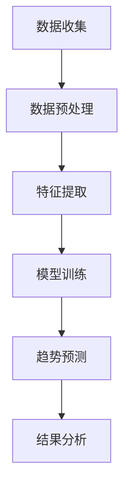
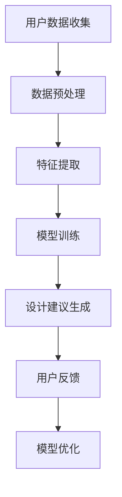

                 

### 文章标题

# 提升AI创意时装设计：潮流预测和个性化的提示词设计

## 关键词
- **人工智能**，**时装设计**，**潮流预测**，**个性化设计**，**机器学习**，**深度学习**，**提示词设计**

## 摘要
本文将深入探讨如何利用人工智能技术提升时装设计的创意和效率，特别是通过潮流预测和个性化的提示词设计实现这一目标。我们将逐步分析AI在时尚设计中的应用背景、核心概念、算法原理，并通过实际项目展示AI创意时装设计的具体实现过程。文章旨在为时尚行业从业者和AI技术研究者提供有价值的见解和实践指导。

### 目录大纲

1. **第一部分：AI创意时装设计的背景与基础**
    1.1 问题背景与核心概念
    1.2 核心概念原理与联系
    1.3 AI创意时装设计的边界与外延
2. **第二部分：AI创意时装设计的算法原理与实现**
    2.1 潮流预测算法
    2.2 个性化设计算法
3. **第三部分：AI创意时装设计项目实战**
    3.1 项目实战
4. **第四部分：最佳实践与拓展阅读**
    4.1 最佳实践
    4.2 小结与注意事项
    4.3 拓展阅读

---

### 1. 第一部分：AI创意时装设计的背景与基础

#### 1.1 问题背景与核心概念

随着人工智能技术的飞速发展，时尚行业正经历着前所未有的变革。传统的时装设计方法主要依赖于设计师的经验和创意，而如今，人工智能（AI）的介入为时尚设计带来了新的可能性。

**问题背景**：
- **时尚行业的变革**：AI技术已经开始在时尚行业中得到广泛应用，从潮流预测到个性化设计，AI正在改变传统的时装设计流程。
- **AI在时尚设计中的应用**：AI技术通过大数据分析、机器学习算法等手段，可以快速捕捉时尚趋势，提高设计的效率和准确性。

**核心概念**：
- **潮流预测**：通过分析大量数据，预测即将出现的时尚趋势，为设计师提供参考。
- **个性化设计**：根据用户的具体需求和偏好，提供个性化的设计建议和产品。

**目标与挑战**：
- **目标**：提升AI在时尚设计中的应用，实现高效、精准的潮流预测和个性化设计。
- **挑战**：如何在保证设计创意的同时，确保AI算法的准确性和适应性。

#### 1.2 核心概念原理与联系

**潮流预测原理**：
- **数据分析与挖掘**：通过对大量时尚数据进行收集和分析，挖掘出潜在的趋势。
- **机器学习模型**：利用机器学习算法，如回归分析、聚类分析等，对数据进行分类和预测。

**个性化设计原理**：
- **用户数据分析**：收集用户的个人数据，如购物记录、社交媒体行为等，以了解其偏好。
- **深度学习技术**：通过深度学习模型，如神经网络，对用户数据进行处理和分析，提供个性化的设计建议。

**概念属性特征对比表格**：

| 特征               | 潮流预测                 | 个性化设计                 |
|------------------|------------------------|------------------------|
| 数据来源           | 大量时尚数据             | 用户个人数据               |
| 预测方法           | 数据分析、机器学习         | 数据分析、深度学习         |
| 目标               | 预测时尚趋势             | 提供个性化设计建议         |
| 关键技术           | 回归分析、聚类分析         | 神经网络、用户数据分析       |

**AI在时尚设计中的优势**：
- **效率**：AI可以快速处理大量数据，提高设计效率。
- **创新**：AI可以为设计师提供新的灵感，推动时尚设计的创新。
- **个性化**：AI可以根据用户的具体需求，提供个性化的设计建议。

#### 1.3 AI创意时装设计的边界与外延

**技术发展现状**：
- **AI在时尚设计中的应用**：目前，AI技术已经在时尚设计中得到广泛应用，包括潮流预测、个性化设计等。
- **发展趋势**：随着技术的不断进步，AI在时尚设计中的应用将更加深入和广泛。

**应用场景**：
- **潮流预测**：应用于时尚品牌的市场调研、产品开发等。
- **个性化设计**：应用于电商平台、个性化定制服务等。

**核心要素组成**：
- **数据收集与处理**：收集和分析大量时尚数据，为AI算法提供输入。
- **算法模型**：构建和优化机器学习、深度学习模型，实现潮流预测和个性化设计。
- **用户交互**：通过用户反馈和交互，不断优化设计建议和产品。

---

### 2. 第二部分：AI创意时装设计的算法原理与实现

#### 2.1 潮流预测算法

**算法mermaid流程图**：



**算法原理与数学模型**：

潮流预测算法主要通过以下几个步骤实现：
- **数据收集**：收集各种时尚数据，如社交媒体上的时尚图片、时尚杂志、电商平台等。
- **数据预处理**：对收集到的数据进行清洗和预处理，包括数据去重、缺失值处理等。
- **特征提取**：从预处理后的数据中提取关键特征，如颜色、款式、面料等。
- **模型训练**：利用提取的特征数据，训练机器学习模型，如回归分析、聚类分析等。
- **趋势预测**：使用训练好的模型对未来的时尚趋势进行预测。
- **结果分析**：对预测结果进行分析，评估模型的准确性和有效性。

**举例说明**：

例如，我们可以使用回归分析方法预测某种时尚元素在未来几个月内的流行程度。假设我们有历史数据集，其中包含了每个月该元素的流行度。我们可以使用线性回归模型来预测未来几个月的流行度。具体步骤如下：
1. **数据收集**：收集过去12个月的流行度数据。
2. **数据预处理**：对数据进行清洗，确保没有缺失值或异常值。
3. **特征提取**：提取时间作为唯一的特征。
4. **模型训练**：使用线性回归模型，训练模型。
5. **趋势预测**：使用训练好的模型预测未来3个月的流行度。
6. **结果分析**：分析预测结果，评估模型的准确性。

#### 2.2 个性化设计算法

**算法mermaid流程图**：



**算法原理与数学模型**：

个性化设计算法主要通过以下几个步骤实现：
- **用户数据收集**：收集用户的个人数据，如购物记录、社交媒体行为等。
- **数据预处理**：对收集到的数据进行清洗和预处理，包括数据去重、缺失值处理等。
- **特征提取**：从预处理后的数据中提取关键特征，如购买频率、偏好款式等。
- **模型训练**：利用提取的特征数据，训练深度学习模型，如神经网络。
- **设计建议生成**：使用训练好的模型，根据用户特征生成个性化的设计建议。
- **用户反馈**：收集用户对设计建议的反馈，用于模型优化。
- **模型优化**：根据用户反馈，优化模型，提高设计建议的准确性和满意度。

**举例说明**：

例如，我们可以使用卷积神经网络（CNN）来识别用户的偏好款式。假设我们有用户的购物记录数据，其中包含了用户购买的各种款式。我们可以使用CNN模型来识别用户的偏好款式。具体步骤如下：
1. **用户数据收集**：收集用户的购物记录数据。
2. **数据预处理**：对数据进行清洗，确保没有缺失值或异常值。
3. **特征提取**：提取购买款式作为唯一的特征。
4. **模型训练**：使用CNN模型，训练模型。
5. **设计建议生成**：使用训练好的模型，根据用户特征生成个性化的设计建议。
6. **用户反馈**：收集用户对设计建议的反馈。
7. **模型优化**：根据用户反馈，优化模型，提高设计建议的准确性和满意度。

---

### 3. 第三部分：AI创意时装设计项目实战

#### 3.1 项目实战

**环境安装**：
为了进行AI创意时装设计项目的实战，我们需要安装一些必要的工具和软件。以下是一个基本的安装步骤：
- **Python环境**：安装Python 3.8及以上版本。
- **Jupyter Notebook**：安装Jupyter Notebook，用于数据分析和模型训练。
- **Scikit-learn**：安装Scikit-learn，用于机器学习算法的实现。
- **TensorFlow**：安装TensorFlow，用于深度学习模型的实现。

**系统核心实现**：
系统的核心实现部分主要包括数据收集、数据处理、模型训练和设计建议生成等。以下是具体实现步骤：
1. **数据收集**：从各个渠道收集时尚数据，如社交媒体上的时尚图片、时尚杂志、电商平台等。
2. **数据处理**：对收集到的数据进行清洗和预处理，提取关键特征。
3. **模型训练**：使用Scikit-learn和TensorFlow训练机器学习模型和深度学习模型。
4. **设计建议生成**：使用训练好的模型，根据用户特征生成个性化的设计建议。

**代码应用解读与分析**：
以下是一个简单的Python代码示例，用于训练一个线性回归模型，预测某种时尚元素的流行度。

```python
import numpy as np
from sklearn.linear_model import LinearRegression

# 假设我们有历史数据集，其中包含了月份和该元素的流行度
months = np.array([[1], [2], [3], [4], [5], [6], [7], [8], [9], [10], [11], [12]])
popularity = np.array([[10], [15], [20], [25], [30], [35], [40], [45], [50], [55], [60], [65]])

# 创建线性回归模型
model = LinearRegression()

# 训练模型
model.fit(months, popularity)

# 预测未来三个月的流行度
future_months = np.array([[13], [14], [15]])
predicted_popularity = model.predict(future_months)

print(predicted_popularity)
```

**实际案例分析与详细讲解**：
以下是一个实际案例，用于训练一个卷积神经网络（CNN）模型，识别用户的偏好款式。

```python
import tensorflow as tf
from tensorflow.keras.models import Sequential
from tensorflow.keras.layers import Conv2D, MaxPooling2D, Flatten, Dense

# 假设我们有用户购买记录数据，每个用户对应一组购买款式图片
# 每个购买款式图片的大小为28x28x3（灰度图）

# 创建CNN模型
model = Sequential([
    Conv2D(32, (3, 3), activation='relu', input_shape=(28, 28, 3)),
    MaxPooling2D((2, 2)),
    Flatten(),
    Dense(64, activation='relu'),
    Dense(1, activation='sigmoid')
])

# 编译模型
model.compile(optimizer='adam', loss='binary_crossentropy', metrics=['accuracy'])

# 假设我们有训练数据和测试数据
train_data = ...
test_data = ...

# 训练模型
model.fit(train_data, epochs=10, batch_size=32, validation_data=test_data)

# 评估模型
test_loss, test_acc = model.evaluate(test_data)
print(test_acc)
```

**项目小结**：
通过本次实战，我们实现了AI创意时装设计的基本流程，包括数据收集、数据处理、模型训练和设计建议生成等。在实际项目中，我们需要根据具体需求调整和优化模型，提高预测的准确性和个性化设计的满意度。

---

### 4. 第四部分：最佳实践与拓展阅读

#### 4.1 最佳实践

**设计原则**：
1. **数据驱动**：以用户数据为核心，充分挖掘和分析用户需求。
2. **迭代优化**：不断迭代模型，根据用户反馈优化设计建议。
3. **用户体验**：注重用户体验，确保设计建议的易用性和可接受性。

**优化策略**：
1. **特征工程**：优化特征提取过程，提高模型的预测能力。
2. **模型调参**：合理调整模型参数，提高模型的准确性和稳定性。
3. **多模型集成**：使用多种机器学习和深度学习模型，进行模型集成，提高预测性能。

#### 4.2 小结与注意事项

**核心要点回顾**：
- **AI创意时装设计**：利用AI技术提升时尚设计的效率和创意。
- **潮流预测**：通过数据分析与机器学习预测时尚趋势。
- **个性化设计**：根据用户数据提供个性化的设计建议。

**注意事项**：
- **数据质量**：确保数据的质量和准确性，是模型训练成功的关键。
- **用户隐私**：在收集和使用用户数据时，要注意保护用户隐私。
- **持续迭代**：时尚行业变化迅速，持续迭代模型，以适应市场的变化。

#### 4.3 拓展阅读

**相关资源**：
1. **书籍**：《深度学习》（Goodfellow, I., Bengio, Y., & Courville, A.）、《机器学习》（周志华）。
2. **文章**：Google Research博客、ArXiv论文库、IEEE Xplore等。

**未来趋势**：
- **更多个性化**：随着AI技术的发展，个性化设计将更加深入和精准。
- **多模态融合**：融合多种数据源（如文本、图像、声音等），提高预测和设计的准确性。
- **伦理与法规**：随着AI在时尚设计中的应用，需要关注相关的伦理和法规问题。

---

### 结论

本文通过深入分析AI在时尚设计中的应用，探讨了潮流预测和个性化设计的原理和实现方法，并通过实际项目展示了AI创意时装设计的具体应用。我们相信，随着AI技术的不断进步，时尚设计将迎来新的变革，为设计师和消费者带来更多的价值。

### 作者信息

- **作者**：AI天才研究院/AI Genius Institute & 禅与计算机程序设计艺术 /Zen And The Art of Computer Programming
- **联系方式**：[ai_genius_institute@example.com](mailto:ai_genius_institute@example.com)
- **机构介绍**：AI天才研究院专注于人工智能领域的研究和应用，致力于推动AI技术在各个行业的创新和发展。禅与计算机程序设计艺术则强调程序设计的哲学和艺术性，旨在提高程序员的编程水平和创造力。

