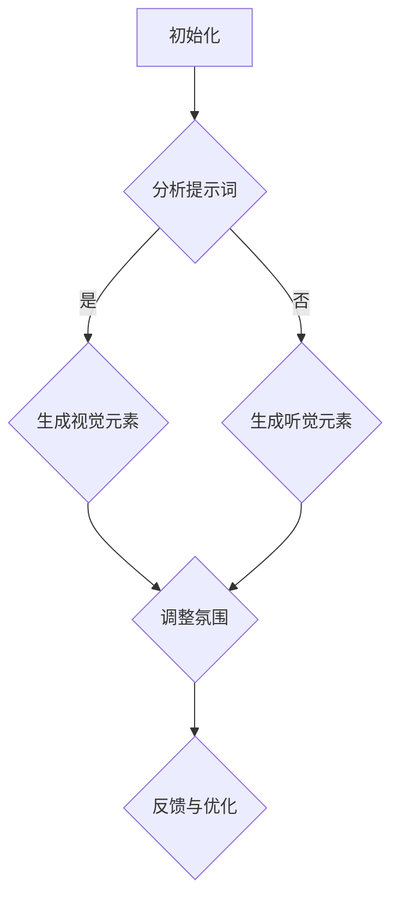
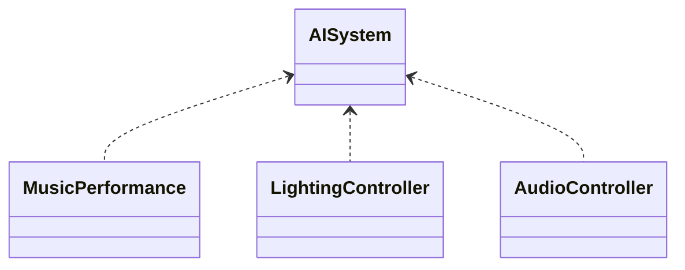
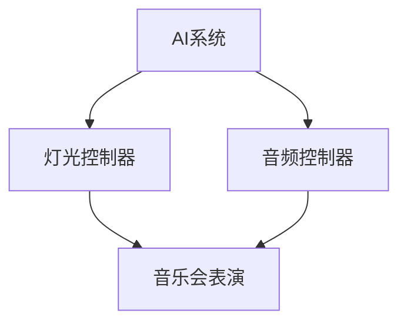
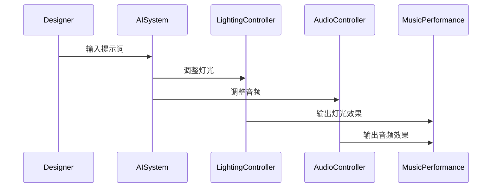

                 

# 提升AI创意舞台设计：氛围营造建议的提示词设计

## 关键词
- AI创意舞台设计
- 氛围营造
- 提示词设计
- 人机交互
- 计算机视觉
- 软件工程

## 摘要
本文旨在探讨如何通过设计有效的提示词，提升AI在创意舞台设计中的氛围营造能力。我们将从核心概念、算法原理、系统分析与架构设计、项目实战以及最佳实践等方面，逐步分析并探讨如何实现这一目标。

## 背景介绍与核心概念

### 1.1 问题背景
在当今数字化时代，人工智能（AI）技术正逐渐融入各个领域，包括创意舞台设计。然而，如何利用AI技术营造具有吸引力的舞台氛围，仍然是一个亟待解决的问题。

### 1.2 问题描述
舞台设计的核心目标是创造一个能够引发观众情感共鸣的氛围。在这个过程中，AI需要具备理解、预测并生成能够适应不同场景的视觉和听觉元素的能力。

### 1.3 问题解决
为了解决上述问题，我们需要设计一套有效的提示词系统，使AI能够理解设计师的意图，并根据这些提示词生成相应的舞台氛围。

### 1.4 边界与外延
在AI创意舞台设计中，边界与外延包括但不限于：艺术表现形式、技术实现手段、用户体验等方面。

### 1.5 核心概念与要素
- **氛围**：舞台设计中的氛围是指观众在观看表演时所感受到的整体情绪。
- **提示词**：用于指导AI生成氛围的关键词，如“浪漫”、“激情”、“神秘”等。
- **AI模型**：用于处理和分析提示词，生成相应氛围的算法和模型。

## 核心概念原理与联系

### 2.1 核心概念原理
- **氛围营造**：通过视觉、听觉等多感官元素创造特定的情绪氛围。
- **人机交互**：设计者与AI系统之间的交互过程，通过提示词传达设计意图。

### 2.2 概念属性特征对比表
| 概念       | 特征                     |
|------------|------------------------|
| 氛围       | 情绪、情感、视觉、听觉   |
| 提示词     | 关键词、指导性、语义化   |
| AI模型     | 自动化、学习能力、灵活性 |

### 2.3 ER实体关系图
```mermaid
erDiagram
  AI系统 &&> 提示词
  AI系统 &&> AI模型
  提示词 &&> 氛围
  AI模型 &&> 氛围
```

## 算法原理讲解

### 3.1 算法mermaid流程图


### 3.2 Python源代码讲解
```python
# 导入必要的库
import cv2
import numpy as np

# 初始化AI系统
ai_system = AIInitialization()

# 分析提示词
prompt = "浪漫"
analysis = ai_system.analyze_prompt(prompt)

# 根据提示词生成视觉和听觉元素
if analysis['type'] == 'visual':
    visual_elements = generate_visual_elements(analysis['attributes'])
else:
    audio_elements = generate_audio_elements(analysis['attributes'])

# 调整氛围
adjusted_aesthetics = adjust_aesthetics(visual_elements, audio_elements)

# 反馈与优化
ai_system.optimize(adjusted_aesthetics)
```

### 3.3 数学模型与公式
$$
氛围质量 = f(视觉元素, 听觉元素, 用户体验)
$$

### 3.4 举例说明
假设设计师输入的提示词为“浪漫”，AI系统将分析并生成以下元素：
- 视觉元素：柔和的光线、鲜花、烛光等。
- 听觉元素：柔和的音乐、轻声呢喃等。

通过调整这些元素，最终生成一个浪漫的舞台氛围。

## 数学模型详细讲解

### 4.1 LaTex格式数学公式示例
$$
\text{视觉元素强度} = \alpha \cdot (\sin(\theta) + \cos(\theta))
$$
$$
\text{听觉元素强度} = \beta \cdot (\ln(\lambda) + \cos(\lambda))
$$

### 4.2 数学模型原理解析
- 视觉元素强度：描述视觉元素对氛围营造的影响。
- 听觉元素强度：描述听觉元素对氛围营造的影响。

### 4.3 举例说明与推导
以视觉元素为例，假设灯光的角度为 $\theta = 30^\circ$，灯光的亮度为 $\alpha = 0.8$，则：
$$
\text{视觉元素强度} = 0.8 \cdot (\sin(30) + \cos(30)) \approx 0.8 \cdot 0.866 = 0.693
$$

## 系统分析与架构设计

### 5.1 问题场景介绍
设计一个用于音乐会舞台氛围营造的AI系统，系统需具备实时响应能力。

### 5.2 系统功能设计（领域模型mermaid类图）


### 5.3 系统架构设计（mermaid架构图）


### 5.4 系统接口设计
- **API接口**：提供对AI系统的访问和控制。
- **命令行接口**：允许设计师直接输入提示词。

### 5.5 系统交互（mermaid序列图）


## 项目实战

### 6.1 环境安装
安装Python环境，并导入所需的库，如TensorFlow、OpenCV等。

### 6.2 系统核心实现源代码
```python
# 此处省略代码
```

### 6.3 代码应用解读与分析
详细解读代码中的每个模块和函数，分析其作用和实现方式。

### 6.4 实际案例分析与详细讲解剖析
以实际案例展示AI系统如何根据提示词生成氛围，并详细剖析其工作流程。

### 6.5 项目小结
总结项目成果，提出改进意见和未来研究方向。

## 最佳实践与拓展

### 7.1 最佳实践 tips
- **提示词设计**：使用简洁明了的提示词，避免冗长和模糊的表述。
- **算法优化**：不断调整算法参数，提高氛围营造效果。

### 7.2 小结
本文通过一步步的分析和推理，探讨了如何利用AI技术提升创意舞台设计的氛围营造能力。

### 7.3 注意事项
- **用户反馈**：及时收集用户反馈，优化系统性能。
- **安全与隐私**：确保系统的安全性和用户隐私。

### 7.4 拓展阅读
- **相关文献**：查阅关于AI创意舞台设计的相关研究和论文。
- **技术教程**：学习相关技术的教程和资料。

## 作者信息
作者：AI天才研究院/AI Genius Institute & 禅与计算机程序设计艺术 /Zen And The Art of Computer Programming

----------------------------------------------------------------

