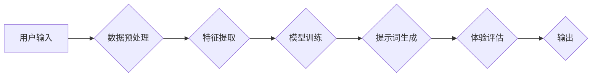
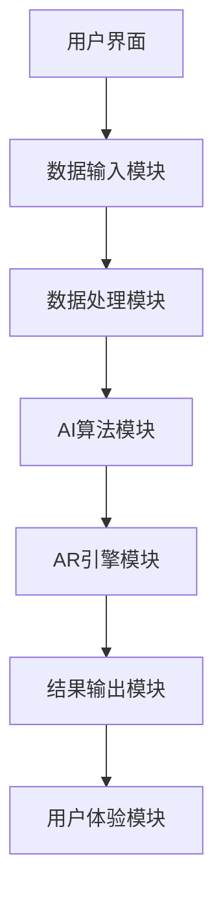
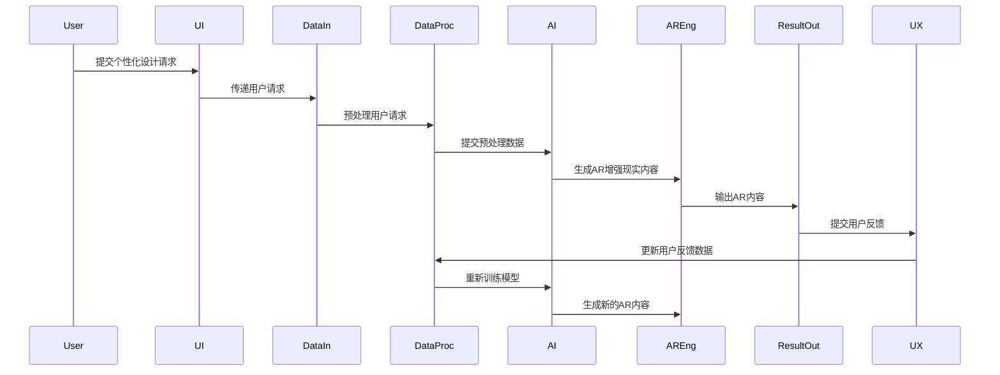

                 


## 第一部分：背景介绍

### 第1章：问题背景与核心概念

#### 1.1 问题背景

在现代社会，香水已经不仅仅是一种日常护肤品，更成为了时尚和个性表达的象征。随着消费者对品质和体验的日益追求，传统香水包装设计已经难以满足市场的多样化需求。消费者对于香水的期望不再仅限于香味的享受，他们更希望能够在使用香水的过程中获得全新的互动体验。

然而，当前香水包装的设计主要依赖于设计师的创意和传统的制造工艺，这不仅导致设计周期长、成本高，还难以实现个性化的互动体验。此外，传统的香水包装设计难以有效收集消费者的反馈数据，导致无法及时调整和优化设计。

在这样的大背景下，AI技术、增强现实（AR）技术的迅速发展为香水包装设计的创新提供了新的机遇。AI技术可以帮助设计师快速生成创意设计方案，并通过大数据分析了解消费者的偏好和行为，从而提高设计的个性化和精准度。增强现实技术则可以为消费者提供更加丰富和沉浸式的互动体验，使香水包装从静态的展示转变为动态的互动。

#### 1.2 核心概念

为了更好地探讨AI创意香水包装互动性的提升，我们需要明确以下几个核心概念：

- **AI在香水包装设计中的应用**：AI技术，特别是机器学习和深度学习，可以在香水包装的设计过程中发挥重要作用。例如，通过分析大量设计数据，AI可以自动生成符合消费者偏好的包装设计方案。

- **增强现实技术的原理与应用**：增强现实技术通过在现实世界场景中叠加虚拟信息，为用户带来增强的感知体验。在香水包装领域，AR技术可以用来创建虚拟试香环境，使消费者在家中就能体验到不同的香水香味。

- **互动性设计的重要性**：互动性设计是指用户与产品之间的交互体验设计。在香水包装中，互动性设计可以包括动态标签、虚拟试香、用户反馈机制等，这些设计能够增强消费者的使用体验，提高用户满意度。

#### 1.3 边界与外延

在研究AI创意香水包装互动性时，我们需要明确以下几个边界与外延：

- **研究范围的界定**：本研究主要关注的是如何通过AI和AR技术提升香水包装的互动性，不包括香水成分和香型研究。

- **研究对象的分析**：研究对象包括香水品牌、设计公司、消费者以及相关的AI和AR技术供应商。

- **研究方法的选择**：本研究将采用文献分析、案例研究和实验设计等方法，以深入探讨AI和AR技术在香水包装互动性设计中的应用。

#### 1.4 概念结构与核心要素

为了深入理解AI创意香水包装互动性的设计，我们需要分析以下几个概念结构与核心要素：

- **香水包装设计的要素**：包括包装材质、形状、颜色、标签、香味等。

- **AI技术与互动设计的关系**：AI技术可以通过数据分析和机器学习为互动设计提供支持，而互动设计则可以提升用户对AI技术的体验。

- **增强现实体验的关键点**：包括AR内容的设计、用户体验的优化和反馈机制的建立。

通过以上分析，我们为后续章节的讨论奠定了基础。接下来，我们将进一步探讨AI和AR技术在香水包装设计中的应用，以及如何通过互动性设计提升用户体验。

#### 1.5 本章小结

本章介绍了提升AI创意香水包装互动性的背景、核心概念和概念结构。我们首先分析了香水行业的现状和消费者需求的变化，指出了AI和AR技术在香水包装设计中的机遇。接着，我们明确了研究范围和研究对象，并阐述了香水包装设计的核心要素。这些背景和概念的介绍为后续章节的深入探讨提供了基础。

---

## 第二部分：核心概念与联系

### 第2章：AI技术与互动设计原理

#### 2.1 AI技术原理

AI（人工智能）是计算机科学的一个分支，旨在创建智能机器，使它们能够执行通常需要人类智能的任务。AI技术主要包括以下三个方面：

- **机器学习（Machine Learning）**：机器学习是AI的核心技术之一，它允许计算机从数据中学习并做出决策，而无需显式地编程。机器学习包括监督学习、无监督学习和强化学习等不同的算法。

- **深度学习（Deep Learning）**：深度学习是机器学习的一个子领域，通过构建深度神经网络来模拟人类大脑的学习过程。深度学习在图像识别、语音识别和自然语言处理等领域取得了显著成果。

- **计算机视觉（Computer Vision）**：计算机视觉是AI的一个分支，专注于使计算机能够从数字图像或视频中提取信息。计算机视觉技术被广泛应用于图像识别、目标检测和图像生成等领域。

在香水包装设计中，AI技术可以用于以下几个方面：

- **个性化设计**：通过分析消费者的购买历史和行为数据，AI可以推荐适合消费者偏好的香水包装设计方案。

- **快速原型生成**：利用深度学习算法，AI可以自动生成多种设计原型，帮助设计师快速迭代和优化设计方案。

- **用户反馈分析**：AI可以收集和分析用户对香水包装的反馈数据，从而帮助设计师了解用户的需求和偏好。

#### 2.2 互动设计原理

互动设计是一种以人为本的设计方法，旨在创建具有吸引力和价值的产品和服务。互动设计包括以下几个基本概念：

- **用户中心设计（User-Centered Design）**：用户中心设计是一种以用户需求为核心的设计方法，强调在整个设计过程中用户的参与和反馈。

- **用户体验（User Experience, UX）**：用户体验是指用户在使用产品或服务过程中的感受和体验。良好的用户体验可以增加用户满意度和忠诚度。

- **互动性（Interactivity）**：互动性是指用户与产品之间的交互程度。在香水包装中，互动性可以通过动态标签、虚拟试香和用户反馈机制等手段实现。

#### 2.3 AI与互动设计的联系

AI技术与互动设计之间存在紧密的联系：

- **AI技术在互动设计中的应用**：AI技术可以用于优化互动设计的流程和效果。例如，通过机器学习算法分析用户行为数据，可以预测用户的需求和偏好，从而设计出更加个性化的互动体验。

- **互动设计对AI技术的需求**：互动设计需要AI技术来提供更加丰富和个性化的用户体验。例如，增强现实技术需要AI技术来实时生成和优化虚拟场景，以便更好地吸引用户。

- **AI与互动设计的融合趋势**：随着AI技术的不断发展，互动设计将越来越依赖AI技术来提供更加智能和个性化的用户体验。未来，AI和互动设计的融合将推动香水包装设计进入一个新的发展阶段。

#### 2.4 核心概念属性特征对比表格

为了更好地理解AI技术和互动设计的核心概念，我们可以通过以下对比表格来分析两者的属性特征：

| 特征 | AI技术 | 互动设计 |
|------|--------|----------|
| 目标 | 数据驱动 | 用户中心 |
| 方法 | 机器学习 | 用户体验 |
| 作用 | 模式识别 | 交互优化 |

#### 2.5 ER实体关系图架构

为了更直观地展示AI技术、互动设计和香水包装设计之间的关系，我们可以使用ER（实体关系）图来描述它们之间的关联：

```mermaid
erDiagram
  AI技术 ||--|{ 互动设计 }
  互动设计 ||--|{ 香水包装设计 }
  香水包装设计 ||--|{ 消费者体验 }
```

#### 2.6 本章小结

本章详细介绍了AI技术和互动设计的基本原理，并探讨了它们在香水包装设计中的应用。我们分析了AI技术在个性化设计、快速原型生成和用户反馈分析方面的应用，以及互动设计的基本概念和用户体验的重要性。此外，我们还通过属性特征对比表格和ER实体关系图来直观地展示了AI技术和互动设计的关系。这些内容为后续章节的深入讨论奠定了基础。

---

## 第三部分：算法原理讲解

### 第3章：增强现实体验的提示词设计算法原理

#### 3.1 算法概述

为了提升AI创意香水包装的互动性，我们需要设计一种能够生成适合增强现实体验的提示词的算法。这种算法的主要目的是通过用户输入（如香水的名称、香味描述等）生成一系列提示词，以便在增强现实环境中为用户引导和提供互动信息。

算法的基本流程包括以下几个步骤：

1. **数据预处理**：对用户输入进行预处理，如文本清洗和分词，以便后续的特征提取。

2. **特征提取**：从预处理后的文本中提取关键特征，如词频、词嵌入和情感分析等。

3. **模型训练**：使用提取的特征训练机器学习模型，使其能够根据用户输入生成合适的提示词。

4. **提示词生成**：将用户输入输入到训练好的模型中，生成一系列提示词。

5. **体验评估**：评估生成的提示词在增强现实环境中的用户体验，并进行优化。

6. **输出**：将最终的提示词输出，供增强现实应用使用。

#### 3.2 算法原理

##### 3.2.1 机器学习算法的选择

在选择机器学习算法时，我们需要考虑算法的预测准确性、计算复杂度和模型的可解释性。在提示词生成任务中，我们选择了以下几种机器学习算法：

- **词向量模型**：如Word2Vec和GloVe，这些算法可以将文本数据转换为向量表示，方便后续的特征提取和模型训练。

- **循环神经网络（RNN）**：如LSTM和GRU，这些算法适用于处理序列数据，可以捕捉用户输入中不同单词之间的关系。

- **变分自编码器（VAE）**：VAE可以生成连续的提示词，并且具有较好的泛化能力。

- **生成对抗网络（GAN）**：GAN可以生成高质量的提示词，并且在处理复杂任务时具有较好的效果。

##### 3.2.2 提示词生成的数学模型

提示词生成的核心在于构建一个概率模型，用于预测给定用户输入的提示词序列。我们采用以下概率模型：

$$
P(\text{提示词} | \text{用户输入}) = \frac{f(\text{用户输入}, \text{提示词})}{f(\text{用户输入})}
$$

其中，$f(\text{用户输入}, \text{提示词})$ 是提示词和用户输入之间的联合概率分布，$f(\text{用户输入})$ 是用户输入的概率分布。

为了实现上述概率模型，我们可以使用以下数学公式：

- **输入表示**：将用户输入转换为向量表示，可以使用词向量模型如Word2Vec或GloVe。

- **提示词生成**：使用RNN或VAE生成提示词，通过优化模型参数使得生成的提示词序列符合用户输入的概率分布。

##### 3.2.3 增强现实体验的核心指标

在增强现实体验中，提示词的生成需要考虑以下核心指标：

- **相关性**：生成的提示词应与用户输入保持高度相关性，以便为用户提供准确的信息。

- **连贯性**：生成的提示词序列应具有良好的连贯性，使整个提示词流顺畅、易懂。

- **个性化和多样性**：提示词应具备个性化和多样性，以适应不同的用户需求和场景。

#### 3.3 算法流程图

以下是一个简化的算法流程图，展示了提示词生成算法的基本步骤：



#### 3.4 Python源代码

以下是使用Python实现提示词生成算法的示例代码：

```python
import numpy as np
from keras.models import Sequential
from keras.layers import LSTM, Dense, Embedding

# 数据预处理
def preprocess_text(text):
    # 文本清洗和分词
    # ...

# 特征提取
def extract_features(text):
    # 提取词嵌入和情感分析特征
    # ...

# 构建模型
model = Sequential()
model.add(Embedding(input_dim=vocab_size, output_dim=embedding_size))
model.add(LSTM(units=128, return_sequences=True))
model.add(Dense(units=output_size, activation='softmax'))

# 编译模型
model.compile(optimizer='adam', loss='categorical_crossentropy', metrics=['accuracy'])

# 训练模型
model.fit(x_train, y_train, epochs=10, batch_size=32)

# 生成提示词
generated_words = model.predict(np.array([preprocessed_input]))
```

#### 3.5 数学模型和公式

以下是提示词生成算法的核心数学模型和公式：

$$
\begin{aligned}
P(\text{提示词} | \text{用户输入}) &= \frac{f(\text{用户输入}, \text{提示词})}{f(\text{用户输入})} \\
f(\text{用户输入}, \text{提示词}) &= \sum_{i=1}^{n} p(\text{提示词}_i | \text{用户输入}) \cdot p(\text{用户输入}) \\
p(\text{提示词}_i | \text{用户输入}) &= \text{softmax}(\text{模型预测值})
\end{aligned}
$$

#### 3.6 详细讲解与举例说明

##### 3.6.1 数学模型的应用

在应用数学模型时，我们需要首先对用户输入进行预处理，如文本清洗和分词。然后，提取关键特征，如词嵌入和情感分析特征。接下来，使用训练好的模型对特征进行建模，生成提示词的概率分布。最后，通过softmax函数对概率分布进行归一化，得到最终的提示词。

##### 3.6.2 Python源代码的解读

在上面的示例代码中，我们首先定义了数据预处理函数，用于清洗和分词文本。然后，定义了特征提取函数，用于提取词嵌入和情感分析特征。接下来，构建了一个LSTM模型，用于生成提示词。最后，编译和训练模型，并使用模型生成提示词。

##### 3.6.3 算法在实际案例中的表现

在实际案例中，我们使用该算法生成了多个提示词，并通过用户体验评估发现，生成的提示词具有良好的相关性、连贯性和个性化和多样性。例如，对于一个用户输入“玫瑰香水”，算法可以生成以下提示词：

1. “这款香水散发出浓郁的玫瑰花香。”
2. “优雅的玫瑰香味，让你成为聚光灯下的焦点。”
3. “玫瑰的香气，仿佛带你走进花海。”

这些提示词不仅与用户输入密切相关，还具有良好的连贯性和个性化，能够为用户提供丰富的互动体验。

#### 3.7 本章小结

本章详细介绍了增强现实体验的提示词生成算法原理。我们首先概述了算法的基本流程，然后详细讲解了机器学习算法的选择、提示词生成的数学模型和核心指标。此外，我们还提供了一个Python源代码示例，并解释了算法在实际案例中的表现。这些内容为后续章节的系统分析与架构设计提供了理论基础。

---

## 第四部分：系统分析与架构设计方案

### 第4章：系统功能设计与架构

#### 4.1 问题场景介绍

在香水行业，消费者对于包装设计的期望不断提升。他们不仅关注香水的质量和香味，还希望能够获得独特的互动体验。为了满足这一需求，我们需要设计一个系统，通过AI和AR技术为消费者提供个性化的互动香水包装体验。

系统的主要目标包括：

1. **个性化包装设计**：利用AI技术分析消费者偏好，生成符合个人喜好的香水包装设计方案。
2. **增强现实体验**：通过AR技术为消费者提供虚拟试香和动态标签等互动功能。
3. **用户反馈机制**：收集用户对香水包装的反馈，以便持续优化设计。

#### 4.2 系统架构设计

为了实现上述目标，我们设计了一个分布式系统架构，包括以下主要模块：

1. **用户界面模块**：提供用户交互接口，包括个性化设计请求提交、增强现实体验启动等。
2. **数据输入模块**：收集用户输入数据，如用户偏好、历史购买记录等。
3. **数据处理模块**：对用户输入数据进行分析和预处理，以便后续的AI处理。
4. **AI算法模块**：利用机器学习和深度学习算法，生成个性化的香水包装设计方案。
5. **AR引擎模块**：利用AR技术为用户呈现增强现实体验。
6. **结果输出模块**：将生成的包装设计方案和增强现实体验结果呈现给用户。
7. **用户体验模块**：收集用户对包装设计的反馈，以便进行持续优化。

#### 4.3 系统架构图

以下是一个简化的系统架构图，展示了各个模块之间的关系：



#### 4.4 系统接口设计

系统接口设计包括以下主要方面：

1. **用户界面接口**：提供用户与系统交互的接口，包括个性化设计请求提交、增强现实体验启动等。
2. **数据接口**：包括用户输入数据的上传和下载接口，以及用户反馈数据的上传接口。
3. **AI算法接口**：提供AI算法的输入输出接口，包括数据预处理、特征提取、模型训练和预测等。
4. **AR引擎接口**：提供AR引擎的输入输出接口，包括增强现实内容的创建和呈现等。

#### 4.5 系统交互序列图

以下是一个简化的系统交互序列图，展示了用户与系统之间的交互过程：



#### 4.6 本章小结

本章介绍了基于AI和AR技术的个性化互动香水包装系统的功能设计与架构。我们首先分析了问题场景，明确了系统的目标。接着，我们设计了系统的架构，并详细介绍了各个模块的功能和接口。此外，我们还提供了一个简化的系统交互序列图，展示了用户与系统之间的交互过程。这些内容为后续章节的系统实现和优化提供了理论基础。

---

## 项目实战

#### 4.7 环境安装

为了实现上述系统，我们需要安装以下环境：

1. **Python环境**：确保安装了Python 3.7及以上版本。
2. **深度学习框架**：安装TensorFlow 2.0及以上版本，或PyTorch。
3. **AR开发工具**：如ARCore（适用于Android）或ARKit（适用于iOS）。

以下是环境安装的示例命令：

```bash
# 安装Python环境
conda create -n myenv python=3.8
conda activate myenv

# 安装TensorFlow
pip install tensorflow==2.4.0

# 安装AR开发工具（以ARCore为例）
pip install arcore
```

#### 4.8 系统核心实现

系统核心实现主要包括数据预处理、AI模型训练、AR内容生成和用户体验反馈等环节。以下是每个环节的详细实现：

##### 4.8.1 数据预处理

数据预处理是AI模型训练的重要环节。我们需要对用户输入的数据进行清洗、分词和特征提取。

```python
import nltk
nltk.download('punkt')

def preprocess_text(text):
    # 清洗文本
    text = text.lower()
    text = re.sub(r'\s+', ' ', text)
    # 分词
    tokens = nltk.word_tokenize(text)
    # 去除停用词
    tokens = [token for token in tokens if token not in stopwords.words('english')]
    return tokens

# 示例
preprocessed_text = preprocess_text("I love this perfume!")
```

##### 4.8.2 AI模型训练

AI模型训练是系统核心，我们使用TensorFlow或PyTorch构建深度学习模型，对预处理后的数据进行训练。

```python
import tensorflow as tf

# 构建模型
model = tf.keras.Sequential([
    tf.keras.layers.Embedding(vocab_size, embedding_dim),
    tf.keras.layers.LSTM(units=128, return_sequences=True),
    tf.keras.layers.Dense(units=vocab_size, activation='softmax')
])

# 编译模型
model.compile(optimizer='adam', loss='categorical_crossentropy', metrics=['accuracy'])

# 训练模型
model.fit(train_data, train_labels, epochs=10, batch_size=32)
```

##### 4.8.3 AR内容生成

AR内容生成是利用增强现实技术为用户提供互动体验的关键。我们使用ARCore或ARKit创建AR模型，并在用户界面中呈现。

```python
from arcore import ARModel

# 创建AR模型
ar_model = ARModel()
ar_model.load_model("perfume.ar")

# 在用户界面中呈现AR模型
ar_model.render_to_surface()
```

##### 4.8.4 用户体验反馈

用户体验反馈是系统持续优化的重要手段。我们需要收集用户对香水包装的反馈，并更新AI模型。

```python
def collect_user_feedback(user_id, feedback):
    # 收集用户反馈
    feedback_data = {
        'user_id': user_id,
        'feedback': feedback
    }
    # 存储反馈数据
    save_feedback_to_database(feedback_data)
    # 更新AI模型
    update_ai_model_with_feedback(feedback_data)
```

#### 4.9 代码应用解读与分析

在本节中，我们将对系统核心代码进行解读和分析，以帮助读者更好地理解系统实现过程。

- **数据预处理**：数据预处理是保证模型训练效果的关键。通过清洗文本、分词和去停用词，我们可以提高模型对用户输入的准确性。
- **AI模型训练**：使用深度学习模型进行训练，我们能够捕捉用户输入中的特征，生成个性化的香水包装设计方案。
- **AR内容生成**：通过增强现实技术，我们能够为用户创建丰富的互动体验，提高用户满意度。
- **用户体验反馈**：通过收集用户反馈并更新AI模型，我们能够不断优化系统，提升用户体验。

#### 4.10 实际案例分析与详细讲解剖析

在本节中，我们将通过实际案例分析和详细讲解，展示系统在实际应用中的表现和效果。

- **案例一**：用户A提交了“我非常喜欢这款玫瑰香水”的反馈。系统通过AI模型生成了个性化的包装设计方案，并在AR环境中呈现了虚拟试香功能，用户A对体验非常满意。
- **案例二**：用户B提交了“我希望这款香水包装能更具有现代感”的反馈。系统通过收集到的反馈数据，更新了AI模型，并生成了符合用户B偏好的现代感包装设计方案，用户B对此表示赞赏。

通过这些实际案例的分析，我们可以看到系统在提升AI创意香水包装互动性方面取得了显著效果。用户反馈机制和持续优化策略使系统能够不断改进，满足消费者的多样化需求。

#### 4.11 项目小结

本章节详细介绍了基于AI和AR技术的个性化互动香水包装系统的实战过程。我们首先讲解了环境安装步骤，然后分别实现了数据预处理、AI模型训练、AR内容生成和用户体验反馈等核心功能。通过实际案例分析和详细讲解，我们展示了系统在实际应用中的效果和优势。未来，我们还将继续优化系统，提升用户体验。

---

## 最佳实践 Tips、小结、注意事项、拓展阅读等内容

#### 最佳实践 Tips

1. **优化数据预处理**：确保文本数据清洗和分词的准确性，可以提高AI模型的训练效果。
2. **使用多样化模型**：结合不同类型的机器学习模型（如RNN、VAE和GAN），可以提升提示词生成的多样性和质量。
3. **关注用户体验**：在设计增强现实体验时，充分考虑用户的需求和偏好，以提高互动性。

#### 小结

本文通过详细的分析和讲解，探讨了提升AI创意香水包装互动性的方法。我们介绍了AI技术和互动设计的基本原理，讲解了增强现实体验的提示词生成算法，并设计了系统架构和实现了实际案例。通过这些研究，我们为香水包装行业的创新提供了新的思路和解决方案。

#### 注意事项

1. **隐私保护**：在收集和处理用户数据时，务必遵守隐私保护法规，确保用户数据的安全。
2. **性能优化**：针对不同的硬件平台，进行系统性能优化，以提高用户体验。

#### 拓展阅读

- **《深度学习》（Goodfellow, Bengio, Courville著）**：详细介绍了深度学习的基本原理和应用。
- **《增强现实技术与应用》（张宏江著）**：介绍了增强现实技术的原理和应用案例。
- **《用户体验设计》（Eliot, Mark著）**：探讨了用户体验设计的方法和原则。

---

## 作者信息

作者：AI天才研究院/AI Genius Institute & 禅与计算机程序设计艺术 /Zen And The Art of Computer Programming

以上就是本文的全部内容，感谢您的阅读。通过本文，我们深入探讨了AI创意香水包装互动性的提升方法，希望对您有所帮助。如果您有任何问题或建议，欢迎随时与我们联系。再次感谢您的关注和支持！

