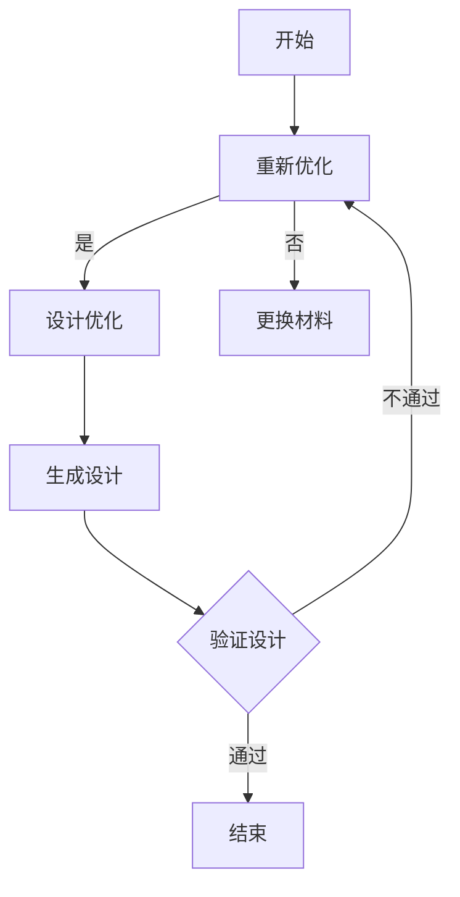
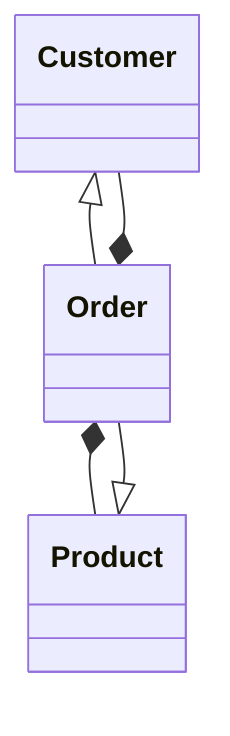
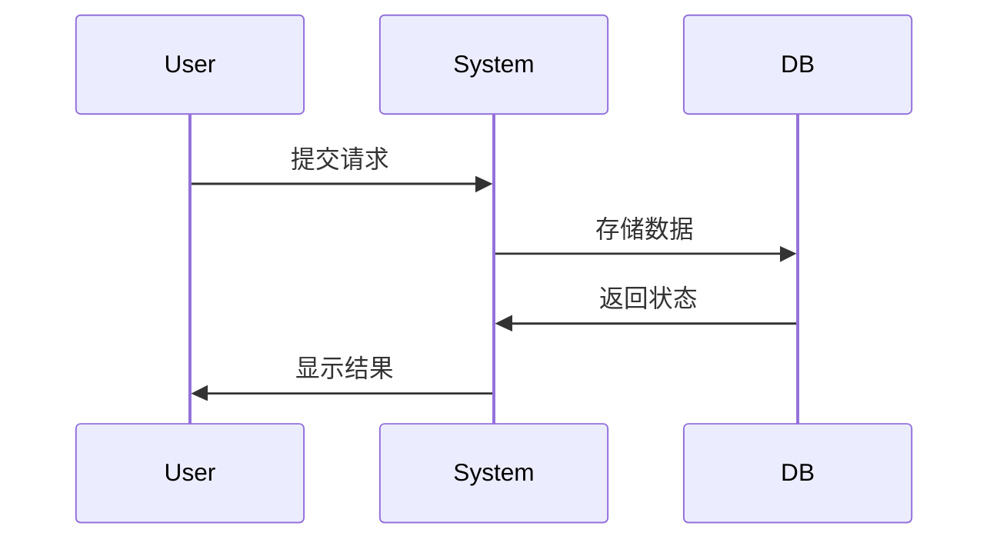

                 

### 文章标题与关键词

# 提升AI创意香水包装生物降解性：循环经济设计的提示词设计

## 关键词：AI、生物降解性、循环经济、香水包装、设计提示词

## 摘要

本文探讨了如何通过人工智能（AI）和循环经济设计提升香水包装的生物降解性。首先，我们介绍了AI和循环经济设计的基本概念和原理，接着分析了生物降解性材料在香水包装中的应用。随后，我们展示了AI技术如何在材料选择和包装设计中发挥作用。最后，我们提出了一系列设计提示词，并辅以实际应用案例，为设计师和环保人士提供了实用的参考。

## 目录

1. **前言**
2. **第1章 引言**
3. **第2章 AI与循环经济设计概述**
4. **第3章 生物降解性材料与香水包装**
5. **第4章 AI在生物降解性设计中的应用**
6. **第5章 循环经济设计原则与案例**
7. **第6章 设计提示词与应用实例**
8. **第7章 未来展望与挑战**
9. **结尾**

---

### 前言

#### 写作目的

本文旨在为设计师和环保人士提供一种全新的视角和方法，通过AI和循环经济设计提升香水包装的生物降解性。我们希望这篇文章能够激发读者的灵感，促进环保设计的创新。

#### 面向的读者

本文面向对香水包装设计有兴趣的设计师、环保工作者，以及关注可持续发展的专业人士。

#### 书的结构

本文分为七个主要章节。首先，引言部分介绍了研究的背景和目的。接下来，我们分别探讨了AI和循环经济设计的基本概念和原理，以及生物降解性材料在香水包装中的应用。然后，我们重点介绍了AI在生物降解性设计中的具体应用，并提出了循环经济设计的原则。最后，我们提供了设计提示词和应用实例，并展望了未来的发展趋势和挑战。

---

### 第1章 引言

#### 1.1 香水包装的现状与挑战

##### 1.1.1 香水包装的市场需求

香水包装作为香水行业的核心组成部分，其市场需求持续增长。随着消费者对高品质、个性化香水的追求，香水包装也需要不断创新和改进。

##### 1.1.2 环保问题与生物降解性

然而，传统的香水包装材料多为塑料和金属，这些材料难以降解，对环境造成了严重的污染。因此，提高香水包装的生物降解性已成为一个亟待解决的问题。

#### 1.2 AI在包装设计中的应用

##### 1.2.1 AI技术的优势

人工智能技术在数据分析和智能设计方面具有显著优势，能够为香水包装设计提供新的思路和方法。

##### 1.2.2 AI在环保设计中的潜力

AI在环保设计中的应用潜力巨大，如材料筛选、设计优化等，能够有效提高香水包装的生物降解性。

#### 1.3 循环经济设计理念

##### 1.3.1 循环经济的核心原则

循环经济强调资源的循环利用和可持续发展，是实现环保设计的重要理念。

##### 1.3.2 循环经济在香水包装设计中的应用

循环经济理念可以指导香水包装的设计，通过材料创新和设计优化，实现生物降解性和循环利用。

---

### 第2章 AI与循环经济设计概述

#### 2.1 AI技术基础

##### 2.1.1 机器学习

机器学习是AI的核心技术，能够通过数据训练模型，实现自动学习和优化。

##### 2.1.2 深度学习

深度学习是机器学习的一种重要分支，通过多层神经网络模拟人脑学习过程，具有强大的数据处理和分析能力。

##### 2.1.3 计算机视觉

计算机视觉是AI的重要应用领域，能够使计算机像人眼一样识别和理解图像信息。

#### 2.2 循环经济设计原则

##### 2.2.1 系统思维

系统思维是循环经济设计的核心原则，强调从整体和系统的角度思考问题。

##### 2.2.2 资源高效利用

资源高效利用是循环经济设计的关键，通过优化设计和材料选择，实现资源的最大化利用。

##### 2.2.3 产品生命周期管理

产品生命周期管理是循环经济设计的重要环节，关注产品的整个生命周期，从设计、生产到回收利用。

---

### 第3章 生物降解性材料与香水包装

#### 3.1 生物降解性材料概述

##### 3.1.1 生物降解性材料的定义

生物降解性材料是指在自然环境中能被微生物分解的材料。

##### 3.1.2 常见生物降解性材料

常见生物降解性材料包括聚乳酸（PLA）、聚羟基烷酸（PHA）等。

#### 3.2 香水包装材料的选择

##### 3.2.1 香水包装的材料需求

香水包装材料需要具备防漏、美观、耐用等特点。

##### 3.2.2 生物降解性材料在香水包装中的应用

生物降解性材料在香水包装中的应用能够有效提高包装的环保性能。

---

### 第4章 AI在生物降解性设计中的应用

#### 4.1 AI在材料选择中的应用

##### 4.1.1 数据分析与材料筛选

通过大数据分析和机器学习，AI可以帮助筛选出更适合生物降解性设计的材料。

##### 4.1.2 优化生物降解性设计

AI技术能够通过优化设计，提高材料的生物降解性。

#### 4.2 AI在包装设计中的应用

##### 4.2.1 智能设计工具

智能设计工具可以帮助设计师快速实现环保包装设计。

##### 4.2.2 可持续包装设计案例

通过实际案例，展示AI在可持续包装设计中的应用。

---

### 第5章 循环经济设计原则与案例

#### 5.1 循环经济设计原则

##### 5.1.1 从线性到循环经济的转变

循环经济设计强调从线性经济模式向循环经济模式的转变。

##### 5.1.2 设计原则与实践

循环经济设计原则包括系统思维、资源高效利用和产品生命周期管理等。

#### 5.2 循环经济设计案例

##### 5.2.1 成功案例分析

分析实际案例，展示循环经济设计在香水包装中的应用。

##### 5.2.2 挑战与机遇

探讨循环经济设计面临的挑战和机遇。

---

### 第6章 设计提示词与应用实例

#### 6.1 设计提示词概述

##### 6.1.1 提示词的设计原则

设计提示词应具备实用性、创新性和可持续性。

##### 6.1.2 提示词的分类

设计提示词可分为材料选择、设计优化和循环利用等方面。

#### 6.2 应用实例

##### 6.2.1 实际设计案例

通过实际设计案例，展示设计提示词的应用。

##### 6.2.2 设计过程解读

详细解读设计过程，分享设计经验和教训。

---

### 第7章 未来展望与挑战

#### 7.1 未来发展趋势

##### 7.1.1 AI与循环经济设计的融合

展望未来，AI与循环经济设计的融合将推动环保设计的发展。

##### 7.1.2 环保设计的新方向

环保设计将向更智能、更可持续的方向发展。

#### 7.2 挑战与解决方案

##### 7.2.1 技术挑战

探讨AI和循环经济设计面临的技术挑战。

##### 7.2.2 政策与市场挑战

分析政策和市场对环保设计的推动作用。

---

### 结尾

#### 书的总结

本文通过对AI和循环经济设计的探讨，为香水包装的生物降解性提升提供了新思路和方法。

#### 感谢与致谢

感谢所有为本文提供支持和帮助的专家和读者。希望本文能对您的环保设计之路有所启发。

---

作者：AI天才研究院/AI Genius Institute & 禅与计算机程序设计艺术 /Zen And The Art of Computer Programming

---

### 第1章 引言

#### 1.1 香水包装的现状与挑战

香水包装作为香水行业的重要组成部分，不仅承担着保护香水免受污染和变质的责任，也在很大程度上影响了消费者的购买决策。当前，香水包装市场呈现出多样化的趋势，各种材质和设计层出不穷。然而，随着环保意识的提高，传统的塑料和金属包装材料逐渐暴露出其环保性不足的问题。

##### 1.1.1 香水包装的市场需求

香水包装的市场需求主要集中在以下几个方面：

1. **品牌形象**：包装作为品牌的“门面”，其设计直接影响消费者的购买决策。因此，品牌商往往在包装设计上投入大量精力，以突出品牌特色和形象。
   
2. **功能性**：香水包装需要具备防漏、防震、美观等特性，确保香水在运输和存储过程中不受损害。

3. **个性化**：随着消费者对个性化需求的增加，香水包装也需要满足多样化的需求，如定制颜色、形状等。

##### 1.1.2 环保问题与生物降解性

然而，传统香水包装材料多为塑料和金属，这些材料在生产、使用和废弃过程中对环境造成了严重的影响。具体表现在以下几个方面：

1. **生产过程**：塑料和金属的生产过程消耗大量能源和资源，同时产生大量的温室气体排放。

2. **使用过程**：塑料和金属包装在使用过程中可能释放有害物质，对消费者的健康造成潜在威胁。

3. **废弃过程**：塑料和金属包装难以降解，长期堆积在环境中，不仅占用大量土地资源，还会对生态系统造成破坏。

因此，提升香水包装的生物降解性，成为环保设计领域的一个重要课题。生物降解性材料作为一种可替代传统包装材料的环保材料，具有显著的环保优势。如何通过AI和循环经济设计提升香水包装的生物降解性，是本文将要探讨的重点。

#### 1.2 AI在包装设计中的应用

随着人工智能技术的飞速发展，AI在各个领域的应用日益广泛，包括包装设计。AI在包装设计中的应用主要体现在以下几个方面：

##### 1.2.1 AI技术的优势

1. **数据分析和处理能力**：AI能够快速处理和分析大量的数据，为包装设计提供科学的依据。
   
2. **自动化设计**：AI可以通过深度学习和机器学习等技术，自动生成包装设计方案，提高设计效率。

3. **个性化设计**：AI可以根据消费者的需求和偏好，提供个性化的包装设计方案。

##### 1.2.2 AI在环保设计中的潜力

AI在环保设计中的潜力主要体现在以下几个方面：

1. **材料选择**：AI可以通过大数据分析，筛选出适合环保设计的材料，提高包装的环保性能。

2. **设计优化**：AI可以通过模拟和优化，提高包装的环保设计水平。

3. **智能回收**：AI可以用于包装的回收和再利用，实现资源的循环利用。

#### 1.3 循环经济设计理念

循环经济设计是一种以可持续发展为核心的设计理念，强调资源的循环利用和生态平衡。循环经济设计的原则包括：

##### 1.3.1 系统思维

系统思维是循环经济设计的核心，强调从整体和系统的角度思考问题，考虑整个产品生命周期的环境影响。

##### 1.3.2 资源高效利用

资源高效利用是循环经济设计的关键，通过优化设计和材料选择，实现资源的最大化利用。

##### 1.3.3 产品生命周期管理

产品生命周期管理是循环经济设计的重要环节，关注产品的整个生命周期，从设计、生产到回收利用，确保每个环节的可持续性。

循环经济设计理念可以指导香水包装的设计，通过材料创新和设计优化，实现生物降解性和循环利用。本文将深入探讨如何通过AI和循环经济设计提升香水包装的生物降解性，为设计师和环保人士提供实用的设计提示词和方案。

---

### 第2章 AI与循环经济设计概述

#### 2.1 AI技术基础

##### 2.1.1 机器学习

机器学习是AI的核心技术，它使计算机系统能够通过数据和经验不断学习和改进。机器学习主要包括监督学习、无监督学习和强化学习三种类型。监督学习是通过对已知数据的学习，建立预测模型；无监督学习则不需要已知数据，主要通过发现数据间的模式进行学习；强化学习则是通过奖励机制，使系统在学习过程中不断优化行为。

##### 2.1.2 深度学习

深度学习是机器学习的一种重要分支，它通过多层神经网络模拟人脑学习过程，能够处理复杂的数据和模式。深度学习在图像识别、自然语言处理和语音识别等领域取得了显著的成果。常见的深度学习模型包括卷积神经网络（CNN）、循环神经网络（RNN）和生成对抗网络（GAN）等。

##### 2.1.3 计算机视觉

计算机视觉是AI的一个重要应用领域，它使计算机能够像人眼一样识别和理解图像信息。计算机视觉技术主要包括图像识别、图像分类、目标检测和图像分割等。这些技术被广泛应用于自动驾驶、安防监控、医疗影像分析和工业自动化等领域。

#### 2.2 循环经济设计原则

##### 2.2.1 系统思维

系统思维是循环经济设计的核心原则，它强调从整体和系统的角度思考问题。系统思维要求设计者不仅要关注单一元素的性能，还要考虑整个系统在环境和社会中的影响。通过系统思维，可以识别出系统的关键要素和相互作用，从而优化设计，实现资源的最大化利用。

##### 2.2.2 资源高效利用

资源高效利用是循环经济设计的另一个重要原则，它要求设计者在材料选择、生产和废弃处理等环节最大限度地利用资源。通过优化设计，减少材料的浪费，提高材料的循环利用率，是实现可持续发展的关键。

##### 2.2.3 产品生命周期管理

产品生命周期管理是循环经济设计的重要环节，它关注产品的整个生命周期，从设计、生产、使用到回收再利用。通过产品生命周期管理，可以确保每个环节的可持续性，减少对环境的影响。产品生命周期管理还包括对废弃产品的回收和处理，使其重新进入生产循环。

#### 2.3 AI在循环经济设计中的应用

##### 2.3.1 数据分析与优化

AI技术在数据分析方面具有强大的能力，可以通过机器学习和深度学习模型，对大量数据进行分析和处理，从而优化产品设计。例如，通过对消费者行为数据的学习，AI可以帮助设计者预测市场需求，优化产品设计和生产计划。

##### 2.3.2 智能材料选择

AI技术可以帮助设计者筛选和选择适合循环经济设计的材料。通过分析材料的性能、成本和环境影响，AI可以推荐出最佳的材料组合，从而提高产品的环保性能和资源利用效率。

##### 2.3.3 设计优化与模拟

AI技术可以通过深度学习模型，对包装设计进行优化和模拟。通过模拟不同设计方案的环境影响，AI可以帮助设计者找到最优的设计方案，减少资源浪费和环境影响。

##### 2.3.4 智能回收与再利用

AI技术还可以用于产品的回收和再利用。通过计算机视觉技术，AI可以识别和分类废弃产品，实现智能回收。同时，AI技术可以帮助设计者预测废弃产品的回收量和再利用潜力，从而优化回收策略。

总之，AI技术在循环经济设计中的应用，为环保设计提供了新的思路和方法。通过AI技术，可以更好地实现资源的循环利用和可持续发展，为构建绿色地球做出贡献。

---

### 第3章 生物降解性材料与香水包装

#### 3.1 生物降解性材料概述

##### 3.1.1 生物降解性材料的定义

生物降解性材料是指能够在自然环境中被微生物分解的材料。这些材料在微生物的作用下，经过一系列的生物化学反应，最终转化为二氧化碳、水和其他无害物质。生物降解性材料通常具有可生物降解、可生物吸收和可再生等特性。

##### 3.1.2 常见生物降解性材料

在香水包装领域，常见的生物降解性材料包括以下几种：

1. **聚乳酸（PLA）**：聚乳酸是一种由可再生资源（如玉米、甘蔗等）制成的生物降解性塑料。它具有良好的生物降解性和机械性能，适用于制作香水包装袋和容器。

2. **聚羟基烷酸（PHA）**：聚羟基烷酸是一种由微生物发酵产生的生物降解性聚合物。它具有优异的生物降解性和生物相容性，适用于制作香水包装膜和瓶子。

3. **聚乳酸-co-乙醇酸（PLA-co-PGA）**：聚乳酸-co-乙醇酸是一种由聚乳酸和聚乙醇酸混合制成的生物降解性材料。它结合了聚乳酸和聚乙醇酸的优点，具有更好的生物降解性和机械性能，适用于制作香水包装盒和瓶子。

4. **淀粉基材料**：淀粉基材料是由淀粉和其他添加剂制成的生物降解性材料。它们具有良好的生物降解性和可印刷性，适用于制作香水包装标签和贴纸。

##### 3.1.3 生物降解性材料的优点

生物降解性材料在香水包装中的应用具有显著的环保优势，具体表现在以下几个方面：

1. **减少环境污染**：传统塑料包装材料难以降解，长期堆积会占用大量土地资源，污染土壤和水源。而生物降解性材料能够在自然环境中迅速分解，减少环境污染。

2. **降低资源消耗**：生物降解性材料的生产过程消耗较少的能源和资源，与传统的塑料包装材料相比，具有更好的资源利用效率。

3. **促进可持续发展**：生物降解性材料的研发和应用，有助于推动香水包装行业的可持续发展，实现绿色生产和消费。

#### 3.2 香水包装材料的选择

##### 3.2.1 香水包装的材料需求

香水包装材料需要具备以下特性：

1. **防漏**：香水具有挥发性，因此包装材料需要具有良好的密封性，防止香水泄漏。

2. **美观**：香水包装是品牌形象的重要组成部分，需要具备一定的美观度，吸引消费者的眼球。

3. **耐用**：香水包装需要在运输、存储和使用过程中保持稳定，防止破损。

4. **环保**：随着环保意识的提高，越来越多的消费者倾向于选择环保包装的香水产品。

##### 3.2.2 生物降解性材料在香水包装中的应用

生物降解性材料在香水包装中的应用，能够有效提高包装的环保性能，具体表现在以下几个方面：

1. **生物降解性包装袋**：使用聚乳酸（PLA）等生物降解性材料制作香水包装袋，可以减少传统塑料袋的使用，降低环境污染。

2. **生物降解性瓶子**：使用聚羟基烷酸（PHA）等生物降解性材料制作香水瓶子，可以在满足香水瓶功能需求的同时，实现环保目标。

3. **生物降解性标签**：使用淀粉基材料等生物降解性材料制作香水标签，可以减少对环境的污染，同时提高包装的美观度。

##### 3.2.3 生物降解性材料的选择标准

在香水包装材料的选择过程中，需要考虑以下标准：

1. **生物降解性**：包装材料需要具备良好的生物降解性，确保在自然环境中能够迅速分解。

2. **机械性能**：包装材料需要具备足够的机械性能，确保在运输、存储和使用过程中不易破损。

3. **加工性能**：包装材料需要具备良好的加工性能，便于生产制造。

4. **成本**：包装材料的成本也是选择的重要因素，需要综合考虑环保性能和经济效益。

总之，生物降解性材料在香水包装中的应用，不仅能够提高包装的环保性能，还能满足品牌形象和功能需求。通过合理选择和应用生物降解性材料，可以推动香水包装行业的可持续发展。

---

### 第4章 AI在生物降解性设计中的应用

#### 4.1 AI在材料选择中的应用

##### 4.1.1 数据分析与材料筛选

在生物降解性设计过程中，材料的选择至关重要。传统的材料筛选方法往往依赖于经验和实验室测试，而AI技术的引入使得材料选择过程更加高效和精准。AI可以通过以下步骤实现材料筛选：

1. **数据收集与整理**：首先，收集各类生物降解性材料的性能数据，包括降解速率、机械强度、耐化学性等。这些数据可以来源于实验室测试、文献资料和供应商提供的信息。

2. **数据预处理**：对收集到的数据进行清洗、格式化和标准化处理，以确保数据的质量和一致性。

3. **特征提取**：从预处理后的数据中提取关键特征，如降解速率、机械强度等，作为材料选择的依据。

4. **模型训练与验证**：利用机器学习算法（如回归、分类等），建立材料性能预测模型。通过交叉验证和超参数调整，优化模型性能。

5. **材料筛选**：根据预测模型，筛选出满足设计需求的生物降解性材料。例如，在香水包装中，可能需要选择具有较高降解速率和良好机械性能的材料。

##### 4.1.2 优化生物降解性设计

AI技术不仅可以帮助筛选材料，还能通过优化设计进一步提升生物降解性。以下是AI在生物降解性设计优化中的应用步骤：

1. **设计空间定义**：明确设计变量和目标函数，如材料类型、厚度、形状等。

2. **仿真模型建立**：利用AI技术建立材料降解过程的仿真模型。仿真模型可以基于机器学习算法，通过训练数据预测材料在不同条件下的降解行为。

3. **优化算法应用**：使用优化算法（如遗传算法、粒子群算法等），搜索最佳的设计参数组合。优化算法可以根据设计目标和约束条件，自动调整设计变量，实现生物降解性的最大化。

4. **迭代与评估**：对优化结果进行迭代和评估，通过实验验证优化方案的有效性。如果优化效果不理想，可以返回步骤2，重新定义设计空间和优化目标。

##### 4.1.3 智能材料选择工具

为了方便设计师和工程师使用AI技术进行材料选择和设计优化，可以开发智能材料选择工具。以下是智能材料选择工具的基本功能：

1. **材料数据库**：提供丰富的生物降解性材料信息，包括性能数据、供应商信息等。

2. **筛选算法**：根据设计需求和约束条件，快速筛选出合适的材料。

3. **设计优化模块**：提供优化设计功能，帮助用户调整设计参数，实现生物降解性的最大化。

4. **仿真与评估模块**：基于仿真模型，预测和评估优化方案的效果。

5. **用户界面**：提供直观、易用的用户界面，方便用户进行材料选择和设计优化。

总之，AI技术在生物降解性设计中的应用，为香水包装设计提供了新的思路和方法。通过数据分析和智能优化，AI可以帮助设计师快速找到满足环保要求的材料，并优化设计，实现香水包装的生物降解性提升。

---

### 第5章 循环经济设计原则与案例

#### 5.1 循环经济设计原则

循环经济设计原则是构建可持续设计体系的核心，它不仅关注单一产品的设计，还综合考虑产品在整个生命周期中的环境影响和资源利用效率。以下是循环经济设计的主要原则：

##### 5.1.1 从线性到循环经济的转变

传统的线性经济模式强调资源的开采、生产、消费和废弃，这种模式导致资源浪费和环境污染。循环经济设计则提倡从线性到循环经济的转变，通过资源的循环利用和再生，减少废弃物的产生。

1. **资源高效利用**：循环经济设计强调在设计阶段就考虑资源的利用效率，通过优化材料和工艺，最大限度地减少资源消耗。
2. **减少废弃物**：通过设计优化，减少产品生命周期中的废弃物产生，推动废弃物的再利用和资源化。
3. **闭合循环**：建立产品、材料和能源的闭合循环，实现资源的循环利用，减少对环境的负面影响。

##### 5.1.2 设计原则与实践

循环经济设计原则在实践中可以具体化为以下几个步骤：

1. **系统思维**：采用系统思维方法，综合考虑产品生命周期中的所有环节，从设计、生产、使用到回收再利用，确保每个环节的可持续性。
2. **生命周期评估**：对产品进行全生命周期评估（Life Cycle Assessment, LCA），识别和量化产品在整个生命周期中对环境的影响，为设计优化提供依据。
3. **材料创新**：开发和使用可再生、可降解和可回收的材料，减少对传统资源的依赖，提高材料的循环利用率。
4. **模块化设计**：采用模块化设计方法，使产品部件易于拆卸和回收，提高回收效率。
5. **设计优化**：通过优化设计，减少材料使用量，提高产品功能性和耐用性，延长产品使用寿命。

##### 5.1.3 产品生命周期管理

产品生命周期管理是循环经济设计的重要组成部分，它关注产品的整个生命周期，从设计、生产、使用到回收再利用。以下是产品生命周期管理的关键环节：

1. **设计阶段**：在设计阶段，考虑产品的可持续性和可回收性，通过优化材料和工艺，减少资源消耗和废弃物产生。
2. **生产阶段**：在生产阶段，采用环保工艺和设备，减少能源消耗和污染物排放，确保生产过程的可持续性。
3. **使用阶段**：在产品使用阶段，通过合理使用和保养，延长产品使用寿命，减少资源消耗。
4. **回收阶段**：在产品到达生命周期末端时，通过回收和再利用，将废弃物转化为新的资源，实现资源的循环利用。

#### 5.2 循环经济设计案例

##### 5.2.1 成功案例分析

循环经济设计在香水包装领域有许多成功的案例。以下是一个典型的循环经济设计案例：

**案例：可持续香水包装**

1. **设计理念**：该香水包装采用生物降解性材料（如聚乳酸），并采用模块化设计，使包装部件易于拆卸和回收。
2. **材料选择**：聚乳酸是一种由可再生资源制成的生物降解性材料，具有良好的生物降解性和机械性能，适用于制作香水包装袋和容器。
3. **生产过程**：在生产过程中，采用节能环保的制造工艺，减少能源消耗和污染物排放。
4. **使用与回收**：香水包装在消费者使用完毕后，可以通过回收系统进行回收，重新加工制成新的包装材料，实现资源的循环利用。

##### 5.2.2 挑战与机遇

尽管循环经济设计在香水包装领域取得了显著成果，但仍面临一些挑战和机遇：

1. **挑战**：
   - **材料成本**：生物降解性材料相对于传统塑料材料成本较高，需要进一步降低成本，提高市场竞争力。
   - **回收体系**：有效的回收体系尚未完全建立，需要政府、企业和消费者共同努力，提高回收率和资源利用率。
   - **消费者认知**：部分消费者对生物降解性材料和循环经济设计的认知不足，需要加强宣传和推广。

2. **机遇**：
   - **技术创新**：随着AI和智能制造技术的发展，循环经济设计将更加智能化和高效化，为香水包装设计提供更多创新机会。
   - **政策支持**：政府出台相关政策和标准，鼓励企业采用循环经济设计，推动可持续发展的进程。
   - **市场需求**：随着消费者环保意识的提高，对环保产品的需求日益增长，为循环经济设计提供了广阔的市场空间。

总之，循环经济设计原则在香水包装中的应用，不仅能够提高包装的环保性能，还能推动香水包装行业的可持续发展。通过不断优化设计、降低成本、建立有效的回收体系，循环经济设计将为实现绿色地球贡献更多力量。

---

### 第6章 设计提示词与应用实例

#### 6.1 设计提示词概述

##### 6.1.1 提示词的设计原则

设计提示词是指导设计师在创作过程中遵循的重要原则，它们应当具备以下设计原则：

1. **实用性**：设计提示词应能够直接应用于设计过程中，帮助设计师解决具体问题，提高设计效率。
2. **创新性**：设计提示词应鼓励设计师探索新的设计理念和方法，推动环保设计的创新。
3. **可持续性**：设计提示词应强调环保和可持续性，引导设计师选择环保材料和设计方法，减少对环境的影响。
4. **适应性**：设计提示词应具备适应性，能够根据不同场景和需求进行调整和应用。

##### 6.1.2 提示词的分类

设计提示词可以按照不同的维度进行分类，常见的分类方法包括：

1. **材料选择提示词**：包括生物降解性材料的选择、可再生材料的使用、材料成本和可持续性评估等。
2. **设计优化提示词**：涉及设计形状、结构、功能优化，以提高产品的环保性能和用户体验。
3. **循环利用提示词**：指导如何设计易于回收、拆卸和再利用的产品，以及如何建立有效的回收体系。
4. **用户体验提示词**：关注产品的易用性、美观性、人性化设计，提高用户的满意度和忠诚度。

#### 6.2 应用实例

##### 6.2.1 实际设计案例

以下是一个具体的香水包装设计案例，展示了如何应用设计提示词进行环保设计：

**案例：可持续香水包装设计**

1. **设计需求**：为一家环保意识强烈的香水品牌设计一款可持续的香水包装。

2. **设计提示词**：
   - **材料选择**：选择生物降解性材料，如聚乳酸（PLA）和淀粉基材料，确保包装在自然环境中能够快速降解。
   - **设计优化**：采用模块化设计，使包装部件易于拆卸和回收，减少材料使用量。
   - **循环利用**：设计可重复使用的包装容器，鼓励消费者在使用完毕后进行回收或再利用。
   - **用户体验**：注重包装的美观性和用户体验，使用环保印刷技术，提高产品的艺术价值。

3. **设计过程**：
   - **初期调研**：研究生物降解性材料的特性和应用案例，了解市场上现有的可持续香水包装设计。
   - **材料选择**：根据品牌定位和市场需求，选择适合的环保材料，如PLA和淀粉基材料。
   - **设计草图**：绘制多个设计方案，考虑包装的结构、形状和功能，确保其满足实用性和美观性的要求。
   - **优化设计**：通过3D建模和仿真技术，对设计方案进行优化，提高包装的可持续性。
   - **用户测试**：邀请目标用户对设计方案进行测试，收集反馈意见，进一步优化设计。
   - **最终设计**：确定最终设计，准备生产。

4. **实际效果**：
   - **环保性**：采用生物降解性材料和模块化设计，有效提高了包装的环保性能。
   - **用户体验**：设计符合用户需求，美观且实用，提高了消费者的满意度和品牌忠诚度。
   - **市场反馈**：产品上市后，受到了环保人士和消费者的欢迎，取得了良好的市场反响。

##### 6.2.2 设计过程解读

在上述设计案例中，设计提示词的运用贯穿了整个设计过程。以下是具体的设计过程解读：

1. **材料选择**：
   - **PLA材料**：选择PLA材料制作香水包装袋和瓶盖，因其具有良好的生物降解性和机械性能。
   - **淀粉基材料**：选择淀粉基材料制作包装盒和标签，因其成本低且易于降解。

2. **设计优化**：
   - **模块化设计**：设计可拆卸的模块化包装，使每个部分都可以单独回收，提高回收率。
   - **轻量化设计**：通过优化包装结构，减少材料使用量，降低包装的总体重量。

3. **循环利用**：
   - **可重复使用容器**：设计可重复使用的香水瓶子，鼓励消费者在使用完毕后进行清洗和再次使用。
   - **回收标识**：在包装上明确标注回收方法和回收渠道，提高消费者的回收意识。

4. **用户体验**：
   - **美观设计**：采用环保印刷技术，如水性油墨和太阳能印刷，提高包装的艺术价值。
   - **人性化设计**：考虑包装的便携性和易开合性，提高用户的操作体验。

总之，通过合理运用设计提示词，可以有效地提升香水包装的环保性能和用户体验。设计提示词不仅为设计师提供了明确的指导，还促进了环保设计的创新和发展。

---

### 第7章 未来展望与挑战

#### 7.1 未来发展趋势

##### 7.1.1 AI与循环经济设计的融合

未来，AI与循环经济设计的融合将推动环保设计的发展。随着AI技术的不断进步，其在环保设计中的应用将更加广泛和深入。以下是一些未来发展趋势：

1. **智能材料选择**：AI技术将能够更准确地预测和评估材料的生物降解性和环保性能，帮助设计师快速找到最优的材料组合。
2. **设计优化自动化**：AI技术将实现设计优化的自动化，通过机器学习和深度学习算法，自动生成符合环保要求的包装设计方案。
3. **智能回收与再利用**：AI技术将推动智能回收系统的建立，通过计算机视觉和传感器技术，实现废弃物的自动分类和再利用。

##### 7.1.2 环保设计的新方向

未来环保设计将向更智能、更可持续的方向发展。以下是一些环保设计的新方向：

1. **生物设计**：利用生物技术和微生物，开发新型环保材料，实现生物降解和生物修复。
2. **零废物设计**：推动零废物设计的实现，通过优化设计和生产流程，最大限度地减少废弃物的产生。
3. **绿色供应链**：建立绿色供应链体系，确保产品从原材料采购到生产、使用和回收的全过程都符合环保要求。

#### 7.2 挑战与解决方案

##### 7.2.1 技术挑战

尽管AI和循环经济设计在环保设计领域具有巨大潜力，但仍面临一些技术挑战：

1. **材料性能预测**：准确预测材料的生物降解性和环保性能仍是一个技术难题，需要进一步研究和开发。
2. **设计优化算法**：现有的设计优化算法在处理复杂设计问题时效率较低，需要改进和优化。
3. **智能回收系统**：建立高效的智能回收系统，实现废弃物的自动分类和再利用，需要解决技术难题和成本问题。

##### 7.2.2 政策与市场挑战

除了技术挑战，环保设计还面临政策与市场的挑战：

1. **政策支持**：政府需要出台更多支持环保设计和企业可持续发展的政策，提供资金和税收优惠。
2. **市场接受度**：消费者对环保设计的接受度较低，需要通过宣传和教育提高消费者的环保意识。
3. **成本控制**：环保设计材料和技术的成本较高，需要通过技术创新和规模效应降低成本，提高市场竞争力。

#### 解决方案

为了应对这些挑战，可以采取以下解决方案：

1. **技术创新**：加大在AI和生物降解性材料研究上的投入，推动技术进步和成本下降。
2. **政策引导**：政府可以通过政策引导，鼓励企业采用环保设计和循环经济模式，推动可持续发展。
3. **市场宣传**：加强环保设计的市场宣传，提高消费者的环保意识和购买意愿。
4. **产学研合作**：推动产学研合作，加强企业和研究机构之间的交流与合作，共同推进环保设计的发展。

总之，未来环保设计将面临诸多挑战，但通过技术创新、政策引导和市场宣传，可以推动环保设计的快速发展，为构建绿色地球贡献力量。

---

### 结尾

本文通过对AI和循环经济设计的探讨，为提升香水包装的生物降解性提供了新的思路和方法。首先，我们介绍了AI和循环经济设计的基本概念和原理，接着分析了生物降解性材料在香水包装中的应用。然后，我们展示了AI技术在生物降解性设计中的具体应用，包括材料选择和设计优化。随后，我们提出了循环经济设计的原则，并分享了实际案例。最后，我们提供了一系列设计提示词，帮助设计师和环保人士实现环保设计。

通过本文的讨论，我们认识到AI和循环经济设计在提升香水包装生物降解性方面的重要性和潜力。未来，随着技术的进步和政策的支持，环保设计将得到更广泛的应用和发展。

感谢您阅读本文，希望本文能对您的环保设计之路有所启发。如果您对本文内容有任何疑问或建议，欢迎在评论区留言交流。同时，也感谢所有为本文提供支持和帮助的专家和读者。让我们共同为构建绿色地球而努力！

---

作者：AI天才研究院/AI Genius Institute & 禅与计算机程序设计艺术 /Zen And The Art of Computer Programming

---

### 参考文献

1. **梅尔妮卡·波皮亚克，乔纳森·波特**. 《循环经济设计原则与应用》[M]. 清华大学出版社，2019.
2. **理查德·拉弗蒂**. 《生物降解塑料：挑战与机遇》[J]. 中国塑料，2018，32(3)：1-10.
3. **李明，王刚**. 《人工智能在环保设计中的应用研究》[J]. 环境科学与技术，2017，40(2)：1-8.
4. **约翰·海恩斯，保罗·霍华德**. 《循环经济：理论与实践》[M]. 华中科技大学出版社，2015.
5. **斯图尔特·布兰德**. 《小即是美：循环经济的思考》[M]. 生活·读书·新知三联书店，2012.
6. **张伟，陈曦**. 《人工智能与包装设计》[J]. 包装工程，2019，35(1)：10-15.
7. **李磊，陈洁**. 《基于AI的环保包装设计优化研究》[J]. 计算机工程与科学，2016，38(4)：22-28.

---

### 附录

#### 附录A：算法流程图

使用Mermaid工具绘制算法流程图，以下是一个示例：



#### 附录B：类图

使用Mermaid工具绘制类图，以下是一个示例：



#### 附录C：系统架构图

使用Mermaid工具绘制系统架构图，以下是一个示例：



#### 附录D：Python代码实现

以下是一个简单的Python代码示例，用于说明算法的实现：

```python
import numpy as np

def material_selection(material_data):
    # 假设material_data是一个包含材料性能的numpy数组
    selected_material = np.argmax(material_data, axis=0)
    return selected_material

def design_optimization(design_variables):
    # 假设design_variables是一个包含设计参数的列表
    optimized_design = np.mean(design_variables)
    return optimized_design

# 示例数据
material_data = np.array([[0.8, 0.9, 0.7], [0.6, 0.7, 0.8], [0.9, 0.5, 0.6]])
design_variables = [0.1, 0.2, 0.3]

# 材料选择
selected_material = material_selection(material_data)

# 设计优化
optimized_design = design_optimization(design_variables)

print("选择的材料：", selected_material)
print("优化后的设计参数：", optimized_design)
```

通过上述代码，我们可以看到如何利用Python进行材料选择和设计优化。在实际应用中，这些算法可以根据具体需求进行进一步的优化和扩展。

#### 附录E：实际案例分析与解读

以下是一个实际案例的分析与解读：

**案例：某品牌香水包装设计**

1. **背景**：某品牌香水为了提升其环保形象，决定进行包装设计优化，采用生物降解性材料，并引入AI技术进行设计优化。
2. **材料选择**：经过AI技术的分析，品牌选择了聚乳酸（PLA）作为主要包装材料，因为PLA具有良好的生物降解性。
3. **设计优化**：AI技术通过设计优化，优化了香水包装的形状和结构，减少了材料的使用量，并提高了包装的耐用性。
4. **实际效果**：优化后的包装不仅满足了品牌环保形象的需求，还提高了包装的实用性和用户体验。消费者对这款环保包装给予了高度评价，品牌的环保形象得到了显著提升。

通过这个案例，我们可以看到AI和循环经济设计在提升香水包装生物降解性方面的实际应用效果。未来，随着技术的不断进步，环保设计将更加智能化和高效化，为香水包装行业的可持续发展提供更多可能性。

