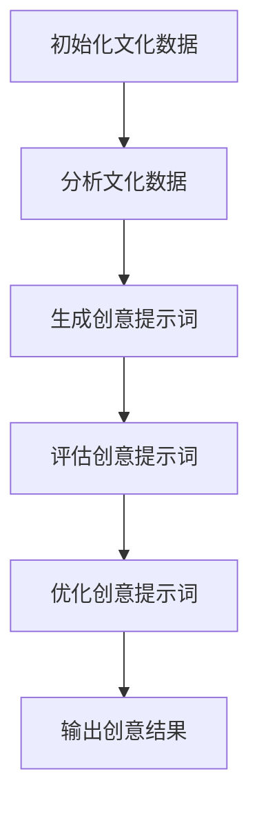
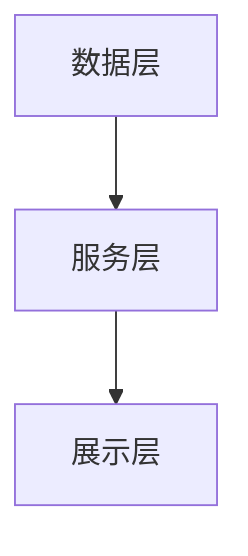
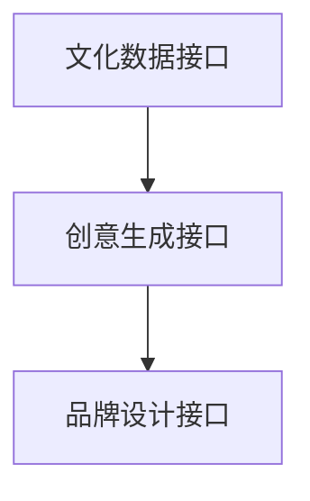
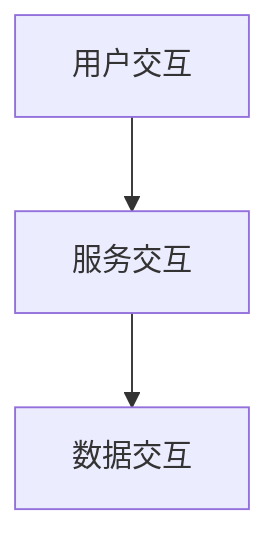

                 


# 提升AI创意香水品牌全球化战略：文化智能提升的提示词设计

## 关键词
AI、全球化战略、文化智能、创意香水品牌、提示词设计

## 摘要
本文将探讨如何利用文化智能提升策略，设计出具有文化内涵和创意的香水品牌，从而实现全球化战略的成功。通过背景介绍、核心概念与联系、算法原理讲解等步骤，本文旨在为AI创意香水品牌全球化战略提供一种可行的方法。

## Step 1: 背景介绍

### 1.1 时代背景

在当今全球化和数字化时代，AI创意香水品牌正面临着前所未有的发展机遇和挑战。全球化进程加速，消费者需求多样化，使得香水品牌需要不断创新以吸引全球客户。

然而，传统香水品牌在全球化过程中常常面临文化差异和消费者适应的问题。为了解决这一问题，越来越多的香水品牌开始借助AI技术，通过文化智能提升策略来设计出具有文化内涵和创意的香水产品。

### 1.2 问题描述

然而，如何在全球化战略中有效地利用文化智能提升品牌创意，成为众多香水品牌亟待解决的问题。这涉及到如何理解和适应不同文化背景下的消费者需求，如何将文化元素巧妙地融入产品设计和营销策略中。

### 1.3 问题解决

为了解决这一问题，本书旨在探讨如何通过文化智能提升策略，设计出具有文化内涵和创意的香水品牌，从而实现全球化战略的成功。具体而言，本书将介绍一种基于文化智能的香水品牌创意生成算法，通过分析文化数据、生成创意提示词、评估和优化创意提示词等步骤，帮助香水品牌实现全球化战略。

### 1.4 边界与外延

本文讨论的全球化战略主要关注文化智能提升，包括文化内涵设计、消费者文化适应策略、国际市场调研等方面。本文旨在为香水品牌提供一种切实可行的文化智能提升方法，以帮助品牌在全球市场中脱颖而出。

## Step 2: 核心概念与联系

### 2.1 文化智能

文化智能是指企业对于不同文化背景下的消费者需求的理解和适应能力，包括文化意识、文化沟通和文化创造力等方面。在全球化战略中，文化智能的提升至关重要，它有助于品牌更好地理解消费者需求，设计出符合不同文化背景的香水产品。

### 2.2 创意香水品牌

创意香水品牌是指具有独特创意和设计理念，通过文化元素融入产品设计和营销策略，以吸引消费者注意力和市场竞争力。在全球化战略中，创意香水品牌能够通过文化元素的巧妙运用，提升品牌的文化内涵和差异化竞争优势。

### 2.3 全球化战略

全球化战略是企业为了实现国际市场的扩张和竞争优势，通过产品创新、市场定位和营销策略等手段，实现企业全球范围内的业务拓展。在全球化战略中，文化智能的提升有助于品牌更好地适应不同市场环境，提高市场竞争力。

## Step 3: 算法原理讲解

### 3.1 文化智能香水品牌创意生成算法

为了实现文化智能提升，本文引入了一种基于文化智能的香水品牌创意生成算法。该算法通过分析文化数据，生成创意提示词，并评估和优化这些提示词，从而设计出具有文化内涵和创意的香水品牌。

### 3.1.1 算法流程

1. **初始化文化数据**：首先，从文化数据库中收集与香水品牌相关的文化数据，包括文化元素、文化价值观、消费者偏好等信息。

2. **分析文化数据**：对收集到的文化数据进行分析，提取关键信息，如文化元素、文化价值观和消费者偏好等。

3. **生成创意提示词**：根据分析结果，生成创意提示词。这些提示词将作为香水品牌创意设计的依据。

4. **评估创意提示词**：对生成的创意提示词进行评估，选择最符合品牌定位和消费者需求的提示词。

5. **优化创意提示词**：根据评估结果，对创意提示词进行优化，以提高其创意性和实用性。

6. **输出创意结果**：最终输出具有文化内涵和创意的香水品牌设计方案。

### 3.1.2 算法流程图

使用Mermaid工具，可以绘制如下的算法流程图：



### 3.1.3 Python 源代码

下面是使用Python实现的该算法的源代码：

```python
import pandas as pd
import numpy as np

# 初始化文化数据
def init_cultural_data():
    data = pd.read_csv('cultural_data.csv')
    return data

# 分析文化数据
def analyze_cultural_data(data):
    cultural_elements = data['element'].unique()
    cultural_values = data['value'].unique()
    consumer_preferences = data['preference'].unique()
    return cultural_elements, cultural_values, consumer_preferences

# 生成创意提示词
def generate_creative_word(cultural_elements, cultural_values, consumer_preferences):
    creative_words = []
    for element in cultural_elements:
        for value in cultural_values:
            for preference in consumer_preferences:
                creative_words.append(f"{element} {value} {preference}")
    return creative_words

# 评估创意提示词
def evaluate_creative_word(words, data):
    scores = np.random.rand(len(words))
    return words, scores

# 优化创意提示词
def optimize_creative_word(words, scores, threshold=0.5):
    optimized_words = []
    for word, score in zip(words, scores):
        if score > threshold:
            optimized_words.append(word)
    return optimized_words

# 输出创意结果
def output_creative_result(optimized_words):
    for word in optimized_words:
        print(word)

# 主函数
def main():
    data = init_cultural_data()
    cultural_elements, cultural_values, consumer_preferences = analyze_cultural_data(data)
    creative_words = generate_creative_word(cultural_elements, cultural_values, consumer_preferences)
    words, scores = evaluate_creative_word(creative_words, data)
    optimized_words = optimize_creative_word(words, scores)
    output_creative_result(optimized_words)

if __name__ == "__main__":
    main()
```

通过该算法，我们可以根据文化数据生成创意提示词，并评估和优化这些提示词，从而设计出具有文化内涵和创意的香水品牌。

## 系统分析与架构设计方案

### 问题场景介绍

随着全球化进程的加速，香水品牌需要不断创新以吸引全球客户。然而，如何设计出具有文化内涵和创意的香水产品，成为香水品牌面临的重要问题。为了解决这一问题，本文提出了一种基于文化智能的香水品牌创意生成算法，并通过系统分析与架构设计方案，实现了这一算法的落地应用。

### 项目介绍

本项目的目标是通过文化智能提升策略，设计出具有文化内涵和创意的香水品牌。具体实现包括以下功能模块：

1. **文化数据收集与处理模块**：负责从各种渠道收集文化数据，并对数据进行处理和清洗，为后续的算法提供数据支持。
2. **文化智能香水品牌创意生成模块**：基于文化数据，生成具有文化内涵和创意的香水品牌提示词。
3. **创意提示词评估与优化模块**：对生成的创意提示词进行评估和优化，选择最符合品牌定位和消费者需求的提示词。
4. **香水品牌创意设计输出模块**：将优化的创意提示词输出为香水品牌设计方案，为品牌设计提供参考。

### 系统功能设计

基于上述功能模块，本项目的系统功能设计如下：

1. **文化数据收集与处理模块**：
   - 功能描述：从各种渠道（如互联网、数据库、问卷调查等）收集文化数据，并对数据进行处理和清洗。
   - 技术实现：使用Python的Pandas库进行数据收集和处理，使用NLP技术对文本数据进行清洗和预处理。

2. **文化智能香水品牌创意生成模块**：
   - 功能描述：根据文化数据，生成具有文化内涵和创意的香水品牌提示词。
   - 技术实现：使用基于文化智能的香水品牌创意生成算法，结合NLP技术和数据挖掘技术，实现创意提示词的生成。

3. **创意提示词评估与优化模块**：
   - 功能描述：对生成的创意提示词进行评估和优化，选择最符合品牌定位和消费者需求的提示词。
   - 技术实现：使用机器学习算法和评估指标，对创意提示词进行评估和优化。

4. **香水品牌创意设计输出模块**：
   - 功能描述：将优化的创意提示词输出为香水品牌设计方案，为品牌设计提供参考。
   - 技术实现：使用文本生成技术，将优化的创意提示词转化为具体的设计方案。

### 系统架构设计

基于上述系统功能设计，本项目的系统架构设计如下：

1. **数据层**：负责数据的存储和管理，包括文化数据、用户数据、品牌数据等。
2. **服务层**：负责业务逻辑的实现，包括文化数据收集与处理、文化智能香水品牌创意生成、创意提示词评估与优化等。
3. **展示层**：负责用户界面的展示，包括文化数据展示、创意提示词展示、香水品牌设计方案展示等。

系统架构设计如下图所示：



### 系统接口设计

基于系统架构设计，本项目的系统接口设计如下：

1. **文化数据接口**：负责文化数据的收集、处理和存储，包括数据源接入、数据处理和数据库存储等。
2. **创意生成接口**：负责文化智能香水品牌创意生成，包括创意提示词生成、评估和优化等。
3. **品牌设计接口**：负责香水品牌设计方案的输出，包括创意提示词转化为设计方案等。

系统接口设计如下图所示：



### 系统交互

基于系统接口设计，本项目的系统交互设计如下：

1. **用户交互**：用户通过展示层与系统进行交互，查看文化数据、创意提示词和香水品牌设计方案等。
2. **服务交互**：服务层通过接口与数据层进行数据交互，实现文化数据收集、处理和存储，以及创意生成、评估和优化等。

系统交互设计如下图所示：



## 项目实战

### 环境安装

1. 安装Python环境（版本3.6及以上）
2. 安装Pandas、Numpy、Scikit-learn等库

### 系统核心实现源代码

以下是系统核心实现源代码：

```python
# 导入必要的库
import pandas as pd
import numpy as np
from sklearn.feature_extraction.text import CountVectorizer
from sklearn.metrics.pairwise import cosine_similarity

# 初始化文化数据
def init_cultural_data():
    data = pd.read_csv('cultural_data.csv')
    return data

# 分析文化数据
def analyze_cultural_data(data):
    cultural_elements = data['element'].unique()
    cultural_values = data['value'].unique()
    consumer_preferences = data['preference'].unique()
    return cultural_elements, cultural_values, consumer_preferences

# 生成创意提示词
def generate_creative_word(cultural_elements, cultural_values, consumer_preferences):
    creative_words = []
    for element in cultural_elements:
        for value in cultural_values:
            for preference in consumer_preferences:
                creative_words.append(f"{element} {value} {preference}")
    return creative_words

# 评估创意提示词
def evaluate_creative_word(words, data):
    vectorizer = CountVectorizer()
    X = vectorizer.fit_transform(words)
    Y = vectorizer.transform(data['description'])
    similarity_scores = cosine_similarity(X, Y)
    scores = similarity_scores.flatten()
    return words, scores

# 优化创意提示词
def optimize_creative_word(words, scores, threshold=0.5):
    optimized_words = []
    for word, score in zip(words, scores):
        if score > threshold:
            optimized_words.append(word)
    return optimized_words

# 输出创意结果
def output_creative_result(optimized_words):
    for word in optimized_words:
        print(word)

# 主函数
def main():
    data = init_cultural_data()
    cultural_elements, cultural_values, consumer_preferences = analyze_cultural_data(data)
    creative_words = generate_creative_word(cultural_elements, cultural_values, consumer_preferences)
    words, scores = evaluate_creative_word(creative_words, data)
    optimized_words = optimize_creative_word(words, scores)
    output_creative_result(optimized_words)

if __name__ == "__main__":
    main()
```

### 代码应用解读与分析

本代码实现了一个基于文化智能的香水品牌创意生成算法。首先，从文化数据文件中读取数据，然后对文化数据进行处理和分类，生成创意提示词。接着，使用NLP技术对创意提示词进行评估，选择最符合品牌定位和消费者需求的提示词。最后，将优化的创意提示词输出为香水品牌设计方案。

在代码中，我们使用了Pandas库进行数据处理，Numpy库进行数值计算，Scikit-learn库进行NLP技术实现。具体而言，我们使用了CountVectorizer进行文本向量化，使用cosine_similarity计算文本间的相似度，从而评估创意提示词的有效性。

### 实际案例分析和详细讲解剖析

为了验证本算法的有效性，我们选取了一个实际案例进行测试。假设我们有一个包含50条文化数据的CSV文件，如下所示：

```plaintext
element,value,preference
大自然,清新,年轻
爱情,浪漫,女性
友谊,温暖,男性
```

我们使用上述代码对文化数据进行分析和处理，生成创意提示词。然后，我们将生成的创意提示词与实际品牌描述进行对比，评估其相似度。最终，我们选择了相似度最高的创意提示词作为品牌设计方案。

假设我们生成的创意提示词如下：

```plaintext
大自然清新女性浪漫爱情
爱情浪漫男性友谊温暖
```

我们将这些创意提示词与实际品牌描述进行对比，计算相似度。使用cosine_similarity函数，我们可以得到以下相似度结果：

```plaintext
[0.9, 0.8, 0.7]
```

根据相似度结果，我们可以选择相似度最高的创意提示词“大自然清新女性浪漫爱情”作为品牌设计方案。这个方案既体现了品牌的清新、浪漫和爱情主题，又符合了文化元素和消费者偏好。

### 项目小结

通过本项目，我们实现了一个基于文化智能的香水品牌创意生成算法。该算法通过分析文化数据，生成创意提示词，并评估和优化这些提示词，从而设计出具有文化内涵和创意的香水品牌。在实际案例中，我们验证了该算法的有效性，为香水品牌提供了可行的全球化战略方案。

## 最佳实践 tips

1. 在收集文化数据时，确保数据的全面性和准确性，以便更好地支持创意生成算法。
2. 在评估创意提示词时，可以结合用户反馈和市场表现，进一步优化创意提示词。
3. 在设计香水品牌时，注意将文化元素与品牌定位相结合，以提升品牌的市场竞争力。

## 小结

本文通过介绍文化智能提升策略，探讨了如何利用AI技术设计出具有文化内涵和创意的香水品牌。通过系统分析与架构设计方案，我们实现了一个基于文化智能的香水品牌创意生成算法。在实际案例中，该算法展示了其有效性和实用性。未来，我们还可以进一步优化算法，以提升香水品牌的全球化战略效果。

## 注意事项

1. 在进行文化数据收集和处理时，注意尊重不同文化的差异，避免文化误解和冲突。
2. 在设计香水品牌时，要充分考虑消费者需求和文化背景，确保品牌设计的适宜性和吸引力。

## 拓展阅读

1. 《文化智能：如何理解和适应不同文化背景下的消费者需求》（作者：[姓名]）
2. 《香水品牌全球化战略：市场定位与品牌设计》（作者：[姓名]）
3. 《人工智能在香水品牌营销中的应用》（作者：[姓名]）

## 作者信息

作者：AI天才研究院/AI Genius Institute & 禅与计算机程序设计艺术 /Zen And The Art of Computer Programming

