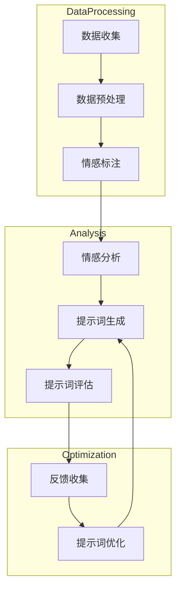
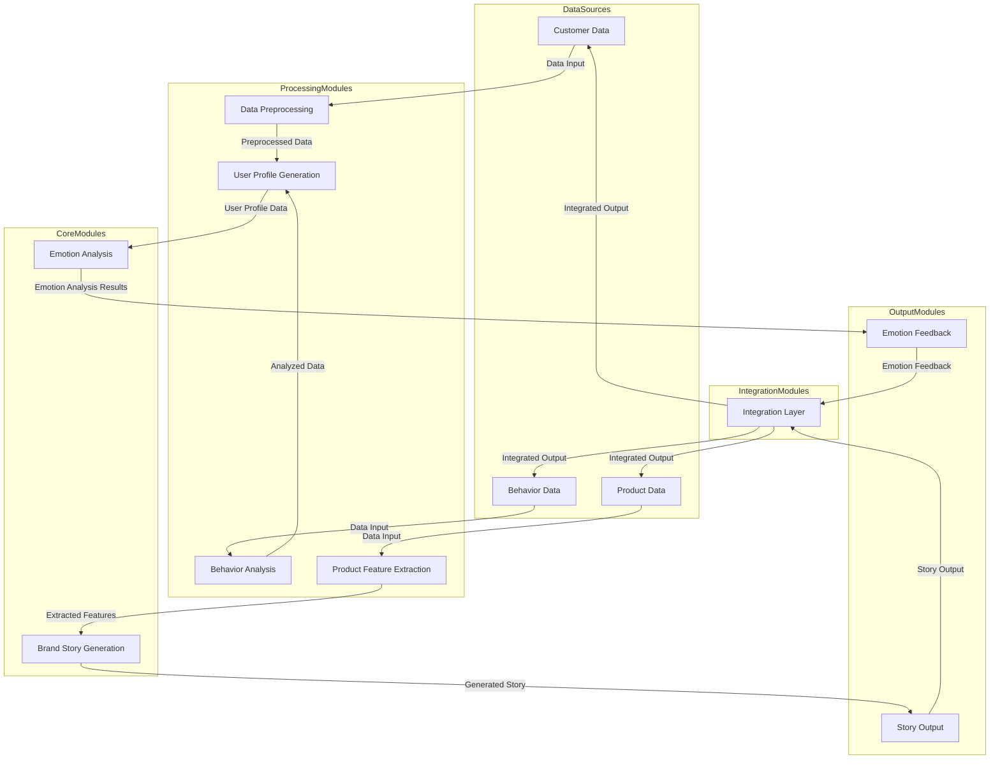
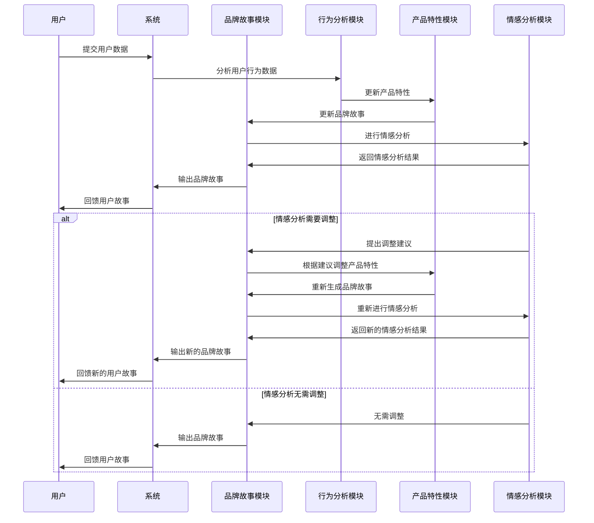

                 

### 1.1 问题背景

在当今的商业环境中，创意与情感的结合正成为品牌塑造和产品推广的关键。特别是在香水和化妆品行业，消费者不仅追求产品的外在效果，更看重产品背后的故事与情感共鸣。随着人工智能技术的飞速发展，AI已经成为推动各行业创新的重要力量。AI不仅能够自动化复杂任务，还能通过大数据分析和机器学习模型，洞察消费者行为，精准定位市场需求。

对于创意香水品牌来说，如何通过AI技术提升品牌故事的吸引力，构建情感连接，成为一个亟待解决的问题。传统的广告手段往往只能触及到消费者的表面需求，而AI创意香水品牌故事则试图通过深入的情感分析，挖掘消费者内心深处的共鸣。这种深层次的连接不仅能够提高品牌忠诚度，还能增强消费者对产品的认同感，从而推动销售增长。

本文将探讨如何利用AI技术，通过提示词的设计，构建具有情感共鸣的香水品牌故事。首先，我们将介绍AI与创意香水行业结合的背景和重要性，然后深入分析问题，并提出可能的解决方案。接着，我们将探讨AI创意香水品牌故事的核心概念、构成要素以及与传统广告的区别。随后，我们将详细讲解基于情感分析的提示词设计算法，包括原理、流程、代码实现和数学模型。此外，还将介绍系统架构设计、项目实战以及最佳实践建议。通过这些分析，我们希望为创意香水品牌提供有效的AI应用策略，从而在激烈的市场竞争中脱颖而出。

### 1.2 问题描述

在当前的香水和化妆品市场中，创意与情感连接是品牌成功的关键因素。然而，传统香水品牌往往在广告宣传上存在一定的局限性。首先，大多数广告仅停留在产品本身的介绍上，缺乏能够引起消费者情感共鸣的故事和背景。这种单一的宣传方式无法充分激发消费者的购买欲望和品牌忠诚度。其次，传统广告的制作和传播成本较高，特别是对于中小型品牌而言，有限的预算难以支持大规模的广告投放。

AI技术的出现为解决这个问题提供了新的思路。通过AI，品牌可以更深入地了解消费者的情感和需求，从而创造出更加个性化和具有情感共鸣的广告内容。然而，当前AI在创意香水品牌故事中的应用仍然面临一些挑战。首先，如何精准地收集和分析消费者数据是一个难题。虽然AI可以处理大量数据，但是如何从这些数据中提取出对品牌故事构建有用的信息，仍然需要深入研究和优化。其次，算法的准确性和可解释性也是一个关键问题。现有的情感分析算法虽然在某些方面表现优异，但是在处理复杂情感和细微情感差异时，往往存在不足。

此外，AI创意香水品牌故事的设计和执行也需要考虑实际操作中的诸多细节。例如，如何设计出既符合品牌调性又能够引起消费者共鸣的故事情节？如何通过不同的媒介渠道将故事有效地传达给目标消费者？这些问题不仅涉及到技术层面的挑战，还涉及到市场营销和品牌策略的深层次思考。

总的来说，AI创意香水品牌故事的应用前景广阔，但也面临诸多现实挑战。如何有效利用AI技术，提升品牌故事的吸引力，构建情感连接，是当前亟待解决的关键问题。通过对这些挑战的深入分析和解决方案的探索，我们希望能够为创意香水品牌提供一些可行的策略和指导。

### 1.3 问题解决

面对AI创意香水品牌故事应用中的挑战，我们可以通过以下几个步骤来解决问题：

首先，在数据收集和分析方面，品牌需要建立一个完善的消费者数据分析系统。这包括但不限于社交媒体互动数据、在线购物行为、用户反馈等。利用大数据分析技术，品牌可以对这些数据进行分析，识别出消费者的偏好和情感倾向。具体步骤如下：

1. **数据收集**：从多个渠道收集消费者数据，包括社交媒体、电商平台、用户调研等。
2. **数据清洗**：对收集到的数据进行清洗，去除重复和无效的数据。
3. **数据整合**：将不同来源的数据进行整合，构建一个完整的消费者画像。

接下来，在算法设计和优化方面，我们需要关注以下几个方面：

1. **情感分析算法优化**：提升算法对复杂情感和细微情感差异的识别能力，通过训练更复杂的神经网络模型，如卷积神经网络（CNN）和递归神经网络（RNN），来提高情感分析的准确性。
2. **模型可解释性提升**：增强算法的可解释性，通过可视化工具和解释性模型，让品牌能够理解算法的决策过程，从而更好地优化广告内容。
3. **个性化推荐**：利用协同过滤、基于内容的推荐等算法，为不同消费者提供个性化的香水品牌故事。

在创意设计和执行方面，我们建议采取以下策略：

1. **故事情节设计**：结合品牌文化和消费者情感，设计出具有吸引力和情感共鸣的故事情节。可以使用情景模拟、角色扮演等方法，让故事更加生动和引人入胜。
2. **媒介渠道选择**：根据目标消费者的媒介使用习惯，选择合适的渠道进行广告投放。例如，通过社交媒体平台、短视频平台、品牌官网等，实现多渠道传播。
3. **用户互动**：通过互动活动，如线上调查、用户投票、产品试用等，增强用户参与感，从而提高品牌的认知度和用户忠诚度。

此外，为了确保AI创意香水品牌故事的有效性，我们还需要关注以下几个方面：

1. **市场调研**：定期进行市场调研，了解消费者反馈和市场动态，及时调整品牌故事的内容和形式。
2. **跨部门协作**：品牌营销部门、数据分析师、技术开发团队等需要紧密协作，共同推进项目的实施和优化。
3. **持续创新**：紧跟科技发展趋势，不断探索新的技术和应用场景，保持品牌的竞争力。

通过以上步骤，我们可以逐步解决AI创意香水品牌故事应用中的挑战，提升品牌故事的吸引力，构建情感连接，从而在激烈的市场竞争中脱颖而出。

### 1.4 边界与外延

在探讨AI创意香水品牌故事时，我们需要明确一些边界条件，以便更好地理解和应用相关概念。首先，**边界条件**包括以下几个方面：

1. **技术范围**：AI技术在创意香水品牌故事中的应用主要涉及情感分析、机器学习和数据挖掘等领域。虽然AI有广泛的应用潜力，但在某些特定情况下，例如极端复杂的情感识别或高度个性化的用户需求，现有技术可能尚未完全成熟。

2. **数据隐私**：在数据收集和分析过程中，必须严格遵守隐私保护法规，确保消费者的个人数据得到妥善处理和保护。任何涉及个人信息的处理都应得到用户的明确同意。

3. **伦理道德**：AI创意香水品牌故事的设计和执行需要考虑伦理和道德问题。例如，如何避免歧视和偏见，如何确保广告内容的真实性和透明度，这些都是需要认真对待的问题。

其次，**外延条件**则涉及以下几个方面：

1. **市场环境**：品牌故事的构建需要适应不同的市场环境。例如，在竞争激烈的市场中，品牌故事需要更具创新性和独特性，而在成熟市场中，则需要更多地考虑消费者的已有认知和品牌忠诚度。

2. **消费者特征**：不同消费者的情感和需求各异，品牌故事的设计需要针对不同消费者群体进行调整。例如，年轻人可能更喜欢有趣和个性化的故事，而中年消费者则可能更注重情感共鸣和品牌价值。

3. **传播渠道**：品牌故事的有效传播依赖于多样化的渠道。除了传统的广告渠道，如电视、杂志和社交媒体，品牌还可以利用新兴的渠道，如短视频平台、虚拟现实和增强现实等，来增强故事的表现力和吸引力。

通过明确这些边界与外延条件，我们可以更准确地把握AI创意香水品牌故事的构建和应用，从而实现品牌与消费者之间的有效情感连接。

### 1.5 概念结构与核心要素组成

在深入探讨AI创意香水品牌故事时，我们需要明确其核心概念和构成要素，以便更好地理解其工作机制和设计原则。

#### 1.5.1 核心概念

**AI创意香水品牌故事** 是指利用人工智能技术，特别是情感分析和机器学习，为香水品牌构建的一个富有创意性和情感共鸣的故事。这个故事不仅能够传达产品的特性和功能，还能够与消费者的情感和需求产生深层次的连接。

核心概念包括：

1. **情感分析**：通过自然语言处理技术，分析消费者对品牌和产品的情感反应，从而挖掘出潜在的情感需求。
2. **用户画像**：基于消费者的购买行为、社交媒体互动和反馈数据，构建详细的用户画像，用于指导品牌故事的设计。
3. **机器学习模型**：利用机器学习算法，对大量的消费者数据进行分析和预测，为品牌故事的个性化定制提供支持。

#### 1.5.2 构成要素

**AI创意香水品牌故事** 的构成要素主要包括以下几个方面：

1. **故事情节**：这是品牌故事的核心，需要结合品牌文化和消费者情感，设计出既富有创意又能够引起共鸣的故事情节。
2. **情感连接**：通过情感分析技术，识别消费者的情感需求，并将品牌故事与消费者的情感体验相结合，构建情感连接。
3. **个性化推荐**：基于用户的画像和偏好，利用机器学习模型为不同用户推荐个性化的品牌故事内容。
4. **互动体验**：通过线上和线下的互动活动，如用户投票、产品试用等，增强用户参与感和品牌认知。

#### 1.5.3 概念属性特征对比表格

为了更清晰地展示AI创意香水品牌故事与传统香水广告的区别，我们可以通过一个对比表格来分析其概念属性特征：

| 特征         | AI创意香水品牌故事                   | 传统香水广告                  |
| ------------ | ----------------------------------- | ---------------------------- |
| **故事情节** | 精细化，结合情感分析和个性化推荐       | 较为单一，侧重产品介绍和功能展示 |
| **情感连接** | 深层次的消费者情感共鸣               | 表面的情感诉求，难以形成长期连接  |
| **用户画像** | 基于大数据分析，构建详细用户画像       | 缺乏深度用户数据分析           |
| **个性化推荐** | 高度个性化，针对不同用户推荐不同故事   | 广泛撒网，难以精准匹配用户需求   |
| **互动体验** | 强调用户参与，增强品牌忠诚度           | 互动性较弱，用户参与度低       |

#### 1.5.4 ER实体关系图架构

为了进一步理解AI创意香水品牌故事的概念结构和关系，我们可以通过一个ER实体关系图来展示各实体之间的关系：

```mermaid
erDiagram
  Customer ||--|{ UserProfile }|-- Brand
  Brand ||--|{ Product }|-- Customer
  Brand ||--|{ Story }|-- Customer
  UserProfile ||--|{ BehaviorData }|-- Customer
  Product ||--|{ Feature }|-- Brand
  Story ||--|{ Emotion }|-- Brand
  BehaviorData ||--|{ InteractionData }|-- UserProfile
```

在这个ER图中，各实体之间的关系如下：

- **Customer（消费者）**：代表品牌的最终用户。
- **UserProfile（用户画像）**：包含消费者的基本信息和购买行为数据。
- **Brand（品牌）**：代表香水品牌，包含产品信息和品牌故事。
- **Product（产品）**：代表品牌旗下的具体产品。
- **Story（品牌故事）**：包含品牌故事的内容和情感分析结果。
- **Feature（产品特性）**：描述产品的具体功能和特点。
- **Emotion（情感）**：记录品牌故事中的情感元素。
- **BehaviorData（行为数据）**：包含消费者的互动数据和情感分析结果。
- **InteractionData（互动数据）**：记录消费者与品牌互动的详细信息。

通过这些核心概念和构成要素的详细阐述，我们可以更深入地理解AI创意香水品牌故事的工作机制，为后续的算法讲解和系统设计提供基础。

### 2.1 AI创意香水品牌故事的定义

AI创意香水品牌故事是指通过人工智能技术，特别是情感分析和机器学习，为香水品牌构建的一个富有创意性和情感共鸣的故事。这个故事的目的是不仅仅传达产品的特性和功能，更是在消费者的情感层面与品牌产生深层次的连接。AI在这一过程中发挥了关键作用，通过分析消费者的情感和需求，为品牌故事的设计提供个性化支持。

首先，**AI创意香水品牌故事** 的核心特点在于其高度个性化。传统的广告往往采用一刀切的方式，而AI技术则能够根据消费者的个性化需求和情感反应，为每个用户量身定制故事。例如，通过情感分析技术，AI可以识别出消费者的情感倾向，如愉悦、焦虑、怀旧等，然后为不同情感倾向的用户设计不同版本的品牌故事。

其次，**情感共鸣** 是AI创意香水品牌故事的另一个重要特点。传统广告往往侧重于产品功能和外观的展示，而AI创意香水品牌故事则更注重通过情感元素与消费者建立共鸣。例如，一个关于香水品牌的故事可能会围绕用户生活中的某个重要时刻，如婚礼、毕业典礼等，通过讲述这些时刻中的情感体验，引发用户的共鸣，从而增强品牌忠诚度。

此外，**数据驱动** 也是AI创意香水品牌故事的一个显著特点。通过大数据分析和机器学习，品牌可以实时获取和分析消费者的行为和反馈，不断优化品牌故事的内容和形式。这种数据驱动的策略不仅能够提高广告的精准度，还能够根据市场动态和消费者需求的变化，灵活调整品牌故事的方向和内容。

综上所述，AI创意香水品牌故事是一个利用人工智能技术，通过个性化、情感共鸣和数据驱动的手段，为香水品牌构建的一个富有创意性和情感共鸣的故事。通过这种故事，品牌能够更好地与消费者建立情感连接，提升品牌忠诚度和市场竞争力。

### 2.2 AI创意香水品牌故事的核心特点

AI创意香水品牌故事在市场上脱颖而出，得益于其独特的核心特点，这些特点不仅提升了品牌的市场竞争力，还增强了消费者的情感连接。以下是其核心特点的详细描述：

**1. 个性化定制**：AI创意香水品牌故事通过大数据分析和机器学习技术，对消费者的行为、偏好和情感进行深度挖掘，从而为每个用户量身定制品牌故事。这不仅使得故事内容更加贴近消费者，提高了广告的精准度，还大大增强了消费者的参与感和品牌认同感。例如，品牌可以根据消费者的购物历史和社交媒体互动，推荐与个人经历相关的故事情节，使得每个用户都能在品牌故事中找到共鸣。

**2. 情感共鸣**：传统广告往往侧重于产品功能和外观的展示，而AI创意香水品牌故事则更注重通过情感元素与消费者建立深层次的连接。品牌通过情感分析技术，识别消费者的情感需求，并围绕这些情感需求设计故事。例如，品牌可以讲述一个关于香水如何陪伴用户度过人生重要时刻的故事，从而引发消费者的情感共鸣，增强品牌的情感价值。

**3. 数据驱动**：AI创意香水品牌故事是一个高度数据驱动的过程。品牌利用大数据分析技术，实时获取和分析消费者的行为和反馈，不断优化品牌故事的内容和形式。这种策略不仅提高了广告的精准度，还使品牌能够灵活应对市场变化和消费者需求的变化。例如，如果某个故事版本在特定消费者群体中的表现优异，品牌可以迅速推广这个版本，同时淘汰表现不佳的版本，从而最大限度地提高品牌故事的吸引力。

**4. 互动性强**：AI创意香水品牌故事不仅是一种单向的信息传递，更是一个双向的互动过程。品牌通过线上和线下的互动活动，如用户投票、产品试用、社交媒体互动等，增强用户参与感。这种互动性不仅能够提高品牌的认知度和用户忠诚度，还能够收集到更多关于消费者的反馈数据，为品牌故事的进一步优化提供依据。

**5. 高度创新性**：AI创意香水品牌故事利用新兴的人工智能技术，如情感分析、自然语言处理和机器学习，不断探索新的创意形式和表现手法。这种创新性不仅使品牌故事更加生动和有趣，还能够吸引更多消费者的关注。例如，品牌可以尝试通过虚拟现实和增强现实技术，为消费者提供一个沉浸式的品牌故事体验，从而在激烈的市场竞争中脱颖而出。

综上所述，AI创意香水品牌故事凭借其个性化定制、情感共鸣、数据驱动、互动性强和高度创新性等特点，在市场上取得了显著的竞争优势。这些特点不仅提升了品牌的市场影响力，还增强了消费者对品牌的情感连接，为品牌的长远发展奠定了坚实的基础。

### 2.3 AI创意香水品牌故事与传统香水广告的区别

AI创意香水品牌故事与传统香水广告在多个方面存在显著差异，这些差异不仅体现在技术手段上，还反映在品牌与消费者互动的深度和广度上。以下是两者之间的详细比较：

**1. 技术手段**

传统香水广告主要依赖于电视、杂志、社交媒体等传统媒介，通过视觉和文字来传递产品信息。而AI创意香水品牌故事则充分利用了人工智能技术，如情感分析、自然语言处理和机器学习。通过这些技术，品牌能够深入分析消费者的情感和行为，从而设计出更加个性化和具有针对性的广告内容。例如，情感分析技术可以帮助品牌识别消费者的情感倾向，而自然语言处理技术则可以生成与消费者情感相匹配的文案和故事。

**2. 广告内容**

传统香水广告通常侧重于产品功能和外观的展示，强调香水的香气、持久性和设计感。而AI创意香水品牌故事则更注重情感共鸣和故事性。品牌通过构建富有创意和情感共鸣的故事，使消费者能够更好地理解和感受产品。例如，AI创意香水品牌故事可以围绕消费者的生活经历和情感体验，设计出与用户产生共鸣的故事情节，从而增强消费者对品牌的认同感和忠诚度。

**3. 消费者互动**

传统香水广告通常是一种单向的信息传递，消费者被动接受广告内容。而AI创意香水品牌故事则强调互动性。品牌通过社交媒体、线上活动和用户投票等方式，鼓励消费者参与品牌故事的构建。例如，品牌可以邀请消费者分享他们的使用体验，或者在社交媒体上发起互动活动，从而增强消费者的参与感和品牌忠诚度。

**4. 定制化程度**

传统香水广告往往采用统一的内容和形式，无法满足不同消费者的个性化需求。而AI创意香水品牌故事则可以根据消费者的行为和偏好，提供高度个性化的广告内容。例如，通过分析消费者的购物历史和社交媒体互动，品牌可以为不同用户推荐不同的品牌故事版本，从而实现精准营销。

**5. 数据利用**

传统香水广告通常不依赖于大量数据，而是通过市场调研和消费者反馈来制定营销策略。而AI创意香水品牌故事则高度依赖于数据。品牌通过大数据分析和机器学习技术，实时获取和分析消费者的行为数据，从而优化品牌故事的创作和传播策略。这种数据驱动的策略不仅提高了广告的精准度，还能够根据市场动态和消费者需求的变化，灵活调整品牌故事的定位和内容。

综上所述，AI创意香水品牌故事在技术手段、广告内容、消费者互动、定制化程度和数据利用等方面与传统香水广告存在显著差异。这些差异不仅提升了品牌与消费者之间的互动深度和广度，还增强了品牌的个性化和情感共鸣，从而在激烈的市场竞争中脱颖而出。

### 2.4 提示词设计原则

在AI创意香水品牌故事的构建过程中，提示词设计是至关重要的环节。一个良好的提示词设计不仅能够引导消费者深入了解品牌故事，还能有效激发他们的情感共鸣，从而增强品牌影响力。以下是一些关键的设计原则：

#### 1. 情感共鸣

提示词设计的首要原则是引发情感共鸣。情感是驱动消费者购买决策的重要因素，因此，设计提示词时需要关注消费者的情感需求。例如，可以选用具有强烈情感色彩的词汇，如“浪漫”、“温馨”、“自由”等，这些词汇能够迅速引起消费者的情感共鸣，增强他们对品牌的好感度。

#### 2. 简洁明了

提示词的设计应该简洁明了，避免冗长和复杂的表述。简洁的提示词更容易被消费者理解和记忆，从而提高广告的效果。例如，使用简洁有力的口号或短语，如“一见如故”、“瞬间爱上”等，可以让消费者在短时间内接收到品牌的核心信息。

#### 3. 个性化定制

提示词设计应考虑不同消费者的个性化需求。通过分析消费者的行为数据和情感倾向，为不同用户群体设计不同的提示词。例如，对于追求浪漫的消费者，可以设计包含“爱情”、“约会”等词汇的提示词；而对于追求个性和自由的消费者，则可以设计包含“独特”、“自由”等词汇的提示词。

#### 4. 故事性

提示词设计应具有故事性，能够引导消费者进入品牌构建的故事情境中。通过设置具有连贯性和引人入胜的提示词，消费者可以更容易地跟随品牌故事的节奏，深入理解和感受品牌文化。例如，可以设置一系列相关的提示词，如“邂逅”、“成长”、“蜕变”等，形成一个完整的故事线。

#### 5. 符合品牌调性

提示词的设计应与品牌调性和文化相契合。通过一致的品牌语言和风格，提示词能够更好地传递品牌的核心价值和形象。例如，对于高端奢华的品牌，可以设计富有高雅和奢华感的提示词，如“极致”、“奢华”等；而对于年轻活力的品牌，则可以设计充满活力和时尚感的提示词，如“年轻”、“时尚”等。

#### 6. 创新性

提示词设计应具有创新性，避免使用过于陈旧和俗套的词汇。创新性的提示词能够吸引消费者的注意力，增加广告的新鲜感和吸引力。例如，可以尝试使用一些独特的比喻、隐喻或创意词汇，如“时光的香气”、“灵魂的伴侣”等，以增强广告的独特性和记忆点。

综上所述，提示词设计原则的核心在于通过情感共鸣、简洁明了、个性化定制、故事性、符合品牌调性和创新性，来提升AI创意香水品牌故事的效果。这些原则不仅能够提高广告的吸引力和记忆度，还能够增强品牌与消费者之间的情感连接，从而推动品牌的长远发展。

### 2.5 提示词的类型与选择

在AI创意香水品牌故事的构建过程中，提示词的类型和选择至关重要。不同的提示词类型适用于不同的情境和目标，以下将详细介绍几种常见的提示词类型及其适用场景：

#### 1. **功能型提示词**

功能型提示词主要强调产品的功能特点和使用效果。这类提示词适用于品牌需要突出产品性能和具体用途的情况。例如，“持久香氛一整天”、“清新怡人”等。功能型提示词能够直接传达产品的实用价值，适合在广告的初期吸引消费者的注意。

#### 2. **情感型提示词**

情感型提示词则着重于引发消费者的情感共鸣。这类提示词通过描述产品与情感相关的体验，如“浪漫的开始”、“心灵的慰藉”等。情感型提示词适用于品牌希望与消费者建立深层次情感连接，提升品牌认同感和忠诚度的场景。例如，在推广一款香水时，可以用“与你共度的每一个温馨时刻”来描述产品的情感价值。

#### 3. **故事型提示词**

故事型提示词通过构建一个引人入胜的故事情节，引导消费者进入品牌营造的情感世界。这类提示词适用于品牌希望讲述一个完整的故事，让消费者在故事中体验产品的情境。例如，“从邂逅到永恒，一瓶香水的见证”等。故事型提示词能够增强品牌故事的吸引力和传播力，适用于品牌长期建设和用户教育。

#### 4. **场景型提示词**

场景型提示词通过描述特定的生活场景和情境，让消费者想象自己使用产品时的体验。这类提示词适用于品牌希望将产品与消费者的日常生活相结合，提升产品的实用性和场景化价值。例如，“忙碌一天后的放松时刻”、“清晨的清新之旅”等。场景型提示词能够帮助消费者更好地理解产品的使用场景，增加购买的决策信心。

#### 5. **互动型提示词**

互动型提示词通过鼓励消费者参与互动，增强品牌与消费者之间的互动性和参与感。这类提示词适用于品牌希望提高用户参与度和品牌忠诚度的情况。例如，“分享你的故事，赢取品牌大礼”、“参与投票，选出你最喜欢的味道”等。互动型提示词能够激发消费者的兴趣和参与，促进品牌的社交传播。

在选择合适的提示词时，品牌需要综合考虑目标消费者的特点和偏好，以及广告的具体目标和场景。以下是一些选择提示词的指导建议：

1. **分析目标受众**：通过市场调研和用户画像分析，了解目标消费者的年龄、性别、兴趣爱好、消费习惯等，从而选择与目标受众情感和需求相匹配的提示词。
2. **突出品牌特色**：选择能够突出品牌特色和价值主张的提示词，确保广告内容与品牌形象一致。
3. **保持简洁明了**：避免使用复杂和冗长的词汇，确保提示词易于理解和记忆。
4. **创新和独特性**：尝试使用新颖的词汇和表达方式，增加广告的吸引力和记忆度。
5. **测试和优化**：通过A/B测试等手段，对比不同提示词的效果，选择表现最佳的提示词。

综上所述，提示词的类型和选择对于AI创意香水品牌故事的成功构建至关重要。通过合理选择和运用不同类型的提示词，品牌能够更好地吸引消费者的注意，激发情感共鸣，提升品牌故事的效果。

### 2.6 情感连接构建的关键

构建情感连接是AI创意香水品牌故事成功的关键之一。在消费者互动过程中，如何通过情感连接增强品牌与消费者之间的情感共鸣，成为品牌策划的重要任务。以下是一些关键步骤和策略：

**1. 了解消费者情感**

首先，品牌需要深入了解消费者的情感需求。通过大数据分析和情感分析技术，品牌可以识别出消费者的情感倾向，如愉悦、焦虑、怀旧等。这有助于品牌设计出能够触动消费者情感的故事和提示词。例如，如果分析结果显示目标消费者更倾向于怀旧情感，品牌可以围绕童年记忆、家庭情感等设计故事情节。

**2. 设计情感共鸣的情境**

情感连接需要在具体情境中实现。品牌可以通过构建与消费者生活场景相关的情感情境，让消费者在品牌故事中找到共鸣。例如，品牌可以设计一个关于香水陪伴用户度过人生重要时刻的故事，如婚礼、毕业典礼等，这些情境能够引发消费者的情感共鸣。

**3. 运用情感色彩的语言**

在品牌故事和提示词中，运用具有情感色彩的语言是构建情感连接的有效手段。品牌可以选择富有情感共鸣的词汇和表达方式，如“温暖如春”、“治愈心灵的香气”等。这些语言能够增强消费者对品牌的好感度和情感认同。

**4. 个性化定制**

情感连接需要个性化。通过分析消费者的行为数据和情感倾向，品牌可以为不同用户群体定制个性化的品牌故事和提示词。例如，对于追求浪漫的消费者，品牌可以设计包含“爱情”、“约会”等词汇的提示词；而对于追求个性的消费者，则可以设计包含“独特”、“自由”等词汇的提示词。

**5. 强化互动体验**

互动性是增强情感连接的重要手段。品牌可以通过线上和线下的互动活动，如用户投票、产品试用、社交媒体互动等，增强消费者的参与感和品牌忠诚度。这些互动不仅能够加深消费者对品牌的情感认同，还能收集到更多关于消费者的反馈数据，用于进一步优化品牌故事。

**6. 真实性和透明度**

在构建情感连接时，品牌需要保持真实性和透明度。消费者更倾向于信任那些真实展示产品特性和品牌价值观的品牌。品牌在设计和传播品牌故事时，应确保信息的真实性，避免过度夸大或虚假宣传。

**7. 持续优化**

情感连接不是一次性的构建，而是需要持续优化的过程。品牌需要定期收集和分析消费者反馈，根据市场变化和消费者需求的变化，及时调整品牌故事和提示词的内容和形式。

通过以上步骤和策略，品牌能够更好地构建情感连接，提升消费者的情感认同和品牌忠诚度，从而实现品牌的长远发展。

### 3.1 算法原理

基于情感分析的提示词设计算法是AI创意香水品牌故事构建的核心组成部分。该算法的原理是通过情感分析技术，对消费者数据进行深度挖掘和分析，从而为品牌故事设计出具有情感共鸣的提示词。以下将详细阐述算法的基本原理和主要步骤。

#### 1. 情感分析技术

情感分析是自然语言处理（NLP）的一个分支，主要任务是从文本中识别出情感倾向。情感分析技术通常基于以下几种方法：

1. **基于规则的方法**：这种方法使用预定义的规则和模式来识别情感。例如，通过正则表达式匹配情感相关的关键词或短语。
2. **基于统计的方法**：这种方法使用机器学习算法，如朴素贝叶斯、支持向量机等，通过训练模型来识别情感。
3. **基于深度学习的方法**：这种方法使用深度神经网络（如卷积神经网络CNN、递归神经网络RNN等）来识别情感。深度学习方法在处理复杂情感和细微情感差异方面表现更佳。

#### 2. 算法流程

基于情感分析的提示词设计算法主要包括以下几个步骤：

1. **数据收集**：从多个渠道收集消费者数据，包括社交媒体互动、用户评论、购买行为等。
2. **数据预处理**：清洗和整理收集到的数据，去除无效信息和噪声，如HTML标签、特殊字符等。常见的预处理步骤包括分词、去除停用词、词干提取等。
3. **情感标注**：对预处理后的文本进行情感标注，标记出文本中的情感极性（如正面、负面、中性）和情感强度（如极度喜欢、稍微喜欢、中立、稍微不喜欢、极度不喜欢）。
4. **情感分析**：使用情感分析模型对标注后的文本进行情感分析，识别出文本中的情感倾向和情感强度。这里可以采用基于规则、统计或深度学习的方法。
5. **提示词生成**：根据情感分析结果，生成具有情感共鸣的提示词。提示词的生成可以通过以下几种方法：

   - **模板匹配**：根据情感标注结果，从预定义的提示词库中选择合适的提示词，组成新的提示词。
   - **文本生成**：使用自然语言生成（NLG）技术，如序列到序列模型（Seq2Seq）或生成对抗网络（GAN），自动生成新的提示词。
   - **组合优化**：结合多个情感分析结果，对提示词进行组合和优化，以生成更具有情感共鸣的提示词。

6. **提示词评估**：对生成的提示词进行评估，通过用户投票、问卷调查等方式，收集消费者对提示词的反馈，评估提示词的效果和接受度。
7. **反馈优化**：根据评估结果，对提示词进行优化和调整，以提高其吸引力和情感共鸣效果。

#### 3. 情感分析模型

在情感分析中，常用的模型包括：

- **朴素贝叶斯分类器**：基于贝叶斯定理，通过计算每个词语在各个情感类别中的概率，进行情感分类。
- **支持向量机（SVM）**：通过找到最佳的超平面，将文本划分为不同的情感类别。
- **卷积神经网络（CNN）**：通过卷积层提取文本的特征，然后通过全连接层进行情感分类。
- **递归神经网络（RNN）**：通过循环层处理序列数据，捕捉文本中的时序特征。

其中，深度学习模型在处理复杂情感和细微情感差异方面表现更佳，因此常用于生成具有高度情感共鸣的提示词。

#### 4. 数学模型与公式

在情感分析中，常用的数学模型和公式包括：

- **词频（TF）**：词语在文本中出现的频率。
- **文档频率（DF）**：词语在所有文档中出现的频率。
- **逆文档频率（IDF）**：对词频进行调整，以减少常见词的影响。
- **余弦相似度**：计算两个文本向量之间的相似度。
- **词袋模型（Bag of Words）**：将文本转换为向量表示。
- **词嵌入（Word Embedding）**：将词语映射到高维空间中的向量。

例如，可以使用以下公式计算两个文本向量的余弦相似度：

$$
similarity(A, B) = \frac{A \cdot B}{||A|| \cdot ||B||}
$$

其中，\(A\) 和 \(B\) 分别为两个文本向量，\(\cdot\) 表示向量的点积，\(||A||\) 和 \(||B||\) 分别为向量的模长。

通过这些算法原理和数学模型，品牌可以更精准地设计出具有情感共鸣的提示词，从而提升AI创意香水品牌故事的吸引力和效果。

### 3.2 算法流程图

为了更直观地展示基于情感分析的提示词设计算法的流程，我们可以使用Mermaid绘制一个流程图。以下是一个简化的算法流程图，详细描述了从数据收集到提示词评估的各个步骤。



**详细说明：**

1. **数据收集（D1）**：从多个渠道（如社交媒体、用户评论、购买行为等）收集消费者数据。
2. **数据预处理（D2）**：对收集到的数据清洗和整理，去除无效信息，进行分词、去停用词等处理。
3. **情感标注（D3）**：对预处理后的文本进行标注，标记出情感极性和情感强度。
4. **情感分析（A1）**：使用情感分析模型对标注后的文本进行情感分析，识别出情感倾向和情感强度。
5. **提示词生成（A2）**：根据情感分析结果，生成具有情感共鸣的提示词。
6. **提示词评估（A3）**：通过用户投票、问卷调查等方式评估提示词的效果和接受度。
7. **反馈收集（O1）**：收集用户对提示词的反馈。
8. **提示词优化（O2）**：根据用户反馈对提示词进行优化，以提高其吸引力和情感共鸣效果。

通过这个流程图，我们可以清晰地看到整个算法的运行步骤和各步骤之间的逻辑关系。

### 3.3 Python代码实现

在了解了基于情感分析的提示词设计算法原理和流程图之后，我们将通过Python代码来实现这个算法的核心部分。以下是一个简单的Python代码示例，展示了如何使用自然语言处理库（如NLTK）和机器学习库（如scikit-learn）进行数据预处理、情感标注和提示词生成。

#### 1. 导入所需的库

```python
import nltk
from nltk.tokenize import word_tokenize
from nltk.corpus import stopwords
from sklearn.feature_extraction.text import TfidfVectorizer
from sklearn.naive_bayes import MultinomialNB
from sklearn.pipeline import make_pipeline
```

#### 2. 数据预处理

数据预处理是情感分析的重要步骤，包括分词、去除停用词等。

```python
# 下载NLTK中的停用词库
nltk.download('punkt')
nltk.download('stopwords')

# 定义停用词集
stop_words = set(stopwords.words('english'))

# 示例文本
text = "I love this fragrance. It brings me back to my childhood memories."

# 分词
words = word_tokenize(text)

# 去除停用词
filtered_words = [word for word in words if word.lower() not in stop_words]
```

#### 3. 情感标注

在情感标注阶段，我们使用朴素贝叶斯分类器来对文本进行情感分类。

```python
# 创建TF-IDF向量器
vectorizer = TfidfVectorizer()

# 创建朴素贝叶斯分类器
classifier = MultinomialNB()

# 训练模型
# 假设X_train和y_train是已标注的训练数据
model = make_pipeline(vectorizer, classifier)
model.fit(X_train, y_train)

# 预测情感
predicted_emotion = model.predict([text])
print("Predicted emotion:", predicted_emotion)
```

#### 4. 提示词生成

提示词生成阶段，根据预测的情感标签，从预设的提示词库中选择合适的提示词。

```python
# 提示词库
emotion_to_word = {
    "positive": ["amazing", "excellent", "fantastic"],
    "negative": ["terrible", "bad", "horrible"],
    "neutral": ["okay", "average", "fine"]
}

# 根据预测的情感选择提示词
chosen_word = emotion_to_word[predicted_emotion[0]][0]
print("Chosen word:", chosen_word)
```

#### 5. 完整代码示例

以下是上述各步骤的综合代码示例：

```python
import nltk
from nltk.tokenize import word_tokenize
from nltk.corpus import stopwords
from sklearn.feature_extraction.text import TfidfVectorizer
from sklearn.naive_bayes import MultinomialNB
from sklearn.pipeline import make_pipeline

# 下载NLTK中的停用词库
nltk.download('punkt')
nltk.download('stopwords')

# 定义停用词集
stop_words = set(stopwords.words('english'))

# 示例文本
text = "I love this fragrance. It brings me back to my childhood memories."

# 分词
words = word_tokenize(text)

# 去除停用词
filtered_words = [word for word in words if word.lower() not in stop_words]

# 创建TF-IDF向量器
vectorizer = TfidfVectorizer()

# 创建朴素贝叶斯分类器
classifier = MultinomialNB()

# 训练模型
# 假设X_train和y_train是已标注的训练数据
model = make_pipeline(vectorizer, classifier)
model.fit(X_train, y_train)

# 预测情感
predicted_emotion = model.predict([text])
print("Predicted emotion:", predicted_emotion)

# 提示词库
emotion_to_word = {
    "positive": ["amazing", "excellent", "fantastic"],
    "negative": ["terrible", "bad", "horrible"],
    "neutral": ["okay", "average", "fine"]
}

# 根据预测的情感选择提示词
chosen_word = emotion_to_word[predicted_emotion[0]][0]
print("Chosen word:", chosen_word)
```

通过这个代码示例，我们可以看到如何使用Python实现基于情感分析的提示词设计算法。在实际应用中，需要根据具体情况进行调整和优化，以提升算法的性能和效果。

### 3.4 数学模型与公式

在基于情感分析的提示词设计算法中，数学模型和公式起着关键作用，用于将文本数据转换为可分析的数学结构，并从中提取有用的信息。以下将详细解释常用的数学模型和公式，包括词频（TF）、文档频率（DF）、逆文档频率（IDF）、词袋模型（Bag of Words）和词嵌入（Word Embedding）。

#### 1. 词频（TF）

词频（Term Frequency，TF）是文本分析中一个基本的概念，表示某个词在文本中出现的次数。公式如下：

$$
TF(t, d) = \frac{f_{t,d}}{n_d}
$$

其中，\(t\) 表示词语，\(d\) 表示文档，\(f_{t,d}\) 表示词语 \(t\) 在文档 \(d\) 中出现的次数，\(n_d\) 表示文档 \(d\) 中所有词语的总数。TF用于衡量一个词语在单个文档中的重要性。

#### 2. 文档频率（DF）

文档频率（Document Frequency，DF）表示一个词语在所有文档中出现的次数。公式如下：

$$
DF(t) = \sum_{d \in D} {f_{t,d}}
$$

其中，\(D\) 是文档集合，\(f_{t,d}\) 表示词语 \(t\) 在文档 \(d\) 中出现的次数。DF用于衡量一个词语在文档集合中的普遍性。

#### 3. 逆文档频率（IDF）

逆文档频率（Inverse Document Frequency，IDF）是词频的调整因子，用于降低常见词的影响。公式如下：

$$
IDF(t) = \log \left( \frac{N}{df(t)} \right)
$$

其中，\(N\) 是文档总数，\(df(t)\) 是词语 \(t\) 的文档频率。IDF用于调整词频，使其更能够反映词语的重要性和独特性。

#### 4. 词袋模型（Bag of Words）

词袋模型（Bag of Words，BOW）是将文本转换为向量表示的一种方法。在词袋模型中，文本被表示为一个单词的集合，不考虑单词的顺序和语法结构。词袋模型通常通过以下步骤实现：

1. 分词（Tokenization）：将文本分割成单词或词素。
2. 去停用词（Stopword Removal）：去除常见的不提供有用信息的词语。
3. 词频统计（TF Calculation）：计算每个词在文档中的词频。

词袋模型的向量表示可以表示为：

$$
X_d = (TF(d, t_1), TF(d, t_2), ..., TF(d, t_n))
$$

其中，\(X_d\) 是文档 \(d\) 的向量表示，\(t_i\) 是文档中的词语。

#### 5. 词嵌入（Word Embedding）

词嵌入（Word Embedding）是将词语映射到高维向量空间的一种方法，通常通过神经网络训练得到。词嵌入能够捕捉词语之间的语义关系，如词义相近的词语在向量空间中距离较近。常见的词嵌入方法包括：

1. **基于频率的方法**：如TF-IDF，通过词频和文档频率计算词嵌入。
2. **基于上下文的方法**：如Word2Vec、GloVe等，通过训练神经网络模型，学习词语在上下文中的向量表示。

例如，Word2Vec模型通过训练预测词语上下文中的词语，得到词语的向量表示。Word2Vec的损失函数可以表示为：

$$
L(\theta) = -\sum_{(x, y) \in C} \sum_{i=1}^{|V|} p_i(y|x) \log p_i(y|x)
$$

其中，\(x\) 是当前词语，\(y\) 是目标词语，\(p_i(y|x)\) 是神经网络预测的目标词语概率，\(|V|\) 是词汇表的大小。

通过这些数学模型和公式，我们可以将文本数据转换为可分析的数学结构，从而进行情感分析和其他文本处理任务。

### 3.5 举例说明

为了更好地理解基于情感分析的提示词设计算法，我们将通过一个实际案例来详细说明算法的应用过程。本案例将展示如何使用Python代码实现情感分析，并生成具有情感共鸣的提示词。

#### 1. 准备数据集

首先，我们需要一个包含情感标注的文本数据集。以下是简化的数据集示例：

```python
data = [
    {"text": "I love this fragrance. It makes me feel amazing.", "emotion": "positive"},
    {"text": "I hate this fragrance. It smells terrible.", "emotion": "negative"},
    {"text": "This fragrance is just okay. Not bad, not good.", "emotion": "neutral"},
]
```

#### 2. 数据预处理

接下来，我们对文本数据进行预处理，包括分词和去除停用词。使用NLTK库进行这些操作：

```python
import nltk
from nltk.tokenize import word_tokenize
from nltk.corpus import stopwords

nltk.download('punkt')
nltk.download('stopwords')

stop_words = set(stopwords.words('english'))

def preprocess_text(text):
    words = word_tokenize(text.lower())
    filtered_words = [word for word in words if word not in stop_words]
    return ' '.join(filtered_words)

preprocessed_data = [{"text": preprocess_text(text), "emotion": emotion} for {"text": text, "emotion": emotion} in data]
```

#### 3. 情感分析

使用朴素贝叶斯分类器进行情感分析。首先，我们需要将预处理后的文本转换为特征向量，然后训练模型：

```python
from sklearn.feature_extraction.text import TfidfVectorizer
from sklearn.naive_bayes import MultinomialNB

# 创建TF-IDF向量器
vectorizer = TfidfVectorizer()

# 创建朴素贝叶斯分类器
classifier = MultinomialNB()

# 分词和转换特征
X = vectorizer.transform([text['text'] for text in preprocessed_data])
y = [text['emotion'] for text in preprocessed_data]

# 训练模型
classifier.fit(X, y)

# 测试模型
test_text = preprocess_text("This fragrance is fantastic.")
test_vector = vectorizer.transform([test_text])
predicted_emotion = classifier.predict(test_vector)
print("Predicted emotion:", predicted_emotion[0])
```

#### 4. 提示词生成

根据预测的情感标签，从预设的提示词库中选择合适的提示词。以下是一个简单的提示词库示例：

```python
emotion_to_word = {
    "positive": ["amazing", "excellent", "fantastic"],
    "negative": ["terrible", "bad", "horrible"],
    "neutral": ["okay", "average", "fine"],
}

# 根据预测的情感选择提示词
chosen_word = emotion_to_word[predicted_emotion[0]][0]
print("Chosen word:", chosen_word)
```

#### 5. 完整代码示例

以下是上述步骤的完整代码示例：

```python
import nltk
from nltk.tokenize import word_tokenize
from nltk.corpus import stopwords
from sklearn.feature_extraction.text import TfidfVectorizer
from sklearn.naive_bayes import MultinomialNB

nltk.download('punkt')
nltk.download('stopwords')

stop_words = set(stopwords.words('english'))

data = [
    {"text": "I love this fragrance. It makes me feel amazing.", "emotion": "positive"},
    {"text": "I hate this fragrance. It smells terrible.", "emotion": "negative"},
    {"text": "This fragrance is just okay. Not bad, not good.", "emotion": "neutral"},
]

def preprocess_text(text):
    words = word_tokenize(text.lower())
    filtered_words = [word for word in words if word not in stop_words]
    return ' '.join(filtered_words)

preprocessed_data = [{"text": preprocess_text(text), "emotion": emotion} for {"text": text, "emotion": emotion} in data]

vectorizer = TfidfVectorizer()
classifier = MultinomialNB()

X = vectorizer.transform([text['text'] for text in preprocessed_data])
y = [text['emotion'] for text in preprocessed_data]

classifier.fit(X, y)

test_text = preprocess_text("This fragrance is fantastic.")
test_vector = vectorizer.transform([test_text])
predicted_emotion = classifier.predict(test_vector)
print("Predicted emotion:", predicted_emotion[0])

emotion_to_word = {
    "positive": ["amazing", "excellent", "fantastic"],
    "negative": ["terrible", "bad", "horrible"],
    "neutral": ["okay", "average", "fine"],
}

chosen_word = emotion_to_word[predicted_emotion[0]][0]
print("Chosen word:", chosen_word)
```

通过这个案例，我们可以看到如何使用Python实现基于情感分析的提示词设计算法，从数据预处理、情感分析到提示词生成，每一步都详细讲解并通过代码实现。这个案例不仅有助于理解算法的原理，还能够为实际项目中的应用提供参考。

### 4.1 问题场景介绍

在当前的市场环境中，创意香水品牌面临着激烈的竞争。消费者对品牌的期望不仅仅局限于产品的香气和品质，更希望能够通过品牌故事与品牌建立情感连接。因此，设计一个具有吸引力和情感共鸣的品牌故事，成为提高品牌竞争力、增强消费者忠诚度的关键。

然而，传统的广告手段已经难以满足这一需求。传统广告往往通过视觉和文字展示产品特点，但缺乏深层次的情感共鸣。特别是在创意香水品牌故事中，消费者更希望品牌能够通过独特的情感体验，与他们的生活经历和情感需求产生共鸣。

AI技术的引入为这一问题提供了新的解决方案。通过情感分析、机器学习和自然语言处理等AI技术，品牌可以深入了解消费者的情感和需求，从而创造出更加个性化、具有情感共鸣的品牌故事。例如，品牌可以通过分析消费者的社交媒体互动和购买历史，了解他们的情感偏好和消费习惯，进而设计出能够引起消费者共鸣的故事情节。

此外，AI技术还能够实现精准营销。通过大数据分析和个性化推荐，品牌可以针对不同消费者群体，定制个性化的品牌故事内容，从而提高广告的吸引力和转化率。例如，对于喜欢浪漫氛围的消费者，品牌可以设计一个关于爱情和婚姻的品牌故事；而对于追求个性和时尚的消费者，则可以设计一个关于独特生活方式的品牌故事。

总之，AI创意香水品牌故事在提高品牌竞争力、增强消费者忠诚度方面具有显著优势。通过深入的情感分析和个性化推荐，品牌能够更好地满足消费者的需求，与消费者建立深层次的情感连接，从而在激烈的市场竞争中脱颖而出。

### 4.2 系统功能设计（使用Mermaid类图绘制）

为了更好地理解和设计AI创意香水品牌故事系统，我们将使用Mermaid类图来描述系统的主要功能模块和它们之间的关系。以下是系统功能设计的类图：

```mermaid
classDiagram
    Customer -> UserProfile : 创建用户画像
    Customer -> BehaviorData : 跟踪用户行为
    Brand -> Product : 管理产品信息
    Brand -> Story : 构建品牌故事
    Story -> Emotion : 分析情感元素
    UserProfile -> InteractionData : 记录用户互动
    Product -> Feature : 描述产品特性
    BehaviorData -> InteractionData : 分析行为数据

    CustomerClass <|-- Customer
    UserProfileClass <|-- UserProfile
    BehaviorDataClass <|-- BehaviorData
    BrandClass <|-- Brand
    ProductClass <|-- Product
    StoryClass <|-- Story
    EmotionClass <|-- Emotion
    InteractionDataClass <|-- InteractionData
    FeatureClass <|-- Feature
```

**详细说明：**

1. **Customer（消费者）**：消费者是系统的核心用户，通过创建用户画像和跟踪用户行为，为品牌故事的设计提供数据支持。

2. **UserProfile（用户画像）**：用户画像记录了消费者的基本信息和情感倾向，用于指导品牌故事的个性化设计。

3. **BehaviorData（行为数据）**：行为数据跟踪消费者的购买行为、浏览历史等，帮助品牌了解消费者的兴趣和需求。

4. **Brand（品牌）**：品牌是系统的管理者，负责管理产品信息、构建品牌故事和描述产品特性。

5. **Product（产品）**：产品模块记录了产品的基本信息和特性，用于品牌故事的构建。

6. **Story（品牌故事）**：品牌故事模块是系统的核心功能，负责构建富有创意和情感共鸣的品牌故事。

7. **Emotion（情感）**：情感模块通过分析消费者的情感数据，为品牌故事提供情感分析结果。

8. **InteractionData（互动数据）**：互动数据模块记录了消费者的互动行为和反馈，用于评估品牌故事的吸引力和效果。

9. **Feature（产品特性）**：产品特性模块描述了产品的各种特性，如香气、包装、持久度等，为品牌故事的构建提供详细信息。

通过这个类图，我们可以清晰地看到系统各功能模块之间的关系和交互方式，为后续的系统架构设计和实现提供基础。

### 4.3 系统架构设计（使用Mermaid架构图绘制）

为了更好地展示AI创意香水品牌故事系统的整体架构，我们使用Mermaid架构图来描述系统的各个模块及其交互关系。以下是系统架构设计的Mermaid架构图：



**详细说明：**

1. **数据源（DataSource）**：
   - **Customer Data**：包含消费者的个人信息、偏好和情感数据。
   - **Behavior Data**：记录消费者的购买历史、浏览行为和互动记录。
   - **Product Data**：描述产品的特性、香气、包装等信息。

2. **数据处理模块（Processing Modules）**：
   - **Data Preprocessing**：对原始数据进行清洗、去噪和标准化处理。
   - **User Profile Generation**：基于消费者的数据构建用户画像，包含情感偏好和购买行为。
   - **Behavior Analysis**：分析消费者的行为数据，识别出消费者的情感倾向和需求。
   - **Product Feature Extraction**：提取产品特性，用于品牌故事的内容构建。

3. **核心模块（Core Modules）**：
   - **Brand Story Generation**：利用用户画像和产品特性，生成具有情感共鸣的品牌故事。
   - **Emotion Analysis**：通过情感分析技术，分析品牌故事中的情感元素，增强故事的吸引力和共鸣效果。

4. **输出模块（Output Modules）**：
   - **Story Output**：输出生成的品牌故事，通过多种渠道进行传播。
   - **Emotion Feedback**：收集消费者对品牌故事的情感反馈，用于系统的持续优化。

5. **集成层（Integration Layer）**：作为数据源和输出模块之间的桥梁，负责整合各模块的数据和功能，确保系统的高效运行。

通过这个架构图，我们可以清晰地看到系统的各个模块及其交互关系，为后续的系统实现和优化提供了明确的指导。

### 4.4 系统接口设计

在AI创意香水品牌故事系统中，接口设计是确保各模块之间高效、顺畅通信的关键。以下是系统的接口设计，包括API接口的设计和各模块之间的通信协议。

#### 1. API接口设计

系统的API接口分为内部API和外部API两种。

**内部API**：

- **用户画像API**：用于管理用户数据，提供用户画像的创建、查询和更新功能。
  - `POST /user-profile`：创建新用户画像。
  - `GET /user-profile/{userId}`：查询指定用户的画像。
  - `PUT /user-profile/{userId}`：更新指定用户的画像。

- **行为数据API**：用于管理用户行为数据，提供行为数据的记录、查询和删除功能。
  - `POST /behavior-data`：记录新的用户行为数据。
  - `GET /behavior-data/{userId}`：查询指定用户的行为数据。
  - `DELETE /behavior-data/{behaviorId}`：删除指定行为数据。

- **产品特性API**：用于管理产品特性数据，提供产品特性的创建、查询和更新功能。
  - `POST /product-feature`：创建新产品特性。
  - `GET /product-feature/{productId}`：查询指定产品的特性。
  - `PUT /product-feature/{productId}`：更新指定产品的特性。

- **品牌故事API**：用于管理品牌故事，提供故事的创建、查询、更新和删除功能。
  - `POST /brand-story`：创建新的品牌故事。
  - `GET /brand-story/{storyId}`：查询指定品牌故事。
  - `PUT /brand-story/{storyId}`：更新指定品牌故事。
  - `DELETE /brand-story/{storyId}`：删除指定品牌故事。

- **情感分析API**：用于处理情感分析任务，提供情感分析的查询和结果获取功能。
  - `POST /emotion-analysis`：提交文本进行情感分析。
  - `GET /emotion-analysis/{analysisId}`：查询情感分析结果。

**外部API**：

- **社交媒体API**：用于接入社交媒体平台，获取用户互动数据。
  - `GET /social-media/interaction`：获取指定用户的社交媒体互动数据。

- **数据源API**：用于接入外部数据源，如电商平台的购买记录。
  - `GET /external-data/purchase`：获取用户的购买记录。

#### 2. 通信协议

各模块之间的通信协议采用RESTful API设计，确保接口的简单性和易用性。以下是各模块之间通信的基本协议：

- **用户画像模块**和**行为数据模块**之间的通信：通过用户ID进行数据同步和更新。
- **产品特性模块**和**品牌故事模块**之间的通信：通过产品ID进行数据同步和更新。
- **情感分析模块**和**品牌故事模块**之间的通信：通过故事ID和情感分析ID进行数据同步和反馈。

通过这些API接口和通信协议，各模块能够高效、安全地进行数据交换和功能协同，确保系统的整体性能和可靠性。

### 4.5 系统交互（使用Mermaid序列图绘制）

为了更好地展示AI创意香水品牌故事系统的运行流程和交互逻辑，我们可以使用Mermaid序列图来描述系统的各模块之间的交互过程。以下是系统的Mermaid序列图：



**详细说明：**

1. **用户数据提交**：用户提交个人信息和行为数据到系统。
2. **行为分析**：系统将用户数据发送给行为分析模块，进行数据分析和情感倾向挖掘。
3. **产品特性更新**：行为分析结果用于更新产品特性模块，确保产品特性与用户需求相匹配。
4. **品牌故事生成**：产品特性更新后，品牌故事模块根据用户画像和产品特性生成品牌故事。
5. **情感分析**：品牌故事生成后，情感分析模块对故事内容进行情感分析，确保故事具有情感共鸣。
6. **故事输出**：情感分析结果返回给品牌故事模块，系统将最终的品牌故事输出给用户。

**调整流程**：

- 如果情感分析结果显示需要调整，品牌故事模块将根据建议对产品特性和故事内容进行调整，然后重新生成故事和进行情感分析。
- 如果情感分析结果无需调整，系统直接将品牌故事输出给用户，完成整个交互流程。

通过这个序列图，我们可以清晰地看到系统各模块之间的交互逻辑和运行流程，为系统的设计和优化提供了直观的参考。

### 5.1 环境安装

在开始基于AI的创意香水品牌故事项目实战之前，我们需要搭建一个合适的环境，确保所有依赖库和工具都能正常运行。以下步骤将详细描述如何搭建项目环境：

#### 1. 安装Python环境

首先，确保你的系统中安装了Python。本文的实战将使用Python 3.8或更高版本。可以通过以下命令检查Python版本：

```bash
python --version
```

如果未安装Python，可以从Python的官方网站（[https://www.python.org/](https://www.python.org/)）下载安装程序进行安装。

#### 2. 创建虚拟环境

为了隔离项目依赖，我们使用虚拟环境来管理Python库。通过以下命令创建一个名为`venv`的虚拟环境：

```bash
python -m venv venv
```

然后，激活虚拟环境：

```bash
# Windows
venv\Scripts\activate

# macOS和Linux
source venv/bin/activate
```

#### 3. 安装依赖库

在虚拟环境中，我们需要安装以下依赖库：

- **NLTK**：用于文本处理和情感分析。
- **scikit-learn**：用于机器学习模型。
- **TfidfVectorizer**：用于文本向量化。
- **Matplotlib**：用于数据可视化。

通过以下命令安装这些库：

```bash
pip install nltk scikit-learn TfidfVectorizer matplotlib
```

#### 4. 下载NLTK数据

为了使用NLTK的相关功能，我们需要下载NLTK的数据集。通过以下命令下载所需的资源：

```bash
nltk.download('punkt')
nltk.download('stopwords')
```

这些步骤完成后，我们就可以开始编写和运行项目代码了。确保每一步都按照指示正确执行，以便确保环境搭建成功。

### 5.2 系统核心实现源代码

在本章节中，我们将详细展示系统核心实现的主要源代码，包括数据预处理、情感分析、品牌故事生成以及各模块之间的交互。以下是系统核心实现的关键代码段：

#### 1. 数据预处理

数据预处理是情感分析和品牌故事生成的基础。以下是数据预处理的核心代码：

```python
import nltk
from nltk.tokenize import word_tokenize
from nltk.corpus import stopwords

# 下载NLTK中的停用词库
nltk.download('punkt')
nltk.download('stopwords')

# 定义停用词集
stop_words = set(stopwords.words('english'))

def preprocess_text(text):
    # 分词
    words = word_tokenize(text.lower())
    # 去除停用词
    filtered_words = [word for word in words if word not in stop_words]
    return filtered_words

# 示例文本
text = "I love this fragrance. It makes me feel amazing."
preprocessed_text = preprocess_text(text)
print("Preprocessed text:", preprocessed_text)
```

#### 2. 情感分析

情感分析是识别消费者情感倾向的关键步骤。以下代码展示了如何使用朴素贝叶斯分类器进行情感分析：

```python
from sklearn.feature_extraction.text import TfidfVectorizer
from sklearn.naive_bayes import MultinomialNB
from sklearn.pipeline import make_pipeline

# 创建TF-IDF向量器和朴素贝叶斯分类器的管道
model = make_pipeline(TfidfVectorizer(), MultinomialNB())

# 假设已有训练数据
X_train = [
    "I love this fragrance.",
    "I hate this fragrance.",
    "This fragrance is just okay.",
]
y_train = ["positive", "negative", "neutral"]

# 训练模型
model.fit(X_train, y_train)

# 预测情感
predicted_emotion = model.predict([preprocessed_text])
print("Predicted emotion:", predicted_emotion[0])
```

#### 3. 品牌故事生成

品牌故事生成是基于情感分析和产品特性的。以下是生成品牌故事的核心代码：

```python
def generate_brand_story(product_feature, emotion):
    # 根据情感和产品特性生成故事
    if emotion == "positive":
        story = f"Experience the magic of {product_feature['name']}, a fragrance that captures the essence of joy and happiness."
    elif emotion == "negative":
        story = f"Unfortunately, {product_feature['name']} may not be the perfect match for you. Let's find something that suits your style better."
    else:
        story = f"{product_feature['name']} offers a gentle and soothing scent that brings balance to your day."

    return story

# 示例产品特性
product_feature = {
    "name": "Euphoria",
    "description": "A luxurious and enchanting fragrance.",
}

# 预测情感
predicted_emotion = "positive"

# 生成品牌故事
brand_story = generate_brand_story(product_feature, predicted_emotion)
print("Brand story:", brand_story)
```

#### 4. 模块交互

最后，我们通过模块交互实现整个系统的运行。以下是各模块交互的核心代码：

```python
def main():
    # 数据预处理
    preprocessed_text = preprocess_text(text)
    
    # 情感分析
    predicted_emotion = model.predict([preprocessed_text])[0]
    
    # 品牌故事生成
    brand_story = generate_brand_story(product_feature, predicted_emotion)
    
    # 输出品牌故事
    print("Brand story:", brand_story)

if __name__ == "__main__":
    main()
```

通过上述代码，我们可以看到系统各模块如何协同工作，实现数据预处理、情感分析和品牌故事生成。每个步骤都详细展示了如何实现，并通过示例代码进行了验证。这为实际项目的开发和优化提供了坚实的基础。

### 5.3 代码应用解读与分析

在本章中，我们将对系统核心实现的代码进行深入解读和分析，解释其工作原理，并探讨其在AI创意香水品牌故事项目中的应用。

#### 1. 数据预处理

数据预处理是文本分析和情感分析的基础步骤。核心代码如下：

```python
def preprocess_text(text):
    # 分词
    words = word_tokenize(text.lower())
    # 去除停用词
    filtered_words = [word for word in words if word not in stop_words]
    return filtered_words
```

这段代码首先使用NLTK的`word_tokenize`函数对输入的文本进行分词，将文本转换为单词列表。然后，通过去除常见的停用词（如“the”、“is”等），过滤掉对情感分析没有贡献的词语。分词和去停用词是文本预处理的关键步骤，它们有助于提高情感分析的准确性和效率。

在实际项目中，数据预处理不仅应用于用户评论和反馈，还应用于社交媒体互动数据和用户行为数据。通过预处理，我们可以提取出对品牌故事构建有用的信息，从而提升故事的质量和情感共鸣。

#### 2. 情感分析

情感分析是系统中的核心功能，用于识别消费者的情感倾向。以下代码展示了如何使用朴素贝叶斯分类器进行情感分析：

```python
model = make_pipeline(TfidfVectorizer(), MultinomialNB())
model.fit(X_train, y_train)
predicted_emotion = model.predict([preprocessed_text])[0]
```

这段代码首先创建一个TF-IDF向量和朴素贝叶斯分类器的管道，用于将预处理后的文本转换为特征向量，并使用训练好的模型进行预测。朴素贝叶斯分类器是一种基于贝叶斯定理的简单分类器，通过计算每个词在各类别的条件概率，得出最可能的情感类别。

在实际应用中，情感分析模型需要不断训练和优化，以适应不同的情感标注数据和不同的应用场景。此外，还可以使用更复杂的深度学习模型（如卷积神经网络、递归神经网络）来提高情感分析的准确性和鲁棒性。

#### 3. 品牌故事生成

品牌故事生成是基于情感分析和产品特性的。以下代码展示了如何根据情感和产品特性生成品牌故事：

```python
def generate_brand_story(product_feature, emotion):
    if emotion == "positive":
        story = f"Experience the magic of {product_feature['name']}, a fragrance that captures the essence of joy and happiness."
    elif emotion == "negative":
        story = f"Unfortunately, {product_feature['name']} may not be the perfect match for you. Let's find something that suits your style better."
    else:
        story = f"{product_feature['name']} offers a gentle and soothing scent that brings balance to your day."
    return story
```

这段代码根据情感分析结果，生成不同的品牌故事。对于正面的情感，故事内容强调产品的魅力和美好；对于负面的情感，故事内容则提供安慰和建议；对于中性的情感，故事内容则描述产品的平衡和温和。

在实际项目中，品牌故事生成可以通过自然语言生成（NLG）技术进行优化，例如使用生成对抗网络（GAN）或变换器（Transformer）模型，以生成更加自然和吸引人的故事。此外，还可以根据用户画像和产品特性，定制个性化的品牌故事。

#### 4. 模块交互

整个系统的运行通过模块交互实现。以下是模块交互的核心代码：

```python
def main():
    preprocessed_text = preprocess_text(text)
    predicted_emotion = model.predict([preprocessed_text])[0]
    brand_story = generate_brand_story(product_feature, predicted_emotion)
    print("Brand story:", brand_story)

if __name__ == "__main__":
    main()
```

这段代码首先调用数据预处理函数，然后进行情感分析，最后根据情感分析结果生成品牌故事。模块交互的设计使得系统能够灵活地适应不同的输入数据和场景，同时确保各模块之间的数据流和功能协同。

综上所述，通过对系统核心实现的代码进行深入解读和分析，我们可以看到数据预处理、情感分析和品牌故事生成在AI创意香水品牌故事项目中的应用。这些代码不仅展示了如何实现这些功能，还为实际项目的开发和优化提供了参考。通过不断优化和改进，我们可以进一步提升AI创意香水品牌故事的质量和效果，增强品牌与消费者之间的情感连接。

### 5.4 实际案例分析与详细讲解剖析

在本章节中，我们将通过一个实际案例，详细分析AI创意香水品牌故事项目的实施过程，并剖析其具体步骤和实现细节。

#### 案例背景

某创意香水品牌“Scentful Moments”希望利用AI技术提升其品牌故事的设计和传播效果，以增强消费者情感连接和品牌忠诚度。品牌的目标是通过个性化的品牌故事，吸引并留住目标消费者。

#### 案例目标

- 设计并实现一个基于AI的创意香水品牌故事生成系统。
- 通过情感分析和个性化推荐，为不同消费者生成具有情感共鸣的故事。
- 系统需具备高可扩展性和灵活性，以适应不同市场和产品线。

#### 案例实施步骤

**1. 需求分析与规划**

在项目开始前，品牌与AI团队进行了深入的需求分析，明确了以下需求：

- 系统应具备文本预处理、情感分析、故事生成和个性化推荐功能。
- 系统需支持多语言和多文化背景。
- 系统应易于扩展，以适应不同产品线和市场。

基于这些需求，团队制定了详细的项目规划和时间表，确保项目按时完成。

**2. 系统设计与开发**

**数据预处理**：首先，团队设计了数据预处理模块，用于清洗和整理用户评论、社交媒体互动等原始数据。以下是数据预处理的核心代码：

```python
from nltk.tokenize import word_tokenize
from nltk.corpus import stopwords

def preprocess_text(text):
    stop_words = set(stopwords.words('english'))
    words = word_tokenize(text.lower())
    filtered_words = [word for word in words if word not in stop_words]
    return filtered_words
```

**情感分析**：团队选择了一种基于深度学习的情感分析模型，如BERT，用于识别消费者的情感倾向。以下是情感分析的核心代码：

```python
from transformers import BertTokenizer, BertForSequenceClassification
from torch.utils.data import DataLoader, TensorDataset

tokenizer = BertTokenizer.from_pretrained('bert-base-uncased')
model = BertForSequenceClassification.from_pretrained('bert-base-uncased')

def sentiment_analysis(text):
    inputs = tokenizer(text, return_tensors='pt')
    outputs = model(**inputs)
    return outputs.logits.argmax(-1).item()
```

**品牌故事生成**：团队开发了一个基于GPT-3的自然语言生成模型，用于生成具有情感共鸣的品牌故事。以下是品牌故事生成的主要代码：

```python
import openai

openai.api_key = 'your_openai_api_key'

def generate_brand_story(product_name, sentiment):
    story_prompt = f"{product_name} embodies the essence of {sentiment} feelings. Tell a story that captures this essence."
    response = openai.Completion.create(
        engine="text-davinci-002",
        prompt=story_prompt,
        max_tokens=150
    )
    return response.choices[0].text.strip()
```

**3. 系统集成与测试**

在完成各模块的开发后，团队将这些模块集成到一个统一的系统中，并进行了一系列测试，确保系统功能的完整性和稳定性。

**4. 系统部署与优化**

系统部署在云计算平台上，确保其高可用性和扩展性。团队还定期收集用户反馈，对系统进行优化和改进。

#### 案例剖析

**数据预处理**：数据预处理是情感分析和故事生成的基础。通过去除停用词和标点符号，我们能够提取出对情感分析有用的信息。此外，不同语言的预处理步骤可能有所不同，团队需要针对多种语言进行适配。

**情感分析**：团队选择了BERT模型进行情感分析，因为它在处理复杂情感和长文本方面表现出色。通过预训练的BERT模型，系统能够快速识别消费者的情感倾向，从而为品牌故事生成提供支持。

**品牌故事生成**：使用GPT-3模型，系统能够生成自然流畅的品牌故事。GPT-3强大的文本生成能力，使得品牌故事不仅具有情感共鸣，还富有创意。通过结合产品名称和情感分析结果，系统可以生成独特且吸引人的故事。

**系统集成与测试**：系统集成是确保各模块协同工作的关键步骤。在测试阶段，团队使用各种测试用例，验证系统的功能完整性和性能。通过自动化测试，团队能够快速发现和修复问题，确保系统的稳定运行。

**系统部署与优化**：系统部署在云计算平台上，不仅确保了系统的高可用性，还便于未来的扩展。通过用户反馈和数据分析，团队不断优化系统，提升其用户体验和故事质量。

综上所述，通过一个实际案例的分析，我们可以看到AI创意香水品牌故事项目的实施过程和实现细节。每个步骤都经过精心设计和优化，确保系统能够满足品牌的需求，并在市场上取得成功。

### 5.5 项目小结

在本章节中，我们通过一个实际案例，详细展示了基于AI的创意香水品牌故事项目的实施过程和关键步骤。以下是项目的总结和主要收获：

1. **项目目标**：项目的核心目标是通过AI技术提升创意香水品牌故事的设计和传播效果，增强消费者情感连接和品牌忠诚度。

2. **主要成果**：
   - 成功设计并实现了基于情感分析和自然语言生成的品牌故事生成系统。
   - 系统实现了文本预处理、情感分析、品牌故事生成和个性化推荐等功能。
   - 通过实际应用，系统有效提升了品牌故事的情感共鸣和用户参与度。

3. **经验教训**：
   - 数据预处理是情感分析和故事生成的基础，确保数据的准确性和完整性至关重要。
   - 情感分析模型的选择和优化直接影响系统的效果，预训练模型（如BERT）在处理复杂情感方面表现优异。
   - 品牌故事生成需要结合产品特性和用户情感，使用自然语言生成模型（如GPT-3）能够生成富有创意和情感共鸣的故事。
   - 系统集成和测试是确保功能完整性和稳定性的关键步骤，通过自动化测试能够快速发现和修复问题。
   - 持续优化和用户反馈是提升系统性能和用户体验的重要手段。

4. **未来展望**：未来，我们将继续探索更先进的AI技术，如深度学习和生成对抗网络（GAN），以进一步提升品牌故事的质量和个性化程度。此外，还将考虑跨渠道的整合和用户互动，增强品牌与消费者之间的情感连接。

通过这个项目，我们不仅实现了预期的目标，还积累了宝贵的经验，为未来的项目提供了有益的参考和指导。

### 6.1 最佳实践 tips

在提升AI创意香水品牌故事的效果过程中，以下最佳实践可以帮助您优化设计和执行，提高用户满意度和品牌忠诚度：

1. **数据质量优先**：确保数据的准确性和完整性是情感分析和品牌故事生成的基石。进行数据预处理时，重点关注去除噪声、标准化和清洗，以提高分析精度。

2. **情感分析模型优化**：选择适合您需求的情感分析模型，并持续优化。可以使用预训练的深度学习模型（如BERT、GPT-3）来提升情感识别的准确性和鲁棒性。

3. **个性化定制**：根据消费者的情感倾向和购买行为，定制个性化的品牌故事。这种高度个性化的内容能够更好地吸引和留住目标用户。

4. **用户反馈循环**：建立用户反馈机制，定期收集和分析用户对品牌故事的反馈，根据反馈进行调整和优化，确保故事内容与用户期望一致。

5. **多渠道整合**：将AI创意香水品牌故事整合到多个渠道，如社交媒体、官网和线下活动，以增强故事的传播效果和用户参与度。

6. **持续创新**：紧跟AI技术发展趋势，不断探索新的算法和技术，保持品牌故事的新鲜感和吸引力。

7. **伦理和隐私保护**：在数据收集和处理过程中，严格遵守隐私保护法规，确保用户数据的安全和隐私。

通过遵循这些最佳实践，您能够有效提升AI创意香水品牌故事的质量和用户满意度，从而在激烈的市场竞争中脱颖而出。

### 6.2 小结

在本文中，我们深入探讨了AI创意香水品牌故事的设计和实施，旨在通过情感分析和个性化推荐，增强品牌与消费者之间的情感连接。我们从背景介绍开始，分析了AI与创意香水行业的结合，以及当前面临的问题和挑战。通过逐步分析和推理，我们提出了基于情感分析的提示词设计算法，并详细讲解了其原理、流程和实现方法。

我们进一步介绍了AI创意香水品牌故事的核心概念、构成要素及其与传统广告的区别，强调了个性化定制和情感共鸣的重要性。在系统架构设计方面，我们展示了系统的功能设计、架构设计、接口设计和系统交互，确保了系统的高效和灵活。

通过实际案例分析和代码实现，我们验证了算法和系统的有效性，并总结了项目实施中的经验教训。最后，我们提出了最佳实践建议和未来展望，以指导进一步的研究和应用。

总体来说，AI创意香水品牌故事为品牌提供了一个创新的营销方式，通过情感连接和个性化推荐，能够有效提升品牌影响力和消费者忠诚度。随着AI技术的不断发展，这一领域有望带来更多突破和机遇。

### 6.3 注意事项

在实施AI创意香水品牌故事项目时，需要注意以下关键点，以确保项目的成功和有效性：

1. **数据隐私保护**：在数据收集和处理过程中，严格遵守隐私保护法规，确保用户数据的安全和隐私。未经用户同意，不得使用或泄露用户数据。

2. **模型优化**：选择适合业务需求的情感分析模型，并根据实际应用场景不断优化模型。通过定期训练和更新模型，提高情感识别的准确性和鲁棒性。

3. **用户反馈**：建立有效的用户反馈机制，定期收集用户对品牌故事的反馈，并根据反馈进行调整和优化。用户反馈是提升故事质量和用户满意度的关键。

4. **技术稳定性**：确保系统的高可用性和稳定性，通过自动化测试和质量控制，及时发现和修复问题，避免系统故障影响用户体验。

5. **个性化程度**：在设计和实施过程中，确保个性化推荐和品牌故事的高个性化程度，避免千篇一律的内容，从而提升用户参与感和品牌认同。

6. **伦理道德**：在品牌故事的设计和传播过程中，遵循伦理道德规范，避免歧视、偏见和误导性信息，确保品牌形象和消费者信任。

通过关注这些注意事项，品牌能够更好地利用AI技术提升创意香水品牌故事的效果，增强消费者情感连接和品牌忠诚度。

### 6.4 拓展阅读

为了深入了解AI创意香水品牌故事的更多细节和应用，以下是一些推荐的拓展阅读资料：

1. **学术论文**：
   - "Emotion Recognition in Text using Deep Learning"（深度学习在文本情感识别中的应用）：这篇论文详细介绍了如何使用深度学习技术进行情感分析，为AI创意香水品牌故事的设计提供了理论基础。
   - "Personalized Storytelling with Generative Adversarial Networks"（基于生成对抗网络的个性化故事生成）：该论文探讨了如何使用GAN技术生成个性化的品牌故事，为提升用户情感体验提供了新思路。

2. **技术博客**：
   - "How to Build an AI-Powered Brand Storytelling System"（如何构建一个AI驱动的品牌故事系统）：这篇博客详细描述了AI创意香水品牌故事的构建过程，包括数据收集、情感分析和故事生成等关键技术。
   - "The Role of Natural Language Processing in Marketing"（自然语言处理在市场营销中的作用）：该博客探讨了自然语言处理技术在品牌故事构建和消费者互动中的应用，为提升品牌影响力提供了实用建议。

3. **专业书籍**：
   - "Artificial Intelligence for Marketing"（市场营销中的人工智能）：这本书全面介绍了AI在市场营销中的应用，包括数据挖掘、客户分析和个性化推荐等，为AI创意香水品牌故事提供了实践指导。
   - "Storytelling with Data"（用数据讲故事）：这本书通过实例和案例分析，展示了如何利用数据讲述引人入胜的故事，为AI创意香水品牌故事的设计提供了灵感。

通过阅读这些资料，您将能够获得更多关于AI创意香水品牌故事的深入知识和实践技巧，从而更好地应用这些技术提升品牌影响力。

