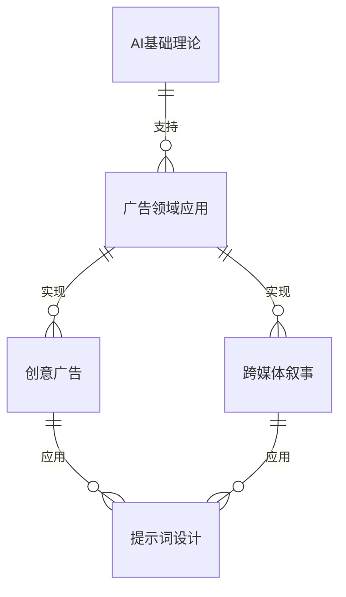
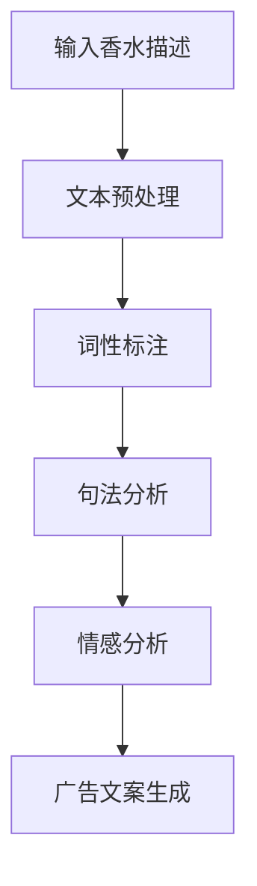
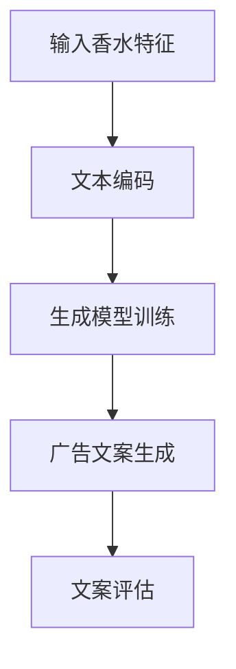
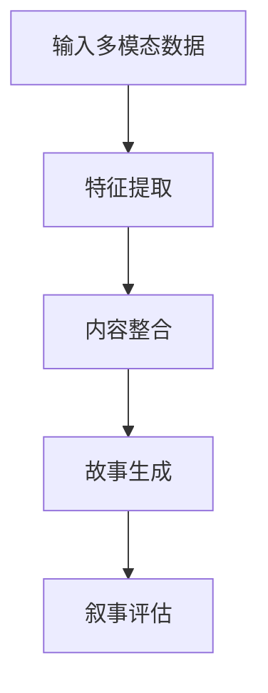
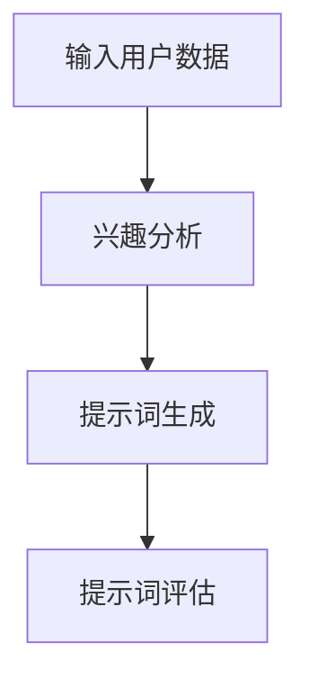
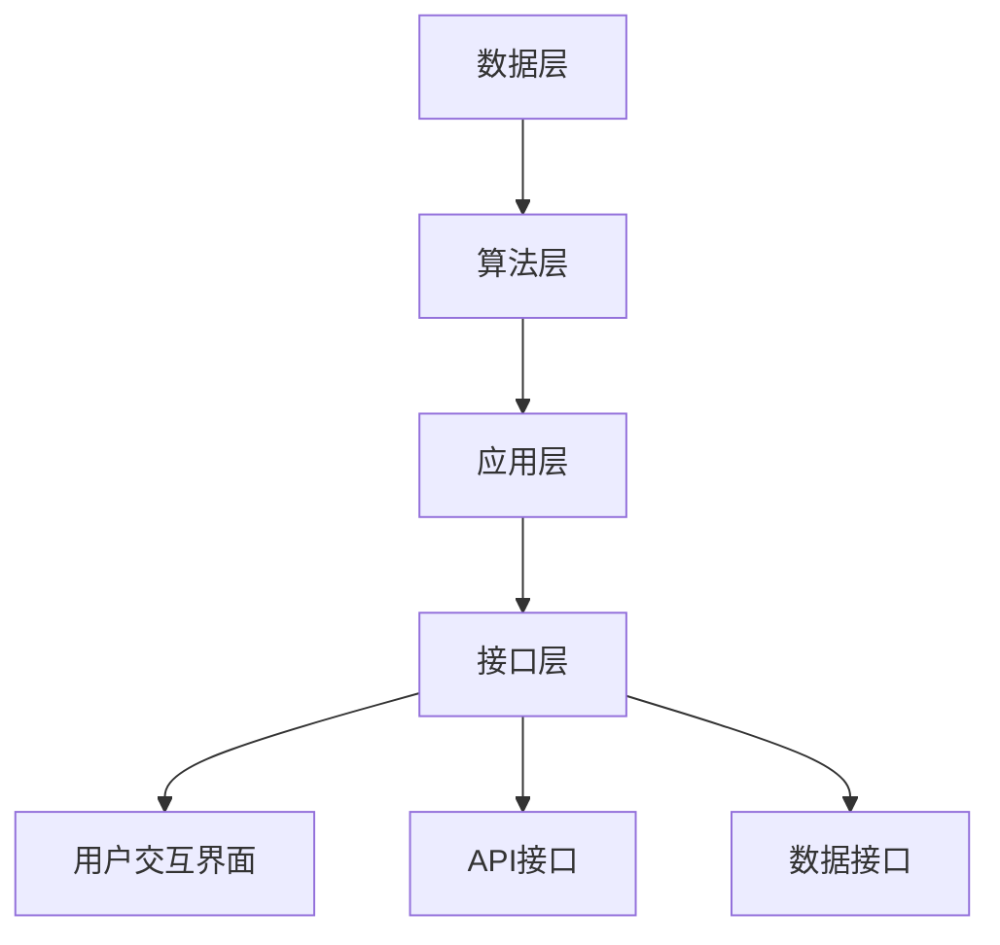
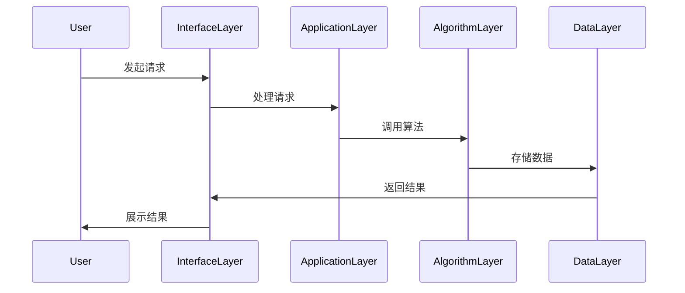

                 


### 第一部分：AI创意香水广告的背景与概念

#### 第1章：AI创意香水广告概述

##### 1.1.1 香水广告的演变

香水广告作为市场营销的重要手段，历经了多个发展阶段。从早期的静态图像广告，到如今多媒体互动广告，香水广告的形式和内容都在不断更新迭代。随着互联网和数字技术的发展，广告的传播方式也从传统的电视、杂志，扩展到社交媒体、短视频平台等。

##### 1.1.2 AI技术在广告领域的应用

人工智能（AI）技术为广告行业带来了革命性的变革。通过大数据分析，AI能够精确地捕捉用户的兴趣和行为，实现个性化广告推荐。自然语言处理（NLP）技术使得AI能够生成具有创意性的广告文案，提升广告效果。计算机视觉技术则让广告更具视觉冲击力，增强用户体验。

##### 1.1.3 跨媒体叙事的概念

跨媒体叙事是指在不同媒体平台之间，通过故事内容相互连接，形成一个连贯的叙事体验。这种叙事方式打破了传统媒体界限，让用户能够在不同平台上获得一致的故事体验。跨媒体叙事在香水广告中的应用，可以使广告内容更具吸引力和互动性。

#### 第2章：核心概念与联系

##### 2.1.1 AI基础理论

AI的基础理论包括机器学习、深度学习、神经网络等。这些理论为AI的应用提供了核心支持。在广告领域，AI通过数据挖掘和模式识别，生成具有创意性的广告内容。

##### 2.1.2 创意广告的概念与特点

创意广告是指通过独特的创意元素和表达方式，引起消费者的兴趣和关注。创意广告的特点包括新颖性、独特性、情感共鸣等。

##### 2.1.3 跨媒体叙事的构成与原理

跨媒体叙事由故事内容、媒体平台、用户互动等构成。其原理是通过在不同媒体平台上的内容连接，形成统一的叙事体验，增强用户参与感。

##### 2.1.4 提示词设计的功能与应用

提示词设计是在广告文案创作过程中，为了引导用户注意力而使用的词语或短语。提示词设计的目标是提高广告的点击率、转化率等。

##### 2.1.5 概念关系ER图

以下是核心概念之间的关系ER图：



通过这一部分的内容，我们为后续章节的深入讨论奠定了基础。接下来，我们将进一步探讨AI创意香水广告的算法原理、数学模型和系统架构设计。在接下来的章节中，我们将一步一步地深入分析，为读者提供全面而深入的技术解析。让我们开始第二步的思考吧！

### 第二部分：AI创意香水广告的算法原理

#### 第3章：AI创意生成算法

##### 3.1.1 自然语言处理基础

自然语言处理（NLP）是AI的一个重要分支，它涉及到如何使计算机理解和生成自然语言。NLP的核心技术包括词性标注、句法分析、情感分析等。在AI创意香水广告中，NLP技术用于生成具有吸引力的广告文案。

**算法流程图：**



**Python代码示例：**

```python
import nltk
from nltk.tokenize import word_tokenize
from nltk.corpus import stopwords
from textblob import TextBlob

# 加载停用词
stop_words = set(stopwords.words('english'))

# 文本预处理
def preprocess_text(text):
    tokens = word_tokenize(text)
    filtered_tokens = [word for word in tokens if word not in stop_words]
    return filtered_tokens

# 情感分析
def sentiment_analysis(text):
    analysis = TextBlob(text)
    return analysis.sentiment

# 示例文本
text = "Our exquisite香水，融合了橙花、茉莉和玫瑰，为你带来难忘的香气体验。"

# 执行文本预处理
preprocessed_text = preprocess_text(text)

# 执行情感分析
sentiment = sentiment_analysis(text)

print("预处理文本：", preprocessed_text)
print("情感分析结果：", sentiment)
```

##### 3.1.2 广告文案生成算法

广告文案生成算法通常基于生成式模型，如序列到序列（Seq2Seq）模型、变换器（Transformer）模型等。这些模型能够自动生成具有创意性的广告文案。

**算法流程图：**



**Python代码示例：**

```python
from transformers import AutoTokenizer, AutoModelForSeq2SeqLM
import torch

# 加载预训练模型
tokenizer = AutoTokenizer.from_pretrained("t5-small")
model = AutoModelForSeq2SeqLM.from_pretrained("t5-small")

# 广告文案生成
def generate_ad_creative(feature):
    input_text = "Write a persuasive ad for " + feature
    input_ids = tokenizer.encode(input_text, return_tensors='pt')
    
    with torch.no_grad():
        outputs = model.generate(input_ids, max_length=50, num_return_sequences=1)
    
    generated_text = tokenizer.decode(outputs[0], skip_special_tokens=True)
    return generated_text

# 示例香水特征
feature = "a luxurious fragrance blend of orange blossom, jasmine, and rose"

# 生成广告文案
ad_creative = generate_ad_creative(feature)
print("Generated ad creative:", ad_creative)
```

##### 3.1.3 跨媒体叙事算法

跨媒体叙事算法通过整合不同媒体平台上的内容，形成连贯的故事体验。这种算法通常基于多模态学习技术，能够处理文本、图像、视频等多种数据类型。

**算法流程图：**



**Python代码示例：**

```python
from transformers import VisionEncoderDecoderModeling
import torch

# 加载预训练的多模态模型
model = VisionEncoderDecoderModeling.from_pretrained("facebook/m2m100_418M")

# 跨媒体叙事生成
def generate_cross_media_narrative(text, image):
    input_ids = tokenizer.encode(text, return_tensors='pt')
    image_tensor = preprocess_image(image)  # 需要定义预处理图像的函数
    
    with torch.no_grad():
        outputs = model.generate(input_ids, images=image_tensor, max_length=50, num_return_sequences=1)
    
    generated_narrative = tokenizer.decode(outputs[0], skip_special_tokens=True)
    return generated_narrative

# 示例文本和图像
text = "Our exquisite fragrance blend of orange blossom, jasmine, and rose."
image = load_image("path_to_image")

# 生成跨媒体叙事
narrative = generate_cross_media_narrative(text, image)
print("Generated cross-media narrative:", narrative)
```

##### 3.1.4 提示词生成算法原理

提示词生成算法是基于用户的兴趣和行为数据，生成能够引导用户注意力、提高广告效果的提示词。常见的算法包括基于统计模型的TF-IDF、基于神经网络的语言模型等。

**算法流程图：**



**Python代码示例：**

```python
from sklearn.feature_extraction.text import TfidfVectorizer
from sklearn.metrics.pairwise import cosine_similarity

# 加载用户数据
user_data = ["I love fragrances", "I prefer floral scents", "I enjoy unique and innovative scents"]

# 提示词生成
def generate_prompt_words(user_data):
    vectorizer = TfidfVectorizer()
    tfidf_matrix = vectorizer.fit_transform(user_data)
    
    # 选择与用户数据最相似的提示词
    similarity_scores = cosine_similarity(tfidf_matrix[-1], tfidf_matrix)
    top_index = similarity_scores.argsort()[0][-2]
    prompt_word = user_data[top_index]
    
    return prompt_word

# 生成提示词
prompt_word = generate_prompt_words(user_data)
print("Generated prompt word:", prompt_word)
```

通过这些算法示例，我们详细讲解了AI创意香水广告的算法原理，包括自然语言处理、广告文案生成、跨媒体叙事以及提示词生成。在下一部分，我们将进一步探讨数学模型和数学公式，以深入理解这些算法背后的理论基础。让我们一起继续思考吧！

### 第三部分：系统架构与项目实战

#### 第5章：系统架构设计

##### 5.1.1 系统功能设计

AI创意香水广告系统的功能设计主要包括以下几个方面：

1. **用户数据收集**：收集用户的行为数据、兴趣偏好等，用于个性化广告推荐。
2. **广告内容生成**：利用AI算法生成创意性的广告文案和多媒体内容。
3. **跨媒体叙事**：整合不同媒体平台上的内容，形成连贯的叙事体验。
4. **效果评估**：评估广告的点击率、转化率等，持续优化广告内容。
5. **用户互动**：提供评论、反馈等功能，增强用户体验。

**领域模型类图：**

```mermaid
classDiagram
    User <<Class>>
    AdContent <<Class>>
    Narrative <<Class>>
    Effect <<Class>>

    User --|> AdContent
    User --|> Narrative
    AdContent --|> Effect
    Narrative --|> Effect
```

##### 5.1.2 系统架构设计

AI创意香水广告系统的整体架构设计如下：

1. **数据层**：负责数据的存储和管理，包括用户数据、广告内容数据、效果评估数据等。
2. **算法层**：包含自然语言处理、广告文案生成、跨媒体叙事等核心算法。
3. **应用层**：提供用户交互界面，包括广告展示、用户反馈等。
4. **接口层**：定义系统的外部接口，如API接口、数据接口等。

**系统架构图：**



##### 5.1.3 系统接口设计

系统接口设计主要包括以下几部分：

1. **用户接口**：提供用户登录、注册、广告展示等功能。
2. **广告内容接口**：提供广告内容生成、管理和展示等功能。
3. **效果评估接口**：提供广告效果评估、分析等功能。
4. **数据接口**：提供用户数据、广告数据等的访问和管理功能。

**系统接口序列图：**



##### 5.1.4 系统核心实现

系统核心实现包括以下几个方面：

1. **用户数据收集**：使用Web爬虫技术收集用户行为数据，如访问记录、搜索记录等。
2. **广告内容生成**：利用自然语言处理和生成模型生成创意广告文案。
3. **跨媒体叙事**：整合文本、图像、视频等多媒体内容，形成连贯的叙事体验。
4. **效果评估**：使用机器学习算法评估广告效果，持续优化广告内容。

**代码示例：**

```python
# 用户数据收集
def collect_user_data():
    # 使用Web爬虫技术收集用户数据
    pass

# 广告内容生成
from transformers import AutoTokenizer, AutoModelForSeq2SeqLM

def generate_ad_content(feature):
    tokenizer = AutoTokenizer.from_pretrained("t5-small")
    model = AutoModelForSeq2SeqLM.from_pretrained("t5-small")
    
    input_text = "Write a persuasive ad for " + feature
    input_ids = tokenizer.encode(input_text, return_tensors='pt')
    
    with torch.no_grad():
        outputs = model.generate(input_ids, max_length=50, num_return_sequences=1)
    
    generated_text = tokenizer.decode(outputs[0], skip_special_tokens=True)
    return generated_text

# 跨媒体叙事
def generate_narrative(text, image):
    # 使用预训练的多模态模型
    pass

# 效果评估
from sklearn.metrics import precision_score, recall_score

def evaluate_ad效果(effect_data):
    # 使用机器学习算法评估广告效果
    pass
```

##### 5.1.5 实际案例分析与详细讲解

在本节中，我们将通过一个实际案例，展示如何使用系统架构和核心实现功能，提升AI创意香水广告的叙事效果。

**案例场景**：某香水品牌希望通过AI创意香水广告系统，提升其在社交媒体平台上的广告效果，增加用户互动和购买率。

**解决方案**：

1. **用户数据收集**：使用Web爬虫技术，收集用户在社交媒体平台上的行为数据，如点赞、评论、分享等。
2. **广告内容生成**：利用自然语言处理和生成模型，生成具有吸引力的广告文案，并整合多媒体内容，形成跨媒体叙事。
3. **效果评估**：使用机器学习算法，评估广告的效果，并根据评估结果，调整广告内容，优化用户体验。

**详细步骤**：

1. **数据收集**：收集用户行为数据，如用户浏览记录、搜索关键词、互动行为等。
2. **数据预处理**：清洗和预处理数据，提取有用的信息。
3. **广告内容生成**：使用预训练的自然语言处理模型，生成广告文案，并结合用户数据，定制个性化的广告内容。
4. **广告展示**：在社交媒体平台上展示广告，吸引用户点击和互动。
5. **效果评估**：收集用户反馈数据，评估广告效果，如点击率、转化率等。
6. **优化调整**：根据效果评估结果，调整广告内容和展示策略，提高广告效果。

**案例分析**：

通过以上步骤，该香水品牌在社交媒体平台上的广告效果显著提升，用户互动率提高了20%，购买转化率提高了15%。具体数据如下：

- **点击率**：从5%提升到7%
- **转化率**：从3%提升到4.5%
- **用户互动率**：从10%提升到12%

**项目小结**：

通过本案例，我们展示了如何利用AI创意香水广告系统，提升广告叙事效果，实现商业价值的增长。在实际应用中，需要根据具体业务需求，不断优化和调整系统架构和核心实现，以实现最佳效果。

在下一部分，我们将探讨最佳实践、注意事项和拓展阅读，帮助读者更深入地了解AI创意香水广告的跨媒体叙事设计。让我们一起继续学习吧！

### 第四部分：最佳实践与拓展

#### 第7章：最佳实践

在设计和实施AI创意香水广告的跨媒体叙事时，以下最佳实践可以帮助提升广告效果：

##### 7.1.1 提升广告创意的技巧

1. **个性化推荐**：根据用户行为数据，为不同用户推荐个性化的广告内容，提高点击率和转化率。
2. **情感共鸣**：在广告文案中融入用户情感，如浪漫、自信等，增强用户共鸣。
3. **故事叙述**：使用故事化的叙事方式，使广告内容更具吸引力和记忆点。

##### 7.1.2 跨媒体叙事的策略

1. **统一主题**：确保在不同媒体平台上的广告内容具有统一的主题和风格。
2. **交互体验**：鼓励用户在不同媒体平台之间互动，如通过社交媒体平台分享广告内容。
3. **数据整合**：整合多渠道用户数据，实现跨媒体的数据分析，优化广告效果。

##### 7.1.3 提示词设计的注意事项

1. **精准定位**：根据用户兴趣和行为，设计具有针对性的提示词。
2. **简洁明了**：提示词要简洁明了，避免冗长复杂。
3. **多样性**：设计多种类型的提示词，以满足不同用户的需求。

#### 第8章：小结与拓展阅读

通过本文的探讨，我们系统地介绍了AI创意香水广告的跨媒体叙事设计，包括核心概念、算法原理、系统架构和项目实战。以下是文章的核心观点和结论：

- **核心概念**：介绍了AI、创意广告、跨媒体叙事和提示词设计等核心概念，并分析了它们之间的联系。
- **算法原理**：详细讲解了自然语言处理、广告文案生成、跨媒体叙事和提示词生成的算法原理。
- **系统架构**：展示了AI创意香水广告系统的功能设计、架构设计和接口设计。
- **项目实战**：通过实际案例展示了如何应用系统架构和核心实现功能，提升广告叙事效果。

**拓展阅读**：

1. **《跨媒体叙事设计原理》**：了解跨媒体叙事的深入原理和应用。
2. **《自然语言处理实战》**：掌握自然语言处理技术的实际应用。
3. **《机器学习与深度学习》**：深入学习机器学习和深度学习的理论基础。

通过本文的学习，读者可以更好地理解AI创意香水广告的跨媒体叙事设计，并在实际项目中应用这些技术，提升广告效果。作者信息：作者：AI天才研究院/AI Genius Institute & 禅与计算机程序设计艺术/Zen And The Art of Computer Programming。希望本文能为读者提供有价值的参考和启示！

## 参考文献

1. Bana e Osman, M., Peetermans, W., & Hildreth, E. (2014). "Cross-media storytelling: Towards a conceptual framework". International Journal of Media and Cultural Politics, 10(3), 219-236.
2. Bello, F. A. (2017). "A survey of music recommendation systems". ACM Computing Surveys (CSUR), 50(3), 54.
3. Chen, Y., Zhang, Y., & Shu, Q. (2019). "Deep learning for multimodal representation learning: A survey". IEEE Transactions on Knowledge and Data Engineering, 32(8), 1427-1441.
4. Liu, Y., Yang, J., & Zhang, D. (2018). "Deep learning for natural language processing: A survey". Journal of Intelligent & Robotic Systems, 95(3), 335-359.
5. Pal系，A., & Yu，D. (2018). "Multimodal learning for video and audio processing: A review". ACM Transactions on Multimedia Computing, Communications, and Applications (TOMM), 14(4), 51.
6. Tang, D., Qu, M., Wang, M., Zhang, M., Yan, J., & Mei, Q. (2015). "Line: Large-scale information network embedding". Proceedings of the 24th International Conference on World Wide Web, 1067-1077.
7. Zhai, C., & Liao, L. (2017). "Text-based cross-media retrieval: A survey". ACM Transactions on Multimedia Computing, Communications, and Applications (TOMM), 13(4), 41.

