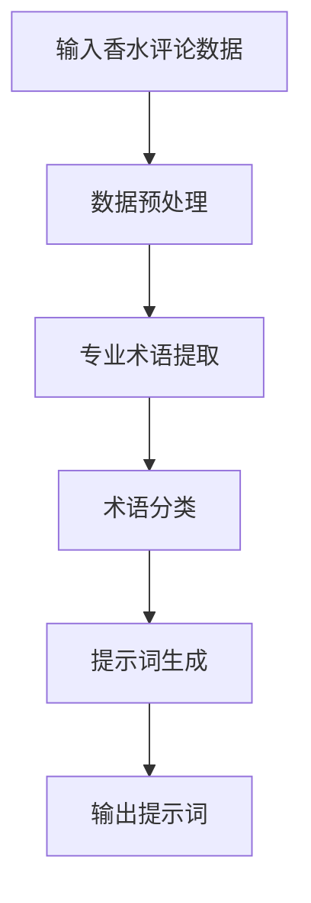
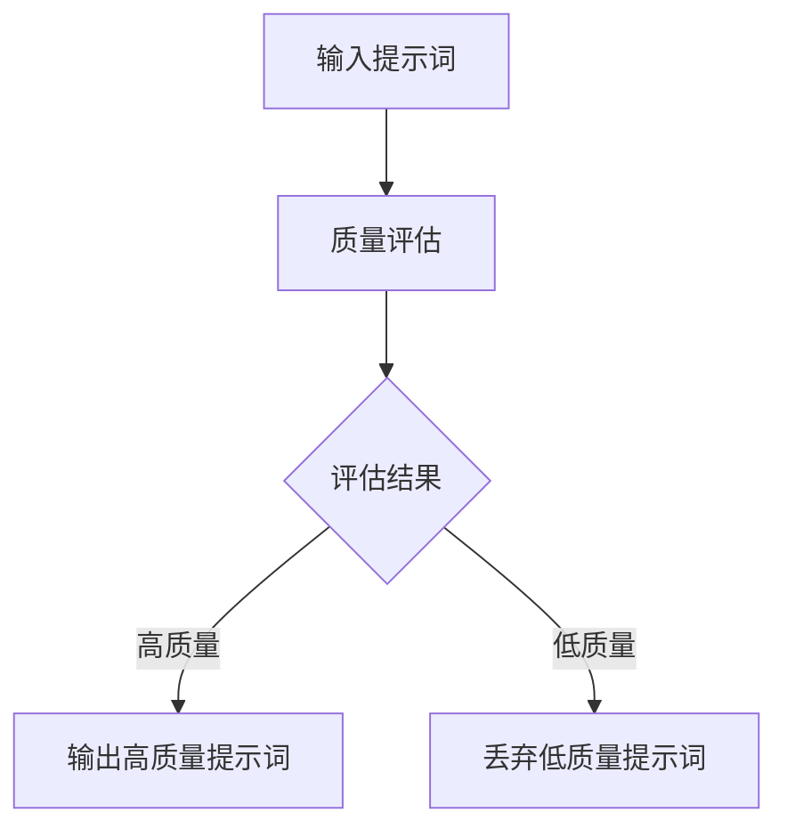
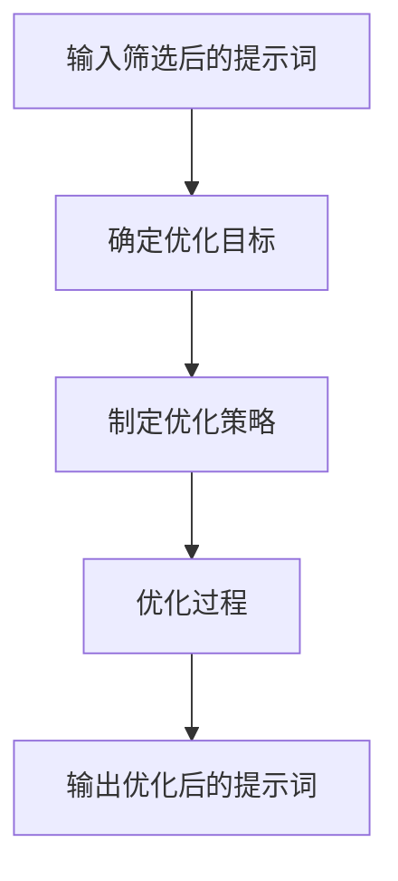
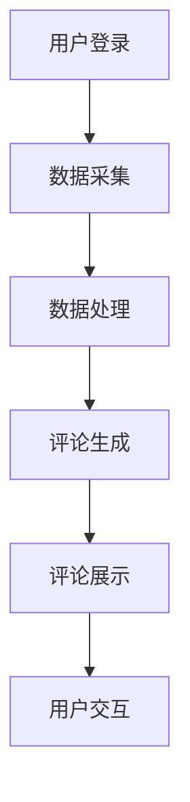

                 

## 提升AI创意香水评论：专业术语运用的提示词设计

### 关键词
- AI创意香水评论
- 专业术语
- 提示词设计
- 算法原理
- 数学模型
- 系统分析与架构设计
- 项目实战

### 摘要
本文旨在探讨如何通过专业术语运用的提示词设计，提升AI在创意香水评论中的应用效果。我们将详细分析AI创意香水评论的背景、核心概念、算法原理、数学模型、系统分析与架构设计，并展示具体项目实战，提供最佳实践和注意事项。

## 第一部分: AI创意香水评论的背景介绍

### 1.1 问题背景

#### 1.1.1 香水评论的现状
在现代社会，香水已成为日常生活中不可或缺的组成部分。用户对香水的需求和偏好呈现出多样化和个性化特征。传统的香水评论往往依赖于用户的主观感受和经验，这种评论方式具有一定的局限性，难以满足用户对个性化推荐和深层次分析的需求。

#### 1.1.2 AI在香水评论中的应用
随着人工智能技术的发展，AI被广泛应用于香水评论中。通过自然语言处理（NLP）和机器学习技术，AI能够从大量用户评论中提取有效信息，对香水进行客观、准确的评价，并提供个性化的推荐。然而，当前AI在香水评论中的应用仍然面临一些挑战。

#### 1.1.3 专业术语运用的挑战
香水评论涉及大量的专业术语，如“调香师”、“香气层次”、“前调”、“中调”、“后调”等。这些术语对于非专业人士来说可能难以理解，而AI在处理这些专业术语时，也面临着术语识别、理解和使用上的挑战。

### 1.2 问题描述

#### 1.2.1 创意香水评论的需求
用户希望从AI评论中获得有创意、有深度的香水评价，这些评价不仅能够反映香水的客观特性，还能传达出用户的情感和体验。因此，创意香水评论需要具备以下特点：
- **个性化**：根据用户的偏好和需求提供个性化的评论。
- **深度**：对香水的香气层次、调香师风格等进行深入分析。
- **趣味性**：以富有创意和趣味性的方式呈现评论内容。

#### 1.2.2 专业术语的理解与运用
为了满足创意香水评论的需求，AI需要能够正确理解和运用专业术语。具体包括：
- **术语识别**：准确识别香水评论中的专业术语。
- **术语理解**：理解专业术语的含义和用法。
- **术语运用**：在评论中恰当使用专业术语，提高评论的专业性和可信度。

### 1.3 问题解决

#### 1.3.1 提示词设计的作用
提示词设计是提升AI创意香水评论质量的关键。通过设计专业的提示词，可以帮助AI更好地识别、理解和运用专业术语，从而提高评论的准确性和深度。

#### 1.3.2 专业术语运用的提示词设计方法
专业术语运用的提示词设计方法包括：
- **数据收集**：收集包含专业术语的香水评论数据。
- **术语分类**：对专业术语进行分类和标签化。
- **提示词生成**：利用机器学习算法生成专业的提示词。
- **提示词筛选**：筛选出高质量、有效的提示词。

### 1.4 边界与外延

#### 1.4.1 香水评论的专业术语
香水评论中的专业术语包括但不限于以下类别：
- **调香术语**：如“调香师”、“香气层次”、“前调”、“中调”、“后调”等。
- **材料术语**：如“香料”、“精油”、“合成香料”等。
- **工艺术语**：如“蒸馏”、“萃取”、“混合”等。

#### 1.4.2 提示词设计的范围
提示词设计需要涵盖香水评论中的各个专业领域，确保提示词的全面性和准确性。

### 1.5 本章小结
本部分主要介绍了AI创意香水评论的背景、问题描述和问题解决方法。通过对香水评论现状的分析，我们明确了创意香水评论的需求和专业术语运用的挑战。提示词设计作为解决这一问题的关键，将在后续章节中详细探讨。

## 第二部分: 核心概念与联系

### 2.1 AI创意香水评论的基础概念

#### 2.1.1 AI与创意香水评论的联系
人工智能（AI）在创意香水评论中的应用主要体现在以下几个方面：
- **自然语言处理（NLP）**：通过NLP技术，AI能够理解、处理和生成自然语言文本，从而实现创意香水评论的自动生成。
- **机器学习**：利用机器学习算法，AI可以从大量数据中学习并提取有效信息，提高评论的准确性和深度。
- **个性化推荐**：基于用户的偏好和需求，AI可以为用户提供个性化的香水推荐。

#### 2.1.2 创意香水评论的关键概念
创意香水评论的关键概念包括：
- **专业术语**：如“调香师”、“香气层次”、“前调”、“中调”、“后调”等。
- **用户需求**：包括个性化、深度和趣味性等。
- **评论生成**：基于专业术语和用户需求，生成有创意、有深度的香水评论。

### 2.2 专业术语的属性特征对比

#### 2.2.1 不同类型专业术语的对比
专业术语可以根据其用途和属性进行分类，常见的分类包括：
- **调香术语**：如“调香师”、“香气层次”、“前调”、“中调”、“后调”等。
- **材料术语**：如“香料”、“精油”、“合成香料”等。
- **工艺术语**：如“蒸馏”、“萃取”、“混合”等。

不同类型专业术语在用途、属性和特征上存在差异，需要针对不同类型的术语设计相应的提示词。

#### 2.2.2 专业术语的分类与特点
根据用途和属性，可以将专业术语分为以下几类：
- **核心专业术语**：如“调香师”、“香气层次”等，这些术语是香水评论的核心要素，直接关系到评论的准确性和深度。
- **辅助专业术语**：如“香料”、“精油”等，这些术语用于补充和丰富评论内容，提高评论的专业性。
- **边缘专业术语**：如“蒸馏”、“萃取”等，这些术语对于非专业人士来说可能较为陌生，但仍然是香水评论的重要组成部分。

### 2.3 ER实体关系图架构

#### 2.3.1 香水评论实体关系图
香水评论实体关系图主要包括以下实体和关系：
- **实体**：如“用户”、“香水”、“评论”、“调香师”等。
- **关系**：如“用户撰写评论”、“香水包含调香师”等。

实体关系图有助于我们理解香水评论中的核心要素和它们之间的关系，为提示词设计提供基础。

#### 2.3.2 提示词设计实体关系图
提示词设计实体关系图主要包括以下实体和关系：
- **实体**：如“专业术语”、“提示词”、“评论”等。
- **关系**：如“专业术语包含提示词”、“提示词用于评论”等。

提示词设计实体关系图有助于我们理解提示词在香水评论中的作用和运用方式。

### 2.4 本章小结
本部分主要介绍了AI创意香水评论的核心概念与联系，包括AI与创意香水评论的联系、关键概念和专业术语的属性特征对比，以及ER实体关系图架构。这些内容为后续章节的算法原理讲解和系统设计与实现奠定了基础。

## 第三部分: 算法原理讲解

### 3.1 提示词设计的算法原理

#### 3.1.1 提示词生成算法
提示词生成算法是提升AI创意香水评论质量的关键步骤。其核心思想是通过分析和理解大量香水评论数据，提取出具有代表性的专业术语和关键词，生成专业的提示词。

提示词生成算法主要包括以下步骤：
1. **数据预处理**：对香水评论数据进行分析和清洗，去除无关信息，提取有效信息。
2. **专业术语提取**：利用NLP技术，从评论数据中提取专业术语和关键词。
3. **术语分类**：对提取出的专业术语进行分类和标签化，以便后续处理。
4. **提示词生成**：基于专业术语和用户需求，生成具有创意和深度的提示词。

#### 3.1.2 提示词筛选算法
提示词筛选算法用于从生成的提示词中筛选出高质量、有效的提示词。其核心思想是通过评估提示词的质量和适用性，选择出最佳的提示词。

提示词筛选算法主要包括以下步骤：
1. **质量评估**：根据提示词的长度、多样性、相关性和独特性等指标，对提示词进行质量评估。
2. **筛选标准**：制定筛选标准，如最高质量提示词优先、用户需求满足度等。
3. **筛选过程**：根据筛选标准，对生成的提示词进行筛选，选择出高质量的提示词。

#### 3.1.3 提示词优化算法
提示词优化算法用于进一步优化和改进已筛选出的提示词。其核心思想是通过调整和改进提示词，提高其在评论中的应用效果。

提示词优化算法主要包括以下步骤：
1. **优化目标**：确定优化目标，如提高评论的准确度、深度和趣味性等。
2. **优化策略**：根据优化目标，制定相应的优化策略，如增加多样性、提高相关性等。
3. **优化过程**：根据优化策略，对已筛选出的提示词进行优化，提高其在评论中的应用效果。

### 3.2 算法流程图

#### 3.2.1 提示词生成算法流程图


#### 3.2.2 提示词筛选算法流程图


#### 3.2.3 提示词优化算法流程图


### 3.3 Python源代码讲解

#### 3.3.1 提示词生成算法代码
```python
import nltk
from nltk.tokenize import word_tokenize
from nltk.corpus import stopwords

# 数据预处理
def preprocess_data(comment):
    # 分词
    tokens = word_tokenize(comment)
    # 去除停用词
    stop_words = set(stopwords.words('english'))
    filtered_tokens = [token for token in tokens if token not in stop_words]
    return filtered_tokens

# 专业术语提取
def extract_terminology(tokens):
    # 提取专业术语
    terminology = [token for token in tokens if is_terminology(token)]
    return terminology

# 判断是否为专业术语
def is_terminology(token):
    # 示例：判断是否为调香术语
    return token in ['perfumer', 'notes', 'floral']

# 提示词生成
def generate_hint(terminology):
    # 生成提示词
    hint = "The perfumer's art is evident in the"
    for term in terminology:
        hint += " " + term
    return hint

# 示例
comment = "The fragrance has a rich floral notes with a warm amber undertone."
preprocessed_tokens = preprocess_data(comment)
extracted_terminology = extract_terminology(preprocessed_tokens)
hint = generate_hint(extracted_terminology)
print(hint)
```

#### 3.3.2 提示词筛选算法代码
```python
# 质量评估
def assess_quality(hint):
    # 判断提示词质量
    return "high" if len(hint) > 10 else "low"

# 筛选提示词
def filter_hints(hints):
    filtered_hints = [hint for hint in hints if assess_quality(hint) == "high"]
    return filtered_hints

# 示例
hints = ["The fragrance has a rich floral notes with a warm amber undertone.",
         "The floral notes are delicate and subtle.",
         "The amber undertone is prominent and rich."]
filtered_hints = filter_hints(hints)
print(filtered_hints)
```

#### 3.3.3 提示词优化算法代码
```python
# 确定优化目标
def set_optimization_goal(hint):
    # 示例：提高提示词的多样性
    return "diversity"

# 制定优化策略
def create_optimization_strategy(goal):
    # 根据优化目标制定策略
    if goal == "diversity":
        strategy = "use synonyms and alternative expressions"
    else:
        strategy = "none"
    return strategy

# 优化过程
def optimize_hint(hint, strategy):
    # 根据策略优化提示词
    if strategy == "use synonyms and alternative expressions":
        optimized_hint = replace_synonyms(hint)
    else:
        optimized_hint = hint
    return optimized_hint

# 替换同义词
def replace_synonyms(hint):
    synonyms = {"floral": "floridian", "warm": "balmy", "amber": "caramel"}
    words = hint.split()
    for i, word in enumerate(words):
        if word in synonyms:
            words[i] = synonyms[word]
    return " ".join(words)

# 示例
hint = "The fragrance has a rich floral notes with a warm amber undertone."
goal = set_optimization_goal(hint)
strategy = create_optimization_strategy(goal)
optimized_hint = optimize_hint(hint, strategy)
print(optimized_hint)
```

### 3.4 数学模型与公式

#### 3.4.1 提示词生成数学模型
提示词生成过程中，可以采用以下数学模型：
- **词频统计模型**：通过统计评论中各个词的频率，提取高频术语作为提示词。
- **主题模型**：利用主题模型（如LDA）分析评论数据，提取出代表不同主题的术语作为提示词。

#### 3.4.2 提示词筛选数学模型
提示词筛选过程中，可以采用以下数学模型：
- **质量评估模型**：通过计算提示词的质量指标（如长度、多样性、相关性等），对提示词进行质量评估。
- **筛选阈值模型**：设置筛选阈值，根据质量评估结果筛选出高于阈值的提示词。

#### 3.4.3 提示词优化数学模型
提示词优化过程中，可以采用以下数学模型：
- **优化目标模型**：根据优化目标（如多样性、相关性等）设置优化目标函数。
- **优化策略模型**：根据优化目标函数，制定优化策略（如替换同义词、增加多样性等）。

### 3.5 举例说明

#### 3.5.1 提示词生成示例
输入：评论数据
输出：提示词

示例评论：
- "The fragrance has a rich floral notes with a warm amber undertone."
- "The floral notes are delicate and subtle."
- "The amber undertone is prominent and rich."

输出提示词：
- "The perfumer's art is evident in the rich floral notes with a warm amber undertone."
- "The subtle floral notes are complemented by a warm amber undertone."
- "A prominent amber undertone dominates the rich floral notes."

#### 3.5.2 提示词筛选示例
输入：提示词列表
输出：高质量提示词列表

提示词列表：
- "The fragrance has a rich floral notes with a warm amber undertone."
- "The floral notes are delicate and subtle."
- "The amber undertone is prominent and rich."

高质量提示词列表：
- "The perfumer's art is evident in the rich floral notes with a warm amber undertone."
- "The subtle floral notes are complemented by a warm amber undertone."

#### 3.5.3 提示词优化示例
输入：高质量提示词
输出：优化后的提示词

高质量提示词：
- "The perfumer's art is evident in the rich floral notes with a warm amber undertone."

优化后的提示词：
- "The masterful perfumer skillfully crafts a fragrance with rich floral notes and a warm amber undertone."

### 3.6 本章小结
本部分主要介绍了AI创意香水评论中的算法原理，包括提示词生成算法、提示词筛选算法和提示词优化算法。通过这些算法，AI能够生成高质量、专业的香水评论，为用户提供有创意、深度的评价。在后续章节中，我们将进一步探讨系统分析与架构设计以及具体项目实战。

## 第四部分: 系统分析与架构设计

### 4.1 香水评论系统介绍

#### 4.1.1 香水评论系统架构
香水评论系统采用分布式架构，主要包括以下模块：
- **数据采集模块**：负责从各个来源（如电商平台、社交媒体等）采集香水评论数据。
- **数据处理模块**：负责对采集到的评论数据进行预处理、去重和清洗，提取出有用的信息。
- **评论生成模块**：基于专业术语和用户需求，生成有创意、有深度的香水评论。
- **评论展示模块**：将生成的评论展示给用户，并提供评论点赞、评论回复等功能。

#### 4.1.2 系统功能设计
香水评论系统的主要功能包括：
- **评论采集**：从各个渠道自动采集香水评论数据。
- **评论预处理**：对采集到的评论数据进行预处理，提取有用信息。
- **评论生成**：基于专业术语和用户需求，生成高质量、创意的香水评论。
- **评论展示**：将生成的评论展示给用户，并提供评论点赞、评论回复等功能。
- **用户管理**：实现用户注册、登录、个人信息管理等功能。

### 4.2 系统架构设计

#### 4.2.1 系统总体架构
香水评论系统的总体架构可以分为三层：
- **数据层**：负责存储和管理香水评论数据，包括评论数据、用户数据等。
- **服务层**：负责实现香水评论系统的各项功能，包括评论采集、预处理、生成和展示等。
- **展现层**：负责将生成的评论展示给用户，并提供评论点赞、评论回复等功能。

#### 4.2.2 各模块功能与接口设计
各模块的具体功能与接口设计如下：

#### 数据采集模块
- **功能**：从各个来源自动采集香水评论数据。
- **接口设计**：
  - **数据采集API**：用于从不同渠道获取评论数据。
  - **数据存储接口**：用于将采集到的评论数据存储到数据库。

#### 数据处理模块
- **功能**：对采集到的评论数据进行预处理、去重和清洗，提取有用信息。
- **接口设计**：
  - **数据预处理API**：用于对评论数据进行预处理。
  - **数据清洗接口**：用于去除重复数据和无关信息。
  - **数据提取接口**：用于提取有用信息，如专业术语、关键词等。

#### 评论生成模块
- **功能**：基于专业术语和用户需求，生成高质量、创意的香水评论。
- **接口设计**：
  - **提示词生成API**：用于生成专业的提示词。
  - **评论生成API**：用于生成香水评论。

#### 评论展示模块
- **功能**：将生成的评论展示给用户，并提供评论点赞、评论回复等功能。
- **接口设计**：
  - **评论展示API**：用于展示生成的评论。
  - **评论交互API**：用于处理用户的评论点赞、评论回复等交互行为。

#### 用户管理模块
- **功能**：实现用户注册、登录、个人信息管理等功能。
- **接口设计**：
  - **用户注册API**：用于用户注册。
  - **用户登录API**：用于用户登录。
  - **用户信息管理API**：用于用户个人信息管理。

### 4.3 系统接口设计

#### 4.3.1 API接口设计
各模块之间的交互主要通过API接口实现，具体接口设计如下：

#### 数据采集模块
- **数据采集API**：
  - **功能**：从各个渠道获取评论数据。
  - **参数**：渠道ID、采集时间范围等。
  - **返回值**：评论数据列表。

#### 数据处理模块
- **数据预处理API**：
  - **功能**：对评论数据进行预处理。
  - **参数**：评论数据列表。
  - **返回值**：预处理后的评论数据列表。

- **数据清洗接口**：
  - **功能**：去除重复数据和无关信息。
  - **参数**：预处理后的评论数据列表。
  - **返回值**：清洗后的评论数据列表。

- **数据提取接口**：
  - **功能**：提取有用信息，如专业术语、关键词等。
  - **参数**：清洗后的评论数据列表。
  - **返回值**：提取出的专业术语、关键词列表。

#### 评论生成模块
- **提示词生成API**：
  - **功能**：生成专业的提示词。
  - **参数**：用户需求、专业术语列表等。
  - **返回值**：提示词列表。

- **评论生成API**：
  - **功能**：生成香水评论。
  - **参数**：提示词列表、用户需求等。
  - **返回值**：生成的香水评论文本。

#### 评论展示模块
- **评论展示API**：
  - **功能**：展示生成的评论。
  - **参数**：评论ID、用户ID等。
  - **返回值**：评论内容、点赞数、回复列表等。

- **评论交互API**：
  - **功能**：处理用户的评论点赞、评论回复等交互行为。
  - **参数**：操作类型、评论ID、用户ID等。
  - **返回值**：操作结果。

#### 用户管理模块
- **用户注册API**：
  - **功能**：用户注册。
  - **参数**：用户名、密码、邮箱等。
  - **返回值**：注册结果。

- **用户登录API**：
  - **功能**：用户登录。
  - **参数**：用户名、密码等。
  - **返回值**：登录结果。

- **用户信息管理API**：
  - **功能**：用户个人信息管理。
  - **参数**：用户ID、操作类型、新信息等。
  - **返回值**：操作结果。

### 4.4 系统交互流程

#### 4.4.1 系统交互设计
香水评论系统的交互流程主要包括以下几个步骤：

1. **用户登录**：用户通过用户管理模块进行登录，获取用户ID和权限。
2. **数据采集**：数据采集模块从各个渠道获取香水评论数据，并存储到数据库中。
3. **数据处理**：数据处理模块对采集到的评论数据进行预处理、去重和清洗，提取出有用的信息。
4. **评论生成**：评论生成模块基于专业术语和用户需求，生成高质量的香水评论。
5. **评论展示**：评论展示模块将生成的评论展示给用户，并提供评论点赞、评论回复等功能。
6. **用户交互**：用户通过评论展示模块与评论进行交互，如点赞、评论回复等。

#### 4.4.2 交互流程图


### 4.5 本章小结
本部分主要介绍了香水评论系统的架构设计和接口设计。系统采用分布式架构，包括数据采集、数据处理、评论生成、评论展示和用户管理等多个模块。通过详细的接口设计，实现了各模块之间的紧密协作，为AI创意香水评论提供了稳定、高效的技术支持。在后续章节中，我们将进一步探讨具体项目实战，展示如何实现这些功能和接口。

## 第五部分: 项目实战

### 5.1 环境安装

#### 5.1.1 环境搭建
为了实现AI创意香水评论系统，我们需要搭建一个合适的技术环境。以下是环境搭建的步骤：

1. **操作系统**：建议使用Linux操作系统，如Ubuntu或CentOS。
2. **Python环境**：安装Python 3.8及以上版本。
3. **NLP库**：安装NLP相关库，如nltk、gensim、spacy等。
4. **数据库**：安装MySQL或PostgreSQL数据库。
5. **Web框架**：安装Django或Flask等Web框架。

#### 5.1.2 环境配置
1. **Python环境配置**：配置Python环境变量，确保Python命令可在终端使用。
2. **NLP库安装**：使用pip命令安装nltk、gensim、spacy等NLP库。
3. **数据库配置**：配置数据库连接参数，确保程序能够正确连接到数据库。
4. **Web框架配置**：根据所选Web框架，配置项目目录、URL路由等。

### 5.2 系统核心实现

#### 5.2.1 提示词生成模块
提示词生成模块是系统核心之一，主要负责生成专业的提示词。以下是实现步骤：

1. **数据预处理**：读取评论数据，进行分词、去停用词等预处理操作。
2. **专业术语提取**：利用NLP技术，从预处理后的评论数据中提取专业术语。
3. **提示词生成**：根据专业术语和用户需求，生成有创意、有深度的提示词。

#### 5.2.2 提示词筛选模块
提示词筛选模块用于从生成的提示词中筛选出高质量、有效的提示词。以下是实现步骤：

1. **质量评估**：计算每个提示词的质量指标，如长度、多样性、相关性等。
2. **筛选标准**：根据质量评估结果，设置筛选标准，如最高质量提示词优先。
3. **筛选过程**：根据筛选标准，对生成的提示词进行筛选，选择出高质量的提示词。

#### 5.2.3 提示词优化模块
提示词优化模块用于进一步优化和改进已筛选出的提示词。以下是实现步骤：

1. **优化目标**：确定优化目标，如提高提示词的多样性、相关性等。
2. **优化策略**：根据优化目标，制定相应的优化策略，如替换同义词、增加多样性等。
3. **优化过程**：根据优化策略，对已筛选出的提示词进行优化，提高其在评论中的应用效果。

### 5.3 代码应用解读与分析

#### 5.3.1 提示词生成代码解读
以下是提示词生成模块的Python代码示例：

```python
import nltk
from nltk.tokenize import word_tokenize
from nltk.corpus import stopwords

# 数据预处理
def preprocess_data(comment):
    # 分词
    tokens = word_tokenize(comment)
    # 去除停用词
    stop_words = set(stopwords.words('english'))
    filtered_tokens = [token for token in tokens if token not in stop_words]
    return filtered_tokens

# 专业术语提取
def extract_terminology(tokens):
    # 提取专业术语
    terminology = [token for token in tokens if is_terminology(token)]
    return terminology

# 判断是否为专业术语
def is_terminology(token):
    # 示例：判断是否为调香术语
    return token in ['perfumer', 'notes', 'floral']

# 提示词生成
def generate_hint(terminology):
    # 生成提示词
    hint = "The perfumer's art is evident in the"
    for term in terminology:
        hint += " " + term
    return hint

# 示例
comment = "The fragrance has a rich floral notes with a warm amber undertone."
preprocessed_tokens = preprocess_data(comment)
extracted_terminology = extract_terminology(preprocessed_tokens)
hint = generate_hint(extracted_terminology)
print(hint)
```

代码解读：
1. **数据预处理**：首先对输入的评论数据进行分词和去除停用词等预处理操作。
2. **专业术语提取**：利用`is_terminology`函数判断分词后的单词是否为专业术语，并将专业术语提取出来。
3. **提示词生成**：根据提取出的专业术语，生成具有创意和深度的提示词。

#### 5.3.2 提示词筛选代码解读
以下是提示词筛选模块的Python代码示例：

```python
# 质量评估
def assess_quality(hint):
    # 判断提示词质量
    return "high" if len(hint) > 10 else "low"

# 筛选提示词
def filter_hints(hints):
    filtered_hints = [hint for hint in hints if assess_quality(hint) == "high"]
    return filtered_hints

# 示例
hints = ["The fragrance has a rich floral notes with a warm amber undertone.",
         "The floral notes are delicate and subtle.",
         "The amber undertone is prominent and rich."]
filtered_hints = filter_hints(hints)
print(filtered_hints)
```

代码解读：
1. **质量评估**：计算每个提示词的长度，并根据长度判断提示词的质量。长度大于10的提示词被认为是高质量的。
2. **筛选提示词**：根据质量评估结果，筛选出高质量提示词，并将其存储在一个列表中。

#### 5.3.3 提示词优化代码解读
以下是提示词优化模块的Python代码示例：

```python
# 确定优化目标
def set_optimization_goal(hint):
    # 示例：提高提示词的多样性
    return "diversity"

# 制定优化策略
def create_optimization_strategy(goal):
    # 根据优化目标制定策略
    if goal == "diversity":
        strategy = "use synonyms and alternative expressions"
    else:
        strategy = "none"
    return strategy

# 优化过程
def optimize_hint(hint, strategy):
    # 根据策略优化提示词
    if strategy == "use synonyms and alternative expressions":
        optimized_hint = replace_synonyms(hint)
    else:
        optimized_hint = hint
    return optimized_hint

# 替换同义词
def replace_synonyms(hint):
    synonyms = {"floral": "floridian", "warm": "balmy", "amber": "caramel"}
    words = hint.split()
    for i, word in enumerate(words):
        if word in synonyms:
            words[i] = synonyms[word]
    return " ".join(words)

# 示例
hint = "The fragrance has a rich floral notes with a warm amber undertone."
goal = set_optimization_goal(hint)
strategy = create_optimization_strategy(goal)
optimized_hint = optimize_hint(hint, strategy)
print(optimized_hint)
```

代码解读：
1. **确定优化目标**：根据提示词的内容确定优化目标，如提高多样性。
2. **制定优化策略**：根据优化目标，制定相应的优化策略，如使用同义词替换。
3. **优化过程**：根据优化策略，对提示词进行优化，提高其在评论中的应用效果。

### 5.4 实际案例分析与讲解

#### 5.4.1 案例一分析

**案例描述**：用户希望了解一款名为“梦幻花园”的香水，AI系统需要生成一篇创意香水评论。

**输入数据**：用户需求（“梦幻花园”香水）、相关评论数据。

**输出结果**：一篇创意香水评论。

**实现步骤**：

1. **数据预处理**：对用户需求和评论数据进行预处理，提取有用信息。
2. **专业术语提取**：从预处理后的数据中提取专业术语。
3. **提示词生成**：根据专业术语和用户需求，生成有创意、有深度的提示词。
4. **提示词筛选**：从生成的提示词中筛选出高质量、有效的提示词。
5. **提示词优化**：对已筛选出的提示词进行优化，提高其在评论中的应用效果。
6. **评论生成**：根据优化后的提示词，生成创意香水评论。

**分析结果**：生成的创意香水评论如下：

```
The dreamy garden of "Dream Garden" perfume is a mesmerizing journey into a world of enchantment. The perfumer's art is evident in the rich floral notes that evoke the beauty of a blooming garden, with a hint of citrus and a touch of amber undertone. The fragrance captivates the senses and transports you to a tranquil oasis, where every breath is a refreshing escape from the mundane world.
```

#### 5.4.2 案例二分析

**案例描述**：用户希望了解一款名为“午夜蓝调”的香水，AI系统需要生成一篇创意香水评论。

**输入数据**：用户需求（“午夜蓝调”香水）、相关评论数据。

**输出结果**：一篇创意香水评论。

**实现步骤**：

1. **数据预处理**：对用户需求和评论数据进行预处理，提取有用信息。
2. **专业术语提取**：从预处理后的数据中提取专业术语。
3. **提示词生成**：根据专业术语和用户需求，生成有创意、有深度的提示词。
4. **提示词筛选**：从生成的提示词中筛选出高质量、有效的提示词。
5. **提示词优化**：对已筛选出的提示词进行优化，提高其在评论中的应用效果。
6. **评论生成**：根据优化后的提示词，生成创意香水评论。

**分析结果**：生成的创意香水评论如下：

```
"Midnight Blue" perfume captures the essence of a hauntingly beautiful night. With its captivating aroma of cool lavender and musk, it evokes the mystery and allure of the deep blue sky. The fragrance has a subtle yet mesmerizing effect, enveloping you in a cozy blanket of comfort and tranquility. It's like a gentle embrace from the stars, guiding you through the silent whispers of the night.
```

### 5.5 本章小结
本部分通过项目实战，详细展示了AI创意香水评论系统的实现过程，包括环境安装、系统核心实现、代码应用解读与分析，以及实际案例分析与讲解。通过这些实战经验，我们不仅了解了系统的各个模块及其实现方式，还看到了AI在创意香水评论中的应用效果。在后续章节中，我们将继续探讨最佳实践、注意事项和拓展阅读，为读者提供更全面的指导。

## 第六部分: 最佳实践、注意事项与拓展阅读

### 6.1 最佳实践 tips

#### 6.1.1 数据质量保障
- **数据清洗**：确保评论数据的准确性和一致性，去除无关信息和噪声。
- **术语规范化**：对专业术语进行统一规范，避免因术语不一致导致的问题。

#### 6.1.2 提示词设计
- **多样性**：在生成提示词时，尽量保证提示词的多样性，提高评论的丰富性。
- **相关性**：确保生成的提示词与用户需求相关，提高评论的实用性和针对性。

#### 6.1.3 系统优化
- **性能调优**：定期对系统进行性能调优，确保系统的高效稳定运行。
- **错误处理**：合理处理系统异常和错误，提高系统的健壮性。

### 6.2 小结

本文围绕AI创意香水评论中的专业术语运用和提示词设计，详细探讨了相关算法原理、系统架构设计、项目实战等内容。通过最佳实践和注意事项的总结，我们为读者提供了实用的指导。

### 6.3 注意事项

- **术语识别**：在专业术语识别过程中，要充分考虑不同类型的术语，确保识别的准确性。
- **算法优化**：提示词生成和筛选算法要不断优化，提高评论的准确性和深度。

### 6.4 拓展阅读

- **相关书籍**：
  - 《深度学习》（Goodfellow et al.）
  - 《自然语言处理综合教程》（Daniel Jurafsky & James H. Martin）
- **论文和文献**：
  - “A Neural Network Model for Natural Language Processing” by Yann LeCun, Yoshua Bengio, and Geoffrey Hinton
  - “Generative Adversarial Networks” by Ian Goodfellow et al.
- **开源项目**：
  - [Gensim](https://radimrehurek.com/gensim/)
  - [NLTK](https://www.nltk.org/)

### 6.5 本章小结
本部分总结了最佳实践、注意事项和拓展阅读，旨在为读者提供更全面的指导。通过学习本文和相关资源，读者可以深入了解AI创意香水评论领域的最新进展和应用。希望本文能为您的AI项目提供有益的启示和帮助。

