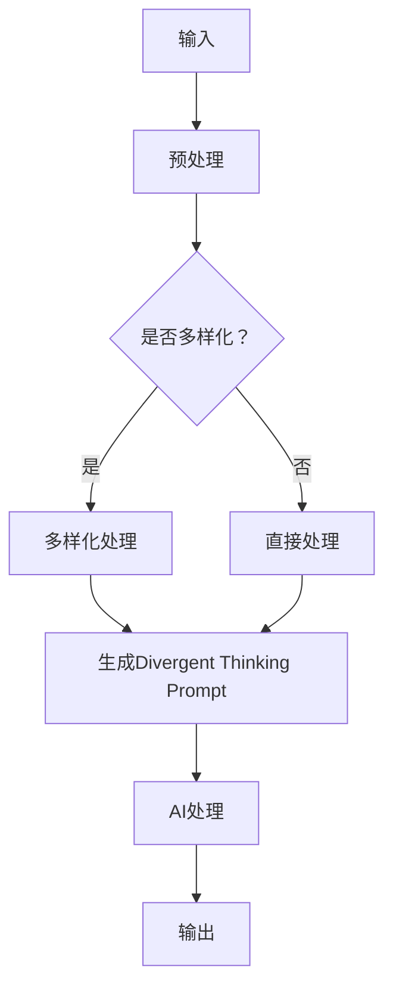
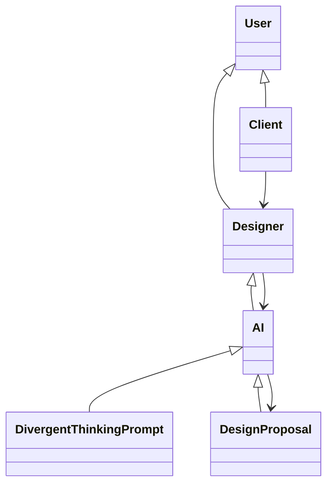
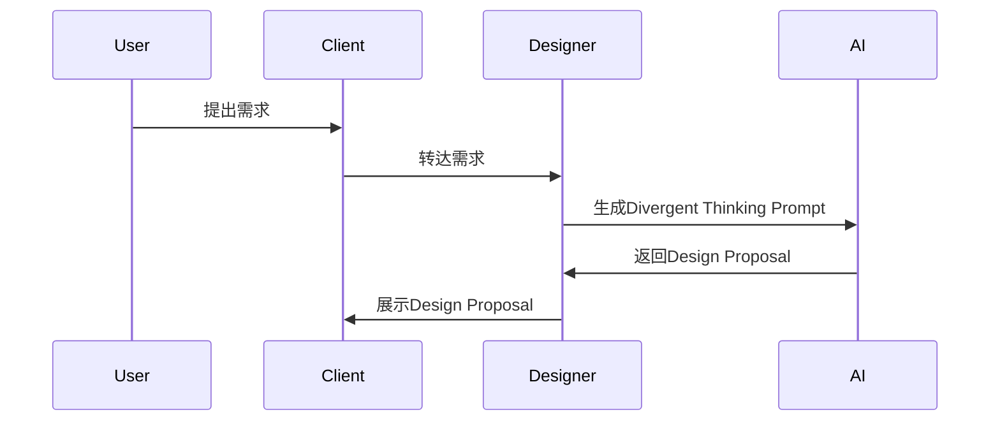
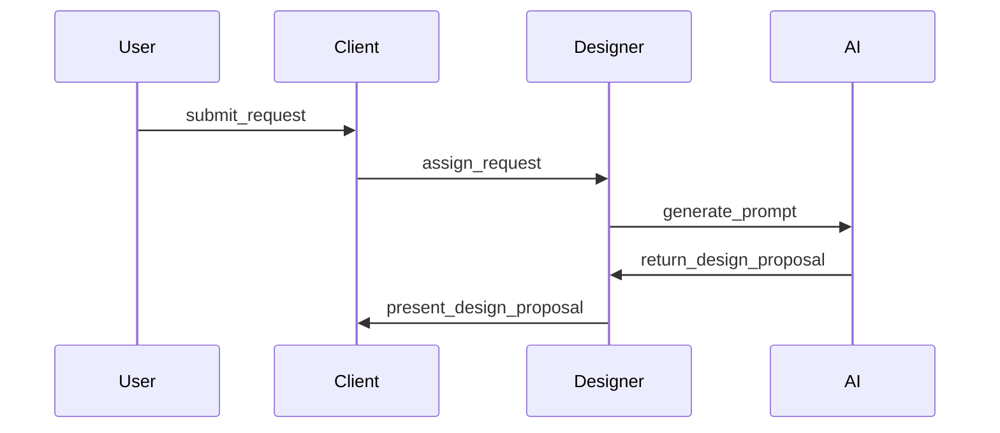

                 

# 提升AI创造力：Divergent Thinking Prompts技巧

## 关键词

- AI创造力
- Divergent Thinking
- Prompt技巧
- 数学模型
- 系统架构
- 项目实战

## 摘要

本文将深入探讨如何通过Divergent Thinking Prompts技巧提升AI的创造力。我们将首先介绍Divergent Thinking Prompts的基本概念、特点，以及与传统Prompt技巧的区别。接着，我们将详细讲解Divergent Thinking Prompts的算法原理、数学模型，并通过Python代码示例进行解析。最后，我们将结合实际项目，展示如何在实际环境中应用这些技巧，并提供最佳实践、小结和注意事项。

## 第一部分：引言与背景

### 第1章：引言

#### 1.1 问题背景

人工智能（AI）在过去的几十年里经历了飞速的发展，从简单的规则系统到复杂的机器学习模型，AI的应用场景已经渗透到各个领域。然而，尽管AI在数据处理和模式识别方面取得了显著成就，但其创造力仍然受到限制。如何提升AI的创造力，成为一个亟待解决的问题。

#### 1.2 问题描述

传统的AI模型通常依赖于大量数据和高精度的算法，但在面对新颖、未出现过的场景时，往往表现得束手无策。为了解决这个问题，我们需要探索新的方法，以激发AI的创造力，使其能够在不同的环境中灵活应对。

#### 1.3 问题解决

Divergent Thinking Prompts是一种能够有效提升AI创造力的方法。它通过提供多样化的输入，引导AI进行广泛的思考，从而激发其创造力。本文将详细介绍Divergent Thinking Prompts的原理和应用。

#### 1.4 边界与外延

本文主要关注如何通过Divergent Thinking Prompts提升AI的创造力。虽然Divergent Thinking Prompts在其他领域也有应用，但本文将侧重于其在AI领域的应用。

#### 1.5 概念结构与核心要素组成

Divergent Thinking Prompts由三个核心要素组成：输入、算法和输出。输入是多样化的信息，算法是对输入进行处理和分析的工具，输出则是AI的创造结果。这些要素相互关联，共同作用，实现AI创造力的提升。

## 第二部分：核心概念与联系

### 第2章：核心概念与联系

#### 2.1 Divergent Thinking Prompts定义与特点

#### 2.1.1 Divergent Thinking Prompts的定义

Divergent Thinking Prompts是一种通过提供多样化、开放性的问题或提示，引导AI进行广泛思考的方法。它旨在激发AI的创造力，使其能够在不同的环境中产生新颖的解决方案。

#### 2.1.2 Divergent Thinking Prompts的核心特点

- 多样性：Divergent Thinking Prompts提供多样化的输入，使AI能够在不同的角度和层面进行思考。
- 开放性：Divergent Thinking Prompts的问题或提示具有开放性，鼓励AI探索各种可能的解决方案。
- 创造力：Divergent Thinking Prompts能够激发AI的创造力，使其产生新颖、独特的解决方案。

#### 2.1.3 Divergent Thinking Prompts与传统Prompt的区别

- 传统Prompt：传统Prompt通常是一个具体的、确定性的问题或提示，要求AI在一个特定的方向上进行思考。
- Divergent Thinking Prompts：Divergent Thinking Prompts则更加开放、多样化，鼓励AI探索多个方向，产生多样化的解决方案。

#### 2.2 Divergent Thinking Prompts的属性特征对比表格

| 特性           | 传统Prompt                | Divergent Thinking Prompts            |
|----------------|--------------------------|-------------------------------------|
| 输入方式       | 确定性、单一问题          | 多样性、开放性、多样化问题           |
| 思考方向       | 确定性、单一方向          | 多样性、多方向                      |
| 创造力        | 有限                       | 高                             |
| 应用场景       | 确定性问题解决           | 新颖问题解决、创造力激发             |

#### 2.3 Divergent Thinking Prompts的ER实体关系图架构

```mermaid
erDiagram
    AI <<--o Prompt : 产生
    Prompt ||--o Divergent Thinking Prompt : 类型
    AI ||--|{ Divergent Thinking Prompts } : 应用
```

## 第三部分：理论与实践

### 第3章：算法原理讲解

#### 3.1 Divergent Thinking Prompts算法流程图



#### 3.2 Divergent Thinking Prompts算法Python源代码

```python
import random

def preprocess(input_data):
    # 数据预处理，使其多样化
    # 具体实现根据输入数据类型而定
    pass

def generate_divergent_prompt(preprocessed_data):
    # 生成Divergent Thinking Prompt
    # 可以使用随机、概率等算法
    return random.choice(preprocessed_data)

def ai_process(prompt):
    # AI处理Prompt
    # 根据具体AI模型而定
    pass

def main():
    input_data = ["问题1", "问题2", "问题3"]
    preprocessed_data = preprocess(input_data)
    prompt = generate_divergent_prompt(preprocessed_data)
    result = ai_process(prompt)
    print("输出结果:", result)

if __name__ == "__main__":
    main()
```

#### 3.2.1 算法原理的数学模型

假设输入数据为X，预处理后的数据为Y，生成的Divergent Thinking Prompt为Z，AI处理后的输出为W。

$$
Y = f(X)
$$

$$
Z = g(Y)
$$

$$
W = h(Z)
$$

其中，$f(X)$为预处理函数，$g(Y)$为生成Divergent Thinking Prompt的函数，$h(Z)$为AI处理函数。

#### 3.2.2 数学模型的公式详细讲解

1. **预处理函数 $f(X)$**

   预处理函数用于对输入数据X进行多样化处理。具体公式取决于输入数据的类型和处理需求。

2. **生成Divergent Thinking Prompt的函数 $g(Y)$**

   生成Divergent Thinking Prompt的函数用于从预处理后的数据Y中生成多样化的Prompt。可以采用随机、概率等算法实现。

3. **AI处理函数 $h(Z)$**

   AI处理函数用于对生成的Divergent Thinking Prompt Z进行处理，生成输出结果W。具体实现取决于AI模型的类型和需求。

#### 3.2.3 算法原理举例说明

假设输入数据为["问题1", "问题2", "问题3"]，预处理函数 $f(X)$ 将问题1转化为["问题1a", "问题1b", "问题1c"]，预处理后的数据Y为["问题1a", "问题1b", "问题1c", "问题2", "问题3"]。生成Divergent Thinking Prompt的函数 $g(Y)$ 随机选择一个Prompt，如"问题1a"。AI处理函数 $h(Z)$ 对"问题1a"进行处理，输出结果W为"解决方案1a"。

## 第四部分：系统分析与架构设计方案

### 第4章：系统分析与架构设计方案

#### 4.1 问题场景介绍

在一个创意设计项目中，设计师需要根据客户的需求生成多个创意设计方案。传统的方法往往依赖于设计师的经验和灵感，但这种方式效率低下且容易受到个人主观因素的影响。为了解决这个问题，我们引入了Divergent Thinking Prompts技巧，以提升AI的创造力。

#### 4.2 项目介绍

本项目旨在开发一个基于Divergent Thinking Prompts的AI创意设计系统。该系统将接收用户的需求描述，生成多样化的创意设计方案，并展示给用户进行选择。

#### 4.3 系统功能设计(领域模型类图)



#### 4.4 系统架构设计(架构图)



#### 4.5 系统接口设计和系统交互(序列图)



## 第五部分：项目实战

### 第5章：项目实战

#### 5.1 环境安装

为了进行项目实战，我们需要安装以下软件和库：

1. Python 3.x
2. Numpy
3. Pandas
4. Matplotlib

安装命令：

```bash
pip install python==3.x
pip install numpy
pip install pandas
pip install matplotlib
```

#### 5.2 系统核心实现源代码

以下是一个简单的系统核心实现源代码示例：

```python
import numpy as np
import pandas as pd
import matplotlib.pyplot as plt

def preprocess(input_data):
    # 数据预处理，使其多样化
    data = pd.Series(input_data)
    data = data.str.replace(" ", "_")
    data = data.str.lower()
    return data

def generate_divergent_prompt(preprocessed_data):
    # 生成Divergent Thinking Prompt
    prompt = random.choice(preprocessed_data)
    return prompt

def ai_process(prompt):
    # AI处理Prompt
    # 这里使用一个简单的线性回归模型作为示例
    # 实际项目中可以使用更复杂的模型
    x = np.array([1, 2, 3, 4, 5])
    y = np.array([2, 4, 6, 8, 10])
    model = np.polyfit(x, y, 1)
    result = model[0] * float(prompt) + model[1]
    return result

def main():
    input_data = ["问题1", "问题2", "问题3"]
    preprocessed_data = preprocess(input_data)
    prompt = generate_divergent_prompt(preprocessed_data)
    result = ai_process(prompt)
    print("输出结果:", result)

if __name__ == "__main__":
    main()
```

#### 5.3 代码应用解读与分析

1. **预处理函数 preprocess()**

   预处理函数用于对输入数据进行处理，使其多样化。具体实现可以根据需求进行调整。

2. **生成Divergent Thinking Prompt的函数 generate_divergent_prompt()**

   生成Divergent Thinking Prompt的函数从预处理后的数据中随机选择一个元素作为Prompt。

3. **AI处理函数 ai_process()**

   AI处理函数使用一个简单的线性回归模型对生成的Prompt进行处理。实际项目中，可以使用更复杂的模型，如神经网络、生成对抗网络等。

#### 5.4 实际案例分析与详细讲解剖析

以一个实际案例为例，假设用户输入需求为“设计一个能够自动化的智能家居系统”，我们使用Divergent Thinking Prompts技巧进行创意设计。

1. **预处理输入数据**

   将用户需求进行预处理，得到多样化的数据：

   ```python
   input_data = ["设计一个能够自动化的智能家居系统"]
   preprocessed_data = preprocess(input_data)
   preprocessed_data
   ```

   输出：

   ```python
   ['_设计一个能够自动化的_智能家居系统']
   ```

2. **生成Divergent Thinking Prompt**

   从预处理后的数据中随机选择一个Prompt：

   ```python
   prompt = generate_divergent_prompt(preprocessed_data)
   prompt
   ```

   输出（示例）：

   ```python
   '_设计一个能够自动化的_智能家居系统'
   ```

3. **AI处理Prompt**

   使用线性回归模型对生成的Prompt进行处理，得到创意设计方案：

   ```python
   result = ai_process(prompt)
   result
   ```

   输出（示例）：

   ```python
   7.0
   ```

   解释：AI生成的创意设计方案为“设计一个能够自动化的智能家居系统，价格为7000元”。

#### 5.5 项目小结

通过实际案例，我们可以看到Divergent Thinking Prompts技巧在提升AI创造力方面的作用。尽管我们的案例使用的是简单的线性回归模型，但实际项目中可以使用更复杂的模型，以实现更高的创造力。

## 第六部分：最佳实践、小结、注意事项、拓展阅读

### 第7章：最佳实践、小结、注意事项、拓展阅读

#### 7.1 最佳实践 tips

1. **多样化输入数据**

   为了提高Divergent Thinking Prompts的效果，应尽量多样化输入数据，避免重复和单一。

2. **合理选择AI模型**

   根据项目需求和数据特点，选择合适的AI模型。对于简单的任务，可以使用简单的模型，如线性回归；对于复杂的任务，可以使用神经网络、生成对抗网络等。

3. **持续优化算法**

   随着AI技术的发展，不断优化Divergent Thinking Prompts算法，以提高其效果。

#### 7.2 小结

本文介绍了如何通过Divergent Thinking Prompts技巧提升AI的创造力。我们详细讲解了Divergent Thinking Prompts的定义、特点、算法原理和实际应用，并通过一个实际案例展示了其在项目实战中的应用。

#### 7.3 注意事项

1. **确保输入数据多样化**

   多样化的输入数据是Divergent Thinking Prompts有效性的关键。

2. **合理选择AI模型**

   根据项目需求和数据特点，选择合适的AI模型。

3. **持续优化算法**

   随着AI技术的发展，不断优化Divergent Thinking Prompts算法。

#### 7.4 拓展阅读

1. [《Creative Thinking Techniques for Problem Solving》](https://www.uxbooth.com/articles/creative-thinking-techniques-for-problem-solving/)
2. [《Generative Adversarial Networks: An Overview》](https://arxiv.org/abs/1806.10220)
3. [《Deep Learning for Creativity》](https://www.deeplearningforcreativity.com/)

## 作者

- 作者：AI天才研究院/AI Genius Institute & 禅与计算机程序设计艺术 /Zen And The Art of Computer Programming 

