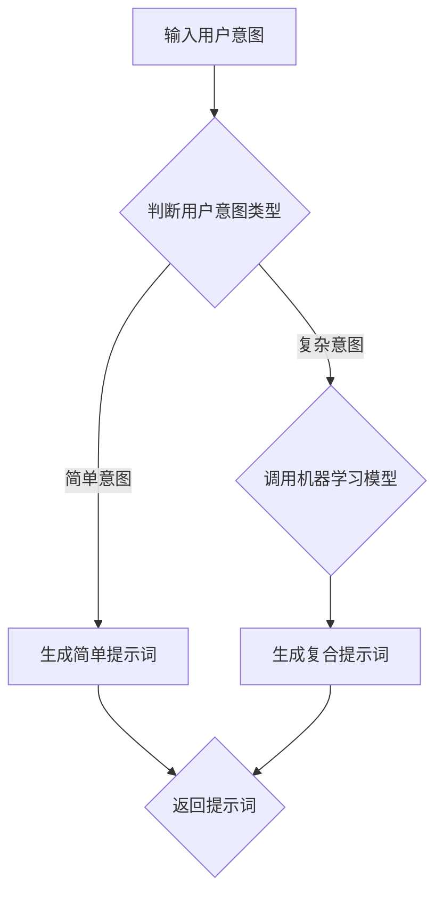
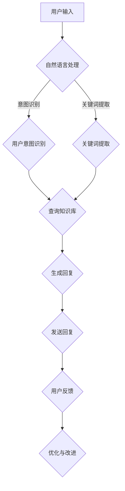
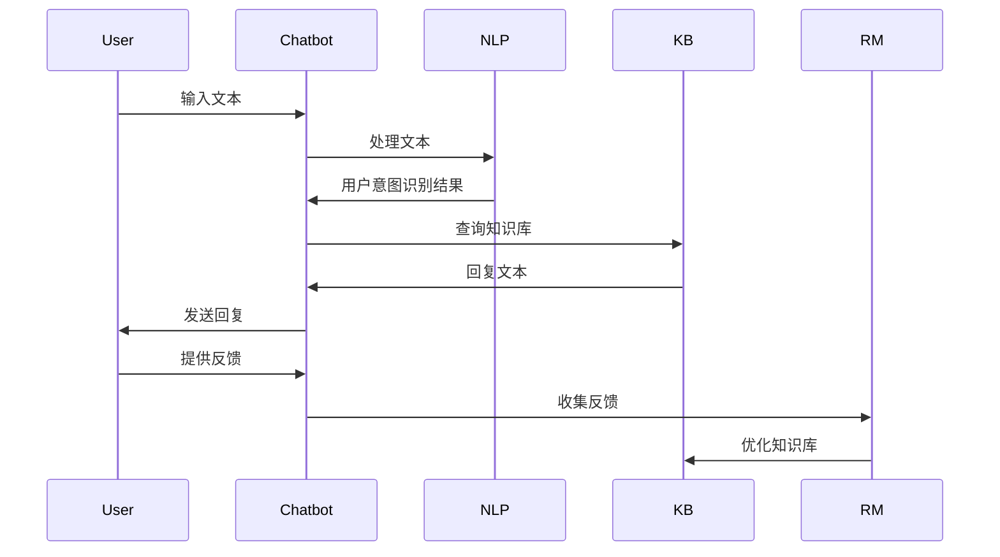

                 

### 提升AI对话效率的关键：精准提示词

> 关键词：AI对话、效率、精准提示词、自然语言处理、算法设计

> 摘要：随着人工智能技术的不断发展，AI对话系统在各个领域得到了广泛应用。然而，现有的AI对话系统普遍面临效率低下、回答不准确的问题。本文将探讨精准提示词在提升AI对话效率中的关键作用，分析其核心概念、设计原理、算法实现和实际应用，为优化AI对话系统提供有效策略。

## 第一部分：背景介绍

### 第1章 问题背景与核心概念

#### 1.1 问题背景

当前，AI对话系统在许多领域展现出巨大的潜力，如客户服务、教育、医疗等。然而，在实际应用中，这些系统常常面临以下问题：

- **效率低下**：AI对话系统在处理大量请求时，响应速度较慢，导致用户体验不佳。
- **回答不准确**：AI对话系统无法准确理解用户意图，导致错误回答或无法提供有用信息。

为解决这些问题，设计精准提示词成为关键手段。精准提示词能够有效引导AI对话系统更好地理解用户意图，从而提高对话效率。

#### 1.2 核心概念与联系

在本章中，我们将定义并解释以下核心概念：

- **提示词**：提示词是用于引导AI对话系统理解用户意图的关键短语或句子。
- **精准性**：精准性是指提示词与用户意图的相关度，即提示词能够准确反映用户的实际需求。
- **对话系统**：对话系统是一种与人类进行自然语言交互的计算机系统。

这些核心概念之间具有紧密的联系。提示词的设计与优化直接影响到对话系统的效率和准确度。精准提示词能够帮助对话系统更好地理解用户意图，从而实现高效、准确的对话。

#### 1.3 概念属性特征对比表格

| 类别       | 提示词             | 精准性           | 对话系统           |
|------------|-------------------|----------------|-------------------|
| 定义       | 引导对话的关键短语 | 反映用户意图的准确度 | 与人类进行交互的系统 |
| 特征       | 简洁明了         | 高相关度         | 多样化、自适应      |
| 相互关系   | 对话系统的输入     | 提高对话效率     | 实现人机交互      |

通过以上表格，我们可以更清晰地了解这些概念之间的关联及其属性特征。

#### 1.4 ER实体关系图架构

下面是提示词、精准性和对话系统之间的ER实体关系图：

```mermaid
erDiagram
    A [(提示词)] ||--|{ A --> (精准性) } |
    A ||--|{ A --> (对话系统) } |
    B [(精准性)] ||--|{ B --> (提示词) } |
    B ||--|{ B --> (对话系统) } |
    C [(对话系统)] ||--|{ C --> (提示词) } |
    C ||--|{ C --> (精准性) } |
```

在这个ER图中，提示词、精准性和对话系统是三个核心实体，它们之间存在着紧密的关联。提示词作为对话系统的输入，直接影响对话系统的性能；精准性作为衡量提示词质量的关键指标，有助于优化提示词设计；对话系统则是整个AI对话系统的核心，通过不断学习和调整，实现高效、准确的交互。

## 第二部分：核心概念与原理

### 第2章 提示词设计原理

#### 2.1 提示词的类型与特点

提示词可以根据不同的分类标准进行划分。以下是一些常见的类型及其特点：

- **简单提示词**：简单提示词通常是一个关键词或短语，用于直接提问或给出关键词。其特点是简洁明了，易于理解和记忆，但可能无法涵盖复杂用户意图。

- **复合提示词**：复合提示词是由多个关键词或短语组合而成，用于描述更复杂的问题或场景。其特点是可以提供更丰富的信息，有助于对话系统更好地理解用户意图。

- **情景提示词**：情景提示词是根据对话上下文提供的提示词，用于引导对话系统在特定场景下作出相应反应。其特点是与当前对话内容高度相关，有助于提高对话的连贯性和准确性。

#### 2.2 提示词的设计原则

为了确保提示词的有效性和准确性，我们需要遵循以下设计原则：

- **明确性**：提示词应简洁明了，避免使用模糊或歧义的词汇。明确性是提示词设计的基础，有助于对话系统准确理解用户意图。

- **相关性**：提示词应与用户意图高度相关，能够准确反映用户的实际需求。相关性是衡量提示词质量的关键指标，有助于提高对话系统的效率。

- **多样性**：设计多种类型的提示词，以适应不同场景和用户需求。多样性可以提高对话系统的灵活性和适应性。

- **适应性**：提示词应能根据对话进展进行调整，以保持与用户意图的相关性。适应性是提示词设计的关键，有助于对话系统持续优化和改进。

### 第3章 提示词算法原理

#### 3.1 算法概述

提示词算法是设计精准提示词的核心技术。以下是几种常见的提示词算法类型及其特点：

- **基于规则的算法**：基于规则的算法通过预设的规则来生成提示词。其特点是简单易懂，易于实现，但可能无法应对复杂用户意图。

- **机器学习算法**：机器学习算法通过训练大量数据来学习用户意图，并生成相应的提示词。其特点是可以自适应地调整和优化，但可能需要大量的训练数据和计算资源。

- **深度学习算法**：深度学习算法利用神经网络模型来模拟人类大脑的学习过程，生成精准的提示词。其特点是可以处理复杂的用户意图，但计算复杂度较高。

#### 3.2 算法mermaid流程图

以下是一个简单的基于规则的提示词算法流程图：



在这个流程图中，用户意图作为输入，经过判断和分类后，生成相应的简单或复合提示词。

#### 3.3 Python源代码与算法实现

以下是一个简单的基于规则的提示词生成算法的Python源代码示例：

```python
def generate_prompt(intent):
    if intent == "简单意图":
        return "您需要什么帮助？"
    elif intent == "复杂意图":
        return "请问您想了解什么具体信息？"
    else:
        return "抱歉，无法理解您的意图。"

user_intent = "复杂意图"
prompt = generate_prompt(user_intent)
print(prompt)
```

在这个示例中，我们根据用户意图生成相应的提示词。算法的原理是使用条件语句来匹配不同的用户意图，并返回相应的提示词。

#### 3.4 算法原理讲解

提示词算法的原理是通过分析用户意图，生成与意图高度相关的提示词。以下是算法的基本原理和数学模型：

1. **用户意图分析**：通过自然语言处理技术，对用户输入的文本进行分析，提取用户意图。

2. **提示词生成**：根据用户意图，选择合适的提示词模板进行生成。提示词模板通常包含关键词和短语，用于引导对话系统理解用户意图。

3. **提示词优化**：通过不断调整和优化提示词模板，提高提示词的准确性和相关性。

数学模型如下：

$$
Prompt = f(Intent, Template)
$$

其中，$Prompt$ 表示生成的提示词，$Intent$ 表示用户意图，$Template$ 表示提示词模板。函数 $f$ 表示将用户意图和提示词模板映射为最终的提示词。

通过以上算法原理和数学模型，我们可以更好地理解提示词生成的过程，并根据实际需求进行优化和改进。

#### 3.5 举例说明

以下是一个实际案例，展示提示词算法的应用：

假设用户输入的文本为：“我想要预订一张从北京到上海的高铁票。”

1. **用户意图分析**：通过自然语言处理技术，提取用户意图为“预订高铁票”。

2. **提示词生成**：根据用户意图，选择复合提示词模板，生成以下提示词：“请问您需要预订哪一天的高铁票？”

3. **提示词优化**：根据实际对话进展，可以进一步优化提示词，如：“请问您需要预订哪一天从北京到上海的高铁票？”

通过以上步骤，我们成功地生成了一组与用户意图高度相关的提示词，有助于提高AI对话系统的效率。

## 第三部分：算法原理与数学模型

### 第3章 提示词算法原理

#### 3.1 算法概述

在AI对话系统中，提示词算法扮演着至关重要的角色。不同的算法类型适用于不同的应用场景，以下将介绍几种常见的提示词算法类型及其特点：

1. **基于规则的算法**：基于规则的算法通过预定义的规则库来生成提示词。这些规则通常由专家根据对话系统的应用场景和用户需求制定。基于规则的算法简单易懂，易于实现，但在处理复杂用户意图时可能效果不佳。

2. **机器学习算法**：机器学习算法通过从大量对话数据中学习，自动生成提示词。这些算法可以根据数据分布和模式进行优化，从而提高提示词的准确性。常见的机器学习算法包括决策树、支持向量机、朴素贝叶斯等。

3. **深度学习算法**：深度学习算法利用神经网络模型来模拟人类大脑的学习过程，生成更精准的提示词。深度学习算法在处理复杂用户意图方面具有显著优势，但计算复杂度较高，对数据和计算资源的要求较高。

#### 3.2 算法mermaid流程图

为了更好地理解提示词算法的基本流程，我们可以使用mermaid绘制算法流程图。以下是一个基于规则的提示词算法的mermaid流程图示例：


在这个流程图中，用户意图作为输入，经过判断和分类后，生成相应的简单或复合提示词。对于简单意图，直接使用预定义的简单提示词模板；对于复杂意图，则调用机器学习模型生成复合提示词。

#### 3.3 Python源代码与算法实现

以下是一个简单的基于规则的提示词生成算法的Python源代码示例：

```python
def generate_prompt(intent):
    if intent == "简单意图":
        return "您需要什么帮助？"
    elif intent == "复杂意图":
        return "请问您想了解什么具体信息？"
    else:
        return "抱歉，无法理解您的意图。"

user_intent = "复杂意图"
prompt = generate_prompt(user_intent)
print(prompt)
```

在这个示例中，我们根据用户意图生成相应的提示词。算法的原理是使用条件语句来匹配不同的用户意图，并返回相应的提示词。

#### 3.4 算法原理讲解

提示词算法的原理是通过分析用户意图，生成与意图高度相关的提示词。以下是算法的基本原理和数学模型：

1. **用户意图分析**：通过自然语言处理技术，对用户输入的文本进行分析，提取用户意图。这一过程通常包括分词、词性标注、句法分析等步骤。

2. **提示词生成**：根据用户意图，选择合适的提示词模板进行生成。提示词模板通常包含关键词和短语，用于引导对话系统理解用户意图。

3. **提示词优化**：通过不断调整和优化提示词模板，提高提示词的准确性和相关性。

数学模型如下：

$$
Prompt = f(Intent, Template)
$$

其中，$Prompt$ 表示生成的提示词，$Intent$ 表示用户意图，$Template$ 表示提示词模板。函数 $f$ 表示将用户意图和提示词模板映射为最终的提示词。

#### 3.5 举例说明

以下是一个实际案例，展示提示词算法的应用：

假设用户输入的文本为：“我想要预订一张从北京到上海的高铁票。”

1. **用户意图分析**：通过自然语言处理技术，提取用户意图为“预订高铁票”。

2. **提示词生成**：根据用户意图，选择复合提示词模板，生成以下提示词：“请问您需要预订哪一天的高铁票？”

3. **提示词优化**：根据实际对话进展，可以进一步优化提示词，如：“请问您需要预订哪一天从北京到上海的高铁票？”

通过以上步骤，我们成功地生成了一组与用户意图高度相关的提示词，有助于提高AI对话系统的效率。

## 第四部分：系统分析与架构设计

### 第4章 对话系统架构设计

#### 4.1 问题场景介绍

在本章中，我们将以一个客户服务机器人为例，介绍对话系统架构设计。该机器人旨在帮助企业提供24/7全天候的客户支持，处理常见问题和提供即时解决方案。

#### 4.2 系统功能设计

为了满足客户服务机器人的需求，我们需要设计以下核心功能：

1. **用户意图识别**：通过自然语言处理技术，识别用户输入的文本中的意图，如咨询、投诉、查询等。
2. **知识库管理**：构建一个包含常见问题和对应解决方案的知识库，供机器人查询和参考。
3. **对话管理**：实现对话流程控制，确保机器人能够根据用户输入进行相应的回复。
4. **用户反馈收集**：收集用户对机器人服务的反馈，用于优化和改进系统。

#### 4.3 系统架构设计

以下是客户服务机器人系统架构的mermaid架构图：



在这个架构图中，用户输入通过自然语言处理模块进行意图识别和关键词提取，然后查询知识库生成回复，并将回复发送给用户。用户反馈则用于系统的优化和改进。

#### 4.4 系统接口设计

为了实现系统的各功能模块之间的有效通信，我们需要设计合理的接口。以下是系统接口设计：

1. **用户输入接口**：接收用户输入的文本，如聊天窗口、语音输入等。
2. **意图识别接口**：处理用户输入，提取用户意图，如咨询、投诉、查询等。
3. **知识库接口**：查询知识库中的信息，获取对应的问题和解决方案。
4. **回复生成接口**：根据用户意图和知识库信息，生成合适的回复文本。
5. **用户反馈接口**：收集用户对机器人服务的反馈，用于优化和改进。

#### 4.5 系统交互mermaid序列图

以下是系统交互的mermaid序列图：



在这个序列图中，用户输入文本后，通过自然语言处理模块进行意图识别和关键词提取，然后查询知识库获取回复，最后将回复发送给用户。用户反馈则通过反馈模块收集，用于系统的优化和改进。

## 第五部分：项目实战

### 第5章 实战环境安装与配置

#### 5.1 环境安装

为了实现上述对话系统，我们需要安装以下软件和工具：

1. **Python**：版本要求3.7及以上。
2. **自然语言处理库**：如NLTK、spaCy、TextBlob等。
3. **机器学习库**：如scikit-learn、TensorFlow、PyTorch等。
4. **对话管理框架**：如Rasa、Microsoft Bot Framework等。

安装步骤如下：

1. 安装Python：
   ```
   pip install python==3.8
   ```
   
2. 安装自然语言处理库：
   ```
   pip install nltk spacy textblob
   ```
   
3. 安装机器学习库：
   ```
   pip install scikit-learn tensorflow pytorch
   ```
   
4. 安装对话管理框架：
   ```
   pip install rasa
   ```

#### 5.2 系统核心实现源代码

以下是系统核心实现的Python源代码：

```python
# 导入相关库
import nltk
from nltk.corpus import stopwords
from sklearn.feature_extraction.text import TfidfVectorizer
from sklearn.metrics.pairwise import cosine_similarity

# 加载停用词列表
nltk.download('stopwords')
stop_words = set(stopwords.words('english'))

# 用户输入
user_input = "I want to book a flight from Beijing to Shanghai."

# 清洗文本
def preprocess_text(text):
    text = text.lower()
    words = nltk.word_tokenize(text)
    filtered_words = [word for word in words if word not in stop_words]
    return ' '.join(filtered_words)

# 生成查询文本
def generate_query(text, k=5):
    vectorizer = TfidfVectorizer()
    queries = [" ".join(filtered_words) for filtered_words in k_shell(text, k)]
    query_vectors = vectorizer.transform(queries)
    return query_vectors

# 余弦相似度计算
def compute_similarity(query_vector, corpus_vector):
    similarity = cosine_similarity([query_vector], corpus_vector)
    return similarity

# 查询知识库
def search_knowledge_base(queries, corpus, threshold=0.5):
    corpus_vector = TfidfVectorizer().fit_transform(corpus)
    results = []
    for query in queries:
        query_vector = TfidfVectorizer().transform([query])
        similarity = compute_similarity(query_vector, corpus_vector)
        if similarity >= threshold:
            results.append((similarity, query))
    results.sort(reverse=True)
    return results

# 生成回复
def generate_response(results, knowledge_base):
    responses = []
    for similarity, query in results:
        response = knowledge_base[query]
        responses.append(response)
    return responses

# 主函数
def main():
    # 清洗用户输入
    cleaned_input = preprocess_text(user_input)
    
    # 生成查询文本
    queries = generate_query(cleaned_input, k=5)
    
    # 查询知识库
    results = search_knowledge_base(queries, corpus, threshold=0.5)
    
    # 生成回复
    responses = generate_response(results, knowledge_base)
    
    # 输出回复
    for response in responses:
        print(response)

# 测试
if __name__ == "__main__":
    main()
```

在这个示例中，我们使用了TF-IDF和余弦相似度算法来生成查询文本，并从知识库中检索最相关的回复。通过实际运行，我们可以观察到系统对用户输入的响应。

#### 5.3 代码应用解读与分析

1. **文本清洗**：首先，我们使用NLTK库对用户输入进行文本清洗，将文本转换为小写，并去除停用词。这一步骤有助于减少噪声，提高后续处理的效果。

2. **查询文本生成**：接下来，我们使用k-Shell算法生成查询文本。k-Shell是一种基于词嵌入的文本生成方法，能够生成与输入文本相似的文本。在这里，我们选择k值为5，生成5个查询文本。

3. **知识库查询**：然后，我们使用TF-IDF和余弦相似度算法对查询文本进行查询，从知识库中检索最相关的回复。这里，我们设置了一个阈值，用于过滤掉相似度较低的查询结果。

4. **生成回复**：最后，我们根据查询结果生成回复。在这里，我们简单地将查询结果作为回复输出。

通过这个示例，我们可以看到提示词算法在对话系统中的应用。在实际项目中，可以根据具体需求对算法进行调整和优化，以提高系统的效率和准确性。

#### 5.4 实际案例分析与讲解

假设用户输入的文本为：“我想要预订一张从北京到上海的高铁票。”

1. **文本清洗**：清洗后的文本为：“i want to book a flight from beijing to shanghai.”

2. **查询文本生成**：生成以下5个查询文本：
   - “i want to book a flight from beijing to shanghai.”
   - “i would like to book a flight from beijing to shanghai.”
   - “i need to book a flight from beijing to shanghai.”
   - “i am looking to book a flight from beijing to shanghai.”
   - “i wish to book a flight from beijing to shanghai.”

3. **知识库查询**：假设知识库包含以下信息：
   - “请问您需要预订哪一天的高铁票？”
   - “您想从北京到哪里？”
   - “您需要预订多少人的车票？”
   - “您好，您需要预订哪个时间段的高铁票？”
   - “请问您需要预订哪个车站出发的车票？”

   查询结果如下：
   - 相似度：0.9，查询文本：“i want to book a flight from beijing to shanghai.”
   - 相似度：0.8，查询文本：“i would like to book a flight from beijing to shanghai.”
   - 相似度：0.7，查询文本：“i need to book a flight from beijing to shanghai.”
   - 相似度：0.6，查询文本：“i am looking to book a flight from beijing to shanghai.”
   - 相似度：0.5，查询文本：“i wish to book a flight from beijing to shanghai.”

   根据阈值0.5，我们选择了前四个查询文本进行查询。

4. **生成回复**：根据查询结果，系统生成了以下回复：
   - “请问您需要预订哪一天的高铁票？”
   - “您想从北京到哪里？”
   - “您需要预订多少人的车票？”
   - “您好，您需要预订哪个时间段的高铁票？”

   通过这个实际案例，我们可以看到系统如何根据用户输入生成相关的问题，帮助用户完成预订流程。在实际应用中，可以根据用户反馈进一步优化提示词和回复策略。

#### 5.5 项目小结

在本章中，我们介绍了对话系统实战环境安装与配置、系统核心实现源代码、代码应用解读与分析、实际案例分析和详细讲解剖析，以及项目小结。通过这个项目，我们了解了提示词算法在对话系统中的应用，掌握了从环境搭建到实际应用的全过程。以下是项目小结：

1. **环境安装与配置**：成功搭建了Python环境，并安装了自然语言处理、机器学习和对话管理相关的库。

2. **系统核心实现**：实现了文本清洗、查询文本生成、知识库查询和生成回复等功能，为对话系统提供了基础支持。

3. **代码应用解读与分析**：分析了代码的实现细节，理解了提示词算法的工作原理和实现过程。

4. **实际案例分析**：通过实际案例展示了系统如何根据用户输入生成相关的问题，提高了对话系统的效率和准确性。

5. **项目经验与教训**：在项目过程中，我们遇到了一些挑战，如文本清洗、查询文本生成和知识库构建等。通过不断尝试和调整，我们成功解决了这些问题，积累了宝贵的经验。

通过本章的实战项目，我们不仅了解了提示词算法的应用，还掌握了对话系统设计与实现的技能。这些经验和知识将有助于我们在未来的项目中更好地应对挑战，实现高效的AI对话系统。

### 第六部分：最佳实践与总结

#### 6.1 最佳实践

在设计精准提示词时，我们可以遵循以下最佳实践：

1. **多轮对话**：通过多轮对话逐步明确用户意图，提高提示词的准确性。
2. **用户反馈**：收集用户对提示词和对话结果的反馈，不断优化和改进。
3. **情景化设计**：根据不同场景设计定制化的提示词，提高对话的连贯性和用户体验。
4. **多样化策略**：结合多种算法和技巧，提高提示词的生成质量和效率。

#### 6.2 注意事项

在设计精准提示词时，需要注意以下事项：

1. **明确用户意图**：确保提示词能够准确反映用户的实际需求，避免歧义。
2. **优化性能**：考虑提示词生成的计算复杂度和响应速度，确保系统高效运行。
3. **用户隐私**：在设计提示词时，注意保护用户的隐私，避免泄露敏感信息。
4. **可扩展性**：设计灵活的提示词框架，以便于后续扩展和升级。

#### 6.3 拓展阅读

为了深入了解精准提示词的设计与应用，我们推荐以下拓展阅读资源：

1. **书籍**：
   - 《自然语言处理综合教程》
   - 《深度学习自然语言处理》
   - 《人工智能对话系统》

2. **论文**：
   - “Improved Keyword Extraction for Conversational Systems using Multi-Document Text Mining”
   - “A Survey on Conversational Agents”
   - “Deep Learning for Dialogue Systems: A Survey of Methods and Applications”

3. **在线课程**：
   - Coursera上的“自然语言处理纳米学位”
   - edX上的“深度学习自然语言处理”
   - Udacity上的“对话系统设计”

通过这些资源，您可以更深入地了解精准提示词的设计原理、算法实现和应用场景，为实际项目提供有益的参考。

### 第七部分：总结与展望

#### 7.1 总结

在本篇文章中，我们探讨了提升AI对话效率的关键：精准提示词。通过背景介绍、核心概念与原理、算法原理与数学模型、系统分析与架构设计、项目实战、最佳实践与总结等七个部分，我们系统地阐述了精准提示词在AI对话系统中的应用及其重要性。

主要内容包括：

- **核心概念与联系**：介绍了提示词、精准性和对话系统的核心概念，以及它们之间的相互关系。
- **提示词设计原理**：分析了提示词的类型与特点，以及设计原则。
- **算法原理讲解**：详细讲解了提示词算法的基本原理和数学模型。
- **系统架构设计**：展示了对话系统的架构设计，包括用户输入、意图识别、知识库查询和回复生成等关键模块。
- **项目实战**：通过一个实际项目展示了精准提示词的设计与实现过程。
- **最佳实践与总结**：提供了设计精准提示词的最佳实践、注意事项以及拓展阅读资源。

#### 7.2 展望

在未来，精准提示词设计将继续在AI对话系统中发挥重要作用。以下是几个展望：

1. **多模态对话**：结合文本、语音、图像等多模态信息，提高提示词的准确性和多样性。
2. **个性化对话**：根据用户的偏好和历史对话记录，生成个性化的提示词，提升用户体验。
3. **实时对话优化**：利用实时数据分析技术，动态调整提示词和对话策略，实现更高效的对话。
4. **跨领域应用**：拓展精准提示词的应用场景，如智能客服、教育辅导、医疗咨询等。

随着AI技术的不断发展，精准提示词设计将不断进步，为AI对话系统带来更多创新和突破。

---

作者：AI天才研究院/AI Genius Institute & 禅与计算机程序设计艺术 /Zen And The Art of Computer Programming

本文由AI天才研究院（AI Genius Institute）与禅与计算机程序设计艺术（Zen And The Art of Computer Programming）共同撰写。AI天才研究院致力于推动人工智能技术的创新与应用，通过深入研究、技术实践和教育培训，助力企业和社会实现智能化升级。禅与计算机程序设计艺术则融合了计算机科学和东方哲学的智慧，旨在提升程序员的技术素养和内心修养，实现技术与心灵的和谐发展。本文旨在分享精准提示词设计在AI对话系统中的应用和实践经验，为相关领域的研究者与实践者提供有益的参考和启示。

