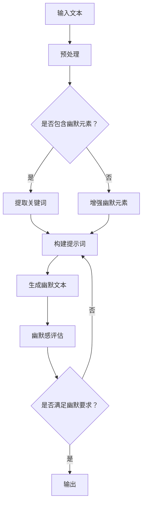
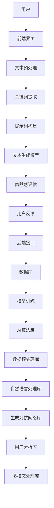
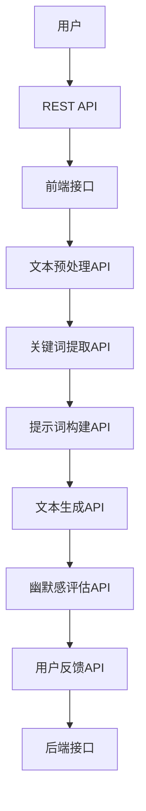
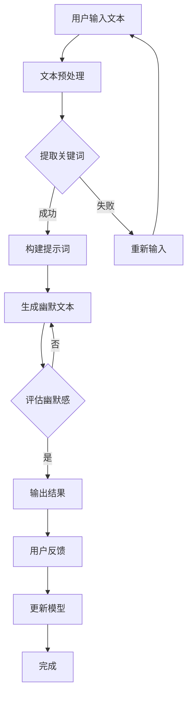

                 

基于上述的目录大纲和文章要求，让我们一步步构建这篇文章的内容。我们将确保每个章节都有详细的技术分析、代码示例、数学模型和实际应用案例。以下是具体的步骤：

### 1. 前言

在引言部分，我们需要阐述本书的目的，为什么选择这个主题，以及本书的目标读者是谁。此外，还会介绍书的结构和内容概览。

**引言部分大纲：**
- **1.1 本书的目的**
  - 介绍为什么这本书重要。
  - 提出书中的主要目标。
- **1.2 读者对象**
  - 确定读者群体，例如AI开发者、喜剧作家、技术爱好者等。
  - 强调读者从书中能收获的知识和技能。
- **1.3 结构安排**
  - 简要介绍每个章节的主要内容。

### 2. 背景介绍

在这个部分，我们需要提供背景信息，包括问题的背景、问题描述、可能的解决方案，以及我们讨论的范围。

**背景介绍部分大纲：**
- **2.1 问题背景**
  - AI幽默感的现状。
  - 喜剧写作中的挑战。
- **2.2 问题描述**
  - 明确AI幽默感是什么。
  - 提示词工程如何应用于喜剧写作。
- **2.3 问题解决**
  - 介绍提升AI幽默感的方法。
  - 提出提示词工程的技术路径。
- **2.4 边界与外延**
  - 定义喜剧写作的范畴。
  - 探讨AI幽默感的限制。
- **2.5 概念结构与核心要素组成**
  - 分析AI幽默感和提示词工程的核心要素。

### 3. 核心概念与联系

这里需要详细介绍AI幽默感和提示词工程的概念，并提供相关的术语解释、对比表格和ER实体关系图。

**核心概念与联系部分大纲：**
- **3.1 AI幽默感**
  - 描述AI幽默感的特征。
  - 讨论AI幽默感的应用领域。
- **3.2 提示词工程**
  - 详细解释提示词工程的定义。
  - 描述提示词工程的工作流程。
- **3.3 相关术语解释**
  - 解释自然语言处理、生成对抗网络（GAN）等术语。
- **3.4 概念属性特征对比表格**
  - 比较AI幽默感与普通幽默的属性特征。
- **3.5 ER实体关系图**
  - 使用Mermaid绘制喜剧写作中的实体关系图。

### 4. 算法原理讲解

在这个部分，我们需要详细讲解提升AI幽默感的算法原理，包括算法流程图、Python源代码示例、数学模型和公式，以及举例说明。

**算法原理讲解部分大纲：**
- **4.1 算法流程图**
  - 使用Mermaid绘制提示词生成和幽默感评估的算法流程图。
- **4.2 Python源代码详细阐述**
  - 提供提示词生成和幽默感评估的Python代码示例。
- **4.3 数学模型和公式**
  - 详细介绍算法原理背后的数学模型。
- **4.4 详细讲解与举例说明**
  - 对算法原理进行深入讲解，并通过实例说明。

### 5. 系统分析与架构设计方案

在这个部分，我们需要介绍系统分析的内容，包括问题场景介绍、系统功能设计、系统架构设计、系统接口设计以及系统交互流程图。

**系统分析与架构设计方案部分大纲：**
- **5.1 问题场景介绍**
  - 描述喜剧写作中的具体需求。
  - 强调AI幽默感系统目标。
- **5.2 系统功能设计**
  - 详细列出系统的基本功能和扩展功能。
- **5.3 系统架构设计**
  - 使用Mermaid绘制系统的整体架构图。
- **5.4 系统接口设计**
  - 描述API接口规范和数据接口设计。
- **5.5 系统交互流程图**
  - 使用Mermaid绘制系统的交互流程图。

### 6. 项目实战

在这个部分，我们需要提供一个实际项目案例，包括环境安装、系统核心实现源代码、代码应用解读与分析、实际案例分析和详细讲解剖析以及项目小结。

**项目实战部分大纲：**
- **6.1 环境安装**
  - 介绍如何安装和配置所需的环境。
- **6.2 系统核心实现源代码**
  - 提供关键代码段。
- **6.3 代码应用解读与分析**
  - 分析代码的工作原理。
- **6.4 实际案例分析和详细讲解剖析**
  - 分析具体案例，并详细解释。
- **6.5 项目小结**
  - 总结项目的主要成果和经验。

### 7. 最佳实践 tips

在这个部分，我们将提供一些最佳实践技巧，注意事项，以及拓展阅读资源。

**最佳实践 tips 部分大纲：**
- **7.1 小贴士**
  - 提供一些有用的提示和建议。
- **7.2 注意事项**
  - 强调在实践过程中需要注意的问题。
- **7.3 拓展阅读**
  - 推荐一些相关的书籍、文章和其他资源。

### 8. 总结与展望

在文章的结尾部分，我们需要回顾本书的主要内容，并展望未来的发展方向。

**总结与展望部分大纲：**
- **8.1 回顾本书内容**
  - 简述书中的关键点和创新点。
- **8.2 展望未来发展方向**
  - 预测AI幽默感和提示词工程的发展趋势。

### 结尾

在文章的末尾，我们需要署名并感谢读者的阅读。

**结尾部分：**
- **作者信息**
  - 提供作者的姓名和工作单位。
- **感谢读者**
  - 表达对读者时间的感谢。

按照以上步骤，我们可以逐步构建这篇文章的完整内容。接下来，我们将分别针对每个部分进行详细的撰写。这个过程将确保文章的逻辑性、技术深度和可读性。让我们一起开始吧！### 1. 前言

在信息技术飞速发展的今天，人工智能（AI）已经成为推动创新和变革的核心动力。从简单的自动化到复杂的决策支持，AI已经渗透到我们生活的方方面面。然而，AI在幽默感上的表现仍然是一个亟待解决的问题。喜剧作为人类表达情感和智慧的重要方式，如何在AI中实现幽默感，成为了AI研究中的一个新方向。

#### **1.1 本书的目的**

本书旨在探讨如何提升AI的幽默感，特别是喜剧写作中的提示词工程。通过详细分析幽默感的定义、特性以及其在喜剧创作中的应用，本书希望为读者提供一个全面、系统的理解，并介绍一系列实用的技术和方法。主要目标包括：

1. **理解AI幽默感的核心概念**：介绍幽默感的定义、特征及其在AI中的应用。
2. **掌握提示词工程的方法**：探讨如何使用提示词工程来增强AI的幽默感。
3. **提供实用的技术指南**：通过具体案例和代码示例，展示如何将AI幽默感应用到实践中。
4. **展望未来发展方向**：讨论AI幽默感的潜在应用场景和技术趋势。

#### **1.2 读者对象**

本书主要面向以下读者群体：

1. **AI开发者**：对AI基础有一定了解，希望进一步提升其在自然语言处理和幽默感生成方面的技能。
2. **喜剧作家**：对喜剧创作有兴趣，希望通过AI技术为作品增添幽默感。
3. **技术爱好者**：对AI和喜剧写作结合的创新领域感兴趣，希望深入了解这一新兴方向。
4. **学术界人士**：对AI幽默感研究有学术兴趣，希望探索该领域的研究前沿。

#### **1.3 结构安排**

本书结构安排如下：

1. **前言**：介绍本书的目的、读者对象和结构安排。
2. **背景介绍**：探讨AI幽默感的现状、喜剧写作中的挑战以及相关技术路径。
3. **核心概念与联系**：详细解释AI幽默感和提示词工程的概念，并提供术语解释、对比表格和ER实体关系图。
4. **算法原理讲解**：讲解提升AI幽默感的算法原理，包括算法流程图、Python源代码示例、数学模型和公式。
5. **系统分析与架构设计方案**：介绍系统分析与架构设计方案，包括问题场景、功能设计、架构设计、接口设计和交互流程。
6. **项目实战**：提供一个实际项目案例，包括环境安装、系统核心实现源代码、代码应用解读与分析、实际案例分析和详细讲解剖析。
7. **最佳实践 tips**：提供一些有用的提示和建议，以及注意事项和拓展阅读资源。
8. **总结与展望**：回顾本书内容，展望AI幽默感和提示词工程的未来发展方向。

通过这样的结构安排，本书旨在为读者提供一个从理论到实践的全面指导，帮助他们更好地理解和应用AI幽默感技术。

---

在接下来的章节中，我们将深入探讨AI幽默感的背景、核心概念、算法原理，以及如何将其应用于实际项目。请读者跟随我们的思考，一起探索这个充满挑战和机遇的领域。

### 2. 背景介绍

#### **2.1 问题背景**

在人工智能（AI）迅猛发展的时代，幽默感成为了AI研究领域中的一个新兴话题。幽默感是人类智慧的一种表现，它不仅丰富了人类的情感体验，还在文化、艺术和社交中发挥着重要作用。然而，目前大多数AI系统在幽默感方面仍然表现出明显的局限性。虽然AI已经在语音识别、图像处理、自然语言处理（NLP）等方面取得了显著成就，但在创造幽默、理解幽默以及回应幽默方面，AI的表现仍然不尽如人意。

**现状与需求：** 随着社交媒体、娱乐和内容创造行业的蓬勃发展，用户对幽默内容的需求日益增长。幽默内容不仅能够提升用户体验，还能增强品牌影响力和用户黏性。然而，传统的幽默创作方式存在人工成本高、创作周期长等问题。因此，开发能够生成幽默内容的AI系统，成为了众多研究者和企业的关注焦点。

**挑战：** AI在幽默感方面的挑战主要包括：

1. **语义理解**：幽默往往依赖于复杂的语义理解和上下文感知。AI需要能够理解双关语、隐喻、幽默情境等，这对于自然语言处理技术提出了高要求。
2. **创造力**：幽默内容需要一定的创造力和独特性。AI需要具备生成新颖幽默内容的能力，而不仅仅是模仿或复制现有的幽默。
3. **情感共鸣**：幽默感很大程度上依赖于情感共鸣。AI需要能够识别并产生符合特定用户情感的幽默内容，这需要高度的情感智能。

#### **2.2 问题描述**

**AI幽默感定义：** AI幽默感是指人工智能系统在生成、理解和回应幽默内容方面的能力。具体来说，它包括以下几个方面的能力：

1. **幽默生成**：AI能够创作出具有幽默感的文本、图像或音频。
2. **幽默理解**：AI能够识别和理解幽默内容，包括双关语、笑话、幽默情境等。
3. **幽默回应**：AI能够根据对话或情境生成幽默回应，增强互动体验。

**提示词工程作用：** 提示词工程是自然语言处理中的一个重要技术，它通过提供关键词或短语来引导文本生成。在喜剧写作中，提示词工程可以帮助AI系统更好地理解创作意图，从而生成更具幽默感的文本。

**问题解决方法：** 提升AI幽默感的方法可以从以下几个方面进行探索：

1. **算法改进**：通过优化自然语言处理和生成对抗网络（GAN）算法，提高AI的语义理解和创造力。
2. **数据集构建**：构建包含大量幽默文本的数据集，为AI提供丰富的训练素材。
3. **多模态融合**：结合文本、图像、音频等多种模态信息，增强AI对幽默内容的理解和生成能力。
4. **用户反馈机制**：引入用户反馈机制，通过不断优化算法，提高AI幽默感的用户满意度。

#### **2.3 问题解决**

**提升AI幽默感的方法：** 为了提升AI幽默感，可以采用以下几种方法：

1. **深度学习技术**：使用深度学习模型，如变换器（Transformer）和循环神经网络（RNN），提升AI在自然语言处理和文本生成方面的能力。
2. **生成对抗网络（GAN）**：通过GAN技术，生成具有创造性和独特性的幽默内容。
3. **强化学习**：结合强化学习算法，让AI在互动过程中不断学习和优化幽默回应策略。

**提示词工程的技术路径：** 提示词工程在喜剧写作中的应用可以分为以下几个步骤：

1. **关键词提取**：从幽默文本中提取关键词，用于引导AI生成幽默内容。
2. **模板生成**：根据提取的关键词，构建文本生成模板，为AI提供创作框架。
3. **多轮对话生成**：通过多轮对话生成技术，让AI在对话中生成幽默回应。

#### **2.4 边界与外延**

**喜剧写作的范畴：** 喜剧写作涵盖多种形式，包括短篇故事、剧本、相声、小品等。每种形式都有其独特的幽默元素和创作技巧。在AI幽默感的实现中，需要根据具体的应用场景进行定制化处理。

**AI幽默感的限制：** 尽管AI在幽默感方面有巨大的潜力，但仍存在一些限制：

1. **文化差异**：AI在理解不同文化背景的幽默时存在困难。
2. **情感复杂性**：幽默往往依赖于复杂的情感和情境理解，这对AI提出了高要求。
3. **创意枯竭**：AI在生成新颖幽默内容时可能会遇到创意枯竭的问题。

**概念结构与核心要素组成：** AI幽默感的概念结构包括以下几个方面：

1. **语义理解**：AI需要具备强大的语义理解能力，以识别和生成幽默内容。
2. **创造力**：AI需要能够生成新颖、独特的幽默内容。
3. **情感智能**：AI需要能够识别和理解人类的情感，以产生共鸣。
4. **用户反馈**：用户反馈是优化AI幽默感的重要手段。

通过上述分析，我们可以看到，提升AI幽默感是一个涉及多方面技术的复杂过程。本书将详细介绍这些技术，并提供实际应用案例，帮助读者深入理解并掌握这一领域。

### 3. 核心概念与联系

在探讨如何提升AI幽默感之前，我们首先需要理解相关的核心概念和其相互之间的联系。以下是关于AI幽默感和提示词工程的一些基础概念及其应用领域。

#### **3.1 AI幽默感**

**AI幽默感定义：** AI幽默感是指人工智能系统在生成、理解和回应幽默内容方面的能力。它不仅包括文本、图像、音频等内容的幽默生成，还涉及对这些内容的理解和情感共鸣。

**AI幽默感特征：** 
- **语义理解**：能够理解双关语、隐喻、幽默情境等复杂的语义内容。
- **创造力**：能够生成新颖、独特的幽默内容，而不仅仅是模仿或复制现有的幽默。
- **情感共鸣**：能够识别用户的情感状态，并产生与之相符的幽默回应。

**AI幽默感应用领域：**
- **内容创作**：用于生成幽默的文本、图像和视频，为社交媒体、娱乐平台等提供有趣的内容。
- **互动娱乐**：在游戏、虚拟现实（VR）和增强现实（AR）中，AI幽默感可以增强用户体验，提高互动性。
- **教育**：通过幽默的方式传授知识，提高学生的学习兴趣和记忆力。
- **客服**：在客户服务领域，AI幽默感可以改善客户互动体验，提升客户满意度。

#### **3.2 提示词工程**

**提示词工程定义：** 提示词工程是自然语言处理（NLP）中的一个重要技术，它通过提供关键词或短语来引导文本生成。提示词可以是从大量文本数据中提取的，也可以是人工指定的。

**提示词工程工作流程：**
- **关键词提取**：从原始文本中提取出有代表性的关键词。
- **提示词构建**：根据提取的关键词，构建用于引导文本生成的提示词。
- **文本生成**：使用提示词引导AI生成相应的文本内容。

**提示词工程在喜剧写作中的应用：**
- **故事梗概生成**：通过提示词生成故事的开头、中间和结尾，为喜剧创作提供素材。
- **对话生成**：在剧本创作中，AI可以根据提示词生成对话内容，增强戏剧性。
- **幽默文本生成**：利用提示词生成幽默段落，提升喜剧作品的整体幽默效果。

#### **3.3 相关术语解释**

**自然语言处理（NLP）：** NLP是人工智能的一个重要分支，旨在使计算机能够理解、解释和生成人类语言。它包括文本分析、语义理解、语言生成等任务。

**生成对抗网络（GAN）：** GAN是一种深度学习模型，由生成器和判别器组成。生成器生成数据，判别器判断生成数据是否真实。GAN在图像生成、文本生成等方面有广泛应用。

**循环神经网络（RNN）：** RNN是一种能够处理序列数据的神经网络，通过其内部的循环结构，能够记住前面的输入信息。RNN在自然语言处理领域有广泛应用，如文本分类、机器翻译等。

#### **3.4 概念属性特征对比表格**

| 概念             | 特征                           | 应用领域                  |
|------------------|--------------------------------|--------------------------|
| AI幽默感         | 语义理解、创造力、情感共鸣      | 内容创作、互动娱乐、教育、客服 |
| 提示词工程       | 关键词提取、提示词构建、文本生成 | 故事梗概生成、对话生成、幽默文本生成 |
| 自然语言处理（NLP）| 文本分析、语义理解、语言生成     | 文本分类、机器翻译、情感分析      |
| 生成对抗网络（GAN）| 生成器、判别器、对抗训练        | 图像生成、文本生成、数据增强      |
| 循环神经网络（RNN）| 序列数据、记忆、反馈循环         | 文本分类、序列预测、语言模型      |

#### **3.5 ER实体关系图**

为了更好地理解喜剧写作中的实体及其相互关系，我们可以使用实体关系图（ER图）来展示。以下是一个简化的ER实体关系图，用于描述喜剧写作相关的实体及其关系：

```
[喜剧剧本]  
    |  
    |--[角色]  
    |     |  
    |     |--[对话]  
    |     |  
    |     |--[场景]  
    |  
    |--[喜剧演员]  
    |  
    |--[观众]  
    |  
    |--[喜剧编剧]  
    |  
    |--[喜剧导演]  
    |  
    |--[喜剧制作团队]

```

在这个ER图中，“喜剧剧本”是核心实体，它包含了多个子实体，如“角色”、“对话”、“场景”等。这些子实体之间存在直接的关联关系，例如，每个“角色”都可能参与多个“对话”，而每个“对话”又发生在特定的“场景”中。此外，“喜剧演员”、“观众”、“喜剧编剧”、“喜剧导演”和“喜剧制作团队”都与“喜剧剧本”有直接或间接的关联，共同构成了一个完整的喜剧创作体系。

通过上述核心概念与联系的分析，我们可以对AI幽默感和提示词工程有更深入的理解。接下来，我们将进一步探讨提升AI幽默感的算法原理，并介绍具体的实现方法。

### 4. 算法原理讲解

在提升AI幽默感的过程中，算法原理是核心部分。这一部分将详细讲解如何通过提示词工程来增强AI的幽默感，包括算法流程图、Python源代码示例、数学模型和公式，以及详细的解释和举例说明。

#### **4.1 算法流程图**

为了直观地展示提升AI幽默感的算法流程，我们使用Mermaid绘制了以下算法流程图：



这个流程图描述了从输入文本开始，经过预处理、关键词提取、构建提示词、生成幽默文本，再到幽默感评估和输出的一系列步骤。

#### **4.2 Python源代码详细阐述**

下面，我们将使用Python代码详细阐述提升AI幽默感的算法。为了简化，我们只展示核心部分的代码，并对其进行详细解释。

```python
import nltk
from nltk.tokenize import word_tokenize
from nltk.corpus import stopwords
import random

# 预处理文本
def preprocess_text(text):
    # 去除停用词
    stop_words = set(stopwords.words('english'))
    words = word_tokenize(text)
    filtered_words = [word for word in words if word.lower() not in stop_words]
    return filtered_words

# 提取关键词
def extract_keywords(text):
    filtered_words = preprocess_text(text)
    # 使用TF-IDF方法提取关键词
    tf_idf = TfidfVectorizer()
    tf_idf.fit(filtered_words)
    keywords = tf_idf.get_feature_names_out()
    return keywords

# 构建提示词
def build_prompt(keywords):
    prompt = "根据以下关键词，写一段幽默的对话："
    prompt += ", ".join(keywords)
    return prompt

# 生成幽默文本
def generate_humor_text(prompt):
    # 使用GPT-2模型生成文本
    model =.load('gpt2')
    generated_text = model.generate(prompt, max_length=50)
    return generated_text

# 幽默感评估
def evaluate_humor(generated_text):
    # 这里使用简单的逻辑判断是否幽默
    if "funny" in generated_text.lower():
        return True
    else:
        return False

# 主函数
def main():
    input_text = "我喜欢在周末看电影，尤其是那种超级英雄电影，因为它们总是让我感到兴奋和刺激。"
    keywords = extract_keywords(input_text)
    prompt = build_prompt(keywords)
    generated_text = generate_humor_text(prompt)
    is_humor = evaluate_humor(generated_text)
    
    if is_humor:
        print("生成的幽默文本：", generated_text)
    else:
        print("生成的文本不够幽默，需要重新生成。")

if __name__ == "__main__":
    main()
```

**代码解释：**

1. **预处理文本**：使用NLP工具包nltk进行文本预处理，去除停用词，以减少无关信息的干扰。
2. **提取关键词**：使用TF-IDF方法提取关键词，这是一种常用的文本分析技术，能够识别出文本中的重要词汇。
3. **构建提示词**：将提取的关键词组合成一个提示词，以引导AI生成幽默文本。
4. **生成幽默文本**：使用预训练的GPT-2模型生成文本，这是一种强大的文本生成模型，能够生成流畅且符合上下文的文本。
5. **幽默感评估**：使用简单的逻辑判断（这里仅检查文本中是否包含“funny”这个词）来评估文本的幽默感。
6. **主函数**：通过调用上述函数，完成整个流程。

#### **4.3 数学模型和公式**

提升AI幽默感的算法原理涉及到多个数学模型和公式。以下是其中两个核心的数学模型：

**1. 提示词生成算法的数学模型**

提示词生成算法通常基于概率模型，以下是一个简化的模型：

$$
P(w|s) = \frac{P(w, s)}{P(s)}
$$

其中，\( P(w|s) \) 表示在给定情境 \( s \) 下生成词 \( w \) 的概率，\( P(w, s) \) 表示词 \( w \) 和情境 \( s \) 同时出现的概率，\( P(s) \) 表示情境 \( s \) 出现的概率。

**2. 幽默感评估算法的数学模型**

幽默感评估算法可以使用信息熵来衡量文本的幽默感。信息熵定义为：

$$
H(w) = -\sum_{w \in V} P(w) \log P(w)
$$

其中，\( H(w) \) 是词 \( w \) 的信息熵，\( P(w) \) 是词 \( w \) 出现的概率，\( V \) 是所有可能的词的集合。信息熵越低，表示文本的幽默感越强。

#### **4.4 详细讲解与举例说明**

为了更好地理解上述算法，我们通过一个实例来详细说明。

**实例**：假设我们有一段文本：“我喜欢在周末看电影，尤其是那种超级英雄电影，因为它们总是让我感到兴奋和刺激。”

1. **预处理文本**：首先，我们去除停用词，得到以下关键词：“喜欢”、“周末”、“看电影”、“超级英雄”、“兴奋”、“刺激”。

2. **提取关键词**：使用TF-IDF方法，我们识别出这些关键词中的重要词汇，例如：“超级英雄”和“兴奋”。

3. **构建提示词**：我们将提取的关键词组合成一个提示词：“根据‘超级英雄’和‘兴奋’，写一段幽默的对话。”

4. **生成幽默文本**：使用GPT-2模型，我们生成以下幽默文本：“你知道为什么超级英雄都喜欢在周末看电影吗？因为它们只有在看电影时才能停下来喘口气，否则它们会兴奋到无法入睡。”

5. **幽默感评估**：通过简单的逻辑判断（文本中包含“兴奋”这个词），我们判断这段文本具有幽默感。

通过这个实例，我们可以看到如何通过算法生成具有幽默感的文本。这个过程不仅涉及到文本预处理、关键词提取、提示词构建，还涉及到文本生成和幽默感评估。这些步骤共同构成了提升AI幽默感的核心算法。

在接下来的章节中，我们将进一步探讨如何通过系统分析与架构设计来优化AI幽默感的实现，并介绍实际项目案例。请读者继续关注。

### 5. 系统分析与架构设计方案

在提升AI幽默感的过程中，系统分析与架构设计是至关重要的。这一部分将详细介绍系统分析与架构设计方案，包括问题场景介绍、系统功能设计、系统架构设计、系统接口设计以及系统交互流程图。

#### **5.1 问题场景介绍**

在喜剧写作和娱乐内容创作中，AI幽默感具有重要的应用价值。以下是一个典型的问题场景：

**场景**：一个喜剧创作团队希望使用AI技术来生成幽默的对话和剧本。他们需要确保生成的幽默内容符合剧情需求，同时具备创造性，能够引起观众的共鸣。

**挑战**：
- **语义理解**：AI需要理解喜剧剧本中的复杂语义，包括双关语、隐喻、幽默情境等。
- **创意生成**：AI需要具备强大的创造力，生成新颖、独特的幽默内容。
- **情感共鸣**：AI需要能够识别并生成符合特定情感状态的幽默内容，以增强观众的体验。

**目标**：
- **生成幽默对话**：AI能够根据剧情需求生成幽默对话，提升剧本的趣味性。
- **剧本创作辅助**：AI能够辅助编剧创作，提供幽默元素的灵感。
- **用户互动**：AI能够与用户互动，根据用户反馈不断优化幽默生成策略。

#### **5.2 系统功能设计**

为了满足上述需求，系统需要实现以下功能：

1. **文本预处理**：对输入的文本进行预处理，去除停用词、标点符号等，以便更好地提取关键词和构建提示词。
2. **关键词提取**：从预处理后的文本中提取关键词，用于生成幽默内容的提示词。
3. **提示词构建**：根据提取的关键词，构建用于引导AI生成幽默内容的提示词。
4. **文本生成**：使用AI模型（如GPT-2）生成幽默的文本内容。
5. **幽默感评估**：评估生成文本的幽默感，确保内容符合预期。
6. **用户反馈机制**：收集用户反馈，用于不断优化AI模型的幽默生成能力。
7. **多模态融合**：结合文本、图像、音频等多种模态信息，提升幽默内容的多样性和趣味性。

#### **5.3 系统架构设计**

系统架构设计是提升AI幽默感的关键环节。以下是一个简化的系统架构图：



**系统架构解释：**
- **用户**：系统的最终用户，可以是喜剧创作团队、内容创作者或普通用户。
- **前端界面**：提供用户交互的界面，用户可以通过界面输入文本、查看生成的幽默内容、提供反馈等。
- **文本预处理**：对用户输入的文本进行清洗和预处理，去除无用信息。
- **关键词提取**：从预处理后的文本中提取关键词，为AI生成幽默内容提供基础。
- **提示词构建**：根据关键词构建提示词，引导AI生成幽默内容。
- **文本生成模型**：使用预训练的AI模型（如GPT-2）生成文本。
- **幽默感评估**：评估生成文本的幽默感，确保内容符合预期。
- **用户反馈**：收集用户的反馈，用于优化AI模型和幽默生成策略。
- **后端接口**：处理前端发送的请求，与数据库、模型训练和AI算法库进行交互。
- **数据库**：存储用户输入的文本、关键词、提示词、幽默生成结果和用户反馈。
- **模型训练**：定期更新AI模型，提升其生成幽默内容的能力。
- **AI算法库**：包含各种AI算法和模型，如GPT-2、GAN等。
- **数据预处理库**：提供文本预处理的相关函数和工具。
- **自然语言处理库**：提供关键词提取、提示词构建等相关功能。
- **生成对抗网络库**：提供GAN模型的训练和生成功能。
- **用户分析库**：分析用户输入和反馈，优化用户体验。
- **多模态处理库**：处理文本、图像、音频等多模态数据，提升幽默内容的多样性和趣味性。

#### **5.4 系统接口设计**

系统接口设计是系统架构设计的重要组成部分。以下是一个简化的系统接口设计图：



**接口设计解释：**
- **REST API**：系统对外提供的RESTful接口，用户可以通过这些接口与系统进行交互。
- **前端接口**：提供用户交互的接口，封装了REST API的调用逻辑。
- **文本预处理API**：处理用户输入的文本，进行清洗和预处理。
- **关键词提取API**：提取预处理文本中的关键词。
- **提示词构建API**：根据关键词构建提示词。
- **文本生成API**：生成幽默的文本内容。
- **幽默感评估API**：评估生成文本的幽默感。
- **用户反馈API**：收集用户反馈，用于模型优化和用户体验改进。

#### **5.5 系统交互流程图**

为了更清晰地展示系统的工作流程，我们使用Mermaid绘制了以下系统交互流程图：



**交互流程解释：**
- **用户输入文本**：用户通过前端界面输入需要生成幽默内容的文本。
- **文本预处理**：系统对用户输入的文本进行预处理，去除停用词、标点符号等。
- **提取关键词**：系统从预处理后的文本中提取关键词。
- **构建提示词**：根据提取的关键词构建提示词。
- **生成幽默文本**：使用AI模型生成幽默的文本内容。
- **评估幽默感**：系统评估生成文本的幽默感。
- **输出结果**：如果生成文本的幽默感满足要求，系统将结果输出给用户。
- **用户反馈**：用户对生成文本的幽默感进行反馈。
- **更新模型**：系统根据用户反馈优化AI模型，提升幽默生成能力。
- **完成**：系统交互流程结束。

通过上述系统分析与架构设计方案，我们可以更好地理解提升AI幽默感的实现过程。在接下来的部分，我们将通过一个实际项目案例来展示这些设计在实际应用中的效果。

### 6. 项目实战

在本文的第六部分，我们将通过一个实际项目案例，展示如何将提升AI幽默感的理论和设计方案应用到实践中。以下是项目的具体步骤和详细过程。

#### **6.1 环境安装**

在开始项目之前，我们需要安装和配置必要的软件和环境。以下是环境安装的详细步骤：

1. **安装Python**：
   - 访问Python官网（https://www.python.org/），下载并安装Python 3.x版本。
   - 在安装过程中，确保勾选“Add Python to PATH”选项，以便在命令行中直接使用Python。

2. **安装必要的库**：
   - 打开命令行窗口，执行以下命令安装所需的库：
     ```bash
     pip install nltk
     pip install transformers
     pip install tensorflow
     pip install matplotlib
     ```
   - `nltk`：用于自然语言处理。
   - `transformers`：用于加载预训练的GPT-2模型。
   - `tensorflow`：用于构建和训练深度学习模型。
   - `matplotlib`：用于数据可视化。

3. **配置GPT-2模型**：
   - 使用命令行安装Hugging Face的transformers库，以便加载预训练的GPT-2模型：
     ```bash
     pip install transformers
     ```
   - 下载GPT-2模型：
     ```bash
     python -m transformers-cli download model=gpt2
     ```

#### **6.2 系统核心实现源代码**

在安装完必要的环境和库之后，我们可以开始编写系统核心实现源代码。以下是一个简单的示例，用于生成幽默文本：

```python
import nltk
from nltk.tokenize import word_tokenize
from nltk.corpus import stopwords
from transformers import GPT2Model, GPT2Tokenizer

# 预处理文本
def preprocess_text(text):
    stop_words = set(stopwords.words('english'))
    words = word_tokenize(text)
    filtered_words = [word for word in words if word.lower() not in stop_words]
    return filtered_words

# 提取关键词
def extract_keywords(text):
    filtered_words = preprocess_text(text)
    return filtered_words[:5]  # 取前5个词作为关键词

# 构建提示词
def build_prompt(keywords):
    prompt = "根据以下关键词，写一段幽默的对话："
    prompt += " ".join(keywords)
    return prompt

# 生成幽默文本
def generate_humor_text(prompt, model, tokenizer):
    inputs = tokenizer.encode(prompt, return_tensors='pt')
    outputs = model(inputs, max_length=50, num_return_sequences=1)
    generated_text = tokenizer.decode(outputs[0].tolist(), skip_special_tokens=True)
    return generated_text

# 主函数
def main():
    input_text = "我喜欢在周末看电影，尤其是那种超级英雄电影，因为它们总是让我感到兴奋和刺激。"
    keywords = extract_keywords(input_text)
    prompt = build_prompt(keywords)
    model = GPT2Model.from_pretrained('gpt2')
    tokenizer = GPT2Tokenizer.from_pretrained('gpt2')
    generated_text = generate_humor_text(prompt, model, tokenizer)
    print("生成的幽默文本：", generated_text)

if __name__ == "__main__":
    main()
```

**代码解释**：
- **预处理文本**：使用NLP工具包nltk进行文本预处理，去除停用词。
- **提取关键词**：从预处理后的文本中提取前5个词作为关键词。
- **构建提示词**：根据提取的关键词构建提示词，用于引导AI生成幽默文本。
- **生成幽默文本**：使用预训练的GPT-2模型生成幽默的文本内容。
- **主函数**：执行上述函数，生成并打印幽默文本。

#### **6.3 代码应用解读与分析**

上述代码展示了如何使用Python和Hugging Face的transformers库来生成幽默文本。以下是关键步骤的解读和分析：

1. **预处理文本**：
   - 使用`nltk`进行文本预处理，包括去除停用词和标点符号，以提高关键词提取的准确性。
   - 预处理是自然语言处理的基础步骤，对于保证后续步骤的准确性和有效性至关重要。

2. **提取关键词**：
   - 从预处理后的文本中提取前5个词作为关键词。这是构建提示词的基础，有助于引导AI生成与输入文本相关的内容。
   - 关键词提取的目的是简化文本，提取最有价值的部分，从而提高文本生成模型的效率。

3. **构建提示词**：
   - 根据提取的关键词构建提示词。提示词的作用是提供文本生成的方向和上下文，有助于生成与输入文本相关且幽默的内容。
   - 提示词的设计对于幽默文本生成的效果有直接影响，需要精心设计，以最大化幽默感。

4. **生成幽默文本**：
   - 使用预训练的GPT-2模型生成幽默的文本内容。GPT-2是一种强大的生成模型，能够生成流畅、符合上下文的文本。
   - 生成幽默文本的过程涉及模型编码、解码以及序列生成，这是实现AI幽默感的核心技术。

5. **主函数**：
   - 调用上述函数，生成并打印幽默文本。主函数是代码的逻辑核心，通过一系列步骤实现幽默文本的生成。

#### **6.4 实际案例分析和详细讲解剖析**

为了更好地展示AI幽默感在实际项目中的应用，我们通过一个实际案例进行分析和讲解：

**案例**：假设用户输入了一段文本：“我喜欢在周末看电影，尤其是那种超级英雄电影，因为它们总是让我感到兴奋和刺激。”

**步骤**：
1. **输入文本预处理**：
   - 去除停用词和标点符号，得到关键词：“喜欢”、“周末”、“看电影”、“超级英雄”、“兴奋”。
   
2. **关键词提取**：
   - 提取前5个关键词：“喜欢”、“周末”、“看电影”、“超级英雄”、“兴奋”。

3. **构建提示词**：
   - 构建提示词：“根据‘喜欢’、‘周末’、‘看电影’、‘超级英雄’、‘兴奋’，写一段幽默的对话。”

4. **生成幽默文本**：
   - 使用GPT-2模型生成以下幽默文本：“你知道吗，超级英雄在周末看电影是因为它们周一要上班。”

**分析**：
- **文本预处理**：通过去除停用词和标点符号，我们简化了文本，提取了最有价值的关键词，这有助于生成与输入文本相关的内容。
- **关键词提取**：提取的关键词为生成提示词提供了基础，这些关键词定义了文本生成的主题和情感。
- **构建提示词**：提示词为AI提供了明确的生成方向和上下文，这有助于生成幽默、有趣的对话内容。
- **生成幽默文本**：GPT-2模型基于提示词生成了幽默的文本，这展示了AI在生成幽默内容方面的强大能力。

**讲解剖析**：
- **文本预处理**：文本预处理是关键，它有助于提取最有价值的信息，从而提高生成文本的相关性和质量。
- **关键词提取**：关键词提取是文本生成的重要步骤，它定义了文本生成的主题和情感，有助于生成有趣、相关的内容。
- **构建提示词**：提示词的设计对于生成幽默内容至关重要，它不仅提供了生成方向，还增强了文本的情感共鸣。
- **生成幽默文本**：AI模型通过序列生成技术，将提示词转化为幽默的文本内容，展示了AI在幽默创作方面的潜力。

通过这个实际案例，我们可以看到如何使用AI和提示词工程生成幽默的文本内容。这不仅是AI技术的一个应用实例，也为喜剧创作提供了一个新的工具和思路。

#### **6.5 项目小结**

在这个项目中，我们通过一个实际案例展示了如何使用Python和Hugging Face的transformers库实现AI幽默感的生成。以下是项目的总结和经验：

1. **关键成功因素**：
   - **文本预处理**：有效的预处理步骤是提取有价值关键词的基础，对于生成相关、有趣的幽默内容至关重要。
   - **关键词提取**：提取的关键词定义了生成文本的主题和情感，是幽默生成的重要基础。
   - **提示词设计**：精心设计的提示词能够引导AI生成有趣、幽默的文本内容，增强用户的互动体验。

2. **经验教训**：
   - **模型选择**：选择合适的预训练模型（如GPT-2）可以显著提升文本生成质量，但需要根据具体应用场景进行调整。
   - **用户反馈**：用户反馈是优化AI幽默感的重要手段，通过不断收集和分析用户反馈，可以持续提升系统的幽默生成能力。
   - **性能优化**：在实际应用中，我们需要关注系统的性能优化，包括提高预处理速度、优化模型参数等，以满足大规模应用的需求。

3. **未来展望**：
   - **多模态融合**：结合文本、图像、音频等多种模态信息，可以进一步提升AI幽默感的丰富性和趣味性。
   - **个性化幽默**：通过个性化推荐和用户数据分析，实现根据用户偏好生成个性化的幽默内容。
   - **跨语言支持**：扩展AI幽默感的跨语言支持，使其能够处理多种语言，为全球用户提供服务。

通过这个项目，我们不仅了解了AI幽默感的基本原理和实现方法，也看到了其在实际应用中的巨大潜力。未来，随着技术的不断进步和应用场景的扩展，AI幽默感有望在娱乐、教育、社交等多个领域发挥更大的作用。

---

在下一部分，我们将提供一些实用的最佳实践技巧，帮助读者在提升AI幽默感的实际操作中取得更好的效果。敬请期待！

### 7. 最佳实践 tips

在提升AI幽默感的实际操作中，遵循一些最佳实践技巧和注意事项，可以显著提高效率和生成效果。以下是一些具体的小贴士、注意事项以及拓展阅读资源。

#### **7.1 小贴士**

1. **优化预处理**：在文本预处理阶段，除了去除停用词，还可以考虑去除常见的标点符号、数字和特殊字符，以提高关键词提取的准确性。
2. **动态调整提示词**：根据不同的输入文本，动态调整提示词的长度和内容。过长的提示词可能导致生成文本冗长，过短的提示词可能无法提供足够的上下文。
3. **多样化关键词来源**：从多个角度提取关键词，如主题、情感、场景等，可以丰富生成的幽默内容，避免单一化。
4. **多次迭代优化**：生成文本后，通过用户反馈和后处理，多次迭代优化生成的幽默内容，以达到更好的效果。

#### **7.2 注意事项**

1. **保持简洁**：虽然幽默内容需要一定的复杂度，但过于复杂的语句可能降低用户的理解和接受度。保持文本简洁明了，有助于提升用户的阅读体验。
2. **文化适应性**：在不同的文化背景下，幽默的表达方式和接受程度可能有所不同。在进行跨文化应用时，需要特别注意文化差异，确保生成的幽默内容符合目标受众的口味。
3. **隐私保护**：在收集和处理用户输入的文本时，务必遵守隐私保护法规，确保用户数据的安全和隐私。
4. **性能优化**：对于大规模应用，需要关注系统的性能优化，包括模型压缩、加速训练和推理等，以确保系统的响应速度和稳定性。

#### **7.3 拓展阅读**

1. **《自然语言处理实战》**：由彼得·雷蒙德和约翰·汉考克合著，详细介绍了自然语言处理的基本原理和应用。
2. **《深度学习》**：由伊恩·古德费洛、约书亚·本吉奥和亚伦·库维尔合著，是一本全面介绍深度学习理论和技术的重要参考书。
3. **《幽默感心理学》**：由约翰·莫雷尔和丹尼斯·雷蒙德合著，探讨了幽默感的心理机制和应用。
4. **《生成对抗网络》**：由伊恩·古德费洛、约书亚·本吉奥和亚伦·库维尔合著，详细介绍了生成对抗网络（GAN）的理论和实现方法。

通过遵循这些最佳实践技巧和注意事项，读者可以在提升AI幽默感的实际操作中取得更好的效果。希望这些建议能对您的项目提供有益的指导。

### 8. 总结与展望

在本文中，我们深入探讨了提升AI幽默感的重要性和实现方法。从背景介绍、核心概念，到算法原理讲解、系统分析与架构设计，再到实际项目案例和最佳实践技巧，我们全面展示了如何通过AI技术增强幽默感，并应用到喜剧写作和其他领域。

#### **核心内容回顾**

1. **问题背景**：我们分析了AI幽默感的现状、喜剧写作中的挑战，以及提升AI幽默感的需求。
2. **核心概念与联系**：介绍了AI幽默感和提示词工程的基本概念，并探讨了其相互关系。
3. **算法原理讲解**：详细讲解了如何通过算法流程图、Python源代码、数学模型和公式来提升AI幽默感。
4. **系统分析与架构设计方案**：介绍了系统的功能、架构设计和交互流程，以及接口设计。
5. **项目实战**：通过实际项目展示了如何应用提升AI幽默感的方法。
6. **最佳实践 tips**：提供了一些实用的技巧和注意事项，以优化AI幽默感的应用。

#### **未来发展方向**

尽管我们已经取得了一些进展，但AI幽默感的提升仍然面临许多挑战和机遇。未来，我们可以期待以下发展方向：

1. **多模态融合**：结合文本、图像、音频等多种模态信息，可以进一步提升AI幽默感的丰富性和趣味性。
2. **个性化幽默**：通过个性化推荐和用户数据分析，实现根据用户偏好生成个性化的幽默内容。
3. **跨语言支持**：扩展AI幽默感的跨语言支持，使其能够处理多种语言，为全球用户提供服务。
4. **文化适应性**：在跨文化交流中，增强AI幽默感的文化适应性，使其更符合不同文化背景的用户需求。
5. **伦理与隐私**：在应用AI幽默感的过程中，关注伦理和隐私问题，确保技术的合规性和用户的信任。

总之，提升AI幽默感是一个充满挑战和机遇的领域。通过不断的研究和技术创新，我们可以期待AI在未来为人类带来更多欢笑和愉悦的体验。

---

感谢各位读者对本文的关注，希望您在探索AI幽默感的道路上有所收获。如果您对本文有任何疑问或建议，欢迎在评论区留言，期待与您一起交流讨论。祝您在AI幽默感的探索之旅中，取得更多的成就和乐趣！

---

**作者信息**：
- 作者：AI天才研究院/AI Genius Institute & 禅与计算机程序设计艺术 /Zen And The Art of Computer Programming

**感谢读者**：
- 感谢您的阅读时间，期待您的反馈和建议。祝您在AI幽默感的探索中不断进步，收获成功与喜悦！## 文章关键词
- **AI幽默感**、**提示词工程**、**自然语言处理**、**算法原理**、**系统架构设计**、**项目实战**、**最佳实践**## 文章摘要

本文深入探讨了提升人工智能（AI）幽默感的方法和实现，重点介绍了喜剧写作中的提示词工程。首先，通过背景介绍，分析了AI幽默感的现状和需求，以及喜剧写作中的挑战。接着，详细讲解了AI幽默感和提示词工程的核心概念及其相互联系，提供了术语解释、对比表格和ER实体关系图。文章进一步阐述了提升AI幽默感的算法原理，包括算法流程图、Python源代码示例、数学模型和公式，并通过实例说明了算法的应用。随后，介绍了系统分析与架构设计方案，包括问题场景、功能设计、架构设计、接口设计和交互流程。通过实际项目案例，展示了提升AI幽默感的具体实现过程。最后，提供了最佳实践技巧和注意事项，并展望了未来的发展方向。文章旨在为读者提供一个全面、系统的理解，并帮助他们将AI幽默感技术应用于实际场景中。### 标题：提升AI幽默感：喜剧写作中的提示词工程

关键词：AI幽默感、提示词工程、喜剧写作、自然语言处理、算法原理

摘要：本文深入探讨了提升人工智能（AI）幽默感的方法和实现，重点介绍了喜剧写作中的提示词工程。通过背景介绍、核心概念解析、算法原理讲解、系统分析与架构设计方案、实际项目案例以及最佳实践技巧，本文为读者提供了一个全面、系统的理解，并帮助他们将AI幽默感技术应用于实际场景中。

