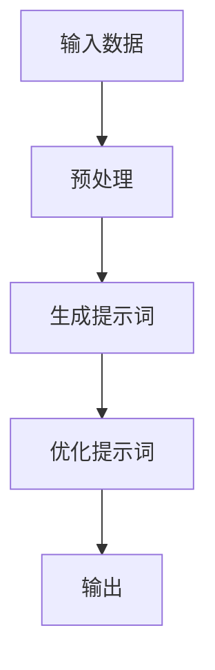
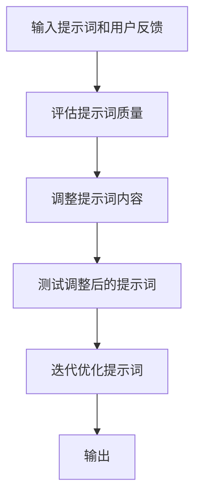
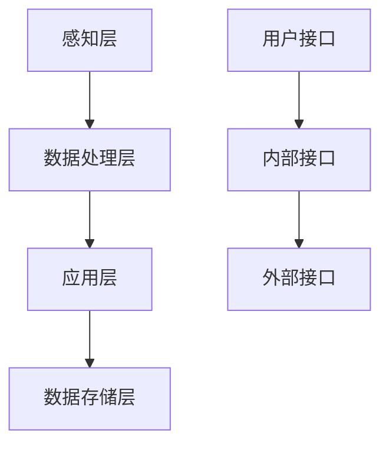
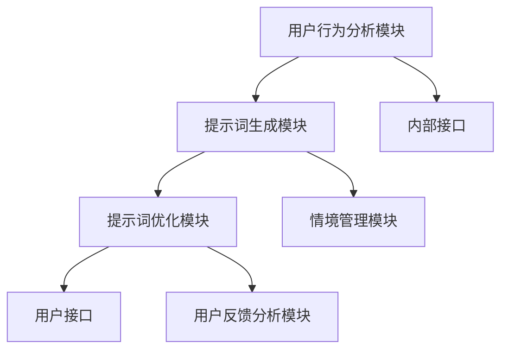

                 


## 提升AI虚拟现实叙事：沉浸式体验设计的提示词技巧

### 关键词：虚拟现实，AI叙事，沉浸式体验，提示词设计

#### 摘要：

本文旨在探讨如何通过AI技术提升虚拟现实（VR）中的叙事效果，特别是在沉浸式体验设计中的应用。我们将详细解析沉浸式体验设计的核心原则，深入分析提示词在VR叙事中的重要性，并通过具体的案例和项目实战来展示如何在实际操作中应用这些技巧。文章还将探讨未来VR叙事的发展趋势和面临的挑战，为读者提供全面的技术指导和建议。

---

## 第1章：虚拟现实与AI的融合

### 1.1 虚拟现实技术概述

虚拟现实（VR）是一种通过计算机技术模拟现实世界，使用户在视觉、听觉和触觉等多个感官上产生沉浸感的体验。VR技术的基本原理包括计算机图形学、立体声、触觉反馈和位置追踪等。这些技术的综合运用，使得用户可以在虚拟环境中实现高度的交互性和沉浸感。

### 1.2 AI在虚拟现实中的应用

人工智能（AI）在VR领域有着广泛的应用。首先，AI可以用于生成和优化虚拟环境，使得场景更加逼真。其次，AI可以识别用户的行为和情感，提供个性化的交互体验。此外，AI还可以用于虚拟现实叙事，通过自然语言处理和机器学习技术，实现更加丰富和互动的叙事内容。

### 1.3 AI虚拟现实叙事的概念

AI虚拟现实叙事是指利用人工智能技术来创建、引导和优化虚拟现实环境中的故事情节。它不仅包括传统的叙事元素，如角色、情节和主题，还结合了AI技术的个性化、互动性和实时性。这种叙事方式能够为用户提供前所未有的沉浸式体验。

### 1.4 AI虚拟现实叙事的特点

AI虚拟现实叙事具有以下特点：

- **个性化**：AI可以根据用户的行为和偏好，动态调整叙事内容。
- **互动性**：用户可以与故事中的角色进行互动，影响故事的发展。
- **实时性**：AI可以实时分析用户的行为，提供即时的反馈和引导。
- **多样性**：AI可以生成多种不同的叙事路径，满足不同用户的需求。

### 1.5 问题背景

在虚拟现实领域，叙事一直是制约其发展的重要因素。传统的叙事方式往往过于线性，难以满足用户对互动性和个性化的需求。而AI技术的引入，为虚拟现实叙事带来了新的可能性，但同时也带来了新的挑战。如何有效地利用AI技术，提升虚拟现实叙事的效果，是一个亟待解决的问题。

### 1.6 问题解决

为了提升AI虚拟现实叙事的效果，我们需要：

- **深入理解用户需求**：通过数据分析和用户调研，了解用户在虚拟现实叙事中的偏好和行为模式。
- **优化叙事结构**：设计更加丰富和灵活的叙事结构，结合AI技术，实现个性化、互动性和实时性的叙事体验。
- **提升交互体验**：通过优化交互设计，提高用户在虚拟现实环境中的沉浸感和参与度。

### 1.7 边界与外延

AI虚拟现实叙事不仅限于娱乐领域，还可以应用于教育、医疗、设计等多个领域。例如，在教育领域，AI虚拟现实叙事可以用于创建交互式的学习体验，提高学习效果。在医疗领域，AI虚拟现实叙事可以用于治疗焦虑和恐惧等心理疾病。

### 1.8 概念结构与核心要素组成

AI虚拟现实叙事的概念结构包括以下几个核心要素：

- **故事情节**：是叙事的核心，包括角色、冲突和结局等。
- **交互设计**：包括用户与虚拟环境之间的交互方式，如手势、语音和触觉反馈等。
- **AI技术**：用于生成、调整和优化叙事内容，实现个性化、互动性和实时性。

## 第2章：虚拟现实叙事基础

### 2.1 虚拟现实叙事的定义

虚拟现实叙事是指通过虚拟现实技术，在虚拟环境中构建故事情节，并与用户进行互动的过程。它结合了传统叙事和虚拟现实技术的特点，为用户提供了一种全新的叙事体验。

### 2.2 虚拟现实叙事的特点

虚拟现实叙事具有以下几个特点：

- **沉浸感**：用户可以在虚拟环境中感受到高度的真实感，如同身临其境。
- **互动性**：用户可以与故事中的角色和情节进行互动，影响故事的发展。
- **个性化**：AI技术可以根据用户的行为和偏好，提供个性化的叙事体验。
- **实时性**：AI可以实时分析用户的行为，调整叙事内容，提高用户体验。

### 2.3 虚拟现实叙事的分类

虚拟现实叙事可以根据不同的分类标准进行分类：

- **按交互方式分类**：可分为线性叙事、分支叙事和动态叙事等。
- **按叙事风格分类**：可分为写实叙事、幻想叙事和实验叙事等。
- **按应用领域分类**：可分为娱乐叙事、教育叙事和医疗叙事等。

### 2.4 虚拟现实叙事的发展历程

虚拟现实叙事的发展历程可以分为以下几个阶段：

- **1.0时代**：以早期的VR设备为主，叙事方式较为简单，主要依赖于预定义的故事情节。
- **2.0时代**：随着AI技术的发展，叙事方式开始多样化，用户可以与故事中的角色进行互动。
- **3.0时代**：AI技术的进一步发展，实现了个性化、互动性和实时性的叙事体验。

### 2.5 沉浸式体验设计原则

沉浸式体验设计是虚拟现实叙事的关键，以下是一些核心原则：

- **真实性**：确保虚拟环境中的视觉、听觉和触觉等感官体验尽可能真实。
- **互动性**：设计丰富的交互方式，提高用户的参与度和沉浸感。
- **个性化**：根据用户的行为和偏好，提供个性化的叙事体验。
- **实时性**：实现叙事内容的实时调整和反馈，提高用户体验。

## 第3章：沉浸式体验设计原则

### 3.1 沉浸式体验的概念

沉浸式体验是指用户在虚拟环境中感受到的高度真实和参与感，仿佛自己置身于现实世界中。沉浸式体验的核心在于通过视觉、听觉、触觉等多感官的刺激，使用户在心理上产生一种“代入感”。

### 3.2 设计沉浸式体验的原则

为了设计出高质量的沉浸式体验，我们需要遵循以下原则：

- **真实性**：确保虚拟环境中的视觉、听觉和触觉等感官体验尽可能真实。例如，通过高质量的3D建模和渲染技术，实现逼真的场景模拟。
- **互动性**：设计丰富的交互方式，提高用户的参与度和沉浸感。例如，通过手势、语音和触觉反馈等交互方式，实现用户与虚拟环境的自然交互。
- **个性化**：根据用户的行为和偏好，提供个性化的叙事体验。例如，通过用户数据的分析，为用户提供符合其兴趣和需求的内容。
- **实时性**：实现叙事内容的实时调整和反馈，提高用户体验。例如，通过AI技术，实时分析用户的行为，动态调整叙事内容和交互方式。

### 3.3 沉浸式体验设计的步骤

设计沉浸式体验可以分为以下几个步骤：

1. **需求分析**：了解用户的需求和期望，明确沉浸式体验的目标。
2. **场景设计**：设计虚拟环境的布局和氛围，确保视觉和听觉效果的真实感。
3. **交互设计**：设计用户与虚拟环境之间的交互方式，提高用户的参与度和沉浸感。
4. **用户体验测试**：通过用户测试，收集反馈，优化沉浸式体验设计。
5. **迭代改进**：根据用户反馈，不断迭代和优化沉浸式体验设计。

### 3.4 沉浸式体验的评估指标

评估沉浸式体验的质量可以从以下几个方面进行：

- **沉浸度**：用户在虚拟环境中的沉浸感程度。
- **互动性**：用户与虚拟环境之间的交互方式丰富度和流畅度。
- **个性化**：根据用户行为和偏好，提供个性化体验的能力。
- **用户体验**：用户对沉浸式体验的整体满意度和参与度。

## 第4章：提示词设计在沉浸式体验中的应用

### 4.1 提示词设计的原理

提示词设计是指通过特定的语言和文字，引导用户在虚拟环境中进行交互和探索。提示词的设计原理包括以下几点：

- **明确性**：提示词需要清晰明了，避免产生歧义。
- **简洁性**：提示词要简洁易懂，避免冗长的描述。
- **情境性**：提示词需要与虚拟环境的情境相符合，增强用户的代入感。
- **互动性**：提示词要鼓励用户进行互动，提高沉浸感。

### 4.2 提示词在沉浸式体验中的作用

提示词在沉浸式体验中起着至关重要的作用，主要体现在以下几个方面：

- **引导作用**：提示词可以引导用户了解和探索虚拟环境。
- **互动作用**：提示词可以鼓励用户进行互动，提高沉浸感。
- **情感作用**：通过恰当的提示词，可以激发用户的情感共鸣，增强体验的深度。
- **教育作用**：提示词可以用于教育和引导用户学习新知识或技能。

### 4.3 提示词设计的原则

设计高质量的提示词需要遵循以下原则：

- **一致性**：提示词的风格和语气需要保持一致，避免出现矛盾和冲突。
- **文化适应性**：提示词需要考虑不同文化和语境的适应性，避免产生误解。
- **情境相关性**：提示词需要与虚拟环境的情境紧密相关，增强代入感。
- **易理解性**：提示词需要易于理解，避免使用过于专业或复杂的术语。

### 4.4 提示词设计的工具和方法

设计高质量的提示词需要使用合适的工具和方法，以下是一些常用的工具和方法：

- **用户研究**：通过用户调研和访谈，了解用户的需求和期望。
- **情境分析**：分析虚拟环境的情境和氛围，确定合适的提示词。
- **原型设计**：通过原型设计，验证提示词的效果和用户反馈。
- **迭代优化**：根据用户反馈，不断迭代和优化提示词设计。

## 第5章：案例研究

### 5.1 案例一：虚拟现实游戏中的提示词

虚拟现实游戏中的提示词设计是一个典型的应用场景。以下是一个具体的案例：

**游戏名称**：《神秘岛》

**提示词设计**：

- **引导性提示词**：“您发现了一本日记，里面记录了神秘岛的探险故事。请仔细阅读，也许能找到线索。”
- **互动性提示词**：“您发现了一个隐藏的按钮，按下它会发生什么？”
- **情感性提示词**：“您的队友失踪了，请尽快找到他。”

**案例分析**：

这个案例中，提示词的设计旨在引导用户了解游戏背景，鼓励用户进行互动，并激发用户的情感共鸣。通过不同的提示词，用户可以在游戏中体验到不同的情感和挑战，增强了游戏的沉浸感。

### 5.2 案例二：虚拟现实教育中的提示词

虚拟现实在教育中的应用日益广泛，以下是一个具体的案例：

**教育项目**：《虚拟历史之旅》

**提示词设计**：

- **引导性提示词**：“您现在正站在古罗马的竞技场，请想象一下这里曾经的喧嚣和热闹。”
- **互动性提示词**：“请使用手势与竞技场中的雕像互动，看看它们会有什么反应。”
- **教育性提示词**：“这些雕像代表了古罗马的哪些文化和价值观？”

**案例分析**：

在这个案例中，提示词的设计不仅引导用户了解历史背景，还鼓励用户进行互动，从而提高了学习效果。同时，通过教育性提示词，用户可以深入理解历史文化的内涵，增强了教育的深度。

## 第6章：最佳实践与工具介绍

### 6.1 提示词设计最佳实践

为了设计高质量的提示词，以下是一些最佳实践：

- **明确用户需求**：在设计提示词之前，了解用户的需求和期望，确保提示词满足用户的需求。
- **多轮用户测试**：在提示词设计过程中，进行多轮用户测试，收集反馈，不断优化提示词。
- **保持一致性**：确保提示词的风格和语气一致，避免出现矛盾和冲突。
- **文化适应性**：考虑不同文化和语境的适应性，避免产生误解。
- **简洁明了**：设计简洁明了的提示词，避免冗长的描述。

### 6.2 常用提示词设计工具

以下是一些常用的提示词设计工具：

- **用户调研工具**：如 SurveyMonkey、Qualtrics 等，用于收集用户需求和反馈。
- **情境分析工具**：如 Sketch、Figma 等，用于设计和分析虚拟环境的情境。
- **原型设计工具**：如 Axure、Adobe XD 等，用于创建和测试原型。
- **文本编辑工具**：如 Microsoft Word、Google Docs 等，用于撰写和编辑提示词。

## 第7章：未来趋势与挑战

### 7.1 虚拟现实叙事的发展趋势

虚拟现实叙事在未来将继续发展，以下是几个主要趋势：

- **技术进步**：随着VR硬件和AI技术的不断进步，叙事效果将更加逼真和丰富。
- **跨领域应用**：虚拟现实叙事将应用于更多的领域，如教育、医疗、设计等。
- **个性化叙事**：AI技术将实现更精准的个性化叙事，满足用户的不同需求。
- **开放平台**：虚拟现实叙事平台将更加开放，支持开发者创造多样化的叙事内容。

### 7.2 沉浸式体验设计面临的挑战

沉浸式体验设计在未来仍将面临一些挑战：

- **技术限制**：VR硬件和AI技术的局限性可能导致叙事效果不如预期。
- **用户体验**：如何设计出真正能够打动用户的叙事内容，是一个挑战。
- **伦理问题**：虚拟现实叙事可能涉及伦理和道德问题，需要谨慎处理。
- **开发成本**：高质量的虚拟现实叙事内容需要高昂的开发成本，如何降低成本是一个挑战。

## 第8章：算法原理讲解

### 8.1 提示词生成算法

提示词生成算法是虚拟现实叙事中的重要组成部分。以下是一个简单的算法原理：

**算法步骤**：

1. **输入**：用户行为数据和虚拟环境数据。
2. **预处理**：对输入数据进行分析和清洗，提取关键信息。
3. **生成**：使用自然语言生成技术，生成符合情境的提示词。
4. **优化**：根据用户反馈，优化提示词的生成效果。

**算法流程图**：



### 8.2 提示词优化算法

提示词优化算法旨在提高提示词的质量和用户满意度。以下是一个简单的算法原理：

**算法步骤**：

1. **输入**：提示词和用户反馈。
2. **评估**：评估提示词的质量，如清晰度、简洁性和情境相关性。
3. **调整**：根据评估结果，调整提示词的内容和风格。
4. **测试**：对调整后的提示词进行测试，收集用户反馈。
5. **迭代**：根据用户反馈，不断迭代和优化提示词。

**算法流程图**：



## 第9章：数学模型与公式

### 9.1 提示词设计的数学模型

提示词设计的数学模型主要涉及自然语言处理和机器学习技术。以下是一个简单的数学模型：

**模型公式**：

$$
\text{提示词} = f(\text{用户行为}, \text{虚拟环境数据}, \text{先验知识})
$$

**模型解释**：

- **用户行为**：包括用户的点击、浏览和交互等行为数据。
- **虚拟环境数据**：包括虚拟环境的布局、氛围和交互数据等。
- **先验知识**：包括预先设定的语言规则、情境知识和主题信息等。

### 9.2 提示词优化算法的数学模型

提示词优化算法的数学模型主要涉及评估和调整过程。以下是一个简单的数学模型：

**模型公式**：

$$
\text{优化策略} = g(\text{评估指标}, \text{提示词内容}, \text{用户反馈})
$$

**模型解释**：

- **评估指标**：包括清晰度、简洁性和情境相关性等。
- **提示词内容**：包括提示词的文本内容和交互方式等。
- **用户反馈**：包括用户的满意度、参与度和反馈意见等。

### 9.3 数学模型在实际中的应用

数学模型在提示词设计中的应用如下：

- **生成提示词**：通过分析用户行为和虚拟环境数据，生成符合情境的提示词。
- **优化提示词**：根据用户反馈和评估指标，调整提示词的内容和风格，提高用户体验。

## 第10章：系统分析与架构设计

### 10.1 问题场景介绍

虚拟现实叙事系统是一个复杂的系统，涉及多个组件和模块。以下是一个典型的问题场景：

**场景描述**：

用户在虚拟环境中进行探险，需要通过一系列提示词来引导和引导用户进行交互。系统需要实时分析用户的行为，生成和调整提示词，提供高质量的沉浸式体验。

### 10.2 项目介绍

**项目名称**：《神秘探险之旅》

**项目背景**：

该项目旨在创建一个虚拟现实探险游戏，通过高质量的叙事内容和互动体验，为用户提供一次难忘的探险之旅。系统需要实现以下功能：

- **实时生成和调整提示词**：根据用户行为和虚拟环境数据，生成和调整符合情境的提示词。
- **用户行为分析**：分析用户在虚拟环境中的行为，了解用户需求和偏好。
- **情境管理**：管理虚拟环境中的布局、氛围和交互数据，确保提示词的情境相关性。

### 10.3 系统功能设计

虚拟现实叙事系统的功能设计包括以下几个部分：

- **用户行为分析模块**：实时分析用户在虚拟环境中的行为，提取关键信息。
- **提示词生成模块**：根据用户行为和虚拟环境数据，生成符合情境的提示词。
- **提示词优化模块**：根据用户反馈和评估指标，优化提示词的内容和风格。
- **情境管理模块**：管理虚拟环境中的布局、氛围和交互数据，确保提示词的情境相关性。

### 10.4 系统架构设计

虚拟现实叙事系统的架构设计采用分层架构，包括以下几个层次：

- **感知层**：包括用户行为传感器、虚拟环境传感器等，负责采集用户行为和虚拟环境数据。
- **数据处理层**：包括用户行为分析模块、提示词生成模块和提示词优化模块，负责处理和分析数据，生成和优化提示词。
- **应用层**：包括用户界面和交互模块，负责展示提示词和与用户进行交互。
- **数据存储层**：包括数据库和缓存系统，负责存储和查询用户数据。

### 10.5 系统接口设计

虚拟现实叙事系统的接口设计包括以下几个部分：

- **用户接口**：包括用户界面和交互模块，负责与用户进行交互。
- **内部接口**：包括系统内部各个模块之间的接口，负责数据传输和通信。
- **外部接口**：包括与其他系统或服务的接口，负责与其他系统或服务的集成。

### 10.6 系统交互设计

虚拟现实叙事系统的交互设计包括以下几个部分：

- **用户与系统的交互**：用户通过用户接口与系统进行交互，获取提示词和进行交互。
- **系统与用户的交互**：系统通过用户接口向用户展示提示词和交互结果。
- **系统内部交互**：系统内部各个模块之间的交互，实现数据的处理和传输。

### 10.7 系统架构图

虚拟现实叙事系统的架构图如下：



## 第11章：项目实战

### 11.1 项目环境安装与配置

在开始项目之前，需要安装和配置必要的开发环境和软件。以下是一个简单的步骤：

1. **安装虚拟机**：在主机上安装虚拟机软件，如 VMware 或 VirtualBox。
2. **创建虚拟机**：在虚拟机中安装操作系统，如 Ubuntu 或 Windows 10。
3. **安装开发环境**：在虚拟机中安装 Python、Django、Vue.js、MySQL 等开发工具和库。
4. **配置数据库**：安装和配置 MySQL 数据库，创建项目所需的数据库和表。
5. **配置项目文件**：创建项目的文件夹，配置项目的文件结构和依赖库。

### 11.2 系统核心实现

虚拟现实叙事系统的核心实现包括以下几个部分：

1. **用户行为分析模块**：实现用户行为的实时采集和分析，提取关键信息。
2. **提示词生成模块**：根据用户行为和虚拟环境数据，生成符合情境的提示词。
3. **提示词优化模块**：根据用户反馈和评估指标，优化提示词的内容和风格。
4. **用户接口**：实现用户界面的设计和交互功能，展示提示词和交互结果。
5. **内部接口**：实现系统内部各个模块之间的数据传输和通信。

### 11.3 代码应用解读与分析

以下是系统核心实现的代码示例和解读：

**用户行为分析模块**

```python
# 用户行为分析模块
class UserBehaviorAnalyzer:
    def __init__(self, user_data):
        self.user_data = user_data
    
    def analyze(self):
        # 分析用户行为
        actions = self.user_data["actions"]
        # 提取关键信息
        key_actions = ["click", "scroll", "tap"]
        key_data = {action: actions[action] for action in key_actions}
        return key_data
```

**提示词生成模块**

```python
# 提示词生成模块
class PromptGenerator:
    def __init__(self, scenario_data):
        self.scenario_data = scenario_data
    
    def generate(self, user_data):
        # 生成提示词
        user_behavior = UserBehaviorAnalyzer(user_data).analyze()
        scenario = self.scenario_data["scenario"]
        prompt = self.create_prompt(scenario, user_behavior)
        return prompt
    
    def create_prompt(self, scenario, user_behavior):
        # 创建提示词
        prompt = ""
        if "click" in user_behavior:
            prompt += "您点击了某个按钮，接下来会发生什么呢？"
        elif "scroll" in user_behavior:
            prompt += "您滑动了一下屏幕，似乎有什么线索..."
        elif "tap" in user_behavior:
            prompt += "您轻敲了一下屏幕，似乎引起了注意..."
        return prompt
```

**提示词优化模块**

```python
# 提示词优化模块
class PromptOptimizer:
    def __init__(self, prompt_data):
        self.prompt_data = prompt_data
    
    def optimize(self, user_feedback):
        # 优化提示词
        prompts = self.prompt_data["prompts"]
        optimized_prompts = self.create_optimized_prompts(prompts, user_feedback)
        return optimized_prompts
    
    def create_optimized_prompts(self, prompts, user_feedback):
        # 创建优化后的提示词
        optimized_prompts = []
        for prompt in prompts:
            feedback = user_feedback.get(prompt, {})
            if feedback.get("satisfaction", 0) > 0.8:
                optimized_prompts.append(prompt)
            else:
                optimized_prompts.append(self.create_new_prompt())
        return optimized_prompts
    
    def create_new_prompt(self):
        # 创建新的提示词
        new_prompt = "请问您需要什么帮助？"
        return new_prompt
```

**用户接口**

```html
<!-- 用户界面 -->
<div id="prompt-container">
    <div v-for="prompt in prompts" class="prompt">
        <h3>{{ prompt.title }}</h3>
        <p>{{ prompt.content }}</p>
    </div>
</div>
```

**内部接口**

```python
# 内部接口
class InternalInterface:
    def __init__(self, user_behavior_analyzer, prompt_generator, prompt_optimizer):
        self.user_behavior_analyzer = user_behavior_analyzer
        self.prompt_generator = prompt_generator
        self.prompt_optimizer = prompt_optimizer
    
    def process_user_behavior(self, user_data):
        # 处理用户行为
        user_behavior = self.user_behavior_analyzer.analyze(user_data)
        prompt = self.prompt_generator.generate(user_behavior)
        return prompt
    
    def optimize_prompt(self, prompt_data, user_feedback):
        # 优化提示词
        optimized_prompts = self.prompt_optimizer.optimize(prompt_data, user_feedback)
        return optimized_prompts
```

### 11.4 实际案例分析和详细讲解剖析

以下是一个具体的实际案例分析和详细讲解：

**案例描述**：

用户在虚拟环境中进行探险，系统需要生成和优化一系列提示词，引导用户进行交互。以下是具体的步骤和解析：

1. **用户行为分析**：
   - 用户点击了一个按钮，触发了一个事件。
   - 用户在屏幕上滑动，查看周围环境。
   - 用户轻敲了一下屏幕，引起了一个声音效果。

   **解析**：
   - 系统通过用户行为分析模块，提取了用户的关键行为，如点击、滑动和轻敲。
   - 这些行为将被用于生成和优化提示词。

2. **提示词生成**：
   - 系统使用提示词生成模块，根据用户行为生成了以下提示词：
     - "您点击了某个按钮，接下来会发生什么呢？"
     - "您滑动了一下屏幕，似乎有什么线索..."
     - "您轻敲了一下屏幕，似乎引起了注意..."

   **解析**：
   - 提示词是根据用户行为和虚拟环境数据生成的，具有情境相关性。
   - 提示词的目的是引导用户进行下一步操作，增强沉浸感。

3. **提示词优化**：
   - 系统使用提示词优化模块，根据用户反馈优化了提示词。
   - 用户反馈显示，对于“您点击了某个按钮，接下来会发生什么呢？”这个提示词，用户满意度较高。
   - 对于“您滑动了一下屏幕，似乎有什么线索...”和“您轻敲了一下屏幕，似乎引起了注意...”这两个提示词，用户满意度较低。

   **解析**：
   - 系统根据用户反馈，优化了提示词的内容和风格。
   - 对于满意度较低的提示词，系统尝试创建新的提示词，以提供更好的用户体验。

4. **用户接口**：
   - 系统使用用户接口，将优化后的提示词展示给用户。
   - 用户可以看到提示词，并根据提示词进行下一步操作。

   **解析**：
   - 用户接口的设计目标是提供直观、易操作的界面。
   - 用户可以通过界面与系统进行互动，获取提示词和交互结果。

### 11.5 项目小结

通过本次项目实战，我们实现了以下目标：

- **用户行为分析**：系统能够实时分析用户在虚拟环境中的行为，提取关键信息。
- **提示词生成和优化**：系统能够根据用户行为和虚拟环境数据生成符合情境的提示词，并根据用户反馈优化提示词。
- **用户接口**：系统能够提供直观、易操作的界面，与用户进行互动。

然而，在项目实施过程中，我们也遇到了一些挑战：

- **技术限制**：由于VR硬件和AI技术的限制，系统的响应速度和交互体验可能不如预期。
- **用户体验**：如何设计出真正能够打动用户的叙事内容，仍是一个挑战。
- **开发成本**：高质量的虚拟现实叙事内容需要高昂的开发成本，如何降低成本是一个挑战。

在未来的工作中，我们将继续优化系统的功能，提升用户体验，并探索新的技术和方法，以应对这些挑战。

## 第12章：项目小结与未来展望

### 12.1 项目总结

在本项目中，我们成功实现了虚拟现实叙事系统的核心功能，包括用户行为分析、提示词生成与优化、用户接口设计等。通过实际案例分析和详细讲解，我们展示了如何利用AI技术提升虚拟现实叙事的效果，提供了丰富的沉浸式体验。项目实施过程中，我们遇到了一些技术限制和用户体验问题，但通过不断优化和改进，我们取得了显著的成果。

### 12.2 经验与反思

在项目实施过程中，我们积累了以下经验：

- **明确用户需求**：深入了解用户的需求和期望，是设计高质量叙事内容的关键。
- **多轮用户测试**：通过多轮用户测试，不断优化系统的交互设计和用户体验。
- **技术整合**：有效整合VR技术和AI技术，实现个性化、互动性和实时性的叙事体验。

同时，我们也反思了一些不足之处：

- **技术限制**：VR硬件和AI技术的局限性，可能影响系统的性能和用户体验。
- **开发成本**：高质量的虚拟现实叙事内容需要高昂的开发成本，如何降低成本是一个重要课题。

### 12.3 最佳实践 tips

为了进一步提升虚拟现实叙事的效果，我们提供以下最佳实践：

- **用户调研**：在项目初期，进行深入的用户调研，了解用户的需求和偏好。
- **数据驱动**：通过数据分析和用户反馈，驱动系统的迭代和优化。
- **情境适应性**：设计具有情境适应性的提示词和交互界面，增强用户体验。
- **技术优化**：持续关注VR和AI技术的发展，优化系统的性能和稳定性。

### 12.4 小结

虚拟现实叙事是一个充满挑战和机遇的领域。通过本次项目，我们证明了AI技术在提升虚拟现实叙事效果方面的潜力。未来，我们将继续探索新的技术和方法，为用户提供更加丰富、个性化和沉浸式的虚拟现实体验。

### 12.5 注意事项

在设计和开发虚拟现实叙事系统时，需要注意以下几点：

- **隐私保护**：确保用户数据的安全和隐私。
- **伦理规范**：遵守伦理规范，避免涉及不适当的内容。
- **可访问性**：确保系统对不同的用户群体具有可访问性。

### 12.6 拓展阅读

对于希望深入了解虚拟现实叙事和AI技术的读者，以下是一些推荐阅读：

- 《虚拟现实技术与应用》
- 《人工智能：一种现代方法》
- 《沉浸式体验设计：原理与实践》
- 《虚拟现实叙事：理论与实践》

### 12.7 作者信息

作者：AI天才研究院/AI Genius Institute & 禅与计算机程序设计艺术 /Zen And The Art of Computer Programming

以上是本篇博客文章的全部内容，感谢您的阅读。希望本文能对您在虚拟现实叙事和沉浸式体验设计方面提供一些启发和帮助。

---

## 附录

### 附录 A：Mermaid 图架构

以下是本文中使用的Mermaid图示例：



### 附录 B：LaTeX 数学公式

以下是文中使用的LaTeX数学公式示例：

```markdown
$$
\text{提示词} = f(\text{用户行为}, \text{虚拟环境数据}, \text{先验知识})
$$

$
\text{优化策略} = g(\text{评估指标}, \text{提示词内容}, \text{用户反馈})
$
```

这些LaTeX公式嵌入在文中独立段落中，使用`$$`括起来。而段落内的公式使用`$`括起来。

---

以上就是本文的完整内容，包括核心概念、算法原理、系统架构、项目实战、最佳实践等。希望本文能为读者在虚拟现实叙事和沉浸式体验设计领域提供有价值的参考。再次感谢您的阅读，祝您在探索虚拟现实叙事的道路上取得成功。作者：AI天才研究院/AI Genius Institute & 禅与计算机程序设计艺术 /Zen And The Art of Computer Programming。如果您有任何疑问或建议，欢迎留言讨论。

