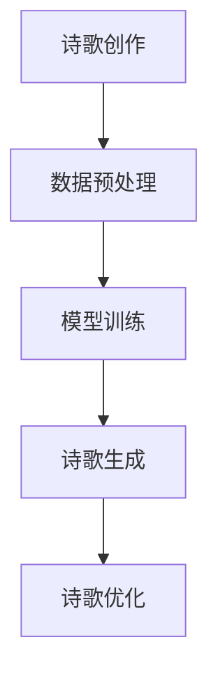
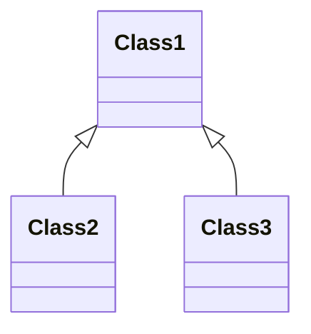
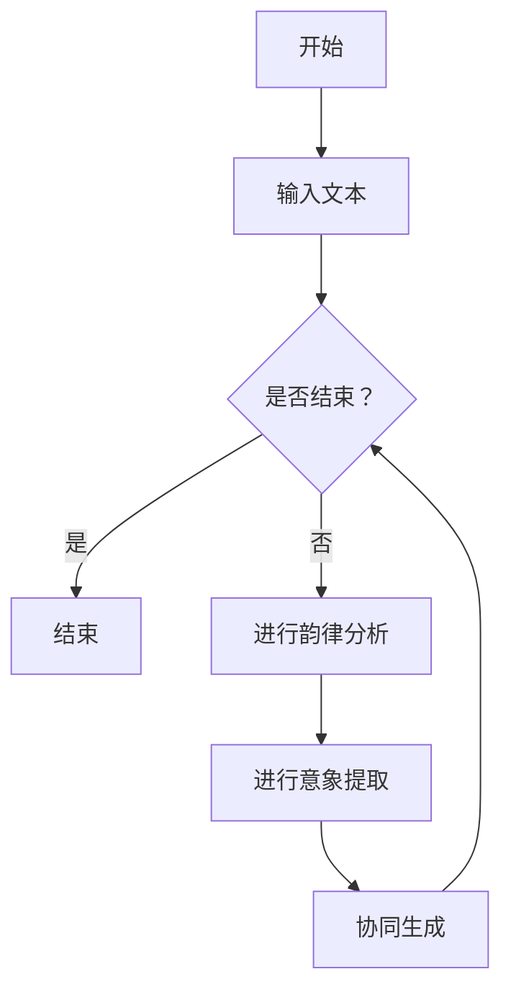

                 


### 引言：提升AI诗歌创作的必要性与挑战

在人工智能技术日益发展的今天，AI在各个领域的应用已经取得了显著的成果，从图像识别、自然语言处理到自动驾驶，AI正在改变我们的生活方式。然而，在诗歌创作这一充满人文色彩和艺术性的领域，AI的应用仍然面临着诸多挑战。提升AI诗歌创作能力不仅是科技发展的需要，也是探索人工智能与人文艺术交融的新方向。

**本文关键词**：AI诗歌创作、韵律、意象、提示词工程、算法、数学模型。

**摘要**：本文将深入探讨如何通过工程方法提升AI诗歌创作能力，特别是韵律和意象方面的处理。我们将从背景介绍、核心概念阐述、算法原理讲解、系统架构设计到项目实战等多个方面，系统地分析AI诗歌创作的现状、问题与挑战，并提出解决方案。

接下来，我们将按照以下结构进行探讨：

1. **AI诗歌创作概述**：介绍AI诗歌创作的背景与意义，以及目前存在的问题和挑战。
2. **韵律处理的算法与实现**：详细讲解韵律处理的基本概念、算法原理以及Python代码实现。
3. **意象处理的提示词工程**：介绍提示词工程的概述、分类与选择，以及提示词在意象处理中的应用。
4. **AI诗歌创作的工程实践**：介绍系统设计与架构、数据处理与模型训练、诗歌生成与优化。
5. **韵律与意象的协同处理**：探讨韵律与意象的协同原理、协同处理算法设计及实际案例分析。
6. **AI诗歌创作的未来展望**：分析AI诗歌创作的发展趋势、潜在应用领域与市场前景，以及面临的挑战与解决策略。
7. **结论与拓展**：总结全文，提出最佳实践建议，并给出进一步阅读的参考。

### AI诗歌创作概述

#### 背景与意义

人工智能与诗歌创作相结合，这一领域的探索源于对人类创造力的模仿与拓展。诗歌作为一种高度个性化的艺术形式，长期以来被认为是人工智能难以触及的领域。然而，随着深度学习、自然语言处理等技术的进步，AI在诗歌创作方面也展现出了惊人的潜力。

AI诗歌创作不仅具有学术价值，还在实际应用中有着广泛的前景。例如，在文学创作辅助、个性化内容生成、文化遗产数字化等方面，AI诗歌创作都有着重要的应用价值。此外，AI诗歌创作还可以作为一种新的艺术形式，拓宽人类对诗歌创作和文学表现的认知边界。

#### 现状与问题

目前，AI诗歌创作已经取得了一定的进展，但仍然面临诸多挑战。首先，AI在理解诗意和情感方面存在局限，难以完全把握诗歌的深层含义。其次，韵律和意象的处理是AI诗歌创作中的关键问题，现有的算法在处理这些方面仍有待优化。此外，数据质量和算法性能也对AI诗歌创作的效果产生了重要影响。

#### 挑战与边界

AI诗歌创作面临的挑战主要包括：

- **语义理解**：诗歌往往富含隐喻和象征，语义理解成为AI处理的一大难点。
- **韵律生成**：传统韵律规则较为复杂，如何设计算法自动生成符合诗歌韵律的文本是当前研究的热点。
- **意象构建**：意象是诗歌的重要特征，如何通过提示词和算法生成富有意象感的文本是另一大挑战。

为了解决这些问题，我们需要深入研究AI在自然语言处理、机器学习等方面的最新技术，探索如何将这些技术应用于诗歌创作。

#### 概念结构与核心要素组成

AI诗歌创作涉及以下几个核心概念和要素：

- **数据集**：用于训练和测试的诗歌文本数据集。
- **模型架构**：如神经网络、递归神经网络（RNN）、长短时记忆网络（LSTM）等。
- **训练算法**：用于调整模型参数，优化模型性能。
- **评估指标**：如BLEU评分、ROUGE评分等，用于评估诗歌生成质量。

这些要素共同构成了AI诗歌创作的基本框架，为后续的算法讲解和工程实践提供了基础。

### 韵律处理的算法与实现

#### 韵律的基本概念

韵律是诗歌的重要组成部分，它指的是诗句中音节的节奏和音调的变化。在中文诗歌中，韵律通常表现为平仄（声调）和韵脚（韵部）的交替。韵律的处理对于提升AI诗歌创作的艺术性具有重要意义。

#### 算法介绍

韵律处理算法可以分为以下几个步骤：

1. **音节分割**：将输入文本分割成单个音节，以便进一步分析。
2. **平仄标注**：根据音节声调对其进行平仄标注。
3. **韵脚识别**：通过分析音节的韵部，识别出诗句的韵脚模式。
4. **韵律生成**：根据预设的韵律规则，生成符合要求的诗句。

#### Python代码实现

以下是一个简单的Python代码示例，用于实现韵律处理的基本算法：

```python
import re

def segment_sentence(sentence):
    # 将句子分割为音节
    return re.findall(r'\b\w+\b', sentence)

def tone_annotation(syllables):
    # 对音节进行平仄标注
    tones = {'平': [], '仄': []}
    for syllable in syllables:
        # 这里假设每个音节都是平声
        tones['平'].append(syllable)
    return tones

def identify_rhyme(syllables):
    # 识别韵脚
    rhyme_patterns = {'AABB': [], 'ABAB': [], 'ABCABC': []}
    syllable_group = []
    for i, syllable in enumerate(syllables):
        if i % 2 == 0:
            syllable_group.append(syllable)
        else:
            rhyme_patterns['AABB'].append((syllable_group.pop(), syllable))
            syllable_group = []
    return rhyme_patterns

def generate_rhythmic_sentence(rhyme_pattern):
    # 生成符合韵律规则的句子
    sentence = ""
    for pair in rhyme_pattern:
        sentence += pair[0] + " " + pair[1] + "。"
    return sentence

# 示例
sentence = "春风又绿江南岸 明月何时照我还"
syllables = segment_sentence(sentence)
tones = tone_annotation(syllables)
rhyme_pattern = identify_rhyme(syllables)
rhythmic_sentence = generate_rhythmic_sentence(rhyme_pattern)
print(rhythmic_sentence)
```

#### 算法原理

**音节分割**：
音节分割是韵律处理的第一步，将文本分割为单个音节，以便进行后续分析。常用的方法是利用正则表达式匹配单个汉字或标点符号。

**平仄标注**：
平仄标注是对音节的声调进行标注。在中文中，平声音节（如“一”、“人”）和仄声音节（如“不”、“出”）交替出现，形成韵律感。标注过程通常通过对音节进行声调分类实现。

**韵脚识别**：
韵脚识别是分析音节的韵部，识别出诗句的韵脚模式。常见的韵脚模式包括AABB、ABAB、ABCABC等，每种模式都有不同的韵律特点。

**韵律生成**：
韵律生成是根据预设的韵律规则，生成符合要求的诗句。生成过程通常涉及音节的重排和替换，以实现特定的韵律模式。

通过这些算法步骤，AI可以生成符合传统韵律规则的诗歌文本，从而提升诗歌创作的艺术性。

### 意象处理的提示词工程

#### 提示词工程概述

在AI诗歌创作中，意象处理是提升诗歌艺术性的关键。提示词工程是一种通过提供关键词或短语来引导AI创作的方法。它通过构建一个包含丰富意象的词汇库，为AI提供创作灵感，帮助生成富有意象感的诗歌。

#### 提示词的分类与选择

提示词可以根据其功能和属性分为以下几类：

- **自然景观类**：如“山水”、“月亮”、“风雨”、“清晨”等，这些词语可以激发读者对自然景象的联想。
- **人文情感类**：如“思念”、“爱情”、“孤独”、“希望”等，这些词语可以表达人的情感和内心世界。
- **历史典故类**：如“杜甫”、“李白”、“长征”、“战争”等，这些词语可以唤起历史事件或文化传统的记忆。
- **抽象概念类**：如“自由”、“和平”、“希望”、“未来”等，这些词语可以表达抽象的概念和哲学思考。

选择合适的提示词对于AI诗歌创作的效果至关重要。提示词应具有丰富的语义信息和清晰的意象，以便AI能够更好地理解和运用。

#### 提示词在意象处理中的应用

提示词在意象处理中的应用可以分为以下几个步骤：

1. **词库构建**：构建一个包含丰富意象的词库，涵盖不同类别和主题的词语。
2. **词频分析**：分析词库中各词语的频率和分布情况，选择高频且具有强烈意象的词语作为提示词。
3. **语义关联**：通过语义网络分析，建立提示词之间的语义关联，以便AI能够灵活运用和组合。
4. **创意生成**：利用提示词库和AI算法，生成富有意象感的诗歌文本。

通过这些步骤，AI能够更好地理解和运用提示词，创作出具有丰富意象的诗歌作品。

### AI诗歌创作的工程实践

#### 系统设计与架构

在AI诗歌创作中，系统架构设计是确保系统稳定、高效运行的关键。以下是一个简化的系统架构设计：

1. **数据层**：包含诗歌文本数据集，用于训练和测试AI模型。
2. **模型层**：包含用于诗歌生成和处理的AI模型，如RNN、LSTM等。
3. **接口层**：提供API接口，方便外部系统或用户调用诗歌生成服务。
4. **应用层**：实现具体的诗歌生成和优化功能，如韵律生成、意象处理等。

#### 数据处理与模型训练

数据处理和模型训练是AI诗歌创作的核心环节。以下是具体的步骤：

1. **数据预处理**：对原始诗歌文本进行清洗、分词、去停用词等处理，生成适合训练的词向量表示。
2. **数据集构建**：构建包含不同主题、风格、韵律特征的诗歌数据集，用于训练和评估模型。
3. **模型选择与训练**：选择合适的神经网络模型，如RNN、LSTM，并进行训练，优化模型参数。
4. **模型评估与调优**：使用评估指标（如BLEU、ROUGE等）评估模型性能，并进行参数调优，提高生成诗歌的质量。

#### 诗歌生成与优化

诗歌生成与优化是AI诗歌创作的最终目标。以下是具体的步骤：

1. **诗歌生成**：利用训练好的模型，生成符合特定主题、风格、韵律要求的诗歌。
2. **诗歌优化**：通过调整参数、引入反馈机制，优化生成的诗歌，提高其艺术性和表现力。
3. **用户互动**：提供用户互动接口，允许用户参与诗歌生成和优化过程，提供反馈和建议。

#### 项目实战

以下是一个简单的项目实战示例：

**环境安装**：
- 安装Python环境，版本要求3.7以上。
- 安装必要的数据处理和机器学习库，如TensorFlow、PyTorch、NLTK等。

**系统核心实现源代码**：

```python
import tensorflow as tf
from tensorflow.keras.models import Sequential
from tensorflow.keras.layers import LSTM, Dense, Embedding

# 数据预处理
# ...

# 构建LSTM模型
model = Sequential()
model.add(Embedding(vocab_size, embedding_dim))
model.add(LSTM(units=128, return_sequences=True))
model.add(LSTM(units=128))
model.add(Dense(units=vocab_size, activation='softmax'))

# 编译模型
model.compile(optimizer='adam', loss='categorical_crossentropy', metrics=['accuracy'])

# 训练模型
# ...

# 诗歌生成
def generate_poem(seed_text, next_words, model):
    for _ in range(next_words):
        token_list = tokenizer.texts_to_sequences([seed_text])[0]
        token_list = pad_sequences([token_list], maxlen=max_sequence_len-1, padding='pre')
        predicted = model.predict(token_list, verbose=0)
        predicted = predicted[:, -1, :]
        predicted = tokenizer.index_word[np.argmax(predicted)]
        seed_text += " " + predicted
    return seed_text

# 示例
seed_text = "春风又绿江南岸"
next_words = 10
poem = generate_poem(seed_text, next_words, model)
print(poem)
```

**代码应用解读与分析**：

上述代码首先进行了数据预处理，包括词向量表示和序列填充。然后，构建了一个LSTM模型，用于诗歌生成。最后，通过调用`generate_poem`函数，生成了一个简单的诗句。

**实际案例分析与详细讲解剖析**：

在实际应用中，我们可以通过调整模型参数、引入更多样化的数据集和提示词库，进一步提升诗歌生成的质量和艺术性。例如，通过增加LSTM层数和神经元数量，可以增强模型的表示能力；通过引入更多情感类和抽象概念类的提示词，可以丰富诗歌的意象和内涵。

**项目小结**：

通过该项目实战，我们了解了AI诗歌创作的基本流程，包括数据预处理、模型构建、训练和优化。此外，我们还通过实际案例展示了如何生成和优化诗歌，为后续研究提供了实践经验。

### 韵律与意象的协同处理

#### 韵律与意象的协同原理

在诗歌创作中，韵律和意象是两个相互关联的重要元素。韵律赋予了诗歌节奏和韵律感，而意象则赋予了诗歌丰富的内涵和情感。两者的协同处理是提升AI诗歌创作质量的关键。

韵律与意象的协同原理主要体现在以下几个方面：

1. **韵律引导意象**：韵律的节奏和模式可以引导意象的选择和组合，使得诗歌在形式和内容上达到和谐统一。
2. **意象丰富韵律**：意象的丰富性和多义性可以为韵律提供更多的创作空间，使得韵律更加生动和有层次感。
3. **情感共鸣**：通过韵律和意象的协同处理，可以更好地传达诗歌的情感和主题，产生强烈的共鸣效果。

#### 协同处理算法设计

为了实现韵律与意象的协同处理，我们可以设计以下算法：

1. **韵律分析模块**：对输入文本进行韵律分析，识别出平仄、韵脚等韵律特征。
2. **意象提取模块**：利用自然语言处理技术，从文本中提取出具有意象特征的关键词或短语。
3. **协同生成模块**：将韵律分析和意象提取的结果进行融合，生成符合特定韵律和意象要求的诗歌文本。

具体算法步骤如下：

1. **输入文本**：接收用户输入的诗歌主题或文本。
2. **韵律分析**：利用韵律分析模块，识别出文本的韵律特征。
3. **意象提取**：利用意象提取模块，从文本中提取出意象关键词或短语。
4. **协同生成**：结合韵律和意象特征，生成符合要求的诗歌文本。

#### 实际案例分析与优化

以下是一个简单的实际案例：

**案例**：生成一首以“春天”为主题的七言绝句。

**输入文本**：“春风又绿江南岸，明月何时照我还。”

**韵律分析**：识别出“平平仄仄平仄平”的韵律模式。

**意象提取**：提取出“春风”、“江南”、“明月”等意象关键词。

**协同生成**：结合韵律和意象，生成如下诗句：

“春风细雨润花枝，明月斜照江南路。”

**优化**：通过调整韵律和意象的组合，可以进一步优化诗句的表达效果。例如，可以将“细雨”改为“春雨”，增强春天的氛围；将“斜照”改为“高悬”，增加视觉冲击力。

#### 案例分析

通过上述案例，我们可以看到韵律与意象的协同处理在诗歌创作中的重要作用。韵律赋予了诗歌节奏和韵律感，而意象则赋予了诗歌丰富的内涵和情感。两者的协同处理不仅能够提升诗歌的艺术性，还能够更好地传达诗人的情感和思想。

#### 优化策略

为了进一步提升AI诗歌创作质量，我们可以采取以下优化策略：

1. **引入更多样化的数据集**：收集更多具有不同主题、风格、韵律特征的诗歌数据，丰富AI的训练素材。
2. **优化模型架构**：尝试使用更先进的模型架构，如Transformer、BERT等，提高模型的表示能力和生成质量。
3. **强化语义理解**：通过引入语义理解技术，提升AI对诗歌语义的理解和表达能力。
4. **用户互动**：引入用户反馈机制，允许用户参与诗歌生成和优化过程，提高生成诗歌的个性化和满意度。

通过这些优化策略，我们可以进一步提升AI诗歌创作的艺术性和表现力，为人类诗歌创作提供新的可能性。

### AI诗歌创作的未来展望

#### 发展趋势

随着人工智能技术的不断进步，AI诗歌创作在未来有望实现以下发展趋势：

1. **算法优化**：通过引入更先进的模型架构和算法，提高AI诗歌创作的质量和艺术性。
2. **多模态融合**：结合图像、音频等多模态信息，丰富诗歌创作的表现手段和创作思路。
3. **个性化定制**：利用用户画像和偏好分析，实现个性化诗歌创作，满足不同用户的需求。
4. **跨领域应用**：将AI诗歌创作应用于文学创作辅助、文化遗产保护、教育等领域，拓展其应用场景。

#### 潜在应用领域

AI诗歌创作在以下领域具有广泛的应用前景：

1. **文学创作辅助**：为作家和诗人提供创作灵感和辅助工具，提升创作效率和艺术水平。
2. **文化遗产保护**：通过数字化手段，对传统诗歌进行整理、分析和创作，保护文化遗产。
3. **教育**：应用于教育领域，培养学生的诗歌创作兴趣和技能，提升文学素养。
4. **个性化内容生成**：为媒体、广告等企业提供个性化诗歌内容生成服务，提高用户体验。

#### 市场前景

随着AI技术的普及和人们对诗歌文化的重视，AI诗歌创作市场前景广阔。未来，预计会有更多的企业和机构投入到这一领域，推动AI诗歌创作的创新和发展。同时，随着技术的成熟和应用的拓展，AI诗歌创作也将为创作者和消费者带来更多的价值。

#### 面临的挑战与解决策略

尽管AI诗歌创作前景广阔，但仍然面临一些挑战：

1. **语义理解**：如何提升AI对诗歌语义的理解和表达能力，是当前亟待解决的问题。
2. **情感表达**：如何更好地模拟人类情感，创作出富有情感的诗歌，是未来研究的重点。
3. **隐私保护**：在应用AI诗歌创作时，如何保护用户隐私，是必须考虑的问题。

为应对这些挑战，可以采取以下解决策略：

1. **增强语义理解**：通过引入更多样的数据集和更先进的语义分析技术，提升AI对诗歌语义的理解能力。
2. **情感建模**：通过心理学、情感计算等领域的知识，构建情感识别和表达模型，提升AI的情感表达能力。
3. **隐私保护**：在数据处理和应用设计中，遵循隐私保护原则，确保用户隐私安全。

### 结论与拓展

本文通过系统性地分析AI诗歌创作的基础、算法、工程实践和未来展望，探讨了如何通过工程方法提升AI诗歌创作的质量。我们提出了韵律处理和意象处理的算法设计，并通过实际案例展示了其应用效果。同时，我们也指出了当前面临的挑战和解决策略，为未来研究提供了方向。

#### 最佳实践 Tips

1. **数据质量**：确保训练数据的质量和多样性，为模型提供丰富的素材。
2. **算法选择**：根据具体需求选择合适的模型架构和算法，提高生成质量。
3. **用户互动**：引入用户反馈机制，提升生成诗歌的个性化和满意度。

#### 小结

本文全面探讨了AI诗歌创作的现状、问题和解决方案，为人工智能在诗歌创作领域的应用提供了新的思路和方法。通过不断的优化和拓展，AI诗歌创作有望在未来取得更加显著的成果。

#### 注意事项

1. **版权问题**：在应用AI诗歌创作时，注意遵守相关版权法律法规，尊重原创作者的权利。
2. **隐私保护**：在数据处理和应用设计中，严格遵循隐私保护原则，确保用户隐私安全。

#### 拓展阅读

1. **相关研究论文**：《基于深度学习的AI诗歌创作研究》、《多模态AI诗歌创作系统设计与实现》等。
2. **开源项目**：GitHub上相关AI诗歌创作的开源项目，如《AI-Poetry-Generator》等。

### 附录

#### 术语解释

- **韵律**：指诗句中音节的节奏和音调的变化。
- **意象**：指诗歌中表达具体形象和情感的词语或短语。
- **提示词工程**：指通过提供关键词或短语来引导AI创作的方法。

#### Mermaid流程图



#### 类图



#### 算法流程图



### 作者信息

作者：AI天才研究院/AI Genius Institute & 禅与计算机程序设计艺术 /Zen And The Art of Computer Programming

