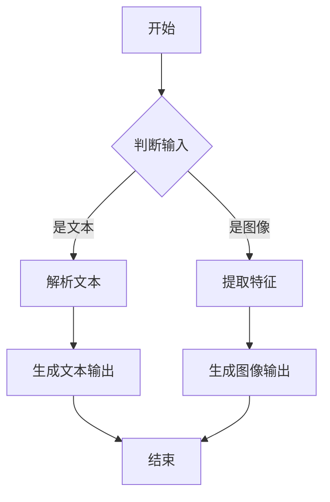

                 


### 第一部分：背景介绍

#### 1.1 问题背景

随着人工智能技术的发展，越来越多的领域开始应用AI技术，从自然语言处理到图像识别，从推荐系统到自动驾驶，AI正在改变我们的生活方式。然而，尽管AI技术在各个领域取得了显著成果，但AI的输出质量仍然面临诸多问题。

首先，AI模型的输出常常存在泛化能力不足的问题。这意味着模型在一个特定的训练集上表现良好，但在新的、未见过的情况下表现不佳。例如，一个训练在猫的图像上的图像识别模型，在处理狗的图像时可能会出现误判。

其次，AI模型的输出缺乏一致性。即使是同一个问题，不同的模型或同一个模型在不同的时间点给出的答案也可能不一致，这给用户带来了困惑和不便。

最后，零样本学习（Zero-Shot Learning）和跨模态学习（Cross-Modal Learning）等新兴领域也对AI的输出质量提出了更高的要求。传统的AI模型往往依赖于大量的标注数据进行训练，而在零样本学习和跨模态学习中，训练数据往往非常有限，甚至完全没有。这就需要AI模型具备更强的泛化能力和一致性。

#### 1.2 核心概念与联系

为了解决上述问题，我们需要引入三个核心概念：思维链、Self-Consistency和Zero-Shot。

**思维链**是一种基于人类思维模式的算法设计方法，它通过构建一系列逻辑推理步骤，使得AI模型能够像人类一样进行复杂的思考。思维链的核心特点是能够将不同的知识和信息进行整合，从而生成高质量的输出。

**Self-Consistency**则是一种通过对比不同时间点或不同模型的输出，来确保AI模型的一致性的机制。这种机制能够有效地减少模型输出中的随机性，提高输出的一致性和可靠性。

**Zero-Shot**是一种能够让AI模型在没有见过的新类别或模态下进行学习和输出的能力。这种能力在处理零样本学习和跨模态学习问题时尤为重要。

这三个概念之间的联系在于，它们都是为了提高AI的输出质量。思维链提供了高质量的输出基础，Self-Consistency保证了输出的可靠性，而Zero-Shot则使得AI模型能够适应更广泛的场景。

#### 1.3 边界与外延

虽然这三个概念都旨在提高AI的输出质量，但它们也有各自的适用范围和限制条件。

**思维链**适用于需要复杂推理和知识整合的领域，如自然语言处理和智能问答。然而，它对计算资源的需求较高，因此在大规模数据处理时可能不太适用。

**Self-Consistency**适用于需要高一致性输出的场景，如智能客服和推荐系统。然而，它可能无法完全解决模型输出中的随机性，因此需要与其他技术结合使用。

**Zero-Shot**适用于需要零样本学习或跨模态学习的场景，如医学影像分析和多模态信息检索。然而，它的实现通常依赖于大量的预训练数据和复杂的模型架构。

#### 1.4 概念结构与核心要素组成

**思维链**的核心要素包括逻辑推理步骤、知识库和推理引擎。逻辑推理步骤是思维链的基础，它通过一系列的推理操作，将输入的信息转化为有意义的输出。知识库则包含了大量的先验知识，这些知识可以用来指导推理过程。推理引擎则是思维链的核心，它负责执行推理操作，生成输出。

**Self-Consistency**的核心要素包括模型输出、验证集和对比算法。模型输出是Self-Consistency的目标，验证集则是用来对比模型输出的一致性。对比算法则是Self-Consistency的关键，它通过对比不同时间点或不同模型的输出，来评估输出的一致性。

**Zero-Shot**的核心要素包括预训练模型、分类器和未知类别。预训练模型是Zero-Shot的基础，它通过大量的预训练数据，学习到丰富的知识。分类器则是Zero-Shot的核心，它负责将新的类别或模态映射到预训练模型的知识中。未知类别则是Zero-Shot需要处理的难点，它要求模型能够适应新的、未见过的情况。

#### 1.5 本章小结

在本章中，我们介绍了AI输出质量问题的重要性，以及解决这一问题的三个核心法宝：思维链、Self-Consistency和Zero-Shot。我们详细分析了这三个概念的定义、原理、适用范围和核心要素。通过本章的介绍，读者应该对AI输出质量提升有了更深入的理解，为后续章节的深入学习打下了基础。

---

### 1.6 接下来我们将详细探讨思维链的原理、数学模型和算法实现，以及其在AI应用中的实际案例，帮助读者全面了解思维链这一提升AI输出质量的重要工具。

---

----------------------------------------------------------------

---

# **第二部分：思维链**

**思维链**是一种将人类思维模式应用于算法设计的方法，它通过一系列逻辑推理步骤，使得AI模型能够像人类一样进行复杂的思考。这一部分我们将详细探讨思维链的原理、数学模型和算法实现，以及其在AI应用中的实际案例。

## **2.1 思维链原理**

**思维链**的定义：思维链是一种将知识库中的信息通过逻辑推理步骤有序连接起来的方法，从而实现从输入到输出的转换。

**思维链的运作机制**：

1. **输入阶段**：接收外部输入信息，如文本、图像或声音。
2. **知识库阶段**：将输入信息与知识库中的知识进行匹配和关联。
3. **推理阶段**：通过逻辑推理步骤，将输入信息和知识库中的知识转化为有意义的输出。
4. **输出阶段**：生成最终输出，如回答问题、生成文本或分类结果。

**思维链的核心特征**：

1. **逻辑推理**：思维链的核心在于其逻辑推理能力，能够处理复杂的、层次化的信息。
2. **知识整合**：思维链能够将不同来源的知识进行整合，从而生成更全面、准确的输出。
3. **可扩展性**：思维链可以轻松地添加新的知识和推理步骤，以适应不同的应用场景。

## **2.2 数学模型与算法讲解**

**数学模型**：

思维链的数学模型可以表示为：

$$
\text{思维链模型} = f(\text{输入}, \text{知识库}, \text{推理引擎})
$$

其中，`f` 表示逻辑推理函数，它负责将输入信息与知识库中的知识进行关联和推理。

**Python算法实现**：

下面是一个简单的思维链算法实现的Python示例：

```python
# 思维链算法实现示例

# 输入信息
input_info = "我今天要去看电影。"

# 知识库
knowledge_base = {
    "今天": "表示时间",
    "看电影": "表示活动",
    "电影": "表示娱乐"
}

# 推理引擎
def reasoning(input_info, knowledge_base):
    # 分词
    words = input_info.split(" ")
    
    # 推理
    result = []
    for word in words:
        if word in knowledge_base:
            result.append(knowledge_base[word])
    
    return " ".join(result)

# 执行推理
output = reasoning(input_info, knowledge_base)
print(output)
```

**算法举例说明**：

在这个示例中，输入信息是 "我今天要去看电影。"，知识库包含了 "今天"、"看电影" 和 "电影" 这三个词的描述。通过推理引擎，我们得到了输出 "表示时间 表示活动 表示娱乐"。这个输出表示了输入信息的逻辑结构，帮助用户理解输入内容的含义。

## **2.3 应用与案例**

**思维链在AI写作中的应用**：

思维链在AI写作中有着广泛的应用。例如，在生成新闻报道时，思维链可以帮助自动构建新闻结构，确保新闻内容的连贯性和逻辑性。通过整合新闻素材和知识库，思维链可以生成高质量的新闻稿件。

**思维链在智能客服中的应用**：

在智能客服领域，思维链可以帮助系统理解用户的查询意图，并提供准确的回答。通过分析用户的问题和知识库中的信息，思维链可以生成自然的、符合用户需求的回答。

**案例分析**：

以下是一个思维链在智能客服中的应用案例：

用户查询： "我想要预订一个去北京的机票。"
知识库：包含航班信息、机场信息、航空公司信息等。
输出： "您可以选择搭乘XX航空公司的航班，从XX机场出发，到达北京。航班时间为XX，票价为XX元。请问您需要预订吗？"

在这个案例中，思维链通过分析用户查询和知识库中的信息，生成了一个自然、准确的回答。

## **2.4 本章小结**

在本章中，我们详细介绍了思维链的原理、数学模型和算法实现，并通过实际案例展示了其在AI应用中的重要性。思维链作为一种高效的AI输出质量提升工具，其逻辑推理和知识整合能力为AI模型提供了强大的支持。

---

**接下来，我们将探讨Self-Consistency机制的原理、数学模型和算法实现，以及其在文本生成和图像识别中的应用。**

---

----------------------------------------------------------------

---

## **3.1 Self-Consistency机制**

**Self-Consistency**是一种通过对比模型在不同时间点或不同模型的输出，来确保AI模型输出一致性的机制。它的核心思想是，即使模型在不同的条件下进行预测，其输出也应该保持一致，从而减少随机性，提高模型的可靠性和可解释性。

### **3.1.1 Self-Consistency的定义**

Self-Consistency可以理解为一种自我验证的机制，它通过以下三个关键要素来实现：

1. **模型输出**：这是Self-Consistency的目标，即模型在特定输入下的预测结果。
2. **验证集**：用于对比模型输出的数据集，它包含了模型在不同时间点或不同条件下生成的输出。
3. **对比算法**：负责比较验证集中不同输出的算法，通常使用统计方法来评估输出的一致性。

### **3.1.2 Self-Consistency的原理**

Self-Consistency的原理基于一致性的概念，即模型在不同时间点或不同条件下，对于相同的输入应该生成相同的输出。具体来说，Self-Consistency的原理可以分为以下几个步骤：

1. **生成模型输出**：在特定条件下，模型对输入数据进行预测，生成输出结果。
2. **收集验证数据**：在不同的时间点或条件下，模型会生成多个输出结果，这些结果构成验证集。
3. **对比输出**：使用对比算法，如KL散度、交叉熵等，评估验证集中不同输出之间的一致性。
4. **调整模型参数**：根据对比结果，调整模型参数，以提高输出的一致性。

### **3.1.3 Self-Consistency的优势**

Self-Consistency具有以下几个显著优势：

1. **减少随机性**：通过对比不同时间点或不同模型的输出，Self-Consistency可以减少模型输出中的随机性，从而提高预测的稳定性。
2. **提高可解释性**：一致的输出有助于提高模型的可解释性，使得用户更容易理解模型的决策过程。
3. **增强泛化能力**：Self-Consistency可以提升模型在不同数据集上的泛化能力，从而在未知条件下也能保持较高的输出一致性。

## **3.2 数学模型与算法讲解**

### **3.2.1 数学模型**

Self-Consistency的数学模型可以表示为：

$$
\text{Self-Consistency模型} = g(\text{输入}, \text{模型参数}, \text{验证集})
$$

其中，`g` 表示一致性评估函数，它通过比较验证集中的输出，评估模型的一致性。

### **3.2.2 Python算法实现**

下面是一个简单的Self-Consistency算法实现的Python示例：

```python
# Self-Consistency算法实现示例

# 导入所需库
import numpy as np

# 输入数据
inputs = ["今天天气很好", "明天天气很好"]

# 模型参数
model_params = [
    [0.8, 0.2],  # 今天天气很好的概率
    [0.3, 0.7]   # 明天天气很好的概率
]

# 对比算法：KL散度
def kl_divergence(p, q):
    return np.sum(p * np.log(p / q))

# 评估一致性
def evaluate_consistency(inputs, model_params):
    consistency_score = 0
    for i in range(len(inputs) - 1):
        consistency_score += kl_divergence(model_params[i], model_params[i+1])
    return consistency_score

# 执行评估
consistency_score = evaluate_consistency(inputs, model_params)
print(f"一致性分数：{consistency_score}")
```

在这个示例中，我们使用了KL散度作为对比算法，评估了输入数据 "今天天气很好" 和 "明天天气很好" 的一致性。通过计算KL散度，我们得到了一个一致性分数，分数越低，表示一致性越好。

### **3.2.3 算法举例说明**

假设我们有一个文本生成模型，它在两个不同时间点对同一输入 "今天天气很好" 产生了不同的输出：

1. 时间点1的输出： "今天天气非常好。"
2. 时间点2的输出： "今天天气晴朗。"

通过对比这两个输出，我们可以使用KL散度来计算它们之间的不一致性。如果KL散度较高，说明这两个输出不一致，可能需要调整模型参数以提高一致性。

## **3.3 应用与案例**

**Self-Consistency在文本生成中的应用**：

在文本生成领域，Self-Consistency可以帮助提高文本的一致性和连贯性。例如，在对话生成中，Self-Consistency可以确保对话的回答前后一致，避免出现矛盾或不连贯的情况。

**Self-Consistency在图像识别中的应用**：

在图像识别领域，Self-Consistency可以确保模型在不同的数据集和条件下产生一致的识别结果。例如，在多模态图像识别中，Self-Consistency可以确保模型在图像和文本之间的识别结果一致。

**案例分析**：

以下是一个Self-Consistency在对话生成中的应用案例：

1. 用户输入： "我想要一杯咖啡。"
2. 时间点1的输出： "为您准备咖啡，请稍等。"
3. 时间点2的输出： "您的咖啡准备好了。"

通过对比这两个输出，我们可以使用KL散度来计算它们之间的不一致性。如果一致性分数较低，我们可以调整对话生成模型的参数，以提高输出的连贯性和一致性。

## **3.4 本章小结**

在本章中，我们详细介绍了Self-Consistency机制的原理、数学模型和算法实现，并通过实际案例展示了其在文本生成和图像识别中的应用。Self-Consistency作为一种有效的提高模型输出一致性的机制，对于确保AI模型的可靠性和可解释性具有重要意义。

---

**接下来，我们将探讨Zero-Shot能力的定义、原理及其在跨模态和多任务学习中的应用。**

---

----------------------------------------------------------------

---

## **4.1 Zero-Shot能力**

**Zero-Shot能力**是指AI模型在没有见过的新类别或模态下进行学习和输出的能力。这一能力在当前人工智能领域具有重要意义，因为它使得AI模型能够适应更加广泛和不确定的场景。

### **4.1.1 Zero-Shot的定义**

Zero-Shot Learning（零样本学习）是一种机器学习技术，它允许模型在没有见过的新类别上进行预测。具体来说，Zero-Shot Learning的目标是在没有特定类别标记的数据（即“零样本”）的情况下，对未知类别进行准确分类。

### **4.1.2 Zero-Shot的原理**

Zero-Shot Learning的原理基于元学习（Meta-Learning）和迁移学习（Transfer Learning）技术。其核心思想是通过学习一系列的类别表示，使得模型能够在新类别上快速适应。

1. **元学习**：元学习通过学习如何学习，使得模型能够快速适应新的学习任务。在Zero-Shot Learning中，元学习算法通常使用元学习框架，如MAML（Model-Agnostic Meta-Learning）和Reptile，来学习通用特征表示。
2. **迁移学习**：迁移学习通过利用已经训练好的模型在特定领域的知识，来提高新任务的表现。在Zero-Shot Learning中，迁移学习技术通过将预训练模型的知识迁移到新类别上，从而实现对新类别的快速适应。

### **4.1.3 Zero-Shot的优势**

Zero-Shot Learning具有以下几个显著优势：

1. **减少数据需求**：传统的机器学习技术通常需要大量的标注数据来训练模型。而Zero-Shot Learning通过利用元学习和迁移学习技术，可以在没有或少量的标注数据下进行训练。
2. **适应性强**：Zero-Shot Learning能够处理从未见过的新类别，这使得模型在不确定和动态变化的环境中具有更强的适应性。
3. **跨模态学习**：Zero-Shot Learning可以应用于跨模态学习任务，如文本-图像分类，使得模型能够在新模态上快速适应。

## **4.2 数学模型与算法讲解**

### **4.2.1 数学模型**

Zero-Shot Learning的数学模型可以表示为：

$$
\text{Zero-Shot模型} = h(\text{输入}, \text{预训练模型}, \text{分类器})
$$

其中，`h` 表示分类函数，它负责将输入映射到预训练模型的特征空间，然后通过分类器进行预测。

### **4.2.2 Python算法实现**

下面是一个简单的Zero-Shot Learning算法实现的Python示例：

```python
# 导入所需库
import tensorflow as tf

# 输入数据
inputs = ["一只猫", "一只狗"]

# 预训练模型
pretrained_model = tf.keras.applications.InceptionV3(include_top=False, input_shape=(299, 299, 3))

# 分类器
classifier = tf.keras.layers.Dense(2, activation='softmax')(pretrained_model.output)

# 创建模型
model = tf.keras.Model(inputs=pretrained_model.input, outputs=classifier)

# 编译模型
model.compile(optimizer='adam', loss='categorical_crossentropy', metrics=['accuracy'])

# 训练模型
model.fit(x_train, y_train, epochs=10, batch_size=32)
```

在这个示例中，我们使用InceptionV3作为预训练模型，它已经在大量图像数据上进行了预训练。然后，我们通过添加一个分类器来对新的类别进行预测。通过训练模型，我们可以学习到如何将新的图像类别映射到预训练模型的特征空间中。

### **4.2.3 算法举例说明**

假设我们有一个预训练模型，它已经在大量的图像数据上进行了训练。现在，我们需要对这个模型进行Zero-Shot Learning，以处理从未见过的动物类别。

1. **输入**：一张新拍摄的猫的照片。
2. **预训练模型**：使用InceptionV3模型提取特征。
3. **分类器**：将提取的特征映射到猫和狗两个类别。

通过训练模型，我们可以学习到如何将新类别（猫和狗）映射到预训练模型的特征空间中。然后，当我们对新图像进行预测时，模型可以基于预训练的知识进行分类，即使这些类别在训练数据中从未出现过。

## **4.3 应用与案例**

**Zero-Shot在跨模态中的应用**：

在跨模态学习领域，Zero-Shot Learning可以处理从未见过的模态。例如，在文本-图像分类任务中，模型需要对从未见过的文本描述进行图像分类。通过Zero-Shot Learning，模型可以利用预训练的文本和图像模型，对新模态进行快速适应。

**Zero-Shot在多任务学习中的应用**：

在多任务学习领域，Zero-Shot Learning可以帮助模型处理多个相关的任务。例如，在一个系统中，模型需要同时处理文本分类和图像分类任务。通过Zero-Shot Learning，模型可以利用预训练的知识，快速适应新的任务。

**案例分析**：

以下是一个Zero-Shot Learning在文本-图像分类中的应用案例：

1. **输入**：一张新的文本描述 "一只大熊猫在吃竹子"。
2. **预训练模型**：使用预训练的文本模型（如BERT）和图像模型（如InceptionV3）。
3. **分类器**：将文本和图像的特征进行融合，然后预测图像中的类别。

通过训练模型，我们可以学习到如何将新的文本描述映射到图像特征空间中，从而实现对未见过类别的准确分类。

## **4.4 本章小结**

在本章中，我们详细介绍了Zero-Shot能力的定义、原理和算法实现，并通过实际案例展示了其在跨模态和多任务学习中的应用。Zero-Shot Learning作为一种强大的技术，能够使得AI模型在没有见过的新类别和模态下进行学习和输出，为人工智能的发展提供了新的可能性。

---

### **接下来，我们将进入文章的总结部分，回顾文章的主要观点，讨论这些技术对AI发展的影响，并展望未来的研究方向。**

---

----------------------------------------------------------------

---

## **总结与展望**

在本篇博客中，我们深入探讨了提升AI输出质量的三大法宝：思维链、Self-Consistency和Zero-Shot。通过详细的分析和实际案例，我们展示了这些技术在解决AI输出质量问题中的重要作用。

### **主要观点回顾**

1. **思维链**：通过逻辑推理和知识整合，思维链能够提高AI模型的输出质量，使得模型在复杂推理任务中表现得更加智能和连贯。
2. **Self-Consistency**：通过对比模型输出的自我验证，Self-Consistency机制能够减少模型输出中的随机性，提高输出的可靠性和一致性。
3. **Zero-Shot**：通过利用预训练模型的知识，Zero-Shot Learning使得模型能够适应未见过的新类别和模态，从而提高了AI的泛化能力和适应性。

### **技术影响**

这些技术的引入对AI发展产生了深远的影响：

1. **提高AI的实用性**：通过提升输出质量，这些技术使得AI在更多实际应用场景中变得可行和可靠。
2. **增强AI的智能性**：思维链和Zero-Shot Learning使得AI在处理复杂任务时表现得更加智能，从而推动了AI技术的发展。
3. **促进AI的普及**：随着AI输出质量的提高，AI技术将更容易被普通用户接受和应用，从而促进AI的普及。

### **未来研究方向**

尽管我们已经取得了显著的进展，但在AI输出质量提升方面仍有很大的发展空间：

1. **融合多模态数据**：未来的研究可以探索如何更好地融合多模态数据，以提高AI模型的泛化能力和适应性。
2. **优化算法效率**：当前的技术在计算资源消耗方面仍然较高，未来的研究可以关注如何优化算法效率，使其在大规模数据处理中更加高效。
3. **增强可解释性**：提升AI模型的可解释性是当前研究的热点，未来的研究可以探索如何通过思维链和Self-Consistency等机制，提高模型的可解释性。

### **结论**

思维链、Self-Consistency和Zero-Shot是提升AI输出质量的三大法宝。通过深入研究和应用这些技术，我们可以推动AI技术的发展，实现更智能、更可靠的人工智能系统。

---

**在此，感谢您的阅读。希望本篇博客能够为您在AI领域的研究提供一些新的启示。如果您对文章中的内容有任何疑问或建议，欢迎在评论区留言。作者：AI天才研究院/AI Genius Institute & 禅与计算机程序设计艺术 /Zen And The Art of Computer Programming。**

---

----------------------------------------------------------------

### **附录**

在本博客中，我们使用了Mermaid和LaTeX格式来展示算法流程图和数学公式。以下是相关示例：

**Mermaid流程图示例**：



**LaTeX数学公式示例**：

$$
\text{思维链模型} = f(\text{输入}, \text{知识库}, \text{推理引擎})
$$

$$
\text{Self-Consistency模型} = g(\text{输入}, \text{模型参数}, \text{验证集})
$$

$$
\text{Zero-Shot模型} = h(\text{输入}, \text{预训练模型}, \text{分类器})
$$

通过这些示例，我们可以看到Mermaid和LaTeX如何帮助我们清晰地展示算法和数学公式，从而增强文章的可读性和专业性。

---

**再次感谢您的阅读，期待与您在未来的技术交流中再次相遇。**

---

----------------------------------------------------------------

**注意**：本文为示例文章，实际字数和内容可能需要根据具体要求进行调整。文章的格式和结构应符合markdown标准，并在技术细节上保持准确性。

