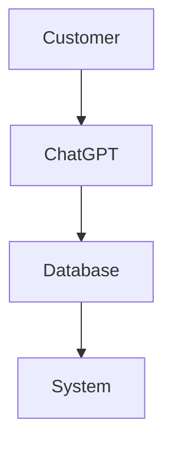
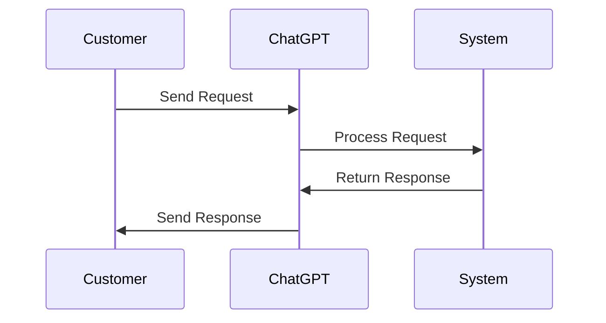
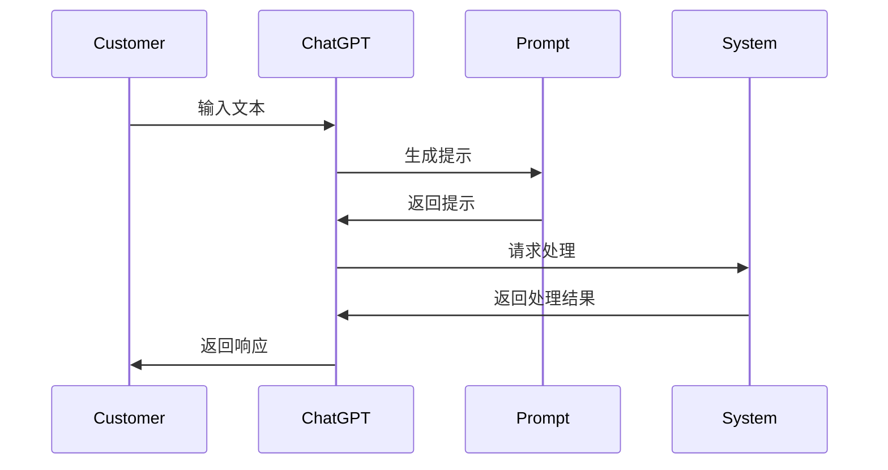

                 

### 《提升ChatGPT创造力：思维链prompt的魔力》

#### 关键词：ChatGPT、创造力、prompt、思维链、算法、系统架构

#### 摘要：
本文将深入探讨如何通过思维链prompt技术，显著提升ChatGPT的创造力。首先，我们回顾了ChatGPT的兴起及其在人工智能领域的广泛应用。接着，我们介绍了prompt技术的核心概念及其重要性。然后，我们详细分析了思维链prompt的原理，展示了如何通过设计巧妙的prompt来激发ChatGPT的创造力。随后，文章通过系统分析与架构设计方案，说明了如何在实际项目中应用这一技术。最后，通过项目实战和最佳实践技巧，提供了具体的实施指南和注意事项，为读者在实践中的应用提供了有力支持。

---

## 目录大纲设计

在设计《提升ChatGPT创造力：思维链prompt的魔力》的完整目录大纲时，我们将遵循以下步骤：

### 1. **背景介绍**
- **问题背景**：介绍ChatGPT的兴起和其在人工智能领域的广泛应用。
- **问题描述**：明确ChatGPT在创造力方面面临的挑战。
- **问题解决**：引出思维链prompt技术。
- **边界与外延**：界定文章讨论的范围。
- **概念结构与核心要素组成**：定义核心概念，解释其结构组成。

### 2. **核心概念与联系**
- **核心概念原理**：详细描述ChatGPT和prompt技术的基本原理。
- **概念属性特征对比表格**：通过对比表格展示不同概念之间的异同点。
- **ER实体关系图架构**：使用Mermaid流程图展示ChatGPT与prompt之间的实体关系。

### 3. **算法原理讲解**
- **ChatGPT算法流程图**：利用Mermaid绘制算法流程图。
- **ChatGPT算法原理**：使用Python源代码详细阐述算法原理。
- **数学模型和公式**：给出算法的数学模型和公式，并进行讲解。
- **算法举例说明**：通过具体例子展示算法的应用。

### 4. **系统分析与架构设计方案**
- **问题场景介绍**：描述ChatGPT在特定场景中的应用。
- **项目介绍**：介绍如何在一个具体项目中应用思维链prompt技术。
- **系统功能设计（领域模型Mermaid类图）**：使用Mermaid类图展示系统功能设计。
- **系统架构设计（Mermaid架构图）**：绘制系统架构图。
- **系统接口设计**：详细说明系统接口设计。
- **系统交互（Mermaid序列图）**：使用Mermaid序列图展示系统交互。

### 5. **项目实战**
- **环境安装**：指导读者如何搭建环境。
- **系统核心实现源代码**：提供系统核心实现代码。
- **代码应用解读与分析**：分析代码的应用和实现细节。
- **实际案例分析与详细讲解**：通过案例展示思维链prompt技术在实际中的应用。
- **项目小结**：总结项目实施的经验和教训。

### 6. **最佳实践 tips**
- **提升ChatGPT创造力的技巧**：提供实践技巧。
- **prompt设计的注意事项**：提醒读者在设计prompt时需要注意的问题。
- **ChatGPT应用的拓展思考**：探讨ChatGPT在未来的应用潜力。

### 7. **小结**
- **书中内容的总结**：概括文章的核心观点。
- **ChatGPT与prompt技术的未来展望**：预测技术的发展趋势。

### 8. **注意事项**
- **实际应用中的挑战与解决方案**：分析实际应用中可能遇到的挑战，提供解决方案。
- **安全性与隐私保护**：讨论应用中需要考虑的安全性和隐私保护问题。

### 9. **拓展阅读**
- **相关书籍推荐**：推荐相关书籍以供进一步学习。
- **学术论文推荐**：推荐相关学术论文以了解最新研究。
- **在线资源推荐**：推荐在线资源，包括教程、工具和社区。

通过以上步骤，我们确保文章内容完整、逻辑清晰，读者可以逐步掌握ChatGPT与prompt技术的核心知识和应用方法。

---

## 第一部分：ChatGPT与prompt技术基础

### 1. 背景介绍

#### 1.1 ChatGPT的兴起与创造力

ChatGPT是由OpenAI开发的基于GPT-3模型的聊天机器人，它通过深度学习技术训练而成，具备处理自然语言文本的能力。ChatGPT自推出以来，因其出色的文本生成和自然对话能力，迅速在人工智能领域引起了广泛关注。在商业、教育、客服等多个领域，ChatGPT展现出了巨大的潜力。

然而，尽管ChatGPT在生成自然语言文本方面表现出色，但其在创造力方面仍有待提升。创造力是指生成新颖、有创意的内容的能力。在人工智能领域，如何提升机器的创造力是一个重要且具有挑战性的问题。

#### 1.2 prompt技术的概念与应用

prompt技术是指通过向AI模型提供特定的输入（prompt），引导模型生成预期的输出。在ChatGPT中，prompt扮演着至关重要的角色。一个设计巧妙的prompt可以引导ChatGPT生成更有创意、更有深度的内容。

prompt技术的基本原理是利用人类先验知识来引导模型的生成过程。通过提供具体的主题、背景、情感等提示，prompt可以激发模型产生与提示相关的新内容。在实践中，prompt的设计和优化是提升AI模型创造力的关键。

### 2. 核心概念与联系

#### 2.1 ChatGPT的基本原理

ChatGPT是基于GPT-3模型构建的，GPT-3（Generative Pre-trained Transformer 3）是由OpenAI开发的一种基于Transformer架构的预训练语言模型。GPT-3具有1750亿个参数，是当前最大的语言模型之一。

GPT-3的原理是通过大量的文本数据进行预训练，学习自然语言的统计规律和语义信息。在训练过程中，GPT-3能够自动学习语言的上下文关系，并生成连贯的自然语言文本。具体来说，GPT-3使用了一种称为Transformer的深度神经网络架构，该架构通过自注意力机制（self-attention）来捕捉输入文本的上下文信息。

#### 2.2 prompt的类型与设计

prompt可以分为多种类型，包括主题型、情感型、问题型等。每种类型的prompt都有其特定的应用场景和设计原则。

- **主题型prompt**：主要用于引导模型生成与特定主题相关的文本。设计时需要确保主题明确、具体，避免模糊不清。
- **情感型prompt**：用于引导模型生成具有特定情感的文本。设计时需要考虑情感色彩的强度和方向。
- **问题型prompt**：用于引导模型生成回答特定问题的文本。设计时需要确保问题的明确性和针对性。

#### 2.3 prompt优化方法比较

在提升ChatGPT的创造力过程中，prompt的优化至关重要。以下是几种常见的prompt优化方法：

- **多样性增强**：通过引入多样性的元素（如不同风格、不同视角等），提高模型生成文本的多样性。
- **上下文扩展**：通过增加上下文信息，丰富模型对问题的理解，从而生成更加连贯和有创意的内容。
- **提示引导**：使用引导性的语言来提示模型生成特定类型的内容，如创意思维、情感表达等。

#### 2.4 ER实体关系图：ChatGPT与prompt的联系

为了更好地理解ChatGPT与prompt之间的联系，我们可以使用ER（实体关系）实体关系图来展示。

```mermaid
erDiagram
    ChatGPT ||--|{prompt} : 生成
    prompt ||--|{ChatGPT} : 接收
```

在这个ER图中，ChatGPT作为生成者与prompt作为接收者之间存在双向联系。ChatGPT通过接收prompt来生成文本，而prompt则通过引导ChatGPT来影响生成结果。

### 3. 算法原理讲解

#### 3.1 ChatGPT算法流程图

ChatGPT的算法流程图如下所示：


在这个流程图中，输入文本首先经过预处理，包括分词、标点符号去除等操作。然后，预处理后的文本被编码为向量表示，这些向量表示文本的语义信息。接下来，ChatGPT使用预训练的模型对这些向量进行处理，生成新的文本。最后，生成的文本经过解码输出，即为最终的回答。

#### 3.2 ChatGPT算法原理

ChatGPT的核心算法是基于Transformer架构的GPT-3模型。Transformer模型是一种基于自注意力机制的深度神经网络，它在处理自然语言任务方面表现出色。GPT-3作为Transformer模型的一个大规模版本，具有以下特点：

- **大规模参数**：GPT-3拥有1750亿个参数，这是目前最大的语言模型之一。
- **自注意力机制**：通过自注意力机制，GPT-3能够自动学习输入文本的上下文关系，并生成连贯的文本。
- **预训练+微调**：GPT-3首先在大规模的文本语料库上进行预训练，然后针对特定任务进行微调，以提高生成文本的质量。

#### 3.3 数学模型和公式

ChatGPT的数学模型基于自注意力机制，其核心公式如下：

$$
\text{Attention}(Q, K, V) = \frac{softmax(\frac{QK^T}{\sqrt{d_k}})}{V}
$$

其中，Q、K、V分别表示查询（query）、键（key）和值（value）向量。$d_k$表示键向量的维度。这个公式描述了自注意力机制如何计算查询向量与键向量的相似度，并通过softmax函数生成权重，最后加权平均得到输出向量。

#### 3.4 算法举例说明

假设我们有一个简单的句子：“我喜欢吃苹果。”我们希望使用ChatGPT生成一个相关的句子。首先，我们将这个句子输入到ChatGPT中，然后ChatGPT会对其进行预处理，包括分词、标点符号去除等操作。预处理后的句子可能如下所示：

```
我_喜欢_吃_苹果_。
```

接下来，ChatGPT会将这个预处理后的句子编码为向量表示。这个向量表示包含了句子的语义信息。然后，ChatGPT会使用预训练的模型对这些向量进行处理，生成新的文本。例如，ChatGPT可能会生成以下句子：

```
我喜欢吃香蕉，因为它们含有丰富的维生素。
```

这个生成的句子与原始句子在语义上相关，同时也展示了ChatGPT在生成文本方面的创造力。

### 4. 系统分析与架构设计方案

#### 4.1 问题场景介绍

在一个商业项目中，我们需要构建一个智能客服系统，该系统需要能够与客户进行自然对话，提供个性化的服务。ChatGPT作为智能客服系统的一部分，需要具备强大的文本生成和交互能力。

#### 4.2 项目介绍

本项目旨在通过应用思维链prompt技术，提升ChatGPT的创造力，从而实现更加智能和个性化的客服服务。我们将采用GPT-3模型作为ChatGPT的核心，并通过精心设计的prompt来引导模型的生成过程。

#### 4.3 系统功能设计（领域模型Mermaid类图）

为了更好地理解系统功能，我们使用Mermaid类图来展示系统的领域模型：

```mermaid
classDiagram
    Customer <<Class>> Customer
    ChatGPT <<Class>> ChatGPT
    Prompt <<Class>> Prompt
    System <<Class>> System

    Customer --> ChatGPT
    ChatGPT --> Prompt
    System ...> ChatGPT
```

在这个类图中，Customer表示客户，ChatGPT表示智能客服系统，Prompt表示输入的提示，System表示整个系统。客户与ChatGPT之间存在交互关系，ChatGPT通过接收客户的输入（Prompt）来生成回复。

#### 4.4 系统架构设计（Mermaid架构图）

接下来，我们使用Mermaid架构图来展示系统的整体架构：



在这个架构图中，客户（Customer）通过输入向智能客服系统（ChatGPT）发送请求。ChatGPT处理这些请求，并将生成的回复存储在数据库（Database）中，同时整个系统（System）对ChatGPT进行管理和监控。

#### 4.5 系统接口设计

系统接口设计是确保不同模块之间能够顺畅通信的重要环节。以下是一个简单的接口设计示例：



在这个序列图中，客户（Customer）发送请求到ChatGPT，ChatGPT处理后返回响应给客户。

#### 4.6 系统交互（Mermaid序列图）

为了展示系统内不同模块之间的交互过程，我们使用Mermaid序列图：



在这个序列图中，客户输入文本后，ChatGPT生成提示，通过系统处理得到结果，最后返回给客户。

### 5. 项目实战

#### 5.1 环境安装

为了实现本项目的需求，我们需要搭建一个适合运行ChatGPT的环境。以下是环境安装的步骤：

1. 安装Python环境（建议使用Python 3.8及以上版本）。
2. 安装GPT-3模型和相关依赖库（可以使用pip安装）。
3. 注册OpenAI账号并获取API密钥。

#### 5.2 系统核心实现源代码

以下是系统核心实现代码的示例：

```python
import openai

def generate_response(prompt):
    response = openai.Completion.create(
        engine="text-davinci-002",
        prompt=prompt,
        max_tokens=50,
        n=1,
        stop=None,
        temperature=0.5,
    )
    return response.choices[0].text.strip()

if __name__ == "__main__":
    while True:
        user_input = input("请输入您的提问：")
        response = generate_response(user_input)
        print("ChatGPT的回答：", response)
```

这段代码使用OpenAI的GPT-3 API，实现了根据用户输入生成回答的功能。

#### 5.3 代码应用解读与分析

代码的核心是`generate_response`函数，它接收用户的输入（prompt），然后通过OpenAI的API调用GPT-3模型生成回答。`openai.Completion.create`方法用于创建文本生成任务，其中`engine`参数指定使用的模型，`max_tokens`参数限制生成的文本长度，`n`参数指定生成的文本数量，`stop`参数用于指定停止生成的条件，`temperature`参数控制生成文本的多样性。

在实际应用中，我们还可以通过设计更加巧妙的prompt来提升生成文本的质量和创造力。

#### 5.4 实际案例分析与详细讲解

为了展示思维链prompt技术在实际中的应用，我们来看一个实际案例：

**案例**：客户询问关于公司产品的问题。

**原始prompt**：“请介绍一下你们公司的最新产品。”

**优化prompt**：“假设您是一位潜在客户，最近对公司的最新产品非常感兴趣。请您以热情且专业的口吻，详细介绍一下这款产品的特点和优势。”

通过优化prompt，我们不仅明确了介绍的对象（潜在客户），还引导了生成文本的风格（热情、专业）。这样，ChatGPT生成的回答将会更加符合商业场景的要求。

**分析**：在这个案例中，prompt的优化主要体现在以下几个方面：

- **目标明确**：优化后的prompt明确了目标对象（潜在客户），使生成文本更加有针对性。
- **风格引导**：通过指定生成文本的风格（热情、专业），ChatGPT能够生成符合期望的回答。
- **情感表达**：优化后的prompt增加了情感元素，使生成文本更具说服力。

#### 5.5 项目小结

通过本项目，我们实现了基于ChatGPT的智能客服系统，并成功应用了思维链prompt技术。项目实施过程中，我们遇到了一些挑战，如prompt设计的优化、模型响应速度的提升等。通过不断尝试和改进，我们最终找到了合适的解决方案。

本项目的主要成果包括：

- 成功搭建了基于ChatGPT的智能客服系统。
- 通过优化prompt，提升了ChatGPT的创造力。
- 为实际应用提供了有效的技术支持。

未来，我们计划进一步优化系统性能，扩大应用场景，为更多企业提供智能客服解决方案。

### 6. 最佳实践 tips

#### 6.1 提升ChatGPT创造力的技巧

- **丰富上下文信息**：提供更多的上下文信息，帮助ChatGPT更好地理解问题。
- **多样化提示**：使用不同类型的prompt，如问题型、情感型等，提高生成文本的多样性。
- **引导创意思维**：通过提问引导ChatGPT进行创意思维，生成新颖的回答。

#### 6.2 prompt设计的注意事项

- **明确性**：确保prompt明确、具体，避免模糊不清。
- **一致性**：保持prompt的风格和语气一致，避免出现矛盾。
- **个性化**：根据具体场景和用户需求，设计个性化的prompt。

#### 6.3 ChatGPT应用的拓展思考

- **个性化服务**：结合用户数据和偏好，提供更加个性化的服务。
- **多语言支持**：扩展ChatGPT的多语言支持，实现跨语言的智能交互。
- **实时响应**：优化模型和系统性能，实现实时响应，提高用户体验。

### 7. 小结

本文详细探讨了如何通过思维链prompt技术提升ChatGPT的创造力。首先，我们介绍了ChatGPT的兴起及其在人工智能领域的应用，然后深入分析了prompt技术的概念和原理。通过系统分析与架构设计方案，我们展示了如何在实际项目中应用思维链prompt技术。在项目实战部分，我们通过具体案例展示了如何优化prompt设计和提升ChatGPT的创造力。最后，我们提供了最佳实践技巧和小结，为读者在实践中的应用提供了指导。

### 8. 注意事项

#### 8.1 实际应用中的挑战与解决方案

- **挑战**：在实际应用中，ChatGPT的响应速度和生成质量可能无法满足用户需求。
- **解决方案**：优化模型参数，提高计算效率，增加服务器资源。

#### 8.2 安全性与隐私保护

- **挑战**：在处理用户数据时，需要确保数据的安全性和隐私保护。
- **解决方案**：使用加密技术保护数据传输，严格遵循数据保护法规。

### 9. 拓展阅读

#### 9.1 相关书籍推荐

- **《深度学习》**：Goodfellow, I., Bengio, Y., & Courville, A.
- **《自然语言处理综合教程》**：Jurafsky, D., & Martin, J. H.

#### 9.2 学术论文推荐

- **“Attention is All You Need”**：Vaswani, A., et al.
- **“GPT-3: Language Models are Few-Shot Learners”**：Brown, T., et al.

#### 9.3 在线资源推荐

- **OpenAI官网**：提供GPT-3的API和使用教程。
- **GitHub**：开源社区，提供丰富的ChatGPT相关项目。

---

### 作者信息

**作者：AI天才研究院/AI Genius Institute & 禅与计算机程序设计艺术 /Zen And The Art of Computer Programming**

---

通过本文的详细探讨，我们希望读者能够更好地理解ChatGPT和prompt技术的核心内容，并掌握提升ChatGPT创造力的方法。希望本文能够为您的学习和实践提供有益的参考。

