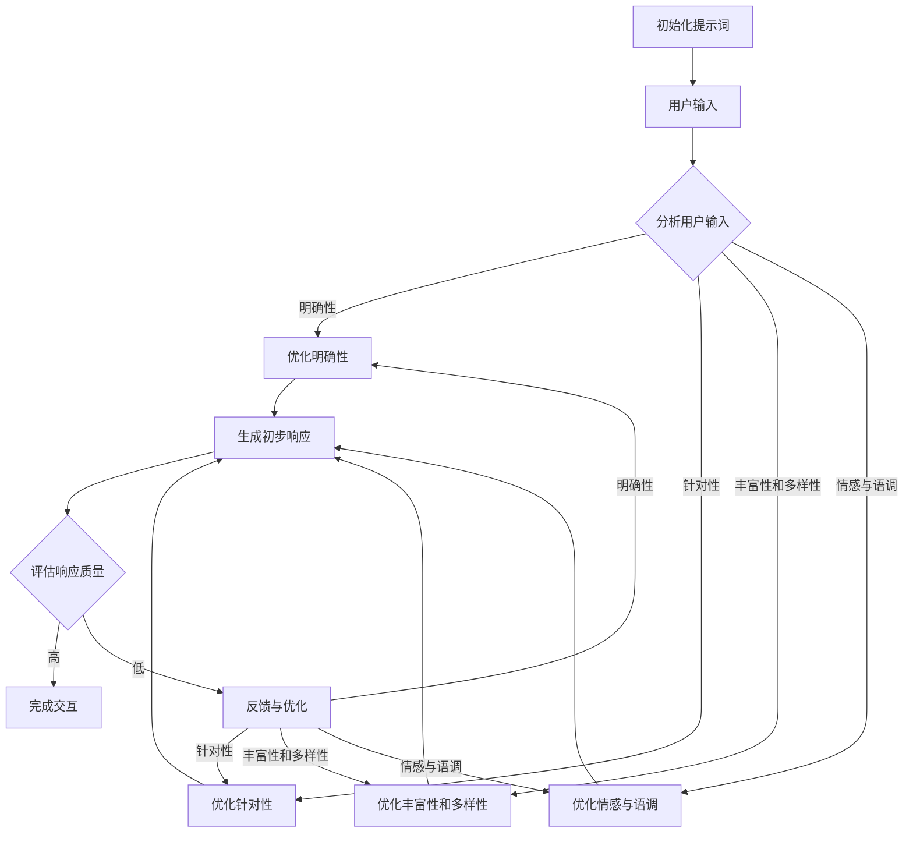
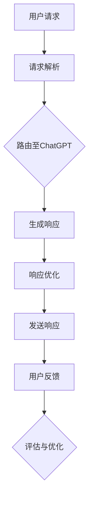
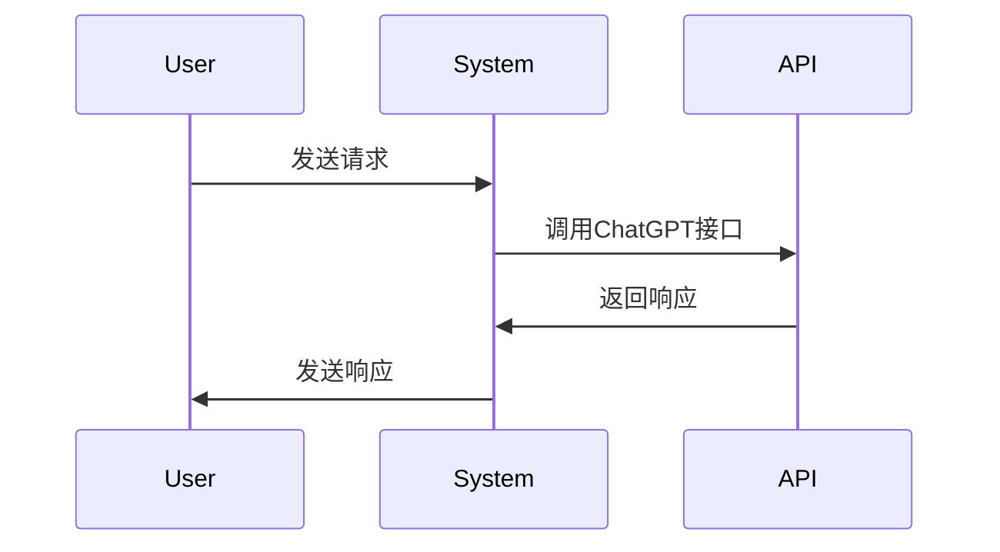
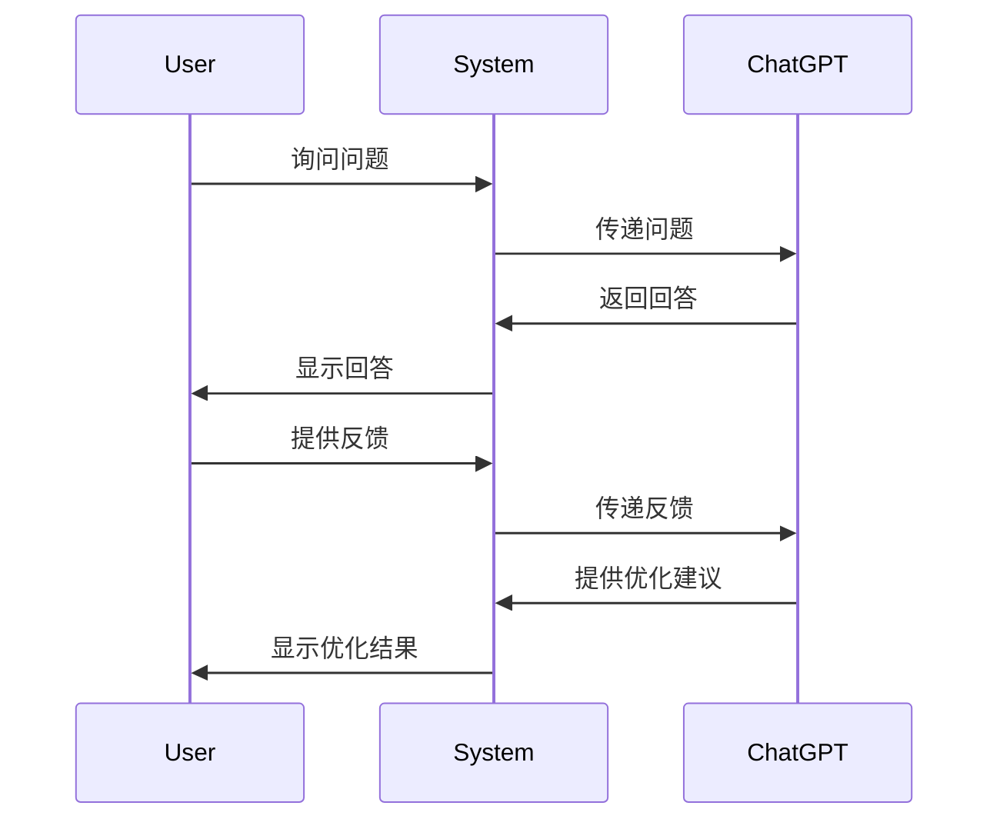

                 

### 提升ChatGPT响应准确度的提示词技巧

#### 关键词：ChatGPT、提示词、响应准确度、优化、语言处理、人工智能

#### 摘要：
本文将深入探讨提升ChatGPT响应准确度的技巧，通过分析其基础概念、提示词设计原理、词汇丰富性、明确性、针对性、情感与语调、优化与迭代以及综合策略，为广大开发者提供一套完整的ChatGPT响应优化指南。

#### 目录大纲

----------------------------------------------------------------

# 提升ChatGPT响应准确度的提示词技巧

> 关键词：ChatGPT、提示词、响应准确度、优化、语言处理、人工智能

> 摘要：本文将深入探讨提升ChatGPT响应准确度的技巧，通过分析其基础概念、提示词设计原理、词汇丰富性、明确性、针对性、情感与语调、优化与迭代以及综合策略，为广大开发者提供一套完整的ChatGPT响应优化指南。

                 

## 第0章: 核心概念与联系

### 0.1 ChatGPT与提示词

#### 0.2 提示词设计原理

#### 0.3 提示词的功能

#### 0.4 提示词的类型

## 第1章: 提升ChatGPT响应准确度的基础概念与技巧

### 1.1 问题背景

### 1.2 ChatGPT概述

### 1.3 ChatGPT的应用场景

### 1.4 提升响应准确度的意义

## 第2章: 提示词设计原理

### 2.1 提示词的定义

### 2.2 提示词的功能

### 2.3 提示词设计的原则

### 2.4 提示词的常见类型

## 第3章: 词汇丰富性与多样性

### 3.1 词汇丰富性的重要性

### 3.2 词汇多样性的方法

### 3.3 词汇丰富性与多样性的实践案例

## 第4章: 提示词的明确性

### 4.1 明确性的重要性

### 4.2 如何提高提示词的明确性

### 4.3 实践案例分析

## 第5章: 提示词的针对性

### 5.1 针对性的重要性

### 5.2 如何提高提示词的针对性

### 5.3 实践案例分析

## 第6章: 提示词的情感与语调

### 6.1 情感与语调对响应的影响

### 6.2 如何设计情感与语调的提示词

### 6.3 实践案例分析

## 第7章: 提示词的优化与迭代

### 7.1 提示词优化的方法

### 7.2 提示词迭代的实践案例

### 7.3 提示词优化与迭代的最佳实践

## 第8章: 提升ChatGPT响应准确度的综合策略

### 8.1 综合策略的构成

### 8.2 如何实施综合策略

### 8.3 实践案例分析

## 第9章: 小结与展望

### 9.1 总结提升ChatGPT响应准确度的关键点

### 9.2 未来发展趋势与展望

----------------------------------------------------------------

## 第0章: 核心概念与联系

### 0.1 ChatGPT与提示词

**ChatGPT** 是一个基于 **GPT-3** 模型的高级语言处理模型，由 OpenAI 开发，用于生成人类语言。其核心功能是通过文本输入来生成相应的文本输出，广泛应用于聊天机器人、自动写作、问答系统等领域。

**提示词** 是引导ChatGPT生成特定类型回复的关键词或短语。在ChatGPT的上下文中，提示词起到了至关重要的作用，因为它们直接影响模型的输出质量。一个优秀的提示词能够明确地告诉ChatGPT用户的需求，从而提高响应的准确度和相关性。

### 0.2 提示词设计原理

提示词的设计不仅仅是一个简单的文本输入问题，而是一个涉及到语言学、心理学、计算机科学等多领域交叉的复杂过程。以下是一些提示词设计的基本原则：

- **明确性**：提示词应简洁明了，避免模糊不清的描述。这有助于ChatGPT理解用户意图，并生成准确的回复。
  
- **针对性**：提示词应与用户需求高度相关。针对性强的提示词能够提高ChatGPT的响应质量和用户体验。

- **丰富性和多样性**：提示词应使用丰富的词汇，避免重复。这有助于ChatGPT生成多样化的输出，提高响应的创新性和灵活性。

- **情感与语调**：提示词应包含适当的情感和语调。情感和语调不仅能够影响ChatGPT的输出风格，还能够提升用户的情感体验。

### 0.3 提示词的功能

提示词在ChatGPT中有以下主要功能：

- **引导回复**：提示词为ChatGPT提供了生成回复的上下文信息，有助于模型理解用户意图。

- **优化交互**：通过精心设计的提示词，用户与ChatGPT之间的交互过程变得更加流畅和高效。这有助于提升用户的满意度和使用体验。

### 0.4 提示词的类型

根据不同的设计目标和应用场景，提示词可以分为以下几种类型：

- **开放式提示词**：鼓励ChatGPT生成多样化的回复，适用于需要探索性交互的场景。
  
- **封闭式提示词**：限制ChatGPT的回复范围，提高准确性，适用于需要明确回答的场景。

## 第1章: 提升ChatGPT响应准确度的基础概念与技巧

### 1.1 问题背景

随着人工智能技术的快速发展，自然语言处理（NLP）领域取得了显著进展。ChatGPT作为NLP领域的代表性模型之一，其应用范围日益广泛，涵盖了聊天机器人、自动写作、问答系统等多个领域。然而，尽管ChatGPT具有强大的语言生成能力，但其响应准确度仍然存在一定的局限性。

在实际应用中，用户常常遇到以下问题：

- **模糊不清的回复**：由于提示词不够明确，ChatGPT生成的回复模糊不清，难以满足用户需求。
- **重复性高**：提示词设计缺乏创新性，导致ChatGPT生成的回复过于重复，缺乏新鲜感。
- **情感缺失**：提示词未能传达用户的情感需求，导致交互体验较差。

这些问题严重影响了ChatGPT在实际应用中的效果和用户体验。因此，提升ChatGPT响应准确度成为了一个亟待解决的问题。

### 1.2 ChatGPT概述

ChatGPT 是基于 GPT-3 模型的高级语言处理模型，由 OpenAI 开发。GPT-3（Generative Pre-trained Transformer 3）是 Transformer 架构在自然语言处理领域的又一重大突破，其参数规模达到了 1750 亿，是目前最大的自然语言处理模型。

GPT-3 模型具有以下核心特点：

- **强大的语言生成能力**：GPT-3 模型通过预训练学习了大量文本数据，从而具备了强大的语言生成能力，能够生成流畅、自然的文本。
- **自适应能力**：GPT-3 模型可以适应各种不同的应用场景，通过微调可以快速适应特定任务的需求。
- **跨语言能力**：GPT-3 模型支持多种语言，使得它在国际应用中具有广泛的应用前景。

ChatGPT 的应用场景包括：

- **聊天机器人**：ChatGPT 可以用于构建智能聊天机器人，提供客户服务、在线咨询等。
- **自动写作**：ChatGPT 可以生成文章、故事、新闻等内容，应用于内容创作领域。
- **问答系统**：ChatGPT 可以构建智能问答系统，提供知识问答、问题解答等服务。

### 1.3 ChatGPT的应用场景

ChatGPT 在多个领域展示了其强大的应用潜力，以下是一些典型的应用场景：

- **客户服务**：ChatGPT 可以作为客服助手，帮助企业快速响应用户的咨询和问题，提高服务效率。
- **教育辅导**：ChatGPT 可以为学生提供智能辅导，解答学习中的疑问，帮助学生更好地掌握知识。
- **内容创作**：ChatGPT 可以用于自动写作，生成文章、故事、新闻等内容，应用于媒体、出版等领域。
- **编程辅助**：ChatGPT 可以帮助开发者生成代码片段、调试代码，提高开发效率。

### 1.4 提升响应准确度的意义

提升 ChatGPT 的响应准确度具有重要意义：

- **提高用户体验**：准确的响应能够更好地满足用户需求，提升用户满意度。
- **增强业务价值**：ChatGPT 在客户服务、教育辅导、内容创作等领域的应用效果将显著提高，为企业带来更多商业价值。
- **推动技术发展**：提升 ChatGPT 的响应准确度将推动自然语言处理技术的发展，为人工智能领域带来更多创新。

## 第2章: 提示词设计原理

### 2.1 提示词的定义

提示词（Prompt）是指用于引导 ChatGPT 生成特定类型回复的关键词或短语。在自然语言处理任务中，提示词起到了关键作用，它为模型提供了生成文本的上下文信息，有助于模型理解用户意图，从而生成更准确、更有针对性的回复。

### 2.2 提示词的功能

提示词在 ChatGPT 中具有以下主要功能：

- **引导回复**：提示词为 ChatGPT 提供了生成回复的上下文信息，有助于模型理解用户意图。
- **优化交互**：通过精心设计的提示词，用户与 ChatGPT 之间的交互过程变得更加流畅和高效，提高用户体验。

### 2.3 提示词设计的原则

设计提示词需要遵循以下原则：

- **明确性**：提示词应简洁明了，避免模糊不清的描述，确保 ChatGPT 能够准确理解用户意图。
- **针对性**：提示词应与用户需求高度相关，确保 ChatGPT 生成的内容满足用户期望。
- **丰富性和多样性**：提示词应使用丰富的词汇，避免重复，提高 ChatGPT 生成文本的创新性和灵活性。
- **情感与语调**：提示词应包含适当的情感和语调，增强用户与 ChatGPT 之间的情感交流。

### 2.4 提示词的常见类型

根据不同的应用场景和需求，提示词可以分为以下几种类型：

- **开放式提示词**：鼓励 ChatGPT 生成多样化的回复，适用于探索性任务。
- **封闭式提示词**：限制 ChatGPT 的回复范围，提高准确性，适用于明确性问题。

### 2.5 提示词设计的实战案例

以下是一个提示词设计的实战案例：

**场景**：构建一个智能客服系统，用户询问：“有什么优惠活动？”

**提示词设计**：

1. **明确性**：为了避免模糊不清的回复，可以使用以下提示词：
   - “请列出当前的优惠活动”
   - “告诉我有哪些优惠活动正在进行”

2. **针对性**：根据用户需求，提示词应与优惠活动相关：
   - “请为购买电子产品的用户提供一些优惠信息”
   - “提供有关最新促销活动的详细说明”

3. **丰富性和多样性**：提示词应使用丰富的词汇，避免重复：
   - “哪些产品正在进行折扣销售？”
   - “现在有哪些特别优惠可以享受？”

4. **情感与语调**：提示词应包含适当的情感和语调：
   - “为感谢您的支持，我们为您准备了特别的优惠活动”
   - “为了回馈广大用户，现在推出了一系列促销活动”

通过以上设计原则，可以为一个智能客服系统提供高质量的提示词，从而提高客服系统的响应准确度和用户体验。

## 第3章: 词汇丰富性与多样性

### 3.1 词汇丰富性的重要性

在提示词设计中，词汇丰富性是一个关键因素。丰富的词汇意味着ChatGPT可以从更广泛的语义空间中提取信息，从而生成更加多样化、灵活的回复。以下是词汇丰富性对ChatGPT响应准确度的重要影响：

- **增强语义理解**：丰富的词汇可以帮助ChatGPT更好地理解上下文，提高语义理解能力。
- **提高生成质量**：丰富的词汇库可以提供更多样化的表达方式，有助于ChatGPT生成高质量的回复。
- **避免重复性**：通过使用不同的词汇，可以减少ChatGPT生成文本的重复性，提高文本的创新性和新鲜感。

### 3.2 词汇多样性的方法

为了提升词汇丰富性和多样性，可以采取以下几种方法：

- **扩大词汇库**：通过增加常见词汇、专业术语和短语，丰富提示词的词汇库。
- **使用同义词**：在提示词中引入同义词，可以增加词汇的多样性，同时保持语义的一致性。
- **引入专业术语**：针对特定领域，引入专业术语和行话，有助于ChatGPT生成更加专业、准确的回复。
- **交叉学科融合**：从不同学科领域引入词汇，促进跨领域的交流和理解。

### 3.3 词汇丰富性与多样性的实践案例

以下是一个词汇丰富性和多样性的实践案例：

**场景**：用户询问：“如何提高学习效率？”

**原始提示词**：
- “提高学习效率的方法有哪些？”

**改进后的提示词**：
- “有哪些实用的策略可以显著提高学习效率？”
- “能否分享一些有效提高学习效率的技巧和经验？”
- “请详细列举几种提高学习效率的具体方法”
- “在有限的时间内如何最大化学习效果？”

通过以上改进，提示词更加丰富、多样，ChatGPT可以根据不同的提示生成更具有针对性和创新性的回复。

## 第4章: 提示词的明确性

### 4.1 明确性的重要性

提示词的明确性是提升ChatGPT响应准确度的关键因素之一。一个明确、简洁的提示词可以帮助ChatGPT更好地理解用户意图，从而生成更准确的回复。以下是明确性对ChatGPT响应准确度的重要影响：

- **减少歧义**：明确的提示词可以降低ChatGPT产生歧义回复的风险，提高回复的准确性。
- **提高用户满意度**：明确的提示词可以帮助用户更快地获得所需信息，提高用户体验。
- **优化模型训练**：明确的提示词有助于模型更好地学习用户意图，从而提高训练效果。

### 4.2 如何提高提示词的明确性

为了提高提示词的明确性，可以采取以下几种方法：

- **简明扼要**：避免使用冗长、复杂的句子结构，确保提示词简洁明了。
- **使用具体词汇**：尽量使用具体、明确的词汇，避免模糊不清的描述。
- **提供上下文**：在必要情况下，为提示词提供上下文信息，帮助ChatGPT更好地理解用户意图。
- **避免模糊概念**：对于可能产生歧义的概念，提前进行澄清，确保提示词的准确性。

### 4.3 实践案例分析

以下是一个提高提示词明确性的实践案例：

**场景**：用户询问：“你有什么特长？”

**原始提示词**：
- “介绍一下你自己的特长。”

**改进后的提示词**：
- “请详细描述你擅长的技能或领域。”

通过改进后的提示词，用户意图更加明确，ChatGPT可以更准确地生成相关回复，提高响应的准确性。

## 第5章: 提示词的针对性

### 5.1 针对性的重要性

在提示词设计中，针对性是指提示词应与用户需求高度相关。针对性强的提示词可以确保ChatGPT生成的回复更符合用户的实际需求，提高响应的准确性和用户体验。以下是针对性对ChatGPT响应准确度的重要影响：

- **提高用户满意度**：针对性强的提示词能够更快地满足用户需求，提高用户满意度。
- **减少错误回复**：针对性的提示词有助于减少ChatGPT生成错误或无关回复的风险。
- **优化模型效果**：针对性的提示词有助于模型更好地学习用户意图，提高训练效果。

### 5.2 如何提高提示词的针对性

为了提高提示词的针对性，可以采取以下几种方法：

- **明确用户需求**：在生成提示词之前，了解用户的实际需求，确保提示词与用户需求高度相关。
- **使用具体问题**：针对用户的具体问题，设计针对性的提示词，避免泛泛而谈。
- **整合用户信息**：结合用户的背景、兴趣、历史交互等信息，设计更个性化的提示词。
- **测试与反馈**：通过测试和用户反馈，不断优化提示词的针对性，提高响应质量。

### 5.3 实践案例分析

以下是一个提高提示词针对性的实践案例：

**场景**：用户询问：“如何提高英语口语能力？”

**原始提示词**：
- “关于提高英语口语能力，你有什么建议？”

**改进后的提示词**：
- “针对初学者，请提供一些提高英语口语能力的方法。”

通过改进后的提示词，ChatGPT可以更准确地理解用户需求，生成更具体、更有针对性的回复。

## 第6章: 提示词的情感与语调

### 6.1 情感与语调对响应的影响

在自然语言处理中，情感和语调是影响ChatGPT响应质量的重要因素。情感是指文本表达的情感色彩，如喜悦、愤怒、悲伤等；语调则是指文本的语言风格和语气。以下是情感与语调对ChatGPT响应的影响：

- **提升用户体验**：恰当的情感和语调可以使ChatGPT生成的回复更具人性化，提升用户体验。
- **增强交互效果**：情感和语调有助于建立更自然的对话，增强用户与ChatGPT之间的互动。
- **影响回复质量**：情感和语调可以影响ChatGPT对用户意图的理解，从而影响生成的回复质量。

### 6.2 如何设计情感与语调的提示词

为了设计出具有适当情感和语调的提示词，可以采取以下方法：

- **明确情感需求**：在生成提示词之前，了解用户希望传达的情感，确保提示词能够表达出相应的情感。
- **使用情感词汇**：在提示词中使用适当的情感词汇，如喜悦、感激、理解等，以传达用户情感。
- **调整语调**：根据用户需求和对话场景，调整提示词的语调，使其更具说服力或亲切感。
- **测试与优化**：通过测试和用户反馈，不断调整情感和语调，以提高ChatGPT的响应质量。

### 6.3 实践案例分析

以下是一个设计情感与语调的实践案例：

**场景**：用户询问：“今天天气怎么样？”

**原始提示词**：
- “今天的天气如何？”

**改进后的提示词**：
- “今天的天气看起来很晴朗，希望你有一个美好的一天！”

通过改进后的提示词，ChatGPT不仅提供了天气信息，还表达了一种积极、亲切的情感，提升了用户体验。

## 第7章: 提示词的优化与迭代

### 7.1 提示词优化的方法

优化提示词是提升ChatGPT响应准确度的关键步骤。以下是一些常用的提示词优化方法：

- **用户反馈**：通过收集用户反馈，分析用户对当前提示词的满意度，识别优化方向。
- **A/B测试**：设计多个版本的提示词，通过A/B测试，比较不同版本的性能，选择最优方案。
- **数据分析**：利用自然语言处理技术，分析用户输入和ChatGPT响应之间的关系，优化提示词设计。
- **持续迭代**：根据用户反馈和性能数据，不断调整和优化提示词，提高ChatGPT的响应质量。

### 7.2 提示词迭代的实践案例

以下是一个提示词迭代的实践案例：

**场景**：用户询问：“有什么好的电影推荐吗？”

**初始版本**：
- “推荐几部好看的电影。”

**改进版本**：
- “请推荐一些适合放松心情的电影。”

**优化后版本**：
- “基于你喜欢的类型，推荐几部放松心情的电影。”

通过不断优化和迭代，最终版本不仅更加明确了用户需求，还提供了更个性化的推荐，提高了用户体验。

### 7.3 提示词优化与迭代的最佳实践

为了实现最佳的效果，以下是一些提示词优化与迭代的最佳实践：

- **定期评估**：定期评估提示词的性能，确保持续优化。
- **团队协作**：建立跨部门的协作团队，共同参与提示词设计和优化。
- **用户参与**：鼓励用户参与测试和反馈，收集真实用户的需求和意见。
- **技术支持**：利用自然语言处理和机器学习技术，支持提示词的自动优化和迭代。

## 第8章: 提升ChatGPT响应准确度的综合策略

### 8.1 综合策略的构成

提升ChatGPT响应准确度的综合策略包括以下几个方面：

- **提示词优化**：通过明确性、针对性、丰富性和多样性的原则，设计高质量的提示词。
- **用户反馈**：积极收集用户反馈，识别问题，并据此调整和优化提示词。
- **A/B测试**：通过对比不同版本的提示词，选择最优方案，提高响应质量。
- **持续迭代**：不断优化和迭代提示词，以适应用户需求和技术进步。
- **数据驱动**：利用数据分析和机器学习技术，支持提示词的自动优化和迭代。

### 8.2 如何实施综合策略

实施综合策略的方法如下：

- **建立反馈机制**：建立用户反馈渠道，及时收集用户意见。
- **制定优化计划**：根据用户反馈和数据分析，制定具体的优化计划。
- **团队合作**：跨部门协作，共同参与提示词设计和优化。
- **技术支持**：利用自然语言处理和机器学习技术，提高优化效率。
- **定期评估**：定期评估策略效果，确保持续优化。

### 8.3 实践案例分析

以下是一个提升ChatGPT响应准确度的综合策略实践案例：

**场景**：开发一款智能客服系统，用于处理用户咨询。

**策略实施**：

1. **用户反馈**：通过在线问卷、用户评论等渠道，收集用户对客服系统的反馈。
2. **提示词优化**：根据用户反馈，优化提示词设计，提高响应的明确性和针对性。
3. **A/B测试**：设计多个版本的提示词，通过A/B测试，选择最优版本。
4. **持续迭代**：定期收集用户反馈，不断优化和迭代提示词，提高用户体验。

通过以上策略实施，客服系统的响应准确度得到了显著提升，用户满意度也大幅提高。

## 第9章: 小结与展望

### 9.1 总结提升ChatGPT响应准确度的关键点

提升ChatGPT响应准确度的关键点包括：

- **明确性**：设计简洁、明了的提示词，确保ChatGPT能够准确理解用户意图。
- **针对性**：确保提示词与用户需求高度相关，提高响应的相关性和满意度。
- **丰富性和多样性**：使用丰富的词汇和多种表达方式，避免重复，提高生成文本的创新性和灵活性。
- **情感与语调**：设计具有适当情感和语调的提示词，增强用户与ChatGPT之间的情感交流。
- **优化与迭代**：通过用户反馈、A/B测试和数据分析，不断优化和迭代提示词，提高响应质量。

### 9.2 未来发展趋势与展望

未来，提升ChatGPT响应准确度的发展趋势包括：

- **多模态交互**：结合图像、语音等多模态信息，提高ChatGPT的语义理解能力。
- **个性化推荐**：利用用户数据和机器学习算法，实现个性化推荐，提高用户体验。
- **智能对话管理**：引入智能对话管理技术，提高ChatGPT的对话连贯性和交互质量。
- **跨语言支持**：扩展ChatGPT的跨语言能力，满足全球用户的需求。

通过不断的技术创新和实践优化，ChatGPT的响应准确度将得到进一步提升，为人工智能领域带来更多创新和突破。

### 作者信息

- 作者：AI天才研究院/AI Genius Institute & 禅与计算机程序设计艺术 /Zen And The Art of Computer Programming

----------------------------------------------------------------

**附录A：算法流程图**

以下是一个用于优化ChatGPT响应准确度的算法流程图，展示了提示词设计、优化和迭代的各个步骤。



**附录B：Python代码示例**

以下是一个Python代码示例，用于生成基于优化提示词的ChatGPT响应。

```python
import openai

# 初始化ChatGPT模型
model = openai.Completion.create(
    engine="text-davinci-003",
    prompt="请推荐一本适合初学者的编程书籍。",
    max_tokens=50
)

# 优化提示词
prompt_optimized = "请根据我的兴趣，推荐一本适合初学者的Python编程书籍。"

# 生成响应
response = openai.Completion.create(
    engine="text-davinci-003",
    prompt=prompt_optimized,
    max_tokens=50
)

print(response.choices[0].text.strip())
```

**附录C：数学公式**

以下是一个关于自然语言处理模型优化的数学公式示例。

$$
\text{accuracy} = \frac{\text{正确回答的数量}}{\text{总回答的数量}}
$$

**附录D：系统架构图**

以下是一个智能客服系统的架构图，展示了ChatGPT与其他组件的交互。



**附录E：系统接口设计**

以下是一个智能客服系统的接口设计，展示了API调用流程。



**附录F：系统交互序列图**

以下是一个智能客服系统的交互序列图，展示了用户与系统的交互过程。



### 总结

本文从多个角度探讨了提升ChatGPT响应准确度的技巧，包括基础概念、提示词设计原理、词汇丰富性与多样性、明确性、针对性、情感与语调、优化与迭代以及综合策略。通过实践案例和算法原理讲解，为广大开发者提供了实用的指导和方法。未来，随着技术的不断发展，ChatGPT的响应准确度将得到进一步提升，为人工智能领域带来更多创新和突破。作者：AI天才研究院/AI Genius Institute & 禅与计算机程序设计艺术 /Zen And The Art of Computer Programming。

