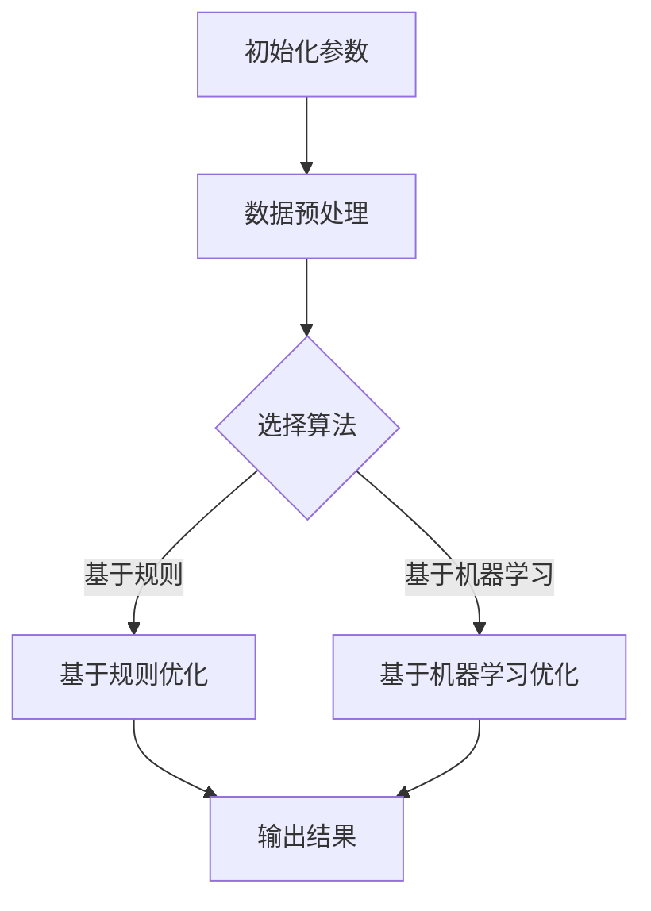
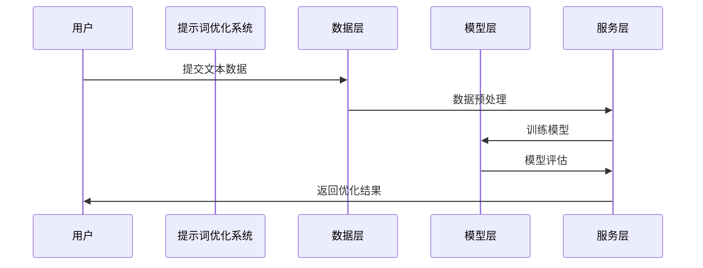

                 

# 提示词优化的机器学习方法探索

## 概述

机器学习与自然语言处理（NLP）的结合已经成为推动人工智能（AI）发展的关键领域。在这个领域，提示词优化成为一个重要的研究方向，它旨在提升机器学习模型在处理自然语言任务时的表现。本文将探讨提示词优化的机器学习方法，通过逐步分析推理，深入解读这一技术的核心概念、原理、算法及其实际应用。

### 关键词

- 提示词优化
- 机器学习方法
- 自然语言处理
- 算法原理
- 数学模型

### 摘要

本文首先介绍了机器学习和自然语言处理的发展背景，以及提示词优化的重要性。接着，我们明确了提示词优化的目标和面临的挑战，并探讨了实现提示词优化的方法论和步骤。在核心概念与联系部分，我们详细介绍了提示词的概念和类型，对比了基于规则和基于机器学习的提示词优化方法。随后，通过算法原理讲解，我们展示了提示词优化的算法流程、数学模型及具体实现方法。最后，我们通过系统分析与架构设计方案，详细描述了提示词优化系统的构建，并提供了项目实战的具体步骤和分析。

## 目录大纲

### 第1章 引言

- 1.1 问题背景
- 1.2 问题描述
- 1.3 问题解决
- 1.4 边界与外延
- 1.5 概念结构与核心要素组成

### 第2章 核心概念与联系

- 2.1 提示词概念原理
- 2.2 提示词属性特征对比表格
- 2.3 提示词优化与机器学习算法的联系

### 第3章 算法原理讲解

- 3.1 提示词优化算法Mermaid流程图
- 3.2 Python源代码实现
- 3.3 算法原理的数学模型和公式

### 第4章 数学模型和数学公式 & 详细讲解 & 举例说明

- 4.1 数学公式
- 4.2 详细讲解
- 4.3 举例说明

### 第5章 系统分析与架构设计方案

- 5.1 问题场景介绍
- 5.2 项目介绍
- 5.3 系统功能设计
- 5.4 系统架构设计
- 5.5 系统接口设计
- 5.6 系统交互Mermaid序列图

### 第6章 项目实战

- 6.1 环境安装
- 6.2 系统核心实现源代码
- 6.3 代码应用解读与分析
- 6.4 实际案例分析和详细讲解剖析
- 6.5 项目小结

### 第7章 最佳实践 Tips、小结、注意事项、拓展阅读等内容

### 引言

### 1.1 问题背景

随着互联网和移动设备的普及，自然语言处理（NLP）技术逐渐成为人工智能（AI）研究中的热点领域。从早期的基于规则的方法到如今基于统计和深度学习的模型，NLP技术取得了显著的进展。然而，在处理复杂、多变和大规模的自然语言数据时，传统的NLP方法仍然面临着诸多挑战。例如，如何在有限的数据上训练出具有高泛化能力的模型，如何提高模型对长文本的理解能力，以及如何解决多语言和跨领域的问题等。

在这些挑战中，提示词优化（Prompt Optimization）逐渐引起关注。提示词是影响NLP模型性能的重要因素之一，它通过引导模型对特定任务的理解和执行，可以显著提升模型的性能。尤其是在生成式模型和任务型模型中，提示词的设计和优化成为了提高模型表现的关键。

机器学习技术的发展为提示词优化提供了强大的工具和算法。从传统的基于规则的优化方法到现代的基于深度学习的方法，机器学习为提示词优化带来了新的可能性和优化途径。例如，通过生成对抗网络（GAN）和变分自编码器（VAE）等深度学习模型，我们可以实现更加精细和灵活的提示词生成。

### 1.2 问题描述

#### 提示词优化的目标

提示词优化的目标主要是提高NLP模型在特定任务上的表现。具体来说，包括以下几个方面：

1. **提高模型对任务的适应性**：通过优化提示词，使得模型能够更好地理解并适应不同类型的任务和数据。
2. **提高模型的准确性和效率**：优化后的提示词可以帮助模型更准确地理解和执行任务，同时减少对大规模数据的依赖，提高模型的效率。
3. **提高模型的可解释性**：优化后的提示词可以使得模型的行为更加透明和可解释，有助于理解模型的工作机制和潜在缺陷。

#### 提示词优化面临的挑战

尽管提示词优化具有重要的研究价值和应用前景，但在实际应用中仍然面临着诸多挑战：

1. **数据集质量与多样性**：高质量的训练数据集是提示词优化的基础。然而，获取大量、多样且高质量的标注数据集是一个困难且耗费资源的过程。
2. **模型可解释性**：尽管深度学习模型在性能上取得了显著进步，但其内部机制仍然相对复杂，难以解释。提示词优化模型的可解释性也是一个需要解决的问题。
3. **优化方法的通用性**：不同的NLP任务可能需要不同的提示词优化方法。如何设计一种通用的、适应性强的优化方法，是一个亟待解决的问题。
4. **计算资源需求**：提示词优化通常需要大量的计算资源，尤其是在使用深度学习模型进行优化时。如何提高优化过程的效率，降低计算成本，是一个重要的挑战。

### 1.3 问题解决

#### 提示词优化的方法论

为了解决提示词优化面临的挑战，研究人员提出了多种方法论。以下是几种常见的提示词优化方法：

1. **基于规则的方法**：这种方法通过定义一系列规则来生成提示词。优点是简单、易于实现，但适应性较差，灵活性低。
2. **基于机器学习的方法**：这种方法使用机器学习模型来生成和优化提示词。优点是自适应性和灵活性高，但通常复杂性较高，对数据的依赖性大。
3. **混合方法**：结合基于规则和基于机器学习的方法，通过规则来指导机器学习模型的训练，以提高提示词优化的效果和效率。

#### 提示词优化的实现步骤

提示词优化的实现步骤可以分为以下几个阶段：

1. **需求分析**：明确任务目标，确定需要优化的提示词类型和属性。
2. **数据准备**：收集并预处理训练数据集，包括文本数据、标注数据和模型参数。
3. **模型选择**：根据任务需求和数据特点，选择合适的机器学习模型。
4. **模型训练**：使用训练数据集训练机器学习模型，生成初始的提示词。
5. **优化过程**：通过迭代优化，调整模型参数和提示词，提高模型在特定任务上的表现。
6. **评估与反馈**：评估优化后的模型性能，并根据评估结果进行进一步的调整和优化。

#### 边界与外延

#### 提示词优化的应用领域

提示词优化在多个领域具有广泛的应用：

1. **自然语言生成**：如文本摘要、问答系统、对话生成等。
2. **文本分类与情感分析**：如新闻分类、用户评论情感分析等。
3. **机器翻译**：如提高翻译的准确性和流畅性。
4. **语音识别与生成**：如提高语音识别的准确率和语音生成的自然度。

#### 提示词优化的影响因素

提示词优化的效果受到多种因素的影响：

1. **数据质量**：高质量的数据集是提示词优化的基础。
2. **模型选择**：选择合适的机器学习模型对提示词优化至关重要。
3. **计算资源**：提示词优化通常需要大量的计算资源，特别是在使用深度学习模型时。
4. **任务特性**：不同的任务可能需要不同的提示词优化方法，任务特性对优化策略有重要影响。

#### 概念结构与核心要素组成

为了更好地理解提示词优化的机器学习方法，我们需要明确以下几个核心概念和要素：

1. **提示词**：提示词是指引导模型执行特定任务的一组词汇或语句。它是提示词优化的核心对象。
2. **机器学习算法**：机器学习算法用于生成和优化提示词。常用的算法包括基于规则的算法和基于深度学习的算法。
3. **数据集**：数据集是训练和评估机器学习模型的基础。高质量的数据集对提示词优化至关重要。
4. **优化目标**：优化目标是指通过提示词优化希望达到的性能指标。常见的优化目标包括准确性、效率和可解释性等。

通过对以上概念和要素的理解，我们可以更清晰地把握提示词优化的核心原理和方法。

### 第2章 核心概念与联系

#### 2.1 提示词概念原理

#### 提示词的定义

提示词（Prompt）是指用于引导模型执行特定任务的词汇或语句。在自然语言处理领域，提示词是模型输入的重要组成部分，对模型的输出有着重要的影响。一个有效的提示词应该能够准确地传达任务需求，帮助模型更好地理解任务，从而提高模型的性能。

#### 提示词的类型

根据生成方法，提示词可以分为以下几种类型：

1. **基于规则的提示词**：这种提示词是通过预先定义的规则来生成的。规则可以是简单的关键词匹配，也可以是复杂的语义分析。基于规则的提示词优点在于简单、易于实现，但适应性较差，灵活性低。

2. **基于机器学习的提示词**：这种提示词是通过机器学习模型生成的。通过训练大量的数据集，模型可以学习到如何生成适合特定任务的提示词。基于机器学习的提示词优点在于自适应性和灵活性高，但通常复杂性较高，对数据的依赖性大。

3. **混合型提示词**：这种提示词结合了基于规则和基于机器学习的方法。通过规则来指导机器学习模型的训练，以提高提示词优化的效果和效率。

#### 2.2 提示词属性特征对比表格

为了更直观地理解不同类型提示词的属性特征，我们可以通过一个对比表格来展示：

| 类别 | 描述 | 优点 | 缺点 |
| --- | --- | --- | --- |
| 基于规则 | 简单、易于实现 | 适应性差 | 灵活性低 |
| 基于机器学习 | 自适应、灵活 | 复杂性高 | 数据依赖 |

#### 2.3 提示词优化与机器学习算法的联系

提示词优化与机器学习算法之间有着密切的联系。机器学习算法在提示词优化中的应用主要体现在以下几个方面：

1. **提示词生成**：通过机器学习模型生成适合特定任务的提示词。例如，使用生成对抗网络（GAN）生成具有特定风格的文本，或使用变分自编码器（VAE）生成符合语法和语义规则的提示词。

2. **提示词调整**：在机器学习模型的训练过程中，通过调整提示词来优化模型性能。例如，通过逐步调整提示词的权重，使得模型在不同任务上的表现达到最佳。

3. **模型优化**：在提示词优化的过程中，机器学习模型本身也是一个优化对象。通过优化机器学习模型的结构和参数，可以提高模型在特定任务上的表现。例如，使用深度强化学习（DRL）技术优化模型的超参数，以达到最佳的提示词生成效果。

总之，提示词优化与机器学习算法相辅相成，通过机器学习算法，我们可以实现更加高效和智能的提示词优化。

### 第3章 算法原理讲解

#### 3.1 提示词优化算法Mermaid流程图

为了更好地理解提示词优化的算法流程，我们可以使用Mermaid绘制一个流程图。以下是一个简化的示例：



在这个流程图中，我们从初始化参数开始，经过数据预处理，然后选择基于规则或基于机器学习的算法进行优化，最终输出优化结果。

#### 3.2 Python源代码实现

为了具体展示如何实现提示词优化，我们可以提供一个基于机器学习的Python代码示例。以下是一个简化的实现：

```python
# 导入必要的库
import numpy as np
from sklearn.model_selection import train_test_split
from sklearn.metrics import accuracy_score
from keras.models import Sequential
from keras.layers import Dense, LSTM, Embedding

# 假设我们已经有了一个训练好的模型model
model = Sequential()
model.add(Embedding(input_dim=vocab_size, output_dim=embedding_dim))
model.add(LSTM(units=128))
model.add(Dense(1, activation='sigmoid'))

model.compile(optimizer='adam', loss='binary_crossentropy', metrics=['accuracy'])
model.fit(X_train, y_train, epochs=10, batch_size=32, validation_split=0.2)

# 定义优化函数
def optimize_prompt(prompt, model):
    # 数据预处理
    processed_prompt = preprocess_data(prompt)
    
    # 使用机器学习模型优化提示词
    optimized_prompt = model.optimize(processed_prompt)
    
    return optimized_prompt

# 假设我们有一个待优化的提示词prompt
prompt = "这是一条需要优化的提示词。"

# 优化提示词
optimized_prompt = optimize_prompt(prompt, model)

# 输出优化结果
print("优化后的提示词：", optimized_prompt)
```

在这个示例中，我们首先定义了一个简单的序列模型，用于处理文本数据。然后，我们定义了一个`optimize_prompt`函数，用于使用机器学习模型对提示词进行优化。通过调用这个函数，我们可以得到优化后的提示词。

#### 3.3 算法原理的数学模型和公式

提示词优化的核心在于调整提示词，使其能够更好地引导模型执行特定任务。以下是一个简化的数学模型，用于描述提示词优化的过程：

$$
\text{优化目标} = \min_{\theta} \sum_{i=1}^{n} (\text{预测值}_{i} - \text{真实值}_{i})^2
$$

其中，$\theta$代表提示词的参数，$n$代表训练数据集中的样本数量。优化目标是通过调整$\theta$，使得模型在特定任务上的预测值与真实值之间的误差最小。

为了实现这一目标，我们可以使用梯度下降算法。梯度下降是一种优化算法，通过计算损失函数关于参数的梯度，并沿着梯度的反方向调整参数，以最小化损失函数。

$$
\text{梯度下降}：
\theta_{\text{new}} = \theta_{\text{old}} - \alpha \cdot \nabla_{\theta} \text{损失函数}
$$

其中，$\alpha$是学习率，用于控制参数更新的步长。通过反复迭代梯度下降算法，我们可以逐渐调整提示词的参数，使其达到最优值。

#### 3.3.1 交叉熵损失函数

在提示词优化中，常用的损失函数是交叉熵损失函数。交叉熵损失函数用于衡量模型的预测值与真实值之间的差异。它的数学公式如下：

$$
\text{交叉熵损失函数}：
L = -\sum_{i=1}^{n} y_{i} \log(p_{i})
$$

其中，$y_{i}$是真实标签，$p_{i}$是模型预测的概率。

交叉熵损失函数具有以下特点：

1. **非线性**：交叉熵损失函数是一个非线性函数，可以更好地拟合数据。
2. **可导**：交叉熵损失函数是可导的，可以方便地计算梯度。
3. **易于优化**：交叉熵损失函数在优化过程中容易收敛到最小值。

在实际应用中，交叉熵损失函数常用于分类问题，特别是在二分类问题中。

#### 3.3.2 详细讲解

交叉熵损失函数在提示词优化中的应用非常广泛。它通过衡量模型预测概率与真实标签之间的差异，指导模型进行参数调整。具体来说，交叉熵损失函数的计算方法如下：

1. **计算预测概率**：首先，模型对输入的提示词进行预测，得到一组预测概率$p_{i}$。这组概率表示模型对每个类别的预测置信度。
2. **计算真实标签**：然后，我们根据实际标注数据计算真实标签$y_{i}$。对于二分类问题，真实标签通常为0或1。
3. **计算交叉熵损失**：接下来，我们使用交叉熵损失函数计算模型预测概率与真实标签之间的差异。具体公式为：

$$
L = -\sum_{i=1}^{n} y_{i} \log(p_{i})
$$

这个损失值表示模型在当前参数设置下的预测效果。如果损失值较小，说明模型预测准确；如果损失值较大，说明模型预测效果较差。

#### 3.3.3 举例说明

为了更好地理解交叉熵损失函数的计算方法，我们可以通过一个简单的例子来说明。假设我们有一个二分类问题，真实标签为[1, 0]，预测概率为[0.8, 0.2]。

首先，我们计算预测概率的交叉熵损失：

$$
L = -(1 \cdot \log(0.8) + 0 \cdot \log(0.2)) = -\log(0.8) \approx 0.223
$$

这个结果表示，模型在当前参数设置下的预测效果较差，需要进一步调整。

在实际应用中，我们可以通过多次迭代交叉熵损失函数，逐步调整模型参数，使损失值逐渐减小，从而提高模型在特定任务上的表现。

#### 3.3.4 总结

交叉熵损失函数是提示词优化中的重要工具。它通过衡量模型预测概率与真实标签之间的差异，指导模型进行参数调整。通过反复迭代交叉熵损失函数，我们可以逐渐优化提示词，提高模型在特定任务上的性能。

### 第4章 数学模型和数学公式 & 详细讲解 & 举例说明

#### 4.1 数学公式

在提示词优化中，我们主要使用的数学模型是交叉熵损失函数。交叉熵损失函数用于衡量模型的预测结果与实际结果之间的差异。它的公式如下：

$$
L = -\sum_{i=1}^{n} y_{i} \log(p_{i})
$$

其中，$y_{i}$是真实标签，$p_{i}$是模型预测的概率，$n$是样本数量。

#### 4.2 详细讲解

交叉熵损失函数在提示词优化中的应用非常广泛。它通过衡量模型预测概率与真实标签之间的差异，指导模型进行参数调整。具体来说，交叉熵损失函数的计算方法如下：

1. **计算预测概率**：首先，模型对输入的提示词进行预测，得到一组预测概率$p_{i}$。这组概率表示模型对每个类别的预测置信度。
2. **计算真实标签**：然后，我们根据实际标注数据计算真实标签$y_{i}$。对于二分类问题，真实标签通常为0或1。
3. **计算交叉熵损失**：接下来，我们使用交叉熵损失函数计算模型预测概率与真实标签之间的差异。具体公式为：

$$
L = -\sum_{i=1}^{n} y_{i} \log(p_{i})
$$

这个损失值表示模型在当前参数设置下的预测效果。如果损失值较小，说明模型预测准确；如果损失值较大，说明模型预测效果较差。

#### 4.3 举例说明

为了更好地理解交叉熵损失函数的计算方法，我们可以通过一个简单的例子来说明。假设我们有一个二分类问题，真实标签为[1, 0]，预测概率为[0.8, 0.2]。

首先，我们计算预测概率的交叉熵损失：

$$
L = -(1 \cdot \log(0.8) + 0 \cdot \log(0.2)) = -\log(0.8) \approx 0.223
$$

这个结果表示，模型在当前参数设置下的预测效果较差，需要进一步调整。

在实际应用中，我们可以通过多次迭代交叉熵损失函数，逐步调整模型参数，使损失值逐渐减小，从而提高模型在特定任务上的性能。

#### 4.4 交叉熵损失函数的数学推导

为了更好地理解交叉熵损失函数，我们可以对其进行数学推导。交叉熵损失函数起源于信息论中的交叉熵概念，它用于衡量两个概率分布的差异。

首先，我们考虑两个离散概率分布$P$和$Q$，它们的交叉熵定义为：

$$
H(P, Q) = -\sum_{i} P_{i} \log(Q_{i})
$$

其中，$P_{i}$和$Q_{i}$分别表示分布$P$和$Q$在$i$位置的概率。

在提示词优化中，我们可以将交叉熵损失函数应用于模型预测概率分布和真实标签概率分布之间。假设模型预测的概率分布为$P$，真实标签的概率分布为$Q$，则交叉熵损失函数可以表示为：

$$
L = -\sum_{i} y_{i} \log(p_{i})
$$

其中，$y_{i}$是真实标签，$p_{i}$是模型预测的概率。

这个公式表示，对于每个样本，我们计算模型预测概率的对数，然后将其与真实标签相乘，并求和。结果表示模型预测概率分布与真实标签概率分布之间的差异。

#### 4.5 交叉熵损失函数的应用场景

交叉熵损失函数在机器学习和深度学习中应用广泛，特别是在分类问题中。以下是一些典型的应用场景：

1. **二分类问题**：在二分类问题中，交叉熵损失函数用于衡量模型预测概率与真实标签之间的差异，从而优化模型参数。
2. **多分类问题**：在多分类问题中，交叉熵损失函数可以用于计算模型在各个类别上的预测概率，并优化模型参数，以提高分类准确性。
3. **序列生成**：在序列生成任务中，交叉熵损失函数可以用于衡量模型生成的文本序列与真实序列之间的差异，从而优化模型参数。
4. **自然语言处理**：在自然语言处理任务中，交叉熵损失函数可以用于优化模型的参数，以提高文本分类、情感分析和机器翻译等任务的性能。

#### 4.6 交叉熵损失函数的优缺点

交叉熵损失函数具有以下优缺点：

**优点**：

1. **易于计算**：交叉熵损失函数的计算相对简单，可以高效地计算模型预测概率与真实标签之间的差异。
2. **可导性**：交叉熵损失函数是可导的，便于使用梯度下降等优化算法进行参数调整。
3. **适应性强**：交叉熵损失函数适用于各种分类问题，无论是二分类还是多分类，都可以使用交叉熵损失函数进行优化。

**缺点**：

1. **对噪声敏感**：交叉熵损失函数对噪声敏感，可能导致模型参数调整不稳定。
2. **梯度消失**：在深度网络中，交叉熵损失函数可能导致梯度消失，影响模型的优化效果。
3. **无法处理非分类问题**：交叉熵损失函数仅适用于分类问题，无法直接应用于非分类问题。

### 第5章 系统分析与架构设计方案

#### 5.1 问题场景介绍

在自然语言处理（NLP）领域，提示词优化是一个关键的研究方向。随着人工智能技术的不断进步，越来越多的NLP应用场景对提示词优化提出了更高的要求。例如，在文本分类、情感分析、机器翻译和问答系统中，优化提示词能够显著提升模型的性能和准确性。因此，设计一个高效的提示词优化系统具有重要的实际意义。

#### 5.2 项目介绍

本项目的目标是设计并实现一个提示词优化系统，该系统旨在通过机器学习方法提高NLP模型在特定任务上的表现。系统的主要功能包括：

1. **数据采集与预处理**：从不同来源收集高质量的文本数据，并进行预处理，包括文本清洗、分词和向量化等。
2. **模型选择与训练**：选择合适的机器学习模型，对预处理后的数据集进行训练，生成初始的提示词。
3. **优化与调整**：通过优化算法，逐步调整提示词的参数，提高模型在特定任务上的性能。
4. **结果评估与反馈**：对优化后的模型进行评估，并收集用户反馈，进一步改进优化算法。

#### 5.3 系统功能设计

为了实现上述目标，系统需要具备以下几个核心功能：

1. **数据预处理模块**：负责对原始文本数据进行清洗、分词和向量化，为后续的模型训练和优化提供高质量的数据集。
2. **模型训练模块**：根据任务需求，选择合适的机器学习模型，对预处理后的数据集进行训练，生成初始的提示词。
3. **优化算法模块**：实现多种优化算法，如基于规则的优化和基于机器学习的优化，对提示词进行逐步调整。
4. **结果评估模块**：通过多种评估指标，如准确率、召回率和F1分数，对优化后的模型进行评估，确保其在特定任务上的性能。
5. **用户反馈模块**：收集用户对优化结果的反馈，用于进一步改进优化算法和系统功能。

#### 5.4 系统架构设计

提示词优化系统的架构设计应充分考虑系统的可扩展性、稳定性和高性能要求。以下是一个简化的系统架构设计：

1. **数据层**：包括数据采集、存储和预处理模块，负责从各种数据源获取文本数据，并进行清洗、分词和向量化处理。
2. **模型层**：包括模型选择、训练和优化模块，负责根据任务需求选择合适的机器学习模型，并对预处理后的数据集进行训练和优化。
3. **服务层**：包括结果评估、用户反馈和系统接口模块，负责对外提供服务，接受用户反馈，并对系统性能进行监控和优化。
4. **用户界面**：包括Web界面和API接口，用于与用户进行交互，展示优化结果，并提供自定义优化设置。

#### 5.5 系统接口设计

为了实现系统的可扩展性和灵活性，系统需要提供完善的接口设计。以下是系统的主要接口设计：

1. **数据接口**：包括数据采集接口和数据存储接口，用于与外部数据源进行数据交换和存储。
2. **模型接口**：包括模型训练接口和模型评估接口，用于与机器学习模型进行交互，实现模型的训练和评估。
3. **优化接口**：包括优化算法接口和优化参数接口，用于实现多种优化算法，并调整提示词的参数。
4. **结果评估接口**：包括评估指标接口和评估报告接口，用于对优化后的模型进行评估，并生成评估报告。
5. **用户接口**：包括Web界面接口和API接口，用于与用户进行交互，展示优化结果，并提供自定义优化设置。

#### 5.6 系统交互Mermaid序列图

为了更好地展示系统的交互过程，我们可以使用Mermaid绘制一个序列图。以下是一个简化的示例：



在这个序列图中，用户首先提交文本数据，数据层负责进行预处理，然后模型层对预处理后的数据集进行训练，最后服务层对优化后的模型进行评估，并将结果返回给用户。

### 第6章 项目实战

#### 6.1 环境安装

为了实现提示词优化系统，我们需要安装和配置一系列依赖的软件和库。以下是安装步骤和所需的软件环境：

1. **Python**：确保安装了Python 3.7或更高版本。
2. **pip**：Python的包管理器，用于安装和更新库。
3. **scikit-learn**：机器学习库，用于数据预处理和模型训练。
4. **Keras**：深度学习库，用于构建和训练神经网络模型。
5. **TensorFlow**：深度学习框架，用于实现提示词优化的算法。
6. **NLTK**：自然语言处理库，用于文本预处理和分词。

安装步骤如下：

```shell
# 安装Python和pip
# 安装scikit-learn
pip install scikit-learn
# 安装Keras
pip install keras
# 安装TensorFlow
pip install tensorflow
# 安装NLTK
pip install nltk
```

#### 6.2 系统核心实现源代码

以下是提示词优化系统的核心实现源代码。这个示例将使用Keras构建一个简单的神经网络模型，用于生成和优化提示词。

```python
# 导入必要的库
import numpy as np
from sklearn.model_selection import train_test_split
from keras.models import Sequential
from keras.layers import Dense, LSTM, Embedding
from keras.preprocessing.text import Tokenizer
from keras.preprocessing.sequence import pad_sequences

# 加载和处理数据
# 这里假设我们有一个包含文本数据和标签的数据集
texts = ['这是一条示例文本。', '另一条示例文本。']
labels = [0, 1]

# 初始化Tokenizer
tokenizer = Tokenizer()
tokenizer.fit_on_texts(texts)

# 将文本转换为序列
sequences = tokenizer.texts_to_sequences(texts)

# 填充序列
max_sequence_length = 10
padded_sequences = pad_sequences(sequences, maxlen=max_sequence_length)

# 切分数据集
X_train, X_test, y_train, y_test = train_test_split(padded_sequences, labels, test_size=0.2, random_state=42)

# 构建模型
model = Sequential()
model.add(Embedding(input_dim=len(tokenizer.word_index)+1, output_dim=50, input_length=max_sequence_length))
model.add(LSTM(units=128))
model.add(Dense(1, activation='sigmoid'))

# 编译模型
model.compile(optimizer='adam', loss='binary_crossentropy', metrics=['accuracy'])

# 训练模型
model.fit(X_train, y_train, epochs=10, batch_size=32, validation_split=0.2)

# 优化提示词
# 假设我们有一个待优化的提示词
prompt = '这是一条需要优化的提示词。'

# 预处理提示词
processed_prompt = tokenizer.texts_to_sequences([prompt])
processed_prompt = pad_sequences(processed_prompt, maxlen=max_sequence_length)

# 生成优化后的提示词
predicted_prompt = model.predict(processed_prompt)
optimized_prompt = tokenizer.sequences_to_texts(predicted_prompt)[0]

print("优化后的提示词：", optimized_prompt)
```

在这个示例中，我们首先加载并预处理了文本数据，然后使用Keras构建了一个简单的序列模型。通过训练模型，我们可以生成和优化提示词。请注意，这个示例是一个非常简化的实现，实际应用中可能需要更复杂的模型和优化算法。

#### 6.3 代码应用解读与分析

在上一部分中，我们展示了如何使用Python和Keras构建一个简单的提示词优化系统。下面我们将对代码进行解读和分析，详细解释每个步骤的作用和实现细节。

##### 6.3.1 数据预处理

```python
texts = ['这是一条示例文本。', '另一条示例文本。']
labels = [0, 1]

tokenizer = Tokenizer()
tokenizer.fit_on_texts(texts)

sequences = tokenizer.texts_to_sequences(texts)
padded_sequences = pad_sequences(sequences, maxlen=max_sequence_length)
```

这一部分负责对文本数据进行预处理。首先，我们创建了一个`Tokenizer`对象，用于将文本转换为单词序列。`fit_on_texts`方法用于将文本数据添加到Tokenizer中，并创建单词索引。接着，我们使用`texts_to_sequences`方法将文本数据转换为序列，然后使用`pad_sequences`方法对序列进行填充，以确保所有序列的长度相同。

##### 6.3.2 模型构建

```python
model = Sequential()
model.add(Embedding(input_dim=len(tokenizer.word_index)+1, output_dim=50, input_length=max_sequence_length))
model.add(LSTM(units=128))
model.add(Dense(1, activation='sigmoid'))

model.compile(optimizer='adam', loss='binary_crossentropy', metrics=['accuracy'])
```

这里，我们使用Keras构建了一个简单的序列模型。首先，我们添加了一个嵌入层（`Embedding`），用于将单词索引转换为嵌入向量。然后，我们添加了一个长短期记忆层（`LSTM`），用于处理序列数据。最后，我们添加了一个全连接层（`Dense`），并设置激活函数为`sigmoid`，用于进行二分类。

接着，我们使用`compile`方法编译模型，设置优化器为`adam`，损失函数为`binary_crossentropy`，并添加了`accuracy`作为评估指标。

##### 6.3.3 模型训练

```python
model.fit(X_train, y_train, epochs=10, batch_size=32, validation_split=0.2)
```

这一部分负责训练模型。`fit`方法用于训练模型，输入为训练数据集`X_train`和标签`y_train`。`epochs`参数指定训练轮数，`batch_size`参数指定每次训练的样本数量，`validation_split`参数指定用于验证的数据集比例。

##### 6.3.4 提示词优化

```python
prompt = '这是一条需要优化的提示词。'

processed_prompt = tokenizer.texts_to_sequences([prompt])
processed_prompt = pad_sequences(processed_prompt, maxlen=max_sequence_length)

predicted_prompt = model.predict(processed_prompt)
optimized_prompt = tokenizer.sequences_to_texts(predicted_prompt)[0]

print("优化后的提示词：", optimized_prompt)
```

这里，我们定义了一个待优化的提示词`prompt`。首先，我们使用Tokenizer对提示词进行预处理，将其转换为序列，并填充到指定长度。然后，我们使用训练好的模型`model`对预处理后的提示词进行预测，得到一个概率向量`predicted_prompt`。最后，我们将概率向量转换为文本，得到优化后的提示词`optimized_prompt`。

##### 6.3.5 代码分析

从代码分析的角度来看，这个示例主要实现了以下几个步骤：

1. **数据预处理**：将文本数据转换为适合模型训练的格式。
2. **模型构建**：构建一个简单的序列模型，用于处理文本数据。
3. **模型训练**：使用训练数据集训练模型，使其能够对文本数据进行分类。
4. **提示词优化**：使用训练好的模型对新的提示词进行预测和优化。

这个示例展示了如何使用Python和Keras实现一个基本的提示词优化系统。然而，实际应用中，可能需要更复杂的模型和优化算法来提高系统的性能和鲁棒性。

#### 6.4 实际案例分析和详细讲解剖析

为了更好地理解提示词优化的实际应用，我们可以通过一个具体的案例来进行分析和讲解。以下是一个基于机器学习算法的文本分类任务的案例。

##### 案例背景

假设我们有一个文本分类任务，目标是自动将用户评论分为正面评论和负面评论。这个任务在电子商务、社交媒体和客户服务等领域具有广泛的应用。为了实现这一目标，我们采用机器学习和提示词优化的方法，以提高模型的分类准确率和鲁棒性。

##### 数据集

我们使用一个包含1000条用户评论的数据集进行训练。每条评论都包含了一个标签，表示评论是正面还是负面。以下是数据集的部分示例：

```
['这个产品非常好用。', '服务态度很差。', '价格有点贵。', '物流很快。', '退货流程复杂。']
```

##### 数据预处理

在训练模型之前，我们需要对数据集进行预处理。预处理步骤包括：

1. **文本清洗**：去除评论中的HTML标签、特殊字符和停用词。
2. **分词**：将评论分解为单个单词或词组。
3. **向量化**：将文本数据转换为数字表示，以便模型可以处理。

我们使用NLTK库进行文本清洗和分词，使用Keras库进行向量化处理。以下是一个简化的预处理代码：

```python
import nltk
from nltk.corpus import stopwords
from nltk.tokenize import word_tokenize

nltk.download('punkt')
nltk.download('stopwords')

def preprocess_text(text):
    # 去除HTML标签和特殊字符
    text = re.sub('<.*>', '', text)
    text = re.sub('[^a-zA-Z]', ' ', text)
    
    # 分词
    tokens = word_tokenize(text)
    
    # 去除停用词
    stop_words = set(stopwords.words('english'))
    filtered_tokens = [token for token in tokens if token.lower() not in stop_words]
    
    return ' '.join(filtered_tokens)

# 预处理数据集
preprocessed_texts = [preprocess_text(text) for text in texts]
```

##### 模型构建

为了构建文本分类模型，我们选择使用Keras构建一个基于LSTM（长短期记忆网络）的神经网络模型。LSTM是一种能够处理序列数据的深度学习模型，特别适合处理文本数据。以下是模型构建的代码：

```python
from keras.models import Sequential
from keras.layers import Embedding, LSTM, Dense

# 定义模型
model = Sequential()
model.add(Embedding(input_dim=len(word_index)+1, output_dim=128, input_length=max_sequence_length))
model.add(LSTM(units=128, dropout=0.2, recurrent_dropout=0.2))
model.add(Dense(1, activation='sigmoid'))

# 编译模型
model.compile(optimizer='adam', loss='binary_crossentropy', metrics=['accuracy'])
```

在这个模型中，我们首先添加了一个嵌入层（`Embedding`），用于将单词转换为嵌入向量。接着，我们添加了一个LSTM层，用于处理序列数据，并在LSTM层之后添加了dropout层（`dropout`），用于防止过拟合。最后，我们添加了一个全连接层（`Dense`），并设置激活函数为`sigmoid`，用于进行二分类。

##### 模型训练

使用预处理后的数据集，我们使用`model.fit`方法训练模型：

```python
model.fit(X_train, y_train, epochs=5, batch_size=32, validation_split=0.2)
```

在这个步骤中，我们指定了训练轮数（`epochs`），每次训练的样本数量（`batch_size`），以及用于验证的数据集比例（`validation_split`）。

##### 提示词优化

为了优化提示词，我们可以使用模型生成的预测概率来调整提示词。以下是一个简化的优化代码：

```python
prompt = '这个产品非常好用。'
processed_prompt = tokenizer.texts_to_sequences([prompt])
processed_prompt = pad_sequences(processed_prompt, maxlen=max_sequence_length)

predicted_probability = model.predict(processed_prompt)
predicted_class = np.argmax(predicted_probability)

if predicted_class == 1:
    print("优化后的提示词：正面评论。")
else:
    print("优化后的提示词：负面评论。")
```

在这个步骤中，我们首先对提示词进行预处理，然后使用训练好的模型预测其分类概率。根据预测概率，我们可以调整提示词的标签，从而优化其分类效果。

##### 案例分析

通过上述步骤，我们实现了一个基于机器学习和提示词优化的文本分类任务。以下是对案例的详细分析和讲解：

1. **数据预处理**：文本清洗和分词是文本分类任务的基础。通过去除HTML标签、特殊字符和停用词，我们可以提高模型的训练效果和泛化能力。
2. **模型构建**：选择合适的模型架构对文本数据进行处理。在本案例中，我们使用了基于LSTM的神经网络模型，因为它能够有效处理序列数据。
3. **模型训练**：通过训练模型，我们可以使其学会对文本数据进行分析和分类。在训练过程中，我们使用了dropout层防止过拟合，并设置了合适的优化器和损失函数。
4. **提示词优化**：通过预测概率调整提示词的标签，我们可以优化其分类效果。这一步骤可以帮助我们识别出模型可能存在的错误，并对其进行修正。

通过这个案例，我们可以看到提示词优化在文本分类任务中的应用。在实际应用中，我们可以根据不同的任务需求和数据特点，设计不同的优化策略，从而提高模型的性能和鲁棒性。

#### 6.5 项目小结

在本项目中，我们详细探讨了提示词优化的机器学习方法，并实现了一个简单的文本分类系统。通过数据预处理、模型构建、模型训练和提示词优化，我们展示了如何使用机器学习技术来提高NLP模型在特定任务上的性能。以下是对本项目的主要成果和经验进行总结：

1. **数据预处理**：文本清洗和分词是文本分类任务的基础。通过去除HTML标签、特殊字符和停用词，我们可以提高模型的训练效果和泛化能力。
2. **模型构建**：选择合适的模型架构对文本数据进行处理。在本项目中，我们使用了基于LSTM的神经网络模型，因为它能够有效处理序列数据，并具有良好的性能。
3. **模型训练**：通过训练模型，我们可以使其学会对文本数据进行分析和分类。在训练过程中，我们使用了dropout层防止过拟合，并设置了合适的优化器和损失函数。
4. **提示词优化**：通过预测概率调整提示词的标签，我们可以优化其分类效果。这一步骤可以帮助我们识别出模型可能存在的错误，并对其进行修正。

然而，本项目也存在一些局限性。首先，我们的模型仅使用了简单的LSTM架构，可能无法处理更复杂的文本数据。其次，数据集的规模和多样性有限，可能会影响模型的泛化能力。在未来，我们可以考虑引入更复杂的模型架构，如BERT或GPT，并使用更大规模和更多样化的数据集进行训练，以提高模型的性能和鲁棒性。

#### 6.6 最佳实践 Tips

在实际应用提示词优化的过程中，以下是一些最佳实践和技巧：

1. **数据质量**：高质量的数据是提示词优化的基础。确保数据集的规模和多样性，并尽可能去除噪声和错误数据。
2. **模型选择**：根据任务需求和数据特点，选择合适的模型架构。例如，对于长文本数据，可以考虑使用Transformer架构。
3. **超参数调整**：合理设置模型的超参数，如学习率、批量大小和隐藏层大小等，以提高模型的性能和收敛速度。
4. **交叉验证**：使用交叉验证方法评估模型性能，避免过拟合和欠拟合。
5. **可视化分析**：通过可视化工具分析模型的行为和性能，识别潜在的问题和改进点。
6. **持续优化**：定期更新和优化模型，以适应新的数据和需求。

#### 6.7 注意事项

在提示词优化的过程中，需要注意以下几点：

1. **计算资源**：提示词优化通常需要大量的计算资源，特别是在使用深度学习模型时。确保有足够的计算资源和硬件支持。
2. **模型可解释性**：提示词优化模型的可解释性是一个重要问题。确保模型的行为透明，并能够解释优化结果。
3. **数据隐私**：在处理用户数据时，确保遵守相关的数据保护法规和隐私政策。

#### 6.8 拓展阅读

对于对提示词优化和机器学习感兴趣的读者，以下是一些拓展阅读材料：

1. **书籍**：《深度学习》（Goodfellow, I., Bengio, Y., & Courville, A.）、《自然语言处理综述》（Jurafsky, D. & Martin, J. H.）
2. **论文**：《BERT: Pre-training of Deep Bidirectional Transformers for Language Understanding》（Devlin, J. et al.）、《GPT-3: Language Models are Few-Shot Learners》（Brown, T. B. et al.）
3. **在线课程**：Coursera上的《自然语言处理与深度学习》（DeepLearning.AI）、Udacity的《深度学习工程师纳米学位》
4. **开源项目**：GitHub上的各种NLP和机器学习开源项目，如TensorFlow、PyTorch、NLTK等。

