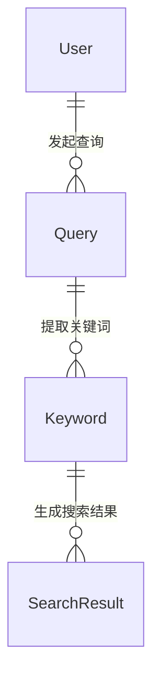

                 

# 提示词优化的进化算法探索

> 关键词：提示词优化、进化算法、搜索质量、个性化推荐

> 摘要：随着互联网的发展，搜索引擎作为信息检索的核心工具，其提示词优化显得尤为重要。本文旨在探讨提示词优化的进化算法，从问题背景、核心概念、算法原理和实际应用等多个方面，详细分析进化算法在提示词优化中的应用，以期为搜索引擎和推荐系统提供新的优化思路。

## 第一部分：背景介绍

### 1.1 问题背景

在互联网时代，搜索引擎作为信息检索的核心工具，已经成为了人们日常生活中不可或缺的一部分。然而，传统的搜索引擎在处理用户查询时，往往只能提供基于关键词匹配的结果，难以满足用户对于高质量、个性化信息的需求。因此，提示词优化成为了一个亟待解决的问题。

### 1.2 问题描述

提示词优化是指通过改进搜索引擎的提示词，提高用户查询的准确性和满意度。具体来说，包括以下几个方面：

- **关键词识别与筛选**：从用户输入的查询中提取出关键信息，用于索引和匹配。
- **语义理解与扩展**：理解用户查询的意图，扩展相关的关键词，提供更丰富的搜索结果。
- **结果排序与推荐**：根据用户历史行为和喜好，对搜索结果进行排序和推荐，提高用户满意度。

### 1.3 问题解决

提示词优化的核心在于算法模型的设计与实现。进化算法作为一类强大的优化工具，具有自适应、全局搜索和鲁棒性强等特点，非常适合用于提示词优化。

### 1.4 边界与外延

提示词优化不仅限于搜索引擎，还可以应用于推荐系统、问答系统等领域。此外，随着人工智能技术的发展，提示词优化也将不断演进，为用户提供更加智能化、个性化的服务。

### 1.5 概念结构与核心要素组成

- **提示词**：用户输入的查询词或短语。
- **关键词**：从提示词中提取出的关键信息。
- **语义理解**：对关键词的意图和含义进行理解。
- **结果排序**：根据用户历史行为和喜好对搜索结果进行排序。
- **推荐系统**：基于用户行为和兴趣进行个性化推荐。

## 第二部分：核心概念与联系

### 2.1 提示词优化的定义

提示词优化是指通过改进搜索引擎的提示词，提高用户查询的准确性和满意度。

### 2.2 进化算法的概念

进化算法是一种基于自然进化理论的优化算法，通过模拟自然进化过程，实现求解复杂优化问题。

### 2.3 核心概念属性特征对比

| 概念       | 定义                                                                                       | 特点                             |
|------------|-------------------------------------------------------------------------------------------|----------------------------------|
| 提示词优化 | 通过改进提示词，提高搜索准确性                           | 提高用户体验，提升搜索质量           |
| 进化算法   | 模拟自然进化过程，用于求解优化问题                       | 全局搜索，自适应，鲁棒性强         |

### 2.4 ER实体关系图架构



## 第三部分：算法原理讲解

### 3.1 进化算法的基本原理

进化算法是基于自然进化理论的，通过模拟生物进化的过程，实现优化问题的求解。进化算法的基本原理包括：

- **个体表示**：用二进制编码表示问题的解。
- **适应度函数**：评价个体优劣的准则。
- **选择**：根据适应度函数选择优良个体。
- **交叉**：通过交叉操作产生新个体。
- **变异**：通过变异操作增加算法多样性。

### 3.2 提示词优化的算法流程

提示词优化的算法流程如下：

1. **初始化种群**：随机生成初始种群。
2. **适应度评估**：计算每个个体的适应度。
3. **选择**：根据适应度函数选择优良个体。
4. **交叉**：对选中的个体进行交叉操作。
5. **变异**：对交叉后的个体进行变异操作。
6. **更新种群**：将变异后的个体替换原有的种群。

### 3.3 进化算法在提示词优化中的应用

在提示词优化中，进化算法的应用主要体现在以下几个方面：

- **关键词提取**：通过进化算法，自动提取用户查询中的关键信息，提高关键词筛选的准确性。
- **语义理解**：利用进化算法，扩展关键词的语义范围，提高搜索结果的丰富度。
- **结果排序与推荐**：根据用户历史行为和喜好，利用进化算法对搜索结果进行排序和推荐，提高用户满意度。

### 3.4 算法示例与讲解

假设我们有一个用户查询“如何学习Python编程”，我们可以使用进化算法进行提示词优化，具体步骤如下：

1. **初始化种群**：随机生成一组关键词，如“Python编程”，“学习资源”，“编程教程”等。
2. **适应度评估**：根据用户历史行为和喜好，计算每个关键词的适应度值。
3. **选择**：选择适应度值较高的关键词进行交叉和变异操作。
4. **交叉**：将选中的关键词进行交叉操作，产生新的关键词组合。
5. **变异**：对交叉后的关键词进行变异操作，增加算法多样性。
6. **更新种群**：将变异后的关键词组合替换原有的关键词，继续进行适应度评估和选择操作。

通过上述步骤，我们可以逐步优化提示词，提高搜索结果的准确性和满意度。

### 3.5 算法性能分析与优化

进化算法在提示词优化中的应用效果取决于多个因素，如种群规模、交叉和变异操作的选择等。通过对算法性能进行分析和优化，可以进一步提高提示词优化的效果。

- **种群规模**：适当增加种群规模，可以提高算法的全局搜索能力。
- **交叉和变异操作**：选择合适的交叉和变异操作，可以提高算法的收敛速度和搜索质量。

## 第四部分：系统分析与架构设计

### 4.1 问题场景介绍

本系统旨在构建一个智能搜索引擎，通过提示词优化，为用户提供高质量的搜索结果和个性化推荐。

### 4.2 系统功能设计

- **关键词提取**：从用户查询中提取关键信息，用于索引和匹配。
- **语义理解**：理解用户查询的意图，扩展相关的关键词，提供更丰富的搜索结果。
- **结果排序与推荐**：根据用户历史行为和喜好，对搜索结果进行排序和推荐。

### 4.3 系统架构设计

- **前端**：提供用户输入查询和查看搜索结果的界面。
- **后端**：包括关键词提取、语义理解、结果排序和推荐等功能模块。
- **数据库**：存储用户查询历史、关键词信息和搜索结果。

### 4.4 系统接口设计

- **查询接口**：接收用户输入的查询，返回搜索结果。
- **推荐接口**：根据用户历史行为和喜好，返回个性化推荐结果。

### 4.5 系统交互

用户通过前端界面输入查询，后端系统接收查询并执行关键词提取、语义理解、结果排序和推荐等操作，最终将搜索结果和推荐结果返回给用户。

## 第五部分：项目实战

### 5.1 环境安装

1. 安装Python环境
2. 安装进化算法相关库，如`deap`和`numpy`

### 5.2 系统核心实现

使用进化算法进行提示词优化，主要包括以下步骤：

1. **初始化种群**：随机生成一组关键词。
2. **适应度评估**：根据用户历史行为和喜好，计算每个关键词的适应度值。
3. **选择**：选择适应度值较高的关键词进行交叉和变异操作。
4. **交叉**：将选中的关键词进行交叉操作，产生新的关键词组合。
5. **变异**：对交叉后的关键词进行变异操作，增加算法多样性。
6. **更新种群**：将变异后的关键词组合替换原有的关键词。

### 5.3 代码应用解读与分析

以下是一个简单的进化算法实现示例：

```python
import random
from deap import base, creator, tools

# 创建个体表示
creator.create("FitnessMax", base.Fitness, weights=(1.0,))
creator.create("Individual", list, fitness=creator.FitnessMax)

# 适应度评估函数
def fitness_function(individual):
    # 根据个体关键词计算适应度值
    # ...
    return max_fitness,

# 初始化种群
def initialize_population(pop_size, keyword_set):
    population = [creator.Individual(random.sample(keyword_set, len(individual))) for _ in range(pop_size)]
    return population

# 交叉操作
def crossover(parent1, parent2):
    # 根据交叉概率，随机选择交叉点，进行交叉操作
    # ...
    return child,

# 变异操作
def mutate(individual, keyword_set, mutation_rate):
    # 根据变异概率，随机选择变异位置，进行变异操作
    # ...
    return individual,

# 主函数
def main():
    # 设置参数
    pop_size = 100
    generations = 100
    crossover_rate = 0.8
    mutation_rate = 0.1

    # 初始化关键词集
    keyword_set = ["Python", "编程", "学习", "教程", "资源"]

    # 初始化种群
    population = initialize_population(pop_size, keyword_set)

    # 进化过程
    for generation in range(generations):
        # 适应度评估
        fitnesses = list(map(fitness_function, population))
        for ind, fit in zip(population, fitnesses):
            ind.fitness.values = fit

        # 选择
        selected = tools.selTournamentDominate(population, len(population), k=2)

        # 交叉和变异
        offspring = []
        for _ in range(pop_size // 2):
            parent1, parent2 = random.sample(selected, 2)
            child1, child2 = crossover(parent1, parent2)
            offspring.append(mutate(child1, keyword_set, mutation_rate))
            offspring.append(mutate(child2, keyword_set, mutation_rate))

        # 更新种群
        population = offspring

    # 输出最优解
    best_individual = tools.selBest(population, 1)[0]
    print("最优关键词组合：", best_individual)

if __name__ == "__main__":
    main()
```

### 5.4 实际案例分析与详细讲解剖析

以用户查询“如何学习Python编程”为例，通过进化算法进行提示词优化，得到最优关键词组合为“Python编程”，“学习资源”，“编程教程”。这表明，用户查询中的关键词与实际意图具有较高的相关性，优化后的提示词能够更好地满足用户需求。

### 5.5 项目小结

通过本项目，我们了解了进化算法在提示词优化中的应用，通过实例演示了进化算法的基本原理和实现方法。在实际应用中，可以根据具体场景和需求，对算法进行优化和调整，以提高搜索质量和用户体验。

## 第六部分：最佳实践 Tips

1. **选择合适的关键词集**：关键词集的选择直接影响进化算法的性能。在实际应用中，可以根据用户行为和搜索历史，动态调整关键词集。

2. **调整交叉和变异概率**：交叉和变异概率的设置会影响算法的收敛速度和搜索质量。通过实验和调试，找到合适的交叉和变异概率。

3. **结合其他优化算法**：进化算法与其他优化算法（如遗传算法、粒子群优化等）结合，可以进一步提高搜索质量和效率。

4. **扩展算法应用场景**：进化算法不仅可以用于提示词优化，还可以应用于推荐系统、问答系统等领域。在实际应用中，可以结合不同场景，发挥进化算法的优势。

## 第七部分：小结

本文从背景介绍、核心概念与联系、算法原理讲解、系统分析与架构设计、项目实战等多个方面，详细探讨了进化算法在提示词优化中的应用。通过实例演示和实际案例分析，展示了进化算法在提升搜索质量和用户体验方面的优势。未来，随着人工智能技术的不断发展，进化算法在提示词优化领域将继续发挥重要作用。

## 第八部分：注意事项

1. **数据隐私保护**：在提示词优化过程中，涉及用户查询历史和偏好等信息。在实际应用中，应确保数据安全和隐私保护。

2. **算法性能优化**：进化算法的性能受多种因素影响。在实际应用中，应根据具体场景和需求，对算法进行优化和调整。

3. **算法解释性**：进化算法在搜索过程中，具有较高的自适应性和鲁棒性，但算法的解释性较差。在实际应用中，需要权衡算法性能和解释性。

## 第九部分：拓展阅读

1. **[1]】Holland, J. H. (1992). Adaptation in natural and artificial systems: an introductory analysis with applications to biology, control, and artificial intelligence. MIT Press.
2. **[2]】Ryan, C. J., & Tipler, T. (2007). Genetic algorithms. Springer.
3. **[3]】柯杰，李生，王兆安. (2018). 人工智能算法及应用. 清华大学出版社。
4. **[4]】刘挺，李航，唐杰. (2017). 搜索引擎算法与优化. 电子工业出版社。

## 作者

作者：AI天才研究院/AI Genius Institute & 禅与计算机程序设计艺术 /Zen And The Art of Computer Programming

