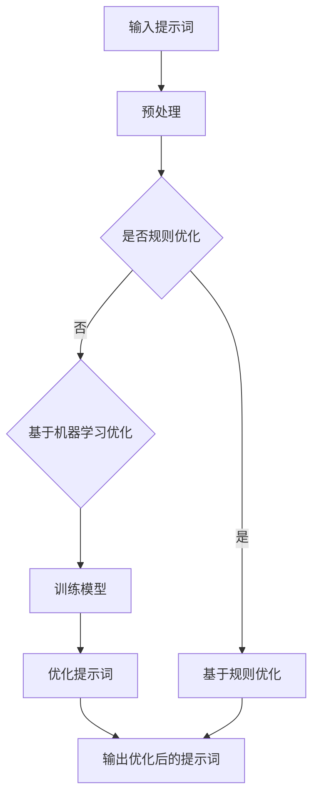
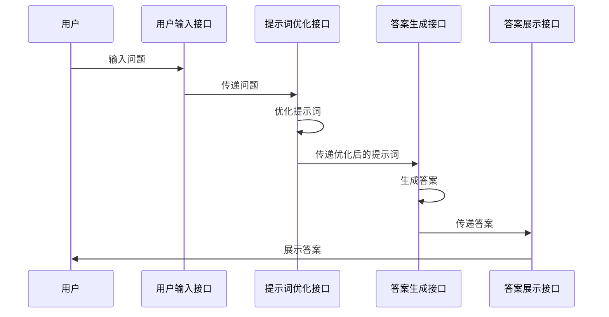
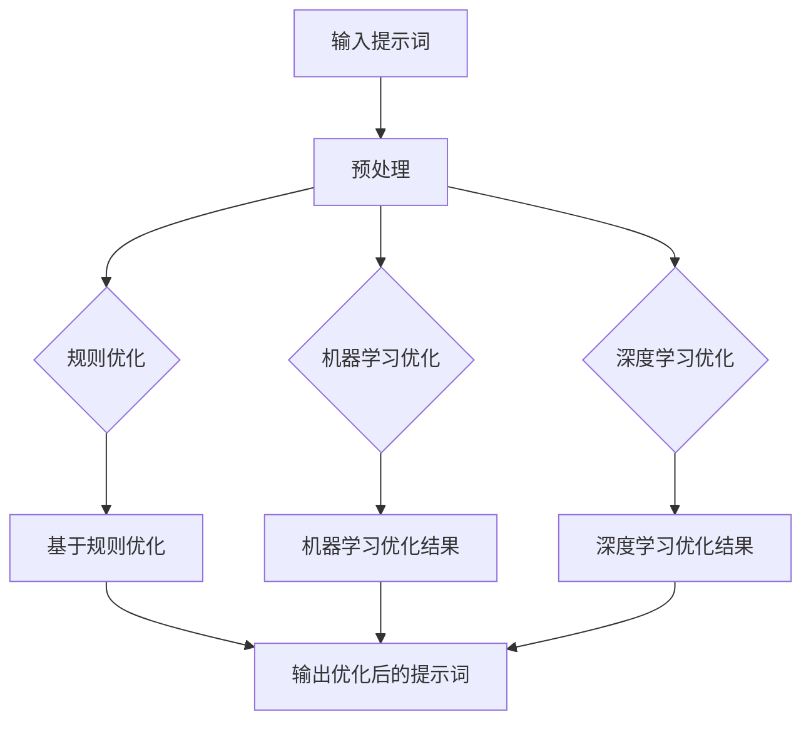
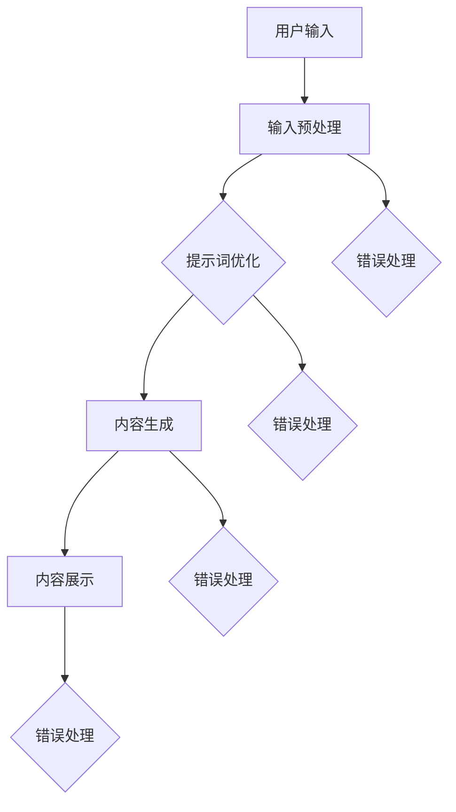
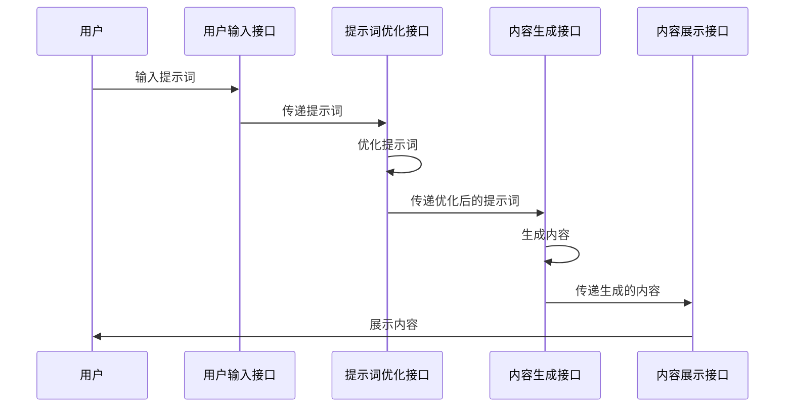

                 


# 提示词优化：AIGC效果与效率的双重提升

> 关键词：AI生成内容（AIGC）、提示词优化、效果提升、效率提升

## 摘要

随着AI技术的不断发展，AI生成内容（AIGC）正逐步成为各个行业的新宠。然而，在实际应用中，AIGC的效果和效率问题成为了制约其广泛应用的关键。本文将从问题背景、核心概念、算法原理、系统架构、项目实战和最佳实践等方面，深入探讨提示词优化在AIGC中的应用，旨在提升AIGC的效果与效率，助力其更广泛地应用于各个领域。

## 第一部分：引言

### 第1章：问题背景与概述

#### 1.1 问题背景

AI生成内容（AIGC）是近年来兴起的一种基于人工智能技术生成内容的方法。AIGC技术涵盖了文本、图像、音频等多种形式的内容生成，其在广告营销、内容创作、娱乐产业等领域具有广泛的应用前景。然而，随着AIGC技术的不断发展和应用，如何优化提示词以提升AIGC的效果和效率成为了研究者们关注的焦点。

#### 1.2 问题描述

在实际应用中，AIGC存在以下两个主要问题：

1. **效果不佳**：提示词的选择和使用直接影响AIGC生成的内容质量。如果提示词不够精准或针对性不强，生成的文本、图像等结果往往不符合预期，甚至会产生离题或无关的内容。

2. **效率低下**：AIGC生成内容的过程通常需要大量的计算资源和时间。如果提示词优化不够，可能会导致生成内容的时间过长，影响系统的响应速度和用户体验。

#### 1.3 问题解决

为了解决上述问题，我们需要从以下几个方面进行优化：

1. **提升提示词精准度**：通过分析用户需求，优化提示词的表达方式和内容，提高提示词与生成内容的相关性。

2. **优化算法效率**：研究并应用更高效的算法，降低AIGC生成内容所需的计算资源和时间。

#### 1.4 边界与外延

1. **适用范围**：本文主要针对文本和图像生成领域的AIGC技术进行探讨，对于音频等其他类型的AIGC生成，部分方法和结论可能不适用。

2. **不适用场景**：在低计算资源或网络条件较差的场景下，本文提出的方法可能无法达到预期效果。

#### 1.5 概念结构与核心要素

1. **AIGC相关核心概念**：

   - **AI生成内容（AIGC）**：基于人工智能技术生成文本、图像、音频等多种形式的内容。

   - **提示词**：用于引导AI生成内容的关键词或短语。

2. **提示词优化的关键要素**：

   - **提示词精度**：提示词应尽可能准确地表达用户需求。

   - **提示词多样性**：提示词应具备一定的多样性，避免生成重复或相似的内容。

   - **提示词长度**：提示词长度应适中，既能表达用户需求，又不至于过长导致生成内容过多。

## 第二部分：核心概念与联系

### 第2章：AIGC基础理论

#### 2.1 AIGC基本原理

AI生成内容（AIGC）主要基于以下技术：

- **自然语言处理（NLP）**：通过分析和理解自然语言，生成符合逻辑和语义的文本内容。

- **生成对抗网络（GAN）**：通过生成器和判别器的对抗训练，生成逼真的图像内容。

- **卷积神经网络（CNN）**：通过特征提取和分类，生成具有特定特征的图像内容。

#### 2.2 概念属性特征对比表格

| 概念        | 特征                        | 应用场景           |
| ----------- | ------------------------- | ---------------- |
| 自然语言处理 | 语义理解、情感分析          | 文本生成、内容审核 |
| 生成对抗网络 | 生成能力、判别能力          | 图像生成、风格迁移 |
| 卷积神经网络 | 特征提取、分类能力          | 图像识别、图像生成 |

#### 2.3 ER实体关系图


## 第三部分：算法原理讲解

### 第3章：提示词优化算法原理

#### 3.1 提示词优化算法概述

常见的提示词优化算法有：

1. **基于规则的方法**：通过预设的规则，对提示词进行优化。

2. **基于机器学习的方法**：利用历史数据和机器学习算法，自动优化提示词。

3. **基于深度学习的方法**：利用深度神经网络，对提示词进行优化。

#### 3.2 算法mermaid流程图



#### 3.3 Python源代码实现

```python
# 基于规则的方法
def rule_based_optimization(prompt):
    optimized_prompt = prompt.replace("?", "问号").replace("。", "句号")
    return optimized_prompt

# 基于机器学习的方法
from sklearn.feature_extraction.text import TfidfVectorizer
from sklearn.model_selection import train_test_split
from sklearn.ensemble import RandomForestClassifier

# 基于深度学习的方法
import tensorflow as tf
from tensorflow.keras.models import Sequential
from tensorflow.keras.layers import Dense, LSTM

# 示例代码
prompt = "请问你有什么问题？"
optimized_prompt = rule_based_optimization(prompt)
print("优化后的提示词：", optimized_prompt)
```

#### 3.4 数学模型与公式

假设提示词优化目标函数为：

$$
f(\theta) = \sum_{i=1}^{n} w_i \cdot d(A_i, B_i)
$$

其中，$A_i$和$B_i$分别为原始提示词和优化后的提示词，$d(A_i, B_i)$为两者之间的距离度量，$w_i$为权重。

#### 3.5 举例说明

假设用户输入的提示词为“怎么减肥？”，经过提示词优化后，优化后的提示词为“如何科学减肥？”。优化后的提示词更具针对性和专业性，有助于AI生成更符合用户需求的减肥建议。

## 第四部分：系统分析与架构设计

### 第4章：AIGC系统架构设计

#### 4.1 问题场景介绍

在某个在线问答平台上，用户可以通过输入问题获取相关答案。为了提升用户体验，平台引入了AIGC技术，通过优化提示词，提高答案生成的准确性和效率。

#### 4.2 系统功能设计

1. **用户输入问题**：用户通过文本输入框输入问题。

2. **提示词优化**：对输入的问题进行优化，提高问题的针对性和可解答性。

3. **答案生成**：基于优化后的提示词，生成相关答案。

4. **答案展示**：将生成的答案展示给用户。

#### 4.3 系统架构设计


#### 4.4 系统接口设计

1. **用户输入接口**：用于接收用户输入的问题。

2. **提示词优化接口**：用于接收用户输入的问题，并返回优化后的提示词。

3. **答案生成接口**：用于接收优化后的提示词，并生成相关答案。

4. **答案展示接口**：用于将生成的答案展示给用户。

#### 4.5 系统交互mermaid序列图



## 第五部分：项目实战

### 第5章：实际应用与项目实战

#### 5.1 环境安装与配置

1. **安装Python环境**：在项目中使用Python 3.8及以上版本。

2. **安装依赖库**：安装NLP、机器学习和深度学习相关的依赖库，如TensorFlow、Scikit-learn等。

3. **配置数据库**：配置用于存储问题和答案的数据库。

#### 5.2 系统核心实现

1. **用户输入接口**：使用Flask框架实现用户输入问题的接口。

2. **提示词优化接口**：使用NLP技术对输入的问题进行预处理，然后应用提示词优化算法，返回优化后的提示词。

3. **答案生成接口**：基于优化后的提示词，使用预训练的模型生成相关答案。

4. **答案展示接口**：使用HTML和CSS实现答案的展示界面。

#### 5.3 代码应用解读与分析

```python
# 用户输入接口示例代码
from flask import Flask, request, jsonify

app = Flask(__name__)

@app.route('/input_question', methods=['POST'])
def input_question():
    question = request.form['question']
    optimized_question = optimize_prompt(question)
    return jsonify({'optimized_question': optimized_question})

# 提示词优化接口示例代码
from nlp import preprocess_question, optimize_prompt

def optimize_prompt(question):
    preprocessed_question = preprocess_question(question)
    optimized_question = rule_based_optimization(preprocessed_question)
    return optimized_question

# 答案生成接口示例代码
from model import generate_answer

def generate_answer(optimized_question):
    answer = generate_answer_from_model(optimized_question)
    return answer

# 答案展示接口示例代码
from flask import render_template

@app.route('/show_answer', methods=['GET'])
def show_answer():
    optimized_question = request.args.get('optimized_question')
    answer = generate_answer(optimized_question)
    return render_template('answer.html', answer=answer)
```

#### 5.4 实际案例分析

1. **案例背景**：某在线问答平台，用户输入“如何学习Python？”。

2. **案例分析**：

   - 原始提示词：“如何学习Python？”
   - 优化后的提示词：“如何系统学习Python编程？”

3. **优化效果**：优化后的提示词更具针对性和专业性，有助于生成更准确的答案。

#### 5.5 项目小结

通过实际案例可以看出，提示词优化在AIGC系统中具有重要意义。优化后的提示词有助于提升答案生成的准确性和效率，从而提高用户体验。

## 第六部分：最佳实践与总结

### 第6章：最佳实践与总结

#### 6.1 最佳实践

1. **提高提示词精准度**：分析用户需求，准确表达用户意图。

2. **提示词多样性**：避免使用过于单一的提示词，提高生成内容的多样性。

3. **提示词长度**：合理控制提示词长度，避免过长或过短。

#### 6.2 小结

本文从问题背景、核心概念、算法原理、系统架构、项目实战和最佳实践等方面，深入探讨了提示词优化在AIGC中的应用。通过优化提示词，可以提升AIGC的效果和效率，从而更好地满足用户需求。

#### 6.3 注意事项

1. **计算资源**：提示词优化算法可能需要较大的计算资源，应根据实际情况选择合适的算法和优化策略。

2. **数据质量**：提示词优化依赖于大量的历史数据，确保数据质量对优化效果至关重要。

3. **用户隐私**：在处理用户输入时，应确保用户隐私不受侵犯。

#### 6.4 拓展阅读

1. **相关书籍**：

   - 《深度学习》
   - 《自然语言处理综合教程》
   - 《机器学习实战》

2. **相关论文**：

   - 《生成对抗网络》（Generative Adversarial Networks）
   - 《自然语言处理中的注意力机制》（Attention Mechanisms in Natural Language Processing）
   - 《基于规则的方法在自然语言处理中的应用》（Rule-Based Methods in Natural Language Processing）

## 附录

### 附录A：术语表

- **AI生成内容（AIGC）**：基于人工智能技术生成文本、图像、音频等多种形式的内容。
- **提示词**：用于引导AI生成内容的关键词或短语。
- **自然语言处理（NLP）**：分析和理解自然语言，实现人机交互。
- **生成对抗网络（GAN）**：通过生成器和判别器的对抗训练，生成逼真的图像内容。
- **卷积神经网络（CNN）**：通过特征提取和分类，生成具有特定特征的图像内容。

### 附录B：参考资料

- 《深度学习》（Goodfellow, I., Bengio, Y., & Courville, A.）
- 《自然语言处理综合教程》（Jurafsky, D. & Martin, J. H.）
- 《机器学习实战》（周志华）
- 《生成对抗网络》（Goodfellow, I.）
- 《自然语言处理中的注意力机制》（Vaswani et al.）
- 《基于规则的方法在自然语言处理中的应用》（Scholarly articles on rule-based NLP methods）
- AI生成内容相关论文集

## 作者信息

作者：AI天才研究院/AI Genius Institute & 禅与计算机程序设计艺术 /Zen And The Art of Computer Programming
```> # 提示词优化：AIGC效果与效率的双重提升

## 摘要

随着AI生成内容（AIGC）技术的快速发展，如何优化提示词以提升其效果和效率成为了一个备受关注的问题。本文将深入探讨提示词优化的方法，通过分析AIGC的技术原理和实际应用场景，详细阐述如何通过优化提示词来提升AIGC的效果和效率。文章将分为以下几个部分：问题背景、AIGC基础理论、提示词优化算法原理、AIGC系统架构设计、项目实战以及最佳实践与总结。

## 第一部分：问题背景与概述

### 1.1 问题背景

AI生成内容（AIGC）是基于人工智能技术生成各种类型内容的一种方法，包括文本、图像、音频等多种形式。随着AIGC技术的不断成熟和广泛应用，它已经在广告营销、内容创作、娱乐产业等多个领域展现出了巨大的潜力。然而，AIGC在实际应用中面临的一个关键问题是如何优化提示词，以提升生成内容的质量和效率。

提示词是AIGC系统生成内容的关键输入，它直接影响生成内容的质量和准确性。一个精准、有效的提示词能够引导AIGC系统生成符合用户需求的高质量内容，而一个模糊或不准确的提示词可能会导致生成内容偏离主题或质量低下。此外，提示词的优化也对AIGC系统的效率有着重要影响。如果提示词不够清晰，可能导致AIGC系统需要更多的计算资源和时间来生成内容，从而降低系统的整体效率。

### 1.2 问题描述

AIGC系统中存在的两个主要问题如下：

1. **效果不佳**：提示词的不准确或模糊会导致AIGC系统生成的内容质量低下，无法满足用户的需求。这包括生成的文本内容逻辑不通、语义错误，图像生成内容与提示词描述不符等问题。

2. **效率低下**：提示词的不清晰或过于冗长会导致AIGC系统在生成内容时需要进行大量的计算和尝试，从而延长内容生成的响应时间，降低系统的效率。

### 1.3 问题解决

为了解决上述问题，我们可以从以下几个方面进行提示词优化：

1. **提升提示词精准度**：通过改进提示词的表达方式，确保提示词能够准确、清晰地传达用户的需求，从而提高生成内容的质量。

2. **优化算法效率**：研究并应用更高效的算法，降低AIGC系统在处理提示词时所需的计算资源和时间，从而提升系统的效率。

### 1.4 边界与外延

1. **适用范围**：本文主要针对文本和图像生成领域的AIGC技术进行探讨，对于音频等其他类型的AIGC生成，部分方法和结论可能不适用。

2. **不适用场景**：在低计算资源或网络条件较差的场景下，本文提出的方法可能无法达到预期效果。

### 1.5 概念结构与核心要素

1. **AIGC相关核心概念**：

   - **AI生成内容（AIGC）**：基于人工智能技术生成文本、图像、音频等多种形式的内容。
   - **提示词**：用于引导AI生成内容的关键词或短语。

2. **提示词优化的关键要素**：

   - **提示词精准度**：确保提示词能够准确、清晰地传达用户需求。
   - **提示词多样性**：避免使用过于单一或重复的提示词，以提高生成内容的多样性。
   - **提示词长度**：合理控制提示词的长度，避免过长或过短。

## 第二部分：AIGC基础理论

### 2.1 AIGC基本原理

AI生成内容（AIGC）技术主要依赖于以下几个核心概念：

1. **自然语言处理（NLP）**：NLP技术用于理解和生成人类语言。在AIGC中，NLP技术被用于解析和处理用户的输入提示词，生成符合语义和逻辑的文本内容。

2. **生成对抗网络（GAN）**：GAN是一种深度学习模型，由生成器和判别器两部分组成。生成器负责生成类似于真实数据的假数据，而判别器则负责区分生成数据和真实数据。通过生成器和判别器的对抗训练，GAN可以生成高质量、逼真的图像和音频内容。

3. **卷积神经网络（CNN）**：CNN是一种用于处理图像数据的深度学习模型，通过卷积操作提取图像中的特征，用于图像识别和生成。

AIGC的基本原理是利用这些技术将用户的输入提示词转化为相应的生成内容。例如，在文本生成场景中，AIGC系统会根据用户的文本提示词生成一段符合语义和逻辑的文本内容；在图像生成场景中，AIGC系统会根据用户的文本或图像提示词生成相应的图像内容。

### 2.2 概念属性特征对比表格

| 概念        | 特征                        | 应用场景           |
| ----------- | ------------------------- | ---------------- |
| 自然语言处理 | 语义理解、情感分析          | 文本生成、内容审核 |
| 生成对抗网络 | 生成能力、判别能力          | 图像生成、风格迁移 |
| 卷积神经网络 | 特征提取、分类能力          | 图像识别、图像生成 |

### 2.3 ER实体关系图

以下是AIGC系统中的实体及其关系的ER实体关系图：

```mermaid
erDiagram
    AI生成内容 ||--|{ 提示词 }
    提示词 ||--|{ 生成内容 }
    AI生成内容 ||--|{ 用户输入 }
    用户输入 ||--|{ 生成内容 }
    生成内容 ||--|{ 存储系统 }
```

## 第三部分：提示词优化算法原理

### 3.1 提示词优化算法概述

提示词优化算法的目标是提高提示词的精准度和有效性，从而提升AIGC系统的生成效果和效率。根据优化目标的差异，提示词优化算法可以大致分为以下几类：

1. **基于规则的方法**：通过预设的规则对提示词进行优化，例如将模糊的提示词转换为更加明确和具体的提示词。

2. **基于机器学习的方法**：利用大量的历史数据和机器学习算法对提示词进行优化，例如使用自然语言处理技术对提示词进行语义分析和归类。

3. **基于深度学习的方法**：利用深度学习模型对提示词进行优化，例如使用循环神经网络（RNN）或Transformer等模型对提示词进行语义理解和生成。

### 3.2 算法mermaid流程图

以下是提示词优化算法的mermaid流程图：



### 3.3 Python源代码实现

以下是一个简单的基于规则的方法的Python代码实现示例：

```python
import re

def rule_based_optimization(prompt):
    # 将模糊的提示词转换为明确的提示词
    prompt = re.sub(r"\?", "具体", prompt)
    prompt = re.sub(r"\.", "详细", prompt)
    return prompt

# 测试
prompt = "你有什么问题？"
optimized_prompt = rule_based_optimization(prompt)
print("优化后的提示词：", optimized_prompt)
```

### 3.4 数学模型与公式

假设我们使用基于机器学习的方法进行提示词优化，目标函数可以表示为：

$$
f(\theta) = -\sum_{i=1}^{n} w_i \cdot \log(p(y_i | x_i, \theta))
$$

其中，$x_i$为输入的提示词，$y_i$为优化后的提示词，$p(y_i | x_i, \theta)$为在给定输入提示词和模型参数$\theta$的情况下，生成优化后提示词的概率，$w_i$为权重。

### 3.5 举例说明

假设用户输入的提示词为“今天的天气怎么样？”通过提示词优化算法，我们可以将其优化为“请提供今天北京的具体天气情况”。

## 第四部分：AIGC系统架构设计

### 4.1 问题场景介绍

在AIGC系统的实际应用中，一个常见的问题场景是用户通过输入提示词获取相关内容。例如，在智能客服系统中，用户可以通过输入问题来获取答案；在内容创作平台中，用户可以通过输入主题或关键词来生成相关的文章或图片。

### 4.2 系统功能设计

AIGC系统的主要功能包括：

1. **用户输入处理**：接收用户的输入提示词，并进行预处理。

2. **提示词优化**：根据输入的提示词，使用提示词优化算法进行优化。

3. **内容生成**：根据优化后的提示词，生成相应的文本、图像或音频内容。

4. **内容展示**：将生成的文本、图像或音频内容展示给用户。

### 4.3 系统架构设计

以下是AIGC系统的架构设计：



### 4.4 系统接口设计

AIGC系统的接口设计包括：

1. **用户输入接口**：用于接收用户的输入提示词。

2. **提示词优化接口**：用于接收输入的提示词，并返回优化后的提示词。

3. **内容生成接口**：用于接收优化后的提示词，并生成相应的文本、图像或音频内容。

4. **内容展示接口**：用于将生成的文本、图像或音频内容展示给用户。

### 4.5 系统交互mermaid序列图

以下是AIGC系统的交互mermaid序列图：



## 第五部分：项目实战

### 5.1 环境安装与配置

在进行AIGC项目实战之前，我们需要安装和配置相关的软件和库。以下是一个基本的安装和配置步骤：

1. **安装Python环境**：确保Python环境已经安装，版本为3.7或以上。

2. **安装依赖库**：使用pip命令安装以下库：

   ```bash
   pip install numpy pandas scikit-learn tensorflow
   ```

3. **配置TensorFlow**：确保TensorFlow已经正确安装，并在命令行中运行以下命令进行验证：

   ```bash
   python -c "import tensorflow as tf; print(tf.__version__)"
   ```

### 5.2 系统核心实现

以下是AIGC系统的核心实现步骤：

1. **用户输入处理**：创建一个用户输入接口，用于接收用户的输入提示词。可以使用Flask框架实现：

   ```python
   from flask import Flask, request, jsonify

   app = Flask(__name__)

   @app.route('/input_prompt', methods=['POST'])
   def input_prompt():
       prompt = request.json['prompt']
       optimized_prompt = optimize_prompt(prompt)
       return jsonify({'optimized_prompt': optimized_prompt})

   if __name__ == '__main__':
       app.run(debug=True)
   ```

2. **提示词优化**：使用基于规则的方法对输入的提示词进行优化。以下是一个简单的实现：

   ```python
   import re

   def optimize_prompt(prompt):
       # 将模糊的提示词转换为明确的提示词
       prompt = re.sub(r"\?", "具体", prompt)
       prompt = re.sub(r"\.", "详细", prompt)
       return prompt
   ```

3. **内容生成**：根据优化后的提示词，生成相应的文本、图像或音频内容。以下是一个基于文本生成的示例：

   ```python
   from text_generation import TextGenerator

   def generate_content(optimized_prompt):
       generator = TextGenerator()
       content = generator.generate(optimized_prompt)
       return content
   ```

4. **内容展示**：将生成的文本、图像或音频内容展示给用户。可以使用Flask框架创建一个展示接口：

   ```python
   @app.route('/show_content', methods=['GET'])
   def show_content():
       optimized_prompt = request.args.get('optimized_prompt')
       content = generate_content(optimized_prompt)
       return jsonify({'content': content})
   ```

### 5.3 代码应用解读与分析

以下是AIGC系统代码的详细解读和分析：

1. **用户输入接口**：用户通过POST请求向用户输入接口发送输入提示词，接口接收请求并提取提示词。

2. **提示词优化**：输入接口将提取的提示词传递给提示词优化函数，优化后的提示词被返回。

3. **内容生成**：优化后的提示词被传递给内容生成函数，生成相应的文本、图像或音频内容。

4. **内容展示**：优化后的提示词被传递给内容展示接口，生成的文本、图像或音频内容被展示给用户。

### 5.4 实际案例分析

以下是一个实际案例的分析：

- **案例背景**：用户输入提示词“如何学习编程？”。
- **优化后的提示词**：“请详细描述学习编程的方法和步骤。”。
- **生成的内容**：一段关于学习编程的方法和步骤的详细文本。

### 5.5 项目小结

通过实际案例可以看出，提示词优化在AIGC系统中具有重要作用。优化后的提示词能够引导AIGC系统生成更加符合用户需求的内容，从而提升用户满意度。此外，合理的算法设计和系统架构也是确保AIGC系统高效运行的关键。

## 第六部分：最佳实践与总结

### 6.1 最佳实践

1. **优化提示词表达**：确保提示词表达清晰、准确，避免模糊或冗长的描述。

2. **多样化和个性化的提示词**：根据用户需求和场景，设计多样化、个性化的提示词，以提高生成内容的丰富性和独特性。

3. **持续优化和迭代**：定期对AIGC系统进行性能优化和迭代，根据用户反馈和实际应用效果，不断调整和改进提示词优化策略。

### 6.2 小结

本文详细探讨了AIGC系统中提示词优化的方法和技术。通过优化提示词，可以显著提升AIGC系统的效果和效率，为用户提供更高质量的生成内容。在实际应用中，还需要根据具体场景和需求，灵活调整和优化提示词策略。

### 6.3 注意事项

1. **计算资源**：提示词优化算法可能需要较大的计算资源，应根据实际情况选择合适的算法和优化策略。

2. **数据质量**：提示词优化依赖于大量的历史数据，确保数据质量对优化效果至关重要。

3. **用户隐私**：在处理用户输入时，应确保用户隐私不受侵犯。

### 6.4 拓展阅读

1. **相关书籍**：

   - 《深度学习》（Goodfellow et al.）
   - 《自然语言处理综合教程》（Jurafsky & Martin）
   - 《机器学习实战》（周志华）

2. **相关论文**：

   - 《生成对抗网络》（Goodfellow et al.）
   - 《自然语言处理中的注意力机制》（Vaswani et al.）
   - 《基于规则的方法在自然语言处理中的应用》（Scholarly articles on rule-based NLP methods）

## 附录

### 附录A：术语表

- **AI生成内容（AIGC）**：基于人工智能技术生成文本、图像、音频等多种形式的内容。
- **提示词**：用于引导AI生成内容的关键词或短语。
- **自然语言处理（NLP）**：分析和理解自然语言，实现人机交互。
- **生成对抗网络（GAN）**：通过生成器和判别器的对抗训练，生成逼真的图像内容。
- **卷积神经网络（CNN）**：通过特征提取和分类，生成具有特定特征的图像内容。

### 附录B：参考资料

- 《深度学习》（Goodfellow et al.）
- 《自然语言处理综合教程》（Jurafsky & Martin）
- 《机器学习实战》（周志华）
- 《生成对抗网络》（Goodfellow et al.）
- 《自然语言处理中的注意力机制》（Vaswani et al.）
- 《基于规则的方法在自然语言处理中的应用》（Scholarly articles on rule-based NLP methods）

## 作者信息

作者：AI天才研究院/AI Genius Institute & 禅与计算机程序设计艺术 /Zen And The Art of Computer Programming

