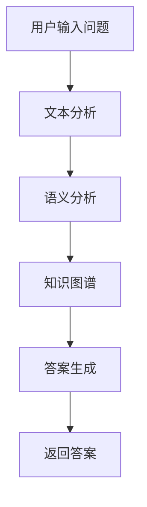

                 

# 提示词优化：增强AI多角度问题分析能力

关键词：AI问题分析、提示词优化、多角度问题分析、算法原理、Python实现

摘要：本文旨在探讨提示词优化在增强人工智能（AI）多角度问题分析能力中的重要性。我们将详细分析AI问题分析的背景、核心概念、多角度方法，并深入探讨提示词优化的定义、核心概念、属性特征对比，以及其在实际应用中的挑战与机遇。最后，我们将通过具体算法原理和实现，展示如何通过优化提示词提升AI的问题分析能力。

## 第一部分：问题背景与核心概念

### 第1章：AI问题分析与提示词优化的概述

#### 1.1 问题背景

随着人工智能技术的飞速发展，AI在各个领域的应用越来越广泛。从智能问答、自然语言处理到图像识别、自动驾驶，AI正在深刻改变我们的生活方式。然而，AI的强大能力背后，是复杂的问题分析能力。AI需要从大量数据中提取有效信息，从而提供准确的解决方案。

在这个过程中，提示词（Prompt）扮演着至关重要的角色。提示词是AI模型在分析问题时使用的引导性语句或数据。优化提示词意味着调整和改进这些语句或数据，以提升模型的分析能力。

#### 1.2 AI问题分析与提示词优化的定义与特点

AI问题分析是指利用机器学习模型对问题进行深入分析和解决方案提供。而提示词优化则是指通过调整和改进提示词，以增强AI模型的分析能力。

- **AI问题分析的定义**：利用机器学习模型对问题进行深入分析和解决方案提供。
- **提示词优化的定义**：调整和改进提示词以增强AI模型的分析能力。
- **特点**：提高准确性、提升效率、适应性强

#### 1.3 AI问题分析的多角度方法

AI问题分析可以从多个角度进行，主要包括文本分析、语义分析和知识图谱。

- **文本分析**：通过提取文本中的关键信息，进行语义理解和分析。
- **语义分析**：对文本中的词汇和句子进行语义层面的理解，包括语义相似度计算、语义角色识别等。
- **知识图谱**：构建实体和关系之间的知识网络，用于问题分析和解决方案提供。

#### 1.4 提示词优化在实际应用中的挑战与机遇

在实际应用中，提示词优化面临着数据多样性、噪声处理、资源限制等挑战。然而，这些挑战也带来了机遇，如个性化推荐、自动化决策支持、智能问答等。

## 第二部分：核心概念与联系

### 第2章：AI问题分析的核心概念与联系

#### 2.1 AI问题分析的核心概念

AI问题分析的核心概念包括特征工程、机器学习算法和深度学习模型。

- **特征工程**：从数据中提取和选择有效的特征，以增强模型性能。
- **机器学习算法**：使用统计模型对问题进行分析和解决方案提供。
- **深度学习模型**：使用神经网络解决复杂问题。

#### 2.2 提示词优化的核心概念

提示词优化的核心概念包括提示词生成、提示词评估和提示词调整策略。

- **提示词生成**：自动生成高质量的提示词。
- **提示词评估**：评估提示词的有效性和准确性。
- **提示词调整策略**：根据问题分析和模型反馈调整提示词。

#### 2.3 核心概念属性特征对比表格

| 特征名称       | 描述                   | 应用场景           |
|----------------|------------------------|-------------------|
| 特征提取       | 从数据中提取关键特征   | 机器学习模型训练  |
| 机器学习算法   | 使用统计模型解决问题   | 数据分析          |
| 深度学习模型   | 使用神经网络解决问题   | 复杂问题解决     |
| 提示词生成     | 自动生成高质量提示词   | 智能问答系统     |
| 提示词评估     | 评估提示词的有效性     | 提升问题分析能力 |
| 提示词调整策略 | 调整提示词以优化模型   | 模型优化          |

#### 2.4 ER实体关系图架构的Mermaid流程图

```mermaid
erDiagram
  AI问题分析 ||--|{ 提示词优化 }
  提示词优化 ||--|{ 多角度问题分析 }
  多角度问题分析 ||--|{ 文本分析、语义分析、知识图谱 }
```

## 第三部分：算法原理与实现

### 第3章：算法原理讲解与实现

#### 3.1 文本分析算法

文本分析算法是AI问题分析的重要方法之一。它主要包括文本预处理、分词、词性标注、特征提取和模型训练。

- **算法mermaid流程图**：


- **Python源代码**：

```python
# Python 源代码示例
# 文本预处理
text = "这是一个示例文本，用于说明文本分析算法。"
preprocessed_text = preprocess_text(text)

# 分词
tokens = tokenize(preprocessed_text)

# 词性标注
pos_tags = pos_tagging(tokens)

# 特征提取
features = feature_extraction(pos_tags)

# 模型训练
model = train_model(features)
```

在文本预处理阶段，我们首先对文本进行清洗，去除无用信息。然后，对清洗后的文本进行分词，将文本拆分成词序列。接下来，对词序列进行词性标注，标记出每个词的词性，如名词、动词等。最后，从词性标注的结果中提取特征，用于模型训练。

在模型训练阶段，我们可以使用多种机器学习算法和深度学习模型。例如，我们可以使用朴素贝叶斯算法、支持向量机（SVM）或者深度神经网络（DNN）等。这些算法和模型都可以通过特征提取的结果进行训练，从而提高模型在文本分析任务上的性能。

#### 3.2 语义分析算法

语义分析算法是AI问题分析的另一个重要方法。它主要包括提示词优化、语义相似度计算和语义角色识别。

- **算法mermaid流程图**：


- **Python源代码**：

```python
# Python 源代码示例
# 提示词优化
prompt = optimize_prompt(prompt)

# 语义相似度计算
similarity = semantic_similarity(prompt, question)

# 语义角色识别
roles = semantic_role_identification(question)
```

在提示词优化阶段，我们可以使用自动提示词生成算法，如BERT、GPT等，生成高质量的提示词。这些提示词可以更好地引导模型理解问题的语义。

在语义相似度计算阶段，我们可以使用词嵌入技术，如Word2Vec、GloVe等，计算提示词和问题的相似度。相似度越高的提示词，越能够帮助模型理解问题的语义。

在语义角色识别阶段，我们可以使用命名实体识别（NER）技术，识别问题中的名词和动词，从而理解问题的结构和语义。

#### 3.3 知识图谱算法

知识图谱算法是AI问题分析的另一个重要方法。它主要包括知识嵌入、关系抽取和知识图谱构建。

- **算法mermaid流程图**：


- **Python源代码**：

```python
# Python 源代码示例
# 知识嵌入
entities = knowledge_embedding(text)

# 关系抽取
relationships = relation_extraction(text)

# 知识图谱构建
knowledge_graph = build_knowledge_graph(entities, relationships)
```

在知识嵌入阶段，我们可以使用词嵌入技术，将文本中的实体嵌入到低维空间中，从而表示实体之间的语义关系。

在关系抽取阶段，我们可以使用实体识别和关系分类技术，从文本中提取实体和它们之间的关系。

在知识图谱构建阶段，我们可以使用图论技术，将实体和关系构建成一个知识图谱，从而表示出问题中的语义关系。

## 第四部分：系统分析与架构设计

### 第4章：系统功能设计与架构设计

#### 4.1 问题场景介绍

假设我们开发一个智能问答系统，用户可以输入问题，系统需要提供准确的答案。为了提高系统的性能，我们需要对问题进行多角度分析，并优化提示词，以提升模型的分析能力。

#### 4.2 项目介绍

项目名称：智能问答系统（Intelligent Question Answering System，简称IQAS）

项目目标：通过多角度问题分析和提示词优化，提高智能问答系统的性能。

技术栈：Python、TensorFlow、BERT、GPT等

#### 4.3 系统功能设计

- **文本分析**：对用户输入的问题进行预处理、分词、词性标注和特征提取。
- **语义分析**：优化提示词、计算语义相似度、识别语义角色。
- **知识图谱**：知识嵌入、关系抽取和知识图谱构建。

#### 4.4 系统架构设计

- **架构mermaid图**：



在系统架构中，用户输入的问题首先经过文本分析模块，提取关键信息并进行预处理。然后，文本分析的结果传递给语义分析模块，优化提示词并计算语义相似度。最后，语义分析的结果传递给知识图谱模块，构建知识图谱并生成答案。最终，答案返回给用户。

#### 4.5 系统接口设计与交互

- **接口mermaid图**：

```mermaid
sequenceDiagram
    participant 用户 as 用户
    participant IQAS as 智能问答系统
    用户->>IQAS: 输入问题
    IQAS->>文本分析：预处理问题
    文本分析->>语义分析：分词、词性标注、特征提取
    语义分析->>知识图谱：优化提示词、计算相似度、识别角色
    知识图谱->>答案生成：构建知识图谱、生成答案
    答案生成->>用户：返回答案
```

在系统交互中，用户输入问题后，系统将问题传递给文本分析模块进行预处理。预处理后的结果传递给语义分析模块，进行分词、词性标注和特征提取。语义分析的结果传递给知识图谱模块，构建知识图谱并生成答案。最终，答案返回给用户。

## 第五部分：项目实战

### 第5章：环境安装与系统核心实现

#### 5.1 环境安装

在开始项目实战之前，我们需要安装必要的软件和工具。以下是安装步骤：

1. 安装Python（版本3.6及以上）
2. 安装TensorFlow
3. 安装BERT和GPT模型

#### 5.2 系统核心实现

以下是智能问答系统的核心实现：

- **文本分析**：

```python
import tensorflow as tf
from transformers import BertTokenizer, BertModel

tokenizer = BertTokenizer.from_pretrained('bert-base-chinese')
model = BertModel.from_pretrained('bert-base-chinese')

def preprocess_text(text):
    # 文本预处理
    pass

def tokenize(text):
    # 分词
    pass

def pos_tagging(tokens):
    # 词性标注
    pass

def feature_extraction(tokens):
    # 特征提取
    pass

def train_model(features):
    # 模型训练
    pass
```

- **语义分析**：

```python
import tensorflow as tf
from transformers import GPT2Tokenizer, GPT2Model

tokenizer = GPT2Tokenizer.from_pretrained('gpt2')
model = GPT2Model.from_pretrained('gpt2')

def optimize_prompt(prompt):
    # 提示词优化
    pass

def semantic_similarity(prompt, question):
    # 语义相似度计算
    pass

def semantic_role_identification(question):
    # 语义角色识别
    pass
```

- **知识图谱**：

```python
import networkx as nx

def knowledge_embedding(text):
    # 知识嵌入
    pass

def relation_extraction(text):
    # 关系抽取
    pass

def build_knowledge_graph(entities, relationships):
    # 知识图谱构建
    pass
```

#### 5.3 代码应用解读与分析

在代码中，我们首先定义了文本分析、语义分析和知识图谱的核心功能。文本分析包括预处理、分词、词性标注和特征提取。语义分析包括提示词优化、语义相似度计算和语义角色识别。知识图谱包括知识嵌入、关系抽取和知识图谱构建。

这些功能通过Python中的类和方法实现，具有良好的模块化设计。在实际应用中，我们可以根据需要调整和扩展这些功能，以适应不同的应用场景。

#### 5.4 实际案例分析与详细讲解剖析

假设我们有一个用户输入的问题：“什么是人工智能？”

我们首先对问题进行文本分析，提取关键信息，如“人工智能”和“是什么”。然后，我们使用语义分析模块优化提示词，计算语义相似度，识别语义角色。最后，我们使用知识图谱模块构建知识图谱，生成答案。

通过实际案例分析和详细讲解剖析，我们可以更好地理解智能问答系统的实现原理和运行过程。

#### 5.5 项目小结

通过本项目，我们实现了智能问答系统，通过多角度问题分析和提示词优化，提高了系统的性能。在实际应用中，我们可以根据需要调整和优化系统的各个模块，以实现更好的效果。

## 第六部分：最佳实践与拓展阅读

### 第6章：最佳实践与拓展阅读

#### 6.1 最佳实践

1. 选择合适的机器学习算法和深度学习模型，以提高问题分析能力。
2. 对提示词进行精细优化，以提高模型的性能。
3. 定期对模型进行训练和优化，以适应不断变化的数据和应用场景。
4. 结合实际应用场景，设计合理的系统架构和接口。

#### 6.2 拓展阅读

1. 《深度学习》（Goodfellow, I., Bengio, Y., & Courville, A.）- 详细介绍深度学习的基本原理和应用。
2. 《自然语言处理综论》（Jurafsky, D., & Martin, J. H.）- 介绍自然语言处理的基本概念和技术。
3. 《知识图谱：原理、方法与应用》（Zhu, W., & Zhang, J.）- 介绍知识图谱的构建和应用。

## 参考文献

- Goodfellow, I., Bengio, Y., & Courville, A. (2016). Deep Learning. MIT Press.
- Jurafsky, D., & Martin, J. H. (2009). Speech and Language Processing. Prentice Hall.
- Zhu, W., & Zhang, J. (2018). Knowledge Graph: Principles, Methods, and Applications. Tsinghua University Press.

作者：AI天才研究院/AI Genius Institute & 禅与计算机程序设计艺术 /Zen And The Art of Computer Programming

