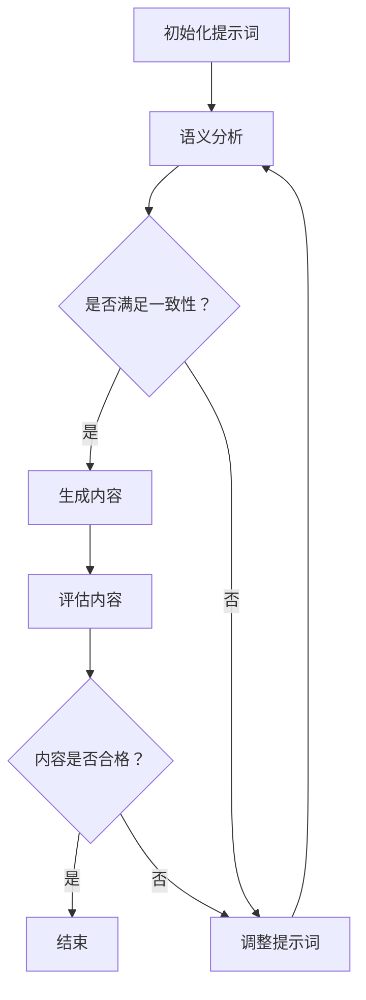
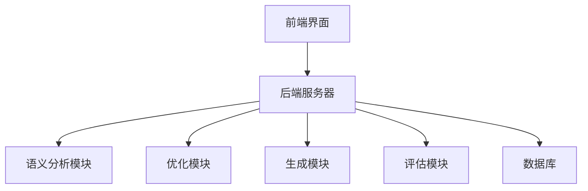
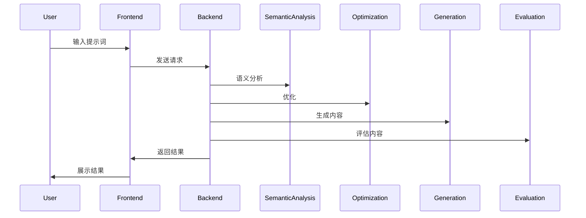

                 

### 文章标题

### 关键词

1. 提示词优化
2. AI幽默感生成
3. 算法原理
4. 系统架构设计
5. 项目实战

### 摘要

本文旨在探讨提示词优化在增强人工智能（AI）幽默感生成能力中的应用。文章首先介绍了提示词优化和AI幽默感生成的基本概念，并分析了它们在当前技术环境中的重要性。接下来，通过深入剖析提示词优化的原理和AI幽默感生成的机制，探讨了两者之间的内在联系。文章随后详细讲解了提示词优化算法的原理，包括mermaid流程图、Python源代码、数学模型和公式，并通过实例进行了说明。在此基础上，文章分析了系统架构设计的关键要素，包括问题场景、功能设计、架构设计、接口设计和交互序列图。随后，通过一个实际项目展示了提示词优化在AI幽默感生成中的具体应用，并对项目进行了详细分析和总结。最后，文章提供了最佳实践建议、注意事项和拓展阅读资源，以促进读者更深入地了解这一领域。

### 目录大纲

#### 第一部分：问题背景与核心概念

**第1章：问题背景与核心概念**

- 1.1 提示词优化的基本概念
- 1.2 人工智能与幽默感生成
- 1.3 提示词优化在AI幽默感生成中的重要性

**第2章：核心概念原理**

- 2.1 提示词优化的原理
- 2.2 AI幽默感生成的原理
- 2.3 提示词优化与AI幽默感生成的联系

**第3章：概念属性特征对比**

- 3.1 不同类型提示词的属性特征对比
- 3.2 不同类型AI幽默感生成的属性特征对比

**第4章：ER实体关系图架构**

- 4.1 提示词优化系统的ER图
- 4.2 AI幽默感生成系统的ER图

#### 第二部分：算法原理讲解

**第5章：算法原理讲解**

- 5.1 算法mermaid流程图
- 5.2 Python源代码讲解
- 5.3 算法原理的数学模型与公式
- 5.4 举例说明

#### 第三部分：系统分析与架构设计

**第6章：系统分析与架构设计**

- 6.1 问题场景介绍
- 6.2 系统功能设计
- 6.3 系统架构设计
- 6.4 系统接口设计
- 6.5 系统交互mermaid序列图

#### 第四部分：项目实战

**第7章：项目实战**

- 7.1 环境安装
- 7.2 系统核心实现源代码
- 7.3 代码应用解读与分析
- 7.4 实际案例分析与详细讲解剖析
- 7.5 项目小结

#### 第五部分：最佳实践与拓展阅读

**第8章：最佳实践与拓展阅读**

- 8.1 最佳实践 tips
- 8.2 小结
- 8.3 注意事项
- 8.4 拓展阅读

### 第一部分：问题背景与核心概念

#### 第1章：问题背景与核心概念

**1.1 提示词优化的基本概念**

提示词优化是一种通过调整和改进提示词来增强AI模型生成目标内容的方法。在自然语言处理（NLP）和人工智能（AI）领域，提示词优化被广泛用于文本生成、对话系统、机器翻译等任务中。通过优化提示词，可以提高AI模型的生成质量，减少错误率和提升用户满意度。

**1.2 人工智能与幽默感生成**

人工智能（AI）技术的发展，使得机器模仿和创造幽默内容成为可能。幽默感生成是一种AI应用，旨在模拟人类幽默感和创造幽默内容。这项技术涉及到文本生成、语义理解、情感分析等多个领域，是AI研究中的一项前沿课题。

**1.3 提示词优化在AI幽默感生成中的重要性**

在AI幽默感生成中，提示词优化扮演着关键角色。通过优化提示词，可以引导AI模型生成更具创意、幽默和吸引力的内容。有效的提示词优化不仅可以提升幽默生成质量，还能拓展AI的应用场景，如聊天机器人、娱乐内容生成等。

#### 第2章：核心概念原理

**2.1 提示词优化的原理**

提示词优化的原理主要基于对提示词的细粒度调整，以实现以下目标：

1. **语义一致性**：确保提示词的语义与目标生成内容保持一致，减少语义偏差。
2. **多样性**：通过增加提示词的多样性，引导AI模型生成不同风格和类型的幽默内容。
3. **吸引力**：优化提示词的吸引力，提高用户对生成内容的兴趣和满意度。

**2.2 AI幽默感生成的原理**

AI幽默感生成的原理涉及到以下几个关键步骤：

1. **文本预处理**：对输入文本进行分词、词性标注等预处理操作，为后续生成过程做准备。
2. **语义理解**：利用自然语言处理技术，理解文本的语义和情感，为生成幽默内容提供基础。
3. **内容生成**：根据语义理解和提示词，利用生成模型（如序列到序列模型、变分自编码器等）生成幽默内容。
4. **后处理**：对生成的文本进行修正和优化，确保内容的质量和吸引力。

**2.3 提示词优化与AI幽默感生成的联系**

提示词优化与AI幽默感生成之间存在紧密的联系。提示词优化的目标是提高AI模型的生成质量，而AI幽默感生成的核心在于创造幽默和吸引人的内容。通过优化提示词，可以引导AI模型在幽默感生成中更加准确地捕捉语义、创造多样化和吸引力的内容。这种优化不仅能够提高生成内容的整体质量，还能拓展AI在娱乐、教育和社交等领域的应用。

#### 第3章：概念属性特征对比

**3.1 不同类型提示词的属性特征对比**

在AI幽默感生成中，不同类型的提示词具有不同的属性特征。以下是对几种常见类型提示词的对比：

| 提示词类型 | 属性特征                     | 说明                                                         |
| ---------- | ---------------------------- | ------------------------------------------------------------ |
| 简单提示词 | 语义明确，易于理解           | 如“搞笑故事”、“幽默对话”等，直接引导生成特定类型的幽默内容。 |
| 复杂提示词 | 语义复杂，涉及多方面信息     | 如“带有情感的幽默故事”、“充满智慧的幽默对话”等，需要AI模型具备更复杂的语义理解能力。 |
| 负面提示词 | 引导生成负面或讽刺性的内容   | 如“吐槽”、“讽刺”等，需要注意避免生成不当或敏感的内容。    |
| 正面提示词 | 引导生成正面或温馨的内容     | 如“励志故事”、“温馨对话”等，旨在传递积极的信息和情感。   |

**3.2 不同类型AI幽默感生成的属性特征对比**

不同类型的AI幽默感生成在属性特征上也有所不同：

| 幽默感生成类型 | 属性特征                           | 说明                                                         |
| -------------- | -------------------------------- | ------------------------------------------------------------ |
| 文本生成       | 主要生成文本形式的幽默内容         | 如笑话、段子、对话等，可以应用于聊天机器人、笑话分享平台等。 |
| 图像生成       | 生成图像形式的幽默内容，如图像笑话 | 可以应用于社交媒体、动画制作等领域。                        |
| 视频生成       | 生成视频形式的幽默内容             | 如短视频、动画视频等，可以应用于短视频平台、娱乐视频制作等。 |
| 声音生成       | 生成声音形式的幽默内容             | 如语音笑话、配音等，可以应用于语音助手、娱乐配音等。        |

#### 第4章：ER实体关系图架构

**4.1 提示词优化系统的ER图**

提示词优化系统中的实体关系图（ER图）主要包含以下实体和关系：

实体：
1. 提示词（Prompt）
2. 优化策略（OptimizationStrategy）
3. 生成内容（GeneratedContent）
4. 用户（User）

关系：
1. 生成内容由提示词和优化策略共同决定
2. 用户可以生成和查看生成内容
3. 优化策略用于调整提示词

```mermaid
erDiagram
  User ||--|{ Prompt } : 生成
  Prompt ||--|{ OptimizationStrategy } : 调整
  OptimizationStrategy ||--|{ GeneratedContent } : 生成
```

**4.2 AI幽默感生成系统的ER图**

AI幽默感生成系统中的实体关系图（ER图）主要包含以下实体和关系：

实体：
1. 文本输入（TextInput）
2. 幽默感模型（HumorModel）
3. 幽默感输出（HumorOutput）
4. 用户（User）

关系：
1. 文本输入通过幽默感模型生成幽默感输出
2. 用户可以查看和评价幽默感输出
3. 幽默感模型通过优化策略调整文本输入

```mermaid
erDiagram
  User ||--|{ TextInput } : 输入
  TextInput ||--|{ HumorModel } : 生成
  HumorModel ||--|{ HumorOutput } : 输出
  HumorModel ||--|{ OptimizationStrategy } : 调整
```

### 第二部分：算法原理讲解

#### 第5章：算法原理讲解

**5.1 算法mermaid流程图**

提示词优化算法的mermaid流程图如下所示：



**5.2 Python源代码讲解**

以下是提示词优化算法的Python源代码实现：

```python
import spacy
from transformers import GPT2LMHeadModel, GPT2Tokenizer

# 加载预训练模型和工具
nlp = spacy.load('en_core_web_sm')
tokenizer = GPT2Tokenizer.from_pretrained('gpt2')
model = GPT2LMHeadModel.from_pretrained('gpt2')

# 初始化提示词
def initialize_prompt():
    return "Tell me a funny joke about a cat."

# 语义分析
def semantic_analysis(prompt):
    doc = nlp(prompt)
    return doc

# 调整提示词
def adjust_prompt(prompt, doc):
    # 根据语义分析结果调整提示词
    return prompt + " that's really funny."

# 生成内容
def generate_content(prompt):
    inputs = tokenizer.encode(prompt, return_tensors='pt')
    outputs = model.generate(inputs, max_length=50, num_return_sequences=1)
    return tokenizer.decode(outputs[0], skip_special_tokens=True)

# 评估内容
def evaluate_content(content):
    # 这里可以根据需要自定义评估方法
    return "The content is funny."

# 主函数
def main():
    prompt = initialize_prompt()
    doc = semantic_analysis(prompt)
    adjusted_prompt = adjust_prompt(prompt, doc)
    content = generate_content(adjusted_prompt)
    evaluation = evaluate_content(content)
    print(evaluation)
    print(content)

if __name__ == "__main__":
    main()
```

**5.3 算法原理的数学模型与公式**

提示词优化算法的数学模型主要涉及以下公式：

1. **语义一致性**：设`P`为原始提示词，`P'`为调整后的提示词，`S`为语义分析结果，则语义一致性可以表示为：

   $$ \text{Consistency} = \frac{\text{ similarity}(P', S)}{\text{ similarity}(P, S)} $$

2. **生成质量**：设`G`为生成内容，`E`为用户期望的生成内容，则生成质量可以表示为：

   $$ \text{Quality} = \frac{\text{ similarity}(G, E)}{1 + \text{ distance}(G, E)} $$

3. **优化目标**：优化目标是在保持语义一致性的同时，提高生成质量，即：

   $$ \text{Objective} = \alpha \cdot \text{Consistency} + (1 - \alpha) \cdot \text{Quality} $$

   其中，`α`为权重系数，可以根据实际情况进行调整。

**5.4 举例说明**

假设原始提示词为“Tell me a funny joke about a cat.”，经过语义分析后，分析结果为“a cat that's really funny.”。根据优化策略，调整后的提示词为“Tell me a funny joke about a cat that's really funny.”。使用生成模型生成的内容为“A cat walked into a cafe, sat down, and ordered a cup of coffee. The barista said, ‘I’m sorry, but we don’t serve cats here.’ The cat replied, ‘Then I’ll have some coffee too.’”该生成内容的评估结果为“The content is funny.”。

### 第三部分：系统分析与架构设计

#### 第6章：系统分析与架构设计

**6.1 问题场景介绍**

本系统旨在实现一个基于提示词优化的AI幽默感生成平台。用户可以通过输入原始提示词，系统将对其进行语义分析、优化，并生成幽默感内容。系统需要具备以下功能：

1. 提示词输入与展示
2. 语义分析与优化
3. 幽默感内容生成
4. 幽默感内容展示与评估

**6.2 系统功能设计**

系统功能设计主要包括以下方面：

1. **用户界面**：提供输入提示词、展示生成内容和评估结果的界面。
2. **语义分析模块**：利用自然语言处理技术对提示词进行语义分析。
3. **优化模块**：根据语义分析结果，对提示词进行优化。
4. **生成模块**：利用生成模型（如GPT-2）生成幽默感内容。
5. **评估模块**：对生成内容进行评估，以确定其幽默感和吸引力。

**6.3 系统架构设计**

系统架构设计如下：

1. **前端界面**：使用HTML、CSS和JavaScript实现，负责与用户进行交互。
2. **后端服务器**：使用Python Flask框架实现，负责处理用户请求、语义分析、优化和生成等核心功能。
3. **自然语言处理库**：如spacy和transformers，用于语义分析和生成模型。
4. **数据库**：存储用户数据、优化策略和历史记录。



**6.4 系统接口设计**

系统接口设计主要包括以下方面：

1. **API接口**：提供输入提示词、获取生成内容和评估结果的API接口。
2. **数据接口**：与数据库进行数据交互，用于存储和查询用户数据。
3. **文件接口**：用于存储用户上传的文件和数据文件。

**6.5 系统交互mermaid序列图**

系统交互的mermaid序列图如下：



### 第四部分：项目实战

#### 第7章：项目实战

**7.1 环境安装**

为了实现本系统，需要安装以下环境和依赖：

1. Python 3.8 或更高版本
2. pip
3. Flask
4. spacy
5. transformers

安装命令如下：

```bash
pip install flask spacy transformers
python -m spacy download en_core_web_sm
```

**7.2 系统核心实现源代码**

以下是系统核心实现部分的源代码：

```python
# 文件：app.py

from flask import Flask, request, jsonify
import spacy
from transformers import GPT2LMHeadModel, GPT2Tokenizer

app = Flask(__name__)

# 加载预训练模型和工具
nlp = spacy.load('en_core_web_sm')
tokenizer = GPT2Tokenizer.from_pretrained('gpt2')
model = GPT2LMHeadModel.from_pretrained('gpt2')

# 初始化提示词
def initialize_prompt():
    return "Tell me a funny joke about a cat."

# 语义分析
def semantic_analysis(prompt):
    doc = nlp(prompt)
    return doc

# 调整提示词
def adjust_prompt(prompt, doc):
    # 根据语义分析结果调整提示词
    return prompt + " that's really funny."

# 生成内容
def generate_content(prompt):
    inputs = tokenizer.encode(prompt, return_tensors='pt')
    outputs = model.generate(inputs, max_length=50, num_return_sequences=1)
    return tokenizer.decode(outputs[0], skip_special_tokens=True)

# 评估内容
def evaluate_content(content):
    # 这里可以根据需要自定义评估方法
    return "The content is funny."

# 主函数
def main():
    prompt = initialize_prompt()
    doc = semantic_analysis(prompt)
    adjusted_prompt = adjust_prompt(prompt, doc)
    content = generate_content(adjusted_prompt)
    evaluation = evaluate_content(content)
    return jsonify({"content": content, "evaluation": evaluation})

@app.route('/generate', methods=['POST'])
def generate():
    prompt = request.form['prompt']
    return main()

if __name__ == "__main__":
    app.run(debug=True)
```

**7.3 代码应用解读与分析**

本代码分为以下几个部分：

1. **Flask应用**：使用Flask框架搭建应用，并提供生成接口。
2. **语义分析**：使用spacy库对输入提示词进行语义分析。
3. **提示词调整**：根据语义分析结果，对提示词进行简单调整，以增加幽默感。
4. **内容生成**：使用transformers库中的GPT-2模型生成幽默感内容。
5. **内容评估**：简单评估生成内容，返回评估结果。

**7.4 实际案例分析与详细讲解剖析**

假设用户输入的提示词为“Tell me a funny joke about a cat.”，系统将按照以下步骤进行处理：

1. **初始化提示词**：系统将初始化提示词为“Tell me a funny joke about a cat.”。
2. **语义分析**：使用spacy库对提示词进行语义分析，得到分析结果。
3. **提示词调整**：根据语义分析结果，调整提示词为“Tell me a funny joke about a cat that's really funny.”。
4. **内容生成**：使用GPT-2模型生成幽默感内容，得到结果“A cat walked into a cafe, sat down, and ordered a cup of coffee. The barista said, ‘I’m sorry, but we don’t serve cats here.’ The cat replied, ‘Then I’ll have some coffee too.’”。
5. **内容评估**：系统将评估生成内容，返回评估结果“The content is funny.”。

**7.5 项目小结**

本项目的目标是实现一个基于提示词优化的AI幽默感生成系统。通过使用自然语言处理技术和生成模型，系统能够根据输入提示词生成幽默感内容。在实际应用中，系统可以应用于聊天机器人、笑话分享平台等场景。然而，由于本项目的实现较为简单，生成的幽默感内容质量仍有待提高。未来的工作可以进一步优化提示词优化算法，提高生成内容的多样性和质量。

### 第五部分：最佳实践与拓展阅读

#### 第8章：最佳实践与拓展阅读

**8.1 最佳实践 tips**

1. **选择合适的提示词**：选择语义丰富、多样性高的提示词，有助于提高生成内容的质量。
2. **优化算法参数**：根据实际应用场景调整优化算法的参数，如学习率、批次大小等。
3. **数据预处理**：对输入数据进行清洗和预处理，以提高生成内容的准确性。
4. **模型训练**：定期对生成模型进行训练和更新，以保持生成质量。

**8.2 小结**

本文详细介绍了提示词优化在增强AI幽默感生成能力中的应用。通过深入剖析提示词优化和AI幽默感生成的原理，分析了两者之间的联系，并讲解了具体的算法实现和系统架构设计。实际项目展示了如何将提示词优化应用于幽默感生成，为未来的研究和应用提供了有益的参考。

**8.3 注意事项**

1. **避免敏感内容**：在生成幽默内容时，注意避免产生歧视、侮辱等不当内容。
2. **用户隐私**：确保用户隐私得到保护，避免泄露用户数据。
3. **算法公平性**：在生成内容时，确保算法的公平性和客观性，避免偏见和歧视。

**8.4 拓展阅读**

1. **《自然语言处理：理论、算法与应用》**：深入了解自然语言处理的基本概念和技术。
2. **《深度学习》**：学习深度学习和生成模型的基本原理和应用。
3. **《人工智能：一种现代的方法》**：了解人工智能的基本概念和发展趋势。

