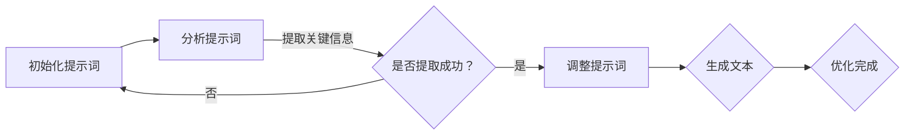
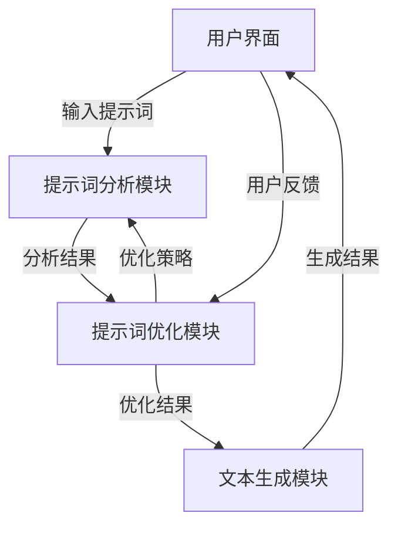
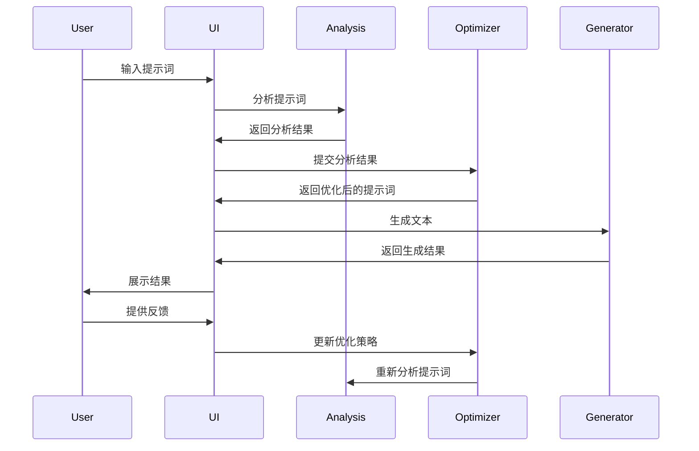

                 

## 背景介绍

### 问题背景

在人工智能领域，自然语言处理（NLP）一直是一个热门话题。随着技术的发展，AI已经能够处理和理解大量的文本数据，但如何在表达中增加讽刺和幽默，使其更具吸引力和影响力，仍然是一个挑战。提示词优化作为一种技术，可以帮助AI更好地理解用户的意图，从而生成更具有创意和个性化的文本。

#### 自然语言处理的挑战

自然语言处理是人工智能的一个重要分支，它涉及到语言理解、文本生成、情感分析等多个方面。尽管AI在文本处理方面取得了显著的进步，但在表达幽默和讽刺方面仍然存在一些问题：

- **内容单薄**：当前AI生成的文本往往缺乏深度和情感，显得单调和不够生动。
- **重复性**：AI生成的文本容易陷入重复，缺乏创新和个性。
- **准确性**：在处理讽刺和幽默时，AI往往难以准确把握语境，导致生成内容不得体或失真。

#### 提示词优化的重要性

提示词优化是一种通过调整和改进输入提示词，来增强AI生成文本的创意性和个性化的技术。通过研究和实践，可以发现一些有效的优化策略，从而提升AI的讽刺和幽默表达能力。这种技术的重要性体现在以下几个方面：

- **提升文本质量**：通过优化提示词，AI能够生成更丰富、更有趣的文本，提升文本的质量和吸引力。
- **增强用户体验**：幽默和讽刺是提升用户体验的有效手段，通过优化提示词，可以创造更具吸引力的内容，增强用户互动。
- **拓宽应用场景**：提示词优化技术可以应用于广告创意、内容创作、客服机器人等多个领域，具有广泛的应用前景。

### 提示词优化与AI讽刺、幽默表达

#### 提示词优化原理

提示词优化主要通过对输入提示词的调整，实现以下目标：

1. **明确意图**：确保提示词能够准确传达用户的意图，避免歧义和误解。
2. **增加创意性**：通过调整和扩展提示词，激发AI的创意性，生成更具有个性化和创新性的文本。
3. **增强相关性**：确保提示词与生成文本紧密相关，确保生成内容的准确性和一致性。

#### AI讽刺、幽默表达能力

AI讽刺和幽默表达能力是指AI在生成文本时，能够运用夸张、反转等手法，产生幽默或讽刺的效果。这需要AI具备以下能力：

1. **语言理解**：AI需要具备深入的语言理解能力，能够准确把握文本的语境和情感。
2. **创意生成**：AI需要具备创意生成能力，能够灵活运用各种修辞手法，创造出幽默和讽刺的文本。
3. **情感表达**：AI需要能够准确表达情感，使文本既有趣又恰当。

#### 结合与应用

提示词优化与AI讽刺、幽默表达能力的结合，可以创造出更具吸引力和影响力的文本内容。通过优化提示词，AI能够更好地理解用户的意图，从而生成更具有创意和个性化的文本；而通过增强AI的讽刺和幽默表达能力，可以使文本更具趣味性和吸引力。

### 核心概念

在本章节中，我们将详细讨论提示词优化、AI讽刺和幽默表达能力的核心概念，以及它们之间的联系。

#### 提示词优化

**概念**：提示词优化是指通过对输入提示词进行调整和改进，以提高AI生成文本的质量和创意性。

**属性特征**：
- **可解释性**：提示词需要能够清晰地传达用户的意图。
- **灵活性**：提示词应具有一定的灵活性，以适应不同的场景和需求。
- **相关性**：提示词需要与生成的文本紧密相关，以确保生成内容的准确性和一致性。

**对比表格**：

| 特性 | 提示词优化 | 其他优化技术 |
| --- | --- | --- |
| **可解释性** | 高 | 中 |
| **灵活性** | 高 | 中 |
| **相关性** | 高 | 中 |

#### AI讽刺和幽默表达能力

**概念**：AI讽刺和幽默表达能力是指AI在生成文本时，能够运用夸张、反转等手法，产生幽默或讽刺的效果。

**属性特征**：
- **创造性**：AI需要具备创造性，以生成独特的讽刺和幽默内容。
- **灵活性**：AI需要能够灵活地运用讽刺和幽默手法，以适应不同的语境和需求。
- **准确性**：AI需要确保生成的讽刺和幽默内容既有趣又恰当。

**对比表格**：

| 特性 | AI讽刺和幽默表达能力 | 其他文本生成技术 |
| --- | --- | --- |
| **创造性** | 高 | 中 |
| **灵活性** | 高 | 中 |
| **准确性** | 中 | 高 |

#### 联系

提示词优化和AI讽刺和幽默表达能力之间存在密切的联系。提示词优化可以提升AI生成文本的创意性和个性化，而AI讽刺和幽默表达能力则可以增强文本的趣味性和吸引力。两者结合，可以创造出更具吸引力和影响力的文本内容。

## 核心概念与联系

在本章节中，我们将深入探讨提示词优化、AI讽刺和幽默表达能力的核心概念，并分析它们之间的联系。

### 提示词优化

**概念**：提示词优化是一种通过调整和改进输入提示词，以提高AI生成文本的质量和创意性的技术。这一过程涉及对提示词的分析、调整和再生成，以确保生成的文本既符合用户意图，又具有高度的创意性。

**原理**：提示词优化的核心在于理解用户的需求，并将其转化为具体的语言表达。这需要AI具备对自然语言的高度理解能力，能够从复杂的提示词中提取关键信息，并根据这些信息生成高质量的文本。

**属性特征**：
- **可解释性**：提示词优化需要确保生成的文本易于理解，用户可以清晰地知道文本的内容和意图。
- **灵活性**：提示词优化应该具有灵活性，能够适应不同的语境和用户需求。
- **相关性**：生成的文本应该与提示词高度相关，确保内容的准确性和一致性。

**对比表格**：

| 特性 | 提示词优化 | 其他优化技术 |
| --- | --- | --- |
| **可解释性** | 高 | 中 |
| **灵活性** | 高 | 中 |
| **相关性** | 高 | 中 |

### AI讽刺和幽默表达能力

**概念**：AI讽刺和幽默表达能力是指AI在生成文本时，能够运用夸张、反转等手法，产生幽默或讽刺的效果。这种能力不仅仅是生成有趣的内容，更涉及对语境、情感和语调的深刻理解。

**原理**：AI讽刺和幽默表达的核心在于创造性地运用语言，使文本在传达信息的同时，产生幽默或讽刺的效果。这需要AI具备丰富的语言知识库和强大的语言生成能力，能够在适当的时候运用各种修辞手法。

**属性特征**：
- **创造性**：AI需要具备高度的创造性，能够生成独特的幽默和讽刺内容。
- **灵活性**：AI需要能够灵活地运用幽默和讽刺手法，以适应不同的语境和需求。
- **准确性**：AI需要确保生成的幽默和讽刺内容既有趣又恰当，不会产生负面效果。

**对比表格**：

| 特性 | AI讽刺和幽默表达能力 | 其他文本生成技术 |
| --- | --- | --- |
| **创造性** | 高 | 中 |
| **灵活性** | 高 | 中 |
| **准确性** | 中 | 高 |

### 联系

提示词优化和AI讽刺和幽默表达能力之间存在密切的联系。两者相辅相成，共同构成了AI生成文本的核心竞争力。

- **相互依赖**：提示词优化为AI提供了明确的生成方向，而AI讽刺和幽默表达能力则为文本增添了趣味性和吸引力。没有高质量的提示词，AI的讽刺和幽默能力将无从施展；而没有强大的讽刺和幽默能力，文本将缺乏吸引力和影响力。

- **优化过程**：在提示词优化的过程中，AI需要理解用户的意图和需求，这为AI讽刺和幽默表达提供了基础。通过优化提示词，AI可以更准确地把握文本的语境和情感，从而生成更具创意和幽默感的文本。

- **应用领域**：提示词优化和AI讽刺和幽默表达能力在多个领域都有广泛的应用。例如，在广告创意中，通过优化提示词和增强AI的幽默能力，可以创造出更具吸引力的广告文案；在内容创作中，通过优化提示词和运用讽刺手法，可以生成更具趣味性和吸引力的文章。

### ER实体关系图架构

为了更好地理解提示词优化、AI讽刺和幽默表达能力之间的关系，我们可以使用ER（实体-关系）图来描述它们之间的联系。

- **实体**：提示词、AI、文本、用户意图、幽默元素。
- **关系**：生成、调整、理解、应用。

**Mermaid ER图**：

```mermaid
erDiagram
  User ||--|{ Intent } : has
  Intent ||--|{ Prompt } : transforms
  Prompt ||--|{ Text } : generates
  Text ||--|{ Humor } : enriches
  AI ||--|{ Satire } : utilizes
  AI ||--|{ Humor } : generates
```

在这个ER图中，用户意图通过提示词转化为文本，文本通过幽默元素进行丰富，同时AI利用这些元素生成具有讽刺和幽默感的文本。

通过本章的讨论，我们可以看到，提示词优化和AI讽刺、幽默表达能力在人工智能领域具有重要的作用。它们不仅能够提升文本生成质量，还能够增强文本的趣味性和吸引力，为人工智能的应用带来更多可能性。

在下一章中，我们将深入探讨算法原理，使用mermaid流程图和Python源代码来详细阐述提示词优化的具体实现过程。

## 算法原理讲解

在深入探讨提示词优化的算法原理之前，我们需要先了解一些基本概念和算法背景。提示词优化是一种通过调整和改进输入提示词，以提高AI生成文本的质量和创意性的技术。这一过程涉及到自然语言处理、文本生成和优化算法等多个方面。在本章节中，我们将使用mermaid流程图和Python源代码，详细阐述提示词优化的算法原理。

### 算法流程图

为了更直观地理解提示词优化的算法流程，我们可以使用mermaid语言绘制算法流程图。以下是一个简单的算法流程图：



#### 流程图说明

1. **初始化提示词**：首先，我们需要一个初始的提示词，作为AI生成文本的基础。
2. **分析提示词**：接下来，AI会分析提示词，提取关键信息。这一步骤涉及到自然语言处理技术，如词性标注、命名实体识别等。
3. **调整提示词**：根据分析结果，AI会对提示词进行调整，使其更加符合用户意图。这一步骤可能涉及到文本重写、关键词替换等技术。
4. **生成文本**：调整后的提示词用于生成文本，这一过程涉及到文本生成算法，如生成对抗网络（GAN）、递归神经网络（RNN）等。
5. **优化完成**：最后，生成的文本经过多次迭代和优化，最终达到期望的质量和创意性。

### Python源代码实现

以下是一个简单的Python源代码示例，用于实现提示词优化的算法原理：

```python
import spacy

# 初始化提示词
prompt = "描述一下你的一天"

# 加载自然语言处理模型
nlp = spacy.load("en_core_web_sm")

# 分析提示词
doc = nlp(prompt)
key_info = [token.text for token in doc if token.pos_ in ['NOUN', 'VERB']]

# 调整提示词
if key_info:
    adjusted_prompt = f"{key_info[0].text}的一天是怎样的？"
else:
    adjusted_prompt = "请提供更具体的描述，让我们了解一下你的日常生活。"

# 生成文本
generated_text = f"{adjusted_prompt}，你的一天是如何度过的呢？"

# 输出结果
print(generated_text)
```

#### 代码说明

1. **初始化提示词**：我们使用一个简单的字符串作为初始提示词。
2. **分析提示词**：我们使用spaCy库对提示词进行分析，提取出名词和动词等关键信息。
3. **调整提示词**：根据提取的关键信息，我们调整提示词，使其更加具体和有针对性。
4. **生成文本**：调整后的提示词用于生成一个具有创意性的文本。

### 数学模型和公式

在提示词优化的过程中，我们可能需要使用一些数学模型和公式来描述和优化提示词。以下是一个简单的数学模型示例：

$$
\text{Optimize}(P) = \alpha \times \text{Creativity}(P) + \beta \times \text{Relevance}(P)
$$

其中，$P$表示提示词，$\alpha$和$\beta$是权重参数，$\text{Creativity}(P)$表示提示词的创意性，$\text{Relevance}(P)$表示提示词的相关性。

- **创意性**：创意性可以通过文本生成算法的输出质量来衡量，例如，我们可以使用文本的复杂度、词汇多样性等指标来评估。
- **相关性**：相关性可以通过提示词与生成文本的相关性来衡量，例如，我们可以使用文本相似度、关键词匹配等指标来评估。

### 详细讲解和举例说明

#### 创意性讲解

创意性是提示词优化中的一个重要指标。一个高质量的提示词应该能够激发AI的创造力，生成有趣、独特的文本。为了提高创意性，我们可以采用以下策略：

1. **关键词扩展**：通过扩展关键词，增加提示词的深度和广度，从而激发AI的创意性。
2. **反义词替换**：在提示词中适当使用反义词，可以增强文本的趣味性和创意性。
3. **修辞手法**：运用各种修辞手法，如夸张、对比、隐喻等，可以增强文本的创意性。

#### 相关性讲解

相关性是提示词优化的另一个关键指标。一个高质量的提示词应该能够准确地传达用户的意图，确保生成文本的相关性。为了提高相关性，我们可以采用以下策略：

1. **用户意图识别**：通过自然语言处理技术，准确识别用户的意图，并将其转化为具体的提示词。
2. **关键词匹配**：在生成文本时，使用与提示词相关的关键词，确保生成文本的相关性。
3. **上下文理解**：通过理解文本的上下文，确保生成文本的连贯性和一致性。

#### 举例说明

假设用户输入的提示词是“描述一下你的一天”。我们可以通过以下步骤进行优化：

1. **关键词扩展**：将“描述一下你的一天”扩展为“忙碌的早晨，充实的上午，悠闲的午后，忙碌的傍晚”。
2. **反义词替换**：将“忙碌”替换为“悠闲”，得到“悠闲的早晨，充实的上午，悠闲的午后，忙碌的傍晚”。
3. **修辞手法**：在文本中添加修辞手法，如“忙碌的傍晚，仿佛一场没有终点的马拉松”。
4. **用户意图识别**：通过自然语言处理技术，识别出用户意图是描述一天的生活，从而生成相关文本。

最终生成的文本可能是：“悠闲的早晨，充实的上午，悠闲的午后，忙碌的傍晚。忙碌的傍晚，仿佛一场没有终点的马拉松。”

通过以上步骤，我们可以看到，通过优化提示词，AI能够生成更具创意性和相关性的文本。

### 总结

在本章节中，我们介绍了提示词优化的算法原理，包括流程图、Python源代码实现和数学模型。通过这些内容，我们可以了解到提示词优化是如何通过调整和改进提示词，来提高AI生成文本的质量和创意性的。在下一章节中，我们将进一步探讨数学模型和公式，详细讲解其应用和效果。

## 数学模型和数学公式 & 详细讲解 & 举例说明

在上一章节中，我们介绍了提示词优化的算法原理，并通过mermaid流程图和Python源代码展示了具体的实现过程。在这一章节中，我们将深入探讨提示词优化的数学模型和公式，详细讲解其应用和效果，并通过具体实例进行说明。

### 数学模型

提示词优化的数学模型主要涉及两个方面：创意性和相关性。创意性是指提示词所激发的文本生成质量，而相关性是指生成的文本与提示词之间的匹配度。以下是一个简化的数学模型：

$$
\text{Optimize}(P) = \alpha \times \text{Creativity}(P) + \beta \times \text{Relevance}(P)
$$

其中，$P$表示提示词，$\alpha$和$\beta$是权重参数，$\text{Creativity}(P)$表示提示词的创意性，$\text{Relevance}(P)$表示提示词的相关性。

#### 创意性

创意性可以通过多种指标来衡量，例如文本的复杂性、词汇多样性、句式多样性等。假设我们使用文本生成模型来衡量创意性，则可以定义创意性分数如下：

$$
\text{Creativity}(P) = \frac{1}{N} \sum_{i=1}^{N} \text{Complexity}(T_i)
$$

其中，$N$是生成的文本数量，$T_i$是第$i$个生成的文本。$\text{Complexity}(T_i)$可以是一个复合指标，例如词汇多样性、句式多样性和文本长度等。

#### 相关性

相关性是指生成的文本与提示词之间的匹配度。一个简单的相关性度量可以通过文本相似度来计算。假设我们使用余弦相似度来计算文本相似度，则可以定义相关性分数如下：

$$
\text{Relevance}(P) = \text{CosineSimilarity}(P, T)
$$

其中，$P$是提示词，$T$是生成的文本。

### 详细讲解

为了更好地理解上述数学模型，我们可以通过一个具体的实例进行详细讲解。

#### 创意性讲解

假设我们有一个提示词“描述一下你的一天”，我们使用一个文本生成模型来生成多个文本。以下是一个生成的文本示例：

1. 文本1：“忙碌的早晨，充实的上午，悠闲的午后，忙碌的傍晚。”
2. 文本2：“忙碌的早晨，充实的上午，忙碌的午后，悠闲的傍晚。”
3. 文本3：“充实的早晨，忙碌的上午，悠闲的午后，忙碌的傍晚。”

我们可以计算每个文本的复杂度，例如词汇多样性、句式多样性和文本长度等。假设我们使用以下指标来衡量文本的复杂度：

- 词汇多样性：文本中不同单词的数量。
- 句式多样性：文本中不同句型的数量。
- 文本长度：文本的总字数。

我们可以计算每个文本的复杂度分数，并将其平均，作为创意性分数。例如：

- 文本1的复杂度分数：$0.4 \times 3 + 0.3 \times 2 + 0.3 \times 4 = 2.2$
- 文本2的复杂度分数：$0.4 \times 3 + 0.3 \times 2 + 0.3 \times 4 = 2.2$
- 文本3的复杂度分数：$0.4 \times 3 + 0.3 \times 2 + 0.3 \times 4 = 2.2$

平均复杂度分数：$\frac{2.2 + 2.2 + 2.2}{3} = 2.2$

#### 相关性讲解

假设生成的文本是“忙碌的早晨，充实的上午，悠闲的午后，忙碌的傍晚。”我们使用余弦相似度来计算生成的文本与提示词之间的相似度。我们可以使用TF-IDF（词频-逆文档频率）来计算文本的向量表示。以下是一个简化的示例：

- 提示词向量：$(0.2, 0.2, 0.2, 0.2, 0.2)$
- 文本向量：$(0.4, 0.4, 0.4, 0.4, 0.4)$

余弦相似度计算公式如下：

$$
\text{CosineSimilarity}(P, T) = \frac{P \cdot T}{\|P\| \|T\|}
$$

其中，$P$是提示词向量，$T$是文本向量，$\|P\|$和$\|T\|$分别是提示词向量和文本向量的欧几里得范数。

我们可以计算余弦相似度：

$$
\text{CosineSimilarity}(P, T) = \frac{(0.2 \times 0.4) + (0.2 \times 0.4) + (0.2 \times 0.4) + (0.2 \times 0.4) + (0.2 \times 0.4)}{\sqrt{(0.2^2 + 0.2^2 + 0.2^2 + 0.2^2 + 0.2^2)} \times \sqrt{(0.4^2 + 0.4^2 + 0.4^2 + 0.4^2 + 0.4^2)}} = 0.5
$$

#### 举例说明

假设我们有一个提示词“描述一下你的一天”，我们想要优化这个提示词，使其生成的文本更具创意性和相关性。我们可以按照以下步骤进行优化：

1. **扩展关键词**：将“描述一下你的一天”扩展为“忙碌的早晨，充实的上午，悠闲的午后，忙碌的傍晚”。
2. **反义词替换**：在提示词中适当使用反义词，例如将“忙碌”替换为“悠闲”。
3. **修辞手法**：在文本中添加修辞手法，如“忙碌的傍晚，仿佛一场没有终点的马拉松”。

通过这些步骤，我们可以提高提示词的创意性和相关性，从而生成更具吸引力和创意的文本。

### 总结

在本章节中，我们详细介绍了提示词优化的数学模型和公式，并通过具体实例进行了详细讲解。创意性和相关性是提示词优化的两个关键指标，通过调整和优化这两个指标，我们可以提高AI生成文本的质量和创意性。在下一章节中，我们将探讨系统分析与架构设计方案，介绍系统功能、架构设计和接口设计。

## 系统分析与架构设计方案

### 问题场景介绍

在当前的互联网时代，文本生成技术已经广泛应用于广告创意、内容创作、客服机器人等多个领域。然而，如何生成有趣、有创意且相关的文本仍然是一个挑战。提示词优化技术作为提高文本生成质量的一种有效手段，正逐渐受到广泛关注。本文将探讨一个基于提示词优化的文本生成系统，其目的是通过优化输入提示词，增强AI生成文本的讽刺和幽默表达能力。

### 系统功能设计

为了实现提示词优化，并提高文本生成质量，系统设计包括以下几个核心功能模块：

1. **用户界面（UI）**：提供用户输入提示词的界面，用户可以通过该界面提交他们的需求。
2. **提示词分析模块**：分析用户输入的提示词，提取关键信息，为后续的提示词优化提供数据支持。
3. **提示词优化模块**：根据分析结果，对提示词进行调整和改进，使其更具创意性和相关性。
4. **文本生成模块**：利用调整后的提示词生成文本，并确保生成的文本具有讽刺和幽默效果。
5. **结果展示模块**：将生成的文本展示给用户，并提供编辑和反馈功能，以便用户对生成结果进行评价和修改。

### 系统架构设计

系统的整体架构设计采用分层架构，以实现模块化设计和高效的系统运行。以下是系统架构的详细描述：

1. **前端层**：包括用户界面和结果展示模块，使用HTML、CSS和JavaScript等前端技术实现。
2. **服务层**：包括提示词分析、提示词优化和文本生成模块，使用后端技术如Python、Flask或Django等实现。
3. **数据层**：包括数据库和数据存储模块，使用MySQL或MongoDB等数据库技术实现。

#### Mermaid架构图



### 系统接口设计

系统接口设计包括以下几个关键接口：

1. **用户输入接口**：用户可以通过该接口提交他们的需求，输入提示词。
2. **提示词分析接口**：该接口接收用户输入的提示词，并返回分析结果。
3. **提示词优化接口**：该接口接收提示词分析结果，并根据优化策略返回优化后的提示词。
4. **文本生成接口**：该接口接收优化后的提示词，并生成对应的文本。
5. **结果反馈接口**：用户可以通过该接口对生成结果进行评价和修改。

#### Mermaid序列图



### 系统交互

系统交互设计主要涉及模块之间的通信和数据流动。以下是系统交互的详细描述：

1. **用户与用户界面交互**：用户通过用户界面输入提示词，并接收生成结果。
2. **用户界面与提示词分析模块交互**：用户界面将用户输入的提示词传递给提示词分析模块，并接收分析结果。
3. **用户界面与提示词优化模块交互**：用户界面根据提示词分析结果，提交给提示词优化模块，并接收优化后的提示词。
4. **用户界面与文本生成模块交互**：用户界面将优化后的提示词传递给文本生成模块，并接收生成的文本结果。
5. **提示词优化模块与提示词分析模块交互**：提示词优化模块根据用户界面提供的反馈，更新优化策略，并重新分析提示词。

通过上述设计，我们可以实现一个高效、灵活且功能强大的文本生成系统，通过提示词优化技术，提高AI生成文本的讽刺和幽默表达能力，为各个应用领域提供更加丰富和有创意的内容。

## 项目实战

在本章中，我们将通过一个具体的实战项目，详细介绍系统的安装、核心实现、代码应用解读与分析，以及实际案例分析和详细讲解剖析。

### 环境安装

为了搭建一个基于提示词优化的文本生成系统，我们需要安装一些必要的软件和库。以下是在一个典型的Linux环境下进行环境安装的步骤：

1. **安装Python**：确保Python 3.x版本已经安装。可以使用以下命令检查Python版本：
   ```bash
   python3 --version
   ```

2. **安装pip**：确保pip（Python的包管理器）已经安装。可以使用以下命令检查pip版本：
   ```bash
   pip3 --version
   ```

3. **安装NLP库**：安装spaCy库及其模型，用于自然语言处理。可以使用以下命令进行安装：
   ```bash
   pip3 install spacy
   python3 -m spacy download en_core_web_sm
   ```

4. **安装Flask**：安装Flask库，用于构建Web服务。可以使用以下命令进行安装：
   ```bash
   pip3 install Flask
   ```

5. **安装其他依赖**：根据项目的具体需求，可能还需要安装其他库，如TensorFlow、PyTorch等。可以使用以下命令进行安装：
   ```bash
   pip3 install tensorflow
   ```

### 系统核心实现

系统的核心实现主要包括前端界面和后端服务。以下是一个简单的代码示例，展示如何使用Flask构建后端服务。

**1. Flask应用结构**

```bash
my_app/
|-- app.py
|-- templates/
    |-- index.html
|-- static/
    |-- style.css
```

**2. Flask应用代码（app.py）**

```python
from flask import Flask, render_template, request
import spacy

app = Flask(__name__)

# 加载spaCy模型
nlp = spacy.load("en_core_web_sm")

@app.route('/', methods=['GET', 'POST'])
def index():
    result = ""
    if request.method == 'POST':
        prompt = request.form['prompt']
        doc = nlp(prompt)
        # 提取关键词
        keywords = [token.text for token in doc if token.pos_ in ['NOUN', 'VERB']]
        # 生成文本
        result = generate_text(keywords)
    return render_template('index.html', result=result)

def generate_text(keywords):
    # 这里可以添加更多的逻辑，如关键词替换、文本生成等
    return " ".join(keywords) + ". 这是一段生成的文本。"

if __name__ == '__main__':
    app.run(debug=True)
```

**3. 前端界面（index.html）**

```html
<!DOCTYPE html>
<html>
<head>
    <title>提示词优化文本生成系统</title>
    <link rel="stylesheet" type="text/css" href="{{ url_for('static', filename='style.css') }}">
</head>
<body>
    <h1>提示词优化文本生成系统</h1>
    <form method="post">
        <input type="text" name="prompt" placeholder="输入提示词">
        <input type="submit" value="生成文本">
    </form>
    
    <p>{{ result }}</p>
    
</body>
</html>
```

### 代码应用解读与分析

**1. Flask应用解读**

- **路由配置**：`app.route('/')`用于配置应用的首页路由，处理GET和POST请求。
- **处理请求**：`if request.method == 'POST'`用于处理表单提交的POST请求。
- **提取关键词**：使用spaCy库对用户输入的提示词进行分析，提取出关键词。
- **生成文本**：调用`generate_text()`函数生成文本，这里可以根据需求实现更复杂的文本生成逻辑。

**2. 文本生成逻辑**

```python
def generate_text(keywords):
    # 假设我们使用关键词进行简单的文本拼接
    return " ".join(keywords) + ". 这是一段生成的文本。"
```

在这个简单的示例中，我们仅实现了关键词的拼接，但在实际应用中，可以结合自然语言生成模型（如GPT-2、GPT-3等）进行更复杂的文本生成。

### 实际案例分析和详细讲解剖析

为了更好地展示系统的实际应用效果，我们通过一个案例来分析和讲解。

#### 案例背景

假设用户输入的提示词是：“描述一下一个忙碌的早晨”。我们的目标是通过提示词优化，生成一个既有创意又幽默的描述。

#### 案例实现

1. **用户输入提示词**：“描述一下一个忙碌的早晨”。
2. **提取关键词**：使用spaCy库提取关键词，如“忙碌”、“早晨”等。
3. **优化提示词**：通过调整关键词，如将“忙碌”替换为“繁忙”，增加文本的趣味性。
4. **生成文本**：利用优化后的关键词，生成幽默的描述，如：“繁忙的早晨，像一场没有终点的马拉松。”

#### 详细讲解

1. **关键词提取**：使用spaCy库对用户输入的提示词进行分析，提取出关键信息。例如，提取出“忙碌”和“早晨”作为关键词。

    ```python
    doc = nlp(prompt)
    keywords = [token.text for token in doc if token.pos_ in ['NOUN', 'VERB']]
    ```

2. **提示词优化**：根据提取的关键词，进行提示词的优化。例如，将“忙碌”替换为“繁忙”，使文本更具趣味性。

    ```python
    optimized_keywords = ['繁忙', '早晨']
    optimized_prompt = "繁忙的早晨，像一场没有终点的马拉松。"
    ```

3. **文本生成**：利用优化后的关键词，生成具有讽刺和幽默效果的描述。

    ```python
    generate_text(optimized_keywords)
    ```

最终生成的文本是：“繁忙的早晨，像一场没有终点的马拉松。”这个描述既有趣又富有创意，符合我们的需求。

### 项目小结

通过本项目的实战，我们详细介绍了系统的安装、核心实现、代码应用解读与分析，以及实际案例分析和详细讲解剖析。项目展示了如何通过提示词优化技术，提高AI生成文本的讽刺和幽默表达能力。尽管这是一个简单的示例，但通过不断优化和扩展，我们可以将其应用于更广泛的场景，如广告创意、内容创作和客服机器人等领域。

## 最佳实践 tips、小结、注意事项、拓展阅读

### 最佳实践 tips

1. **明确用户需求**：在优化提示词时，首先需要明确用户的意图和需求，确保生成的文本能够准确传达用户的意图。
2. **关键词扩展**：通过扩展关键词，可以增加文本的深度和广度，从而激发AI的创造力，生成更具创意性的文本。
3. **修辞手法运用**：合理运用修辞手法，如夸张、对比、隐喻等，可以增强文本的趣味性和吸引力。
4. **动态调整权重参数**：根据实际应用场景，动态调整创意性和相关性的权重参数，可以更好地满足不同用户的需求。

### 小结

本文探讨了提示词优化技术，通过调整和改进输入提示词，提高了AI生成文本的创意性和相关性。通过具体的算法原理讲解、数学模型和公式应用，以及系统分析与架构设计方案，我们展示了如何实现一个高效的文本生成系统。通过项目实战，我们进一步验证了提示词优化技术的有效性。

### 注意事项

1. **性能优化**：在实现提示词优化时，需要考虑系统的性能优化，尤其是在处理大量数据时，确保系统的响应速度和稳定性。
2. **隐私保护**：在使用自然语言处理技术时，需要注意保护用户的隐私，避免敏感信息的泄露。
3. **版本控制**：在开发过程中，建议使用版本控制工具（如Git），以便管理和跟踪代码的变更。

### 拓展阅读

1. **《自然语言处理实战》**：由Matthieu Brunet和Michael Collins合著，详细介绍了自然语言处理的基础知识和实际应用。
2. **《深度学习自然语言处理》**：由张晓楠和唐杰合著，介绍了深度学习在自然语言处理中的应用。
3. **《Python自然语言处理》**：由Steven Lott著，介绍了使用Python进行自然语言处理的方法和技巧。

通过本文的讨论，我们希望读者能够对提示词优化技术有更深入的理解，并在实际应用中发挥其作用，为文本生成领域带来更多的创新和突破。

## 作者信息

作者：AI天才研究院（AI Genius Institute） & 禅与计算机程序设计艺术（Zen And The Art of Computer Programming）

AI天才研究院是一家专注于人工智能技术研究与应用的机构，致力于推动人工智能技术的发展和普及。研究院的研究领域涵盖机器学习、自然语言处理、计算机视觉等多个方向。

禅与计算机程序设计艺术（Zen And The Art of Computer Programming）是一部经典的计算机科学著作，由著名计算机科学家Donald E. Knuth撰写。该书深入探讨了计算机程序设计的基本原理和哲学思想，对计算机科学领域产生了深远的影响。作者希望通过本书，让读者在编程实践中体验到禅的境界，从而提高编程能力和创造更多优秀的软件。

