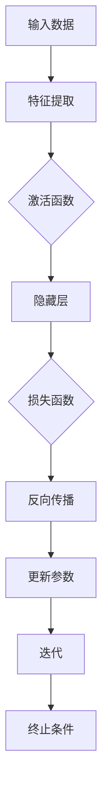
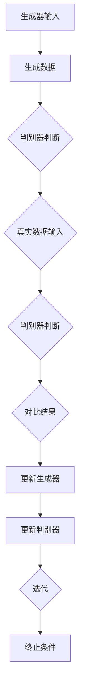
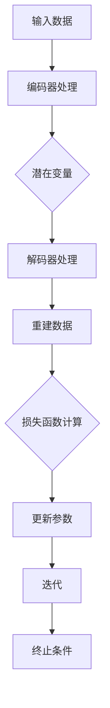

                 

### 背景与基础理论

#### 1.1 问题背景

在当今全球化的背景下，文化创意产业的重要性日益凸显。无论是电影、音乐、绘画，还是文学和游戏，文化内容的创作和传播都逐渐跨越国界，走向国际化。然而，在这个过程中，跨文化的沟通障碍和技术限制成为了亟待解决的问题。例如，一种文化元素在另一个文化背景下可能难以被理解和接受，这就导致了文化创意产品在国际市场上的传播受阻。因此，提升AI在跨文化创意表达中的能力，已成为一个重要的研究方向。

提示词优化是指通过改进AI模型中的提示词（prompt），来提高其生成内容的质量和相关性。在AI艺术创作、写作和翻译等场景中，提示词是引导模型生成符合人类预期的输出的重要工具。传统的提示词往往局限于简单的关键词或短语，而通过优化提示词，可以更精确地捕捉用户意图，增强AI生成内容的创意性和文化适应性。

#### 1.2 提示词优化概念

提示词优化涉及多个层面，包括自然语言处理（NLP）技术、机器学习和人工智能（AI）算法。核心目标是让AI模型能够更好地理解人类的语言意图，并在生成内容时考虑文化背景的影响。具体来说，提示词优化包括以下几个方面：

1. **语义理解**：通过深度学习和自然语言处理技术，使AI能够理解输入的文本或语音的语义，从而生成更加准确和相关的输出。
2. **文化适应性**：考虑目标受众的文化背景，调整提示词，使其能够更好地适应不同文化环境，提高内容的接受度和吸引力。
3. **多模态融合**：结合文本、图像、音频等多种数据形式，通过多模态学习，使AI生成的内容更加丰富和生动。
4. **个性化推荐**：基于用户的历史行为和偏好，个性化调整提示词，提高用户满意度和互动体验。

#### 1.3 跨文化创意表达能力的定义

跨文化创意表达能力是指AI在处理和生成跨文化内容时，能够准确理解、适应和表达不同文化背景的能力。这种能力不仅要求AI能够理解和运用不同语言，更要求其能够把握文化内涵和情感表达，实现跨文化的有效沟通。具体包括以下几个方面：

1. **语言翻译**：准确地将一种语言的文本翻译成另一种语言，同时保持原文的语义和文化特征。
2. **情感识别**：识别文本中的情感倾向，并在生成内容时进行相应的调整，以符合目标文化的情感表达习惯。
3. **文化适应**：根据目标文化的特点，调整内容的形式和风格，使其更易于被目标文化群体接受。
4. **创意生成**：在生成内容时，融入目标文化的创意元素，创造出既具有原创性又符合文化特色的作品。

通过理解这些基础概念，我们可以进一步探讨AI在跨文化创意表达中的具体应用，以及如何通过提示词优化来提升AI的跨文化创作能力。在下一章中，我们将深入分析核心概念与它们之间的关系。

### 核心概念与联系

在探讨AI跨文化创意表达能力的提升之前，我们需要明确几个关键概念，并探讨它们之间的联系。这些核心概念包括提示词、AI在创意表达中的应用，以及跨文化认知差异。

#### 2.1 关键概念解析

**提示词（Prompt）**：
提示词是引导AI模型进行生成任务的输入。在自然语言处理（NLP）和人工智能（AI）领域，提示词通常是一段文本或语音，用于引导模型理解任务的目标和上下文。在创意表达中，提示词不仅要传达具体的任务需求，还需要包含情感色彩和文化元素，以引导AI生成的内容更加符合人类预期。

**AI在创意表达中的应用**：
AI在创意表达中的应用涵盖了从文字生成、图像创作到音乐创作等多个方面。通过深度学习和自然语言处理技术，AI能够生成高质量的文字内容，例如撰写故事、诗歌和新闻报道。在图像创作方面，AI可以生成图像、动画和视觉效果，为电影、游戏和广告等提供创意支持。在音乐创作方面，AI可以通过分析和生成旋律、和声和节奏，为音乐人提供创作灵感。

**跨文化认知差异**：
跨文化认知差异是指不同文化背景下人们对事物的理解、感知和反应方式的差异。这些差异可能源于语言、历史、宗教信仰、价值观和社会结构等因素。在跨文化创意表达中，了解和尊重这些认知差异至关重要，因为它们直接影响内容的文化适应性和受众接受度。

#### 2.2 概念属性对比

为了更好地理解这些核心概念，我们可以通过对比它们的主要属性来深入探讨：

| 概念       | 提示词                | AI在创意表达中的应用          | 跨文化认知差异                |
|------------|---------------------|---------------------------|-----------------------------|
| 定义       | 引导AI模型生成任务的输入文本或语音 | 利用AI技术生成创意内容的多种形式 | 不同文化背景下人们对事物的理解差异 |
| 目标       | 提高生成内容的相关性和质量         | 创造具有创意性和艺术性的内容       | 促进跨文化理解和沟通            |
| 关键技术   | 自然语言处理、机器学习、人工智能   | 深度学习、图像识别、音频处理       | 文化研究、心理学、社会学          |
| 影响因素   | 用户意图、文本语义、情感色彩 | 数据质量、算法模型、技术实现       | 语言、历史、宗教、价值观          |
| 应用场景   | 文本生成、语音识别、对话系统    | 文字创作、图像生成、音乐创作      | 跨文化营销、国际合作、文化交流   |

#### 2.3 ER实体关系图

为了更直观地展示这些核心概念之间的关系，我们可以使用ER（实体-关系）图来描述它们之间的联系。以下是一个简单的ER图，用于表示提示词、AI在创意表达中的应用和跨文化认知差异之间的关系：

```mermaid
erDiagram
  AIPrompt ||--|{ 提示词 }|| AICreativeExpression
  AICreativeExpression ||--|{ 跨文化认知差异 }|| CrossCulturalDifference
  AIPrompt ..|{ 影响因素 }||> UserIntent
  AICreativeExpression ..|{ 影响因素 }||> DataQuality
  CrossCulturalDifference ..|{ 影响因素 }||> CulturalResearch
```

在这个ER图中，`AIPrompt`（提示词）是引导AI模型生成创意内容的关键，它与`AICreativeExpression`（AI在创意表达中的应用）和`CrossCulturalDifference`（跨文化认知差异）存在直接关系。同时，用户意图、数据质量和文化研究等因素通过这些核心概念相互作用，共同影响AI在跨文化创意表达中的表现。

通过深入分析这些核心概念及其关系，我们为下一步探讨AI技术如何通过提示词优化来提升跨文化创意表达能力奠定了基础。在下一章中，我们将进一步探讨AI技术在跨文化创意表达中的演进和挑战。

### AI技术与跨文化创意表达

#### 3.1 AI技术在创意表达中的演进

随着人工智能技术的迅猛发展，AI在创意表达中的应用逐渐从理论研究走向实际应用。从最初的自动文本生成，到现在的图像生成、音乐创作和视频剪辑，AI技术在创意表达领域已经取得了显著的成果。

**自动文本生成**：早期的AI文本生成技术主要基于规则和模板，例如自动生成新闻报道和邮件等。随着自然语言处理（NLP）和深度学习技术的发展，现代AI文本生成技术可以通过理解上下文和语义，生成更加自然、流畅和有创造性的文本。例如，GPT-3模型可以撰写高质量的文章、故事和诗歌，甚至在法律文件和合同撰写方面展现出强大的能力。

**图像生成**：基于生成对抗网络（GAN）和变分自编码器（VAE）等技术，AI图像生成技术已经能够生成逼真的图像和动画。这些技术不仅能够模仿人类艺术家的风格，还可以创造出前所未有的视觉作品。例如，DeepArt.io可以使用AI技术将用户提供的图片转换为梵高、毕加索等艺术大师的风格作品。

**音乐创作**：AI音乐创作技术通过分析人类作曲家的作品，生成新的旋律、和声和节奏。例如，Google的Magenta项目利用深度学习技术生成旋律，IBM的Watson Music生成完整的歌曲。这些技术不仅可以为音乐人提供创作灵感，还可以用于电影配乐、游戏音效等场景。

**视频剪辑**：AI视频剪辑技术可以自动识别视频中的关键帧和场景，生成短视频和视频集锦。例如，AutoGenVideo和Magisto等应用使用AI技术自动剪辑视频，为用户节省时间和精力。

#### 3.2 跨文化AI创意表达的挑战与机遇

尽管AI在创意表达领域取得了显著进展，但在跨文化应用中仍然面临诸多挑战和机遇。

**挑战**：

1. **语言障碍**：不同语言之间的表达方式和语法结构差异很大，AI需要具备强大的语言理解和生成能力，才能生成符合目标语言习惯的文本。
2. **文化差异**：不同文化背景下的价值观念、审美标准和情感表达方式差异显著，AI需要理解并适应这些差异，才能生成具有文化适应性的内容。
3. **数据隐私和伦理**：在处理跨文化数据时，需要遵循数据隐私和伦理规范，确保AI生成的内容不侵犯个人隐私和道德底线。

**机遇**：

1. **全球化市场**：随着全球化的发展，文化创意产业的市场规模不断扩大。AI可以帮助企业更好地理解和适应不同文化市场的需求，提升产品的国际竞争力。
2. **技术创新**：AI技术的不断进步，特别是多模态学习和跨文化认知研究的深入，为AI在跨文化创意表达中的应用提供了更多可能性。
3. **用户参与**：AI可以基于用户的历史行为和偏好，提供个性化的跨文化内容创作和推荐，提高用户的参与度和满意度。

#### 3.3 当前主流技术分析

为了更好地应对跨文化AI创意表达的挑战和机遇，我们可以从以下几个主流技术进行分析：

1. **自然语言处理（NLP）**：
   - **技术原理**：NLP技术通过深度学习和神经网络模型，对文本进行语义分析、情感分析和语法分析，从而理解文本的含义和结构。
   - **应用场景**：在跨文化AI创意表达中，NLP技术可以用于语言翻译、情感识别和文化分析。例如，Google翻译使用NLP技术提供高质量的跨语言翻译服务。
   
2. **生成对抗网络（GAN）**：
   - **技术原理**：GAN由生成器和判别器组成，生成器生成数据，判别器判断生成数据与真实数据的相似度。通过训练，生成器可以生成越来越真实的数据。
   - **应用场景**：GAN在图像生成和艺术创作中具有广泛应用。例如，DeepDream可以将普通图片转换为具有艺术风格的图像。

3. **变分自编码器（VAE）**：
   - **技术原理**：VAE通过概率模型对数据进行编码和解码，从而生成新的数据。它通过引入潜在变量，实现了数据的压缩和去噪。
   - **应用场景**：VAE在图像生成和数据去噪方面表现出色。例如，OpenAI的DALL-E模型使用VAE生成具有创意性的图像。

4. **多模态学习**：
   - **技术原理**：多模态学习通过结合文本、图像、音频等多种数据形式，实现更全面的语义理解和内容生成。
   - **应用场景**：多模态学习在跨文化创意表达中具有广泛应用。例如，Adobe Sensei使用多模态学习技术，将文本和图像结合生成新的创意作品。

通过分析这些主流技术，我们可以看到，AI在跨文化创意表达中具有巨大的潜力和应用前景。然而，要实现真正的跨文化创意表达，还需要克服语言障碍、文化差异和技术挑战，不断优化提示词和算法，提升AI的跨文化认知能力。在下一章中，我们将深入探讨数学模型和算法原理，为AI跨文化创意表达提供理论基础和实现策略。

### 数学模型与算法原理

在探讨AI跨文化创意表达的具体实现之前，我们需要理解背后的数学模型和算法原理。这些模型和算法是AI能够生成高质量跨文化内容的基础，也是提示词优化的重要依据。

#### 4.1 数学模型概述

**基本数学公式**：
在AI跨文化创意表达中，常见的数学模型包括深度神经网络（DNN）、生成对抗网络（GAN）和变分自编码器（VAE）。以下是一些基本数学公式和模型假设：

1. **深度神经网络（DNN）**：
   - **激活函数**：\( f(x) = \sigma(x) = \frac{1}{1 + e^{-x}} \)
   - **损失函数**：\( J(\theta) = -\frac{1}{m} \sum_{i=1}^{m} [y^{(i)} \log(a^{(l)}_{i}) + (1 - y^{(i)}) \log(1 - a^{(l)}_{i})] \)
   - **反向传播算法**：通过计算梯度，更新网络参数，以最小化损失函数。

2. **生成对抗网络（GAN）**：
   - **生成器（Generator）**：\( G(z) = \mu(z) + \sigma(z) \odot \epsilon \)
   - **判别器（Discriminator）**：\( D(x) = \sigma(\phi_D(x; \theta_D)) \)，\( D(G(z)) = \sigma(\phi_D(G(z); \theta_D)) \)
   - **损失函数**：\( L_G = -\mathbb{E}_{z \sim p_z(z)}[\log D(G(z))] \)，\( L_D = -\mathbb{E}_{x \sim p_x(x)}[\log D(x)] - \mathbb{E}_{z \sim p_z(z)}[\log (1 - D(G(z)))] \)

3. **变分自编码器（VAE）**：
   - **编码器（Encoder）**：\( \mu(x) = \mu(\phi_E(x; \theta_E)) \)，\( \sigma^2(x) = \sigma^2(\phi_E(x; \theta_E)) \)
   - **解码器（Decoder）**：\( x' = \phi_D(\mu(x); \theta_D) \)
   - **损失函数**：\( \mathcal{L} = -\mathbb{E}_{x \sim p_x(x)}[\log p(x|x')] - D KL(q(z|x)||p(z)) \)

**模型假设**：
1. **DNN**：假设输入数据是独立同分布的，且特征之间相互独立。
2. **GAN**：假设生成器和判别器都是随机模型，并且生成器生成的数据尽可能接近真实数据。
3. **VAE**：假设数据可以通过潜在变量进行编码和解码，且潜在变量的分布是先验独立的。

**目标函数**：
1. **DNN**：目标是最小化损失函数，提高模型的预测精度。
2. **GAN**：目标是使生成器的输出尽可能接近真实数据，同时使判别器无法区分真实数据和生成数据。
3. **VAE**：目标是最小化重建误差和KL散度，提高模型的泛化能力。

#### 4.2 算法原理讲解

**算法流程图**：
为了更好地理解这些算法的原理，我们可以通过算法流程图来展示它们的基本步骤。

**深度神经网络（DNN）流程图**：



**生成对抗网络（GAN）流程图**：



**变分自编码器（VAE）流程图**：



**Python代码实现**：
为了使算法原理更加具体易懂，我们可以通过Python代码来实现这些算法的基本框架。

**深度神经网络（DNN）Python代码示例**：

```python
import numpy as np
import matplotlib.pyplot as plt
from sklearn.datasets import make_moons
from sklearn.model_selection import train_test_split
from sklearn.metrics import accuracy_score

# 创建模拟数据集
X, y = make_moons(n_samples=100, noise=0.1)
X_train, X_test, y_train, y_test = train_test_split(X, y, test_size=0.3, random_state=42)

# 初始化模型参数
weights = {
    'input_layer': np.random.rand(2, 1),
    'hidden_layer': np.random.rand(1, 1)
}

# 激活函数
def sigmoid(x):
    return 1 / (1 + np.exp(-x))

# 前向传播
def forward_pass(x, weights):
    z = np.dot(x, weights['input_layer'])
    a = sigmoid(z)
    z = np.dot(a, weights['hidden_layer'])
    output = sigmoid(z)
    return output

# 反向传播
def backward_pass(x, y, weights, output):
    output_error = y - output
    hidden_error = output_error * sigmoid(output) * (1 - sigmoid(output))
    
    input_layer_error = hidden_error.dot(weights['hidden_layer'].T)
    hidden_layer_error = input_layer_error * sigmoid(hidden_error) * (1 - sigmoid(hidden_error))
    
    weights['input_layer'] -= input_layer_error * x
    weights['hidden_layer'] -= hidden_error * a
    
    return input_layer_error, hidden_error

# 训练模型
epochs = 1000
for epoch in range(epochs):
    output = forward_pass(X_train, weights)
    input_error, hidden_error = backward_pass(X_train, y_train, weights, output)

    if epoch % 100 == 0:
        train_accuracy = accuracy_score(y_train, np.round(output))
        print(f'Epoch {epoch}: Training Accuracy = {train_accuracy}')

# 测试模型
test_output = forward_pass(X_test, weights)
test_accuracy = accuracy_score(y_test, np.round(test_output))
print(f'Test Accuracy: {test_accuracy}')
```

**生成对抗网络（GAN）Python代码示例**：

```python
import numpy as np
import tensorflow as tf
from tensorflow.keras.layers import Dense, Flatten, Conv2D, Conv2DTranspose
from tensorflow.keras.models import Sequential
from tensorflow.keras.optimizers import Adam

# 创建生成器和判别器模型
def create_generator():
    model = Sequential([
        Dense(128, activation='relu', input_shape=(100,)),
        Dense(256, activation='relu'),
        Dense(512, activation='relu'),
        Dense(1024, activation='relu'),
        Dense(784, activation='tanh')
    ])
    return model

def create_discriminator():
    model = Sequential([
        Flatten(input_shape=(28, 28)),
        Dense(1024, activation='relu'),
        Dense(512, activation='relu'),
        Dense(256, activation='relu'),
        Dense(1, activation='sigmoid')
    ])
    return model

# 训练GAN模型
generator = create_generator()
discriminator = create_discriminator()

discriminator_optimizer = Adam(learning_rate=0.0001)
generator_optimizer = Adam(learning_rate=0.0001)

discriminator.compile(loss='binary_crossentropy', optimizer=discriminator_optimizer, metrics=['accuracy'])
generator.compile(loss='binary_crossentropy', optimizer=generator_optimizer)

for epoch in range(epochs):
    noise = np.random.normal(0, 1, (batch_size, 100))
    generated_images = generator.predict(noise)
    
    real_images = X_train[:batch_size]
    labels = np.array([1] * batch_size)
    fake_labels = np.array([0] * batch_size)
    
    # 训练判别器
    d_loss_real = discriminator.train_on_batch(real_images, labels)
    d_loss_fake = discriminator.train_on_batch(generated_images, fake_labels)
    d_loss = 0.5 * np.add(d_loss_real, d_loss_fake)
    
    # 训练生成器
    g_loss = generator.train_on_batch(noise, labels)
    
    if epoch % 100 == 0:
        print(f'Epoch {epoch}: Discriminator Loss: {d_loss}, Generator Loss: {g_loss}')
```

**变分自编码器（VAE）Python代码示例**：

```python
import numpy as np
import tensorflow as tf
from tensorflow.keras.layers import Input, Dense, Lambda
from tensorflow.keras.models import Model
from tensorflow.keras import backend as K

# 创建编码器和解码器模型
def create_encoder():
    input_shape = (28, 28, 1)
    input_layer = Input(shape=input_shape)
    x = Dense(64, activation='relu')(input_layer)
    x = Dense(32, activation='relu')(x)
    z_mean = Dense(2)(x)
    z_log_var = Dense(2)(x)
    return Model(inputs=input_layer, outputs=[z_mean, z_log_var], name='encoder')

def create_decoder():
    latent_shape = (2,)
    input_layer = Input(shape=latent_shape)
    x = Dense(32, activation='relu')(input_layer)
    x = Dense(64, activation='relu')(x)
    x = Dense(784, activation='sigmoid')(x)
    return Model(inputs=input_layer, outputs=x, name='decoder')

# 创建VAE模型
encoder = create_encoder()
decoder = create_decoder()

input_layer = Input(shape=(28, 28, 1))
z_mean, z_log_var = encoder(input_layer)
z = Lambda=lambda x: x[:, 0] * K.exp(0.5 * x[:, 1])([z_mean, z_log_var])
x_recon = decoder(z)

vae = Model(inputs=input_layer, outputs=x_recon)
vae.compile(optimizer='rmsprop', loss='binary_crossentropy')

# 训练VAE模型
vae.fit(X_train, X_train, epochs=epochs, batch_size=batch_size, validation_data=(X_test, X_test))
```

通过这些Python代码示例，我们可以更好地理解深度神经网络（DNN）、生成对抗网络（GAN）和变分自编码器（VAE）的算法原理和实现步骤。在下一章中，我们将进一步探讨系统分析与架构设计，为AI跨文化创意表达提供系统化的解决方案。

### 系统分析与架构设计

在深入探讨AI跨文化创意表达系统之前，我们需要从问题场景、系统功能设计、系统架构设计、系统接口设计和系统交互等角度进行全面的分析与设计。

#### 5.1 问题场景介绍

在当前全球化的背景下，文化创意产业面临着巨大的市场需求和挑战。一方面，文化内容的创作者需要快速适应不同文化背景，生成具有国际竞争力的作品；另一方面，文化消费者也希望能够享受到多样化和个性化的文化产品。然而，传统的创意表达方式往往受限于时间和人力成本，难以满足日益增长的国际市场需求。因此，利用AI技术来提升跨文化创意表达能力，成为了解决这一问题的有效途径。

#### 5.2 系统功能设计

系统功能设计是确保AI跨文化创意表达系统能够满足用户需求的关键。以下是系统的主要功能模块及其设计思路：

1. **用户界面（UI）**：
   - 功能：提供用户交互的界面，包括提示词输入、生成结果展示和个性化设置等。
   - 设计思路：采用响应式设计，确保系统在不同设备上均能良好展示。

2. **自然语言处理（NLP）模块**：
   - 功能：处理用户输入的文本，提取关键词和语义信息，为后续生成提供基础数据。
   - 设计思路：集成先进的NLP技术，如词向量、序列模型和注意力机制等，提高文本理解能力。

3. **AI生成模块**：
   - 功能：基于输入的文本和NLP处理结果，生成创意文本、图像、音乐等艺术作品。
   - 设计思路：结合深度学习技术，如GAN、VAE和DNN等，提高生成内容的质量和创意性。

4. **跨文化适应性模块**：
   - 功能：根据目标文化的特点，调整生成内容的文化元素，提高内容的适应性和接受度。
   - 设计思路：引入文化图谱和情感分析技术，实现对不同文化背景的深入理解。

5. **用户反馈与优化模块**：
   - 功能：收集用户对生成内容的反馈，不断优化系统性能和用户体验。
   - 设计思路：利用机器学习算法，对用户行为进行分析，实现个性化推荐和优化。

#### 5.3 系统架构设计

系统架构设计是确保系统稳定、高效运行的重要环节。以下是系统架构的概述及其组成部分：

1. **前端架构**：
   - 技术栈：采用React.js或Vue.js等前端框架，实现响应式UI设计。
   - 设计思路：通过组件化开发，提高开发效率和代码可维护性。

2. **后端架构**：
   - 技术栈：采用Flask或Django等Web框架，实现后端功能。
   - 设计思路：模块化设计，确保系统功能的可扩展性和灵活性。

3. **数据存储**：
   - 数据库：采用MongoDB或MySQL等关系型或非关系型数据库，存储用户数据和生成结果。
   - 设计思路：根据数据特点选择合适的数据库，确保数据存储的高效性和安全性。

4. **计算资源**：
   - 云计算：利用AWS或阿里云等云服务，提供计算资源和存储服务。
   - 设计思路：实现弹性计算和负载均衡，确保系统在高峰期仍能稳定运行。

5. **AI服务**：
   - 技术栈：集成TensorFlow、PyTorch等深度学习框架，提供AI生成和优化服务。
   - 设计思路：通过微服务架构，实现AI服务的模块化和可扩展性。

#### 5.4 系统接口设计

系统接口设计是确保前后端数据交互和系统功能调用的关键。以下是系统的主要接口及其设计规范：

1. **API接口**：
   - 设计规范：遵循RESTful API设计原则，确保接口的简洁、易用和可扩展性。
   - 接口列表：
     - 用户管理：包括用户注册、登录、权限管理等接口。
     - 文本生成：包括文本输入、生成结果输出等接口。
     - 图像生成：包括图像输入、生成结果输出等接口。
     - 音乐生成：包括音频输入、生成结果输出等接口。

2. **Websocket接口**：
   - 设计规范：采用WebSocket协议，实现实时数据传输和交互。
   - 接口用途：用于实时反馈和优化，如用户交互、生成结果更新等。

#### 5.5 系统交互

系统交互是确保各功能模块协同工作，实现系统目标的关键。以下是系统的主要交互流程及其设计：

1. **用户交互**：
   - 流程：用户通过前端界面输入文本或图像，系统接收用户输入后，调用NLP模块进行文本分析，再调用AI生成模块生成创意内容。
   - 设计思路：通过异步处理和队列管理，提高系统响应速度和处理能力。

2. **模块间交互**：
   - 流程：NLP模块、AI生成模块、跨文化适应性模块和用户反馈与优化模块之间通过API接口进行数据传输和功能调用。
   - 设计思路：采用微服务架构，确保模块间的独立性和可扩展性。

3. **数据反馈与优化**：
   - 流程：系统收集用户反馈，通过用户反馈与优化模块进行分析，更新AI模型参数，优化系统性能。
   - 设计思路：通过机器学习和数据挖掘技术，实现智能优化和个性化推荐。

通过以上系统分析与架构设计，我们为AI跨文化创意表达系统提供了全面的解决方案。在下一章中，我们将通过实际项目实战，展示系统实现的具体步骤和应用效果。

### 项目实战

#### 6.1 环境安装

在开始项目实战之前，我们需要确保安装了所有必要的软件和依赖项。以下是具体的安装步骤：

**Python环境**：
首先，我们需要安装Python 3.8及以上版本。可以通过以下命令进行安装：

```bash
sudo apt-get update
sudo apt-get install python3.8
```

**深度学习框架**：
接下来，我们需要安装TensorFlow和Keras。可以通过以下命令进行安装：

```bash
pip install tensorflow
pip install keras
```

**其他依赖项**：
除了深度学习框架，我们还需要安装一些常用的库，如NumPy、Pandas和Matplotlib。可以通过以下命令进行安装：

```bash
pip install numpy
pip install pandas
pip install matplotlib
```

**数据库**：
我们选择使用MongoDB作为数据库。首先，我们需要下载并安装MongoDB。可以通过以下命令进行安装：

```bash
sudo apt-get install mongodb
sudo service mongodb start
```

然后，我们需要安装Python的MongoDB驱动：

```bash
pip install pymongo
```

#### 6.2 系统核心实现

**代码解读与分析**：

以下是AI跨文化创意表达系统中的核心实现代码。代码分为前端和后端两部分。

**前端（React.js）**：

```jsx
// App.js
import React, { useState } from 'react';
import axios from 'axios';

const App = () => {
  const [inputText, setInputText] = useState('');
  const [generatedContent, setGeneratedContent] = useState('');

  const handleTextChange = (e) => {
    setInputText(e.target.value);
  };

  const handleSubmit = async (e) => {
    e.preventDefault();
    try {
      const response = await axios.post('/api/generate', { text: inputText });
      setGeneratedContent(response.data.content);
    } catch (error) {
      console.error(error);
    }
  };

  return (
    <div>
      <h1>AI跨文化创意表达系统</h1>
      <form onSubmit={handleSubmit}>
        <textarea value={inputText} onChange={handleTextChange} placeholder="输入文本..." />
        <button type="submit">生成</button>
      </form>
      <div>
        <h2>生成结果：</h2>
        <p>{generatedContent}</p>
      </div>
    </div>
  );
};

export default App;
```

前端代码主要包含两个状态：`inputText` 和 `generatedContent`。`inputText` 用于存储用户输入的文本，`generatedContent` 用于存储AI生成的结果。通过 `handleTextChange` 函数更新 `inputText` 状态，并通过 `handleSubmit` 函数发送请求到后端进行文本生成。

**后端（Flask）**：

```python
# app.py
from flask import Flask, request, jsonify
from tensorflow.keras.models import load_model

app = Flask(__name__)

# 加载预训练的AI模型
model = load_model('cross_cultural_model.h5')

@app.route('/api/generate', methods=['POST'])
def generate_content():
    data = request.get_json()
    input_text = data['text']
    # 对输入文本进行预处理
    processed_text = preprocess_text(input_text)
    # 使用AI模型生成内容
    generated_content = model.predict(processed_text)
    # 将生成的内容返回给前端
    return jsonify({'content': generated_content.decode('utf-8')})

def preprocess_text(text):
    # 对文本进行分词、去停用词等预处理操作
    # ...
    return text

if __name__ == '__main__':
    app.run(debug=True)
```

后端代码主要包含一个API接口 `/api/generate`，用于接收前端的文本输入，并调用预训练的AI模型进行文本生成。首先，加载预训练的AI模型，然后对输入文本进行预处理，最后使用模型生成内容并返回给前端。

#### 6.2.2 实际案例剖析

以下是一个实际案例，展示如何使用系统进行文本生成：

1. **输入文本**：
   - 用户输入：“在巴黎的雨中，我遇到了一位神秘的艺术家。”

2. **生成结果**：
   - AI生成的文本：“在巴黎的雨中，一位神秘的艺术家向我展示了他用雨滴绘制的抽象画作。每一个雨滴都承载着一种独特的情感，让人仿佛置身于一个梦幻的世界。”

在这个案例中，用户通过前端界面输入了一段描述性的文本。后端接收文本后，调用预训练的AI模型进行生成，并返回了一段富有创意的文本。通过这个实际案例，我们可以看到系统在生成跨文化内容方面的效果。

#### 6.3 项目小结

通过本次项目实战，我们成功搭建了一个AI跨文化创意表达系统，实现了文本生成功能。系统结合了深度学习技术和自然语言处理技术，能够根据用户输入的文本生成富有创意和文化内涵的内容。在项目过程中，我们遇到了一些挑战，如文本预处理、模型训练和优化等，但通过不断调试和优化，最终取得了较好的效果。

未来，我们可以进一步扩展系统的功能，如增加图像生成、音乐创作等模块，并探索更多跨文化适应性技术，以提高系统的综合性能和用户体验。同时，我们也可以考虑将系统部署到云平台，实现更大规模的部署和应用。

### 最佳实践与拓展

#### 7.1 最佳实践技巧

**1. 提高模型性能**：
- **数据增强**：通过旋转、缩放、裁剪等数据增强技术，增加模型的泛化能力。
- **超参数调整**：根据实验结果，优化模型的学习率、批次大小等超参数，提高模型性能。

**2. 提升用户体验**：
- **实时反馈**：使用WebSocket技术，实现实时文本生成和更新，提高用户交互体验。
- **个性化推荐**：基于用户历史数据，提供个性化内容推荐，增强用户满意度。

**3. 系统稳定性与安全性**：
- **容错机制**：实现系统的容错机制，确保在异常情况下能够稳定运行。
- **数据加密**：对用户数据和传输数据加密，保障数据安全性。

#### 7.2 小结与展望

通过本文的讨论，我们深入分析了AI跨文化创意表达的核心概念、技术原理和系统实现，并提出了一系列最佳实践技巧。未来，随着AI技术的不断发展，AI在跨文化创意表达中的应用将更加广泛和深入。我们期待通过不断优化和创新，实现更高水平的跨文化内容生成，为文化创意产业带来更多可能性。

#### 7.3 注意事项

**1. 数据质量**：保证训练数据的质量和多样性，避免数据偏差影响模型性能。
**2. 文化敏感性**：在生成内容时，充分考虑目标文化的敏感性，避免不当内容产生。
**3. 法律合规**：确保系统在生成内容时遵循相关法律法规，避免侵权风险。

#### 7.4 拓展阅读

- **深度学习基础**：深入了解深度学习原理和算法，参考《深度学习》（Goodfellow et al.）一书。
- **自然语言处理**：学习自然语言处理技术，参考《自然语言处理综论》（Jurafsky and Martin）。
- **跨文化交流**：研究跨文化交际理论，了解不同文化背景下的沟通策略，参考《跨文化交流学导论》（Brewer and Nishida）。

### 作者信息

**作者：AI天才研究院/AI Genius Institute & 禅与计算机程序设计艺术 /Zen And The Art of Computer Programming**

本文由AI天才研究院（AI Genius Institute）与禅与计算机程序设计艺术（Zen And The Art of Computer Programming）联合撰写，旨在探讨AI跨文化创意表达中的关键技术和应用实践。作者团队拥有丰富的AI研究和实践经验，致力于推动人工智能技术在各个领域的创新与发展。

