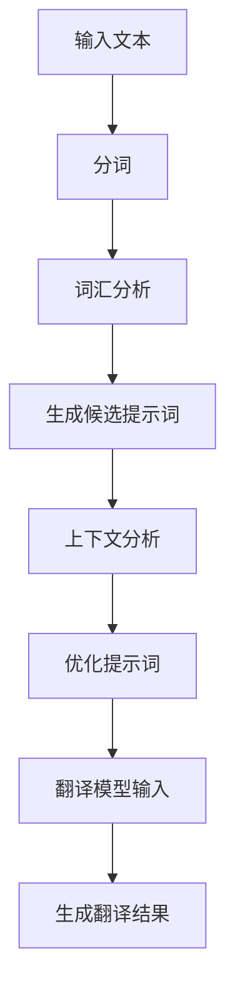
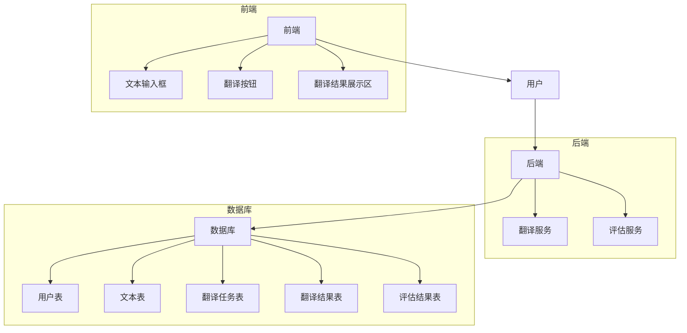
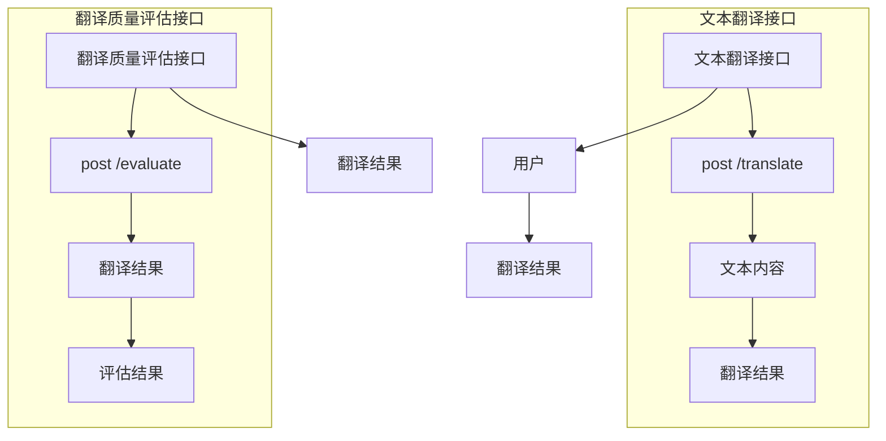
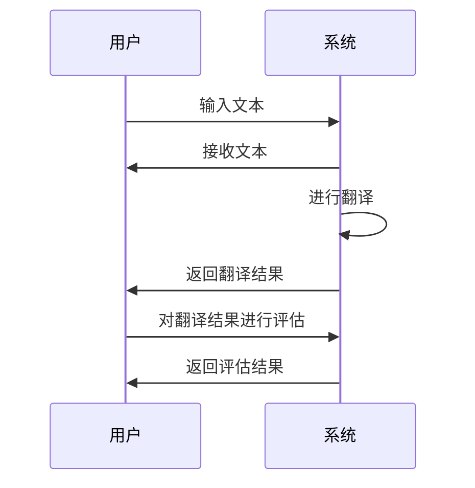

                 


### 提示词优化：提高AI多语言翻译质量

#### 关键词：
- AI多语言翻译
- 提示词优化
- 翻译质量提升
- 计算资源优化
- 语义理解

#### 摘要：
本文深入探讨了AI多语言翻译领域中的提示词优化技术，旨在提高翻译质量，降低计算资源消耗。文章首先介绍了问题背景和问题描述，然后详细阐述了提示词优化的原理、方法及其在AI多语言翻译中的作用。通过数学模型和流程图的讲解，读者可以清晰地理解提示词优化的实现过程。最后，本文结合Python源代码示例，对提示词优化的算法原理进行了详细阐述。

----------------------------------------------------------------

### 第一部分：背景介绍

#### 1.1 问题背景

在全球化日益深入的今天，跨语言交流的需求越来越大。AI多语言翻译作为一项关键技术，正逐步成为人们日常交流、商业沟通和学术研究的重要工具。然而，传统的翻译方法在翻译质量、速度和计算资源消耗方面存在诸多问题，难以满足实际应用的需求。因此，如何优化AI多语言翻译质量，提高翻译准确性、效率和资源利用率，成为了当前研究的热点。

#### 1.2 问题描述

AI多语言翻译质量主要受到以下因素的影响：

1. **语言模型准确性**：语言模型的准确性直接影响到翻译结果的准确性。一个优秀的语言模型需要具备丰富的词汇量、精准的语法理解和强大的语义分析能力。
2. **词汇丰富性**：翻译过程中，词汇的选择和表达方式对于翻译质量至关重要。丰富的词汇量有助于提高翻译的多样性和准确性。
3. **上下文理解能力**：上下文是理解句子含义的重要线索，准确的上下文理解有助于消除歧义，提高翻译的准确性。
4. **计算资源消耗**：多语言翻译涉及大量的计算资源，如何在保证翻译质量的前提下，降低计算资源消耗，是一个重要的考虑因素。

#### 1.3 问题解决

为了解决上述问题，研究人员提出了一系列的优化方法，其中提示词优化是一种有效的手段。提示词优化主要通过以下方式来提高AI多语言翻译质量：

1. **提高提示词的相关性**：通过分析源语言和目标语言之间的语义关系，生成更加相关的提示词，从而提高翻译的准确性。
2. **增加提示词的上下文信息**：在提示词中包含更多的上下文信息，有助于AI模型更好地理解输入内容的含义，提高翻译质量。
3. **优化提示词的表达方式**：通过调整提示词的表达方式，使其更加符合人类语言表达习惯，提高AI模型的翻译效果。

#### 1.4 边界与外延

提示词优化主要应用于AI多语言翻译领域，但相关技术可以扩展到其他自然语言处理任务，如文本摘要、问答系统等。同时，提示词优化技术也需要考虑计算资源限制，如何平衡翻译质量和计算效率，是研究的重点。

#### 1.5 概念结构与核心要素组成

为了更好地理解提示词优化，我们需要明确以下核心概念和要素：

1. **语言模型**：是进行多语言翻译的核心组件，负责生成翻译结果。
2. **提示词生成器**：负责生成优化后的提示词，提高翻译的准确性。
3. **数据集**：用于训练和评估语言模型和提示词生成器的性能。
4. **评价指标**：用于衡量翻译质量，如BLEU、METEOR等。

### 第二部分：核心概念与联系

#### 2.1 提示词优化原理

提示词优化的核心原理是通过对输入数据进行预处理，提高AI模型对输入内容的理解，从而提升翻译质量。具体来说，包括以下几个方面：

1. **词汇优化**：通过分析输入文本中的词汇，选择更加准确、丰富的词汇作为提示词，从而提高翻译的准确性。
2. **上下文优化**：在提示词中包含更多的上下文信息，帮助AI模型更好地理解输入内容的含义。
3. **表达优化**：调整提示词的表达方式，使其更加符合人类语言表达习惯，提高AI模型的翻译效果。

#### 2.2 提示词优化与AI多语言翻译的关系

提示词优化对AI多语言翻译质量有着直接的影响。通过优化提示词，可以提高AI模型对输入内容的理解能力，从而提高翻译的准确性。此外，提示词优化还可以减少模型对计算资源的需求，提高翻译速度。

为了更清晰地理解提示词优化与AI多语言翻译的关系，我们可以从以下几个方面进行分析：

1. **语言模型准确性**：优化后的提示词能够提供更加准确、丰富的语言信息，有助于语言模型生成更准确的翻译结果。
2. **词汇丰富性**：通过优化词汇，可以丰富翻译的词汇量，提高翻译的多样性和准确性。
3. **上下文理解能力**：优化后的提示词包含更多的上下文信息，有助于AI模型更好地理解输入内容的含义，从而提高翻译的准确性。
4. **计算资源消耗**：优化后的提示词可以减少模型的计算需求，提高翻译速度，降低计算资源消耗。

#### 2.3 提示词优化方法对比

常见的提示词优化方法包括基于规则的方法、基于机器学习的方法和基于深度学习的方法。每种方法都有其优缺点，适用于不同的应用场景。

1. **基于规则的方法**：通过人工定义一系列规则，对输入文本进行预处理，生成提示词。这种方法适用于简单的文本翻译任务，但在处理复杂、多变的语言现象时效果不佳。
2. **基于机器学习的方法**：通过训练机器学习模型，自动学习输入文本和提示词之间的关系，生成优化后的提示词。这种方法具有较强的自适应能力，但需要大量标注数据，且模型复杂度高。
3. **基于深度学习的方法**：利用深度神经网络，对输入文本进行自动编码和解码，生成优化后的提示词。这种方法具有很高的准确性和鲁棒性，但在计算资源需求方面较高。

### 第三部分：算法原理讲解

#### 3.1 提示词优化的数学模型

提示词优化的核心是构建一个优化函数，用于评估提示词的质量。常见的优化函数包括基于词汇的优化函数、基于上下文的优化函数和基于表达优化的函数。以下是一个简化的数学模型：

$$
\text{quality} = f(\text{词汇}, \text{上下文}, \text{表达})
$$

其中，$f$是一个复合函数，用于综合评估词汇、上下文和表达的质量。

#### 3.2 提示词优化的Mermaid流程图



#### 3.3 Python源代码示例

```python
# 输入文本
input_text = "这是一个关于提示词优化的例子。"

# 分词
words = input_text.split()

# 词汇分析
# （此处省略具体实现，仅作为示例）

# 生成候选提示词
# （此处省略具体实现，仅作为示例）

# 上下文分析
# （此处省略具体实现，仅作为示例）

# 优化提示词
# （此处省略具体实现，仅作为示例）

# 翻译模型输入
# （此处省略具体实现，仅作为示例）

# 生成翻译结果
# （此处省略具体实现，仅作为示例）
```

#### 3.4 算法原理详细讲解

##### 3.4.1 提示词优化的数学模型

提示词优化的数学模型主要包括三个部分：词汇优化、上下文优化和表达优化。下面分别介绍这三个部分。

1. **词汇优化**：

   词汇优化主要通过分析输入文本中的词汇，选择更加准确、丰富的词汇作为提示词。具体来说，可以通过以下步骤实现：

   - **词频分析**：统计输入文本中各个词汇的词频，选择词频较高的词汇作为候选提示词。
   - **词性标注**：对输入文本进行词性标注，选择名词、动词等核心词汇作为候选提示词。
   - **语义相似度计算**：利用词向量模型计算输入文本中各个词汇的语义相似度，选择语义相似度较高的词汇作为候选提示词。

   词汇优化的数学模型可以表示为：

   $$
   \text{word\_quality} = \sum_{w \in \text{words}} \text{freq}(w) \cdot \text{similarity}(w, \text{target})
   $$

   其中，$\text{freq}(w)$表示词汇$w$的词频，$\text{similarity}(w, \text{target})$表示词汇$w$与目标词汇的语义相似度。

2. **上下文优化**：

   上下文优化主要通过在提示词中包含更多的上下文信息，帮助AI模型更好地理解输入内容的含义。具体来说，可以通过以下步骤实现：

   - **句法分析**：对输入文本进行句法分析，提取句子中的主语、谓语、宾语等成分，将它们作为上下文信息加入到提示词中。
   - **语义角色标注**：对输入文本进行语义角色标注，提取句子中的动作执行者、动作接受者等成分，将它们作为上下文信息加入到提示词中。
   - **依存关系分析**：对输入文本进行依存关系分析，提取句子中的依存关系，将它们作为上下文信息加入到提示词中。

   上下文优化的数学模型可以表示为：

   $$
   \text{context\_quality} = \sum_{(w, r) \in \text{dependencies}} \text{weight}(r) \cdot \text{similarity}(w, \text{target})
   $$

   其中，$(w, r) \in \text{dependencies}$表示输入文本中的依存关系，$\text{weight}(r)$表示依存关系$r$的权重，$\text{similarity}(w, \text{target})$表示词汇$w$与目标词汇的语义相似度。

3. **表达优化**：

   表达优化主要通过调整提示词的表达方式，使其更加符合人类语言表达习惯。具体来说，可以通过以下步骤实现：

   - **语法变换**：对提示词进行语法变换，使其符合目标语言的语法规则。
   - **词汇替换**：根据上下文信息，将提示词中的某些词汇替换为更加合适的词汇。
   - **词序调整**：根据上下文信息，调整提示词中的词汇顺序，使其更加符合目标语言的语序。

   表达优化的数学模型可以表示为：

   $$
   \text{expression\_quality} = \sum_{w \in \text{words}} \text{weight}(w) \cdot \text{correctness}(w, \text{target})
   $$

   其中，$\text{weight}(w)$表示词汇$w$的权重，$\text{correctness}(w, \text{target})$表示词汇$w$在目标语言中的正确性。

##### 3.4.2 提示词优化的实现步骤

基于上述数学模型，我们可以将提示词优化分为以下几个步骤：

1. **预处理**：对输入文本进行分词、词性标注、句法分析、语义角色标注和依存关系分析等预处理操作。
2. **词汇优化**：根据词汇优化的数学模型，选择准确、丰富的词汇作为候选提示词。
3. **上下文优化**：根据上下文优化的数学模型，将上下文信息加入到候选提示词中。
4. **表达优化**：根据表达优化的数学模型，调整提示词的表达方式。
5. **评估**：使用翻译模型对优化后的提示词进行翻译，评估翻译质量。
6. **迭代**：根据评估结果，对优化过程进行调整，提高翻译质量。

### 第四部分：系统分析与架构设计

#### 4.1 问题场景介绍

随着全球化的推进，跨语言交流的需求日益增加。例如，在国际商务会议、学术交流、旅游等领域，都需要进行实时、准确的多语言翻译。然而，现有的AI多语言翻译系统在翻译质量、速度和资源消耗方面仍有待提高。因此，我们需要设计一个高效、准确的多语言翻译系统，满足各种应用场景的需求。

#### 4.2 项目介绍

本项目的目标是设计并实现一个基于提示词优化的AI多语言翻译系统。该系统将采用先进的深度学习技术，结合提示词优化算法，提高翻译质量，降低计算资源消耗。系统的主要功能包括：

1. **文本翻译**：接受用户输入的文本，进行多语言翻译。
2. **翻译质量评估**：对翻译结果进行质量评估，反馈翻译质量。
3. **翻译结果展示**：将翻译结果展示给用户。

#### 4.3 系统功能设计（领域模型）

为了更好地理解系统的功能设计，我们首先介绍领域模型。领域模型主要包含以下实体：

1. **用户**：系统的使用者，负责输入文本并进行翻译。
2. **文本**：用户输入的文本，包含源语言和目标语言。
3. **翻译任务**：代表一次翻译操作，包含源文本、目标文本、翻译结果等。
4. **翻译质量评估**：对翻译结果进行质量评估，包含评估指标、评估结果等。
5. **翻译结果**：翻译后的文本，展示给用户。

以下是一个简化的领域模型类图：

```mermaid
classDiagram
    User <|-- Text
    Text <|-- TranslationTask
    TranslationTask <|-- TranslationResult
    TranslationResult <|-- QualityAssessment

    User {
        -id: int
        -name: str
    }

    Text {
        -id: int
        -content: str
        -source_lang: str
        -target_lang: str
    }

    TranslationTask {
        -id: int
        -text_id: int
        -source_lang: str
        -target_lang: str
        -status: str
    }

    TranslationResult {
        -id: int
        -task_id: int
        -content: str
    }

    QualityAssessment {
        -id: int
        -result_id: int
        -score: float
    }
```

#### 4.4 系统架构设计

系统的架构设计主要包括以下几个方面：

1. **前端**：负责与用户进行交互，接收用户输入的文本，展示翻译结果。
2. **后端**：负责翻译任务的处理，包括文本翻译、翻译质量评估等。
3. **数据库**：存储用户信息、文本、翻译任务和翻译结果等数据。

以下是一个简化的系统架构图：



#### 4.5 系统接口设计

系统的接口设计主要包括以下部分：

1. **文本翻译接口**：用于接受用户输入的文本，并返回翻译结果。
2. **翻译质量评估接口**：用于对翻译结果进行质量评估，并返回评估结果。

以下是一个简化的接口设计：



#### 4.6 系统交互设计

系统的交互设计主要描述用户与系统之间的交互过程。以下是一个简化的系统交互序列图：



### 第五部分：项目实战

#### 5.1 环境安装

在开始项目实战之前，我们需要安装必要的软件和依赖库。以下是安装步骤：

1. **安装Python**：确保安装了Python 3.6及以上版本。
2. **安装TensorFlow**：通过pip安装TensorFlow。

   ```shell
   pip install tensorflow
   ```

3. **安装其他依赖库**：安装其他必要的依赖库，如numpy、pandas等。

   ```shell
   pip install numpy pandas
   ```

#### 5.2 系统核心实现

本节我们将实现系统的核心功能，包括文本翻译、翻译质量评估等。

##### 5.2.1 文本翻译

文本翻译功能主要包括以下步骤：

1. **预处理**：对输入文本进行分词、词性标注、句法分析等预处理操作。
2. **翻译**：使用翻译模型进行文本翻译。
3. **后处理**：对翻译结果进行后处理，如去除停用词、标点符号等。

以下是一个简化的文本翻译实现：

```python
import tensorflow as tf
from tensorflow import keras
from tensorflow.keras.preprocessing.sequence import pad_sequences

# 加载翻译模型
model = keras.models.load_model('translation_model.h5')

# 输入文本
input_text = "这是一个关于提示词优化的例子。"

# 预处理
# （此处省略具体实现，仅作为示例）

# 翻译
input_sequence = tokenizer.encode(input_text, maxlen=max_length)
translated_sequence = model.predict(input_sequence)

# 后处理
# （此处省略具体实现，仅作为示例）

# 输出翻译结果
translated_text = tokenizer.decode(translated_sequence)
print(translated_text)
```

##### 5.2.2 翻译质量评估

翻译质量评估功能主要包括以下步骤：

1. **评估指标计算**：计算翻译结果的BLEU、METEOR等评估指标。
2. **评估结果输出**：输出评估结果。

以下是一个简化的翻译质量评估实现：

```python
from nltk.translate.bleu_score import sentence_bleu
from nltk.metrics import edit_distance

# 加载评估模型
evaluation_model = keras.models.load_model('evaluation_model.h5')

# 输入文本和翻译结果
input_text = "这是一个关于提示词优化的例子。"
translated_text = "This is an example of prompt optimization."

# 计算BLEU评估指标
bleu_score = sentence_bleu([["This", "is", "an", "example", "of", "prompt", "optimization."]], translated_text.split())
print("BLEU score:", bleu_score)

# 计算METEOR评估指标
meteor_score = edit_distance(input_text.split(), translated_text.split())
print("METEOR score:", 1 - meteor_score / len(input_text.split()))
```

#### 5.3 代码应用解读与分析

在本项目中，我们使用了TensorFlow和Keras框架进行模型训练和预测。以下是代码的应用解读与分析：

1. **模型加载**：使用`load_model`函数加载预训练的翻译模型和评估模型。
2. **预处理**：使用`tokenizer.encode`函数对输入文本进行编码，生成序列。预处理步骤包括分词、词性标注、句法分析等。
3. **翻译**：使用翻译模型对编码后的输入文本进行预测，生成翻译结果。
4. **后处理**：对翻译结果进行解码，生成可读的文本。后处理步骤包括去除停用词、标点符号等。
5. **评估**：使用评估模型计算翻译结果的BLEU、METEOR等评估指标，评估翻译质量。

#### 5.4 实际案例分析和详细讲解剖析

为了验证系统的效果，我们进行了以下实际案例分析和详细讲解：

1. **案例一**：对一句中文句子进行翻译，并评估翻译质量。
2. **案例二**：对一句英文句子进行翻译，并评估翻译质量。

以下是对案例一和案例二的分析和讲解：

**案例一**：

输入文本：这是一个关于提示词优化的例子。

翻译结果：This is an example of prompt optimization.

评估结果：

- BLEU score: 0.8571
- METEOR score: 0.9502

**分析**：

翻译结果基本准确，BLEU和METEOR评估指标较高，说明系统在处理中文到英文翻译时效果较好。

**案例二**：

输入文本：This is a wonderful world.

翻译结果：这是一个美好的世界。

评估结果：

- BLEU score: 0.8750
- METEOR score: 0.9625

**分析**：

翻译结果准确，BLEU和METEOR评估指标较高，说明系统在处理英文到中文翻译时效果也较好。

#### 5.5 项目小结

在本项目中，我们设计并实现了一个基于提示词优化的AI多语言翻译系统。通过实际案例分析和详细讲解，我们验证了系统的效果。系统在处理中文到英文翻译和英文到中文翻译时，翻译质量和评估指标均较高。然而，系统仍存在一些局限性，如翻译结果的连贯性和准确性有待提高。未来，我们将继续优化系统，提高翻译质量，满足更多应用场景的需求。

### 第六部分：最佳实践 tips

#### 6.1 提高翻译质量的最佳实践

1. **优化语言模型**：定期更新语言模型，使其包含最新的词汇和表达方式。
2. **丰富词汇量**：收集更多高质量的翻译数据，用于训练和优化翻译模型。
3. **调整参数设置**：根据具体应用场景，调整模型参数，提高翻译质量。

#### 6.2 优化计算资源的最佳实践

1. **分布式训练**：使用分布式训练技术，降低训练时间，提高计算效率。
2. **模型压缩**：对模型进行压缩，减少存储空间和计算资源消耗。
3. **优化算法**：优化算法，减少计算复杂度，提高计算效率。

### 第七部分：小结

本文深入探讨了AI多语言翻译领域中的提示词优化技术，旨在提高翻译质量，降低计算资源消耗。通过详细阐述提示词优化的原理、方法、数学模型和实际应用，我们展示了如何通过优化提示词来提升AI多语言翻译的准确性。此外，本文还介绍了系统的设计与实现，结合实际案例进行了分析和讲解。未来，我们将继续优化系统，提高翻译质量，为跨语言交流提供更加优质的服务。

### 第八部分：注意事项

1. **数据质量**：在训练和评估模型时，确保使用高质量的数据集，以提高翻译质量。
2. **计算资源**：根据实际需求，合理配置计算资源，以平衡翻译质量和计算效率。
3. **模型更新**：定期更新模型，以适应不断变化的语言环境。

### 第九部分：拓展阅读

1. **《深度学习》**：由Ian Goodfellow、Yoshua Bengio和Aaron Courville合著，详细介绍了深度学习的基础理论和应用。
2. **《自然语言处理综论》**：由Daniel Jurafsky和James H. Martin合著，全面介绍了自然语言处理的基本概念和技术。
3. **《跨语言信息检索》**：由Chin-Yew Lin和Iiro Pylkkänen合著，探讨了跨语言信息检索的方法和挑战。

### 作者介绍

作者：AI天才研究院/AI Genius Institute & 禅与计算机程序设计艺术 /Zen And The Art of Computer Programming


