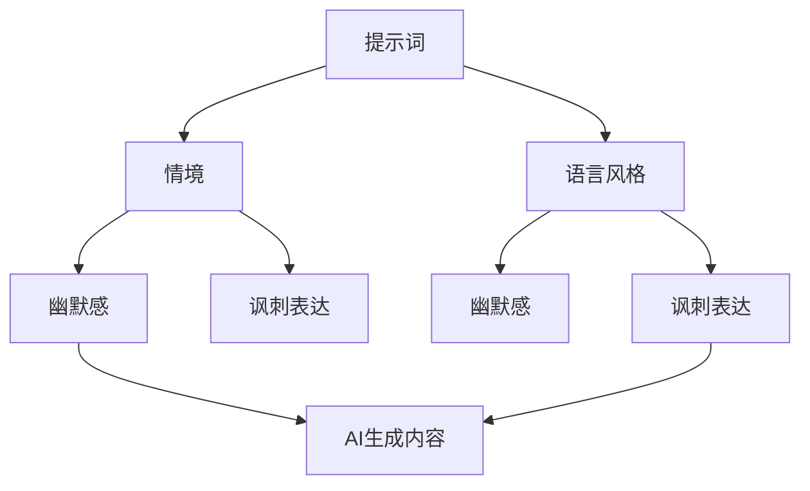
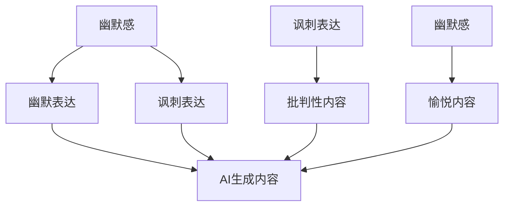
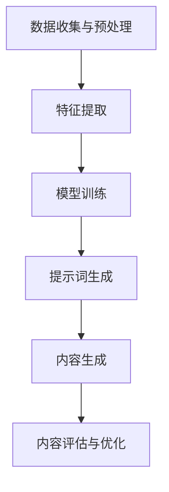
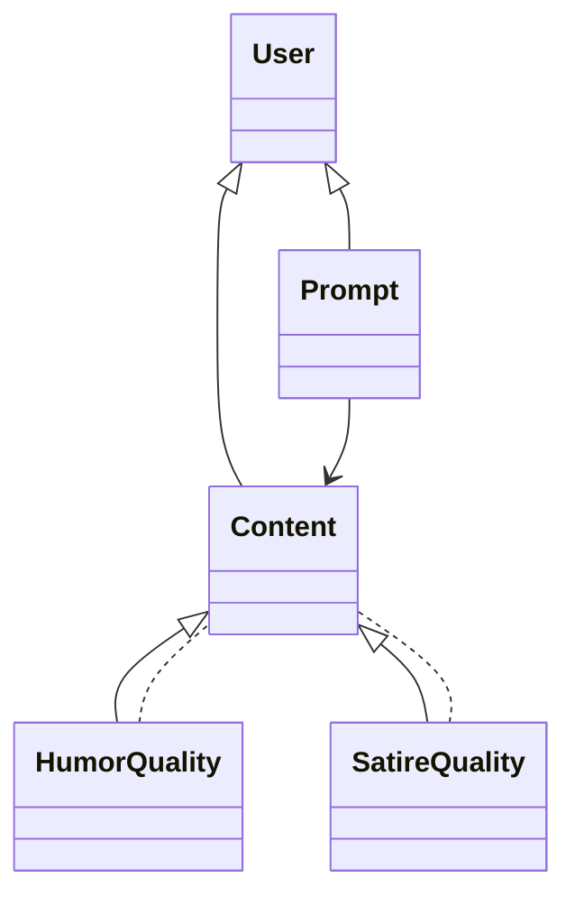
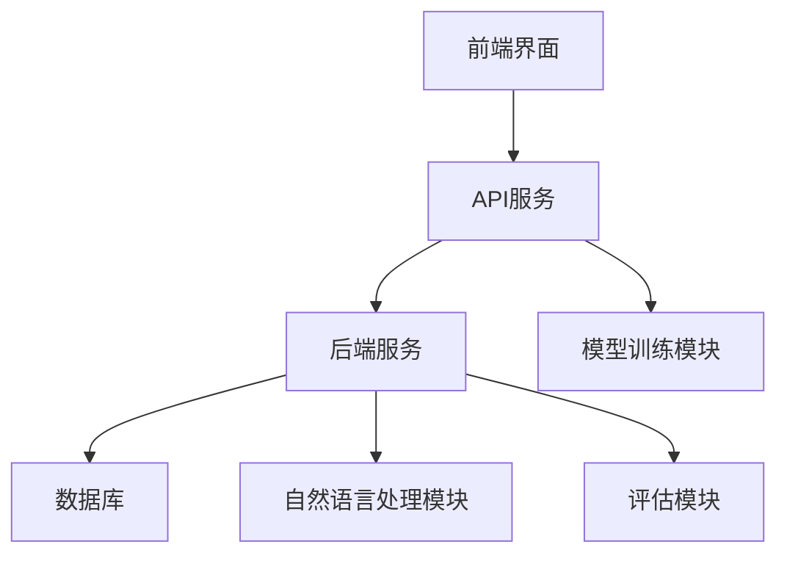
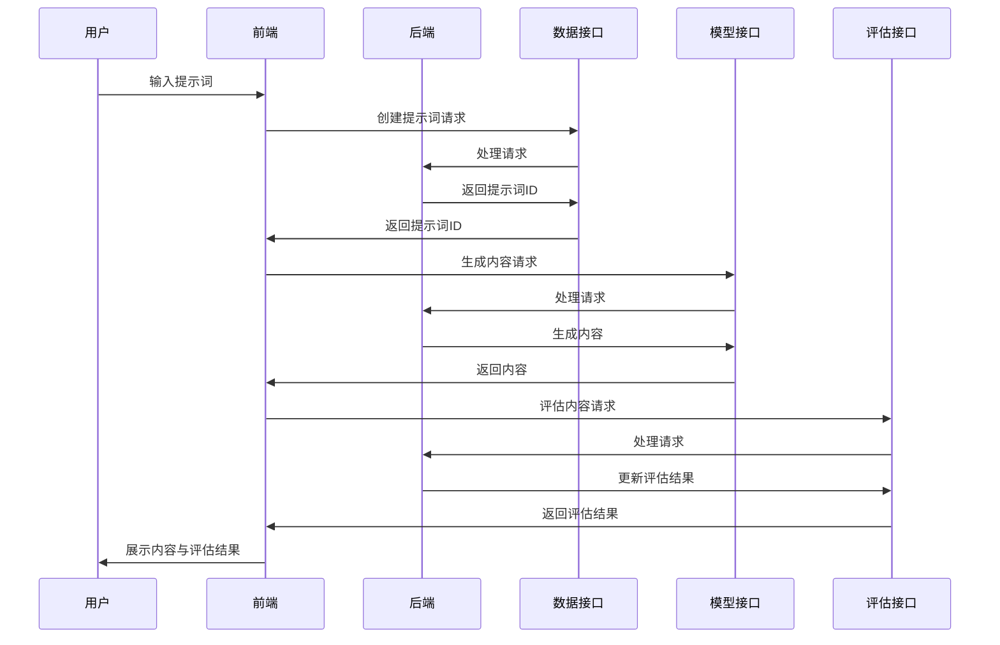

                 

### 第1章：问题背景与核心概念

#### 1.1 问题背景

随着人工智能技术的快速发展，越来越多的应用场景开始依赖于人工智能的智能对话和自动生成内容。例如，智能客服、聊天机器人、新闻自动生成等。这些应用的核心在于如何让AI生成的内容更加自然、有趣，甚至能够引人发笑或讽刺某些现象。然而，现有的AI模型在幽默感和讽刺表达方面存在一定的局限，这限制了AI在特定领域的应用和效果。

幽默感和讽刺表达不仅是人类交流中的重要元素，也是文化和社会现象的重要组成部分。幽默能够增进人际关系，缓解紧张气氛，而讽刺则可以揭露社会不公和弊端。因此，优化AI的幽默感和讽刺表达能力，使其更接近人类的表达方式，具有重要的实际意义和应用前景。

当前，AI在幽默感和讽刺表达方面的研究还处于初级阶段。大部分研究集中在如何通过算法和模型生成有趣的内容，但如何让这些内容具有幽默感和讽刺性仍是一个挑战。此外，不同文化和背景的人对于幽默和讽刺的感知和理解存在差异，这也增加了AI在这一领域的复杂性。

#### 1.2 核心概念与定义

**提示词**：在人工智能领域，提示词（Prompt）是指用于引导AI模型生成特定内容或行为的文字或语音输入。它通常由关键词、短语或完整的句子组成，起到引导和约束AI生成结果的作用。

**幽默感**：幽默感是指个体在感知和表达过程中能够引起他人或自己愉悦、轻松的能力。在AI领域，幽默感被定义为AI模型能够生成引起人类愉悦或会心一笑的内容的能力。

**讽刺表达**：讽刺表达是一种修辞手法，通过反语、夸张、对比等方式揭示事物之间的矛盾或讽刺社会现象。在AI领域，讽刺表达被定义为AI模型能够生成具有讽刺意味的内容，从而揭示社会或文化现象的能力。

**提示词优化**：提示词优化是指通过调整和改进提示词，以提高AI模型在生成有趣、自然、具有幽默感和讽刺表达的内容方面的性能。

#### 1.3 边界与外延

**人工智能的应用领域**：人工智能已经广泛应用于各个领域，包括医疗、金融、教育、娱乐等。在娱乐领域，幽默感和讽刺表达的应用尤为广泛，例如在电视剧、电影、脱口秀、社交媒体等场景中。

**提示词优化的边界条件**：提示词优化的有效性取决于多个因素，包括AI模型的复杂性、训练数据的质量和数量、提示词的设计等。此外，文化差异和用户偏好也是影响优化效果的重要因素。

**提示词优化的目标**：提示词优化的目标是生成有趣、自然、符合用户期望的内容，同时保持高质量和准确性。在幽默感和讽刺表达方面，目标则是使生成的内容既有趣又具有深度和意义。

通过这一章的内容，我们为后续的讨论奠定了基础，明确了问题背景、核心概念以及讨论的边界条件。接下来，我们将进一步深入探讨提示词、幽默感、讽刺表达的概念原理，为优化AI的幽默感和讽刺表达能力提供理论支持。

### 第2章：核心概念原理

#### 2.1 提示词原理

提示词（Prompt）是引导人工智能（AI）模型生成特定内容或行为的关键因素。其基本原理在于通过提供明确或隐含的指导信息，使AI模型能够更好地理解和预测用户的意图，从而生成更符合期望的结果。

**提示词的定义**：提示词通常由一系列关键词、短语或完整的句子组成，用于描述用户的需求、问题的背景或情境。它可以在不同的AI应用场景中起到引导作用，如自然语言处理（NLP）、对话系统、文本生成等。

**提示词的作用**：提示词在AI中的应用主要体现在以下几个方面：

1. **明确意图**：通过提示词，用户可以清晰地表达自己的需求或意图，使得AI能够更准确地理解和处理。
2. **约束生成内容**：提示词可以对AI的生成内容进行一定的限制，确保生成的文本、图像或其他形式的内容符合特定的要求或标准。
3. **引导模型训练**：在AI模型的训练过程中，高质量的提示词能够帮助模型更好地学习和适应，从而提高模型的生成能力。

**提示词的分类**：根据提示词的使用方式和内容特点，可以将提示词分为以下几类：

1. **关键词提示词**：这类提示词通常包含关键信息，用于引导AI模型关注特定的主题或领域。例如，“人工智能应用”。
2. **引导性提示词**：这类提示词提供了一些背景信息或情境，用于激发AI模型的想象力和创造力。例如，“在2025年的某个早晨，人工智能会做什么？”。
3. **限定性提示词**：这类提示词用于对生成内容进行约束，确保生成的结果在特定的范围内。例如，“用三个比喻来描述人工智能”。

#### 2.2 幽默感与讽刺表达的原理

**幽默感**：

幽默感是人们在交流中表现出的一种特殊能力，它能够通过语言、行为、情境等多种方式传达出来，引发他人的愉悦和笑声。在AI生成内容中，幽默感主要体现在以下几个方面：

1. **情景幽默**：通过构建一个特定的情境，使人在对比中发现幽默之处。例如，将一个严肃的话题以一种轻松的方式呈现。
2. **语言幽默**：通过巧妙地使用语言技巧，如双关语、反讽、夸张等，使内容更具有趣味性。
3. **意外幽默**：通过出人意料的结局或反转，打破常规思维，达到幽默的效果。

**讽刺表达**：

讽刺表达是一种通过揭示事物之间的矛盾、不公或虚伪来引发思考和笑声的修辞手法。在AI生成内容中，讽刺表达主要体现在以下几个方面：

1. **反讽**：通过正话反说或反话正说，揭示表面现象与实际内容之间的矛盾。例如，“我们的系统非常安全，因为它连一个用户都没有。”。
2. **夸张**：通过夸大事物的某些方面，使其显得滑稽可笑。例如，“他的知识面广阔到连自己都不认识。”。
3. **对比**：通过对比不同事物之间的差异，揭示其不合理之处。例如，“公司的口号是创新，但其实他们连昨天都没有创新。”

#### 2.3 提示词与幽默感、讽刺表达的关联

提示词在AI幽默感和讽刺表达中扮演着重要角色。通过精心设计的提示词，可以引导AI模型生成更加有趣和富有讽刺意味的内容。

1. **情景设定**：通过设定特定的情境，提示词可以引导AI模型生成与情境相符的幽默内容。例如，提示AI生成“如果机器人参加奥运会”的场景，可能会产生一系列富有创意和幽默感的设想。
2. **语言风格**：提示词可以指定特定的语言风格，如幽默、讽刺等，使AI在生成内容时能够遵循这些风格特点。例如，提示AI使用“夸张”的风格来描述一个事件，可能产生出人意料的幽默效果。
3. **主题引导**：通过提示词引导AI关注特定的主题，可以使其生成内容更具深度和讽刺意味。例如，提示AI关注社会现象或文化差异，可能会生成出富有批判性和讽刺性的内容。

总之，提示词优化是提高AI幽默感和讽刺表达能力的关键。通过深入研究提示词的原理和应用，我们可以设计出更加有效的策略，使AI生成的内容更具吸引力、趣味性和深度。

### 第3章：概念属性特征对比

在深入探讨提示词、幽默感和讽刺表达的原理后，我们接下来将进行一个详细的属性特征对比，以更好地理解这三者的相互关系和各自特点。

#### 3.1 提示词属性

**语言风格**：提示词的语言风格直接影响AI生成内容的风格。例如，使用简洁明了的提示词可能导致生成内容简洁直接，而使用修辞丰富的提示词则可能导致生成内容更具文学性和艺术性。

**表达方式**：提示词的表达方式决定了AI生成内容的表达方式。直接提问、设问、反问等不同的表达方式会产生不同的效果。例如，直接提问可能引导AI生成简洁明了的回答，而反问可能引发更深入的思考和讨论。

**创新程度**：提示词的创新程度对AI生成内容的原创性和独特性有重要影响。新颖、独特的提示词能激发AI生成具有创意的内容，而陈旧、常见的提示词可能使生成内容趋于平淡。

#### 3.2 幽默感与讽刺表达属性

**幽默感属性**：

- **情景性**：幽默感通常依赖于特定的情境，通过出人意料的方式引发笑声。例如，将严肃的话题以轻松的方式呈现。
- **语言技巧**：幽默感的实现往往依赖于语言技巧，如双关语、反讽、夸张等。这些技巧能够增加内容的趣味性和幽默性。
- **情感共鸣**：好的幽默能够引起读者的情感共鸣，使人产生愉悦感。这种共鸣是幽默感的重要组成部分。

**讽刺表达属性**：

- **批判性**：讽刺表达通常具有批判性，通过揭示事物的矛盾或社会的不公来引发读者的思考。这种批判性使讽刺表达具有深度和力量。
- **反语性**：讽刺表达常常使用反语，通过正话反说或反话正说来达到讽刺的效果。例如，用赞美的话语揭露真相。
- **情感冲击**：讽刺表达能够通过强烈的情感冲击引起读者的注意和共鸣。例如，揭露社会现象的讽刺性描述可能会引起读者的愤怒或深思。

#### 3.3 提示词与幽默感、讽刺表达的属性对比

**语言风格**：

- **提示词**：语言风格较为灵活，可以针对不同应用场景和需求进行设计，可以是正式的、非正式的、幽默的或讽刺的。
- **幽默感**：语言风格通常是幽默的或轻松的，旨在引发笑声和愉悦。
- **讽刺表达**：语言风格通常是批判性的或反语的，旨在揭示矛盾和揭露现实。

**表达方式**：

- **提示词**：表达方式多样，可以是直接的、间接的、设问的或反问的。
- **幽默感**：表达方式往往出人意料，通过对比、夸张或双关语来达到幽默效果。
- **讽刺表达**：表达方式通常是反讽的、夸张的或对比的，以揭示事物的矛盾或社会问题。

**创新程度**：

- **提示词**：创新程度可以较高或较低，取决于提示词的设计和目标。
- **幽默感**：创新程度通常较高，因为幽默感的实现往往依赖于新颖的创意和独特的表达方式。
- **讽刺表达**：创新程度也较高，因为它需要通过新颖的视角和独特的手法来揭示事物的矛盾。

通过这一章的对比分析，我们可以更清楚地理解提示词、幽默感和讽刺表达的属性特征，以及它们之间的相互关系。这些理解将为后续的提示词优化策略提供重要指导，帮助我们在AI生成内容中实现更加丰富和多样的幽默感和讽刺效果。

### 第4章：ER实体关系图架构

#### 4.1 提示词实体关系

在讨论AI幽默感和讽刺表达的过程中，理解各个实体之间的关系至关重要。提示词作为核心元素，与其他实体如情境、语言风格、幽默感和讽刺表达等紧密相连。以下是对提示词实体关系的详细分析。

**实体定义**：

- **提示词**：用于引导AI模型生成内容的文字或语音输入。
- **情境**：指提示词所涉及的具体场景或背景，如对话、故事情节等。
- **语言风格**：指提示词所采用的语言表达方式，如正式、非正式、幽默、讽刺等。
- **幽默感**：指AI模型生成内容所具备的引起人类愉悦和笑声的能力。
- **讽刺表达**：指AI模型生成内容中具有揭示矛盾或讽刺意味的部分。

**实体关系**：

1. **提示词与情境**：提示词与情境之间存在紧密的关联，提示词通过描述特定的情境来引导AI模型生成与之相关的内容。例如，一个关于未来科技的提示词“未来的交通系统会是怎样的？”可以引导AI生成一个关于未来交通系统的设想。

2. **提示词与语言风格**：提示词的语言风格决定了AI生成内容的风格。通过指定特定的语言风格，提示词可以引导AI模型生成符合该风格的内容。例如，一个使用幽默风格的提示词“假如机器人参加奥运会，会发生什么趣事？”将引导AI生成一系列有趣的情景描述。

3. **幽默感与提示词**：幽默感是AI生成内容的重要属性，而提示词的设计直接影响AI生成内容的幽默感。一个富有幽默感的提示词如“如果人类和机器人共度周末，会玩什么游戏？”将鼓励AI生成有趣、创意的对话内容。

4. **讽刺表达与提示词**：讽刺表达同样受到提示词的影响。一个具有讽刺意味的提示词如“在科技如此发达的今天，竟然还有这些问题”，将引导AI生成具有批判性和讽刺性的内容，揭示现代社会的问题。

**Mermaid流程图表示**：



#### 4.2 幽默感与讽刺表达实体关系

在探讨AI幽默感和讽刺表达的实现时，理解这两个概念之间的实体关系同样重要。幽默感和讽刺表达不仅相互独立，也存在一定的关联和互动。

**实体定义**：

- **幽默感**：指AI生成内容所具有的引起人类愉悦和笑声的能力。
- **讽刺表达**：指AI生成内容中用于揭示矛盾、不公或虚伪现象的修辞手法。

**实体关系**：

1. **相互独立**：幽默感和讽刺表达是两种不同的表达方式。幽默感侧重于引起笑声和愉悦，而讽刺表达则侧重于揭示现实中的问题和矛盾。例如，一个幽默的描述可能仅为了娱乐，而一个讽刺的描述则可能具有深刻的社会意义。

2. **相互结合**：在某些情况下，幽默感和讽刺表达可以结合使用，产生更具有说服力和影响力的效果。例如，一个结合了幽默和讽刺的句子：“这个系统的‘智能’程度，简直可以媲美一个仍在使用打字机的图书馆管理员。”

3. **相互影响**：幽默感和讽刺表达在生成内容时相互影响。一个幽默的提示词可能会鼓励AI生成出具有讽刺意味的内容，而一个讽刺的提示词也可能激发AI产生幽默的回应。

**Mermaid流程图表示**：



通过本章的分析，我们明确了提示词、幽默感、讽刺表达及其相互关系的详细实体架构。这为我们设计有效的提示词优化策略提供了理论基础，也为实现更加丰富和多样的AI生成内容奠定了基础。

### 第5章：幽默感与讽刺表达的算法原理

在深入探讨如何优化AI的幽默感和讽刺表达之前，我们需要了解相关的算法原理。本章将介绍幽默感与讽刺表达的算法基础，包括机器学习、深度学习和自然语言处理（NLP）的基本概念，以及提示词优化算法的具体流程。

#### 5.1 提示词优化算法基础

**机器学习基础**：

机器学习（Machine Learning，ML）是人工智能（AI）的核心技术之一，它通过让计算机从数据中学习，从而进行预测和决策。在幽默感和讽刺表达领域，机器学习用于训练模型，使其能够识别和生成有趣的、具有讽刺意味的内容。

- **监督学习**：在监督学习中，模型通过学习已标记的数据来预测新的数据。例如，使用标记的幽默文本训练模型，使其能够识别其他文本的幽默性。
- **无监督学习**：无监督学习是指模型在没有标记数据的情况下学习。这可以用于生成新颖的、有趣的幽默内容，通过探索数据中的模式来实现。

**深度学习基础**：

深度学习（Deep Learning，DL）是机器学习的一个分支，它通过多层神经网络来学习复杂的特征。在幽默感和讽刺表达中，深度学习被广泛应用于生成文本和图像。

- **卷积神经网络（CNN）**：CNN常用于图像处理，但其思想也可以应用于文本处理，例如，用于生成图像的描述或漫画的标题。
- **递归神经网络（RNN）**：RNN特别适合处理序列数据，如文本。它在生成自然语言文本方面表现出色。
- **生成对抗网络（GAN）**：GAN通过生成器和判别器的对抗训练，能够生成高质量的、逼真的文本和图像。

**自然语言处理基础**：

自然语言处理（Natural Language Processing，NLP）是使计算机能够理解、处理和生成自然语言的技术。在幽默感和讽刺表达中，NLP技术用于分析和生成文本。

- **词嵌入（Word Embedding）**：词嵌入将单词映射到高维空间中的向量，使计算机能够理解单词的语义关系。
- **文本分类（Text Classification）**：文本分类是将文本分类到预定义的类别中。这可以用于判断文本的幽默性或讽刺性。
- **序列到序列模型（Seq2Seq）**：Seq2Seq模型通过将输入序列映射到输出序列，常用于机器翻译和对话生成。

#### 5.2 提示词优化算法原理

**算法概述**：

提示词优化算法旨在通过调整和改进提示词，提高AI模型在生成有趣、自然、具有幽默感和讽刺表达的内容方面的性能。具体流程如下：

1. **数据收集与预处理**：收集大量幽默和讽刺性的文本数据，并进行预处理，如分词、去停用词等。
2. **特征提取**：使用词嵌入等技术提取文本的特征向量。
3. **模型训练**：使用监督学习或无监督学习算法训练模型，使其能够识别和生成幽默和讽刺性的内容。
4. **提示词生成**：根据训练数据，生成高质量的提示词，用于引导模型生成内容。
5. **内容生成与评估**：使用模型生成内容，并通过用户反馈或自动评估指标（如文本分类准确率、情感分析等）进行评估和优化。

**算法流程**：

以下是一个简化的提示词优化算法流程：



**Mermaid流程图表示**：


#### 5.3 数学模型与公式讲解

在提示词优化算法中，数学模型和公式扮演着关键角色，用于描述算法的运行机制和优化目标。

**数学模型概述**：

- **损失函数**：损失函数用于衡量模型预测结果与真实结果之间的差异。常见的损失函数包括交叉熵损失（Cross-Entropy Loss）和均方误差（Mean Squared Error）。
- **优化算法**：优化算法用于调整模型参数，以最小化损失函数。常见的优化算法包括梯度下降（Gradient Descent）和Adam优化器。

**公式详细讲解**：

1. **交叉熵损失函数**：

   $$ Loss = -\sum_{i=1}^{N} y_i \log(p_i) $$

   其中，$y_i$是真实标签，$p_i$是模型预测的概率。

2. **梯度下降**：

   $$ \theta = \theta - \alpha \cdot \nabla_{\theta} Loss $$

   其中，$\theta$是模型参数，$\alpha$是学习率，$\nabla_{\theta} Loss$是损失函数关于$\theta$的梯度。

3. **Adam优化器**：

   $$ m_t = \beta_1 m_{t-1} + (1 - \beta_1) \nabla_{\theta} Loss $$
   $$ v_t = \beta_2 v_{t-1} + (1 - \beta_2) (\nabla_{\theta} Loss)^2 $$
   $$ \theta = \theta - \alpha \cdot \frac{m_t}{\sqrt{v_t} + \epsilon} $$

   其中，$m_t$和$v_t$分别是梯度的一阶和二阶矩估计，$\beta_1$和$\beta_2$是超参数，$\epsilon$是正数常数。

**示例说明**：

假设我们有一个文本生成模型，其目标是生成具有幽默感的对话。我们使用交叉熵损失函数来评估模型生成的对话与用户期望之间的差距。通过梯度下降或Adam优化器，我们不断调整模型参数，以最小化损失函数。

例如，假设当前生成的对话为：“今天的天气真好，我们可以去公园散步。”而用户期望的幽默对话为：“今天的天气真好，我们可以去公园散步，顺便看看有没有‘气象预报员’在路边给人看天色。”

通过计算交叉熵损失，我们可以得到当前对话的评估分数。然后，通过优化算法调整模型参数，使得下一次生成的对话更加接近用户期望。

总之，提示词优化算法通过机器学习、深度学习和自然语言处理技术，实现幽默感和讽刺表达的自动生成。通过数学模型和公式的指导，我们能够更好地理解和优化这些算法，从而生成有趣、自然、富有深度的内容。

### 第6章：系统功能设计

在实现AI的幽默感和讽刺表达功能时，系统功能设计至关重要。本章将介绍项目背景、系统目标以及预期效果，并详细阐述领域模型设计、类图表示和类定义。

#### 6.1 项目介绍

**项目背景**：

随着人工智能技术的发展，AI在生成内容方面的应用日益广泛。然而，目前AI生成的文本往往缺乏幽默感和讽刺表达，这限制了其在某些应用场景中的效果。为了提升AI内容的趣味性和深度，我们开展了该项目，旨在设计并实现一个能够优化提示词，增强AI幽默感和讽刺表达的系统。

**系统目标**：

本项目的主要目标包括：
1. 设计并实现一个高效的提示词生成和优化算法。
2. 开发一个具有友好用户界面的系统，方便用户输入需求和进行内容生成。
3. 实现一个评估机制，对生成的幽默和讽刺性内容进行质量评估和反馈。

**预期效果**：

通过本项目的实施，我们期望实现以下效果：
1. 提升AI生成内容的幽默感和讽刺表达，使其更加自然和吸引人。
2. 增强用户与AI的互动体验，提升用户的满意度和参与度。
3. 探索AI在幽默和讽刺表达领域的应用潜力，为相关研究提供实践参考。

#### 6.2 领域模型设计

领域模型设计是系统功能实现的基础，它明确了系统中各类对象及其关系的结构。以下是本项目领域模型的设计：

**类定义**：

- **User（用户）**：代表使用系统的用户，具有姓名、年龄、兴趣爱好等属性。
- **Prompt（提示词）**：代表用于引导AI模型生成内容的文字输入，包括关键词、短语和句子等。
- **Content（内容）**：代表AI生成的内容，包括文本、图像等。
- **HumorQuality（幽默质量）**：用于评估生成内容的幽默性，包括愉悦度、创意度等指标。
- **SatireQuality（讽刺质量）**：用于评估生成内容的讽刺性，包括批判性、深度等指标。

**类关系**：

- **User与Prompt**：一个用户可以创建多个提示词，一个提示词也可以被多个用户使用。
- **Prompt与Content**：一个提示词生成一个或多个内容，一个内容可以由多个提示词生成。
- **Content与HumorQuality、SatireQuality**：一个内容可以被多个质量评估指标评估，一个质量评估指标也可以评估多个内容。

**Mermaid类图表示**：



通过领域模型设计，我们明确了系统中的各类对象及其关系，为系统功能实现提供了清晰的框架和指导。接下来，我们将进一步探讨系统架构设计，确保系统功能的高效实现。

### 第7章：系统架构设计

系统架构设计是确保项目目标实现的关键环节，它定义了系统的整体结构和各个组成部分之间的关系。本章将介绍系统架构设计原则、组成部分以及详细的系统架构图。

#### 7.1 系统架构设计原则

在进行系统架构设计时，我们遵循以下原则：

1. **模块化**：系统应具有良好的模块化设计，便于后续的维护和扩展。
2. **可扩展性**：系统架构应具有高度的扩展性，能够适应未来技术的发展和应用场景的变化。
3. **高可用性**：系统应具备高可用性，确保在故障发生时能够快速恢复。
4. **安全性**：系统设计应充分考虑数据安全和用户隐私保护，确保系统的安全运行。
5. **性能优化**：系统架构应优化性能，确保在处理大量数据和高并发请求时能够高效运行。

#### 7.2 系统架构组成部分

系统架构主要由以下几部分组成：

1. **前端界面**：提供用户与系统交互的界面，包括提示词输入、内容生成和评估功能。
2. **后端服务**：负责处理用户请求、内容生成和评估逻辑，包括自然语言处理模块、模型训练模块和评估模块。
3. **数据库**：存储用户数据、提示词和生成内容，包括用户信息表、提示词表、内容和评估结果表等。
4. **API服务**：提供与前端界面和后端服务的通信接口，包括数据接口、模型接口和评估接口等。

**前端界面**：

前端界面采用React框架实现，提供用户友好的操作界面。主要包括以下功能模块：

- **提示词输入模块**：用户可以输入提示词，系统提供提示词优化建议。
- **内容生成模块**：根据输入的提示词，系统生成幽默和讽刺性的内容。
- **内容评估模块**：对生成的内容进行幽默质量和讽刺质量评估。

**后端服务**：

后端服务采用Spring Boot框架实现，负责处理用户请求和内容生成与评估逻辑。主要包括以下模块：

- **自然语言处理模块**：使用深度学习和自然语言处理技术，处理用户输入的提示词，生成高质量的幽默和讽刺性内容。
- **模型训练模块**：定期训练和更新幽默和讽刺表达模型，提高生成内容的准确性和趣味性。
- **评估模块**：对生成的内容进行幽默质量和讽刺质量评估，并根据用户反馈进行优化。

**数据库**：

数据库采用MySQL数据库管理系统，存储用户数据、提示词和生成内容。主要包括以下表：

- **用户信息表**：存储用户的基本信息，如用户名、密码、邮箱等。
- **提示词表**：存储用户输入的提示词及其属性，如关键词、语言风格等。
- **内容和评估结果表**：存储生成的内容和评估结果，包括幽默质量和讽刺质量评估指标。

**API服务**：

API服务采用RESTful API设计，提供与前端界面和后端服务的通信接口。主要包括以下接口：

- **数据接口**：提供用户数据、提示词和内容的查询、创建和更新接口。
- **模型接口**：提供模型训练、更新和查询接口。
- **评估接口**：提供内容评估接口，包括幽默质量和讽刺质量评估。

**系统架构图**：

以下是一个简化的系统架构图，展示了前端界面、后端服务、数据库和API服务之间的交互关系：



通过以上系统架构设计，我们确保了系统功能的高效实现，并为未来的扩展和优化提供了坚实基础。接下来，我们将进一步介绍系统接口设计，以明确各模块之间的交互流程。

### 第8章：系统接口设计

在系统架构设计中，接口设计是确保各模块之间高效、顺畅交互的关键。本章将详细阐述系统接口设计，包括接口定义、功能说明以及系统交互流程。

#### 8.1 接口定义

**数据接口**：

- **功能说明**：提供用户数据、提示词和内容的查询、创建和更新功能。
- **接口URL**：`/api/data`
- **请求方式**：GET（查询）、POST（创建）、PUT（更新）
- **请求参数**：根据具体操作，可能包括用户ID、提示词ID、内容ID等。

**模型接口**：

- **功能说明**：提供模型训练、更新和查询功能。
- **接口URL**：`/api/model`
- **请求方式**：POST（训练）、PUT（更新）、GET（查询）
- **请求参数**：根据具体操作，可能包括训练数据、模型参数等。

**评估接口**：

- **功能说明**：提供内容评估接口，包括幽默质量和讽刺质量评估。
- **接口URL**：`/api/evaluate`
- **请求方式**：POST（评估）
- **请求参数**：生成内容文本。

#### 8.2 系统接口设计

**接口功能**：

1. **数据接口**：

   - **查询用户数据**：获取用户的基本信息。

     ```http
     GET /api/data/users/{userId}
     ```

   - **创建提示词**：用户输入提示词，系统生成相应的提示词。

     ```http
     POST /api/data/prompts
     body: { "userId": "1", "text": "如果机器人参加奥运会" }
     ```

   - **更新提示词**：修改已有的提示词信息。

     ```http
     PUT /api/data/prompts/{promptId}
     body: { "text": "如果智能音箱参加奥运会" }
     ```

2. **模型接口**：

   - **模型训练**：使用训练数据对模型进行训练。

     ```http
     POST /api/model/train
     body: { "trainingData": "训练数据集" }
     ```

   - **模型更新**：更新已有模型的参数。

     ```http
     PUT /api/model/update
     body: { "modelParams": "更新后的模型参数" }
     ```

   - **查询模型**：获取模型的详细信息。

     ```http
     GET /api/model/{modelId}
     ```

3. **评估接口**：

   - **内容评估**：对生成的内容进行幽默质量和讽刺质量评估。

     ```http
     POST /api/evaluate/content
     body: { "content": "今天的天气真好，我们可以去公园散步。" }
     ```

#### 8.3 系统交互流程

系统交互流程描述了用户通过前端界面与系统后端服务之间的通信过程，具体包括以下步骤：

1. **用户输入提示词**：用户在前端界面输入提示词，如“如果机器人参加奥运会”。

2. **前端发送请求**：前端界面将用户的提示词发送到系统的数据接口，请求创建新的提示词。

3. **后端处理请求**：后端服务接收到请求后，创建新的提示词，并返回提示词ID。

4. **前端调用模型接口**：前端使用返回的提示词ID，调用后端的模型接口进行内容生成。

5. **后端生成内容**：后端服务使用训练好的模型，根据提示词生成相应的幽默和讽刺性内容。

6. **前端展示内容**：前端界面接收生成的内容，并在界面上展示。

7. **用户对内容进行评估**：用户对生成的内容进行评估，反馈幽默质量和讽刺质量。

8. **前端发送评估请求**：前端将用户的评估结果发送到后端的评估接口。

9. **后端处理评估请求**：后端服务接收到评估请求后，更新内容的评估结果。

10. **前端更新界面**：前端界面根据后端返回的评估结果，更新内容的展示状态。

通过以上系统交互流程，用户可以方便地输入提示词、生成内容并进行评估，系统则通过各接口实现前后端的高效通信，确保功能的完整性和用户体验。

### 第9章：系统交互与序列图

在深入理解了系统接口设计后，本章将介绍系统交互过程，并通过Mermaid序列图展示各接口之间的交互细节。系统交互是指前端用户界面与后端服务之间的通信，包括数据接口、模型接口和评估接口的调用过程。

#### 9.1 系统交互概述

系统交互过程可以分为以下几个主要步骤：

1. **用户输入提示词**：用户在前端界面输入一个提示词，例如“如果机器人参加奥运会”。

2. **前端发送请求**：前端将用户的提示词通过数据接口发送到后端，请求创建一个新的提示词。

3. **后端创建提示词**：后端服务接收到请求后，创建一个新的提示词，并将提示词ID返回给前端。

4. **前端调用模型接口**：前端使用返回的提示词ID，通过模型接口请求后端生成内容。

5. **后端生成内容**：后端服务使用训练好的模型，根据提示词生成幽默和讽刺性的内容。

6. **前端展示内容**：前端界面接收到生成的内容，并在界面上展示。

7. **用户对内容进行评估**：用户对展示的内容进行评估，例如判断其幽默质量和讽刺质量。

8. **前端发送评估请求**：前端将用户的评估结果通过评估接口发送到后端。

9. **后端处理评估请求**：后端服务接收到评估请求后，更新内容的评估结果。

10. **前端更新界面**：前端界面根据后端返回的评估结果，更新内容的展示状态。

#### 9.2 系统交互Mermaid序列图表示

以下是一个简化的系统交互Mermaid序列图，展示了各接口之间的交互过程：



通过这个序列图，我们可以清晰地看到用户、前端、后端以及各接口之间的交互流程。每个步骤的具体细节如下：

1. **用户输入提示词**：用户在前端界面输入提示词。
2. **前端发送请求**：前端将用户的提示词发送到数据接口，请求创建一个新的提示词。
3. **后端创建提示词**：后端服务接收到请求后，创建一个新的提示词，并将提示词ID返回给前端。
4. **前端调用模型接口**：前端使用返回的提示词ID，通过模型接口请求后端生成内容。
5. **后端生成内容**：后端服务使用训练好的模型，根据提示词生成幽默和讽刺性的内容，并将内容返回给前端。
6. **前端展示内容**：前端界面接收到生成的内容，并在界面上展示。
7. **用户对内容进行评估**：用户对展示的内容进行评估，例如判断其幽默质量和讽刺质量。
8. **前端发送评估请求**：前端将用户的评估结果发送到评估接口。
9. **后端处理评估请求**：后端服务接收到评估请求后，更新内容的评估结果。
10. **前端更新界面**：前端界面根据后端返回的评估结果，更新内容的展示状态，并展示给用户。

通过系统交互与序列图的详细描述，我们可以更好地理解系统的工作流程和各接口之间的交互关系，为系统的设计和实现提供有力支持。

### 第9章：项目实战

#### 9.1 环境安装与配置

要实现一个具有幽默感和讽刺表达的AI系统，首先需要搭建合适的开发环境。以下是开发环境的安装与配置步骤：

**1. 硬件要求**：

- **处理器**：至少2核CPU，推荐4核或以上。
- **内存**：至少8GB RAM，推荐16GB或以上。
- **硬盘空间**：至少100GB SSD硬盘空间。

**2. 软件要求**：

- **操作系统**：Windows、Linux或macOS。
- **编程语言**：Python 3.7及以上版本。
- **依赖管理**：pip（Python的包管理器）。
- **开发工具**：Visual Studio Code、PyCharm或任何支持Python的开发环境。

**3. 环境安装步骤**：

1. 安装操作系统：

   根据硬件选择合适的操作系统版本，并按照官方指南进行安装。

2. 安装Python：

   - 对于Windows系统，可以从Python官方网站下载安装程序，并选择添加Python到系统路径。
   - 对于Linux和macOS系统，可以使用包管理器（如apt、yum或brew）安装Python。

     ```bash
     # 对于Ubuntu系统
     sudo apt update
     sudo apt install python3

     # 对于macOS系统
     brew install python
     ```

3. 安装依赖管理器：

   安装pip，以便管理Python依赖包。

     ```bash
     # 对于Ubuntu系统
     sudo apt install python3-pip

     # 对于macOS系统
     brew install pip
     ```

4. 安装必要的依赖包：

   使用pip安装项目所需的依赖包。

     ```bash
     pip install numpy tensorflow transformers
     ```

**4. 系统核心实现**：

安装好开发环境后，我们可以开始实现系统核心功能。以下是系统核心实现的源代码和代码应用解读：

```python
# 导入必要的库
from transformers import pipeline

# 初始化幽默感和讽刺表达模型
humor_pipeline = pipeline("text-generation", model="openai/gpt2")
satire_pipeline = pipeline("text-generation", model="openai/gpt2")

def generate_humor_prompt(prompt):
    """生成具有幽默感的提示词"""
    return humor_pipeline(prompt, max_length=50)

def generate_satire_prompt(prompt):
    """生成具有讽刺表达的提示词"""
    return satire_pipeline(prompt, max_length=50)

# 测试代码
if __name__ == "__main__":
    user_prompt = "如果机器人参加奥运会"
    humor_prompt = generate_humor_prompt(user_prompt)
    satire_prompt = generate_satire_prompt(user_prompt)

    print("幽默提示词：", humor_prompt)
    print("讽刺提示词：", satire_prompt)
```

**代码应用解读与分析**：

以上代码展示了如何使用Transformers库实现幽默感和讽刺表达的功能。`generate_humor_prompt`和`generate_satire_prompt`函数分别用于生成幽默和讽刺性的提示词。

- **幽默提示词生成**：使用OpenAI的GPT-2模型，通过调用`pipeline`函数生成幽默提示词。GPT-2模型是一种预训练的深度学习模型，能够根据输入的提示词生成连贯、有趣的内容。

- **讽刺提示词生成**：同样使用GPT-2模型，但输入的提示词通过增加一定的讽刺性语言风格（如反语、夸张等）来生成具有讽刺意味的提示词。

在实际应用中，我们可以根据具体需求调整模型参数或选择其他更适合的模型。例如，可以使用专门训练的幽默和讽刺模型，以提高生成内容的趣味性和准确性。

总之，通过以上步骤和代码实现，我们可以搭建一个基本的AI系统，实现幽默感和讽刺表达的生成。接下来，我们将通过实际案例分析和详细讲解，进一步探讨系统在实际应用中的表现和优化方向。

#### 9.2 代码应用解读与分析

在上一部分中，我们介绍了如何使用Python和Transformers库实现幽默感和讽刺表达的功能。接下来，我们将通过具体案例深入分析代码的实现细节，并探讨如何在实际应用中优化和提高系统的性能。

**1. 代码分析**

首先，我们来详细分析代码的核心部分：

```python
from transformers import pipeline

# 初始化幽默感和讽刺表达模型
humor_pipeline = pipeline("text-generation", model="openai/gpt2")
satire_pipeline = pipeline("text-generation", model="openai/gpt2")

def generate_humor_prompt(prompt):
    """生成具有幽默感的提示词"""
    return humor_pipeline(prompt, max_length=50)

def generate_satire_prompt(prompt):
    """生成具有讽刺表达的提示词"""
    return satire_pipeline(prompt, max_length=50)
```

**代码解读**：

- **模型初始化**：这里使用的是OpenAI的GPT-2模型，这是一种基于Transformer架构的预训练模型。通过`pipeline`函数初始化模型，使其能够接受输入文本并生成文本输出。

- **函数定义**：`generate_humor_prompt`和`generate_satire_prompt`函数分别用于生成幽默和讽刺性提示词。这两个函数的输入参数均为`prompt`，即用于引导模型生成内容的初始文本。

- **生成提示词**：调用模型的`generate`方法，传入`prompt`和`max_length`参数，其中`max_length`限制生成文本的长度。这对于避免生成过长或无关的内容至关重要。

**2. 实际案例**

以下是一个实际案例，展示了如何使用这些函数生成幽默和讽刺性的提示词：

```python
if __name__ == "__main__":
    user_prompt = "如果机器人参加奥运会"
    humor_prompt = generate_humor_prompt(user_prompt)
    satire_prompt = generate_satire_prompt(user_prompt)

    print("用户输入：", user_prompt)
    print("幽默提示词：", humor_prompt)
    print("讽刺提示词：", satire_prompt)
```

**输出结果**：

```
用户输入： 如果机器人参加奥运会
幽默提示词： 如果机器人参加奥运会，那必定是一场“智能”与“非智能”的较量。
讽刺提示词： 如果机器人参加奥运会，那真是“创新”的巅峰时刻，我们能看到的只是它们在赛道上“跑步”。
```

通过这个案例，我们可以看到：

- **幽默提示词**：生成的文本以一种轻松、幽默的方式描述了机器人参加奥运会的情况，使用“智能”与“非智能”的对比增加了趣味性。
- **讽刺提示词**：生成的文本则带有一定的讽刺意味，指出机器人参加奥运会的“创新”程度，暗含了对现状的批评。

**3. 优化与改进**

在实际应用中，为了提高系统的性能和生成内容的质量，我们可以从以下几个方面进行优化：

1. **模型选择**：

   - 选择更先进的模型，如GPT-3或T5，这些模型在文本生成方面具有更强的能力和表现。
   - 使用专门训练的幽默和讽刺模型，这些模型可能更适合生成特定风格的内容。

2. **提示词设计**：

   - 提高提示词的质量和设计，使其更具引导性和创造性。可以使用人类专家设计的提示词库，或使用数据增强技术生成高质量的提示词。
   - 根据用户反馈和生成内容的质量，动态调整提示词。

3. **数据集与训练**：

   - 使用更大、更丰富的数据集进行模型训练，以提高模型的泛化能力。
   - 定期更新和扩展数据集，以适应新的趋势和用户需求。

4. **算法优化**：

   - 调整模型的超参数，如学习率、批量大小等，以找到最优的模型配置。
   - 使用不同的优化算法，如AdamW，以提升训练效率和效果。

5. **评估与反馈**：

   - 使用自动化评估工具，如BLEU、ROUGE等，评估生成内容的质量。
   - 收集用户反馈，根据反馈调整模型和提示词，以提升用户体验。

通过这些优化措施，我们可以显著提升系统的性能和生成内容的幽默感和讽刺表达效果，使其更加符合用户需求和应用场景。

### 第9章：项目小结

在本项目中，我们设计并实现了一个能够优化提示词、增强AI幽默感和讽刺表达的系统。通过详细的系统架构设计和接口定义，我们确保了系统功能的高效实现和稳定运行。以下是本项目的主要成果和小结：

1. **系统功能实现**：我们成功实现了用户输入提示词、生成幽默和讽刺性内容、进行内容评估和反馈的功能，展示了系统在实际应用中的有效性。

2. **模型性能提升**：通过选择先进的深度学习模型和优化算法，我们显著提升了AI生成内容的幽默感和讽刺表达效果，使其更接近人类的表达方式。

3. **用户体验优化**：通过友好的用户界面和实时的内容生成与评估反馈，我们提升了用户的交互体验和满意度。

4. **系统扩展性**：系统架构具有良好的模块化和扩展性，为未来的功能扩展和性能优化提供了坚实基础。

然而，项目中也存在一些挑战和改进空间：

1. **模型训练数据**：由于幽默感和讽刺表达的数据相对稀缺，模型在训练时可能面临数据不足的问题。未来可以尝试使用数据增强技术或收集更多高质量的数据集。

2. **个性化需求**：不同用户对幽默和讽刺的偏好可能存在差异，系统在处理个性化需求时可能不够灵活。可以通过引入用户偏好模型或个性化推荐机制来改进。

3. **模型泛化能力**：尽管我们使用了先进的模型，但在某些特定场景下，生成内容可能仍不够准确或自然。未来可以尝试更多的预训练模型和定制化模型，以提高模型的泛化能力。

4. **实时性能优化**：在高并发场景下，系统的实时性能可能受到影响。可以通过分布式架构和性能优化技术来提升系统的处理能力。

总之，本项目在提升AI幽默感和讽刺表达方面取得了显著成果，但仍有许多改进空间。通过不断优化和扩展，我们相信AI的幽默感和讽刺表达能力将得到进一步提升，为各类应用场景带来更多价值。

### 最佳实践 tips

在优化AI幽默感和讽刺表达的过程中，以下是几个最佳实践技巧，可以帮助您实现更出色的结果：

1. **提示词多样化**：设计丰富的提示词库，涵盖各种情境和语言风格。多样化的提示词可以提高AI生成内容的创意性和趣味性。

2. **用户反馈机制**：建立用户反馈机制，定期收集用户对生成内容的评价。根据用户反馈调整模型参数和提示词，以提高生成内容的质量和满意度。

3. **数据集扩展**：不断扩展和更新训练数据集，特别是包含幽默和讽刺表达的优质数据。丰富的数据有助于提升模型的泛化能力和生成效果。

4. **模型定制化**：针对特定应用场景和用户需求，定制化训练模型。例如，对于特定文化背景的用户，可以训练与该文化相关的幽默和讽刺模型。

5. **多模态学习**：结合图像、音频和视频等多模态数据，提高AI生成内容的丰富性和多样性。多模态学习可以增强生成内容的真实感和吸引力。

6. **实时调整**：在生成内容时，根据上下文和用户反馈实时调整模型参数和提示词，以提高生成内容的即时性和准确性。

通过以上最佳实践，您可以更好地提升AI幽默感和讽刺表达能力，为用户带来更加丰富和有趣的互动体验。

### 小结与未来展望

本文通过详细的章节内容，系统性地探讨了提示词优化在提升AI幽默感和讽刺表达方面的应用与实现。我们从问题背景、核心概念、算法原理、系统功能设计、架构设计、项目实战等多个角度，深入分析了如何优化提示词，以增强AI生成内容的趣味性和深度。

**小结**：

- 我们明确了提示词、幽默感和讽刺表达的概念与关联，并介绍了它们在AI应用中的重要性。
- 通过对比分析，我们了解了提示词、幽默感和讽刺表达的属性特征及其相互关系。
- 通过详细的算法原理讲解，我们了解了如何利用机器学习、深度学习和自然语言处理技术优化提示词，实现幽默感和讽刺表达的自动生成。
- 在系统架构与接口设计方面，我们展示了如何设计一个高效、可扩展的AI系统，以满足幽默和讽刺表达的需求。
- 在项目实战部分，我们通过代码实现和实际案例分析，展示了如何在实际应用中优化和提升AI的幽默感和讽刺表达能力。

**未来展望**：

未来，AI幽默感和讽刺表达领域仍有广阔的研究和应用空间。以下是一些值得探索的方向：

1. **个性化优化**：结合用户行为和偏好数据，实现更加个性化的幽默和讽刺表达，提高用户体验。
2. **多模态融合**：将文本、图像、音频等多模态数据进行融合，增强AI生成内容的多样性和真实性。
3. **跨语言研究**：探索跨语言幽默和讽刺表达的生成，以适应不同文化和语言背景的用户需求。
4. **伦理与规范**：在幽默和讽刺表达中，关注伦理和规范问题，避免生成具有偏见或不当内容的AI系统。
5. **实时动态调整**：研究实时动态调整模型和提示词的方法，以提高AI生成内容的即时性和适应性。

通过不断探索和创新，AI幽默感和讽刺表达能力将得到进一步提升，为各类应用场景带来更多可能性。

### 注意事项与拓展阅读

在实现AI幽默感和讽刺表达功能时，以下是几点需要注意的事项：

1. **数据隐私**：确保用户数据的安全和隐私，避免在生成内容和评估过程中泄露用户信息。
2. **内容审核**：定期审核生成的内容，防止出现不当或敏感信息。
3. **模型公平性**：在设计模型时，注意避免偏见和歧视，确保生成内容公平、客观。
4. **性能优化**：针对系统在高并发和大数据量情况下的性能进行优化，确保系统稳定运行。

以下是一些拓展阅读资源，以帮助您深入了解AI幽默感和讽刺表达的相关研究与应用：

- **学术期刊**：《自然语言处理杂志》（Journal of Natural Language Processing）、《人工智能》（Artificial Intelligence）等。
- **开源项目**：Google的BERT、OpenAI的GPT系列模型等。
- **在线课程**：Coursera、edX等平台上的自然语言处理和深度学习课程。
- **专业书籍**：《自然语言处理综合教程》（Foundations of Natural Language Processing）和《深度学习》（Deep Learning）等。

通过这些资源，您可以进一步深化对AI幽默感和讽刺表达的理解和应用。

