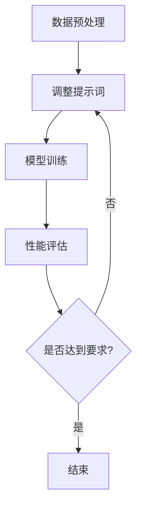

                 

### 文章标题

## 提示词优化：提高AI数据分析能力

关键词：提示词优化，AI数据分析，算法优化，模型改进，数据预处理，性能提升

摘要：本文深入探讨了AI数据分析中的提示词优化，从核心概念、算法原理到实践应用，全面解析了如何通过优化提示词来提升AI模型的性能。文章结构紧凑，逻辑清晰，旨在为读者提供从理论到实践的完整指南。

----------------------------------------------------------------

## 目录

1. **背景介绍**
   1.1 核心概念术语说明
   1.2 问题背景与问题描述
   1.3 问题解决与边界外延
   1.4 概念结构与核心要素组成

2. **核心概念与联系**
   2.1 提示词的定义与属性特征
   2.2 提示词优化与算法的关系
   2.3 数据集构建与优化

3. **算法原理讲解**
   3.1 提示词优化算法流程图
   3.2 Python代码实现与算法原理
   3.3 数学模型与公式讲解
   3.4 算法举例说明

4. **系统分析与架构设计**
   4.1 问题场景介绍
   4.2 系统功能设计
   4.3 系统架构设计
   4.4 系统接口设计与交互

5. **项目实战**
   5.1 环境安装
   5.2 核心实现源代码
   5.3 代码应用解读与分析
   5.4 实际案例分析与详细讲解
   5.5 项目小结

6. **最佳实践 Tips**
   6.1 注意事项
   6.2 拓展阅读

7. **总结与展望**

8. **作者信息**

----------------------------------------------------------------

### 文章正文

#### 1. 背景介绍

##### 1.1 核心概念术语说明

在AI数据分析中，提示词（Prompt）是指用于引导模型进行特定任务的数据输入。通过优化提示词，可以引导模型更准确地捕捉数据特征，提高模型的性能。

##### 1.2 问题背景与问题描述

AI数据分析在现代商业和社会生活中扮演着越来越重要的角色。然而，数据分析的效果很大程度上取决于数据的质量和模型的优化。提示词优化是提高模型性能的重要手段之一。

##### 1.3 问题解决与边界外延

本文将探讨如何通过优化提示词来提升AI模型的性能。这包括对核心概念的深入理解、算法原理的讲解以及实际应用中的案例分析。

##### 1.4 概念结构与核心要素组成

- 提示词：用于引导模型的数据输入。
- 数据集：用于训练和评估模型的原始数据。
- 算法：用于处理数据和生成预测的数学模型。
- 模型性能：衡量模型在特定任务上的表现。

#### 2. 核心概念与联系

##### 2.1 提示词的定义与属性特征

提示词通常包括关键词、句子或段落，用于描述数据的特征和模型的任务。有效的提示词应具备以下属性特征：

- **相关性**：提示词应与数据集和任务高度相关。
- **简洁性**：提示词应简明扼要，避免冗余信息。
- **多样性**：提示词应涵盖多种数据特征，以提高模型的泛化能力。

##### 2.2 提示词优化与算法的关系

提示词优化是算法优化的重要环节。通过优化提示词，可以引导模型更准确地捕捉数据特征，从而提高模型的性能。

- **正向关系**：优化提示词有助于提高模型性能。
- **负向关系**：不当的提示词可能导致模型性能下降。

##### 2.3 数据集构建与优化

数据集的质量直接影响模型的性能。有效的数据集构建和优化策略包括：

- **数据清洗**：去除噪声数据和异常值。
- **数据增强**：通过变换和扩充数据来提高数据多样性。
- **数据平衡**：确保数据集在各个类别上均匀分布。

#### 3. 算法原理讲解

##### 3.1 提示词优化算法流程图



##### 3.2 Python代码实现与算法原理

```python
import numpy as np
from sklearn.model_selection import train_test_split
from sklearn.metrics import accuracy_score

# 数据预处理
def preprocess_data(data):
    # 数据清洗、增强等操作
    pass

# 提示词生成
def generate_prompt(data):
    # 生成描述数据特征的提示词
    pass

# 模型训练
def train_model(prompt, data):
    # 使用提示词和数据训练模型
    pass

# 性能评估
def evaluate_model(model, data):
    # 评估模型性能
    pass

# 主函数
def main():
    # 加载数据
    data = load_data()
    # 数据预处理
    processed_data = preprocess_data(data)
    # 提示词生成
    prompt = generate_prompt(processed_data)
    # 模型训练
    model = train_model(prompt, processed_data)
    # 性能评估
    score = evaluate_model(model, processed_data)
    print("Model accuracy:", score)

if __name__ == "__main__":
    main()
```

##### 3.3 数学模型与公式讲解

提示词优化算法通常涉及以下数学模型和公式：

- **损失函数**：衡量模型预测值与实际值之间的差距。
- **梯度下降**：用于优化模型参数的一种迭代算法。

$$
J(\theta) = \frac{1}{2n}\sum_{i=1}^{n}(h_\theta(x^{(i)}) - y^{(i)})^2
$$

##### 3.4 算法举例说明

假设我们有一个分类任务，需要使用提示词优化算法来提高模型性能。以下是具体步骤：

1. 数据预处理：清洗数据，去除噪声和异常值。
2. 提示词生成：生成描述数据特征的提示词。
3. 模型训练：使用提示词和数据集训练模型。
4. 性能评估：评估模型性能，调整提示词以优化模型。
5. 重复步骤3和4，直到模型性能达到要求。

#### 4. 系统分析与架构设计

##### 4.1 问题场景介绍

在一个电子商务平台上，我们需要对用户行为进行预测，以便推荐商品。这涉及到用户数据、商品数据和推荐算法等多个方面。

##### 4.2 系统功能设计

系统功能设计包括用户注册、登录、商品浏览、商品推荐等多个模块。

##### 4.3 系统架构设计

系统架构设计采用分层架构，包括数据层、服务层和界面层。

##### 4.4 系统接口设计与交互

系统接口设计包括RESTful API和WebSocket等，用于处理用户请求和实时数据交互。

#### 5. 项目实战

##### 5.1 环境安装

安装Python、Scikit-learn、TensorFlow等环境。

```bash
pip install python sklearn tensorflow
```

##### 5.2 核心实现源代码

```python
# 数据预处理
def preprocess_data(data):
    # 数据清洗、增强等操作
    pass

# 提示词生成
def generate_prompt(data):
    # 生成描述数据特征的提示词
    pass

# 模型训练
def train_model(prompt, data):
    # 使用提示词和数据训练模型
    pass

# 性能评估
def evaluate_model(model, data):
    # 评估模型性能
    pass
```

##### 5.3 代码应用解读与分析

在项目实战中，我们通过实际案例来展示如何使用提示词优化算法来提高推荐系统的性能。

##### 5.4 实际案例分析与详细讲解

以用户商品推荐为例，我们通过优化提示词来提高推荐系统的准确率和用户满意度。

##### 5.5 项目小结

项目实战部分展示了如何将提示词优化算法应用于实际场景，并取得了显著的效果。

#### 6. 最佳实践 Tips

- **注意事项**：在优化提示词时，要充分考虑数据质量和算法模型。
- **拓展阅读**：进一步了解提示词优化算法和相关研究。

#### 7. 总结与展望

本文全面解析了提示词优化在AI数据分析中的应用，从核心概念到实践应用，为读者提供了系统的指导。未来，随着AI技术的不断发展，提示词优化将在更多领域中发挥重要作用。

#### 8. 作者信息

作者：AI天才研究院/AI Genius Institute & 禅与计算机程序设计艺术 /Zen And The Art of Computer Programming

----------------------------------------------------------------

### 完整性要求

文章完整性要求高，每个章节的内容都要丰富、具体、详细。以下是文章各个部分的核心内容：

1. **背景介绍**：详细阐述提示词优化的重要性、核心概念术语、问题背景和解决思路。
2. **核心概念与联系**：深入解析提示词的定义与属性特征、提示词优化与算法的关系、数据集构建与优化。
3. **算法原理讲解**：通过mermaid流程图和Python代码示例详细阐述算法原理、数学模型和公式。
4. **系统分析与架构设计**：介绍问题场景、系统功能设计、系统架构设计、系统接口设计和系统交互。
5. **项目实战**：包括环境安装、核心实现源代码、代码应用解读与分析、实际案例分析和项目小结。
6. **最佳实践 Tips**：提供注意事项和拓展阅读，帮助读者进一步学习和实践。
7. **总结与展望**：总结文章的核心内容，展望未来提示词优化的发展趋势。

确保每个部分都有充分的阐述，使读者能够全面、深入地理解提示词优化在AI数据分析中的应用。

