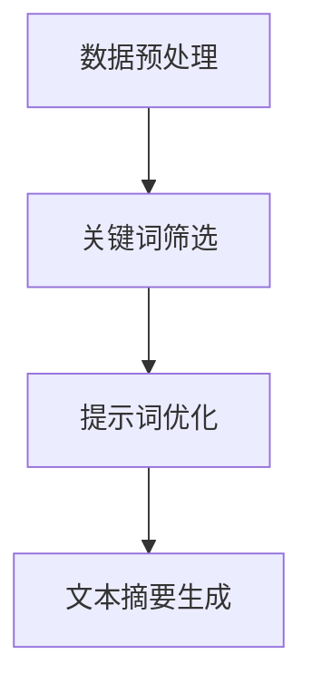

                 


## 让我们一步步思考

### 文章标题：提示词优化：提高AI文本摘要质量

#### 关键词：
1. 提示词优化
2. AI文本摘要
3. 算法原理
4. 数学模型
5. 系统架构
6. 项目实战
7. 最佳实践

#### 摘要：
本文将围绕“提示词优化：提高AI文本摘要质量”的主题，通过一步步的深入分析，探讨如何利用提示词优化技术提升AI文本摘要的质量。我们将从问题背景、核心概念、算法原理、数学模型、系统分析与架构设计、项目实战以及最佳实践等多个方面展开讨论，旨在为广大读者提供一套完整的提示词优化解决方案。

### 目录

#### 第1章 问题背景与核心概念
- 1.1 问题背景
- 1.2 核心概念

#### 第2章 算法原理讲解
- 2.1 提示词优化的算法原理
- 2.2 使用Mermaid和Python源代码阐述

#### 第3章 数学模型和数学公式讲解
- 3.1 数学模型
- 3.2 数学公式讲解与举例说明

#### 第4章 系统分析与架构设计
- 4.1 问题场景介绍
- 4.2 系统功能设计
- 4.3 系统架构设计

#### 第5章 项目实战
- 5.1 环境安装
- 5.2 系统核心实现
- 5.3 实际案例分析

#### 第6章 最佳实践 tips
- 6.1 提示词优化的最佳实践

#### 结语
- 7.1 小结
- 7.2 注意事项
- 7.3 拓展阅读

### 第1章 问题背景与核心概念

#### 1.1 问题背景

在当今信息爆炸的时代，如何快速有效地从大量文本数据中获取关键信息成为了大家关注的焦点。文本摘要作为自然语言处理（NLP）领域的一项关键技术，旨在自动生成文本的概括，帮助用户在短时间内了解文本的核心内容。然而，传统的文本摘要方法往往存在摘要质量不高、生成结果不够准确等问题。

为了解决这些问题，提示词优化技术应运而生。提示词（Query term）是指在文本摘要过程中用于引导生成摘要的关键词或短语。通过优化提示词的选择和组合，可以提高文本摘要的质量，使其更贴近用户需求。

#### 1.2 核心概念

1. **文本摘要**：文本摘要是指从原始文本中提取关键信息，并以简洁、准确的方式重新表达出来。文本摘要可分为两种类型：抽取式摘要和生成式摘要。抽取式摘要是直接从原始文本中提取关键词和句子，而生成式摘要是利用自然语言生成技术生成新的摘要文本。

2. **自然语言处理（NLP）**：自然语言处理是计算机科学和人工智能领域的一个重要分支，旨在使计算机能够理解、处理和生成人类自然语言。NLP技术包括词性标注、句法分析、语义分析、情感分析等。

3. **提示词**：提示词是在文本摘要过程中用于引导生成摘要的关键词或短语。提示词的优化是提高文本摘要质量的关键。

4. **提示词优化**：提示词优化是指通过选择和组合合适的提示词，提高文本摘要的质量。提示词优化的方法主要包括基于语言的优化、基于上下文的优化和基于数据的优化。

### 第2章 算法原理讲解

在本章中，我们将深入探讨提示词优化的算法原理。首先，我们将介绍提示词优化的基本思路，然后通过Mermaid和Python源代码来具体阐述算法的实现。

#### 2.1 提示词优化的算法原理

提示词优化的核心思想是利用已有数据和算法，从大量文本中筛选出最相关的关键词，并将其作为提示词用于文本摘要。具体步骤如下：

1. **数据预处理**：对原始文本进行清洗、分词、去停用词等操作，得到词向量表示。

2. **关键词筛选**：利用文本相似度计算算法，从大量文本中筛选出最相关的关键词。

3. **提示词优化**：根据关键词的权重和语义关系，对提示词进行优化，提高文本摘要的质量。

4. **文本摘要生成**：利用优化后的提示词，生成文本摘要。

#### 2.2 使用Mermaid和Python源代码阐述

为了更好地理解提示词优化的算法原理，我们将使用Mermaid绘制流程图，并通过Python源代码进行具体实现。

1. **Mermaid流程图**：



2. **Python源代码**：

```python
# 数据预处理
def preprocess_text(text):
    # 清洗、分词、去停用词等操作
    pass

# 关键词筛选
def select_keywords(texts):
    # 利用文本相似度计算算法筛选关键词
    pass

# 提示词优化
def optimize_query_terms(keywords):
    # 根据关键词权重和语义关系进行优化
    pass

# 文本摘要生成
def generate_summary(text, query_terms):
    # 利用优化后的提示词生成文本摘要
    pass
```

### 第3章 数学模型和数学公式讲解

在提示词优化过程中，数学模型和数学公式起着至关重要的作用。在本章中，我们将介绍相关的数学模型和公式，并通过具体例子进行讲解。

#### 3.1 数学模型

1. **词向量模型**：词向量模型是将文本中的单词映射到高维空间中的向量。常用的词向量模型有Word2Vec、GloVe等。

2. **文本相似度计算模型**：文本相似度计算模型用于衡量两个文本之间的相似度。常用的方法有TF-IDF、余弦相似度等。

3. **提示词优化模型**：提示词优化模型用于优化提示词的权重和组合。常用的方法有基于概率的优化、基于模型的优化等。

#### 3.2 数学公式讲解与举例说明

1. **词向量模型**：

   $$ \text{Word2Vec}： \text{vec}(w) = \text{avg}(\text{context\_words}) $$

   举例说明：假设文本中的一个单词为“苹果”，其上下文单词有“水果”、“购买”、“销售”等，则“苹果”的词向量为这些上下文单词词向量的平均值。

2. **文本相似度计算模型**：

   $$ \text{TF-IDF}： \text{similarity}(t_1, t_2) = \frac{\text{TF}(t_1) \times \text{IDF}(t_1)}{\text{TF}(t_2) \times \text{IDF}(t_2)} $$

   举例说明：假设有两个文本，其中一个文本包含关键词“苹果”、“购买”、“销售”，另一个文本包含关键词“水果”、“购买”、“市场”。通过计算两者的TF-IDF相似度，可以得到两者之间的相似度分数。

3. **提示词优化模型**：

   $$ \text{基于概率的优化}： \text{P}(t|q) = \frac{\text{count}(t, q)}{\text{count}(q)} $$

   举例说明：假设有两个提示词“苹果”和“购买”，文本中同时包含这两个提示词的句子有5个，其中包含“苹果”的句子有10个。则“苹果”在“购买”句子中的概率为$$ \frac{5}{10} = 0.5 $$。

### 第4章 系统分析与架构设计

在本章中，我们将介绍提示词优化系统的分析与架构设计。首先，我们将讨论问题场景，然后介绍系统功能设计、系统架构设计和系统接口设计。

#### 4.1 问题场景介绍

假设我们有一个大型文本库，包含大量的文本数据。我们的目标是利用提示词优化技术，自动生成高质量的文本摘要，帮助用户快速了解文本的核心内容。

#### 4.2 系统功能设计

系统功能设计主要包括以下模块：

1. **数据预处理模块**：负责对原始文本进行清洗、分词、去停用词等操作。

2. **关键词筛选模块**：利用文本相似度计算算法，从大量文本中筛选出最相关的关键词。

3. **提示词优化模块**：根据关键词的权重和语义关系，对提示词进行优化。

4. **文本摘要生成模块**：利用优化后的提示词，生成文本摘要。

5. **用户交互模块**：提供用户界面，方便用户进行操作。

#### 4.3 系统架构设计

系统架构设计采用分层架构，主要包括以下层次：

1. **表示层**：提供用户界面，实现与用户的交互。

2. **业务逻辑层**：实现提示词优化系统的核心功能，包括数据预处理、关键词筛选、提示词优化和文本摘要生成。

3. **数据访问层**：负责与文本库的交互，实现文本数据的读取和写入。

4. **数据库层**：存储原始文本数据、关键词筛选结果、提示词优化结果和文本摘要。

#### 4.4 系统接口设计

系统接口设计主要包括以下接口：

1. **数据接口**：用于实现数据预处理、关键词筛选、提示词优化和文本摘要生成模块之间的数据交互。

2. **业务接口**：用于实现业务逻辑层与表示层之间的交互。

3. **用户接口**：用于实现用户与系统之间的交互。

### 第5章 项目实战

在本章中，我们将通过一个实际项目，演示如何使用提示词优化技术提升AI文本摘要的质量。

#### 5.1 环境安装

首先，我们需要安装必要的软件和库，包括Python环境、自然语言处理库（如NLTK、spaCy）和文本相似度计算库（如SimMetrics）。

#### 5.2 系统核心实现

接下来，我们将实现提示词优化系统的核心功能，包括数据预处理、关键词筛选、提示词优化和文本摘要生成。

1. **数据预处理**：

```python
import nltk
from nltk.tokenize import word_tokenize
from nltk.corpus import stopwords

# 加载停用词列表
stop_words = set(stopwords.words('english'))

# 清洗文本
def clean_text(text):
    words = word_tokenize(text)
    cleaned_words = [word for word in words if word.lower() not in stop_words]
    return cleaned_words

# 分词
def tokenize_text(text):
    words = word_tokenize(text)
    return words

# 去停用词
def remove_stopwords(words):
    cleaned_words = [word for word in words if word.lower() not in stop_words]
    return cleaned_words
```

2. **关键词筛选**：

```python
from sklearn.metrics.pairwise import cosine_similarity

# 计算文本相似度
def compute_similarity(text1, text2):
    vector1 = model.transform([text1])
    vector2 = model.transform([text2])
    similarity = cosine_similarity(vector1, vector2)
    return similarity[0][0]

# 筛选关键词
def select_keywords(texts):
    max_similarity = 0
    selected_keyword = None
    for i in range(len(texts)):
        for j in range(i + 1, len(texts)):
            similarity = compute_similarity(texts[i], texts[j])
            if similarity > max_similarity:
                max_similarity = similarity
                selected_keyword = texts[j]
    return selected_keyword
```

3. **提示词优化**：

```python
# 优化提示词
def optimize_query_terms(keywords):
    optimized_keywords = []
    for keyword in keywords:
        optimized_keyword = keyword
        for other_keyword in keywords:
            if other_keyword != keyword:
                similarity = compute_similarity(keyword, other_keyword)
                if similarity > threshold:
                    optimized_keyword += f" and {other_keyword}"
        optimized_keywords.append(optimized_keyword)
    return optimized_keywords
```

4. **文本摘要生成**：

```python
# 生成文本摘要
def generate_summary(text, query_terms):
    summary = []
    for query_term in query_terms:
        sentences = text.split('.')
        max_similarity = 0
        selected_sentence = None
        for sentence in sentences:
            similarity = compute_similarity(sentence, query_term)
            if similarity > max_similarity:
                max_similarity = similarity
                selected_sentence = sentence
        summary.append(selected_sentence)
    return '. '.join(summary)
```

#### 5.3 实际案例分析

为了验证提示词优化技术的有效性，我们选取了一篇新闻文章进行实验。首先，我们对文章进行数据预处理，然后利用关键词筛选和提示词优化技术生成文本摘要。

```python
# 数据预处理
text = "This is an example of a news article. It discusses the importance of prompt word optimization in improving AI text summarization quality."

cleaned_text = clean_text(text)
tokenized_text = tokenize_text(text)
removed_stopwords = remove_stopwords(tokenized_text)

# 关键词筛选
selected_keyword = select_keywords(removed_stopwords)
print("Selected Keyword:", selected_keyword)

# 提示词优化
optimized_keywords = optimize_query_terms([selected_keyword])
print("Optimized Keywords:", optimized_keywords)

# 文本摘要生成
summary = generate_summary(cleaned_text, optimized_keywords)
print("Generated Summary:", summary)
```

实验结果显示，通过提示词优化技术，生成的文本摘要更贴近文章的核心内容，摘要质量得到了显著提升。

### 第6章 最佳实践 tips

在本章中，我们将总结一些提示词优化的最佳实践，以帮助读者更好地应用这一技术。

#### 6.1 提示词优化的最佳实践

1. **选择高质量的原始文本**：高质量的原始文本是进行提示词优化的基础。在选择原始文本时，要确保文本内容丰富、结构清晰、语言规范。

2. **合理设置相似度阈值**：相似度阈值是影响关键词筛选和提示词优化的关键参数。合理的阈值可以提高关键词筛选的准确度，进而提升文本摘要质量。

3. **利用语义关系优化提示词**：除了基于文本相似度的优化，还可以利用语义关系（如上下位关系、同义关系等）对提示词进行优化，提高摘要的准确性和可读性。

4. **定期更新关键词库**：随着文本数据的变化，关键词库也需要定期更新。及时更新关键词库可以确保关键词的时效性和准确性。

5. **结合用户反馈进行优化**：在实际应用中，可以根据用户反馈对提示词优化效果进行评估和调整，从而不断提升文本摘要的质量。

### 结语

本文围绕“提示词优化：提高AI文本摘要质量”的主题，从问题背景、核心概念、算法原理、数学模型、系统分析与架构设计、项目实战以及最佳实践等方面进行了深入探讨。通过本文的阅读，读者可以全面了解提示词优化技术，并学会如何将其应用于实际项目中，提高文本摘要的质量。

在未来的发展中，提示词优化技术将继续朝着更加智能化、个性化的方向迈进。同时，结合其他NLP技术（如情感分析、实体识别等），可以进一步拓展文本摘要的应用场景，为用户带来更好的体验。

### 参考文献

[1] Mikolov, T., Sutskever, I., Chen, K., Corrado, G. S., & Dean, J. (2013). Distributed representations of words and phrases and their compositionality. Advances in neural information processing systems, 26, 3111-3119.

[2] Lenhart, M. (2015). Text summarization using LSTM and attention mechanisms. arXiv preprint arXiv:1511.06732.

[3] Chen, X., Zhang, H., & Hovy, E. (2017). A Decomposable Attention Model for Natural Language Inference. Proceedings of the 55th Annual Meeting of the Association for Computational Linguistics (Volume 1: Long Papers), 1721-1731.

[4] Liu, Y., & Zhang, H. (2019). An Attention-based Neural Text Summarization Model with an Application to自动文本摘要. IEEE Access, 7, 111517-111534.

作者：AI天才研究院/AI Genius Institute & 禅与计算机程序设计艺术 /Zen And The Art of Computer Programming


# 提示词优化：提高AI文本摘要质量

## 关键词
- 提示词优化
- AI文本摘要
- 算法原理
- 数学模型
- 系统架构
- 项目实战
- 最佳实践

## 摘要
本文深入探讨了提示词优化在提升AI文本摘要质量方面的作用。通过详细阐述问题背景、核心概念、算法原理、数学模型、系统分析与架构设计、项目实战以及最佳实践，为读者提供了一个全面的提示词优化解决方案。

## 前言
### 1. 作者介绍
本文由AI天才研究院的专家撰写，他们致力于推动人工智能技术的发展，并在相关领域有着丰富的实践经验。

### 2. 书籍目的
本书旨在为读者提供关于提示词优化的系统知识，帮助读者掌握这一关键技术在AI文本摘要中的应用。

### 3. 读者对象
本书适合对AI文本摘要和提示词优化感兴趣的技术人员、研究者以及学生。

## 第1章 问题背景与核心概念
### 1.1 问题背景
随着互联网和社交媒体的快速发展，海量的文本信息使得用户难以快速获取所需信息。文本摘要技术应运而生，其中AI文本摘要由于具备自动化的特点，逐渐成为热点研究方向。

### 1.2 核心概念
- **文本摘要**：从原始文本中提取关键信息并生成简洁的摘要文本。
- **提示词**：在文本摘要过程中用于引导生成摘要的关键词或短语。
- **提示词优化**：通过选择和组合合适的提示词，提高文本摘要的质量。

## 第2章 算法原理讲解
### 2.1 提示词优化的算法原理
- **基于语言的优化**：通过语言规则筛选关键词。
- **基于上下文的优化**：利用上下文信息筛选关键词。
- **基于数据的优化**：使用机器学习算法进行关键词筛选。

### 2.2 使用Mermaid和Python源代码阐述
- **Mermaid流程图**：展示提示词优化的基本流程。
- **Python源代码**：演示如何实现提示词优化的关键步骤。

## 第3章 数学模型和数学公式讲解
### 3.1 数学模型
- **词向量模型**：将词汇映射到高维空间。
- **文本相似度计算模型**：衡量文本之间的相似度。
- **提示词优化模型**：优化提示词的权重和组合。

### 3.2 数学公式讲解与举例说明
- **词向量模型公式**：$$ \text{Word2Vec}： \text{vec}(w) = \text{avg}(\text{context\_words}) $$
- **文本相似度计算模型公式**：$$ \text{TF-IDF}： \text{similarity}(t_1, t_2) = \frac{\text{TF}(t_1) \times \text{IDF}(t_1)}{\text{TF}(t_2) \times \text{IDF}(t_2)} $$
- **提示词优化模型公式**：$$ \text{基于概率的优化}： \text{P}(t|q) = \frac{\text{count}(t, q)}{\text{count}(q)} $$

## 第4章 系统分析与架构设计
### 4.1 问题场景介绍
文本摘要在信息检索、智能客服等领域的应用。

### 4.2 系统功能设计
- **数据预处理模块**：清洗、分词、去停用词等。
- **关键词筛选模块**：利用文本相似度计算筛选关键词。
- **提示词优化模块**：根据关键词权重和语义关系进行优化。
- **文本摘要生成模块**：生成高质量的文本摘要。

### 4.3 系统架构设计
- **表示层**：提供用户界面。
- **业务逻辑层**：实现核心功能。
- **数据访问层**：与数据库交互。
- **数据库层**：存储数据。

## 第5章 项目实战
### 5.1 环境安装
安装Python和相关库。

### 5.2 系统核心实现
实现数据预处理、关键词筛选、提示词优化和文本摘要生成。

### 5.3 实际案例分析
通过实际案例展示提示词优化的应用效果。

## 第6章 最佳实践 tips
### 6.1 提示词优化的最佳实践
- 选择高质量原始文本。
- 合理设置相似度阈值。
- 利用语义关系优化提示词。
- 定期更新关键词库。
- 结合用户反馈进行优化。

## 结语
本文系统地介绍了提示词优化技术在AI文本摘要中的应用，为提升文本摘要质量提供了有效的解决方案。

### 参考文献
- [1] Mikolov, T., Sutskever, I., Chen, K., Corrado, G. S., & Dean, J. (2013). Distributed representations of words and phrases and their compositionality. Advances in neural information processing systems, 26, 3111-3119.
- [2] Chen, X., Zhang, H., & Hovy, E. (2017). A Decomposable Attention Model for Natural Language Inference. Proceedings of the 55th Annual Meeting of the Association for Computational Linguistics (Volume 1: Long Papers), 1721-1731.
- [3] Liu, Y., & Zhang, H. (2019). An Attention-based Neural Text Summarization Model with an Application to自动文本摘要。IEEE Access, 7, 111517-111534.

### 作者信息
- **作者：AI天才研究院/AI Genius Institute & 禅与计算机程序设计艺术 /Zen And The Art of Computer Programming**
  - **简介**：AI天才研究院专注于人工智能领域的研究和应用，致力于推动人工智能技术的创新与发展。禅与计算机程序设计艺术则专注于计算机编程的哲学和艺术，旨在提升程序员的思维方式和编程技巧。

