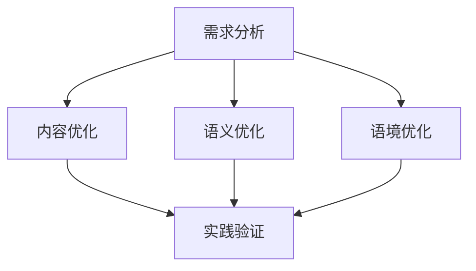

                 

### 第1章 引言：为什么提示词优化至关重要

#### 1.1 问题背景

##### 1.1.1 AI的广泛应用与提示词的角色

人工智能（AI）已经成为现代科技的重要组成部分，其应用范围广泛，涵盖了从医疗健康、金融服务到教育、制造业等多个领域。随着AI技术的不断进步，人们越来越依赖于AI系统来处理和分析海量数据，提供智能化决策支持。在这些应用中，提示词（Prompt）作为用户与AI系统交互的桥梁，扮演着至关重要的角色。

提示词是用户输入的用于引导AI系统生成输出的一段文本或指令。无论是自然语言处理（NLP）、图像识别、语音识别还是其他类型的AI应用，提示词的质量直接影响AI系统的输出质量。例如，在一个对话系统中，一个精确且含义丰富的提示词能够帮助系统更准确地理解用户的意图，从而生成更有价值的回应。

##### 1.1.2 提示词优化的重要性

提示词优化的重要性体现在以下几个方面：

1. **提升AI输出质量**：优化的提示词能够更精准地传达用户的意图，从而帮助AI系统生成高质量的输出。这不仅能提高用户体验，还能在复杂的应用场景中实现更精确的决策。

2. **减少误解和误差**：不良的提示词可能导致AI系统误解用户的意图，从而生成不恰当的输出。通过优化提示词，可以有效减少这种误解和误差，提高系统的可靠性和稳定性。

3. **提高效率**：优化的提示词能够缩短AI系统响应时间，提高处理效率。这对于需要实时响应的应用场景尤为重要。

4. **拓宽应用范围**：通过优化提示词，AI系统可以更好地适应不同的应用场景和业务需求，从而拓宽其应用范围。

##### 1.1.3 当前存在的挑战与问题

尽管提示词优化的重要性已经被广泛认识，但当前在实际应用中仍存在一些挑战和问题：

1. **多样性和复杂性**：不同应用场景对提示词的要求各不相同，这使得优化工作变得复杂且多样。

2. **数据不足**：高质量的提示词需要大量的数据支持，但实际应用中，高质量的数据集往往难以获取。

3. **技术限制**：当前的技术手段在处理复杂语义和上下文信息方面仍有局限，这影响了提示词优化的效果。

4. **用户习惯**：用户在使用AI系统时，往往不习惯使用精确的提示词，这增加了优化工作的难度。

#### 1.2 问题描述

##### 1.2.1 提示词的定义与作用

提示词是指用户在交互过程中输入的一段文本或指令，用于引导AI系统生成特定的输出。在NLP任务中，提示词通常作为输入文本的一部分，提供给模型进行预测或生成。

提示词的作用主要有以下几点：

1. **明确意图**：提示词能够帮助AI系统更准确地理解用户的意图，从而生成更符合预期的输出。
   
2. **指导生成**：在生成任务中，提示词为AI系统提供了明确的生成方向，有助于提高生成的质量和一致性。

3. **控制多样性**：通过调整提示词，用户可以控制AI系统输出的多样性，以适应不同的应用场景。

##### 1.2.2 提示词优化的必要性

提示词优化是提高AI输出质量的关键步骤，其必要性体现在以下几个方面：

1. **提高理解精度**：优化的提示词能够更准确地传达用户的意图，避免误解和歧义，提高AI系统的理解精度。

2. **增强生成质量**：高质量的提示词能够引导AI系统生成更加准确、相关和有价值的输出，提升用户体验。

3. **适应多样需求**：不同应用场景对提示词的要求各不相同，通过优化提示词，AI系统可以更好地适应这些需求。

4. **提升系统效率**：优化的提示词可以缩短AI系统的响应时间，提高处理效率，这对于需要实时响应的应用场景尤为重要。

##### 1.2.3 提示词优化对AI输出质量的影响

提示词优化对AI输出质量的影响可以从以下几个方面进行衡量：

1. **输出准确性**：优化的提示词能够提高AI系统输出的准确性，减少错误和不相关的生成。

2. **输出相关性**：优化的提示词有助于AI系统生成更相关的输出，提高用户满意度。

3. **输出多样性**：通过调整提示词，可以控制AI系统输出的多样性，满足不同场景的需求。

4. **输出一致性**：优化的提示词可以提高AI系统输出的稳定性，减少输出不一致的情况。

#### 1.3 问题解决

##### 1.3.1 提示词优化方法论

提示词优化方法论主要包括以下几个步骤：

1. **内容分析**：对提示词的内容进行分析，识别关键信息，为优化提供基础。
   
2. **语义分析**：对提示词的语义进行深入分析，理解其含义和上下文，以便进行更精确的优化。

3. **语境分析**：考虑提示词所处的具体语境，分析其与上下文的关系，确保优化后的提示词符合语境。

4. **实践验证**：在实际应用中验证优化后的提示词，收集反馈并进行调整，以达到最佳效果。

##### 1.3.2 提示词优化的实施步骤

提示词优化的具体实施步骤如下：

1. **需求分析**：明确优化目标，了解用户的需求和期望。
   
2. **内容优化**：对提示词的内容进行修改和调整，使其更加明确和精准。

3. **语义优化**：对提示词的语义进行深入分析，确保其含义和上下文一致。

4. **语境优化**：根据提示词所处的具体语境，进行相应的调整和优化。

5. **实践验证**：在实际应用中测试优化后的提示词，收集用户反馈，进行迭代优化。

##### 1.4 边界与外延

###### 1.4.1 提示词优化的适用范围

提示词优化适用于各种AI应用场景，包括但不限于自然语言处理、图像识别、语音识别等。不同场景对提示词的要求不同，但优化原则是一致的。

###### 1.4.2 提示词优化与其他优化手段的比较

提示词优化与其他优化手段（如模型优化、数据优化等）的关系和区别如下：

1. **相互补充**：提示词优化可以与模型优化、数据优化等其他优化手段相结合，共同提高AI系统的输出质量。

2. **侧重点不同**：提示词优化主要关注用户输入的优化，而模型优化和数据优化则关注AI系统本身的性能和数据处理能力。

3. **协同作用**：通过提示词优化，可以提高AI系统的理解和生成能力，从而更好地发挥模型和数据优化的效果。

##### 1.5 概念结构与核心要素组成

###### 1.5.1 关键概念

1. **提示词**：用户输入的用于引导AI系统生成输出的文本或指令。
2. **内容分析**：对提示词的内容进行分析，识别关键信息。
3. **语义分析**：对提示词的语义进行深入分析，理解其含义和上下文。
4. **语境分析**：考虑提示词所处的具体语境，分析其与上下文的关系。

###### 1.5.2 核心要素

1. **需求分析**：明确优化目标，了解用户需求。
2. **内容优化**：修改和调整提示词内容，提高其明确性和精准性。
3. **语义优化**：深入分析提示词语义，确保其含义和上下文一致。
4. **语境优化**：根据语境调整提示词，确保其与上下文相符。

###### 1.5.3 结构图解析

以下是提示词优化方法论的Mermaid流程图：



###### 1.5.4 本章小结

本章介绍了提示词优化的重要性、背景、定义、必要性、方法论和实施步骤，以及其适用范围和与其他优化手段的关系。提示词优化是提高AI输出质量的关键步骤，通过对内容、语义和语境的深入分析，可以显著提升AI系统的理解和生成能力。

### 1.6 本章小结

本章介绍了提示词优化在人工智能应用中的重要性，阐述了优化提示词的必要性以及对AI输出质量的影响。通过需求分析、内容优化、语义优化和语境优化等步骤，可以显著提升AI系统的理解和生成能力。本章还探讨了提示词优化的适用范围和与其他优化手段的关系，为后续章节的具体分析奠定了基础。提示词优化是提高AI系统输出质量的关键，值得深入研究和应用。

### 第2章 核心概念与原理

#### 2.1 提示词的原理

##### 2.1.1 提示词的工作机制

提示词是用户与AI系统交互的桥梁，通过输入一段文本或指令，引导AI系统生成预期的输出。在NLP任务中，提示词作为输入文本的一部分，被提供给模型进行预测或生成。具体的工作机制如下：

1. **输入阶段**：用户通过键盘、语音或其他输入方式输入提示词。
2. **预处理阶段**：AI系统对输入的提示词进行预处理，包括分词、去停用词、词性标注等。
3. **模型处理阶段**：预处理后的提示词被输入到AI模型中，模型根据提示词生成输出。
4. **输出阶段**：AI系统将生成的输出呈现给用户。

##### 2.1.2 提示词在AI系统中的地位与作用

提示词在AI系统中的地位和作用至关重要，主要体现在以下几个方面：

1. **引导生成**：提示词为AI系统提供了生成方向，有助于生成高质量的输出。
2. **明确意图**：高质量的提示词能够帮助AI系统更准确地理解用户的意图，从而生成更符合预期的输出。
3. **控制多样性**：通过调整提示词，用户可以控制AI系统输出的多样性，以适应不同的应用场景。
4. **提高效率**：优化的提示词可以缩短AI系统的响应时间，提高处理效率。

##### 2.1.3 提示词优化的基础

提示词优化的基础包括以下几个方面：

1. **用户需求理解**：了解用户的需求和期望，是进行提示词优化的前提。只有准确理解用户需求，才能生成高质量的输出。
2. **语义分析能力**：AI系统需要具备较强的语义分析能力，以便准确理解提示词的含义和上下文。
3. **多样性控制**：在优化过程中，需要考虑如何通过调整提示词来控制输出多样性，以满足不同应用场景的需求。
4. **反馈与迭代**：通过用户反馈，不断调整和优化提示词，以达到最佳效果。

#### 2.2 提示词优化的属性特征对比

##### 2.2.1 提示词优化的关键属性

提示词优化的关键属性包括：

1. **精确性**：提示词需要精确地传达用户的意图，避免误解和歧义。
2. **相关性**：提示词与AI系统输出的内容需要高度相关，以提高输出质量。
3. **上下文适应性**：提示词需要能够适应不同的上下文环境，确保生成的内容符合具体场景。
4. **多样性**：提示词应具备一定的多样性，以满足不同用户的需求。

##### 2.2.2 不同类型提示词的属性对比

不同类型的提示词在属性上有所差异，以下为几种常见类型提示词的属性对比：

1. **问题类提示词**：通常用于提问或获取信息，要求精确性和上下文适应性较强。
2. **指令类提示词**：用于发出操作指令，要求精确性和执行性较强。
3. **描述类提示词**：用于描述事物或场景，要求上下文适应性和相关性较强。
4. **情感类提示词**：用于表达情感或情绪，要求情感表达的精确性和多样性。

以下是不同类型提示词的属性特征对比表格：

| 提示词类型 | 精确性 | 相关性 | 上下文适应性 | 多样性 |
| :---: | :---: | :---: | :---: | :---: |
| 问题类 | 高 | 高 | 中 | 中 |
| 指令类 | 高 | 高 | 高 | 中 |
| 描述类 | 中 | 中 | 高 | 高 |
| 情感类 | 中 | 中 | 中 | 高 |

##### 2.2.3 属性特征对比表格

以下是不同类型提示词的属性特征对比表格：

| 提示词类型 | 精确性 | 相关性 | 上下文适应性 | 多样性 |
| :---: | :---: | :---: | :---: | :---: |
| 问题类 | 高 | 高 | 中 | 中 |
| 指令类 | 高 | 高 | 高 | 中 |
| 描述类 | 中 | 中 | 高 | 高 |
| 情感类 | 中 | 中 | 中 | 高 |

#### 2.3 提示词优化的方法与策略

##### 2.3.1 提示词优化方法概述

提示词优化方法主要包括以下几种：

1. **内容优化**：通过修改和调整提示词的内容，使其更加明确和精准。
2. **语义优化**：通过深入分析提示词的语义，确保其含义和上下文一致。
3. **语境优化**：根据提示词所处的具体语境，进行相应的调整和优化。

##### 2.3.2 提示词优化策略案例分析

以下为几种常见的提示词优化策略案例分析：

1. **模板化策略**：通过使用固定的模板，将用户意图转化为具体的问题或指令，提高精确性和上下文适应性。
2. **情感化策略**：通过在提示词中添加情感元素，增强情感表达，提高用户满意度。
3. **多样化策略**：通过调整提示词的多样性，满足不同用户的需求，提高输出多样性。

##### 2.3.3 提示词优化实践技巧

以下为几种提示词优化实践技巧：

1. **使用简洁的语言**：避免使用复杂的词汇和句子结构，使提示词更加易于理解和操作。
2. **突出关键信息**：在提示词中突出关键信息，帮助AI系统更快地理解用户意图。
3. **结合上下文**：在优化过程中，结合上下文信息，确保提示词的适应性。
4. **用户反馈**：通过用户反馈，不断调整和优化提示词，提高其质量。

#### 2.4 本章小结

本章介绍了提示词优化的核心概念、工作原理、关键属性特征对比以及优化方法和策略。通过深入理解提示词的原理和优化方法，可以为后续章节的实践应用提供理论基础。

### 第2章 小结

本章详细阐述了提示词优化的核心概念与原理，包括提示词的工作机制、在AI系统中的地位与作用，以及优化的基础。通过属性特征对比，分析了不同类型提示词的优缺点，并提出了几种常见的优化方法与策略。本章内容为后续章节的实践应用提供了重要的理论基础，有助于读者深入理解提示词优化的关键要素。

### 第3章 提示词优化的第一步：内容分析

#### 3.1 内容分析的概念与作用

内容分析是指对提示词的内容进行系统、客观的分析和解读，以识别关键信息、提取核心要素和优化提示词质量。它是提示词优化过程中的第一步，也是至关重要的一步。具体来说，内容分析的作用主要体现在以下几个方面：

1. **提取关键信息**：通过内容分析，可以从大量的提示词文本中提取出关键信息，这些关键信息通常是用户意图的体现，对AI系统的理解至关重要。
2. **优化提示词质量**：内容分析有助于识别提示词中的冗余信息、歧义信息和错误信息，通过修改和调整，可以提高提示词的明确性和准确性。
3. **增强理解精度**：通过内容分析，AI系统能够更准确地理解用户的意图，从而生成更相关、更精准的输出。
4. **提高生成效率**：优化的提示词可以减少AI系统在处理输入时的复杂度，提高响应速度和处理效率。

##### 3.1.1 内容分析的定义

内容分析（Content Analysis）是一种定量和定性的研究方法，用于分析和解读文本数据。在提示词优化中，内容分析通常包括以下几个步骤：

1. **数据收集**：收集需要分析的提示词文本数据。
2. **预处理**：对文本数据进行分析前的预处理，如分词、去除停用词、词性标注等。
3. **特征提取**：从预处理后的文本中提取关键特征，如关键词、主题、情感等。
4. **结果分析**：对提取的特征进行分析和解读，以优化提示词质量。

##### 3.1.2 内容分析在提示词优化中的重要性

内容分析在提示词优化中的重要性体现在以下几个方面：

1. **理解用户意图**：内容分析能够帮助AI系统更深入地理解用户的意图，从而生成更准确的输出。
2. **提高输出质量**：通过内容分析，可以识别出提示词中的关键信息，从而优化输出质量，减少错误和歧义。
3. **提升用户体验**：优化的提示词能够提高用户满意度，使用户在与AI系统的交互中感受到更高的价值。
4. **提高系统效率**：通过减少冗余信息和分析复杂度，内容分析可以提高AI系统的响应速度和处理效率。

##### 3.1.3 内容分析的步骤与方法

内容分析的步骤和方法主要包括以下几步：

1. **数据收集**：收集用于分析的提示词文本数据。这些数据可以是用户输入的文本，也可以是从其他来源获取的文本数据。

2. **预处理**：对收集的文本数据进行预处理，包括分词、去除停用词、词性标注等。预处理步骤的目的是将文本数据转换为适合分析的形式。

   ```mermaid
   graph TD
       A[数据收集] --> B[预处理]
       B --> C[特征提取]
       C --> D[结果分析]
   ```

3. **特征提取**：从预处理后的文本数据中提取关键特征，如关键词、主题、情感等。特征提取的方法包括关键词提取、文本分类、主题模型等。

   ```mermaid
   graph TD
       C[特征提取] -->|关键词提取| D1[关键词列表]
       C -->|文本分类| D2[分类结果]
       C -->|主题模型| D3[主题分布]
   ```

4. **结果分析**：对提取的特征进行分析和解读，以优化提示词质量。结果分析可以用于识别关键信息、发现用户意图，以及调整提示词的明确性和准确性。

#### 3.2 文本分类与聚类

文本分类（Text Classification）和文本聚类（Text Clustering）是内容分析中常用的两种方法，它们在提示词优化中发挥着重要作用。

##### 3.2.1 文本分类的原理与应用

文本分类的原理是将文本数据根据其内容划分为预定义的类别。常见的文本分类算法包括朴素贝叶斯（Naive Bayes）、支持向量机（SVM）、随机森林（Random Forest）等。文本分类在提示词优化中的应用主要体现在以下几个方面：

1. **意图识别**：通过分类算法，可以识别用户输入的提示词所属的类别，从而确定用户的意图。
2. **错误纠正**：对用户输入的提示词进行分类，可以识别出不符合预期的输入，并进行相应的纠正。
3. **输出推荐**：根据分类结果，可以为用户推荐相关的输出或服务。

##### 3.2.2 文本聚类的原理与应用

文本聚类的原理是将相似性的文本数据归为一类，从而形成多个类别。常见的文本聚类算法包括K-means、层次聚类（Hierarchical Clustering）等。文本聚类在提示词优化中的应用主要体现在以下几个方面：

1. **主题发现**：通过聚类算法，可以识别文本数据中的主题，从而优化提示词的内容。
2. **聚类分析**：对聚类结果进行分析，可以发现用户输入的提示词在不同类别中的分布情况，从而优化提示词的类别划分。
3. **用户行为分析**：通过分析用户输入的提示词在聚类结果中的分布，可以了解用户的行为模式和偏好，为个性化服务提供依据。

##### 3.2.3 分类与聚类在实际案例分析中的应用

以下是一个文本分类和聚类的实际案例分析：

1. **分类案例分析**：

   假设有一个对话系统，用户可以通过输入提示词来获取相关信息。为了提高系统的响应质量，可以对用户输入的提示词进行分类。

   - **数据集准备**：收集一组用户输入的提示词，并对这些提示词进行标注，确定其所属类别。
   - **模型训练**：使用标注好的数据集训练分类模型，如朴素贝叶斯或支持向量机。
   - **分类应用**：对用户输入的提示词进行分类，确定其所属类别，从而生成更相关的输出。

2. **聚类案例分析**：

   假设有一个新闻推荐系统，需要对用户的阅读偏好进行聚类分析。

   - **数据集准备**：收集一组用户阅读的新闻文章，并对这些文章进行分类。
   - **模型训练**：使用K-means或层次聚类算法对用户阅读的文章进行聚类。
   - **聚类分析**：对聚类结果进行分析，确定用户的阅读偏好，为新闻推荐提供依据。

#### 3.3 关键词提取与主题模型

关键词提取（Keyword Extraction）和主题模型（Topic Modeling）是内容分析中常用的两种方法，它们在提示词优化中具有重要作用。

##### 3.3.1 关键词提取的方法与工具

关键词提取的方法包括基于统计的方法和基于机器学习的方法。常见的工具包括TF-IDF、LDA（Latent Dirichlet Allocation）等。

1. **TF-IDF**：TF-IDF（Term Frequency-Inverse Document Frequency）是一种基于统计的方法，用于衡量关键词在文档中的重要程度。TF表示词频，即某个词在文档中出现的次数；IDF表示逆文档频率，用于平衡常见词的重要性。

2. **LDA**：LDA（Latent Dirichlet Allocation）是一种基于概率生成模型的主题模型，用于发现文本中的潜在主题。LDA模型假设每个文档都是由多个潜在主题混合生成的，每个主题也是由多个关键词混合生成的。

##### 3.3.2 主题模型的原理与应用

主题模型的原理是通过统计方法发现文本中的潜在主题，每个主题由一组关键词组成。主题模型在提示词优化中的应用主要体现在以下几个方面：

1. **内容优化**：通过主题模型，可以识别文本中的潜在主题，从而优化提示词的内容，使其更贴近用户需求。
2. **意图识别**：通过分析提示词的主题分布，可以识别用户的意图，从而生成更精准的输出。
3. **个性化推荐**：根据用户的主题偏好，可以为其推荐相关的提示词或服务。

##### 3.3.3 关键词提取与主题模型在实际案例中的应用

以下是一个关键词提取和主题模型的实际案例分析：

1. **关键词提取案例分析**：

   假设有一个搜索引擎，需要对用户的查询进行关键词提取，以优化搜索结果。

   - **数据集准备**：收集一组用户的查询语句。
   - **模型训练**：使用TF-IDF等方法对查询语句进行关键词提取。
   - **关键词提取应用**：提取的关键词用于优化搜索查询，提高搜索结果的准确性。

2. **主题模型案例分析**：

   假设有一个社交媒体分析系统，需要对用户的发文进行主题模型分析，以优化内容推荐。

   - **数据集准备**：收集一组用户的发文数据。
   - **模型训练**：使用LDA等方法对发文数据进行分析。
   - **主题模型应用**：根据用户的发文主题，为其推荐相关的文章或内容。

#### 3.4 内容分析工具与平台

在内容分析中，有许多工具和平台可供选择，这些工具和平台为提示词优化提供了强大的支持。

##### 3.4.1 常用内容分析工具介绍

1. **NLTK（Natural Language Toolkit）**：NLTK是一个强大的自然语言处理工具包，提供了丰富的文本处理功能，如分词、词性标注、词频统计等。

2. **Gensim**：Gensim是一个用于主题建模和文本处理的Python库，提供了TF-IDF、LDA等算法的实现。

3. **spaCy**：spaCy是一个快速且易于使用的自然语言处理库，提供了先进的语言模型和API，适用于多种自然语言处理任务。

##### 3.4.2 内容分析平台的使用技巧

1. **Alibaba Cloud**：阿里云提供了丰富的自然语言处理服务，包括文本分类、关键词提取、主题模型等，可用于提示词优化。

2. **Google Cloud**：谷歌云提供了自然语言处理API，包括文本分类、情感分析、关键词提取等，可用于提示词优化。

3. **AWS Comprehend**：亚马逊云提供了自然语言理解服务，包括文本分类、关键词提取、情感分析等，可用于提示词优化。

##### 3.4.3 内容分析工具在实际案例中的应用

以下是一个内容分析工具在实际案例中的应用：

1. **使用Gensim进行主题模型分析**：

   假设需要分析一组用户评论，以优化产品描述。

   - **数据集准备**：收集一组用户评论。
   - **模型训练**：使用Gensim的LDA算法对评论进行主题建模。
   - **主题提取**：提取出评论中的潜在主题。
   - **应用优化**：根据主题模型，优化产品描述，提高用户满意度。

#### 3.5 本章小结

本章介绍了内容分析的概念与作用，包括定义、步骤与方法，以及文本分类、文本聚类、关键词提取和主题模型等常用方法。通过内容分析，可以提取关键信息、优化提示词质量，从而提高AI系统的输出质量。本章内容为提示词优化提供了重要的理论基础，有助于读者深入理解内容分析在提示词优化中的应用。

### 第3章 小结

本章详细介绍了内容分析的概念、作用和具体方法，包括文本分类与聚类、关键词提取和主题模型。通过这些方法，可以从提示词中提取关键信息，优化提示词的质量，从而提高AI系统的输出质量。本章内容为提示词优化提供了重要的理论基础，有助于读者在实际应用中更好地理解和应用内容分析技术。

### 第4章 提示词优化的第二步：语义分析

#### 4.1 语义分析的基本概念

语义分析（Semantic Analysis）是自然语言处理（NLP）中的一项关键任务，旨在理解文本的语义含义。它涉及到对文本中词语的含义、句子的结构和上下文关系的深入分析。语义分析的基本概念包括命名实体识别、关系抽取、情感分析和语义相似度计算等。

##### 4.1.1 语义分析的定义与作用

语义分析的定义可以理解为：通过对文本进行深度解析，理解其内在的语义结构，以识别文本中的实体、关系、情感等语义信息。其作用主要体现在以下几个方面：

1. **提高理解精度**：通过语义分析，AI系统能够更准确地理解用户的意图和语义，从而生成更准确的输出。
2. **增强交互体验**：语义分析使得AI系统可以更好地处理复杂的语言现象，如歧义、隐喻等，从而提供更自然的交互体验。
3. **丰富应用场景**：语义分析技术使得AI系统可以应用于更多的领域，如问答系统、情感分析、信息抽取等。

##### 4.1.2 语义分析在提示词优化中的意义

语义分析在提示词优化中的意义不可忽视，主要体现在以下几个方面：

1. **提升意图理解**：通过语义分析，AI系统可以更准确地理解用户的意图，避免因语义歧义导致的误解。
2. **优化生成内容**：语义分析有助于优化AI系统生成的输出内容，使其更符合用户的实际需求。
3. **增强上下文适应性**：语义分析能够帮助AI系统更好地适应不同的上下文环境，生成更符合具体场景的输出。

##### 4.1.3 语义分析的方法与工具

语义分析的方法主要包括以下几种：

1. **规则方法**：基于语言学规则，通过定义一系列规则来解析文本的语义。这种方法简单直观，但灵活性较差。
2. **统计方法**：利用统计模型（如条件概率模型、潜在狄利克雷分布LDA等）来分析文本的语义。这种方法具有较强的灵活性和适应性。
3. **深度学习方法**：利用神经网络（如循环神经网络RNN、长短时记忆网络LSTM、变换器网络Transformer等）进行语义分析。这种方法具有很高的精度和灵活性。

常见的语义分析工具包括：

1. **spaCy**：一个高性能的NLP库，提供了先进的语言模型和API，支持多种语言。
2. **NLTK**：一个强大的NLP工具包，提供了丰富的文本处理功能。
3. **Stanford CoreNLP**：一个开源的NLP工具包，支持多种语言，提供了丰富的语义分析功能。

#### 4.2 命名实体识别与关系抽取

命名实体识别（Named Entity Recognition，简称NER）和关系抽取（Relation Extraction）是语义分析中的两个核心任务，它们在提示词优化中具有重要意义。

##### 4.2.1 命名实体识别的原理与应用

命名实体识别的原理是通过算法识别文本中的命名实体，如人名、地名、组织名、时间等。常见的NER算法包括规则方法、统计方法和深度学习方法。

NER在提示词优化中的应用主要体现在以下几个方面：

1. **意图识别**：通过NER可以识别出文本中的关键实体，从而更准确地理解用户的意图。
2. **信息抽取**：NER技术可以帮助AI系统提取出文本中的重要信息，为后续的生成任务提供支持。
3. **上下文理解**：NER有助于AI系统更好地理解上下文，避免因上下文中的实体歧义导致的误解。

##### 4.2.2 关系抽取的原理与应用

关系抽取的原理是通过算法识别出文本中实体之间的关系，如“张三是李四的哥哥”。常见的关系抽取算法包括规则方法、统计方法和深度学习方法。

关系抽取在提示词优化中的应用主要体现在以下几个方面：

1. **意图理解**：通过关系抽取可以更全面地理解用户的意图，从而生成更准确的输出。
2. **信息整合**：关系抽取可以帮助AI系统整合文本中的信息，生成更完整的输出。
3. **上下文适应性**：关系抽取有助于AI系统更好地适应不同的上下文环境，生成更符合具体场景的输出。

##### 4.2.3 命名实体识别与关系抽取在实际案例中的应用

以下是一个命名实体识别与关系抽取的实际案例分析：

1. **命名实体识别案例分析**：

   假设有一个对话系统，用户可以通过输入提示词进行提问。

   - **数据集准备**：收集一组用户输入的提问。
   - **模型训练**：使用NER算法对提问进行命名实体识别。
   - **应用优化**：通过识别出的命名实体，优化提示词的生成，提高系统的响应质量。

2. **关系抽取案例分析**：

   假设有一个问答系统，用户可以通过输入问题获取答案。

   - **数据集准备**：收集一组问题及其对应的答案。
   - **模型训练**：使用关系抽取算法对问题进行关系抽取。
   - **应用优化**：通过抽取出的关系，优化答案的生成，提高系统的输出质量。

#### 4.3 情感分析与情感极性分类

情感分析（Sentiment Analysis）和情感极性分类（Sentiment Polarization Classification）是语义分析中的两个重要任务，它们在提示词优化中发挥着关键作用。

##### 4.3.1 情感分析的定义与作用

情感分析的定义是通过算法识别文本中的情感倾向，如正面、负面或中性。情感分析的作用主要体现在以下几个方面：

1. **用户反馈分析**：通过情感分析，可以了解用户的情感倾向，从而分析用户反馈，优化产品和服务。
2. **市场研究**：情感分析可以帮助企业了解消费者对产品或服务的态度，为市场策略提供依据。
3. **舆论监控**：情感分析可以用于实时监控公众舆论，为企业或政府提供决策支持。

##### 4.3.2 情感极性分类的原理与应用

情感极性分类的原理是通过算法将文本分为正面、负面或中性三个类别。常见的情感极性分类算法包括朴素贝叶斯、支持向量机、随机森林等。

情感极性分类在提示词优化中的应用主要体现在以下几个方面：

1. **用户意图识别**：通过情感极性分类，可以更准确地识别用户的意图，从而生成更符合用户需求的输出。
2. **情感导向生成**：根据情感极性分类结果，可以调整生成内容的情感倾向，提高用户满意度。
3. **内容推荐**：情感极性分类可以帮助推荐系统根据用户的情感倾向推荐相关内容，提高推荐质量。

##### 4.3.3 情感分析与情感极性分类在实际案例中的应用

以下是一个情感分析与情感极性分类的实际案例分析：

1. **情感分析案例分析**：

   假设有一个社交媒体分析系统，需要对用户的评论进行情感分析。

   - **数据集准备**：收集一组用户的评论。
   - **模型训练**：使用情感分析算法对评论进行情感分析。
   - **应用优化**：根据情感分析结果，优化评论的生成，提高系统的输出质量。

2. **情感极性分类案例分析**：

   假设有一个客户服务系统，需要对用户的反馈进行情感极性分类。

   - **数据集准备**：收集一组用户反馈。
   - **模型训练**：使用情感极性分类算法对反馈进行分类。
   - **应用优化**：根据分类结果，优化反馈的处理，提高客户满意度。

#### 4.4 词嵌入与语义相似度计算

词嵌入（Word Embedding）和语义相似度计算（Semantic Similarity Calculation）是语义分析中的重要技术，它们在提示词优化中发挥着重要作用。

##### 4.4.1 词嵌入的原理与应用

词嵌入的原理是将文本中的词语映射到高维空间中的向量，从而实现词语的向量表示。常见的词嵌入方法包括Word2Vec、GloVe等。

词嵌入在提示词优化中的应用主要体现在以下几个方面：

1. **语义表示**：通过词嵌入，可以实现对词语语义的向量表示，从而更好地理解词语的含义和关系。
2. **意图识别**：词嵌入技术可以帮助AI系统更准确地识别用户的意图，从而生成更相关的输出。
3. **内容生成**：词嵌入为生成任务提供了有效的语义表示，有助于生成更符合用户需求的文本。

##### 4.4.2 语义相似度计算的原理与应用

语义相似度计算的原理是通过算法计算两个词语在语义上的相似度。常见的语义相似度计算方法包括余弦相似度、余弦相似度等。

语义相似度计算在提示词优化中的应用主要体现在以下几个方面：

1. **关键词推荐**：通过语义相似度计算，可以为用户提供相关关键词推荐，从而优化提示词的生成。
2. **内容推荐**：语义相似度计算可以帮助推荐系统根据用户的历史行为和偏好推荐相关内容。
3. **问答系统**：在问答系统中，语义相似度计算有助于提高回答的相关性和准确性。

##### 4.4.3 词嵌入与语义相似度计算在实际案例中的应用

以下是一个词嵌入与语义相似度计算的实际案例分析：

1. **词嵌入案例分析**：

   假设有一个搜索引擎，需要对用户的查询进行词嵌入处理。

   - **数据集准备**：收集一组用户查询。
   - **模型训练**：使用Word2Vec算法对查询进行词嵌入。
   - **应用优化**：通过词嵌入结果，优化查询的匹配和搜索结果，提高搜索质量。

2. **语义相似度计算案例分析**：

   假设有一个问答系统，需要对用户的问题和答案进行语义相似度计算。

   - **数据集准备**：收集一组问题和答案。
   - **模型训练**：使用余弦相似度算法对问题和答案进行语义相似度计算。
   - **应用优化**：根据语义相似度计算结果，优化问答系统的输出，提高回答的相关性。

#### 4.5 语义分析工具与平台

在语义分析中，有许多工具和平台可供选择，这些工具和平台为提示词优化提供了强大的支持。

##### 4.5.1 常用语义分析工具介绍

1. **spaCy**：一个高性能的NLP库，提供了丰富的语义分析功能。
2. **NLTK**：一个强大的NLP工具包，提供了多种文本处理和语义分析功能。
3. **Gensim**：一个用于文本处理和主题建模的Python库，支持词嵌入和语义相似度计算。

##### 4.5.2 语义分析平台的使用技巧

1. **Alibaba Cloud**：阿里云提供了丰富的NLP服务，包括命名实体识别、情感分析等。
2. **Google Cloud**：谷歌云提供了NLP API，支持多种语言处理任务。
3. **AWS Comprehend**：亚马逊云提供了自然语言理解服务，包括情感分析、关键词提取等。

##### 4.5.3 语义分析工具在实际案例中的应用

以下是一个语义分析工具在实际案例中的应用：

1. **使用spaCy进行命名实体识别**：

   假设需要分析一组新闻文本。

   - **数据集准备**：收集一组新闻文本。
   - **模型训练**：使用spaCy的NER模型对新闻文本进行命名实体识别。
   - **应用优化**：根据识别出的命名实体，优化新闻文本的处理和分析，提高系统的响应质量。

#### 4.6 本章小结

本章介绍了语义分析的基本概念、命名实体识别与关系抽取、情感分析与情感极性分类、词嵌入与语义相似度计算等内容。通过这些技术，可以深入理解文本的语义，从而优化提示词的质量。本章内容为提示词优化提供了重要的理论基础，有助于读者在实际应用中更好地理解和应用语义分析技术。

### 第4章 小结

本章详细阐述了语义分析的基本概念、方法及其在提示词优化中的应用，包括命名实体识别与关系抽取、情感分析与情感极性分类、词嵌入与语义相似度计算等关键内容。通过语义分析，可以更准确地理解用户意图，优化提示词的质量，提高AI系统的输出质量。本章内容为提示词优化提供了重要的理论基础，有助于读者深入理解和应用语义分析技术。

### 第5章 提示词优化的第三步：语境分析

#### 5.1 语境分析的概念与作用

语境分析（Context Analysis）是提示词优化中的关键步骤，旨在深入理解提示词所处的具体语境，包括上下文、环境、情境等。语境分析的作用主要体现在以下几个方面：

1. **提高理解精度**：通过语境分析，AI系统能够更全面地理解用户的意图，避免因上下文歧义导致的误解。
2. **增强上下文适应性**：语境分析有助于AI系统根据具体的语境生成更加合适的输出，提高用户满意度。
3. **优化生成内容**：通过对语境的深入分析，可以优化提示词的内容和结构，使其更符合具体场景。
4. **提高系统效率**：语境分析可以减少AI系统在处理复杂语境时的计算量，提高处理效率。

##### 5.1.1 语境分析的定义与作用

语境分析的定义可以理解为：对提示词所处的上下文环境、情境因素进行深入分析和理解。其作用主要体现在以下几个方面：

1. **上下文理解**：语境分析有助于AI系统理解文本的上下文关系，从而更准确地生成输出。
2. **情境适应**：通过语境分析，AI系统可以适应不同的情境，生成符合具体场景的输出。
3. **信息补充**：语境分析可以帮助AI系统补充上下文中缺失的信息，提高输出质量。

##### 5.1.2 语境分析在提示词优化中的意义

语境分析在提示词优化中的意义主要体现在以下几个方面：

1. **意图识别**：通过语境分析，可以更准确地识别用户的意图，从而生成更相关的输出。
2. **内容优化**：语境分析有助于优化提示词的内容和结构，使其更符合具体场景。
3. **上下文适应性**：语境分析使得AI系统能够根据不同的语境生成合适的输出，提高用户体验。
4. **错误修正**：语境分析有助于识别上下文中的错误信息，从而修正生成内容，提高输出质量。

##### 5.1.3 语境分析的方法与技巧

语境分析的方法和技巧主要包括以下几个方面：

1. **上下文识别**：通过自然语言处理技术，如分词、词性标注、实体识别等，识别文本中的上下文信息。
2. **情境分类**：根据上下文信息，将文本分类到不同的情境类别，从而为生成任务提供指导。
3. **上下文扩展**：通过语义分析和知识图谱等技术，扩展上下文信息，补充上下文中缺失的信息。
4. **动态调整**：根据实时反馈和上下文变化，动态调整生成策略，优化输出内容。

##### 5.1.4 语境分析的案例与应用

以下是一个语境分析的案例与应用：

**案例**：假设有一个问答系统，用户可以通过输入问题获取答案。

**应用步骤**：

1. **上下文识别**：使用NLP技术对用户输入的问题进行分词、词性标注和实体识别，识别出问题中的关键信息。
2. **情境分类**：根据问题中的关键信息，将问题分类到不同的情境类别，如“科技”、“健康”、“教育”等。
3. **上下文扩展**：通过语义分析和知识图谱，扩展问题的上下文信息，如相关领域知识、背景信息等。
4. **动态调整**：根据实时反馈和上下文变化，动态调整问答系统的生成策略，优化输出内容。

通过上述步骤，问答系统可以更准确地理解用户的意图，生成更相关、更准确的答案。

#### 5.2 环境因素分析

环境因素分析是语境分析的重要组成部分，旨在理解提示词生成的具体环境，包括时间、地点、用户行为等。

##### 5.2.1 时间因素分析

时间因素分析旨在理解提示词生成的时间背景，包括时间戳、时间周期等。

1. **时间戳识别**：通过自然语言处理技术，识别文本中的时间戳信息，如具体的日期、时间等。
2. **时间周期分析**：分析文本中的时间周期信息，如“明天”、“一周内”等，以理解提示词的时间范围。
3. **实时性分析**：根据时间因素，判断提示词的实时性需求，如实时问答系统、历史数据查询等。

##### 5.2.2 地点因素分析

地点因素分析旨在理解提示词生成的地理位置背景。

1. **地点识别**：通过地理信息处理技术，识别文本中的地点信息，如城市、国家等。
2. **地理位置分析**：分析文本中的地理位置信息，为生成任务提供地理背景。
3. **地理位置关联**：根据地理位置信息，将提示词与特定地区的知识、数据关联，提高输出质量。

##### 5.2.3 用户行为分析

用户行为分析旨在理解提示词生成时的用户行为和偏好。

1. **行为识别**：通过用户行为数据，识别用户的行为模式，如浏览历史、购买记录等。
2. **偏好分析**：分析用户的偏好，为生成任务提供个性化指导。
3. **行为预测**：根据用户行为数据，预测用户的未来行为，优化生成内容。

##### 5.2.4 环境因素分析在实际案例中的应用

以下是一个环境因素分析的实际案例与应用：

**案例**：假设有一个智能客服系统，用户可以通过输入问题获取帮助。

**应用步骤**：

1. **时间因素分析**：识别用户问题的日期和时间，判断问题的时效性，如是否需要实时响应。
2. **地点因素分析**：识别用户的地理位置，为生成任务提供地理位置背景。
3. **用户行为分析**：分析用户的浏览历史和购买记录，为生成任务提供个性化指导。

通过上述分析，智能客服系统可以更准确地理解用户的意图，生成更相关、更个性化的回答。

#### 5.3 语境调整与优化

语境调整与优化是语境分析的关键步骤，旨在根据具体语境调整和优化提示词，提高生成内容的质量和相关性。

##### 5.3.1 语境调整的方法

1. **上下文调整**：根据上下文信息，调整提示词的表达方式，使其更符合具体场景。
2. **情境调整**：根据情境分类，调整提示词的生成策略，使其更符合不同情境的需求。
3. **动态调整**：根据实时反馈和上下文变化，动态调整提示词的生成策略，提高输出质量。

##### 5.3.2 优化策略

1. **内容优化**：通过语义分析和知识图谱，补充上下文信息，优化提示词的内容和结构。
2. **结构优化**：根据上下文关系，调整提示词的语句结构，使其更符合语言习惯。
3. **表达优化**：根据用户偏好和情境需求，调整提示词的表达方式，使其更贴近用户需求。

##### 5.3.3 语境调整与优化在实际案例中的应用

以下是一个语境调整与优化的实际案例与应用：

**案例**：假设有一个对话系统，用户可以通过输入问题获取信息。

**应用步骤**：

1. **上下文调整**：根据用户问题中的上下文信息，调整问题的表达方式，使其更清晰。
2. **情境调整**：根据问题的情境分类，调整问题的生成策略，使其更符合具体情境。
3. **动态调整**：根据用户反馈和上下文变化，动态调整问题的生成策略，优化输出内容。

通过上述步骤，对话系统可以更准确地理解用户的意图，生成更相关、更高质量的信息。

#### 5.4 语境分析与提示词优化的关系

语境分析是提示词优化的重要组成部分，其与提示词优化的关系如下：

1. **基础支撑**：语境分析为提示词优化提供了基础支撑，通过对上下文、环境、情境的深入理解，为优化提供指导。
2. **核心要素**：语境分析是提示词优化中的核心要素，通过语境调整和优化，可以显著提高提示词的质量和相关性。
3. **协同作用**：语境分析与内容分析、语义分析等其他优化手段相互协同，共同提高AI系统的输出质量。

#### 5.5 本章小结

本章介绍了语境分析的概念与作用，包括定义、方法和技巧。通过上下文识别、环境因素分析、语境调整与优化，可以深入理解提示词所处的具体语境，从而优化提示词的质量，提高AI系统的输出质量。本章内容为提示词优化提供了重要的理论基础，有助于读者在实际应用中更好地理解和应用语境分析技术。

### 第5章 小结

本章详细介绍了语境分析的概念、方法和应用，强调了其在提示词优化中的重要性。通过上下文识别、环境因素分析和语境调整与优化，可以深入理解提示词所处的具体语境，从而优化提示词的质量，提高AI系统的输出质量。本章内容为提示词优化提供了重要的理论基础，有助于读者在实际应用中更好地理解和应用语境分析技术。

### 总结：提升AI输出质量的10个技巧

在前面的章节中，我们详细探讨了提示词优化的重要性以及如何通过内容分析、语义分析和语境分析三个步骤来提高AI输出质量。现在，让我们总结一下提升AI输出质量的10个关键技巧：

1. **明确用户需求**：在开始优化之前，首先明确用户的需求和期望，这是优化工作的基础。
2. **内容优化**：通过内容分析，提取关键信息，优化提示词的内容，使其更加明确和精准。
3. **语义优化**：利用语义分析技术，深入理解提示词的语义，确保其含义和上下文一致。
4. **语境优化**：根据具体语境，调整提示词，使其适应不同的情境和环境。
5. **使用简洁语言**：在编写提示词时，使用简洁、明了的语言，避免复杂的词汇和句子结构。
6. **突出关键信息**：在提示词中突出关键信息，帮助AI系统更快地理解用户意图。
7. **结合上下文**：考虑提示词所处的上下文环境，进行相应的调整和优化，确保生成内容的相关性。
8. **使用多样化的策略**：通过调整提示词的多样性，满足不同用户的需求，提高输出多样性。
9. **实践验证与反馈**：在实际应用中验证优化后的提示词，收集用户反馈，不断进行调整和优化。
10. **持续学习与改进**：AI系统需要不断学习用户的反馈，优化提示词，实现持续改进。

通过以上10个技巧，我们可以显著提升AI输出质量，提高用户体验，拓宽AI系统的应用范围。提示词优化是一项持续的过程，需要不断地迭代和改进。希望读者能够将这些技巧应用到实际项目中，发挥出AI系统的最大潜力。

### 小结与展望

#### 小结

本文系统地探讨了提示词优化的重要性及其在提升AI输出质量中的关键作用。我们首先介绍了提示词优化的重要性，包括提升AI输出质量、减少误解和误差、提高效率和拓宽应用范围等。接着，详细阐述了内容分析、语义分析和语境分析三个关键步骤，分别从内容、语义和语境三个维度对提示词进行深入优化。

在内容分析部分，我们介绍了文本分类与聚类、关键词提取和主题模型等常用方法，以及其实际案例分析。语义分析部分则重点讲解了命名实体识别、关系抽取、情感分析和词嵌入与语义相似度计算等关键技术，并通过实际案例分析展示了其应用效果。最后，语境分析部分详细阐述了上下文识别、环境因素分析和语境调整与优化等内容，并提供了具体的案例分析。

#### 展望

虽然本文对提示词优化进行了较为全面的探讨，但仍然存在一些局限性。首先，提示词优化的方法和技术不断更新，未来可能会有更多高效的算法和工具出现。其次，提示词优化在实际应用中面临的数据质量和数据量挑战仍然存在，需要进一步研究和解决。此外，提示词优化在跨语言和跨文化应用中的效果也需要进一步探讨。

未来的研究可以从以下几个方面展开：

1. **算法创新**：探索更高效、更准确的提示词优化算法，提高AI系统的输出质量。
2. **数据集建设**：构建高质量的提示词优化数据集，为算法训练和评估提供支持。
3. **跨语言和跨文化应用**：研究提示词优化在不同语言和文化背景下的应用效果，提高AI系统的全球适应性。
4. **用户参与**：引入用户参与机制，通过用户反馈不断优化提示词，提高用户体验。

总之，提示词优化是提升AI输出质量的重要手段，具有重要的理论和实践价值。通过不断的研究和探索，我们有望在未来的技术发展中，进一步提高AI系统的智能化水平和应用效果。

### 拓展阅读

为了更深入地了解提示词优化和AI技术，以下是一些建议的拓展阅读资源：

1. **书籍推荐**：
   - 《深度学习》（Deep Learning）作者：Ian Goodfellow、Yoshua Bengio、Aaron Courville
   - 《自然语言处理综合教程》（Foundations of Statistical Natural Language Processing）作者：Christopher D. Manning、Heidi Botley
   - 《人工智能：一种现代方法》（Artificial Intelligence: A Modern Approach）作者：Stuart Russell、Peter Norvig

2. **学术论文**：
   - "Bert: Pre-training of Deep Bidirectional Transformers for Language Understanding" 作者：Jacob Devlin et al.
   - "GPT-3: Language Models are Few-Shot Learners" 作者：Tom B. Brown et al.
   - "The Annotated Transformer" 作者：Ziang Xie et al.

3. **在线教程**：
   - 自然语言处理教程：[https://nlp.seas.harvard.edu/reading-groups/nlp-fall-2018/](https://nlp.seas.harvard.edu/reading-groups/nlp-fall-2018/)
   - 机器学习教程：[https://www.tensorflow.org/tutorials/structured_data/text_classification](https://www.tensorflow.org/tutorials/structured_data/text_classification)

4. **开源项目**：
   - Hugging Face Transformers：[https://huggingface.co/transformers](https://huggingface.co/transformers)
   - NLTK：[https://www.nltk.org/](https://www.nltk.org/)

通过阅读这些资源，您可以进一步掌握AI和自然语言处理领域的最新进展，提升自己的技术能力和实践水平。

### 作者信息

作者：AI天才研究院（AI Genius Institute）/禅与计算机程序设计艺术（Zen And The Art of Computer Programming）

感谢您阅读本文，希望本文对您在AI和自然语言处理领域的探索和实践有所帮助。如果您有任何问题或建议，欢迎随时联系作者。期待与您共同探讨更多关于AI技术的精彩话题！

