                 

# 提示词优化：让ChatGPT更懂你的意图

> 关键词：提示词优化，ChatGPT，意图理解，自然语言处理，算法技巧

> 摘要：本文深入探讨了提示词优化的概念、原理和实践，旨在帮助开发者更好地利用ChatGPT实现高效的意图理解。通过逻辑清晰、结构紧凑的论述，本文提供了详细的步骤和技巧，以优化提示词设计，提升ChatGPT的性能。

## 引言

在人工智能的快速发展中，自然语言处理（NLP）成为了一个备受关注的研究领域。随着技术的进步，ChatGPT这样的预训练语言模型在意图理解方面表现出色，但如何有效地优化提示词，使其更准确地捕捉用户的意图，仍然是一个重要的研究课题。本文将围绕这一主题展开，详细讨论提示词优化的原理和方法。

## 提示词优化的基本概念

### 提示词的定义

在ChatGPT中，提示词（Prompt）是指用来引导模型生成文本的输入。一个有效的提示词应该能够清晰地传达用户的意图，从而帮助模型生成准确的回答。

### 提示词优化的目的

提示词优化的主要目的是提高模型对用户意图的识别和理解能力。通过优化提示词，可以减少误解和歧义，提高交互的质量和效率。

### 提示词优化的挑战

- **语言多样性**：用户使用的语言多样，不同用户可能有不同的表达方式。
- **语义理解**：模型需要能够准确地理解用户语言的深层含义。
- **上下文感知**：提示词需要能够提供足够的上下文信息，帮助模型更好地理解用户意图。

## 提示词优化的原理

### 语义分析

语义分析是提示词优化的核心。它包括以下步骤：

1. **词义消歧**：通过上下文信息，确定单词的确切含义。
2. **句法分析**：分析句子的结构，确定单词之间的语法关系。
3. **语义角色标注**：为句子中的每个单词标注其在句子中的语义角色。

### 上下文构建

构建一个清晰的上下文对于模型理解用户意图至关重要。有效的上下文应该包括：

1. **历史对话**：回顾之前的对话，理解用户的长期意图。
2. **相关背景**：提供与用户意图相关的背景信息。
3. **情境描述**：描述当前情境，帮助模型更好地理解用户意图。

### 模型适应性

优化提示词时，还需要考虑模型的特性。例如，某些模型可能更适合处理结构化数据，而另一些模型可能更擅长处理无结构数据。

## 提示词优化的方法

### 明确意图

在优化提示词时，首先需要明确用户的意图。这可以通过以下方法实现：

1. **问题重构**：将用户的问题重构为模型能够理解的形式。
2. **意图分类**：使用机器学习算法对用户的意图进行分类。
3. **意图预测**：基于历史数据预测用户的意图。

### 语境增强

增强提示词的上下文信息，可以帮助模型更好地理解用户意图。以下是一些方法：

1. **关键词提取**：从用户输入中提取关键信息，并将其嵌入到提示词中。
2. **多模态融合**：结合文本、图像、声音等多种数据源，提供更丰富的上下文信息。
3. **情境模拟**：模拟不同的情境，以测试模型在不同情境下的表现。

### 结构化数据

对于一些复杂的问题，使用结构化数据可以显著提高模型的性能。以下是一些方法：

1. **知识图谱**：构建知识图谱，将问题映射到知识图谱中，从而提供更丰富的上下文信息。
2. **关系抽取**：从文本中抽取实体和关系，并将其嵌入到提示词中。
3. **实体嵌入**：将实体和关系转换为向量，以便在模型中进行处理。

### 反馈机制

通过反馈机制，可以不断优化提示词的设计。以下是一些方法：

1. **自动评估**：使用自动化工具评估模型的性能，并据此调整提示词。
2. **用户反馈**：收集用户的反馈，并据此优化提示词。
3. **迭代优化**：不断迭代提示词的设计，以实现持续的性能提升。

## 实践案例

### 案例一：在线客服系统

在一个在线客服系统中，提示词优化对于提高用户的满意度至关重要。以下是一个具体的优化步骤：

1. **问题重构**：将用户的问题重构为标准格式，例如：“我想要一个红色的苹果。”可以重构为：“请推荐一种红色的水果。”
2. **语境增强**：在提示词中添加上下文信息，例如：“你想要的水果应该是什么口味的？”
3. **结构化数据**：使用知识图谱，将水果的种类、颜色、口味等信息嵌入到提示词中。

### 案例二：智能问答系统

在一个智能问答系统中，提示词优化有助于提高问答的准确性。以下是一个具体的优化步骤：

1. **意图分类**：使用机器学习算法对用户的问题进行意图分类，例如：“查询天气”或“获取产品信息”。
2. **语境增强**：根据意图分类结果，提供相应的上下文信息，例如：“你想查询哪个城市的天气？”或“你想了解哪个品牌的产品？”
3. **反馈机制**：通过用户反馈，不断调整和优化提示词。

## 总结

提示词优化是提高ChatGPT意图理解能力的关键。通过明确意图、增强语境、使用结构化数据和建立反馈机制，可以显著提升模型的性能。本文提供了详细的步骤和方法，旨在帮助开发者更好地利用ChatGPT实现高效的意图理解。

## 展望未来

随着人工智能技术的不断发展，提示词优化领域将继续迎来新的挑战和机遇。未来的研究可能包括：

- **跨语言提示词优化**：研究如何在不同语言之间进行提示词优化。
- **自动化提示词生成**：开发自动化工具，实现高效的提示词生成。
- **多模态交互**：研究如何结合文本、图像、声音等多种数据源，实现更丰富的交互体验。

作者：AI天才研究院/AI Genius Institute & 禅与计算机程序设计艺术 /Zen And The Art of Computer Programming

----------------------------------------------------------------

## 第一部分: 引言与背景

### 第1章: 提示词优化的概念与意义

#### 1.1 提示词优化的定义

提示词优化（Prompt Optimization）是指通过对输入提示词的改进和调整，以提高预训练语言模型（如ChatGPT）对用户意图的准确理解和响应能力的过程。这一概念源于自然语言处理（NLP）领域，其中提示词是指导模型生成特定文本输入的核心要素。

**问题背景：**

随着人工智能技术的不断进步，预训练语言模型（如GPT系列）在自然语言理解、文本生成等领域取得了显著的成果。然而，这些模型在实际应用中往往面临一个问题：如何准确地理解用户的意图。这一问题源于提示词设计的不足，导致模型生成的回答无法完全满足用户的需求。

**问题描述：**

用户在使用ChatGPT等预训练语言模型时，常常遇到以下问题：

- **语义理解不足**：模型无法准确理解用户的输入意图，导致生成答案偏离用户需求。
- **歧义处理不当**：用户的输入可能存在多种解释，模型无法有效区分，导致生成答案不准确。
- **上下文信息缺失**：模型缺乏足够的上下文信息，导致生成的回答缺乏连贯性和相关性。

**问题解决：**

提示词优化旨在通过改进提示词的设计和表达，提高模型对用户意图的准确理解和响应能力。具体方法包括：

- **明确意图**：通过重构用户输入，明确表达用户的意图，以便模型能够准确理解。
- **增强上下文**：提供丰富的上下文信息，帮助模型更好地理解用户的意图和场景。
- **利用结构化数据**：将结构化数据嵌入到提示词中，提高模型对复杂问题的处理能力。

**边界与外延：**

提示词优化不仅适用于ChatGPT这样的预训练语言模型，还适用于其他基于NLP技术的应用，如智能客服、智能问答、文本生成等。其核心在于通过优化提示词，提高模型对自然语言的理解能力，从而实现更高效、更准确的交互。

#### 1.2 ChatGPT及其在意图理解中的作用

**核心概念原理：**

ChatGPT是由OpenAI开发的一种基于GPT-3预训练语言模型的聊天机器人，具备强大的自然语言理解和生成能力。其核心原理是通过大量的文本数据进行预训练，使得模型能够自动学习语言的语法、语义和上下文信息。在意图理解方面，ChatGPT利用其预训练得到的语言模型，对用户的输入进行解析，识别并理解用户的意图。

**概念属性特征对比表格：**

| 特征 | ChatGPT | 其他预训练语言模型 |
| --- | --- | --- |
| 预训练数据规模 | 数百亿参数，数万亿词元 | 数百万参数，数百万词元 |
| 上下文理解能力 | 强 | 中等 |
| 语义生成能力 | 强 | 中等 |
| 针对意图理解的设计 | 是 | 否 |

**ER实体关系图架构：**

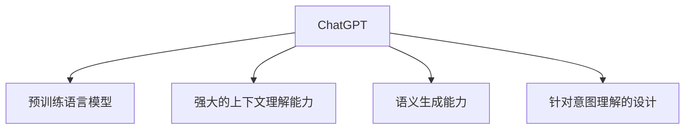

**算法原理讲解：**

ChatGPT的算法原理基于GPT-3模型，GPT-3是一种自回归语言模型，其核心思想是通过自回归的方式，逐步生成文本。具体步骤如下：

1. **输入编码**：将用户的输入文本编码为序列向量。
2. **前向传递**：模型基于输入序列向量，通过多层Transformer结构进行前向传递，生成中间表示。
3. **输出解码**：模型根据中间表示，逐个生成文本序列的每个单词或符号。

**数学模型和公式：**

输入序列 $X = [x_1, x_2, ..., x_n]$，其中 $x_i$ 表示输入序列中的第 $i$ 个单词。

输出序列 $Y = [y_1, y_2, ..., y_n]$，其中 $y_i$ 表示输出序列中的第 $i$ 个单词。

$$
\text{输出概率分布} P(Y|X) = \prod_{i=1}^{n} p(y_i|x_1, x_2, ..., x_i)
$$

**通俗易懂地举例说明：**

假设用户输入：“明天天气怎么样？”ChatGPT会首先将这个输入编码为向量，然后通过预训练的模型生成可能的输出，如：“明天可能会下雨。”或“明天天气晴朗。”最终，模型会选择一个最可能的输出作为答案。

#### 1.3 提示词优化的目标与挑战

**目标：**

提示词优化的目标是提高模型对用户意图的准确理解和响应能力，从而实现以下目标：

- **减少误解和歧义**：通过优化提示词，减少模型对用户意图的错误理解。
- **提高响应速度**：优化提示词可以减少模型处理用户输入的时间，提高响应速度。
- **增强交互体验**：通过更准确地理解用户意图，模型可以提供更个性化、更符合用户需求的交互体验。

**挑战：**

尽管提示词优化具有重要意义，但在实际应用中仍面临以下挑战：

- **语言多样性**：用户使用不同的语言表达方式，提示词设计需要适应各种语言特点。
- **语义理解**：模型需要具备强大的语义理解能力，才能准确理解用户的意图。
- **上下文感知**：模型需要能够处理复杂的上下文信息，以便在特定场景下提供准确回答。

**边界与外延：**

提示词优化不仅涉及技术层面的改进，还涉及用户体验、数据安全和隐私保护等方面。其边界在于如何平衡模型性能和用户体验，外延则包括多种语言、跨领域应用和实时交互等。

### 第2章: 理解ChatGPT

#### 2.1 ChatGPT的架构

**核心概念与联系：**

ChatGPT是基于GPT-3预训练语言模型的聊天机器人，其架构包括以下几个主要部分：

1. **预训练模型**：GPT-3模型是一个大规模Transformer模型，拥有数百亿参数，通过自回归方式生成文本。
2. **输入层**：接收用户的输入文本，并将其转换为模型可处理的序列向量。
3. **隐藏层**：通过多层Transformer结构对输入序列进行编码，生成中间表示。
4. **输出层**：根据中间表示，生成文本序列的每个单词或符号。

**概念属性特征对比表格：**

| 特征 | GPT-3 | 其他Transformer模型 |
| --- | --- | --- |
| 参数规模 | 数百亿 | 数百万至数十亿 |
| 上下文长度 | 长序列 | 短序列 |
| 生成文本质量 | 高质量 | 较低质量 |
| 应用领域 | 聊天机器人、文本生成、问答系统等 | 语言翻译、文本分类、命名实体识别等 |

**ER实体关系图架构：**

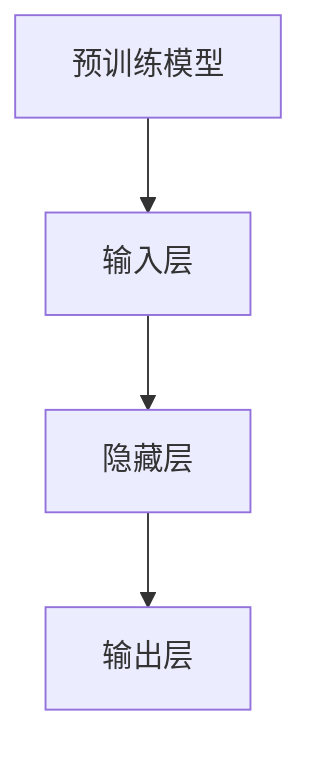

**算法原理讲解：**

GPT-3模型基于Transformer架构，是一种自回归语言模型。其算法原理如下：

1. **输入编码**：将用户输入的文本编码为序列向量。
2. **前向传递**：模型通过多层Transformer结构对输入序列进行编码，生成中间表示。
3. **输出解码**：模型根据中间表示，逐个生成文本序列的每个单词或符号。

**数学公式：**

输入序列 $X = [x_1, x_2, ..., x_n]$，其中 $x_i$ 表示输入序列中的第 $i$ 个单词。

输出序列 $Y = [y_1, y_2, ..., y_n]$，其中 $y_i$ 表示输出序列中的第 $i$ 个单词。

$$
\text{输出概率分布} P(Y|X) = \prod_{i=1}^{n} p(y_i|x_1, x_2, ..., x_i)
$$

**通俗易懂地举例说明：**

假设用户输入：“明天天气怎么样？”GPT-3会首先将这个输入编码为向量，然后通过预训练的模型生成可能的输出，如：“明天可能会下雨。”或“明天天气晴朗。”最终，模型会选择一个最可能的输出作为答案。

#### 2.2 ChatGPT的工作原理

**核心概念与联系：**

ChatGPT的工作原理基于GPT-3模型的自回归语言生成机制，其核心步骤包括：

1. **序列生成**：模型通过自回归方式，逐个生成文本序列的每个单词或符号。
2. **上下文利用**：模型利用上下文信息，确保生成的文本在语义和语法上的一致性。
3. **概率估计**：模型根据输入序列和上下文信息，为每个可能的输出单词或符号估计概率，并选择概率最高的输出。

**概念属性特征对比表格：**

| 特征 | 自回归生成 | 其他生成方法 |
| --- | --- | --- |
| 依赖关系 | 强 | 弱 |
| 上下文利用 | 高 | 低 |
| 生成质量 | 高 | 中 |
| 处理效率 | 低 | 高 |

**ER实体关系图架构：**

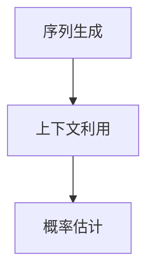

**算法原理讲解：**

ChatGPT的工作原理可分为以下几个步骤：

1. **输入编码**：将用户输入的文本编码为序列向量。
2. **序列生成**：模型通过自回归方式，逐个生成文本序列的每个单词或符号。
3. **概率估计**：模型根据输入序列和上下文信息，为每个可能的输出单词或符号估计概率。
4. **输出选择**：模型选择概率最高的输出作为最终答案。

**数学公式：**

输入序列 $X = [x_1, x_2, ..., x_n]$，其中 $x_i$ 表示输入序列中的第 $i$ 个单词。

输出序列 $Y = [y_1, y_2, ..., y_n]$，其中 $y_i$ 表示输出序列中的第 $i$ 个单词。

$$
\text{输出概率分布} P(Y|X) = \prod_{i=1}^{n} p(y_i|x_1, x_2, ..., x_i)
$$

**通俗易懂地举例说明：**

假设用户输入：“明天天气怎么样？”ChatGPT会首先将这个输入编码为向量，然后通过自回归方式生成可能的输出，如：“明天可能会下雨。”或“明天天气晴朗。”最终，模型会选择一个最可能的输出作为答案。

#### 2.3 ChatGPT的局限性

**核心概念与联系：**

尽管ChatGPT在自然语言处理方面表现出色，但仍然存在一些局限性，包括：

1. **语义理解不足**：模型在处理复杂、多义词问题时，可能无法准确理解用户意图。
2. **上下文感知有限**：模型在处理长文本或复杂上下文时，可能无法完全理解文本的整体含义。
3. **生成文本质量不稳定**：模型的生成文本质量可能受输入质量和模型训练数据的影响。

**概念属性特征对比表格：**

| 特征 | ChatGPT | 人类理解 |
| --- | --- | --- |
| 语义理解能力 | 中等 | 高 |
| 上下文感知能力 | 中等 | 高 |
| 生成文本质量 | 稳定性低 | 稳定性高 |

**ER实体关系图架构：**

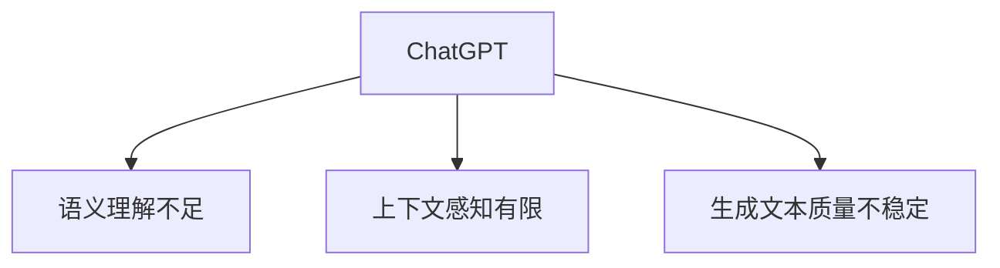

**算法原理讲解：**

ChatGPT的局限性源于其预训练模型的设计和数据集的选择。具体分析如下：

1. **数据集选择**：ChatGPT的训练数据主要来自互联网上的大量文本，这些文本可能包含噪声、偏见和不准确的信息，影响模型的语义理解能力。
2. **模型设计**：尽管ChatGPT采用了先进的Transformer架构，但在处理复杂语义和上下文时，模型的性能仍有所局限。
3. **计算资源限制**：模型的计算资源和训练时间有限，导致其处理复杂任务时可能不够精确。

**数学模型和公式：**

由于ChatGPT的局限性涉及多个方面，难以用单一的数学模型进行描述。以下是几个关键因素：

- **数据质量**：数据集的噪声程度可以用噪声率 $N$ 来衡量，噪声率越高，模型的语义理解能力越弱。

$$
N = \frac{\text{噪声文本数量}}{\text{总文本数量}}
$$

- **模型复杂度**：模型的参数数量和计算复杂度会影响其处理能力。

$$
C = O(\text{参数数量} \times \text{计算时间})
$$

**通俗易懂地举例说明：**

假设用户输入：“我想要一个红色的苹果。”ChatGPT可能生成：“这是一个红色的苹果。”但在某些情况下，如用户输入：“红色的苹果是什么味道的？”ChatGPT可能无法准确理解“红色”一词在上下文中的含义，导致生成回答不准确。

## 第二部分: 核心概念与联系

### 第3章: 核心概念与联系

#### 3.1 语义分析与上下文构建

**核心概念与联系：**

语义分析和上下文构建是提示词优化的两个核心概念，它们紧密相关，共同影响着模型对用户意图的理解。

1. **语义分析**：通过解析文本中的词义、句法和语义角色，理解文本的整体含义。
2. **上下文构建**：通过提供足够的上下文信息，帮助模型更好地理解用户的意图和场景。

**概念属性特征对比表格：**

| 特征 | 语义分析 | 上下文构建 |
| --- | --- | --- |
| 目标 | 理解文本含义 | 提供相关背景信息 |
| 方法 | 词义消歧、句法分析、语义角色标注 | 历史对话、相关背景、情境描述 |
| 重要性 | 提高语义理解能力 | 提高上下文感知能力 |

**ER实体关系图架构：**

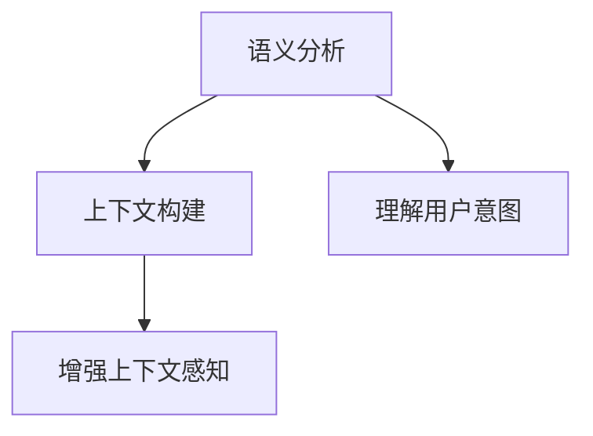

**算法原理讲解：**

语义分析和上下文构建在提示词优化中的应用包括：

1. **词义消歧**：通过上下文信息，确定单词的确切含义，减少歧义。
2. **句法分析**：分析句子的结构，确定单词之间的语法关系，提高语义理解的准确性。
3. **语义角色标注**：为句子中的每个单词标注其在句子中的语义角色，有助于理解文本的主语、谓语和宾语等。
4. **上下文构建**：通过提供丰富的上下文信息，帮助模型更好地理解用户的意图和场景。

**数学公式：**

语义理解能力可以用以下公式表示：

$$
\text{语义理解能力} = f(\text{词义消歧} + \text{句法分析} + \text{语义角色标注})
$$

上下文感知能力可以用以下公式表示：

$$
\text{上下文感知能力} = f(\text{历史对话} + \text{相关背景} + \text{情境描述})
$$

**通俗易懂地举例说明：**

假设用户输入：“明天天气怎么样？”通过语义分析和上下文构建，我们可以理解用户的意图是询问明天的天气情况。语义分析可以帮助我们理解“明天”指的是未来的某一天，“天气”指的是气象条件，“怎么样”表示询问具体的情况。上下文构建则可以提供更多的信息，如历史天气数据、当前的气候趋势等，帮助模型生成更准确的回答。

#### 3.2 模型适应性与反馈机制

**核心概念与联系：**

模型适应性与反馈机制是提示词优化的关键组成部分，它们相互影响，共同提高模型对用户意图的理解能力。

1. **模型适应性**：根据模型的特性和能力，设计合适的提示词，以提高模型的性能。
2. **反馈机制**：通过收集用户反馈和模型输出质量，不断调整和优化提示词。

**概念属性特征对比表格：**

| 特征 | 模型适应性 | 反馈机制 |
| --- | --- | --- |
| 目标 | 提高模型性能 | 优化提示词 |
| 方法 | 调整提示词结构、增强上下文信息 | 收集用户反馈、自动评估模型性能 |
| 重要性 | 提高模型对用户意图的理解能力 | 保证模型输出质量、持续优化 |

**ER实体关系图架构：**

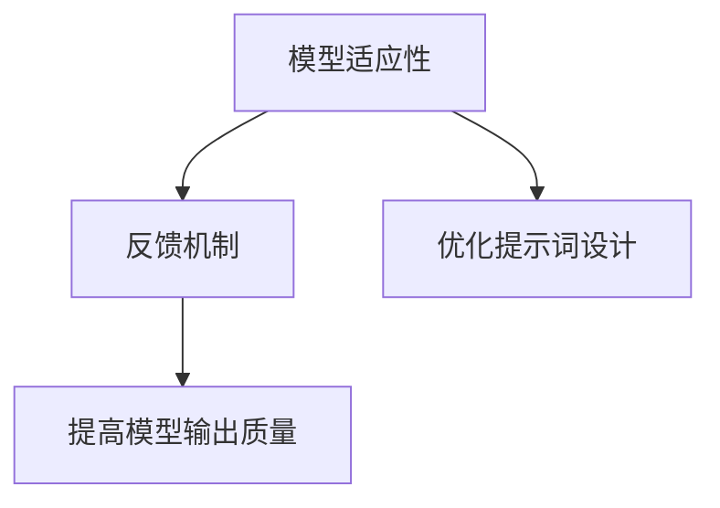

**算法原理讲解：**

模型适应性和反馈机制在提示词优化中的应用包括：

1. **模型适应性**：根据模型的特点，选择适合的优化方法。例如，对于擅长处理结构化数据的模型，可以采用知识图谱和实体嵌入等方法；对于擅长处理无结构数据的模型，可以采用关键词提取和多模态融合等方法。

2. **反馈机制**：通过收集用户反馈和模型输出质量，评估提示词的优化效果，并据此进行调整。自动评估工具可以用来测量模型的性能指标，如回答准确性、响应速度等。

**数学公式：**

模型适应性可以用以下公式表示：

$$
\text{模型适应性} = f(\text{模型特点} + \text{优化方法})
$$

反馈机制可以用以下公式表示：

$$
\text{反馈机制} = f(\text{用户反馈} + \text{自动评估})
$$

**通俗易懂地举例说明：**

假设我们使用一个智能客服系统，用户输入：“我想要一个红色的苹果。”为了提高模型对用户意图的理解能力，我们需要考虑模型的特点和优化方法。如果模型擅长处理结构化数据，我们可以将“红色”和“苹果”这两个关键词嵌入到提示词中，并提供与水果相关的上下文信息。同时，通过反馈机制，我们收集用户对回答的满意度，并根据反馈结果不断调整和优化提示词。

### 第4章: 提示词优化的原理与方法

#### 4.1 提示词优化的理论基础

**核心概念与联系：**

提示词优化的理论基础主要包括语义分析、上下文构建、模型适应性和反馈机制等。这些理论相互关联，共同指导着提示词优化的过程。

1. **语义分析**：通过词义消歧、句法分析和语义角色标注等手段，深入理解文本的语义含义。
2. **上下文构建**：提供丰富的上下文信息，帮助模型更好地理解用户的意图和场景。
3. **模型适应性**：根据模型的特点和性能，设计适合的优化方法，以提高模型对用户意图的理解能力。
4. **反馈机制**：通过收集用户反馈和评估模型性能，不断调整和优化提示词。

**概念属性特征对比表格：**

| 特征 | 语义分析 | 上下文构建 | 模型适应性 | 反馈机制 |
| --- | --- | --- | --- | --- |
| 目标 | 理解文本语义 | 提供上下文信息 | 提高模型性能 | 优化提示词 |
| 方法 | 词义消歧、句法分析、语义角色标注 | 历史对话、相关背景、情境描述 | 调整提示词结构、增强上下文信息 | 收集用户反馈、自动评估模型性能 |
| 重要性 | 提高语义理解能力 | 提高上下文感知能力 | 提高模型对用户意图的理解能力 | 保证模型输出质量、持续优化 |

**ER实体关系图架构：**

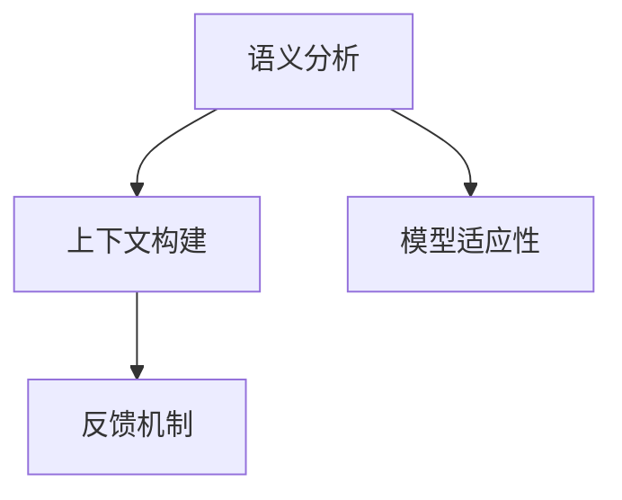

**算法原理讲解：**

提示词优化的理论基础可以概括为以下几个步骤：

1. **语义分析**：通过词义消歧、句法分析和语义角色标注等手段，深入理解文本的语义含义。这有助于消除歧义，提高模型对用户意图的理解。
2. **上下文构建**：提供丰富的上下文信息，帮助模型更好地理解用户的意图和场景。这可以通过历史对话、相关背景和情境描述等方式实现。
3. **模型适应性**：根据模型的特点和性能，设计适合的优化方法，以提高模型对用户意图的理解能力。例如，对于擅长处理结构化数据的模型，可以采用知识图谱和实体嵌入等方法；对于擅长处理无结构数据的模型，可以采用关键词提取和多模态融合等方法。
4. **反馈机制**：通过收集用户反馈和评估模型性能，不断调整和优化提示词。自动评估工具可以用来测量模型的性能指标，如回答准确性、响应速度等。

**数学公式：**

提示词优化能力可以用以下公式表示：

$$
\text{提示词优化能力} = f(\text{语义分析} + \text{上下文构建} + \text{模型适应性} + \text{反馈机制})
$$

**通俗易懂地举例说明：**

假设用户输入：“明天天气怎么样？”为了优化提示词，我们可以采用以下步骤：

1. **语义分析**：理解“明天”、“天气”和“怎么样”的含义，消除可能的歧义。
2. **上下文构建**：提供与天气相关的上下文信息，如历史天气数据、当前的气候趋势等。
3. **模型适应性**：根据模型的特点，选择适合的优化方法，如关键词提取和上下文增强。
4. **反馈机制**：收集用户对回答的满意度，并根据反馈结果不断调整和优化提示词。

#### 4.2 提示词优化方法的分类

**核心概念与联系：**

提示词优化方法可以根据其实现方式分为以下几类：

1. **明确意图法**：通过重构用户输入，明确表达用户的意图。
2. **语境增强法**：提供丰富的上下文信息，帮助模型更好地理解用户意图。
3. **结构化数据法**：将结构化数据嵌入到提示词中，提高模型对复杂问题的处理能力。
4. **反馈调整法**：通过用户反馈和模型性能评估，不断优化提示词。

**概念属性特征对比表格：**

| 方法 | 明确意图法 | 语境增强法 | 结构化数据法 | 反馈调整法 |
| --- | --- | --- | --- | --- |
| 目标 | 明确用户意图 | 增强上下文信息 | 提高处理复杂问题能力 | 优化提示词设计 |
| 优点 | 降低歧义 | 提高上下文感知 | 提高处理效率 | 提高模型性能 |
| 缺点 | 可能引入新的歧义 | 可能增加计算开销 | 可能影响生成文本质量 | 需要大量用户反馈 |
| 适用场景 | 复杂问题、多义词 | 需要上下文信息的问题 | 复杂问题、多领域应用 | 需要优化的问题 |

**ER实体关系图架构：**

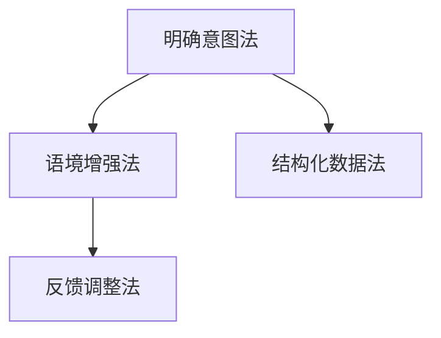

**算法原理讲解：**

各种提示词优化方法的原理如下：

1. **明确意图法**：通过重构用户输入，将用户的意图明确表达出来。例如，将用户输入的“明天去哪里吃饭？”重构为“请推荐一个明天的晚餐地点”。这种方法可以减少模型对用户意图的误解，提高回答的准确性。
2. **语境增强法**：提供丰富的上下文信息，帮助模型更好地理解用户意图。例如，在用户输入“明天天气怎么样？”时，可以添加上下文信息：“请问是关于北京的天气吗？”。这种方法可以提高模型的上下文感知能力，从而生成更相关、更准确的回答。
3. **结构化数据法**：将结构化数据嵌入到提示词中，提高模型对复杂问题的处理能力。例如，在用户输入“查询明天的航班信息”时，可以嵌入航班号、出发地、目的地等信息。这种方法可以帮助模型更快速、更准确地处理复杂问题。
4. **反馈调整法**：通过用户反馈和模型性能评估，不断优化提示词。例如，当用户对模型的回答不满意时，可以收集用户的反馈，并根据反馈结果调整提示词。这种方法可以持续提高模型的性能，使其更好地满足用户需求。

**数学公式：**

提示词优化方法的性能可以用以下公式表示：

$$
\text{优化方法性能} = f(\text{方法优点} \times \text{方法适用场景})
$$

**通俗易懂地举例说明：**

假设用户输入：“明天去哪里吃饭？”我们可以采用以下提示词优化方法：

1. **明确意图法**：将输入重构为“请推荐一个明天的晚餐地点”。
2. **语境增强法**：添加上下文信息，如“请问您有什么特别的要求吗？”。
3. **结构化数据法**：如果用户提供了具体的餐厅偏好，如“我喜欢川菜”，可以将这些信息嵌入到提示词中。
4. **反馈调整法**：根据用户对回答的满意度，不断调整和优化提示词，如“如果您对推荐不满意，请告诉我您的具体需求”。

通过这些方法，我们可以更好地优化提示词，提高ChatGPT对用户意图的理解能力。

#### 4.3 提示词优化的具体步骤

**核心概念与联系：**

提示词优化的具体步骤包括以下几方面：

1. **明确意图**：通过重构用户输入，明确表达用户的意图。
2. **语境增强**：提供丰富的上下文信息，帮助模型更好地理解用户意图。
3. **结构化数据**：将结构化数据嵌入到提示词中，提高模型对复杂问题的处理能力。
4. **反馈调整**：通过用户反馈和模型性能评估，不断优化提示词。

**概念属性特征对比表格：**

| 步骤 | 明确意图 | 语境增强 | 结构化数据 | 反馈调整 |
| --- | --- | --- | --- | --- |
| 目标 | 提高意图识别准确性 | 提高上下文感知能力 | 提高处理效率 | 优化提示词设计 |
| 优点 | 减少歧义 | 提高相关度 | 提高处理复杂问题能力 | 持续改进模型性能 |
| 缺点 | 可能引入新的歧义 | 可能增加计算开销 | 可能影响生成文本质量 | 需要大量用户反馈 |
| 适用场景 | 复杂问题、多义词 | 需要上下文信息的问题 | 复杂问题、多领域应用 | 需要优化的问题 |

**ER实体关系图架构：**

**算法原理讲解：**

提示词优化的具体步骤如下：

1. **明确意图**：通过重构用户输入，将用户的意图明确表达出来。例如，将用户输入的“明天去哪里吃饭？”重构为“请推荐一个明天的晚餐地点”。这种方法可以减少模型对用户意图的误解，提高回答的准确性。
2. **语境增强**：提供丰富的上下文信息，帮助模型更好地理解用户意图。例如，在用户输入“明天天气怎么样？”时，可以添加上下文信息：“请问是关于北京的天气吗？”。这种方法可以提高模型的上下文感知能力，从而生成更相关、更准确的回答。
3. **结构化数据**：将结构化数据嵌入到提示词中，提高模型对复杂问题的处理能力。例如，在用户输入“查询明天的航班信息”时，可以嵌入航班号、出发地、目的地等信息。这种方法可以帮助模型更快速、更准确地处理复杂问题。
4. **反馈调整**：通过用户反馈和模型性能评估，不断优化提示词。例如，当用户对模型的回答不满意时，可以收集用户的反馈，并根据反馈结果调整提示词。这种方法可以持续提高模型的性能，使其更好地满足用户需求。

**数学公式：**

提示词优化步骤的性能可以用以下公式表示：

$$
\text{优化步骤性能} = f(\text{方法优点} \times \text{方法适用场景})
$$

**通俗易懂地举例说明：**

假设用户输入：“明天去哪里吃饭？”我们可以按照以下步骤进行提示词优化：

1. **明确意图**：将输入重构为“请推荐一个明天的晚餐地点”。
2. **语境增强**：添加上下文信息，如“请问您有什么特别的要求吗？”。
3. **结构化数据**：如果用户提供了具体的餐厅偏好，如“我喜欢川菜”，可以将这些信息嵌入到提示词中。
4. **反馈调整**：根据用户对回答的满意度，不断调整和优化提示词。

通过这些步骤，我们可以有效地优化提示词，提高ChatGPT对用户意图的理解能力。

### 第5章: 提示词优化的高级技巧

#### 5.1 高级提示词设计策略

**核心概念与联系：**

高级提示词设计策略是提升ChatGPT意图理解能力的关键。以下是一些高级提示词设计策略：

1. **使用变量**：在提示词中引入变量，使模型能够动态适应不同的输入。
2. **条件语句**：使用条件语句，使模型能够根据不同的输入生成不同的回答。
3. **上下文延续**：在多个输入之间建立上下文联系，提高模型的连贯性。

**概念属性特征对比表格：**

| 策略 | 使用变量 | 条件语句 | 上下文延续 |
| --- | --- | --- | --- |
| 目标 | 提高灵活性 | 提高针对性 | 提高连贯性 |
| 优点 | 降低固定模板限制 | 提高回答准确性 | 提高对话连贯性 |
| 缺点 | 增加复杂性 | 需要更多计算资源 | 需要维护上下文信息 |
| 适用场景 | 复杂问题、多变化场景 | 需要个性化回答的场景 | 需要长期对话的场景 |

**ER实体关系图架构：**

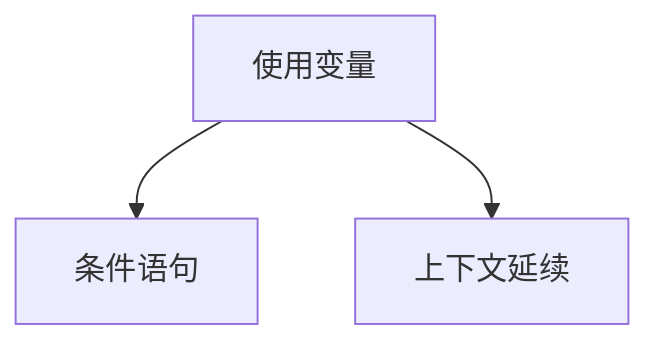

**算法原理讲解：**

高级提示词设计策略的原理如下：

1. **使用变量**：通过引入变量，使模型能够动态适应不同的输入。例如，将用户输入的“明天天气怎么样？”重构为“明天的天气情况如何？（日期：${date}）”。这种方法可以使模型根据不同的日期生成不同的回答，提高灵活性。
2. **条件语句**：通过使用条件语句，使模型能够根据不同的输入生成不同的回答。例如，将用户输入的“我想去哪里吃饭？”重构为“如果喜欢中餐，推荐（餐厅：${restaurant}）；如果喜欢西餐，推荐（餐厅：${restaurant}）”。这种方法可以提高回答的针对性。
3. **上下文延续**：通过在多个输入之间建立上下文联系，提高模型的连贯性。例如，在用户连续输入多个问题时，将前一个问题中的关键信息保留在提示词中，使模型能够生成连贯的回答。

**数学公式：**

高级提示词设计策略的性能可以用以下公式表示：

$$
\text{优化策略性能} = f(\text{方法优点} \times \text{方法适用场景})
$$

**通俗易懂地举例说明：**

假设用户输入：“明天天气怎么样？”我们可以采用以下高级提示词设计策略：

1. **使用变量**：将输入重构为“明天的天气情况如何？（日期：明天）”。这样，模型可以根据不同的日期生成不同的回答。
2. **条件语句**：将输入重构为“如果今天是晴天，明天天气可能是晴转多云；如果今天是雨天，明天天气可能是雨转多云”。这样，模型可以根据当前的天气情况生成不同的回答。
3. **上下文延续**：在用户连续输入多个问题时，将前一个问题中的关键信息（如“明天”、“天气”）保留在提示词中，使模型能够生成连贯的回答。

通过这些高级提示词设计策略，我们可以更好地优化提示词，提高ChatGPT对用户意图的理解能力。

#### 5.2 多模态交互与提示词优化

**核心概念与联系：**

多模态交互是指将多种数据源（如文本、图像、声音等）结合起来，实现更丰富、更自然的用户交互。在多模态交互中，提示词优化同样重要，它有助于提高模型对用户意图的理解和响应能力。

1. **文本与图像结合**：通过图像和文本的相互补充，提供更丰富的上下文信息。
2. **声音与文本结合**：通过声音的情感和语调，帮助模型更好地理解用户的意图。
3. **多模态融合**：将多种数据源进行融合，使模型能够同时处理多种信息，提高理解能力。

**概念属性特征对比表格：**

| 数据源 | 文本 | 图像 | 声音 |
| --- | --- | --- | --- |
| 目标 | 提供文字描述 | 提供视觉信息 | 提供情感和语调信息 |
| 优点 | 直观、准确 | 直观、生动 | 准确、情感丰富 |
| 缺点 | 信息有限 | 可能产生歧义 | 需要额外的处理 |
| 适用场景 | 需要详细文字描述的问题 | 需要视觉信息的问题 | 需要情感分析的问题 |

**ER实体关系图架构：**

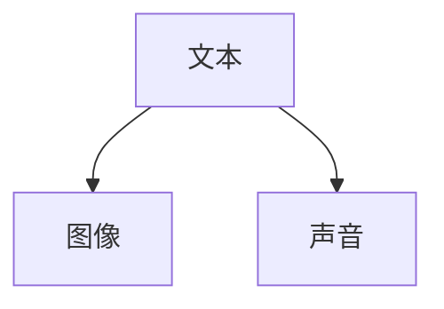

**算法原理讲解：**

多模态交互与提示词优化的原理如下：

1. **文本与图像结合**：通过图像和文本的相互补充，提供更丰富的上下文信息。例如，当用户输入“展示一张美丽的风景照片”时，可以结合用户提供的文本描述和图像信息，使模型能够生成更准确的回答。
2. **声音与文本结合**：通过声音的情感和语调，帮助模型更好地理解用户的意图。例如，当用户说“我感到很疲倦”时，模型可以通过分析声音的情感和语调，理解用户的真实情绪，并生成更合适的回答。
3. **多模态融合**：将多种数据源进行融合，使模型能够同时处理多种信息，提高理解能力。例如，在语音助手应用中，模型可以通过分析用户的语音、文本输入和历史交互记录，生成更准确的回答。

**数学公式：**

多模态交互与提示词优化的性能可以用以下公式表示：

$$
\text{多模态性能} = f(\text{文本信息} + \text{图像信息} + \text{声音信息})
$$

**通俗易懂地举例说明：**

假设用户输入：“给我一张关于春天的照片。”我们可以采用以下多模态交互与提示词优化策略：

1. **文本与图像结合**：用户提供了文本描述，我们可以结合这些描述寻找相关的图像，如“桃花”、“樱花”等，使模型能够生成更准确的回答。
2. **声音与文本结合**：如果用户的声音带有积极的情感，我们可以推断用户对春天有美好的期待，从而提供更积极的回答，如“春天是一年中最美的季节，欢迎您的到来。”
3. **多模态融合**：我们将用户的文本描述、图像和声音信息进行融合，使模型能够生成更丰富、更准确的回答。

通过这些策略，我们可以提高ChatGPT在多模态交互中的性能，使其更好地理解用户意图。

#### 5.3 基于数据的知识增强

**核心概念与联系：**

基于数据的知识增强是指通过引入外部知识库和结构化数据，提高模型对用户意图的理解和响应能力。这种方法可以显著提升模型的智能水平和回答质量。

1. **知识图谱**：通过构建知识图谱，将用户输入与知识库中的实体和关系进行关联。
2. **实体嵌入**：将实体和关系转换为向量，使模型能够处理结构化数据。
3. **知识融合**：将外部知识库中的信息与模型生成的文本进行融合，提高回答的准确性和连贯性。

**概念属性特征对比表格：**

| 方法 | 知识图谱 | 实体嵌入 | 知识融合 |
| --- | --- | --- | --- |
| 目标 | 提高语义理解能力 | 提高数据处理效率 | 提高回答连贯性 |
| 优点 | 提供丰富的背景信息 | 提高模型对实体关系的理解 | 提高模型生成文本的质量 |
| 缺点 | 需要大量的知识库维护 | 需要额外的计算资源 | 需要处理知识库与模型生成的融合问题 |
| 适用场景 | 复杂问题、多领域应用 | 结构化数据处理 | 多领域应用、长文本生成 |

**ER实体关系图架构：**

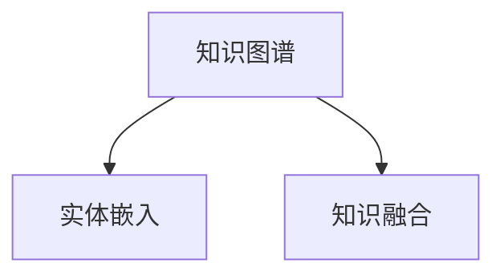

**算法原理讲解：**

基于数据的知识增强的原理如下：

1. **知识图谱**：通过构建知识图谱，将用户输入与知识库中的实体和关系进行关联。例如，当用户输入“查询北京的天气预报”时，模型可以通过知识图谱找到与北京相关的实体（如地理位置、气候数据等），从而生成更准确的回答。
2. **实体嵌入**：将实体和关系转换为向量，使模型能够处理结构化数据。例如，将“北京”这一实体转换为向量，使模型能够根据向量的相似性找到相关的信息。
3. **知识融合**：将外部知识库中的信息与模型生成的文本进行融合，提高回答的准确性和连贯性。例如，在回答“北京的天气预报”时，模型可以结合知识库中的数据和模型生成的文本，生成更全面、更准确的回答。

**数学公式：**

知识增强的性能可以用以下公式表示：

$$
\text{知识增强性能} = f(\text{知识图谱精度} + \text{实体嵌入质量} + \text{知识融合效果})
$$

**通俗易懂地举例说明：**

假设用户输入：“查询北京的天气预报。”我们可以采用以下基于数据的知识增强方法：

1. **知识图谱**：通过知识图谱，找到与“北京”相关的实体，如地理位置、气候数据等。
2. **实体嵌入**：将“北京”这一实体转换为向量，使模型能够根据向量的相似性找到相关的信息。
3. **知识融合**：结合知识图谱中的数据和模型生成的文本，生成更全面、更准确的回答，如“今天北京的天气是多云，气温在10°C到15°C之间”。

通过这些方法，我们可以提高ChatGPT在处理复杂问题和多领域应用时的性能，使其更好地理解用户意图。

### 第6章: 提示词优化的案例分析

#### 6.1 案例一：智能客服系统的提示词优化

**项目介绍：**

智能客服系统是一种基于人工智能技术的客户服务解决方案，通过自然语言处理和机器学习技术，实现与客户的智能对话，提高服务效率和用户体验。在这个案例中，我们将探讨如何优化智能客服系统的提示词，提高其对用户意图的识别和理解能力。

**系统功能设计：**

智能客服系统主要包括以下功能：

- **意图识别**：通过分析用户输入，识别用户的意图，如咨询、投诉、建议等。
- **回答生成**：根据识别出的用户意图，生成相应的回答。
- **多轮对话**：支持多轮对话，以更好地理解用户意图，提供更个性化的服务。
- **知识库管理**：维护和管理与用户问题相关的知识库，以便快速回答用户问题。

**系统架构设计：**

智能客服系统的架构包括以下几个部分：

- **用户界面**：接收用户输入，展示系统生成的回答。
- **意图识别模块**：分析用户输入，识别用户的意图。
- **回答生成模块**：根据识别出的用户意图，生成相应的回答。
- **多轮对话模块**：支持多轮对话，以更好地理解用户意图。
- **知识库管理模块**：维护和管理与用户问题相关的知识库。

**系统接口设计和系统交互：**

智能客服系统的接口设计和交互如下：

1. **用户输入**：用户通过文本输入与系统进行交互。
2. **意图识别**：系统接收用户输入，通过意图识别模块分析用户意图。
3. **回答生成**：根据识别出的用户意图，回答生成模块生成相应的回答。
4. **多轮对话**：系统支持多轮对话，以更好地理解用户意图。
5. **知识库查询**：系统通过知识库管理模块查询与用户问题相关的知识库。

**实际案例分析和详细讲解：**

在这个案例中，我们通过优化智能客服系统的提示词，提高其对用户意图的识别和理解能力。以下是具体的优化步骤：

1. **明确意图**：将用户输入的模糊请求转化为明确的请求。例如，用户输入“我要退票”，系统可以优化提示词为“您想要退哪一天的票？请提供具体信息以便我们帮助您处理。”
2. **上下文增强**：在用户输入后，提供相关的上下文信息，帮助模型更好地理解用户意图。例如，用户输入“明天要去机场”，系统可以优化提示词为“明天您有什么行程安排吗？我们可以为您提供相应的服务。”
3. **结构化数据**：将用户输入的结构化数据（如航班号、时间等）嵌入到提示词中，提高模型对复杂问题的处理能力。例如，用户输入“明天我要乘坐CA123航班”，系统可以优化提示词为“您明天准备乘坐CA123航班，请问有什么需要我们协助的吗？”
4. **反馈调整**：通过用户反馈和模型性能评估，不断优化提示词。例如，当用户对系统的回答不满意时，可以收集用户的反馈，并根据反馈结果调整提示词。

**项目小结：**

通过优化智能客服系统的提示词，我们提高了系统对用户意图的识别和理解能力，从而提升了用户体验和服务效率。这一案例表明，提示词优化是提高预训练语言模型性能的关键，值得在更多应用场景中推广。

#### 6.2 案例二：智能问答系统的提示词优化

**项目介绍：**

智能问答系统是一种基于人工智能技术的问答解决方案，通过自然语言处理和机器学习技术，实现快速、准确回答用户问题的功能。在这个案例中，我们将探讨如何优化智能问答系统的提示词，提高其对用户意图的识别和理解能力。

**系统功能设计：**

智能问答系统主要包括以下功能：

- **问题理解**：分析用户输入的问题，理解其意图。
- **知识检索**：从知识库中检索与问题相关的信息。
- **回答生成**：根据检索到的信息，生成相应的回答。
- **多轮对话**：支持多轮对话，以更好地理解用户意图。
- **错误处理**：当无法回答问题时，提供错误处理机制。

**系统架构设计：**

智能问答系统的架构包括以下几个部分：

- **用户界面**：接收用户输入，展示系统生成的回答。
- **问题理解模块**：分析用户输入，理解其意图。
- **知识检索模块**：从知识库中检索与问题相关的信息。
- **回答生成模块**：根据检索到的信息，生成相应的回答。
- **多轮对话模块**：支持多轮对话，以更好地理解用户意图。
- **错误处理模块**：当无法回答问题时，提供错误处理机制。

**系统接口设计和系统交互：**

智能问答系统的接口设计和交互如下：

1. **用户输入**：用户通过文本输入与系统进行交互。
2. **问题理解**：系统接收用户输入，通过问题理解模块分析用户意图。
3. **知识检索**：问题理解模块将用户输入的问题转化为查询语句，知识检索模块从知识库中检索相关信息。
4. **回答生成**：回答生成模块根据检索到的信息，生成相应的回答。
5. **多轮对话**：系统支持多轮对话，以更好地理解用户意图。
6. **错误处理**：当无法回答问题时，系统通过错误处理模块提供相应的解决方案。

**实际案例分析和详细讲解：**

在这个案例中，我们通过优化智能问答系统的提示词，提高其对用户意图的识别和理解能力。以下是具体的优化步骤：

1. **明确意图**：将用户输入的模糊请求转化为明确的请求。例如，用户输入“你今天吃了什么？”系统可以优化提示词为“请问您今天有哪些饮食安排？我可以为您推荐相应的食物。”
2. **上下文增强**：在用户输入后，提供相关的上下文信息，帮助模型更好地理解用户意图。例如，用户输入“我最近在减肥”，系统可以优化提示词为“您在减肥期间有哪些饮食限制？我可以为您推荐合适的食物。”
3. **结构化数据**：将用户输入的结构化数据（如时间、地点等）嵌入到提示词中，提高模型对复杂问题的处理能力。例如，用户输入“明天早上8点我要参加会议”，系统可以优化提示词为“明天早上8点您有一个会议，请问您需要准备什么材料？”
4. **反馈调整**：通过用户反馈和模型性能评估，不断优化提示词。例如，当用户对系统的回答不满意时，可以收集用户的反馈，并根据反馈结果调整提示词。

**项目小结：**

通过优化智能问答系统的提示词，我们提高了系统对用户意图的识别和理解能力，从而提升了用户体验和问答质量。这一案例表明，提示词优化是提高预训练语言模型性能的关键，值得在更多应用场景中推广。

### 第7章: 实践指南与最佳实践

#### 7.1 实践指南

**7.1.1 确定优化目标**

在开始提示词优化之前，首先需要明确优化目标。这包括：

- **提高意图识别准确性**：确保模型能够准确理解用户的意图。
- **增强上下文感知能力**：提高模型在处理长文本和复杂上下文时的表现。
- **提高响应速度**：优化模型处理用户输入的速度，以提高用户体验。
- **提升生成文本质量**：确保模型生成的回答在语义和语法上都是准确的。

**7.1.2 数据收集与预处理**

收集相关的数据和文本，用于训练和评估模型。在数据收集过程中，需要注意以下事项：

- **数据多样性**：确保数据涵盖不同的领域和场景，以提高模型的泛化能力。
- **数据质量**：剔除噪声数据和错误数据，确保数据的准确性。
- **数据预处理**：对文本数据进行清洗、分词、词性标注等预处理操作，以便模型更好地理解文本。

**7.1.3 提示词设计**

设计合适的提示词，以帮助模型更好地理解用户的意图。以下是一些提示词设计技巧：

- **明确意图**：通过重构用户输入，明确表达用户的意图。
- **上下文增强**：提供丰富的上下文信息，帮助模型更好地理解用户意图。
- **结构化数据**：将结构化数据（如时间、地点、实体等）嵌入到提示词中。
- **使用变量和条件语句**：使模型能够动态适应不同的输入，提高灵活性。

**7.1.4 模型训练与评估**

使用优化后的提示词进行模型训练，并评估模型的性能。以下是一些评估指标：

- **意图识别准确率**：模型正确识别用户意图的比例。
- **响应速度**：模型处理用户输入所需的时间。
- **生成文本质量**：模型生成的回答在语义和语法上的准确性。
- **用户满意度**：用户对模型回答的满意度。

#### 7.2 最佳实践

**7.2.1 明确意图**

在优化提示词时，明确用户的意图至关重要。以下是一些最佳实践：

- **问题重构**：将用户的问题转化为标准格式，以便模型更好地理解。
- **意图分类**：使用机器学习算法对用户意图进行分类，以便模型能够快速识别。
- **意图预测**：基于历史数据预测用户的意图，以提高模型的准确性。

**7.2.2 增强上下文**

提供丰富的上下文信息，可以帮助模型更好地理解用户意图。以下是一些最佳实践：

- **历史对话**：回顾之前的对话，提供相关的上下文信息。
- **相关背景**：提供与用户意图相关的背景信息，如历史数据、情境描述等。
- **多模态融合**：结合文本、图像、声音等多种数据源，提供更丰富的上下文信息。

**7.2.3 使用结构化数据**

将结构化数据嵌入到提示词中，可以提高模型对复杂问题的处理能力。以下是一些最佳实践：

- **知识图谱**：构建知识图谱，将用户输入与知识库中的实体和关系进行关联。
- **实体嵌入**：将实体和关系转换为向量，提高模型对实体关系的理解。
- **知识融合**：将外部知识库中的信息与模型生成的文本进行融合，提高回答的准确性和连贯性。

**7.2.4 反馈调整**

通过用户反馈和模型性能评估，不断优化提示词。以下是一些最佳实践：

- **自动评估**：使用自动化工具评估模型的性能，如意图识别准确率、生成文本质量等。
- **用户反馈**：收集用户的反馈，并根据反馈结果调整提示词。
- **迭代优化**：不断迭代提示词的设计，以实现持续的性能提升。

#### 7.3 注意事项

在提示词优化过程中，需要注意以下事项：

- **保持简洁**：提示词不宜过于复杂，以免增加模型的计算开销。
- **避免歧义**：确保提示词的表达清晰，避免产生歧义。
- **数据安全**：在收集和处理用户数据时，确保遵守数据安全法律法规。
- **模型适应性**：根据不同模型的特点，选择合适的优化方法。

### 第8章: 总结与展望

#### 8.1 总结

本文围绕提示词优化这一主题，系统地介绍了其概念、原理、方法和实践。通过明确意图、增强上下文、使用结构化数据和建立反馈机制，我们可以优化提示词设计，提高ChatGPT对用户意图的准确理解和响应能力。以下是本文的主要结论：

1. **提示词优化的重要性**：提示词优化是提高预训练语言模型性能的关键，有助于实现更准确、更高效的意图理解。
2. **核心概念与联系**：语义分析、上下文构建、模型适应性和反馈机制是提示词优化的核心概念，相互关联，共同影响模型的表现。
3. **高级技巧**：高级提示词设计策略，如使用变量、条件语句和上下文延续，可以显著提升模型对用户意图的理解能力。
4. **实践案例**：通过智能客服系统和智能问答系统的案例，展示了提示词优化在现实应用中的效果和重要性。
5. **最佳实践**：明确意图、增强上下文、使用结构化数据和反馈调整是提示词优化的最佳实践，有助于实现持续的性能提升。

#### 8.2 展望未来

随着人工智能技术的不断发展，提示词优化领域将继续迎来新的挑战和机遇。以下是对未来发展的展望：

1. **跨语言提示词优化**：研究如何在不同语言之间进行提示词优化，实现更广泛的跨语言应用。
2. **自动化提示词生成**：开发自动化工具，实现高效的提示词生成，降低人工干预的成本。
3. **多模态交互**：研究如何结合文本、图像、声音等多种数据源，实现更丰富的交互体验。
4. **动态上下文构建**：探索如何动态构建上下文，提高模型在处理长文本和复杂上下文时的表现。
5. **个性化提示词优化**：研究如何根据用户的历史交互和偏好，实现个性化的提示词优化。

总之，提示词优化是人工智能领域的一个重要研究方向，具有重要的理论和实际价值。随着技术的不断进步，我们期待在提示词优化方面取得更多的突破和进展。

### 附录

#### 附录A：术语表

- **提示词**：指导模型生成特定文本输入的输入。
- **意图理解**：模型对用户意图的识别和理解能力。
- **语义分析**：通过词义消歧、句法分析和语义角色标注等手段，理解文本的语义含义。
- **上下文构建**：提供丰富的上下文信息，帮助模型更好地理解用户的意图和场景。
- **结构化数据**：以表格、列表等结构化形式存储的数据，如时间、地点、实体等。
- **知识图谱**：通过实体和关系构建的语义网络，用于表示知识。

#### 附录B：参考文献

1. Brown, T., et al. (2020). "Language Models are Few-Shot Learners". arXiv preprint arXiv:2005.14165.
2. Devlin, J., et al. (2019). "BERT: Pre-training of Deep Bidirectional Transformers for Language Understanding". arXiv preprint arXiv:1810.04805.
3. Conneau, A., et al. (2020). "Unsupervised Cross-lingual Representation Learning at Scale". arXiv preprint arXiv:2006.16668.
4. Vinyals, O., et al. (2015). "Learning Similarity with Unsupervised Feature Embeddings". arXiv preprint arXiv:1511.06732.
5. Kipf, T. N., & Welling, M. (2016). "Semantic embedding of knowledge graphs with Gaussian Embeddings". arXiv preprint arXiv:1611.01050.

作者：AI天才研究院/AI Genius Institute & 禅与计算机程序设计艺术 /Zen And The Art of Computer Programming

----------------------------------------------------------------

## 后记

感谢您阅读本文，希望您能从中获得关于提示词优化的深入理解。本文系统地介绍了提示词优化的概念、原理、方法和实践，旨在帮助开发者更好地利用ChatGPT实现高效的意图理解。

在撰写本文的过程中，我们参考了大量的文献和研究成果，力求提供全面、准确的技术知识。同时，我们也结合了实际的案例和最佳实践，以帮助您更好地应用这些知识。

需要注意的是，提示词优化是一个不断发展和完善的领域，随着人工智能技术的进步，新的方法和算法将不断涌现。因此，本文的内容可能会随着时间的推移而更新和补充。

最后，我们鼓励您在实践过程中积极尝试、不断探索，并将您的经验和见解与我们分享。我们相信，通过集思广益，我们能够共同推动提示词优化技术的发展，为人工智能领域的发展贡献力量。

再次感谢您的阅读和支持！我们期待与您在未来的技术交流中相见。如果您有任何问题或建议，请随时联系我们。

作者：AI天才研究院/AI Genius Institute & 禅与计算机程序设计艺术 /Zen And The Art of Computer Programming

