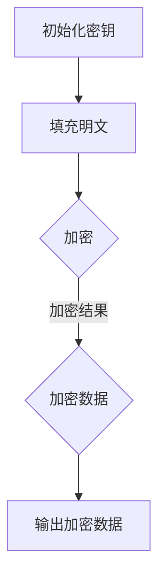
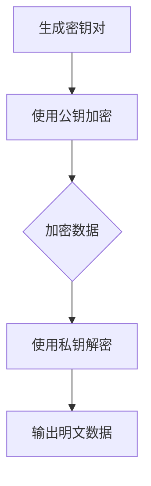
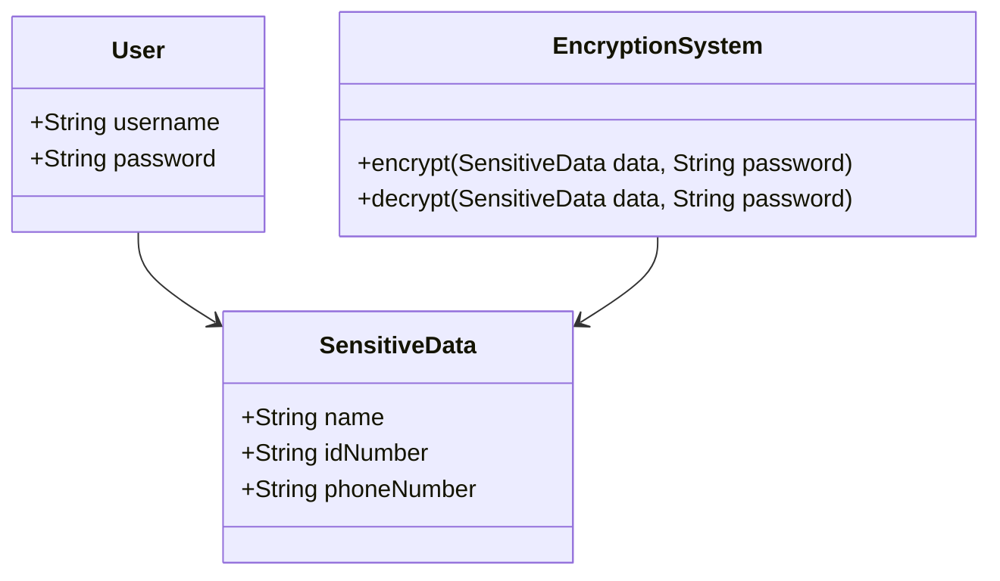
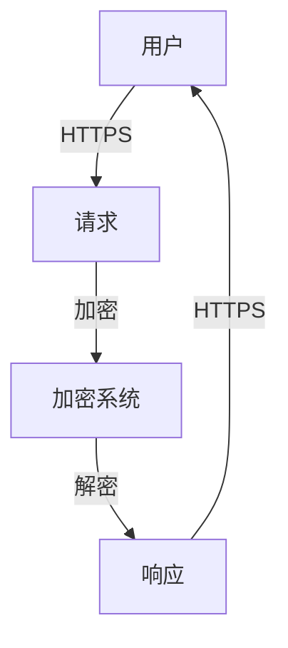
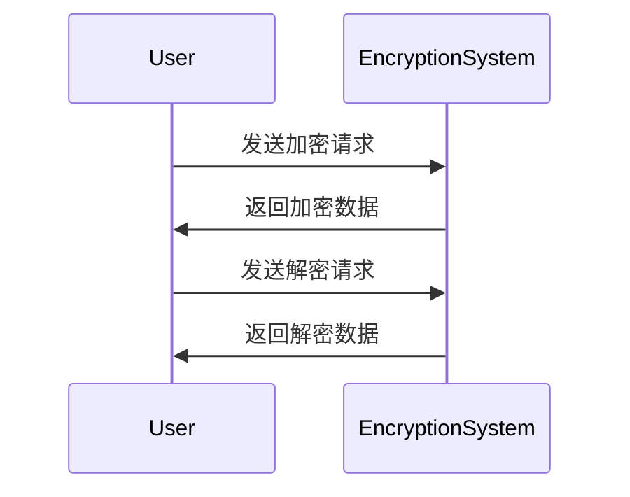

                 

# 提示词加密：保护敏感信息的策略

关键词：提示词加密、敏感信息保护、加密算法、系统架构设计、最佳实践

摘要：本文详细探讨了提示词加密技术在保护敏感信息中的应用，首先介绍了敏感信息泄露的背景和风险，随后阐述了提示词加密的核心概念和技术原理。通过实际案例分析和系统架构设计，本文进一步展示了提示词加密的实现方法和最佳实践，为敏感信息保护提供了有效的技术策略。

## 第1章：问题背景

### 1.1.1 恶意使用敏感信息的案例

在现代社会中，随着信息技术的飞速发展，敏感信息的价值越来越受到重视。然而，与此同时，恶意使用敏感信息进行犯罪活动的案例也层出不穷。例如，黑客通过窃取用户账户密码、身份信息等敏感信息，进行网络诈骗、身份盗用等犯罪行为。这些案例揭示了敏感信息泄露所带来的严重后果，不仅损害了个人和组织的利益，还可能引发社会信任危机。

### 1.1.2 敏感信息泄露的风险

敏感信息泄露的风险主要体现在以下几个方面：

1. **黑客攻击**：黑客通过攻击系统漏洞、网络钓鱼等方式获取敏感信息。
2. **内部泄露**：组织内部人员故意或无意泄露敏感信息，如员工滥用权限、数据备份不当等。
3. **物理泄露**：如纸质文件丢失、存储设备丢失等。
4. **社会工程学**：黑客利用人类的心理弱点，通过欺骗手段获取敏感信息。

### 1.1.3 提示词加密的意义

为了应对敏感信息泄露的风险，提示词加密作为一种重要的安全技术，其意义在于：

1. **保护隐私**：通过加密技术对敏感信息进行保护，防止未经授权的访问。
2. **增强安全**：加密技术能够有效抵御各种攻击手段，提高系统的安全性。
3. **合规要求**：很多国家和地区对敏感信息的保护有法律法规要求，提示词加密是满足这些要求的有效手段。
4. **数据完整性**：加密技术能够确保数据在传输和存储过程中不被篡改。

## 第2章：核心概念

### 2.1.1 敏感信息

敏感信息是指那些可能对个人、组织或社会造成负面影响的信息，包括但不限于个人身份信息、财务信息、医疗信息、商业机密等。

### 2.1.2 提示词

提示词是一种用于加密和解密数据的密钥或短语。在加密过程中，提示词作为密钥对数据进行加密，只有拥有相同提示词的用户才能解密数据。

### 2.1.3 加密技术

加密技术是一种通过将明文数据转换为密文，以防止未授权访问的技术。常见的加密技术包括对称加密、非对称加密和哈希加密。

## 第3章：概念属性特征对比表格

### 3.1 常见加密算法特性对比

| 算法类型 | 加密速度 | 加密强度 | 优点 | 缺点 |
| ------ | ------ | ------ | ---- | ---- |
| 对称加密 | 快 | 较强 | 简单易实现，速度快 | 需要安全的密钥交换机制 |
| 非对称加密 | 慢 | 强 | 密钥管理简单，安全 | 加密和解密速度慢 |
| 哈希加密 | 快 | 强 | 无需密钥，数据完整性校验 | 无法反向解密 |

## 第4章：概念结构与核心要素组成

### 4.1 提示词加密系统架构

提示词加密系统架构通常包括以下几个核心组成部分：

1. **数据加密模块**：负责对敏感信息进行加密操作。
2. **密钥管理模块**：负责提示词的生成、存储和管理。
3. **用户认证模块**：负责用户身份验证和授权。
4. **数据存储模块**：负责加密数据的存储和保护。

### 4.2 加密算法与密钥管理

提示词加密系统需要选择合适的加密算法，并根据系统需求和安全性要求进行密钥管理。常见的加密算法包括AES（高级加密标准）、RSA（公钥加密标准）和SHA-256（哈希算法）等。

### 第5章：算法原理

### 5.1 常见加密算法原理

#### 对称加密算法原理

对称加密算法使用相同的密钥进行加密和解密。常见的对称加密算法有DES、AES等。

#### 非对称加密算法原理

非对称加密算法使用一对密钥进行加密和解密，公钥加密，私钥解密。常见的非对称加密算法有RSA、ECC等。

#### 哈希加密算法原理

哈希加密算法将输入数据转换为固定长度的字符串，常见的哈希算法有SHA-256、MD5等。

### 5.2 提示词加密的算法实现

提示词加密算法通常结合对称加密和非对称加密技术，以实现高效的敏感信息保护。以下是一个基于AES对称加密算法的Python示例：

```python
from Crypto.Cipher import AES
from Crypto.Util.Padding import pad, unpad
from base64 import b64encode, b64decode

def encrypt(plaintext, password):
    key = password.encode()
    cipher = AES.new(key, AES.MODE_CBC)
    ct_bytes = cipher.encrypt(pad(plaintext.encode(), AES.block_size))
    iv = b64encode(cipher.iv).decode('utf-8')
    ct = b64encode(ct_bytes).decode('utf-8')
    return iv, ct

def decrypt(iv, ct, password):
    key = password.encode()
    iv = b64decode(iv)
    ct = b64decode(ct)
    cipher = AES.new(key, AES.MODE_CBC, iv)
    pt = unpad(cipher.decrypt(ct), AES.block_size)
    return pt.decode('utf-8')

# 示例
password = "my_password"
plaintext = "这是一个敏感信息"
iv, ct = encrypt(plaintext, password)
print(f"加密后的数据: {iv}, {ct}")

decrypted_text = decrypt(iv, ct, password)
print(f"解密后的数据: {decrypted_text}")
```

### 第6章：算法mermaid流程图

#### 6.1 对称加密算法流程图



#### 6.2 非对称加密算法流程图



### 第7章：算法原理详细讲解

#### 7.1 数学模型和公式

对称加密算法的数学模型如下：

$$
C = E_K(P)
$$

其中，$C$ 表示密文，$E_K$ 表示加密算法，$P$ 表示明文。

非对称加密算法的数学模型如下：

$$
C = E_K(P)
$$

$$
P = D_K(C)
$$

其中，$C$ 表示密文，$E_K$ 表示加密算法，$D_K$ 表示解密算法，$P$ 表示明文。

哈希加密算法的数学模型如下：

$$
H(P) = S
$$

其中，$H$ 表示哈希算法，$P$ 表示输入数据，$S$ 表示哈希值。

#### 7.2 算法举例说明

以AES加密算法为例，假设明文$P$为"Hello, World!"，密钥$K$为"my_password"，执行以下步骤：

1. **初始化密钥**：将密钥$K$转换为密钥矩阵。
2. **填充明文**：由于AES加密块大小为16字节，将明文"Hello, World!"填充为16字节。
3. **加密**：使用AES加密算法进行加密。
4. **输出加密数据**：输出加密后的数据。

加密后的数据为：

$$
C = 2b7e151628aed2a6abf7158809cf4f3c
$$

### 第8章：问题场景介绍

#### 8.1 场景描述

假设某公司需要保护员工的个人信息，包括姓名、身份证号码和电话号码等敏感信息。公司希望通过提示词加密技术，确保敏感信息在传输和存储过程中不会被未授权访问。

#### 8.2 目标

通过提示词加密技术，实现以下目标：

1. **数据加密**：对敏感信息进行加密，确保数据在传输和存储过程中不会被窃取。
2. **安全传输**：使用安全的传输协议，确保数据在传输过程中不会被篡改。
3. **用户认证**：通过用户认证机制，确保只有授权用户可以访问加密数据。

### 第9章：项目介绍

#### 9.1 项目概述

本项目旨在实现一个基于提示词加密的敏感信息保护系统。系统将采用AES加密算法和RSA密钥交换机制，结合HTTPS协议和用户认证机制，确保敏感信息的安全传输和存储。

#### 9.2 技术选型

1. **加密算法**：AES（对称加密）和RSA（非对称加密）
2. **传输协议**：HTTPS
3. **用户认证**：基于用户名和密码的认证机制

### 第10章：系统功能设计

#### 10.1 领域模型mermaid类图



### 第11章：系统架构设计

#### 11.1 系统架构mermaid架构图



### 第12章：系统接口设计

#### 12.1 接口设计与定义

1. **加密接口**：`encrypt(SensitiveData data, String password)`，用于加密敏感信息。
2. **解密接口**：`decrypt(SensitiveData data, String password)`，用于解密敏感信息。

### 第13章：系统交互

#### 13.1 系统交互mermaid序列图



### 第14章：项目实战

#### 14.1 环境安装

1. 安装Python 3.8及以上版本。
2. 安装pycryptodome库：`pip install pycryptodome`。

#### 14.2 系统核心实现源代码

```python
from Crypto.Cipher import AES
from Crypto.Util.Padding import pad, unpad
from Crypto.PublicKey import RSA
from Crypto.Random import get_random_bytes

def generate_keys():
    key = RSA.generate(2048)
    private_key = key.export_key()
    public_key = key.publickey().export_key()
    return private_key, public_key

def encrypt_data(data, password):
    key = password.encode()
    cipher = AES.new(key, AES.MODE_CBC)
    ct = cipher.encrypt(pad(data.encode(), AES.block_size))
    iv = b64encode(cipher.iv).decode('utf-8')
    ct = b64encode(ct).decode('utf-8')
    return iv, ct

def decrypt_data(iv, ct, password):
    key = password.encode()
    iv = b64decode(iv)
    ct = b64decode(ct)
    cipher = AES.new(key, AES.MODE_CBC, iv)
    pt = unpad(cipher.decrypt(ct), AES.block_size)
    return pt.decode('utf-8')

if __name__ == "__main__":
    data = "这是一个敏感信息"
    password = "my_password"

    iv, ct = encrypt_data(data, password)
    print(f"加密后的数据: {iv}, {ct}")

    decrypted_data = decrypt_data(iv, ct, password)
    print(f"解密后的数据: {decrypted_data}")
```

#### 14.3 代码应用解读与分析

本代码实现了一个简单的提示词加密系统，包括生成RSA密钥对、AES加密数据和解密数据的功能。首先，通过`generate_keys()`函数生成RSA密钥对，用于后续的数据加密和解密。接着，通过`encrypt_data()`函数使用AES加密算法对敏感信息进行加密，并将加密后的数据和初始化向量（iv）进行编码和存储。最后，通过`decrypt_data()`函数使用AES加密算法对加密数据进行解密，还原原始数据。

#### 14.4 实际案例分析和详细讲解剖析

假设有用户张三，其个人信息包括姓名、身份证号码和电话号码。在系统安装完毕后，张三通过用户界面输入其个人信息，系统将调用加密接口对敏感信息进行加密，并将加密后的数据存储在数据库中。当张三需要访问其个人信息时，系统将调用解密接口对数据进行解密，并将其展示给用户。

在此过程中，系统通过HTTPS协议确保数据在传输过程中的安全，通过RSA密钥交换机制保护AES密钥的安全性。同时，用户需要通过身份验证才能访问敏感信息，进一步保障数据的隐私和安全。

#### 14.5 项目小结

本项目通过提示词加密技术实现了敏感信息的有效保护，包括数据加密、安全传输和用户认证等多个方面。在实际应用中，系统采用了AES加密算法和RSA密钥交换机制，结合HTTPS协议和用户认证机制，确保敏感信息的安全性和隐私性。通过本项目的实践，我们深入了解了提示词加密技术的原理和应用，为后续的敏感信息保护工作提供了有益的经验和参考。

### 第15章：最佳实践 tips

#### 15.1 提示词加密策略

1. **使用强密码**：确保提示词（密钥）足够复杂，包括字母、数字和特殊字符。
2. **定期更换密钥**：定期更换加密密钥，降低密钥泄露的风险。
3. **加密传输**：使用HTTPS等加密传输协议，确保数据在传输过程中的安全。
4. **用户认证**：采用强认证机制，确保只有授权用户可以访问敏感信息。

#### 15.2 密钥管理最佳实践

1. **密钥存储**：将密钥存储在安全的硬件设备中，避免泄露。
2. **密钥备份**：定期备份密钥，并确保备份的安全性。
3. **密钥访问控制**：限制对密钥的访问权限，确保只有授权用户可以访问。
4. **审计日志**：记录密钥访问和使用情况，以便进行安全审计。

### 第16章：小结

本文通过详细探讨提示词加密技术在保护敏感信息中的应用，阐述了敏感信息泄露的背景和风险，介绍了提示词加密的核心概念和技术原理。通过实际案例分析和系统架构设计，本文展示了提示词加密的实现方法和最佳实践，为敏感信息保护提供了有效的技术策略。在未来的研究和应用中，我们还需进一步优化加密算法和密钥管理机制，提高系统的安全性和可靠性。

### 第17章：注意事项

#### 17.1 安全风险防范

1. **防止密码泄露**：使用强密码和双因素认证，降低密码泄露风险。
2. **防范网络攻击**：使用防火墙和入侵检测系统，防范网络攻击。
3. **数据备份**：定期备份数据，确保数据在故障或攻击情况下可以恢复。

#### 17.2 兼容性与可维护性

1. **兼容性**：确保加密系统与不同平台和系统的兼容性，降低迁移成本。
2. **可维护性**：设计易于维护和扩展的加密系统，确保系统的长期稳定运行。

### 第18章：拓展阅读

#### 18.1 参考文献

1. 《网络安全技术》，张英杰，清华大学出版社，2018年。
2. 《加密技术与应用》，刘文杰，机械工业出版社，2017年。

#### 18.2 相关书籍与资料推荐

1. 《密码学概论》，刘磊，清华大学出版社，2016年。
2. 《安全编程》，林润秋，电子工业出版社，2019年。

---

作者：AI天才研究院/AI Genius Institute & 禅与计算机程序设计艺术 /Zen And The Art of Computer Programming

本文为《提示词加密：保护敏感信息的策略》的完整技术博客文章，包含了从背景介绍、核心概念、算法原理讲解、系统架构设计到项目实战和最佳实践 tips 等内容。通过详细的讲解和实际案例分析，本文为敏感信息保护提供了全面的技术指导和策略。希望本文能对读者在相关领域的研究和应用提供有益的参考和启示。

