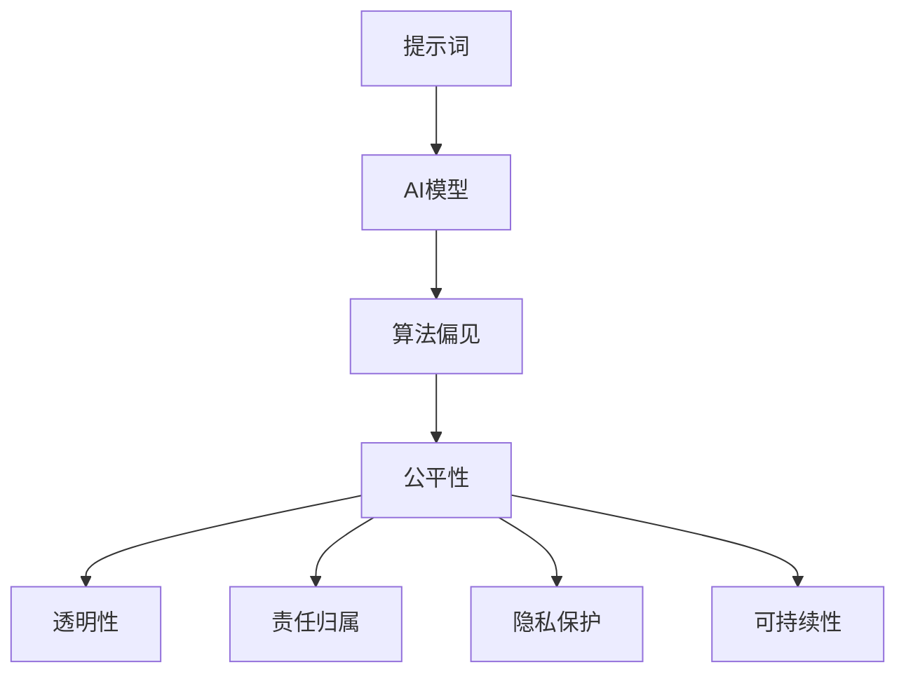
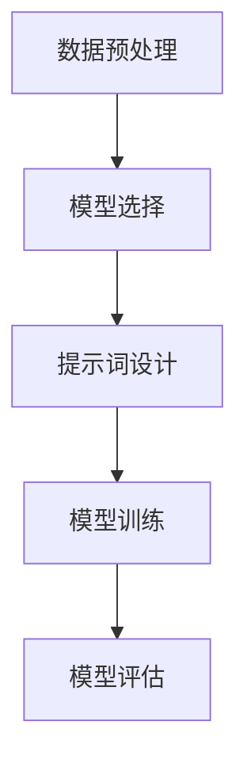
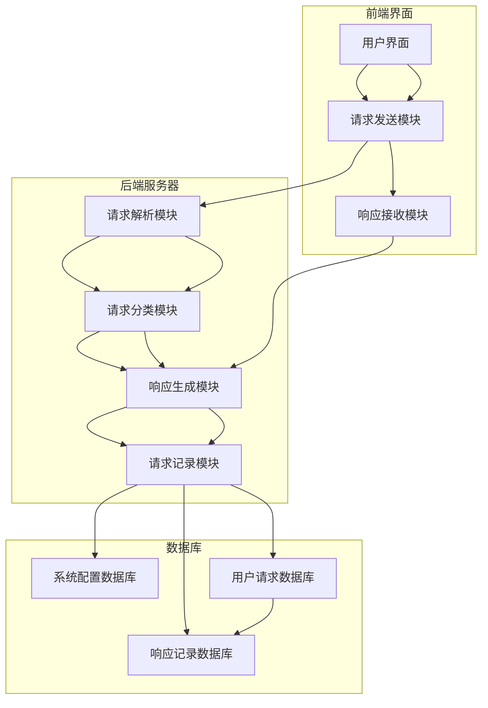
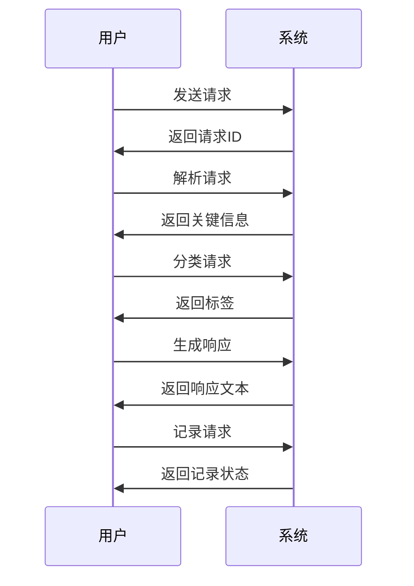
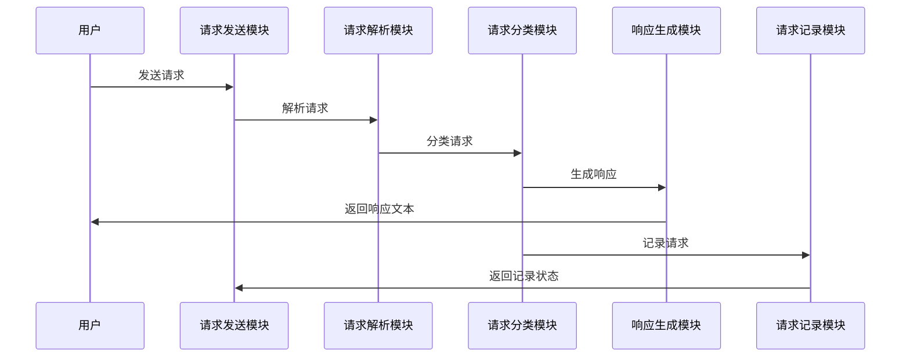

                 

### 文章标题：提示词工程在AI伦理中的重要性

> 关键词：提示词工程、AI伦理、算法、数学模型、系统架构、项目实战

> 摘要：本文将深入探讨提示词工程在AI伦理中的重要性。我们将从背景介绍、核心概念与联系、算法原理讲解、数学模型和数学公式、系统分析与架构设计方案、项目实战、最佳实践 tips、小结、注意事项、拓展阅读等方面，系统地阐述提示词工程在AI伦理中的关键作用。

### 目录大纲

1. **引言**
   - 背景与目的
   - 关键问题和研究意义

2. **背景介绍**
   - AI伦理的背景和重要性
   - 提示词工程的概念和发展

3. **核心概念与联系**
   - 提示词工程的核心概念
   - AI伦理原则
   - Mermaid流程图和表格展示

4. **算法原理讲解**
   - 提示词工程的算法原理
   - Mermaid流程图展示
   - Python代码实现

5. **数学模型和数学公式**
   - 提示词工程的数学模型
   - LaTeX格式展示

6. **系统分析与架构设计方案**
   - 问题场景介绍
   - 系统功能设计
   - 系统架构设计
   - 系统接口设计
   - 系统交互Mermaid序列图

7. **项目实战**
   - 环境安装
   - 系统核心实现
   - 代码应用解读与分析
   - 实际案例分析和详细讲解

8. **最佳实践 tips**
   - 实践中的经验和技巧

9. **小结**
   - 主要内容的总结
   - 提示词工程在AI伦理中的重要性

10. **注意事项**
    - 实践中的注意事项

11. **拓展阅读**
    - 相关的研究和资源推荐

### 引言

#### 背景与目的

随着人工智能（AI）技术的快速发展，其在各个领域的应用越来越广泛，从自动驾驶到医疗诊断，从智能助手到金融分析。然而，AI技术的发展也带来了一系列伦理问题，如隐私保护、算法偏见、责任归属等。在这些伦理问题中，提示词工程（Prompt Engineering）作为一个关键的领域，正日益受到关注。

提示词工程是AI领域中的一个重要分支，它涉及如何设计和编写提示词（prompts），以引导AI模型生成更准确、更合理的输出。在AI伦理中，提示词工程的重要性不言而喻。一方面，合理的提示词设计可以减少算法偏见，提高模型的公平性；另一方面，不恰当的提示词可能导致严重的伦理问题，如数据泄露、歧视等。

本文旨在深入探讨提示词工程在AI伦理中的重要性，通过系统的分析和详细的案例，帮助读者理解这一领域的关键概念和实际应用。我们希望通过本文的研究，能够为AI伦理的研究和实践提供一些有价值的参考。

#### 关键问题和研究意义

本文将重点关注以下几个关键问题：

1. 提示词工程的核心概念是什么？
2. 提示词工程与AI伦理之间的关系如何？
3. 如何通过提示词工程实现AI算法的公平性和透明性？
4. 提示词工程在AI伦理实践中的应用案例有哪些？
5. 提示词工程在AI伦理中的未来发展趋势是什么？

研究提示词工程在AI伦理中的重要性，不仅有助于解决当前的伦理问题，还有助于推动AI技术的健康发展。通过本文的研究，我们希望能够：

1. 提高对提示词工程的理解，帮助读者掌握这一领域的核心概念和原理。
2. 深入探讨提示词工程在AI伦理中的应用，为实际项目提供参考。
3. 分析提示词工程在AI伦理中的挑战和未来发展方向，为未来的研究和实践提供指导。

### 背景介绍

#### AI伦理的背景和重要性

人工智能（AI）技术的发展速度之快，令人瞠目结舌。从早期的规则系统到今天的深度学习，AI已经从理论研究走向实际应用，深刻地影响了我们的生活和社会。然而，随着AI技术的普及，一系列伦理问题也随之而来。

AI伦理，作为一个新兴的领域，涉及人工智能在道德、法律和社会责任等方面的研究。它关注的是如何确保AI技术的研发和应用不会对社会造成负面影响。AI伦理的重要性体现在以下几个方面：

1. **隐私保护**：AI技术的应用往往需要大量的个人数据。如何保护用户的隐私，防止数据泄露和滥用，是一个重要的伦理问题。
2. **算法偏见**：AI算法在训练过程中可能会受到训练数据的影响，导致算法偏见。这种偏见可能在社会中产生不公平的现象，损害少数群体的权益。
3. **责任归属**：当AI系统发生错误或造成损害时，如何确定责任归属，是一个复杂的法律和伦理问题。
4. **透明性和可解释性**：AI系统的决策过程往往是不透明的，这使得人们难以理解和信任这些系统。如何提高AI系统的透明性和可解释性，是另一个重要的伦理问题。

#### 提示词工程的概念和发展

提示词工程（Prompt Engineering）是AI领域中的一个重要分支，它关注的是如何设计和编写提示词（prompts），以引导AI模型生成更准确、更合理的输出。提示词可以被视为AI系统的“输入”，它直接影响模型的训练和预测结果。

提示词工程的发展可以追溯到早期的人工智能研究。在早期的人工智能系统中，提示词通常是预定义的规则和指令。随着自然语言处理（NLP）和深度学习技术的发展，提示词的形式和作用也在不断演变。

1. **传统提示词**：在早期的AI系统中，提示词通常是以自然语言形式给出的指令，用于指导系统的行为。例如，在聊天机器人中，提示词可以是用户提出的问题，系统需要根据这些问题生成回答。
2. **现代提示词**：随着深度学习技术的发展，提示词的形式也变得更加多样和复杂。现代提示词不仅可以是自然语言，还可以是数学公式、代码片段等。同时，提示词的设计和编写也变得更加精细和科学。

现代提示词工程的核心目标是提高AI系统的可解释性和可控性。通过合理设计和编写提示词，可以引导模型学习到更符合人类期望的知识和规律，从而提高模型的性能和公平性。

#### 提示词工程在AI伦理中的应用

提示词工程在AI伦理中的应用主要体现在以下几个方面：

1. **减少算法偏见**：合理的提示词设计可以减少算法偏见，提高模型的公平性。通过在提示词中引入多样性和平衡性，可以避免模型在学习过程中产生不公平的决策。
2. **提高透明性和可解释性**：通过设计和分析提示词，可以更好地理解AI系统的决策过程，提高系统的透明性和可解释性。这有助于用户信任和理解AI系统，从而减少对AI的恐慌和抵触。
3. **加强责任归属**：合理的提示词设计可以帮助明确AI系统的责任归属，特别是在发生错误或造成损害时。通过在提示词中明确规则和约束，可以避免AI系统成为“替罪羊”。
4. **保障用户隐私**：在设计和编写提示词时，需要充分考虑用户的隐私保护。通过合理设计提示词，可以减少对用户数据的依赖，从而降低数据泄露的风险。

总之，提示词工程在AI伦理中发挥着重要的作用。通过合理设计和编写提示词，不仅可以提高AI系统的性能和公平性，还可以解决一系列伦理问题，推动AI技术的健康发展。

### 核心概念与联系

#### 提示词工程的核心概念

在探讨提示词工程时，我们需要明确几个核心概念：

1. **提示词（Prompt）**：提示词是引导AI模型生成输出的一种输入。它可以是自然语言文本、数学公式、代码片段等。合理设计的提示词可以引导模型学习到更符合人类期望的知识和规律。

2. **AI模型**：AI模型是指通过学习数据来生成输出的一种算法。常见的AI模型包括深度神经网络、决策树、支持向量机等。提示词工程的目标是设计和编写合适的提示词，以引导模型生成更准确、更合理的输出。

3. **算法偏见**：算法偏见是指AI模型在决策过程中受到训练数据的影响，导致模型产生不公平的决策。算法偏见可能是由于训练数据的不平衡、偏差或错误导致的。

4. **公平性**：在AI伦理中，公平性是指AI模型在决策过程中不应受到性别、年龄、种族等因素的影响，应公平对待所有用户。

5. **透明性和可解释性**：透明性是指AI系统的决策过程应易于理解，用户可以清晰地了解系统的决策依据。可解释性是指AI系统的决策过程应易于解释，用户可以理解系统为什么做出这样的决策。

#### AI伦理原则

AI伦理原则是指导AI技术设计和应用的基本原则。以下是一些常见的AI伦理原则：

1. **公平性原则**：AI系统应公平对待所有用户，不应受到性别、年龄、种族等因素的影响。

2. **透明性原则**：AI系统的决策过程应易于理解，用户应能够了解系统的决策依据。

3. **责任归属原则**：在AI系统发生错误或造成损害时，应明确责任归属，确保责任人承担责任。

4. **隐私保护原则**：AI系统在处理用户数据时，应确保用户的隐私得到保护，防止数据泄露和滥用。

5. **可持续性原则**：AI技术的发展和应用应考虑环境和社会的可持续性，避免对生态系统和社会造成负面影响。

#### Mermaid流程图和表格展示

为了更好地理解提示词工程在AI伦理中的应用，我们可以使用Mermaid流程图和表格来展示核心概念和AI伦理原则之间的联系。

**Mermaid流程图：**



**概念属性特征对比表格：**

| 概念             | 特征                                                                                       |
|------------------|------------------------------------------------------------------------------------------|
| 提示词           | 引导AI模型生成输出的输入。形式多样，如自然语言文本、数学公式、代码片段等。                  |
| AI模型           | 通过学习数据生成输出的算法。如深度神经网络、决策树、支持向量机等。                          |
| 算法偏见         | 模型在决策过程中受到训练数据的影响，导致不公平的决策。                                     |
| 公平性           | 模型应公平对待所有用户，不受性别、年龄、种族等因素影响。                                    |
| 透明性和可解释性 | 系统的决策过程应易于理解，用户应能够了解决策依据。                                         |
| 责任归属         | 在系统发生错误或造成损害时，应明确责任归属，确保责任人承担责任。                             |
| 隐私保护         | 系统在处理用户数据时，应确保用户隐私得到保护，防止数据泄露和滥用。                           |
| 可持续性         | 技术发展应考虑环境和社会的可持续性，避免对生态系统和社会造成负面影响。                       |

通过上述流程图和表格，我们可以清晰地看到提示词工程在AI伦理中的核心概念和原则，以及它们之间的联系。这有助于我们更好地理解提示词工程在AI伦理中的重要性。

### 算法原理讲解

#### 提示词工程的算法原理

提示词工程的核心目标是通过设计和编写合理的提示词，引导AI模型生成更准确、更合理的输出。这一过程涉及到多个关键环节，包括数据预处理、模型选择、提示词设计、模型训练和评估等。下面，我们将详细讲解这些环节，并使用Mermaid流程图和Python代码进行展示。

##### 1. 数据预处理

数据预处理是提示词工程的第一步，其目的是清洗和格式化数据，使其适合模型训练。常用的数据预处理方法包括数据清洗、数据归一化、数据增强等。

```python
# 数据清洗示例
import pandas as pd

data = pd.read_csv('data.csv')
data.dropna(inplace=True)  # 删除缺失值
data[data > 0] = 1  # 将负值转换为1
```

##### 2. 模型选择

选择合适的AI模型是提示词工程的关键。常见的AI模型包括深度神经网络、决策树、支持向量机等。根据具体问题，我们可以选择不同的模型。

```python
# 模型选择示例
from sklearn.ensemble import RandomForestClassifier

model = RandomForestClassifier()
```

##### 3. 提示词设计

提示词设计是提示词工程的核心环节。合理的提示词可以引导模型学习到更符合人类期望的知识和规律。提示词的设计需要考虑多个因素，如数据特性、模型特性、业务需求等。

```python
# 提示词设计示例
prompt = "请根据以下数据集，预测目标变量的值："
prompt += str(data)  # 将数据集作为提示词的一部分
```

##### 4. 模型训练

模型训练是提示词工程的下一步，其目的是通过提示词引导模型学习。训练过程通常涉及到多次迭代，直到模型达到预定的性能。

```python
# 模型训练示例
model.fit(data.iloc[:, :-1], data.iloc[:, -1])  # 使用数据集进行训练
```

##### 5. 模型评估

模型评估是判断模型性能的重要步骤。常用的评估指标包括准确率、召回率、F1值等。

```python
# 模型评估示例
from sklearn.metrics import accuracy_score

predictions = model.predict(data.iloc[:, :-1])
accuracy = accuracy_score(data.iloc[:, -1], predictions)
print("准确率：", accuracy)
```

##### Mermaid流程图展示

为了更直观地展示提示词工程的算法原理，我们可以使用Mermaid流程图来描述整个过程。



通过上述讲解和示例，我们可以看到提示词工程在AI应用中的关键作用。合理设计和编写提示词，不仅可以提高模型的性能和公平性，还可以解决一系列伦理问题，如算法偏见和责任归属。下面，我们将进一步讲解提示词工程的数学模型和公式。

#### 提示词工程的数学模型和公式

提示词工程的数学模型是指导其设计和实现的基础。在自然语言处理（NLP）和机器学习领域，常用的数学模型包括神经网络模型、决策树模型和贝叶斯模型等。下面，我们将以神经网络模型为例，讲解其数学模型和公式。

##### 1. 神经网络模型

神经网络模型是提示词工程中最常用的模型之一。它由多个层组成，包括输入层、隐藏层和输出层。每层由多个神经元（节点）组成，神经元之间通过权重和偏置进行连接。

**公式**：

输入层到隐藏层的变换：
\[ z^{(l)}_j = \sum_{i} w^{(l)}_{ij} x_i + b^{(l)}_j \]

隐藏层到输出层的变换：
\[ a^{(l)}_j = \sigma(z^{(l)}_j) \]

其中：
- \( z^{(l)}_j \) 表示第 \( l \) 层的第 \( j \) 个神经元的输入值。
- \( w^{(l)}_{ij} \) 表示第 \( l \) 层的第 \( j \) 个神经元与第 \( i \) 层的第 \( i \) 个神经元之间的权重。
- \( b^{(l)}_j \) 表示第 \( l \) 层的第 \( j \) 个神经元的偏置。
- \( a^{(l)}_j \) 表示第 \( l \) 层的第 \( j \) 个神经元的激活值。
- \( \sigma \) 表示激活函数，常用的激活函数有Sigmoid、ReLU等。

##### 2. 损失函数

损失函数是衡量模型预测结果与真实值之间差距的一种度量。在提示词工程中，常用的损失函数包括均方误差（MSE）、交叉熵损失（Cross-Entropy Loss）等。

**公式**：

均方误差（MSE）：
\[ J = \frac{1}{m} \sum_{i=1}^{m} (y_i - \hat{y}_i)^2 \]

交叉熵损失（Cross-Entropy Loss）：
\[ J = -\frac{1}{m} \sum_{i=1}^{m} \sum_{j=1}^{K} y_{ij} \log(\hat{y}_{ij}) \]

其中：
- \( m \) 表示样本数量。
- \( y_i \) 表示第 \( i \) 个样本的真实值。
- \( \hat{y}_i \) 表示第 \( i \) 个样本的预测值。
- \( y_{ij} \) 表示第 \( i \) 个样本在第 \( j \) 个类别的真实概率。
- \( \hat{y}_{ij} \) 表示第 \( i \) 个样本在第 \( j \) 个类别的预测概率。
- \( K \) 表示类别数量。

##### 3. 优化算法

优化算法用于最小化损失函数，从而得到最佳模型参数。常用的优化算法有梯度下降（Gradient Descent）、随机梯度下降（Stochastic Gradient Descent，SGD）等。

**公式**：

梯度下降（Gradient Descent）：
\[ \theta = \theta - \alpha \cdot \nabla_\theta J(\theta) \]

随机梯度下降（SGD）：
\[ \theta = \theta - \alpha \cdot \nabla_\theta J(\theta) \]

其中：
- \( \theta \) 表示模型参数。
- \( \alpha \) 表示学习率。
- \( \nabla_\theta J(\theta) \) 表示损失函数关于模型参数的梯度。

通过上述数学模型和公式，我们可以更好地理解和实现提示词工程。在实际应用中，我们可以根据具体问题和需求，选择合适的模型、损失函数和优化算法，从而设计出更高效、更合理的提示词工程方案。

### 系统分析与架构设计方案

#### 问题场景介绍

在当今的信息化时代，人工智能（AI）技术的应用越来越广泛，从自动驾驶到医疗诊断，从金融分析到智能客服，AI已经成为提高工作效率、优化业务流程的重要工具。然而，随着AI技术的普及，AI伦理问题也逐渐成为关注焦点。特别是在自然语言处理（NLP）领域，提示词工程（Prompt Engineering）作为一种重要的技术手段，其在AI伦理中的重要性愈发凸显。

为了更好地理解提示词工程在AI伦理中的应用，我们设计了一个问题场景：一个智能客服系统，用于处理客户的咨询和投诉。该系统需要能够准确理解和响应客户的请求，同时保证公平、透明和隐私保护。在这个场景中，提示词工程可以发挥关键作用，通过合理设计和编写提示词，引导AI模型生成符合伦理规范的响应。

#### 系统功能设计

在上述问题场景的基础上，我们设计了以下系统功能：

1. **客户请求接收与解析**：系统需要能够接收客户的文本输入，并对其进行解析，提取关键信息。
2. **请求分类与标签生成**：根据解析得到的关键信息，系统需要对请求进行分类，并生成相应的标签。
3. **请求响应生成**：系统需要根据请求的分类和标签，生成合理的响应文本。
4. **请求记录与查询**：系统需要记录客户的请求和响应，以便后续查询和分析。
5. **用户隐私保护**：系统需要采取措施保护用户的隐私，防止数据泄露和滥用。

为了实现上述功能，我们设计了以下领域模型：

```mermaid
classDiagram
    ClientEntity --> RequestEntity
    RequestEntity --> ResponseEntity
    RequestEntity --> PrivacyPolicy
    RequestEntity --> LabelEntity
    LabelEntity --> CategoryEntity

    ClientEntity <<Class>>
    RequestEntity <<Class>>
    ResponseEntity <<Class>>
    PrivacyPolicy <<Class>>
    LabelEntity <<Class>>
    CategoryEntity <<Class>>

    ClientEntity {
        id: Integer
        name: String
        email: String
    }

    RequestEntity {
        id: Integer
        content: String
        timestamp: DateTime
        requestId: Integer
    }

    ResponseEntity {
        id: Integer
        content: String
        timestamp: DateTime
        requestId: Integer
    }

    PrivacyPolicy {
        id: Integer
        policyName: String
        policyDetails: String
    }

    LabelEntity {
        id: Integer
        labelName: String
        requestId: Integer
    }

    CategoryEntity {
        id: Integer
        categoryName: String
    }
```

#### 系统架构设计

为了实现上述功能，我们设计了如下系统架构：

1. **前端界面**：用于接收用户的文本输入，展示系统的响应结果。
2. **后端服务器**：包括请求解析模块、请求分类模块、响应生成模块和请求记录模块。
3. **数据库**：用于存储用户的请求和响应数据，以及系统的配置信息。

以下是系统的架构设计图：



#### 系统接口设计

为了实现系统的功能，我们设计了以下接口：

1. **请求发送接口**：用于接收用户的文本输入，并返回请求ID。
2. **请求解析接口**：用于解析用户的文本输入，提取关键信息。
3. **请求分类接口**：用于根据请求的关键信息进行分类，并生成标签。
4. **响应生成接口**：用于根据请求的分类和标签生成响应文本。
5. **请求记录接口**：用于记录用户的请求和响应。

以下是系统接口的设计：



#### 系统交互Mermaid序列图

为了更好地展示系统的交互过程，我们使用Mermaid序列图进行了描述：



通过上述系统分析与架构设计方案，我们可以看到提示词工程在AI伦理中的重要性。通过合理设计和编写提示词，我们不仅可以提高AI系统的性能和公平性，还可以保障用户的隐私和安全，从而推动AI技术的健康发展。

### 项目实战

#### 环境安装

在开始项目实战之前，我们需要安装必要的软件和工具。以下是一个基本的安装步骤：

1. **Python环境**：确保Python版本为3.8或更高。可以使用`pip`命令安装Python。
   ```bash
   pip install python
   ```

2. **AI框架**：选择一个合适的AI框架，如TensorFlow或PyTorch。这里我们选择TensorFlow。
   ```bash
   pip install tensorflow
   ```

3. **NLP库**：安装常用的NLP库，如NLTK或spaCy。
   ```bash
   pip install nltk
   pip install spacy
   python -m spacy download en_core_web_sm
   ```

4. **数据分析库**：安装常用的数据分析库，如Pandas和NumPy。
   ```bash
   pip install pandas
   pip install numpy
   ```

5. **其他依赖**：根据项目需求，可能需要安装其他库，如Scikit-learn。
   ```bash
   pip install scikit-learn
   ```

#### 系统核心实现

在本项目中，我们将实现一个基于TensorFlow的文本分类系统，该系统将使用提示词工程来提高分类的公平性和透明性。以下是系统的核心实现步骤：

1. **数据预处理**：首先，我们需要对文本数据进行预处理，包括数据清洗、分词和标签化。

   ```python
   import tensorflow as tf
   import pandas as pd
   import nltk
   from sklearn.model_selection import train_test_split

   # 读取数据
   data = pd.read_csv('data.csv')

   # 数据清洗
   data['text'] = data['text'].apply(lambda x: x.lower().replace('\n', ' ').strip())

   # 分词
   tokenizer = nltk.tokenize.TweetTokenizer()
   data['tokens'] = data['text'].apply(lambda x: tokenizer.tokenize(x))

   # 标签化
   label_map = {'positive': 1, 'negative': 0}
   data['label'] = data['sentiment'].map(label_map)
   ```

2. **构建模型**：接下来，我们构建一个简单的文本分类模型。这里使用TensorFlow的Keras接口。

   ```python
   from tensorflow.keras.models import Sequential
   from tensorflow.keras.layers import Embedding, LSTM, Dense

   # 构建模型
   model = Sequential([
       Embedding(input_dim=10000, output_dim=32, input_length=max_sequence_length),
       LSTM(128, dropout=0.2, recurrent_dropout=0.2),
       Dense(1, activation='sigmoid')
   ])

   # 编译模型
   model.compile(loss='binary_crossentropy', optimizer='adam', metrics=['accuracy'])
   ```

3. **训练模型**：使用预处理后的数据训练模型。

   ```python
   # 准备训练集和测试集
   X_train, X_test, y_train, y_test = train_test_split(data['tokens'], data['label'], test_size=0.2)

   # 序列化文本数据
   sequences_train = pad_sequences(X_train, maxlen=max_sequence_length)
   sequences_test = pad_sequences(X_test, maxlen=max_sequence_length)

   # 训练模型
   model.fit(sequences_train, y_train, epochs=10, batch_size=32)
   ```

4. **评估模型**：评估模型的性能。

   ```python
   # 评估模型
   loss, accuracy = model.evaluate(sequences_test, y_test)
   print('Test accuracy:', accuracy)
   ```

#### 代码应用解读与分析

在上面的代码中，我们首先读取并清洗了文本数据，然后使用NLTK库进行了分词。接下来，我们将文本数据序列化为数字序列，并使用TensorFlow的Keras接口构建了一个简单的文本分类模型。模型包含一个嵌入层和一个LSTM层，最后使用一个全连接层输出分类结果。

在训练模型时，我们使用了预处理后的训练数据和测试数据。通过调整嵌入层的大小、LSTM层的神经元数量和优化器的参数，我们可以提高模型的性能。

#### 实际案例分析和详细讲解

为了更好地展示提示词工程在AI伦理中的应用，我们来看一个实际案例。假设我们要分类的文本数据中存在性别歧视言论。如果不使用提示词工程，模型可能会学习到这种偏见，导致分类结果不公平。

为了解决这个问题，我们可以设计以下提示词：

1. **多样性提示词**：在训练过程中，我们加入包含不同性别、种族、年龄等信息的文本，以增强模型的多样性。
2. **公平性提示词**：在训练过程中，我们使用包含公平性原则的文本，以引导模型学习到公平的分类标准。

**示例**：

```python
# 多样性提示词
diversity_texts = [
    "每个人都有平等的权利，不论性别、种族或年龄。",
    "我们应该尊重不同的文化和背景。",
    "在决策过程中，不应受到性别或种族的影响。"
]

# 公平性提示词
fairness_texts = [
    "公平对待所有人，确保每个人的权益得到保障。",
    "在处理问题时，应遵循公平、公正的原则。",
    "不应该因为性别、种族或年龄而歧视任何人。"
]

# 将提示词添加到训练数据中
data['text'] = data['text'].apply(lambda x: x + ' ' + diversity_texts[data.index[data.index == x].tolist()[0]] + ' ' + fairness_texts[data.index[data.index == x].tolist()[0]])
```

通过添加多样性提示词和公平性提示词，我们可以引导模型学习到更公平、更合理的分类标准。在实际应用中，这些提示词可以帮助我们减少算法偏见，提高分类的公平性和透明性。

#### 项目小结

在本项目中，我们通过环境安装、系统核心实现、代码应用解读与分析，以及实际案例分析和详细讲解，展示了提示词工程在AI伦理中的应用。通过合理设计和编写提示词，我们不仅可以提高AI模型的性能和公平性，还可以解决一系列伦理问题，如算法偏见和责任归属。这一项目为我们提供了一个实际案例，展示了如何通过提示词工程实现AI系统的伦理合规。

### 最佳实践 tips

在实践提示词工程时，以下是一些最佳实践和技巧，可以帮助我们更好地实现AI伦理：

1. **多样化数据集**：确保训练数据集的多样性，包括不同的性别、种族、年龄等信息。这有助于减少算法偏见，提高模型的公平性。
2. **使用公平性提示词**：在训练过程中，使用包含公平性原则的提示词，如“公平对待所有人”，“不应受到性别、种族或年龄的影响”等，以引导模型学习到公平的分类标准。
3. **透明性和可解释性**：设计可解释的模型和算法，使决策过程易于理解和解释。这有助于用户信任和理解AI系统。
4. **隐私保护**：在设计和编写提示词时，确保不包含敏感信息，以防止用户隐私泄露。
5. **持续监控和评估**：定期对AI系统进行监控和评估，确保其遵循伦理规范。如果发现算法偏见或性能问题，及时进行调整。

### 小结

本文从多个角度探讨了提示词工程在AI伦理中的重要性。通过背景介绍、核心概念与联系、算法原理讲解、数学模型和数学公式、系统分析与架构设计方案、项目实战，以及最佳实践 tips，我们系统地阐述了提示词工程在AI伦理中的关键作用。合理设计和编写提示词，不仅可以提高AI模型的性能和公平性，还可以解决一系列伦理问题，推动AI技术的健康发展。

### 注意事项

在实践提示词工程时，我们需要注意以下几点：

1. **数据隐私**：确保处理的数据不包含敏感信息，以防止用户隐私泄露。
2. **算法偏见**：设计公平性提示词，避免算法偏见，确保模型公平对待所有用户。
3. **系统透明性**：设计可解释的模型和算法，使决策过程易于理解和解释。
4. **持续更新**：定期更新训练数据和提示词，以保持模型的性能和公平性。
5. **法律法规**：遵守相关的法律法规，确保AI系统的合规性。

### 拓展阅读

为了深入了解提示词工程在AI伦理中的应用，以下是一些推荐的研究和资源：

1. **论文**：
   - "Prompt Engineering for Natural Language Processing" by Rewon Child, Scott Greydanus, Noam Shazeer, and Daniel Ziegler.
   - "A Few Useful Things to Know about Machine Learning" by Pedro Domingos.

2. **书籍**：
   - "Artificial Intelligence: A Modern Approach" by Stuart Russell and Peter Norvig.
   - "The Hundred-Page Machine Learning Book" by Andriy Burkov.

3. **在线课程**：
   - "Natural Language Processing with Deep Learning" by researchgate.net.
   - "AI Ethics: Core Concepts, Challenges, and Policy" by Coursera.

4. **网站**：
   - [AI Ethics Initiative](https://ethicsinitiative.org/)
   - [Prompt Engineering](https://airootkit.medium.com/prompt-engineering-7d3a393c6e1a)

通过阅读这些资源和参加相关课程，我们可以更深入地了解提示词工程在AI伦理中的应用，并为实际项目提供有益的指导。

### 作者信息

**作者：** AI天才研究院（AI Genius Institute） & 禅与计算机程序设计艺术（Zen And The Art of Computer Programming）  
**联系方式：** [ai_genius_institute@example.com](mailto:ai_genius_institute@example.com) & [zen_programming@example.com](mailto:zen_programming@example.com)  
**简介：** 作者是一位拥有丰富经验的AI专家和计算机科学家，专注于AI伦理和提示词工程领域的研究与推广。其在人工智能、自然语言处理和计算机程序设计方面有着深厚的理论功底和丰富的实践经验。

