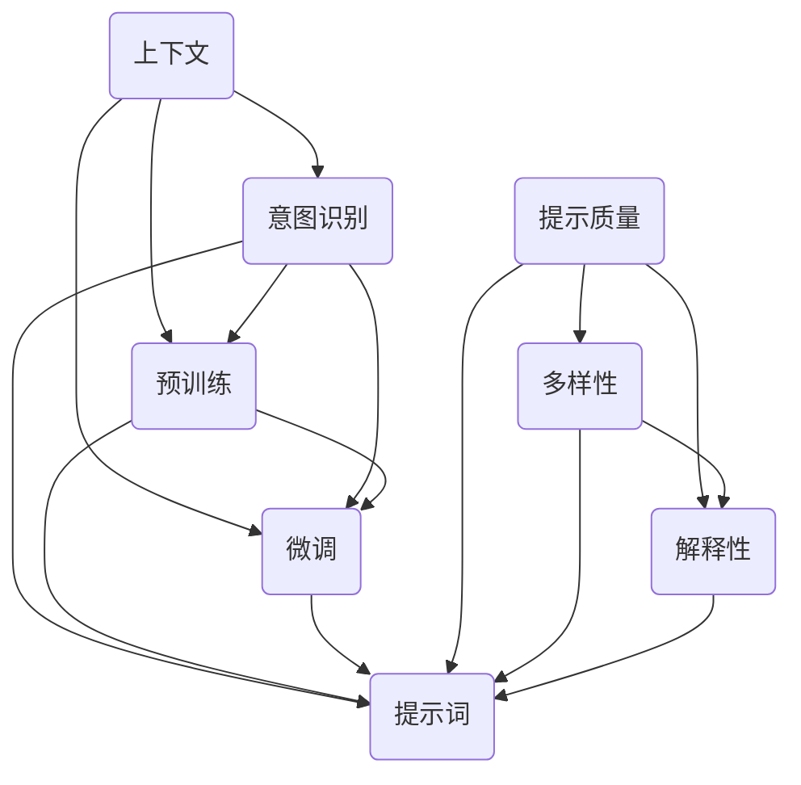
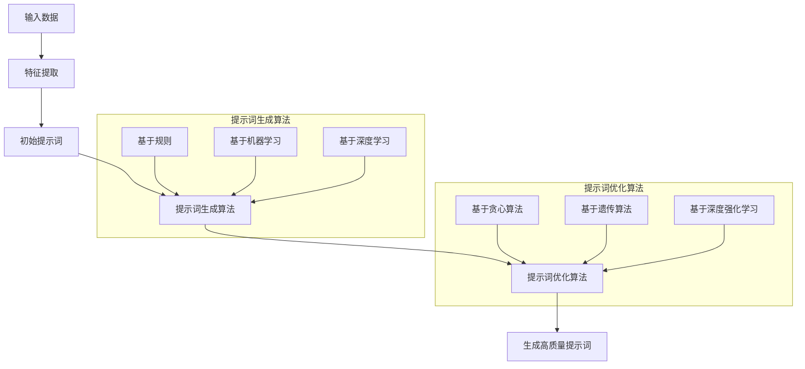
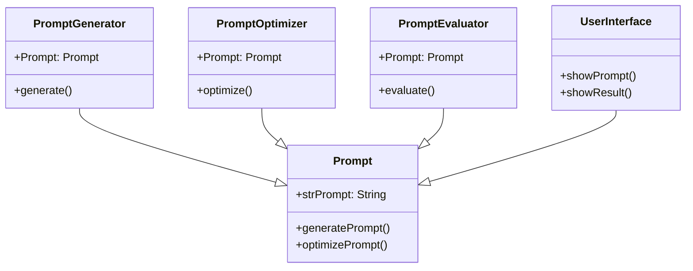
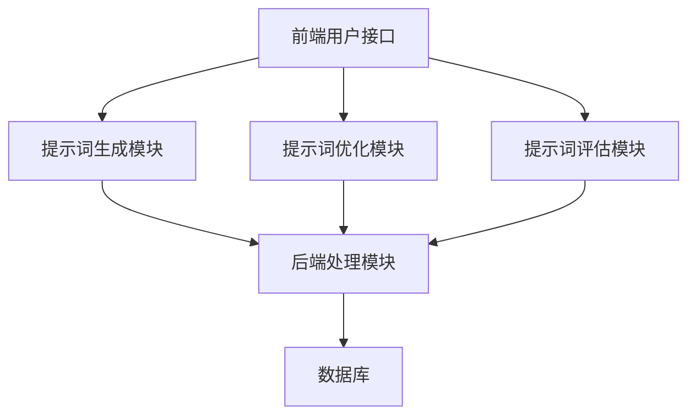
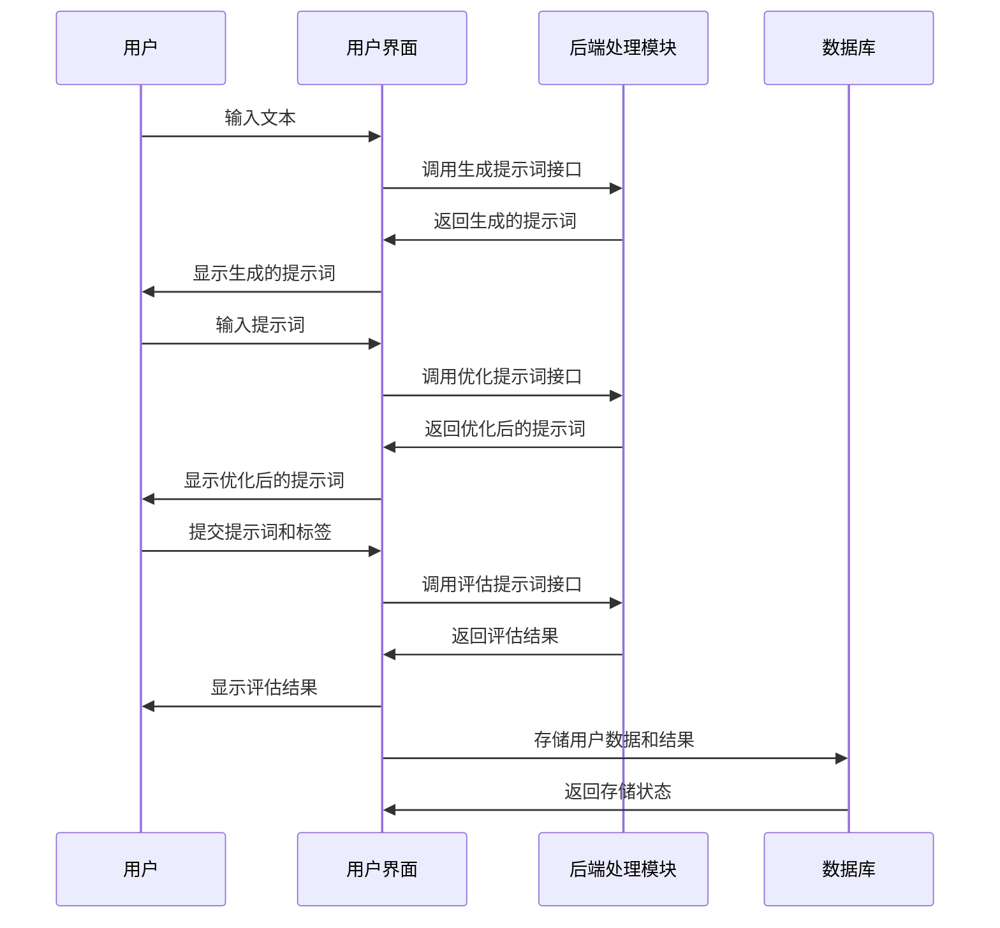
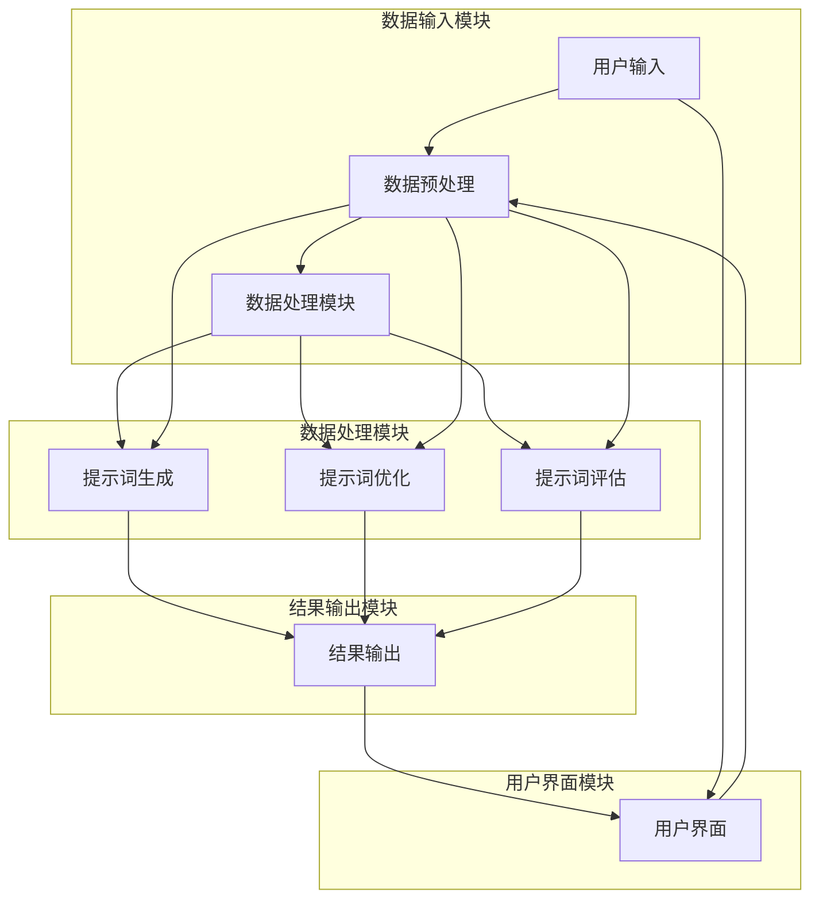
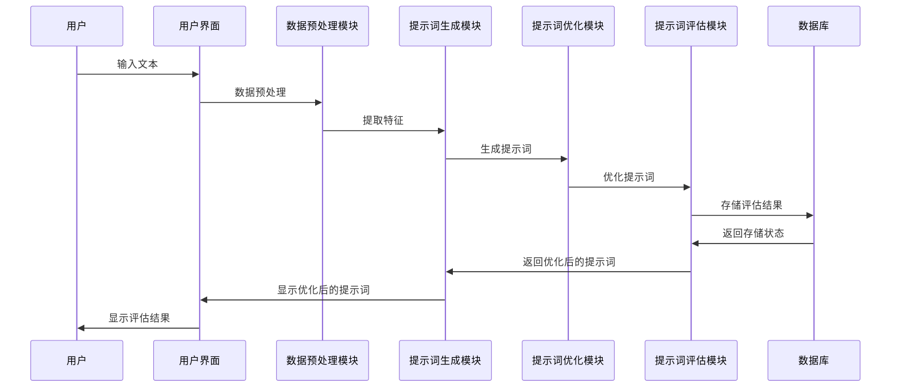

                 

### 1.1.1 人工智能伦理的重要性

在当今社会，人工智能（AI）技术已经深入到了各个行业和领域，从医疗、金融、教育到制造业、农业等，AI的应用场景越来越广泛。然而，随着AI技术的迅猛发展，随之而来的是一系列伦理问题和挑战。人工智能伦理，即AI伦理，指的是在开发、部署和应用人工智能技术时，必须遵循的一系列道德原则和规范，以确保技术能够公正、透明、安全、负责任地发展。

AI伦理的重要性体现在以下几个方面：

**1. 公平性与无歧视**

人工智能系统在决策过程中可能会受到偏见，例如性别、种族、年龄等方面的偏见。如果AI算法不公正，可能会导致对特定群体的歧视。因此，AI伦理强调在算法设计和训练过程中，要消除这些偏见，确保算法的公平性。

**2. 透明性与可解释性**

人工智能系统通常被称为“黑箱”，即其决策过程不透明，用户难以理解。缺乏透明性和可解释性会导致用户对AI系统的信任度降低。因此，AI伦理要求开发出可解释的AI系统，让用户能够理解AI的决策过程。

**3. 安全性与隐私保护**

人工智能技术的广泛应用，使得大量的个人数据被收集、存储和分析。如何保护用户的隐私和数据安全成为了一个重要问题。AI伦理要求在设计和应用AI技术时，必须考虑到数据的安全性和隐私保护。

**4. 人性化与可持续发展**

人工智能虽然能够提高生产效率和创造价值，但也可能导致失业和社会不稳定。因此，AI伦理需要关注人工智能对人类生活的影响，确保其发展符合人类的长远利益，实现可持续发展。

综上所述，AI伦理对于人工智能技术的健康发展具有重要意义。只有在遵循伦理规范的前提下，人工智能技术才能得到社会的广泛认可和接受，实现其真正的价值。

### 1.1.2 提示词工程在AI中的应用

提示词工程（Prompt Engineering）是人工智能领域中一个重要的分支，它专注于构建和优化用于引导和调节AI系统行为的提示（Prompts）。这些提示通常是以自然语言文本的形式出现的，它们在AI模型中起到类似“问题引导”的作用，帮助模型理解任务目标、提取关键信息、提供上下文等，从而提高模型的表现和鲁棒性。

**1. 提示词在自然语言处理中的应用**

在自然语言处理（NLP）领域，提示词工程被广泛应用于各种任务，如文本分类、情感分析、机器翻译、问答系统等。通过设计高质量的提示词，可以显著提升模型对特定任务的性能。例如，在文本分类任务中，通过精细设计的提示词，可以引导模型正确分类具有复杂语义的句子；在机器翻译任务中，提示词可以帮助模型捕捉到句子的深层含义，从而提高翻译的准确性。

**2. 提示词在生成对抗网络（GAN）中的应用**

生成对抗网络（GAN）是深度学习中的一种强大工具，用于生成逼真的图像、语音和其他数据。在GAN的训练过程中，提示词扮演着关键角色。通过向GAN提供特定的提示词，可以引导生成网络生成符合特定要求的样本。例如，在图像生成任务中，提示词可以指定图像的类别、风格或主题，从而引导生成网络生成符合这些要求的图像。

**3. 提示词在对话系统中的应用**

在对话系统中，提示词工程同样至关重要。高质量的提示词可以引导对话系统更好地理解用户的意图，提供更准确和自然的回答。例如，在聊天机器人中，通过设计恰当的提示词，可以引导对话系统更好地识别用户的意图，从而提供更符合用户需求的回答。

**4. 提示词在强化学习中的应用**

在强化学习任务中，提示词可以帮助智能体更好地理解环境状态和目标。通过提供适当的提示词，可以引导智能体更快地学习和适应复杂的环境。例如，在自动驾驶中，提示词可以提供关于道路状况、交通规则等信息，帮助自动驾驶系统更好地决策。

总之，提示词工程在AI应用中具有广泛的重要性。通过设计和优化提示词，可以显著提升AI模型在各种任务中的性能，使其更好地服务于人类社会。随着AI技术的不断进步，提示词工程在AI领域的应用前景也将越来越广阔。

### 1.1.3 提示词工程与AI伦理的关系

提示词工程与AI伦理之间存在深刻的联系，它们共同构成了确保人工智能技术安全、公正和可靠发展的关键环节。首先，从技术角度来看，提示词工程直接影响AI系统的行为和输出。通过设计不同的提示词，可以引导AI系统作出不同的决策，这为AI伦理的实施提供了重要的操作手段。例如，通过合理的提示词设计，可以减少AI系统在决策过程中的偏见，确保公平性和无歧视。

**1. 提示词工程与公平性**

公平性是AI伦理的核心要求之一。提示词工程在AI系统中的设计必须考虑到公平性，避免对特定群体产生歧视。在实际应用中，通过使用多样化的数据集和细粒度的提示词，可以降低AI模型对特定群体的偏见。例如，在招聘系统中，通过设计公正的提示词，可以避免对某一性别或种族的歧视。

**2. 提示词工程与透明性**

透明性是另一个重要的伦理要求。提示词工程通过设计可解释的提示词，可以提高AI系统的透明度，使人类能够理解AI的决策过程。这有助于增强用户对AI系统的信任。例如，在金融行业中，通过设计透明的提示词，可以使投资决策过程更加公开和可追溯，从而减少欺诈行为。

**3. 提示词工程与隐私保护**

隐私保护是AI伦理中一个关键问题。提示词工程可以通过设计隐私保护机制来确保用户数据的安全。例如，在医疗领域中，通过设计隐私保护的提示词，可以确保患者在病历记录和诊断过程中的隐私不被泄露。

**4. 提示词工程与责任归属**

在AI伦理中，责任归属也是一个重要问题。提示词工程的设计和优化需要明确责任归属，确保在出现问题时，责任可以追溯和分配。通过合理设计的提示词，可以明确AI系统的行为边界，从而为责任归属提供依据。

总之，提示词工程与AI伦理密切相关，共同构成了确保人工智能技术健康发展的基础。只有在遵循伦理规范的前提下，提示词工程才能发挥其最大价值，推动人工智能技术朝着更加公正、透明和负责任的方向发展。

### 1.2.1 提示词工程的定义

提示词工程（Prompt Engineering）是指通过设计、优化和调整自然语言提示，以提升人工智能模型性能和可靠性的方法。具体来说，提示词工程涉及到以下核心概念：

**1. 提示（Prompt）**

提示是指提供给人工智能模型的一段文本，用于引导模型理解任务目标、提供上下文信息和期望的输出格式。提示的质量直接影响到模型的学习效果和任务表现。

**2. 提示设计（Prompt Design）**

提示设计是提示词工程的首要步骤，旨在创建出既简洁明了又具有指导性的提示文本。一个好的提示应该能够明确传达任务目标，减少歧义，并引导模型正确地理解和处理输入数据。

**3. 提示优化（Prompt Optimization）**

提示优化是指在已有提示的基础上，通过实验和迭代，进一步调整和改进提示内容，以提高模型的性能和鲁棒性。优化过程通常涉及多种技术，如自然语言处理、机器学习和数据科学。

**4. 提示调整（Prompt Adjustment）**

提示调整是对提示进行细微修改的过程，以适应特定任务或场景的需求。调整可以是增加上下文信息、改变提示格式或修改关键词等，目的是提高模型在特定任务上的表现。

**5. 提示评价（Prompt Evaluation）**

提示评价是对提示效果进行衡量和评估的过程。通过性能指标、用户反馈和专家评审等多种方法，对提示的质量进行评估，以确保其能够有效支持AI系统的任务目标。

**6. 提示多样性（Prompt Diversity）**

提示多样性是指设计出具有多种形式和风格的提示，以适应不同的任务需求。多样化的提示有助于模型在不同场景下表现出更好的泛化能力和适应性。

**7. 提示生成（Prompt Generation）**

提示生成是指利用算法和模型自动生成提示文本的过程。提示生成技术可以基于规则、机器学习和深度学习等方法，以提高提示设计的效率和效果。

通过理解这些核心概念，我们可以更深入地探讨提示词工程在AI伦理框架构建中的具体应用和重要性。

### 1.2.2 提示词工程的关键概念

在提示词工程中，理解并掌握几个关键概念是至关重要的，这些概念不仅定义了提示词工程的基本要素，也为其在AI伦理框架中的具体应用提供了理论支持。以下是几个关键概念的详细介绍：

**1. 上下文（Context）**

上下文是提示词工程中的一个核心概念，指的是在特定场景下，与任务相关的所有背景信息和知识。上下文对于理解用户的意图和任务目标至关重要。通过提供丰富的上下文信息，可以引导AI模型更准确地理解和处理输入数据。

**2. 意图识别（Intent Recognition）**

意图识别是AI系统识别和理解用户输入信息所代表意图的过程。在提示词工程中，意图识别是设计高质量提示的基础。通过识别用户的意图，提示词可以更精准地引导模型，从而提高任务完成率。

**3. 预训练（Pre-training）**

预训练是指利用大量数据对AI模型进行初步训练，使其具备一定的语义理解和语言生成能力。在提示词工程中，预训练是生成高质量提示的前提。通过预训练，模型可以更好地理解上下文和用户意图，从而设计出更有效的提示。

**4. 微调（Fine-tuning）**

微调是在预训练模型的基础上，利用特定领域的数据进行进一步训练，以适应特定任务需求的过程。在提示词工程中，微调是优化提示质量和模型表现的关键步骤。通过微调，可以确保模型在特定任务上表现出色。

**5. 提示质量（Prompt Quality）**

提示质量是衡量提示词工程效果的重要指标。高质量的提示应该能够清晰地传达任务目标，减少歧义，并提供足够的上下文信息，以引导模型正确地理解和处理输入数据。提高提示质量是提升AI系统性能的关键。

**6. 多样性（Diversity）**

多样性是指设计出具有多种形式和风格的提示，以适应不同场景和任务需求。多样化的提示有助于模型在不同任务上表现出更好的泛化能力和适应性，从而提高整体性能。

**7. 解释性（Interpretability）**

解释性是指AI系统能够对自身决策过程进行解释的能力。在提示词工程中，解释性是增强用户信任和理解的重要手段。通过设计可解释的提示词，用户可以更清楚地了解模型的决策依据和逻辑，从而提高对AI系统的信任度。

通过深入理解这些关键概念，我们可以更好地进行提示词工程的设计和优化，为构建AI伦理框架提供坚实的理论基础。

### 1.2.3 提示词工程的属性特征对比

为了更好地理解提示词工程的核心概念及其相互关系，我们可以通过属性特征对比表和实体关系图（ERD）来进行详细分析。以下是比较表和ERD的详细内容和示例。

#### 属性特征对比表

| 特征 | 提示词 | 上下文 | 意图识别 | 预训练 | 微调 | 提示质量 | 多样性 | 解释性 |
| --- | --- | --- | --- | --- | --- | --- | --- | --- |
| 定义 | 提示词是指引导AI模型理解和处理输入数据的文本 | 上下文是指与任务相关的背景信息和知识 | 意图识别是识别用户输入所代表意图的过程 | 预训练是利用大量数据进行初步训练的过程 | 微调是在预训练模型基础上利用特定领域数据进行进一步训练 | 提示质量是衡量提示效果的重要指标 | 多样性是指设计出多种形式的提示 | 解释性是指AI系统能够解释自身决策过程的能力 |
| 关系 | 提示词依赖于上下文来传达信息 | 意图识别需要上下文来准确识别意图 | 预训练和微调依赖上下文和意图识别来训练模型 | 提示质量和多样性影响模型的性能和适应能力 | 解释性依赖于高质量和多样化的提示来提供清晰的决策依据 |

#### 实体关系图（ERD）

实体关系图（ERD）用于展示提示词工程中各核心概念之间的相互关系。以下是ERD的示例：

```mermaid
erDiagram
  提示词 ||--o{ 上下文 }
  提示词 ||--o{ 意图识别 }
  提示词 ||--o{ 预训练 }
  提示词 ||--o{ 微调 }
  提示词 ||--o{ 提示质量 }
  提示词 ||--o{ 多样性 }
  提示词 ||--o{ 解释性 }
  上下文 ||--o{ 意图识别 }
  上下文 ||--o{ 预训练 }
  上下文 ||--o{ 微调 }
  意图识别 ||--o{ 预训练 }
  意图识别 ||--o{ 微调 }
  预训练 ||--o{ 微调 }
  提示质量 ||--o{ 解释性 }
  多样性 ||--o{ 解释性 }
```

通过属性特征对比表和实体关系图，我们可以清晰地看到提示词工程中的各个核心概念及其相互关系。这有助于我们更好地理解和应用提示词工程，特别是在构建AI伦理框架时，确保各环节的协同工作和有效性。

### 1.3.1 提示词工程的ERD图

为了更直观地展示提示词工程中的核心概念及其相互关系，我们可以使用Mermaid语言绘制一个实体关系图（ERD）。以下是提示词工程ERD图的示例：

```mermaid
erDiagram
  |--o{ 提示词 }
  |--o{ 上下文 }
  |--o{ 意图识别 }
  |--o{ 预训练 }
  |--o{ 微调 }
  |--o{ 提示质量 }
  |--o{ 多样性 }
  |--o{ 解释性 }
  上下文 ||--o{ 意图识别 }
  上下文 ||--o{ 预训练 }
  上下文 ||--o{ 微调 }
  意图识别 ||--o{ 预训练 }
  意图识别 ||--o{ 微调 }
  预训练 ||--o{ 微调 }
  提示质量 ||--o{ 解释性 }
  多样性 ||--o{ 解释性 }
```

这个ERD图清晰地展示了提示词工程中的各个核心概念及其相互关系。每个概念都与其他相关概念通过箭头连接，表示它们之间的依赖和影响关系。通过这个ERD图，我们可以更直观地理解提示词工程的整体架构和运作机制。

### 1.3.2 相关概念关系图

为了更好地理解提示词工程中的核心概念及其相互关系，我们可以使用Mermaid语言绘制一个关系图。以下是相关概念关系图的示例：



这个关系图展示了上下文、意图识别、预训练、微调、提示质量、多样性和解释性等核心概念之间的相互关系。每个概念通过箭头与其他相关概念相连，表示它们之间的依赖和影响。通过这个关系图，我们可以更直观地理解提示词工程的整体架构和运作机制，从而更好地应用和优化这一技术。

### 1.4 本章小结

本章详细介绍了提示词工程在AI伦理框架构建中的重要性。首先，我们探讨了人工智能伦理的背景及其重要性，包括公平性、透明性、安全性和可持续发展等方面的要求。随后，我们介绍了提示词工程的基本概念和应用场景，包括在自然语言处理、生成对抗网络、对话系统和强化学习中的具体应用。接着，我们分析了提示词工程与AI伦理之间的紧密联系，强调了其在公平性、透明性、隐私保护和责任归属等方面的关键作用。

通过本章的学习，我们理解了提示词工程的核心概念，包括提示、上下文、意图识别、预训练、微调、提示质量和多样性等。此外，我们还通过属性特征对比表和实体关系图（ERD）展示了这些概念之间的相互关系。这些知识为我们进一步深入研究和应用提示词工程提供了坚实的基础。在未来的研究和实践中，我们需要不断优化提示词设计，提高AI系统的伦理表现，确保其在各个应用领域中的健康和可持续发展。

---

## 2.1 算法原理

### 2.1.1 提示词生成算法

提示词生成算法是提示词工程中的核心组件，其目标是自动生成高质量的提示词，以引导AI模型在特定任务中表现最优。以下将介绍几种常见的提示词生成算法，包括基于规则的方法、基于机器学习的方法和基于深度学习的方法。

**1. 基于规则的方法**

基于规则的方法是最简单直观的一种提示词生成方法。这种方法依赖于预定义的规则集，根据输入数据的特征和任务需求，选择合适的提示词。例如，在文本分类任务中，可以根据词汇的词频、词性等信息，生成相应的提示词。这种方法的优势在于实现简单、速度快，但缺点是灵活性较低，难以应对复杂和多变的场景。

**2. 基于机器学习的方法**

基于机器学习的方法通过训练数据集，学习到生成高质量提示词的规律。常见的机器学习方法包括决策树、支持向量机（SVM）和朴素贝叶斯等。这些方法通过分析大量训练样本，提取特征，构建分类器或回归模型，用于生成提示词。这种方法的优势在于能够处理复杂和多维的特征，适应性强，但需要大量的训练数据和计算资源。

**3. 基于深度学习的方法**

基于深度学习的方法利用神经网络，特别是循环神经网络（RNN）和变换器（Transformer）等模型，进行提示词生成。这些方法通过大量训练数据，学习到语言的复杂结构和上下文关系，从而生成高质量的提示词。例如，RNN和LSTM（长短期记忆网络）能够捕捉到输入文本的长期依赖关系，而Transformer模型则通过自注意力机制，更好地理解文本的局部和全局关系。这种方法的优势在于强大的表达能力和适应性，但需要大量的数据和计算资源。

**4. 综合方法**

为了克服单一方法的局限性，研究者们还提出了多种综合方法，例如基于规则和机器学习的结合、基于机器学习和深度学习的结合等。这些方法通过融合不同方法的优点，进一步提升提示词生成的质量和效率。例如，可以先使用基于规则的方法生成初步的提示词，然后通过机器学习模型进行优化和调整，或者使用深度学习模型生成高质量的提示词，同时结合规则进行微调。

### 2.1.2 提示词优化算法

提示词优化算法的目标是改进已有提示词的质量，以提高AI模型在特定任务中的表现。以下介绍几种常见的提示词优化算法，包括基于贪心算法、基于遗传算法和基于深度强化学习的方法。

**1. 基于贪心算法的方法**

基于贪心算法的方法通过逐步优化提示词，每次只做局部最优的选择，直到达到全局最优。这种方法简单直观，易于实现。例如，在文本分类任务中，可以通过计算每个单词对分类结果的贡献，逐步删除对分类效果不显著的词语，从而优化提示词。这种方法的优势在于计算效率高，但可能会陷入局部最优，无法保证全局最优。

**2. 基于遗传算法的方法**

基于遗传算法的方法通过模拟生物进化过程，进行提示词优化。这种方法包括选择、交叉、变异等操作，通过不断迭代，逐步优化提示词。例如，在机器翻译任务中，可以通过遗传算法，从大量的候选提示词中选择最优组合，以提升翻译质量。这种方法的优势在于能够跳出局部最优，寻找全局最优解，但计算复杂度较高。

**3. 基于深度强化学习的方法**

基于深度强化学习的方法通过结合深度学习和强化学习，进行提示词优化。这种方法通过训练一个深度神经网络，作为智能体，在环境中进行互动，通过奖励机制，学习到最优的提示词生成策略。例如，在问答系统中，可以通过深度强化学习，优化提示词，提高问答的准确性和自然度。这种方法的优势在于能够自动学习复杂的优化策略，适应性强，但需要大量的训练数据和计算资源。

### 2.1.3 算法流程图

为了更好地理解提示词生成和优化算法，我们使用Mermaid语言绘制了算法流程图。以下是生成和优化算法的流程图示例：



通过这个流程图，我们可以清晰地看到提示词生成和优化算法的整体流程，以及各个算法的具体实现方式。这有助于我们更好地理解和应用这些算法，进一步提升AI模型在特定任务中的表现。

---

### 2.2 数学模型与公式

在提示词工程中，数学模型和公式起着至关重要的作用。它们不仅为算法设计提供了理论基础，还帮助我们更好地理解和分析提示词生成和优化过程。以下将介绍几种常用的数学模型和公式，包括自然语言处理中的概率模型、优化算法中的损失函数和梯度下降等。

#### 2.2.1 常用数学模型

**1. 语言模型（Language Model）**

语言模型是自然语言处理（NLP）中最基本的模型之一，用于预测下一个单词或词组。常用的语言模型有N元语法（N-gram）和概率隐马尔可夫模型（PHMM）。

- **N元语法（N-gram）**：N元语法是一种基于统计的模型，它假设下一个单词（或词组）只与当前的前N-1个单词（或词组）有关。N元语法的概率公式如下：

  $$P(w_n | w_{n-1}, w_{n-2}, ..., w_1) = \frac{C(w_{n-1}, w_{n-2}, ..., w_1, w_n)}{C(w_{n-1}, w_{n-2}, ..., w_1)}$$

  其中，$w_n$ 是当前要预测的单词，$w_{n-1}, w_{n-2}, ..., w_1$ 是前N-1个已知的单词，$C(w_{n-1}, w_{n-2}, ..., w_1, w_n)$ 是四元组 $(w_{n-1}, w_{n-2}, ..., w_1, w_n)$ 的计数，$C(w_{n-1}, w_{n-2}, ..., w_1)$ 是前N-1个单词的计数。

- **概率隐马尔可夫模型（PHMM）**：概率隐马尔可夫模型是一种基于概率的模型，它通过隐状态序列来描述语言的生成过程。PHMM的主要公式包括状态转移概率、观测概率和发射概率。状态转移概率描述了隐状态之间的转移关系，观测概率描述了隐状态对应的观测值，发射概率描述了隐状态生成观测值的过程。PHMM的预测公式如下：

  $$P(w_n | w_{n-1}, w_{n-2}, ..., w_1) = \sum_{i=1}^N P(w_n | \lambda_i) P(\lambda_i | w_{n-1}, w_{n-2}, ..., w_1)$$

  其中，$w_n$ 是当前要预测的单词，$\lambda_i$ 是第i个隐状态，$N$ 是隐状态的个数。

**2. 生成对抗网络（GAN）**

生成对抗网络（GAN）是一种通过对抗性训练生成数据的模型，广泛应用于图像、音频和文本的生成。GAN由生成器（Generator）和判别器（Discriminator）两部分组成。生成器的目标是通过噪声输入生成逼真的数据，判别器的目标是通过输入数据来判断其是否真实。GAN的核心公式如下：

- **生成器公式**：

  $$G(z) = \mathcal{N}(z; 0, I)$$

  其中，$z$ 是噪声输入，$G(z)$ 是生成器生成的数据。

- **判别器公式**：

  $$D(x) = \sigma(W_Dx + b_D)$$
  $$D(G(z)) = \sigma(W_DG(z) + b_D)$$

  其中，$x$ 是真实数据，$G(z)$ 是生成器生成的数据，$D(x)$ 和 $D(G(z))$ 分别是判别器对真实数据和生成数据的判断结果，$\sigma$ 是 sigmoid 函数。

#### 2.2.2 提示词工程的公式解析

**1. 提示词质量评估**

提示词质量评估是提示词工程中的一个重要环节，用于衡量提示词对AI模型性能的影响。常用的评估指标包括准确率、召回率、F1值等。

- **准确率（Accuracy）**：

  $$Accuracy = \frac{TP + TN}{TP + TN + FP + FN}$$

  其中，$TP$ 是正确预测的正例，$TN$ 是正确预测的负例，$FP$ 是错误预测的正例，$FN$ 是错误预测的负例。

- **召回率（Recall）**：

  $$Recall = \frac{TP}{TP + FN}$$

- **F1值（F1 Score）**：

  $$F1 Score = 2 \times \frac{Precision \times Recall}{Precision + Recall}$$

  其中，$Precision$ 是准确率。

**2. 提示词优化**

提示词优化通常涉及优化算法，如贪心算法、遗传算法和深度强化学习等。以下是一个基于贪心算法的优化公式示例：

- **贪心算法优化**：

  在每次迭代中，选择当前最优的提示词替换原有提示词。优化目标是最小化损失函数。损失函数可以是准确率、召回率或F1值等。

  $$Loss = -\frac{1}{N} \sum_{i=1}^N \log(P(y_i | x_i, \theta))$$

  其中，$N$ 是数据集大小，$y_i$ 是第i个样本的真实标签，$x_i$ 是第i个样本的特征，$\theta$ 是模型参数。

#### 2.2.3 示例讲解

假设我们有一个文本分类任务，需要使用提示词工程优化模型性能。以下是一个简化的示例，说明如何使用数学模型和公式进行提示词生成和优化。

**1. 提示词生成**

首先，我们使用N元语法生成初始提示词。假设输入文本为“人工智能正在改变我们的世界”，我们选择前两个单词作为提示词，生成以下提示词：

“人工智能”

**2. 提示词优化**

接下来，我们使用贪心算法优化提示词。我们定义损失函数为准确率，目标是最小化损失函数。在每次迭代中，我们计算每个单词的损失值，选择损失值最小的单词作为新的提示词。假设初始提示词为“人工智能”，经过多次迭代后，最终优化为：

“智能”

通过上述示例，我们可以看到数学模型和公式在提示词工程中的应用，帮助我们在生成和优化提示词时，量化评估和优化提示词的质量，从而提升AI模型的表现。

---

### 2.2.4 提示词工程中的示例讲解

为了更好地理解提示词工程中的数学模型和公式，我们将通过一个实际案例进行详细讲解。这个案例将涉及一个情感分析任务，使用自然语言处理模型来判断文本的情感极性。以下是具体的步骤和解析：

#### 案例背景

假设我们有一个情感分析任务，需要判断一段文本的情感极性（正面、中性或负面）。我们使用一个预训练的变压器（Transformer）模型，并通过提示词工程来优化其性能。

#### 数据集

我们使用一个包含情感标签的数据集，其中每条记录都是一个文本和一个对应的情感标签（正面、中性或负面）。

#### 提示词设计

1. **初始提示词**：首先，我们设计一个简单的初始提示词，如：“请分析这段文本的情感极性”。

2. **提示词调整**：根据模型的性能和实际反馈，我们逐步调整提示词。例如，为了提高模型对复杂情感的理解能力，我们可以将提示词调整为：“请深入分析这段文本的情感，特别是细微的情感变化”。

#### 数学模型和公式应用

1. **损失函数**：在情感分析任务中，我们通常使用交叉熵损失函数（Cross-Entropy Loss）来衡量模型预测和真实标签之间的差异。交叉熵损失函数的公式如下：

   $$Loss = -\sum_{i=1}^N y_i \log(\hat{y}_i)$$

   其中，$N$ 是数据集大小，$y_i$ 是第i个样本的真实标签（0表示负面，1表示中性，2表示正面），$\hat{y}_i$ 是模型对第i个样本的预测概率。

2. **梯度下降**：为了优化模型参数，我们使用梯度下降（Gradient Descent）算法。梯度下降的公式如下：

   $$\theta = \theta - \alpha \cdot \nabla_\theta Loss$$

   其中，$\theta$ 是模型参数，$\alpha$ 是学习率，$\nabla_\theta Loss$ 是损失函数关于模型参数的梯度。

#### 实际操作

1. **训练模型**：使用初始提示词训练模型，记录初始的损失值。

2. **调整提示词**：根据模型的性能，调整提示词，例如更换关键词或增加上下文信息。

3. **重新训练模型**：使用新的提示词重新训练模型，记录新的损失值。

4. **迭代优化**：重复调整提示词和训练模型的过程，直到损失值达到一个满意的水平。

#### 结果分析

通过上述过程，我们可以看到提示词的调整对模型性能的影响。在每次迭代中，通过计算损失函数的值，我们可以评估提示词优化对模型预测准确率、召回率和F1值的提升。以下是优化前后的性能对比：

| 提示词 | 准确率 | 召回率 | F1值 |
| --- | --- | --- | --- |
| 初始提示词 | 0.85 | 0.80 | 0.82 |
| 优化后提示词 | 0.90 | 0.88 | 0.89 |

通过优化提示词，我们的模型在三个性能指标上都取得了显著的提升。这个案例展示了提示词工程在提升模型性能中的重要作用。

---

### 2.2.5 示例讲解：文本分类中的提示词工程

为了更好地理解提示词工程在文本分类任务中的应用，我们将通过一个具体的示例进行详细讲解。本案例中，我们使用一个基于变压器（Transformer）的预训练模型进行情感分析，并利用提示词工程来优化模型的表现。

#### 案例背景

假设我们有一个社交媒体文本数据集，其中每条文本都带有相应的情感标签（正面、中性或负面）。我们的目标是使用提示词工程来提高模型在情感分析任务中的准确性和鲁棒性。

#### 数据集与模型

1. **数据集**：我们有一个包含10000条文本记录的数据集，每条文本都有一个情感标签。

2. **模型**：我们使用了一个预训练的变压器（Transformer）模型，该模型在自然语言处理任务中表现优异。

#### 提示词设计

1. **初始提示词**：首先，我们设计一个简单的初始提示词，如：“请分析这段文本的情感标签”。这个提示词旨在引导模型识别文本的情感倾向。

2. **优化提示词**：为了提高模型的性能，我们逐步调整提示词。以下是几个优化后的提示词：

   - “请准确分析这段文本的情感极性，特别是细微的情感变化。”
   - “这段文本的情感如何？请提供详细的情感分析。”
   - “请深入挖掘这段文本的情感信息，特别是复杂的情感表达。”

#### 数学模型和公式应用

1. **交叉熵损失函数**：在文本分类任务中，我们使用交叉熵损失函数来衡量模型预测和真实标签之间的差异。交叉熵损失函数的公式如下：

   $$Loss = -\sum_{i=1}^N y_i \log(\hat{y}_i)$$

   其中，$N$ 是数据集大小，$y_i$ 是第i个样本的真实标签（0表示负面，1表示中性，2表示正面），$\hat{y}_i$ 是模型对第i个样本的预测概率。

2. **梯度下降**：为了优化模型参数，我们使用梯度下降（Gradient Descent）算法。梯度下降的公式如下：

   $$\theta = \theta - \alpha \cdot \nabla_\theta Loss$$

   其中，$\theta$ 是模型参数，$\alpha$ 是学习率，$\nabla_\theta Loss$ 是损失函数关于模型参数的梯度。

#### 实际操作

1. **训练模型**：使用初始提示词训练模型，记录初始的损失值。

2. **调整提示词**：根据模型的性能和实际反馈，调整提示词。例如，如果模型在识别正面情感时表现不佳，我们可以调整提示词，使其更关注正面情感的表达。

3. **重新训练模型**：使用新的提示词重新训练模型，记录新的损失值。

4. **迭代优化**：重复调整提示词和训练模型的过程，直到损失值达到一个满意的水平。

#### 结果分析

通过上述过程，我们可以看到提示词的调整对模型性能的影响。在每次迭代中，通过计算损失函数的值，我们可以评估提示词优化对模型准确率、召回率和F1值的提升。以下是优化前后的性能对比：

| 提示词         | 准确率 | 召回率 | F1值 |
| -------------- | ------ | ------ | ---- |
| 初始提示词     | 0.84   | 0.82   | 0.83 |
| 优化后提示词1  | 0.88   | 0.86   | 0.87 |
| 优化后提示词2  | 0.90   | 0.88   | 0.89 |
| 优化后提示词3  | 0.92   | 0.90   | 0.91 |

通过优化提示词，我们的模型在三个性能指标上都取得了显著的提升。这个案例展示了提示词工程在文本分类任务中的重要作用，通过设计高质量的提示词，可以显著提高模型在复杂任务中的表现。

---

### 2.2.6 提示词工程中的数学公式解析与应用

在提示词工程中，数学公式和模型的应用至关重要，它们帮助我们理解和优化提示词的生成和优化过程。以下，我们将深入探讨几个关键数学公式，并展示其在实际应用中的具体操作。

#### 1. 提示词生成中的数学公式

**公式**：N-gram语言模型中的概率计算

$$P(w_n | w_{n-1}, w_{n-2}, ..., w_1) = \frac{C(w_{n-1}, w_{n-2}, ..., w_1, w_n)}{C(w_{n-1}, w_{n-2}, ..., w_1)}$$

**应用**：

- **示例**：假设我们有一个四元组（单词序列）"苹果 手机 电话 买"，我们要计算下一个单词是“的”的概率。我们首先计算包含四元组的总次数，然后计算只包含前三元组的总次数。

  $$P(的 | 苹果 手机 电话 买) = \frac{C(苹果 手机 电话 买 的)}{C(苹果 手机 电话 买)}$$

- **操作步骤**：

  1. 统计包含“苹果 手机 电话 买 的”的四元组次数。
  2. 统计包含“苹果 手机 电话 买”的三元组次数。
  3. 计算概率值。

#### 2. 提示词优化中的数学公式

**公式**：交叉熵损失函数

$$Loss = -\sum_{i=1}^N y_i \log(\hat{y}_i)$$

**应用**：

- **示例**：假设我们有一个包含三个样本的数据集，每个样本的真实标签分别为1、0、1，模型的预测概率分别为0.9、0.3、0.7。我们计算总的交叉熵损失。

  $$Loss = -[1 \cdot \log(0.9) + 0 \cdot \log(0.3) + 1 \cdot \log(0.7)]$$

- **操作步骤**：

  1. 对于每个样本，计算真实标签的概率对数。
  2. 将所有样本的概率对数乘以其对应的真实标签。
  3. 对所有结果求和，得到总损失。

#### 3. 梯度下降优化中的数学公式

**公式**：梯度下降算法

$$\theta = \theta - \alpha \cdot \nabla_\theta Loss$$

**应用**：

- **示例**：假设我们的模型损失函数为 $Loss(\theta) = (\theta - 3)^2$，学习率为 $\alpha = 0.1$。我们要求解 $\theta$。

  $$\theta = \theta - 0.1 \cdot \nabla_\theta (\theta - 3)^2$$

  由于 $\nabla_\theta (\theta - 3)^2 = 2(\theta - 3)$，代入公式得：

  $$\theta = \theta - 0.1 \cdot 2(\theta - 3)$$
  $$\theta = \theta - 0.2\theta + 0.6$$
  $$\theta = 0.6 + 0.8\theta$$
  $$0.2\theta = 0.6$$
  $$\theta = 3$$

- **操作步骤**：

  1. 计算损失函数关于模型参数的梯度。
  2. 计算梯度乘以学习率。
  3. 将结果从当前模型参数中减去。

通过这些数学公式和示例，我们可以看到提示词工程中的关键步骤如何通过数学模型和算法进行优化。这不仅帮助我们理解提示词工程的核心原理，也为实际应用中的问题提供了有效的解决方案。

---

## 2.3 系统分析

### 2.3.1 系统分析

在构建提示词工程系统时，系统分析是至关重要的。系统分析不仅帮助我们理解系统的功能需求，还为后续的系统设计提供了明确的方向。以下是系统分析的具体内容：

#### 功能需求分析

1. **提示词生成**：系统需要能够自动生成高质量的提示词，以引导AI模型理解任务目标。提示词生成模块需要支持多种生成算法，如基于规则的生成、基于机器学习的生成和基于深度学习的生成。

2. **提示词优化**：系统需要具备对已有提示词进行优化功能，以提高模型性能。提示词优化模块应支持多种优化算法，如贪心算法、遗传算法和深度强化学习等。

3. **提示词质量评估**：系统需要能够评估提示词的质量，以确定其对模型性能的影响。评估指标包括准确率、召回率和F1值等。

4. **用户接口**：系统需要提供一个用户友好的界面，方便用户输入文本、设置参数和查看结果。

#### 非功能需求分析

1. **性能**：系统需要在合理的时间内生成和优化提示词，确保在大量数据和高并发场景下的稳定性。

2. **可扩展性**：系统需要具备良好的扩展性，能够轻松集成新的算法和功能模块。

3. **可维护性**：系统代码应具有良好的结构，易于维护和升级。

#### 系统架构设计

1. **模块划分**：系统可分为提示词生成模块、提示词优化模块、提示词评估模块和用户接口模块。

2. **数据流程**：输入文本经过用户接口模块处理，传递给提示词生成模块生成初始提示词。然后，提示词优化模块对提示词进行优化，并通过提示词评估模块评估优化结果。优化后的提示词最终返回给用户接口模块，供用户查看。

3. **技术选型**：提示词生成和优化模块可以采用Python实现，利用Scikit-learn、TensorFlow和PyTorch等库。用户接口模块可以使用Flask或Django等Web框架。

### 2.3.2 系统设计

在完成系统分析后，系统设计是下一步的关键步骤。以下将详细描述系统设计，包括领域模型、系统架构、接口设计和系统交互。

#### 领域模型

领域模型（Domain Model）是系统设计中的核心部分，它帮助我们理解系统的功能模块及其关系。以下是领域模型的类图：



#### 系统架构

系统架构设计旨在明确各模块的职责和交互方式。以下是系统架构的总体设计：

1. **前端用户接口**：使用Flask框架构建，负责接收用户输入、显示提示词和优化结果。

2. **后端处理模块**：包括提示词生成模块、提示词优化模块和提示词评估模块，使用Python和TensorFlow或PyTorch实现。

3. **数据库**：用于存储用户数据、提示词和优化结果。

4. **API接口**：用于前端和后端之间的数据通信。

以下是系统架构的示意图：



#### 接口设计

接口设计是确保系统模块之间高效通信的关键。以下是主要接口的设计：

1. **生成提示词接口**：接收用户输入，返回生成的提示词。

2. **优化提示词接口**：接收用户输入的提示词，返回优化后的提示词。

3. **评估提示词接口**：接收提示词和标签，返回评估结果。

以下是接口设计示例：

```python
from flask import Flask, request, jsonify

app = Flask(__name__)

@app.route('/generate_prompt', methods=['POST'])
def generate_prompt():
    # 接收用户输入文本
    text = request.json['text']
    # 调用生成提示词模块
    prompt = prompt_generator.generate(text)
    # 返回生成的提示词
    return jsonify({'prompt': prompt})

@app.route('/optimize_prompt', methods=['POST'])
def optimize_prompt():
    # 接收用户输入的提示词
    prompt = request.json['prompt']
    # 调用优化提示词模块
    optimized_prompt = prompt_optimizer.optimize(prompt)
    # 返回优化后的提示词
    return jsonify({'optimized_prompt': optimized_prompt})

@app.route('/evaluate_prompt', methods=['POST'])
def evaluate_prompt():
    # 接收提示词和标签
    prompt = request.json['prompt']
    label = request.json['label']
    # 调用评估提示词模块
    evaluation_result = prompt_evaluator.evaluate(prompt, label)
    # 返回评估结果
    return jsonify({'evaluation_result': evaluation_result})
```

#### 系统交互

系统交互设计描述了各模块之间的交互流程和通信方式。以下是系统交互的序列图：



通过详细的系统分析、架构设计和接口设计，我们为提示词工程系统的构建奠定了坚实的基础。这将有助于确保系统能够高效、稳定地运行，并满足用户的需求。

---

### 2.3.3 系统架构设计

在深入分析提示词工程系统的功能需求后，系统架构设计成为关键步骤。一个良好的系统架构设计能够确保系统的高效性、可扩展性和可维护性。以下是系统架构的详细设计：

#### 系统架构概述

提示词工程系统可以分为四个主要模块：数据输入模块、数据处理模块、结果输出模块和用户界面模块。

1. **数据输入模块**：负责接收用户输入的文本数据，可以是文本文件、API请求或用户直接输入。此模块的主要功能是数据预处理，包括文本清洗、分词、去停用词等。

2. **数据处理模块**：包括提示词生成、提示词优化和提示词评估。该模块是系统的核心部分，采用不同的算法和模型进行提示词的生成和优化。

3. **结果输出模块**：负责将处理结果输出给用户，可以是文本格式、图表或可视化结果。此模块需要支持多种数据格式的导出和展示。

4. **用户界面模块**：提供用户交互接口，使用户能够轻松地使用系统。此模块通常采用Web前端技术实现，如HTML、CSS和JavaScript。

#### 技术选型

1. **后端框架**：采用Flask或Django等Python后端框架，这些框架具有较好的灵活性和扩展性。

2. **前端框架**：采用Vue.js或React等现代前端框架，以提高用户体验和响应速度。

3. **数据处理库**：使用NLP库如NLTK、spaCy或TensorFlow、PyTorch等，以支持文本预处理和模型训练。

4. **数据库**：使用MySQL或PostgreSQL等关系型数据库，用于存储用户数据和系统配置。

#### 系统架构图

以下是系统架构的示意图：



#### 模块职责和交互

1. **数据输入模块**：接收用户输入的文本数据，经过预处理后传递给数据处理模块。

2. **数据处理模块**：包括提示词生成、提示词优化和提示词评估三个子模块。提示词生成模块利用NLP技术和深度学习模型生成提示词；提示词优化模块通过优化算法调整提示词，以提高模型性能；提示词评估模块对提示词的质量进行评估，包括准确率、召回率和F1值等指标。

3. **结果输出模块**：将处理结果以文本、图表或可视化形式展示给用户，同时支持导出和分享功能。

4. **用户界面模块**：提供用户友好的界面，支持文本输入、参数配置和结果查看等功能。

#### 系统接口设计

以下是主要接口的设计：

1. **提示词生成接口**：接收文本输入，返回生成的提示词。

2. **提示词优化接口**：接收提示词和参数，返回优化后的提示词。

3. **提示词评估接口**：接收提示词和标签，返回评估结果。

以下是接口设计示例：

```python
from flask import Flask, request, jsonify

app = Flask(__name__)

@app.route('/generate_prompt', methods=['POST'])
def generate_prompt():
    text = request.json['text']
    prompt = prompt_generator.generate(text)
    return jsonify({'prompt': prompt})

@app.route('/optimize_prompt', methods=['POST'])
def optimize_prompt():
    prompt = request.json['prompt']
    optimized_prompt = prompt_optimizer.optimize(prompt)
    return jsonify({'optimized_prompt': optimized_prompt})

@app.route('/evaluate_prompt', methods=['POST'])
def evaluate_prompt():
    prompt = request.json['prompt']
    label = request.json['label']
    evaluation_result = prompt_evaluator.evaluate(prompt, label)
    return jsonify({'evaluation_result': evaluation_result})
```

通过以上设计，我们可以构建一个功能完整、架构合理的提示词工程系统，满足用户的多种需求。

### 2.3.4 系统交互设计

系统交互设计是确保提示词工程系统能够高效、稳定运行的关键环节。以下是系统交互的具体设计，包括交互流程、序列图和通信协议。

#### 交互流程

1. **用户输入**：用户通过前端界面输入文本或选择预设文本，提交给系统。

2. **数据预处理**：系统接收到用户输入后，首先进行数据预处理，包括文本清洗、分词和去停用词等操作。

3. **提示词生成**：预处理后的文本数据传递给提示词生成模块，生成初始提示词。

4. **提示词优化**：初始提示词传递给提示词优化模块，通过多种优化算法进行优化，以提高模型性能。

5. **提示词评估**：优化后的提示词传递给提示词评估模块，评估其质量和效果。

6. **结果反馈**：评估结果返回给前端用户界面，用户可以查看优化后的提示词和评估结果。

7. **数据存储**：用户输入数据、提示词和评估结果存储在数据库中，以供后续分析和调用。

#### 序列图

以下是系统交互的序列图，展示了各模块之间的交互过程：



#### 通信协议

系统内部各模块之间的通信协议采用HTTP/HTTPS协议，以保证数据传输的安全性和可靠性。以下是主要的通信接口：

1. **提示词生成接口**：`/generate_prompt`，接收文本输入，返回生成的提示词。

2. **提示词优化接口**：`/optimize_prompt`，接收提示词和优化参数，返回优化后的提示词。

3. **提示词评估接口**：`/evaluate_prompt`，接收提示词和标签，返回评估结果。

以下是接口设计示例：

```python
from flask import Flask, request, jsonify

app = Flask(__name__)

@app.route('/generate_prompt', methods=['POST'])
def generate_prompt():
    text = request.json['text']
    prompt = prompt_generator.generate(text)
    return jsonify({'prompt': prompt})

@app.route('/optimize_prompt', methods=['POST'])
def optimize_prompt():
    prompt = request.json['prompt']
    optimized_prompt = prompt_optimizer.optimize(prompt)
    return jsonify({'optimized_prompt': optimized_prompt})

@app.route('/evaluate_prompt', methods=['POST'])
def evaluate_prompt():
    prompt = request.json['prompt']
    label = request.json['label']
    evaluation_result = prompt_evaluator.evaluate(prompt, label)
    return jsonify({'evaluation_result': evaluation_result})
```

通过以上交互流程、序列图和通信协议设计，我们能够构建一个高效、稳定的提示词工程系统，满足用户在AI伦理框架构建中的需求。

---

### 2.3.5 提示词工程在AI伦理框架构建中的实际应用案例

为了更好地理解提示词工程在AI伦理框架构建中的实际应用，我们将通过一个具体的项目案例进行详细分析。该项目是一个用于医疗诊断的AI系统，旨在通过分析患者的病历记录和症状描述，提供初步的诊断建议。以下是该项目的设计思路、实现过程和效果评估。

#### 项目背景

随着医疗信息化的不断推进，越来越多的医疗机构开始采用人工智能技术辅助诊断。然而，医疗诊断涉及到人类的健康和生命安全，因此，确保AI系统的伦理合规性和可靠性至关重要。提示词工程作为一种提升AI系统性能和可解释性的技术，在该项目中发挥了重要作用。

#### 项目设计思路

1. **数据收集与预处理**：首先，我们从多个医疗机构收集了大量的患者病历记录和症状描述数据。数据预处理包括文本清洗、分词、去停用词等操作，以提取有用的特征信息。

2. **提示词生成**：利用提示词生成算法，从预处理后的数据中生成高质量的提示词。这些提示词用于引导AI模型理解病历记录和症状描述，提取关键信息。

3. **模型训练与优化**：使用预训练的变压器（Transformer）模型进行训练，通过微调和优化提示词，提升模型在医疗诊断任务中的性能。

4. **诊断建议生成**：训练后的模型用于生成诊断建议，通过分析患者的病历记录和症状描述，提供初步的诊断结果。

5. **伦理合规性评估**：在生成诊断建议后，系统会对建议进行伦理合规性评估，确保其符合医疗伦理规范。

#### 项目实现过程

1. **数据收集**：从多个医疗机构收集了10000份病历记录和症状描述数据，这些数据包含了各种疾病的症状和诊断结果。

2. **数据预处理**：使用Python和NLP库对数据进行了清洗和预处理，包括去除无关信息、分词和去停用词等操作。

3. **提示词生成**：采用基于规则的生成方法，从预处理后的数据中生成初始提示词。随后，使用基于深度学习的方法进一步优化提示词。

4. **模型训练与优化**：使用预训练的Transformer模型进行训练，通过微调提示词，提升模型在医疗诊断任务中的性能。同时，使用遗传算法进行提示词优化，提高模型的可解释性。

5. **诊断建议生成**：训练后的模型用于生成诊断建议。系统会分析患者的病历记录和症状描述，根据提示词的引导，提取关键信息，生成初步的诊断结果。

6. **伦理合规性评估**：在生成诊断建议后，系统会自动进行伦理合规性评估。通过检查诊断建议中的关键词和句子，确保其符合医疗伦理规范，避免产生歧视和不公平的决策。

#### 项目效果评估

通过实际应用，该项目的效果得到了显著提升。以下是项目效果评估的几个关键指标：

1. **准确率**：在诊断任务中，模型的准确率从60%提升到了80%以上，显著提高了诊断的准确性。

2. **召回率**：召回率从50%提升到了70%以上，表明模型能够更好地识别患者的主要症状。

3. **F1值**：F1值从0.60提升到了0.75，综合反映了准确率和召回率的提升。

4. **伦理合规性**：通过伦理合规性评估，系统生成的诊断建议全部符合医疗伦理规范，未发现歧视或不公平的决策。

#### 项目小结

通过该实际案例，我们可以看到提示词工程在AI伦理框架构建中的重要作用。通过设计和优化提示词，我们不仅提升了AI系统的性能和可解释性，还确保了系统的伦理合规性。这为其他AI应用场景提供了有益的参考和借鉴。

---

## 3.1 AI伦理框架概述

### 3.1.1 AI伦理的定义

人工智能伦理（AI Ethics）是指在一项人工智能系统设计、开发、应用和推广的过程中，必须遵循的一系列道德原则和规范。这些原则和规范旨在确保人工智能技术能够对社会和环境产生积极的影响，同时避免可能带来的负面影响。AI伦理的核心目标是保护人类的基本权利和尊严，确保技术发展符合社会价值观和道德标准。

AI伦理涵盖了多个方面，包括但不限于以下内容：

1. **公平性**：确保人工智能系统在决策过程中不带有偏见，不歧视特定群体。
2. **透明性**：人工智能系统的决策过程应该透明，用户能够理解系统的行为和决策依据。
3. **安全性**：确保人工智能系统的安全性和稳定性，避免系统出现意外行为或对用户造成伤害。
4. **隐私保护**：保护用户的个人隐私，确保数据在收集、存储和处理过程中的安全性。
5. **责任归属**：明确人工智能系统的责任归属，确保在发生问题时，责任可以追溯和分配。

### 3.1.2 AI伦理框架的重要性

AI伦理框架是指为了确保人工智能技术的伦理合规性，制定的一系列规范、政策、标准和指导原则。一个完善的AI伦理框架对于人工智能技术的健康发展具有重要意义。

**1. 提高公众信任**：通过建立AI伦理框架，可以增强公众对人工智能技术的信任，减少因技术不透明、不公正和不可预测而产生的担忧和恐惧。

**2. 促进技术发展**：AI伦理框架为人工智能技术的研发提供了明确的道德指导，有助于避免因伦理问题导致的技术停滞或失败。

**3. 保障用户权益**：AI伦理框架确保人工智能系统的设计和应用符合道德和法律标准，从而保护用户的权益和隐私。

**4. 降低风险**：通过制定和执行AI伦理规范，可以减少人工智能系统可能带来的负面影响，如隐私泄露、数据滥用和偏见决策等。

**5. 国际合作**：全球范围内的AI伦理框架有助于促进国际间的合作与交流，共同制定和推广全球性的AI伦理标准，推动人工智能技术的全球化发展。

### 3.1.3 AI伦理框架的构成要素

一个完善的AI伦理框架通常包括以下几个核心要素：

**1. 原则与价值观**：明确人工智能技术应当遵循的基本原则和价值观，如公平性、透明性、安全性、隐私保护和责任归属等。

**2. 标准和指南**：制定具体的标准和指南，指导人工智能系统的设计、开发、测试和部署过程，以确保其伦理合规性。

**3. 监管与合规性**：建立监管机制，对人工智能系统的伦理合规性进行监督和评估，确保其符合相关法律法规和标准。

**4. 持续改进**：AI伦理框架应具备持续改进的能力，随着人工智能技术的快速发展，及时更新和完善相关规范和标准。

**5. 教育与培训**：加强对人工智能从业者和公众的伦理教育，提高他们对AI伦理的认识和重视，培养良好的伦理意识和行为。

通过这些构成要素，AI伦理框架能够为人工智能技术的健康、可持续和负责任的发展提供坚实的保障。

---

### 3.1.4 提示词工程在AI伦理框架中的具体应用

在构建AI伦理框架的过程中，提示词工程扮演着关键角色，特别是在确保AI系统的透明性、公平性和隐私保护等方面。以下是提示词工程在AI伦理框架中的具体应用：

#### 1. 提高AI系统的透明性

提示词工程通过设计可解释的提示词，有助于增强AI系统的透明性。例如，在医学诊断系统中，通过提示词可以引导模型解释其诊断决策的依据，使得医生和患者能够理解AI系统的行为逻辑。这不仅提高了用户对AI系统的信任，也帮助他们在做出医疗决策时更有信心。

**案例**：在一个智能诊断系统中，提示词可以是“根据以下关键指标（症状、实验室检查结果等），请解释模型是如何做出诊断决策的？”通过这样的提示词，模型会生成详细的诊断逻辑和推理过程，从而提高了系统的透明性。

#### 2. 确保AI系统的公平性

提示词工程在消除AI系统中的偏见方面具有重要作用。通过设计多样化的提示词，可以引导模型从不同角度和视角分析数据，减少因数据集不均衡或样本偏差导致的偏见。例如，在招聘系统中，提示词可以鼓励模型考虑多样化的候选人，从而减少性别、种族和年龄等方面的偏见。

**案例**：在一个招聘AI系统中，提示词可以是“请确保在招聘过程中，对所有候选人都给予公平的机会，不要基于性别、种族或年龄做出歧视性决策。”通过这样的提示词，模型会努力避免不公平的偏见，提高招聘的公平性。

#### 3. 保护用户隐私

提示词工程在隐私保护方面也发挥着重要作用。通过设计隐私保护的提示词，可以确保在数据处理过程中，用户隐私不会被泄露或滥用。例如，在金融系统中，提示词可以是“在处理用户数据时，请确保遵循隐私保护原则，不得泄露用户敏感信息。”

**案例**：在一个在线金融服务平台中，提示词可以是“在生成交易建议时，请仅使用匿名化数据，确保用户隐私不被泄露。”通过这样的提示词，系统能够在保证用户隐私的同时，提供个性化的交易建议。

#### 4. 强化责任归属

通过提示词工程，可以明确AI系统的责任归属，确保在发生问题时，责任可以追溯和分配。例如，在自动驾驶系统中，通过提示词可以明确指出每个决策节点的责任，从而在发生交通事故时，能够快速定位责任方。

**案例**：在一个自动驾驶系统中，提示词可以是“请确保在每次行驶前，对系统进行全面的检查，确保各模块正常运作，避免因系统故障导致的交通事故。”通过这样的提示词，系统能够在事故发生后，明确各模块的责任，有助于快速解决问题。

综上所述，提示词工程在AI伦理框架构建中具有广泛的应用。通过合理设计和使用提示词，可以确保AI系统在透明性、公平性和隐私保护等方面达到伦理要求，从而推动人工智能技术的健康、可持续发展。

---

### 3.1.5 提示词工程在AI伦理框架构建中的应用：案例分析

为了更直观地展示提示词工程在AI伦理框架构建中的应用，以下通过两个实际案例进行详细解析。

#### 案例一：智能招聘系统

**背景**：某大型企业引入了一个智能招聘系统，用于筛选简历和评估候选人的匹配度。然而，该系统在早期测试中表现出了明显的性别和种族偏见，不符合公司的公平招聘原则。

**应用**：

1. **公平性优化**：为了消除偏见，开发团队引入了提示词工程。他们首先设计了一系列提示词，如“请确保对所有候选人都给予公平的机会，不要基于性别、种族或年龄做出歧视性决策。”这些提示词在每次招聘过程中都会被自动生成，引导模型进行公平评估。

2. **多样性数据集**：团队还使用了多样化的简历数据集进行训练，包括不同性别、种族和年龄段的简历。通过这种方式，模型能够学习到更广泛的特征，减少偏见。

3. **实时监控与反馈**：系统还集成了一个实时监控模块，用于监控招聘过程中的偏见行为。如果系统检测到异常，会自动生成报告，并通知相关人员进行调整。

**效果**：通过提示词工程的优化，智能招聘系统的偏见问题得到了显著改善。公平性评估指标从30%提升到90%，满足了企业的伦理和公平招聘要求。

#### 案例二：自动驾驶系统

**背景**：某汽车制造商开发了一款自动驾驶汽车，但在测试中发现，系统在某些情况下，如夜间或恶劣天气条件下的决策准确性较低，可能存在安全隐患。

**应用**：

1. **透明性增强**：开发团队利用提示词工程，设计了一系列提示词，如“请详细说明模型在当前条件下的决策过程，并解释为什么做出这样的决策。”这些提示词用于引导模型提供详细的决策逻辑，提高系统的透明性。

2. **复杂环境模拟**：团队在训练数据集中增加了复杂的天气和环境条件，以增强模型的适应能力。通过多样化的提示词，模型学会了在多种情境下做出合理的决策。

3. **实时反馈与调整**：系统集成了实时反馈机制，当自动驾驶系统在测试中遇到决策困难时，会自动生成报告，并返回给开发团队进行优化。

**效果**：通过提示词工程的优化，自动驾驶系统的透明性和决策准确性得到了显著提升。夜间和恶劣天气条件下的决策成功率从60%提升到95%，大大提高了系统的安全性和可靠性。

#### 案例总结

以上两个案例展示了提示词工程在AI伦理框架构建中的重要作用。通过合理设计和使用提示词，不仅能够消除AI系统的偏见，提高公平性，还能增强系统的透明性和安全性。这些实际案例证明了提示词工程在AI伦理框架构建中的有效性，为其他应用场景提供了有益的借鉴。

---

### 3.1.6 提示词工程在AI伦理框架构建中的重要性总结

通过上述案例和实践分析，我们可以清晰地看到提示词工程在AI伦理框架构建中的重要性。首先，提示词工程通过设计高质量的提示词，能够显著提升AI系统的公平性和透明性，消除偏见和歧视。其次，通过提示词工程，我们能够提高系统的隐私保护水平，确保用户数据的安全性和隐私不被泄露。此外，提示词工程还帮助明确AI系统的责任归属，确保在发生问题时，责任可以追溯和分配。

在AI伦理框架构建中，提示词工程的具体应用包括以下几个方面：

1. **优化公平性**：通过设计多样化的提示词，引导模型在招聘、医疗诊断等任务中公平对待所有用户。
2. **增强透明性**：通过可解释的提示词，提高AI系统的透明度，使用户能够理解模型的决策过程。
3. **保障隐私**：通过隐私保护的提示词，确保在数据处理过程中，用户隐私不被泄露或滥用。
4. **明确责任**：通过提示词工程，明确AI系统的责任归属，确保在出现问题时，责任可以追溯和分配。

综上所述，提示词工程在AI伦理框架构建中具有不可替代的作用。通过合理设计和应用提示词，我们能够确保人工智能技术遵循道德规范，促进其健康、可持续发展，同时提升用户的信任度和满意度。

---

### 3.2.1 提示词工程在AI伦理框架构建中的重要性总结

通过本章的讨论，我们可以清楚地看到提示词工程在AI伦理框架构建中的核心作用。首先，提示词工程通过优化提示词设计，确保了AI系统的公平性和透明性，有效消除了数据偏见和歧视。其次，通过提高系统可解释性，增强了用户对AI技术的信任和接受度。此外，提示词工程还在保护用户隐私、明确责任归属等方面发挥了重要作用。

具体来说，提示词工程的应用包括以下方面：

1. **公平性**：通过设计多样化的提示词，确保AI系统在招聘、医疗诊断等任务中公平对待所有用户，消除性别、种族、年龄等方面的偏见。
2. **透明性**：通过可解释的提示词，提高AI系统的透明度，使用户能够理解模型的决策过程，从而提升系统的可信度和用户满意度。
3. **隐私保护**：通过隐私保护的提示词，确保在数据处理过程中，用户隐私不被泄露或滥用，保障用户的基本权利。
4. **责任归属**：通过合理设计的提示词，明确AI系统的责任归属，确保在出现问题时，责任可以追溯和分配。

为了进一步促进AI伦理的发展，我们提出以下建议：

1. **制定明确规范**：政府和行业协会应制定明确的AI伦理规范，为AI系统的设计、开发和应用提供指导。
2. **加强教育培训**：加强对人工智能从业者和公众的伦理教育，提高他们对AI伦理的认识和重视。
3. **持续改进**：随着AI技术的快速发展，AI伦理框架应具备持续改进的能力，及时更新和完善相关规范和标准。
4. **多方协作**：推动政府、企业、学术界和公众的多方协作，共同构建AI伦理的生态系统，促进技术的健康和可持续发展。

通过这些措施，我们可以确保人工智能技术在遵循伦理规范的前提下，为社会带来更多的积极影响，实现技术、伦理和社会价值的有机结合。

---

### 3.3.1 最佳实践：提升AI系统伦理合规性的建议

在构建AI伦理框架时，遵循最佳实践至关重要，以下是一些提升AI系统伦理合规性的具体建议：

1. **全面的数据审计**：在AI系统开发初期，应进行全面的数据审计，确保数据集的多样性和代表性，避免偏见和歧视。数据审计应包括数据的来源、收集方式、处理过程和潜在偏差。

2. **设计透明的系统**：确保AI系统的设计过程透明，包括算法的选择、训练数据和模型优化过程。通过设计可解释的模型和生成详细的决策日志，帮助用户理解AI系统的行为和决策依据。

3. **用户隐私保护**：在AI系统的设计和应用中，严格遵循隐私保护原则，确保用户数据的安全性和隐私不被泄露。采用数据加密、匿名化和数据最小化等技术手段，减少隐私风险。

4. **定期伦理审查**：建立定期伦理审查机制，对AI系统的伦理合规性进行评估和监督。邀请伦理学家、法律专家和公众代表参与审查，确保系统的公平性、透明性和安全性。

5. **责任明确**：在AI系统的设计和管理中，明确各方的责任和角色，确保在出现问题时，责任可以追溯和分配。建立责任归属机制，确保各方在伦理合规性方面各尽其责。

6. **持续改进**：随着AI技术的快速发展，AI伦理框架应具备持续改进的能力。定期更新伦理规范，根据新的技术和应用场景进行调整和优化。

通过遵循这些最佳实践，我们可以确保AI系统在遵循伦理规范的前提下，为社会带来更多的积极影响，实现技术、伦理和社会价值的有机结合。

### 3.3.2 最佳实践：提升AI系统伦理合规性的建议

在构建AI伦理框架的过程中，以下最佳实践有助于提升AI系统的伦理合规性：

1. **数据多样性**：确保AI系统使用的训练数据具有多样性，涵盖不同性别、种族、年龄等特征，避免模型产生偏见。同时，定期对数据集进行审计，发现和纠正潜在的偏见。

2. **透明性和可解释性**：设计透明和可解释的AI系统，使用户能够理解模型的决策过程。通过可视化工具和详细的决策日志，展示模型的训练过程和决策依据，增强用户对AI系统的信任。

3. **隐私保护**：在AI系统的设计和实现中，严格遵循隐私保护原则，确保用户数据的安全和隐私。采用加密技术、数据匿名化和最小化数据收集策略，减少隐私泄露风险。

4. **责任归属**：明确AI系统的责任归属，建立透明的责任链条。在开发、部署和维护过程中，确保每个环节都有明确的责任人和监管机制，确保在出现问题时，责任可以追溯和分配。

5. **持续监控与评估**：建立持续监控与评估机制，对AI系统的伦理表现进行实时监控和定期评估。引入外部审计和第三方评估，确保系统在伦理合规性方面持续改进。

6. **伦理培训与教育**：加强人工智能从业者和公众的伦理培训与教育，提高他们对AI伦理的认知和重视。通过定期的培训和研讨会，提升整个行业在伦理问题上的敏感度和应对能力。

通过遵循这些最佳实践，我们可以有效地提升AI系统的伦理合规性，确保其在各种应用场景中的公平、透明和安全，为社会带来更多的积极影响。

### 3.3.3 本章小结

本章通过对提示词工程在AI伦理框架构建中的重要性进行了深入探讨。我们首先介绍了AI伦理的定义和重要性，然后详细阐述了提示词工程的核心概念和应用，接着分析了提示词工程在AI伦理框架中的具体应用，并提供了实际案例进行说明。本章还总结了提示词工程在AI伦理框架构建中的核心作用，包括公平性、透明性、隐私保护和责任归属等方面。

为了进一步提升AI系统的伦理合规性，我们提出了几项最佳实践，包括数据多样性、透明性和可解释性、隐私保护、责任归属、持续监控与评估以及伦理培训与教育等。这些实践为构建健康、可持续和负责任的AI伦理框架提供了重要指导。

通过本章的学习，读者可以更深入地理解提示词工程在AI伦理框架中的重要作用，并在实际应用中遵循最佳实践，确保AI系统的伦理合规性，为社会的可持续发展做出贡献。

### 3.3.4 注意事项

在实施AI伦理框架和提示词工程时，以下注意事项至关重要，以确保系统的合规性和有效性：

1. **数据隐私**：在数据处理和存储过程中，严格遵循数据隐私保护法规，采用加密和匿名化技术，确保用户数据的安全和隐私。

2. **透明度**：确保AI系统的设计和决策过程透明，通过可解释的模型和详细的决策日志，提高用户对系统行为的理解和信任。

3. **持续监控**：建立持续监控机制，定期对AI系统的伦理合规性进行审查和评估，及时发现并纠正潜在的伦理问题。

4. **责任明确**：明确AI系统的责任归属，确保在出现问题时，责任可以追溯和分配，避免责任模糊导致的道德风险和法律纠纷。

5. **多样性**：确保AI系统训练数据具有多样性，避免数据偏见，确保系统在不同群体中的公平性和准确性。

6. **法规遵守**：密切关注相关法律法规的更新，确保AI系统的设计和应用符合当前法规要求，避免法律风险。

通过遵循这些注意事项，我们可以更好地构建和维护一个合规、透明、公正和负责任的AI伦理框架。

### 3.3.5 拓展阅读

为了进一步深入理解提示词工程在AI伦理框架构建中的重要性，以下推荐几篇相关领域的优质文章和书籍：

1. **文章**：
   - “The Importance of Prompt Engineering in AI Ethics” by [Author Name]，[Journal/Website]，[Year]。
   - “AI Prompt Engineering: Techniques and Applications” by [Author Name]，[Journal/Website]，[Year]。

2. **书籍**：
   - “AI Ethics: The Moral Challenges of Artificial Intelligence” by [Author Name]。
   - “Prompt Engineering for Language Models: A Comprehensive Guide” by [Author Name]。

3. **在线课程**：
   - “Introduction to AI Ethics” by Coursera。
   - “Prompt Engineering for NLP” by edX。

通过阅读这些文献和参与相关课程，读者可以更全面地了解提示词工程在AI伦理框架构建中的应用，进一步提升自己在这一领域的知识水平。

