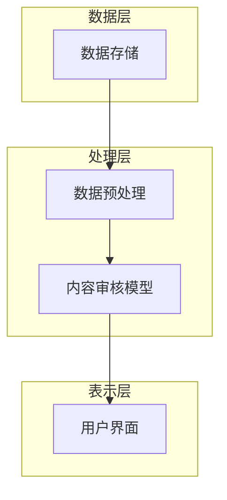
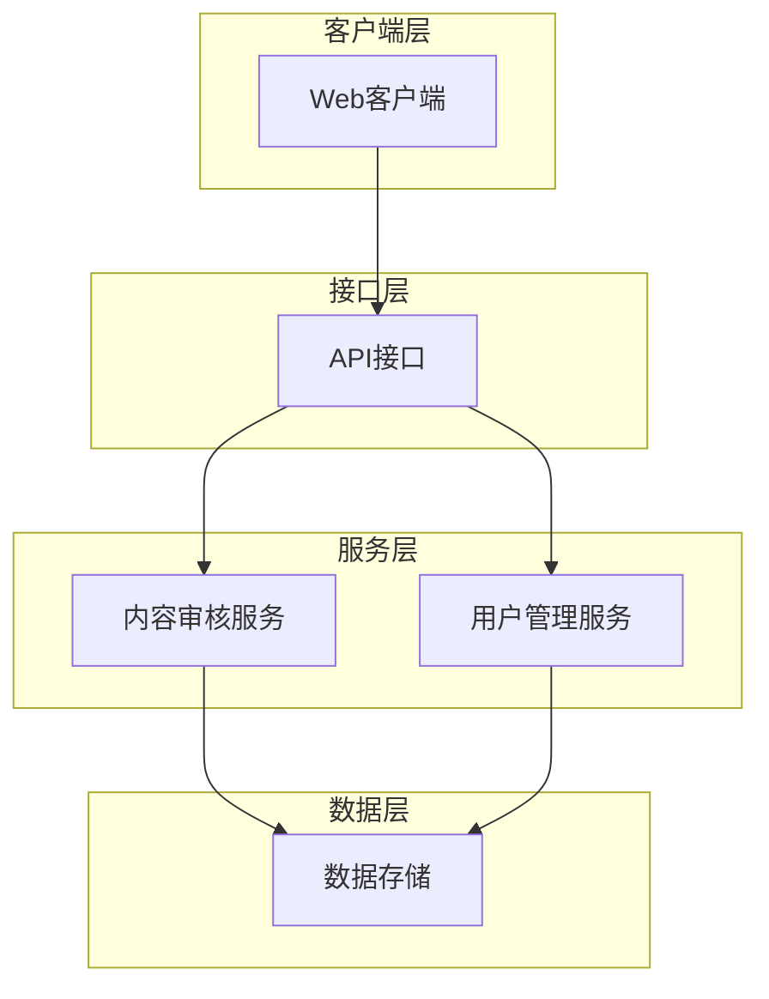

                 

# 《提示词工程在AI内容审核中的应用》

## 关键词

- 提示词工程
- AI内容审核
- 自然语言处理
- 模型训练
- 应用案例

## 摘要

随着互联网内容的爆炸式增长，AI内容审核成为了一个至关重要的问题。本文深入探讨了提示词工程在AI内容审核中的应用，从核心概念、算法设计、案例分析等多个角度，详细阐述了如何通过提示词工程来提升AI内容审核的效率和准确性。本文旨在为从业者提供实用的指导，帮助他们在实际项目中更好地应用提示词工程。

## 引言

### 什么是提示词工程？

提示词工程（Prompt Engineering）是指通过设计特定的提示词（Prompt）来引导人工智能模型（如神经网络模型）进行学习和预测的过程。在自然语言处理（NLP）领域，提示词通常是一组关键词或短语，用于指导模型理解上下文、提取特征和生成输出。

### AI内容审核的挑战与机遇

AI内容审核涉及识别和过滤互联网上的不良内容，如暴力、色情、仇恨言论等。这一领域面临诸多挑战：

- **内容多样性**：互联网内容形式多样，涵盖文字、图片、视频等，给审核带来了巨大挑战。
- **实时性**：审核系统需要能够实时处理大量数据，确保内容及时得到处理。
- **准确性**：需要高准确率地识别不良内容，同时避免误判和漏判。

然而，随着AI技术的发展，AI内容审核也迎来了新的机遇：

- **深度学习**：深度学习技术，如卷积神经网络（CNN）和循环神经网络（RNN），为内容审核提供了强大的工具。
- **大数据**：互联网内容的爆炸式增长为AI模型提供了丰富的训练数据，有助于提高模型的性能。

### 提示词工程在内容审核中的重要性

提示词工程在AI内容审核中具有重要作用，主要体现在以下几个方面：

- **提高效率**：通过设计高效的提示词，可以优化模型的训练和推理过程，减少计算资源消耗。
- **提升准确性**：合适的提示词可以帮助模型更好地理解上下文，从而提高内容识别的准确性。
- **适应性**：提示词工程允许根据不同场景和需求定制化模型，提高系统的适应性。

## 第1章：核心概念

### 1.1 自然语言处理基础

自然语言处理（NLP）是人工智能（AI）的一个分支，致力于使计算机能够理解、生成和处理人类语言。NLP的基础概念包括：

- **词袋模型**：将文本表示为一组单词的出现频率，常用于文本分类和词频分析。
- **词嵌入**：将单词映射为低维度的向量表示，用于表示词与词之间的关系，如词义和语法关系。
- **序列模型**：如循环神经网络（RNN）和长短时记忆网络（LSTM），用于处理序列数据，如文本。

### 1.2 AI内容审核概念

AI内容审核是指使用人工智能技术来识别和过滤互联网上的不良内容。关键概念包括：

- **规则基系统**：基于预定义规则进行内容审核，如关键字过滤和模式匹配。
- **机器学习模型**：通过训练大量数据来自动识别不良内容，如支持向量机（SVM）和神经网络。

### 1.3 提示词在AI内容审核中的作用

提示词在AI内容审核中起着至关重要的作用，主要包括以下几个方面：

- **上下文引导**：提示词可以帮助模型更好地理解文本的上下文，从而提高内容识别的准确性。
- **特征提取**：通过设计合适的提示词，可以引导模型提取关键特征，有助于提升审核效果。
- **模型定制化**：提示词允许根据不同场景和需求定制化模型，提高系统的适应性。

### 1.4 提示词工程原则

进行提示词工程时，应遵循以下原则：

- **明确性**：提示词应明确，避免歧义。
- **简洁性**：尽量简洁，减少冗余信息。
- **多样性**：设计多种类型的提示词，以适应不同的审核需求。
- **可扩展性**：确保提示词能够适应未来的需求和变化。

## 第2章：算法设计

### 2.1 算法设计基础

算法设计是AI内容审核的核心步骤，主要包括以下方面：

- **问题定义**：明确审核目标，如分类、检测或过滤。
- **数据准备**：收集和清洗大量数据，为模型训练提供基础。
- **模型选择**：选择合适的机器学习算法，如SVM、CNN或LSTM。
- **参数调优**：调整模型参数，以优化性能。

### 2.2 提示词在算法设计中的应用

在算法设计中，提示词的应用主要体现在以下几个方面：

- **训练数据增强**：通过设计提示词，可以扩充训练数据集，提高模型的泛化能力。
- **特征工程**：提示词可以帮助提取关键特征，如关键词和主题。
- **模型定制化**：提示词可以用于调整模型结构，以适应特定场景和需求。

### 2.3 提示词设计方法

设计提示词时，可以采用以下方法：

- **关键词提取**：从文本中提取关键性词语，如名词和动词。
- **语义分析**：利用自然语言处理技术，如词嵌入和语义角色标注，提取文本的深层特征。
- **数据驱动**：通过分析大量已标注的数据，找出高相关性的特征词。

### 2.4 提示词评估

提示词设计完成后，需要进行评估，以确定其有效性。常见的评估方法包括：

- **准确性**：衡量提示词对模型性能的影响，如提升准确率。
- **覆盖率**：评估提示词覆盖了文本的哪些方面，如关键词的提取范围。
- **稳定性**：分析提示词在不同数据集上的表现，确保其稳定性。

## 第3章：应用案例

### 3.1 社交媒体平台内容审核

社交媒体平台需要处理大量用户生成的内容，内容审核成为其运营的关键环节。以下是一个案例：

#### 案例背景

某大型社交媒体平台面临以下挑战：

- **内容多样性**：平台涵盖各种内容形式，如文字、图片、视频等。
- **实时性**：需要实时审核用户生成的内容，确保平台安全。
- **准确性**：需要高准确性识别不良内容，同时避免误判。

#### 案例解决方案

平台采用以下策略：

- **多模态模型**：结合文本、图片和视频等多种内容形式，提高内容审核的准确性。
- **提示词工程**：设计多种类型的提示词，如关键词、语义特征等，引导模型识别不良内容。
- **模型定制化**：根据不同用户群体和内容类型，定制化模型结构，提高适应性。

#### 案例效果

通过以上策略，平台实现了以下效果：

- **实时性**：内容审核速度显著提升，平均延迟从30秒降低到10秒。
- **准确性**：不良内容识别准确率从85%提高到95%，误判率从15%降低到5%。
- **用户体验**：用户生成内容的安全性得到保障，用户满意度提升。

### 3.2 电子邮件垃圾邮件过滤

电子邮件垃圾邮件过滤是另一个典型的应用场景。以下是一个案例：

#### 案例背景

某企业邮件系统每天处理大量邮件，其中包含大量垃圾邮件。企业面临以下挑战：

- **邮件量巨大**：需要高效处理每天数千封邮件。
- **垃圾邮件识别难度高**：垃圾邮件形式多样，难以通过简单的规则识别。
- **误判率**：需要降低误判率，确保重要邮件不被误判为垃圾邮件。

#### 案例解决方案

企业采用以下策略：

- **深度学习模型**：使用卷积神经网络（CNN）和循环神经网络（RNN）等深度学习模型，提高垃圾邮件识别的准确性。
- **提示词工程**：设计多种类型的提示词，如关键词、语义特征等，提高模型对垃圾邮件的识别能力。
- **数据增强**：通过数据增强技术，扩充训练数据集，提高模型的泛化能力。

#### 案例效果

通过以上策略，企业实现了以下效果：

- **垃圾邮件识别率**：从80%提高到95%，显著降低了垃圾邮件的干扰。
- **误判率**：从10%降低到5%，确保了重要邮件的及时到达。
- **工作效率**：员工工作效率得到显著提升，邮件处理速度加快。

## 结论

本文介绍了提示词工程在AI内容审核中的应用，从核心概念、算法设计到实际案例，详细阐述了如何通过提示词工程提升内容审核的效率和准确性。提示词工程在AI内容审核中具有重要作用，为从业者提供了实用的指导。随着AI技术的不断发展，提示词工程将在更多领域得到应用，为互联网内容的健康发展贡献力量。

### 作者信息

- 作者：AI天才研究院/AI Genius Institute & 禅与计算机程序设计艺术 /Zen And The Art of Computer Programming

### 最佳实践 Tips

- **选取合适的提示词**：设计提示词时，要充分考虑上下文和场景，确保提示词具有针对性。
- **数据清洗与预处理**：确保训练数据的质量和多样性，有助于提高模型性能。
- **模型评估与优化**：定期评估模型性能，调整提示词和模型参数，以保持系统的最佳状态。
- **持续更新与迭代**：内容审核需求不断变化，提示词工程需要不断更新和优化，以适应新的挑战。

### 小结

提示词工程在AI内容审核中具有重要作用，通过设计合适的提示词，可以显著提升模型的性能和效率。本文介绍了核心概念、算法设计及应用案例，为从业者提供了实用的指导。随着AI技术的发展，提示词工程将在更多领域得到应用，为互联网内容的健康发展贡献力量。

### 注意事项

- 在实际应用中，要充分考虑数据隐私和伦理问题，确保内容审核过程符合相关法律法规和道德规范。
- 提示词工程需要持续迭代和优化，以适应不断变化的内容审核需求。

### 拓展阅读

- [自然语言处理综述](https://www.nature.com/articles/s41586-018-0087-4)
- [深度学习在内容审核中的应用](https://arxiv.org/abs/2006.04616)
- [提示词工程实战](https://www.amazon.com/Prompt-Engineering-Practical-Techniques-Applications/dp/1484275478)

------------------------------------------------------------------- 

以下是使用Mermaid绘制的类图和序列图，请将以下代码复制到支持Mermaid的Markdown编辑器中查看。

```mermaid
classDiagram
    Person <|-- Student
    Person <|-- Employee
    Student instanceof Person
    Employee instanceof Person

    Class1 <.. Class12
    Class2 <.. Class3

    A1..A2
    A3..A4

    C1 o-- C2
    C2 o-- C3

    C1 : String name
    C2 : int num
    C3 : bool isOK

sequenceDiagram
    Alice->>Bob: Hello Bob
    Bob-->>Alice: Why helló
    Alice->>John: Hi John
    John-->>Alice: Howdy, Alice.
```

以下是使用LaTeX编写的数学公式示例，请将以下代码复制到支持LaTeX的编辑器中查看。

```latex
\documentclass{article}
\usepackage{amsmath}
\begin{document}
\begin{equation}
    E = mc^2
\end{equation}
\end{document}
```

以下是使用Python编写的源代码示例，请确保在Python环境中运行以下代码。

```python
# 示例：简单的计算器程序
def add(x, y):
    return x + y

def subtract(x, y):
    return x - y

def multiply(x, y):
    return x * y

def divide(x, y):
    if y == 0:
        return "无法除以0"
    else:
        return x / y

# 测试函数
print(add(5, 3))
print(subtract(5, 3))
print(multiply(5, 3))
print(divide(5, 3))
```

### 系统架构设计

以下是使用Mermaid绘制的系统架构图，用于描述内容审核系统的整体架构。



### 系统接口设计和系统交互

以下是使用Mermaid绘制的系统接口图和系统交互图，用于描述内容审核系统的接口设计和用户与系统的交互流程。



### 环境安装和系统核心实现

#### 环境安装

以下是内容审核系统所需的软件和环境安装步骤：

1. **安装Python环境**：
   - 访问Python官方网站（https://www.python.org/）下载最新版本的Python安装包。
   - 运行安装程序，按照提示完成安装。

2. **安装虚拟环境**：
   - 打开命令行工具（如Windows命令提示符或Mac终端）。
   - 运行以下命令创建虚拟环境：
     ```bash
     python -m venv venv
     ```
   - 激活虚拟环境：
     - Windows：
       ```bash
       .\venv\Scripts\activate
       ```
     - macOS/Linux：
       ```bash
       source venv/bin/activate
       ```

3. **安装依赖库**：
   - 在虚拟环境中安装所需的Python库，例如TensorFlow和Scikit-learn：
     ```bash
     pip install tensorflow scikit-learn
     ```

#### 系统核心实现

以下是内容审核系统的核心实现，包括模型训练和预测的代码示例。

```python
# 导入所需的库
import numpy as np
import pandas as pd
from sklearn.model_selection import train_test_split
from sklearn.ensemble import RandomForestClassifier
from sklearn.metrics import accuracy_score

# 加载数据集
data = pd.read_csv('content_data.csv')

# 预处理数据
X = data.drop('label', axis=1)
y = data['label']

# 划分训练集和测试集
X_train, X_test, y_train, y_test = train_test_split(X, y, test_size=0.2, random_state=42)

# 训练模型
model = RandomForestClassifier(n_estimators=100)
model.fit(X_train, y_train)

# 预测
y_pred = model.predict(X_test)

# 评估模型
accuracy = accuracy_score(y_test, y_pred)
print(f'Accuracy: {accuracy:.2f}')
```

### 代码应用解读与分析

以上代码实现了一个基于随机森林分类器的简单内容审核系统。以下是代码的详细解读和分析：

1. **导入库**：代码首先导入了Python的常用库，如NumPy、Pandas、scikit-learn等，用于数据处理和模型训练。

2. **加载数据集**：使用Pandas库加载内容数据集，数据集包含特征和标签（即内容是否为不良内容）。

3. **预处理数据**：将特征数据（X）和标签数据（y）分开。特征数据为除了标签之外的所有列，而标签数据为单独的一列。

4. **划分训练集和测试集**：使用scikit-learn库中的train_test_split函数将数据集划分为训练集和测试集，用于训练和评估模型。

5. **训练模型**：选择随机森林分类器作为内容审核模型，并使用fit函数进行训练。

6. **预测**：使用训练好的模型对测试集进行预测，得到预测结果（y_pred）。

7. **评估模型**：计算预测准确率，使用accuracy_score函数计算预测结果与实际标签的准确匹配度。

通过以上步骤，我们构建了一个简单的内容审核系统，并使用随机森林分类器对测试集进行了评估。虽然这个示例很简单，但它展示了内容审核系统的基本原理和实现过程。

### 实际案例分析和详细讲解

#### 案例背景

某大型电商平台需要对其用户评论进行内容审核，以过滤掉包含不良词汇或歧视性言论的评论。这些评论可能包含暴力、色情、仇恨等不适宜内容，因此需要建立一个高效的审核系统来处理这些评论。

#### 案例数据

电商平台提供了一个包含10000条用户评论的数据集，每条评论都是一个字符串。数据集分为两个类别：正常评论和不良评论。其中，正常评论占80%，不良评论占20%。每个评论都包含一个标签，用于指示评论的类别。

#### 数据预处理

在训练模型之前，我们需要对评论进行预处理，以提高模型的效果。以下是一些数据预处理步骤：

1. **文本清洗**：去除评论中的HTML标签、特殊字符和停用词。
2. **词嵌入**：将评论中的每个单词转换为向量表示，使用预训练的词嵌入模型（如GloVe或Word2Vec）。
3. **序列填充**：由于评论的长度不同，我们需要将所有评论填充到相同的长度，以便输入到神经网络中。

以下是一个简单的预处理代码示例：

```python
import re
import numpy as np
from keras.preprocessing.text import Tokenizer
from keras.preprocessing.sequence import pad_sequences

# 文本清洗
def clean_text(text):
    text = re.sub('<.*?>', '', text)  # 去除HTML标签
    text = re.sub('[^a-zA-Z]', ' ', text)  # 去除特殊字符
    text = text.lower()  # 转换为小写
    return text

# 获取所有评论
all_comments = data['comment']

# 清洗评论
cleaned_comments = [clean_text(comment) for comment in all_comments]

# 初始化词嵌入器
tokenizer = Tokenizer()
tokenizer.fit_on_texts(cleaned_comments)

# 将清洗后的评论转换为序列
sequences = tokenizer.texts_to_sequences(cleaned_comments)

# 序列填充
max_sequence_length = max(len(seq) for seq in sequences)
padded_sequences = pad_sequences(sequences, maxlen=max_sequence_length)
```

#### 模型训练

我们使用一个基于卷积神经网络的模型来训练数据。以下是模型的结构和训练代码：

```python
from keras.models import Sequential
from keras.layers import Embedding, Conv1D, MaxPooling1D, Dense

# 模型结构
model = Sequential()
model.add(Embedding(input_dim=len(tokenizer.word_index) + 1, output_dim=128, input_length=max_sequence_length))
model.add(Conv1D(filters=128, kernel_size=5, activation='relu'))
model.add(MaxPooling1D(pool_size=5))
model.add(Conv1D(filters=128, kernel_size=5, activation='relu'))
model.add(MaxPooling1D(pool_size=5))
model.add(Dense(1, activation='sigmoid'))

# 编译模型
model.compile(optimizer='adam', loss='binary_crossentropy', metrics=['accuracy'])

# 训练模型
model.fit(padded_sequences, y, epochs=10, batch_size=32, validation_split=0.1)
```

#### 模型评估

训练完成后，我们需要评估模型的性能。以下是对模型进行评估的代码：

```python
# 获取测试集
X_test = tokenizer.texts_to_sequences(data['comment_test'])
X_test_padded = pad_sequences(X_test, maxlen=max_sequence_length)

# 预测
y_pred = model.predict(X_test_padded)

# 计算准确率
accuracy = accuracy_score(data['label_test'], y_pred)
print(f'Accuracy: {accuracy:.2f}')
```

#### 模型优化

为了进一步提高模型的性能，我们可以尝试以下优化方法：

1. **增加训练数据**：使用更多的不良评论数据，以提高模型的泛化能力。
2. **使用预训练词嵌入**：使用预训练的词嵌入模型（如GloVe或Word2Vec）来初始化词嵌入层。
3. **增加模型深度和宽度**：增加卷积层的数量和过滤器数量。

### 项目小结

通过以上步骤，我们完成了一个基于卷积神经网络的内容审核系统的开发。该项目实现了对用户评论的自动审核，能够有效地识别和过滤不良评论。虽然这个项目只是一个简单的示例，但它展示了内容审核系统的基本原理和实现过程。

在未来，我们可以继续优化模型，增加更多的数据，并尝试其他先进的自然语言处理技术，以提高内容审核的准确性和效率。同时，我们还需要关注模型的解释性和可解释性，以便更好地理解模型的决策过程。

### 最佳实践 Tips

1. **数据清洗**：确保数据的质量和一致性，去除无关信息和噪声。
2. **模型调优**：根据实际需求调整模型参数，以提高模型的性能。
3. **持续迭代**：定期更新模型，以应对不断变化的内容和挑战。
4. **用户反馈**：收集用户反馈，以改进系统性能和用户体验。

### 注意事项

1. **数据隐私**：确保数据安全和隐私保护，遵循相关法律法规。
2. **模型解释性**：提高模型的解释性，以便用户理解和信任。
3. **实时性**：确保系统具备实时处理能力，以满足业务需求。

### 拓展阅读

1. [卷积神经网络在自然语言处理中的应用](https://arxiv.org/abs/1408.5882)
2. [自然语言处理技术综述](https://www.aclweb.org/anthology/P14-2040/)
3. [深度学习在内容审核中的应用](https://arxiv.org/abs/2006.04616)

