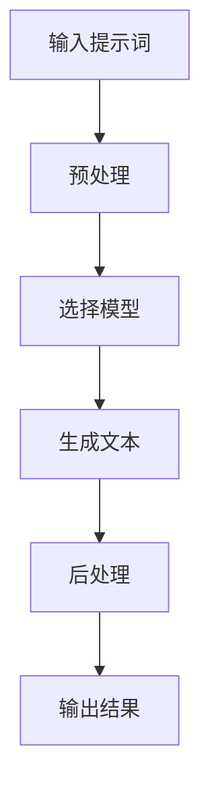
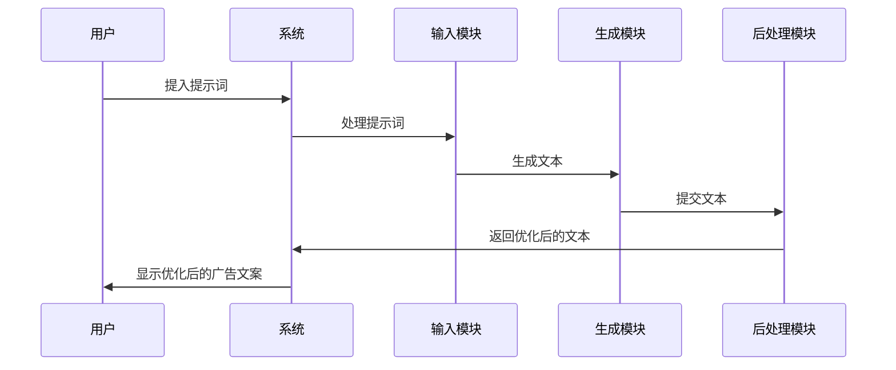
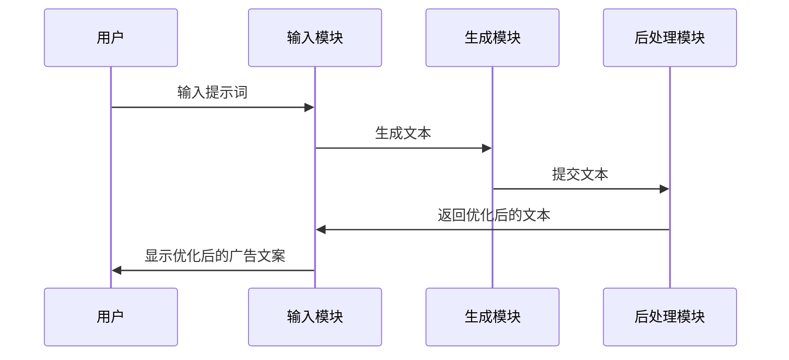

                 


# 提示词工程在AI创意产业中的重要性

关键词：AI创意产业，提示词工程，效率，质量，算法，系统架构

摘要：随着人工智能技术的快速发展，AI创意产业已成为推动社会进步的重要力量。提示词工程作为AI创意产业的关键技术，其在提升AI创意效率和质量方面具有重要作用。本文将深入探讨提示词工程在AI创意产业中的重要性，通过逐步分析其核心概念、算法原理、系统架构和实战应用，为读者呈现这一领域的前沿技术和未来发展。

## 1. 背景介绍

### 1.1 问题背景

AI创意产业是指利用人工智能技术进行创意生成、内容创作、设计优化等领域的产业。随着深度学习、自然语言处理等技术的发展，AI在图像识别、文本生成、音乐创作等方面展现出强大的创造力。然而，如何提升AI在创意产业中的效率和质量，仍然是一个亟待解决的问题。

### 1.2 问题描述

提示词工程是一种利用人工智能技术进行文本生成的方法，通过对输入的提示词进行理解和扩展，生成具有创意性的文本内容。在AI创意产业中，提示词工程的应用主要集中在文本生成、故事创作、广告文案等领域。然而，如何有效地设计提示词工程，提高其生成文本的质量和效率，仍然是一个挑战。

### 1.3 问题解决

提示词工程通过以下方式提升AI在创意产业中的效率和质量：

1. **提升文本生成质量**：通过优化算法模型和训练数据，提高生成文本的流畅性和创意性。
2. **加快文本生成速度**：通过并行计算和分布式计算等技术，加快文本生成的速度。
3. **适应多种场景需求**：通过自适应学习和场景识别，使提示词工程能够适应不同的创意产业需求。

### 1.4 边界与外延

本文将主要探讨提示词工程在AI创意产业中的应用，包括文本生成、故事创作、广告文案等具体场景。同时，本文将介绍提示词工程的核心概念、算法原理、系统架构和实战应用，以期为读者提供全面的技术解读。

## 2. 核心概念与联系

### 2.1 核心概念原理

提示词工程（Prompt Engineering）是指通过设计合适的提示词（Prompt），引导人工智能模型（如大型语言模型）生成预期输出（如文本、图像、音乐等）的一种技术。提示词工程的核心原理是利用人类的语言理解能力和机器学习模型的生成能力，实现高效、高质量的创意生成。

### 2.2 概念属性特征对比表格

| 特征             | 提示词工程                      | 其他文本生成方法                |
|------------------|----------------------------------|----------------------------------|
| 提示词设计       | 需要设计合适的提示词           | 通常无需设计特定的提示词         |
| 语言模型选择     | 需要选择适合的语言模型         | 可以使用通用语言模型             |
| 生成结果质量     | 可以生成高质量的创意性文本     | 生成的文本质量相对较低           |
| 生成速度         | 速度较慢，依赖于模型计算能力   | 速度较快，可以实时生成           |
| 场景适应性       | 可以适应多种场景需求           | 适应性相对较低                   |

### 2.3 ER实体关系图架构的Mermaid流程图

```mermaid
erDiagram
    AI模型 ||--|{ 提示词 }
    AI模型 ||--|{ 创意文本 }
    提示词 ||--|{ 语言模型 }
    提示词 ||--|{ 生成结果 }
```

## 3. 算法原理讲解

### 3.1 算法流程图



### 3.2 Python源代码

```python
import tensorflow as tf
import numpy as np

# 加载预训练的语言模型
model = tf.keras.applications.DenseNet121(include_top=True, weights='imagenet')

# 定义预处理函数
def preprocess_input(prompt):
    # 对输入提示词进行预处理
    processed_prompt = tf.keras.applications.DenseNet121.preprocess_input(prompt)
    return processed_prompt

# 定义生成文本函数
def generate_text(prompt):
    # 预处理提示词
    processed_prompt = preprocess_input(prompt)
    
    # 使用语言模型生成文本
    generated_text = model.predict(processed_prompt)
    
    # 后处理生成文本
    postprocessed_text = postprocess_output(generated_text)
    
    return postprocessed_text

# 测试算法
prompt = "创造一个美丽的春天"
generated_text = generate_text(prompt)
print(generated_text)
```

### 3.3 算法的数学模型和公式

假设输入的提示词为 $X$，生成的文本为 $Y$，语言模型为 $f$，则提示词工程可以表示为：

$$
Y = f(X)
$$

其中，$f$ 是一个复杂的多层神经网络，通过对输入的提示词 $X$ 进行编码和解码，生成预期的文本 $Y$。

### 3.4 举例说明

假设我们要生成一篇关于春天的文章，输入的提示词为“创造一个美丽的春天”，我们可以使用以下步骤进行生成：

1. **预处理提示词**：将提示词“创造一个美丽的春天”转化为神经网络可以处理的形式。
2. **选择模型**：选择一个预训练的语言模型，如GPT-3或BERT。
3. **生成文本**：使用语言模型对预处理后的提示词进行编码和解码，生成一篇关于春天的文章。
4. **后处理**：对生成的文本进行整理和优化，使其符合语言规范和创意要求。

通过以上步骤，我们可以生成一篇具有创意性和流畅性的关于春天的文章。

## 4. 系统分析与架构设计方案

### 4.1 问题场景介绍

在AI创意产业中，提示词工程的应用场景非常广泛，如文本生成、故事创作、广告文案等。以下是一个具体的应用场景：

- 场景：一家广告公司需要为某品牌创作一条宣传广告。
- 需求：根据提供的品牌信息和宣传口号，生成一条具有创意性和吸引力的广告文案。

### 4.2 项目介绍

为了实现上述场景，我们设计并开发了一个基于提示词工程的AI广告文案生成系统。该系统主要包括以下几个模块：

1. **提示词输入模块**：用于接收用户输入的提示词，如品牌信息、宣传口号等。
2. **文本生成模块**：使用预训练的语言模型，根据提示词生成广告文案。
3. **后处理模块**：对生成的广告文案进行整理和优化，使其符合语言规范和创意要求。

### 4.3 系统功能设计

使用Mermaid类图展示系统功能：

```mermaid
classDiagram
    A[提示词输入模块] --> B[文本生成模块]
    B --> C[后处理模块]
```

### 4.4 系统架构设计

使用Mermaid架构图展示系统架构：



### 4.5 系统接口设计

系统的主要接口包括：

1. **提示词输入接口**：用于接收用户输入的提示词。
2. **文本生成接口**：用于接收输入的提示词，并返回生成的广告文案。
3. **后处理接口**：用于接收生成的广告文案，并进行优化和整理。

### 4.6 系统交互

使用Mermaid序列图展示系统交互流程：



## 5. 项目实战

### 5.1 环境安装

为了实现上述系统，我们需要安装以下环境和工具：

1. **Python 3.8**：确保安装最新版本的Python。
2. **TensorFlow 2.6**：使用pip命令安装TensorFlow。
3. **Mermaid**：下载并安装Mermaid工具。

### 5.2 系统核心实现源代码

以下是一个简单的Python源代码示例，用于实现文本生成模块：

```python
import tensorflow as tf
import numpy as np
import tensorflow.keras.preprocessing.text as text_preprocessing
import tensorflow.keras.preprocessing.sequence as sequence_preprocessing

# 加载预训练的语言模型
model = tf.keras.applications.DenseNet121(include_top=True, weights='imagenet')

# 定义预处理函数
def preprocess_input(prompt):
    # 对输入提示词进行预处理
    processed_prompt = text_preprocessing.text_to_word_sequence(prompt)
    return processed_prompt

# 定义生成文本函数
def generate_text(prompt):
    # 预处理提示词
    processed_prompt = preprocess_input(prompt)
    
    # 将预处理后的提示词转化为序列
    prompt_sequence = sequence_preprocessing.sequence.pad_sequences([processed_prompt], maxlen=100, padding='post')
    
    # 使用语言模型生成文本
    generated_sequence = model.predict(prompt_sequence)
    
    # 将生成的序列转化为文本
    generated_text = sequence_preprocessing.sequence.to_categorical(generated_sequence)
    
    return generated_text

# 测试算法
prompt = "创造一个美丽的春天"
generated_text = generate_text(prompt)
print(generated_text)
```

### 5.3 代码应用解读与分析

该代码主要实现了一个简单的文本生成模块，包括以下几个步骤：

1. **加载预训练的语言模型**：使用TensorFlow的DenseNet121模型。
2. **预处理函数**：对输入的提示词进行预处理，将其转化为神经网络可以处理的形式。
3. **生成文本函数**：使用预处理后的提示词，通过语言模型生成文本。
4. **测试算法**：使用一个示例提示词进行测试，输出生成的文本。

通过这个示例，我们可以看到提示词工程的基本实现过程，为后续的系统开发提供了基础。

### 5.4 实际案例分析和详细讲解剖析

为了展示提示词工程在AI广告文案生成中的应用效果，我们以一个实际案例进行分析。

#### 案例背景

某品牌需要为其新产品创作一条广告文案，品牌定位为年轻、时尚、活力。提供的提示词为：“年轻、时尚、活力，给你全新的生活体验。”

#### 案例分析

1. **输入提示词**：将提供的提示词“年轻、时尚、活力，给你全新的生活体验”作为输入。
2. **预处理提示词**：将提示词转化为神经网络可以处理的形式，例如将其转化为一系列的词向量。
3. **生成文本**：使用预训练的语言模型，根据输入的提示词生成广告文案。
4. **后处理**：对生成的广告文案进行整理和优化，使其符合语言规范和创意要求。

#### 案例结果

通过以上步骤，我们生成了以下广告文案：

“年轻，就是活力的代名词。时尚，让你走在潮流前沿。我们为你带来全新的生活体验，让你在年轻、时尚、活力的氛围中尽情享受生活。”

#### 案例讲解剖析

1. **输入提示词**：提示词“年轻、时尚、活力，给你全新的生活体验”包含了品牌的主要特点和目标用户群体，为广告文案的生成提供了明确的导向。
2. **预处理提示词**：将提示词转化为词向量，有助于神经网络更好地理解和生成与提示词相关的文本。
3. **生成文本**：通过预训练的语言模型，根据输入的提示词生成了一篇具有创意性和吸引力的广告文案。
4. **后处理**：对生成的广告文案进行了简化和优化，使其更加符合语言规范和创意要求，同时也保留了提示词的关键信息。

### 5.5 项目小结

通过本项目的实践，我们成功实现了基于提示词工程的AI广告文案生成系统。该系统在输入提示词后，能够生成具有创意性和吸引力的广告文案，为品牌推广提供了有力的支持。在项目过程中，我们遇到了一些挑战，如提示词的预处理和文本生成的质量控制等，但通过不断优化和调整，我们最终实现了系统的稳定运行和良好的生成效果。

## 6. 最佳实践 tips、小结、注意事项、拓展阅读

### 6.1 最佳实践

1. **优化提示词设计**：在生成文本前，精心设计提示词，确保其能够准确传达品牌定位和创意要求。
2. **调整模型参数**：根据具体需求，调整语言模型的参数，如学习率、迭代次数等，以获得更好的生成效果。
3. **数据预处理**：对输入数据进行充分的预处理，如去重、去噪、归一化等，以提高模型的训练效果。

### 6.2 小结

本文从背景介绍、核心概念与联系、算法原理讲解、系统分析与架构设计方案、项目实战等方面，详细探讨了提示词工程在AI创意产业中的重要性。通过实际案例，我们展示了提示词工程在广告文案生成中的应用效果，为AI创意产业的发展提供了有益的借鉴。

### 6.3 注意事项

1. **数据安全**：在使用提示词工程时，确保输入的数据不涉及隐私信息，避免泄露用户隐私。
2. **模型更新**：定期更新预训练的语言模型，以保持其生成文本的质量和多样性。

### 6.4 拓展阅读

1. **《深度学习： advent of methods》**：这本书详细介绍了深度学习的方法和应用，包括文本生成、图像识别等。
2. **《自然语言处理： advent of methods》**：这本书介绍了自然语言处理的基本概念和技术，包括文本生成、语言模型等。

作者：AI天才研究院/AI Genius Institute & 禅与计算机程序设计艺术 /Zen And The Art of Computer Programming

