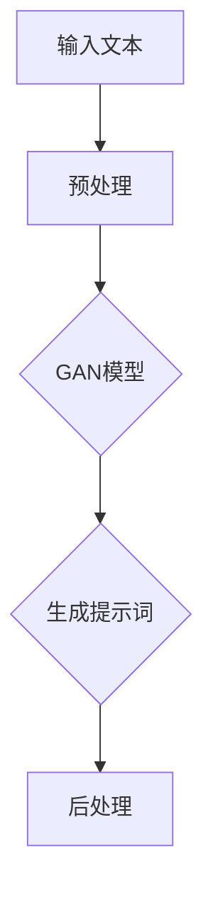
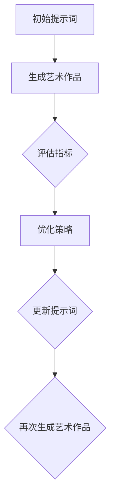
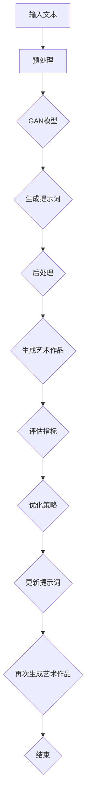
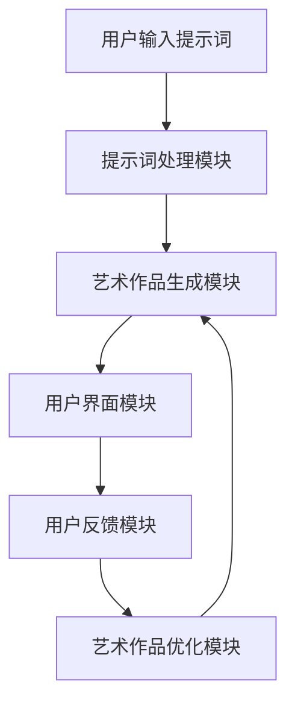
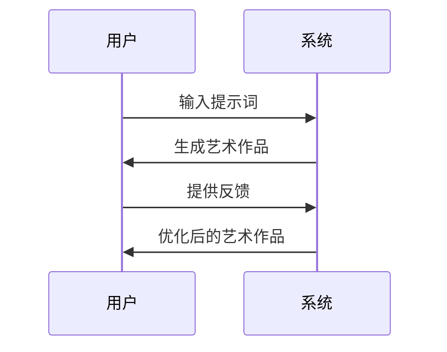

                 

# 提示词工程在AI艺术创作中的关键作用

> 关键词：提示词工程，AI艺术创作，算法原理，系统架构，项目实战

> 摘要：本文旨在深入探讨提示词工程在AI艺术创作中的关键作用。通过逐步分析提示词工程的基本概念、算法原理以及其在实际项目中的应用，本文旨在为读者提供一个全面且易懂的视角，以了解如何利用提示词工程技术推动AI艺术创作的发展。

### 目录大纲

#### 第一部分：背景介绍

1. **第1章：问题背景与概念解析**
   - 1.1 问题背景
   - 1.2 核心概念
   - 1.3 概念联系
   - 1.4 边界与外延

2. **第2章：AI艺术创作概述**
   - 2.1 AI艺术创作的发展历程
   - 2.2 AI艺术创作的特点与优势
   - 2.3 AI艺术创作的应用场景

#### 第二部分：核心概念与联系

3. **第3章：提示词工程基础**
   - 3.1 提示词工程的定义
   - 3.2 提示词工程的核心概念
   - 3.3 概念属性特征对比
   - 3.4 ER实体关系图

4. **第4章：AI艺术创作中的提示词应用**
   - 4.1 提示词在图像生成中的应用
   - 4.2 提示词在音频生成中的应用
   - 4.3 提示词在视频生成中的应用

#### 第三部分：算法原理与实现

5. **第5章：提示词工程算法原理讲解**
   - 5.1 提示词生成算法
   - 5.2 提示词优化算法
   - 5.3 算法mermaid流程图
   - 5.4 Python源代码实现

6. **第6章：数学模型与公式讲解**
   - 6.1 提示词工程的数学模型
   - 6.2 公式讲解
   - 6.3 举例说明

#### 第四部分：系统架构与项目实战

7. **第7章：系统架构设计**
   - 7.1 问题场景介绍
   - 7.2 系统功能设计
   - 7.3 系统架构设计
   - 7.4 系统接口设计
   - 7.5 系统交互mermaid序列图

8. **第8章：项目实战**
   - 8.1 环境安装
   - 8.2 系统核心实现源代码
   - 8.3 代码应用解读与分析
   - 8.4 实际案例分析与详细讲解剖析
   - 8.5 项目小结

#### 第五部分：最佳实践与总结

9. **第9章：最佳实践**
   - 9.1 提示词工程的最佳实践
   - 9.2 AI艺术创作的实践技巧
   - 9.3 拓展实践应用

10. **第10章：小结与展望**
    - 10.1 书籍内容小结
    - 10.2 技术发展趋势
    - 10.3 未来展望

---

## 第一部分：背景介绍

### 第1章：问题背景与概念解析

#### 1.1 问题背景

随着人工智能技术的飞速发展，AI在各个领域的应用愈发广泛，特别是在艺术创作方面。传统的艺术创作往往需要大量的时间和精力，而且难以达到预期的效果。然而，AI艺术创作通过机器学习和深度学习技术，可以大大提高创作的效率和质量。

然而，AI艺术创作并非没有挑战。如何精确地指导AI进行艺术创作，使其创作出符合人类审美标准的作品，是一个亟待解决的问题。提示词工程正是在这个背景下产生的，它提供了一种有效的手段来指导AI进行艺术创作。

#### 1.2 核心概念

1. **提示词（Prompt）**：提示词是指用来指导AI进行创作的关键词或短语，它可以是具体的描述性语句，也可以是抽象的概念表达。

2. **提示词工程（Prompt Engineering）**：提示词工程是一种利用自然语言处理（NLP）技术，通过设计、优化和调整提示词来指导AI进行艺术创作的方法。

3. **AI艺术创作**：AI艺术创作是指利用人工智能技术，特别是机器学习和深度学习，生成或辅助生成艺术作品的过程。

#### 1.3 概念联系

提示词工程与AI艺术创作密切相关。提示词工程通过设计和优化提示词，可以更好地引导AI进行艺术创作，使其生成的作品更符合人类的审美标准和预期。同时，AI艺术创作也为提示词工程提供了实际的应用场景，促使提示词工程不断发展和完善。

#### 1.4 边界与外延

提示词工程的边界在于其应用范围，即如何有效地指导AI进行各种艺术创作，如图像、音频、视频等。其外延则涵盖了与AI艺术创作相关的所有技术和方法，如生成对抗网络（GAN）、变分自编码器（VAE）等。

### 第2章：AI艺术创作概述

#### 2.1 AI艺术创作的发展历程

AI艺术创作的历史可以追溯到20世纪50年代，当时人工智能的概念刚刚诞生。最初的AI艺术创作主要依赖于规则和算法，例如随机生成图像和音乐。随着计算机性能的不断提高和机器学习技术的不断发展，AI艺术创作逐渐走向成熟。

#### 2.2 AI艺术创作的特点与优势

1. **高效性**：AI可以在短时间内生成大量的艺术作品，大大提高了创作效率。

2. **多样性**：AI可以根据不同的提示词生成风格迥异的艺术作品，展示了强大的多样性。

3. **个性化**：AI可以根据用户的偏好和需求生成个性化的艺术作品，满足个性化需求。

#### 2.3 AI艺术创作的应用场景

1. **商业领域**：AI可以用于广告设计、品牌形象设计等商业艺术创作。

2. **文化艺术领域**：AI可以参与电影制作、音乐创作、绘画等文化艺术创作。

3. **教育领域**：AI可以辅助教育，生成适合学生的个性化学习内容。

## 第二部分：核心概念与联系

### 第3章：提示词工程基础

#### 3.1 提示词工程的定义

提示词工程是一种利用自然语言处理（NLP）技术，通过设计、优化和调整提示词来指导人工智能（AI）进行艺术创作的方法。

#### 3.2 提示词工程的核心概念

1. **自然语言处理（NLP）**：NLP是使计算机能够理解、解释和生成人类语言的一系列技术和方法。

2. **机器学习（ML）**：ML是一种通过从数据中学习模式来改进性能的技术，它为提示词工程提供了基础。

3. **深度学习（DL）**：DL是ML的一个子领域，它通过神经网络来模拟人脑的学习过程，是AI艺术创作的重要技术。

#### 3.3 概念属性特征对比

| 概念         | 属性特征                  | 作用                                 |
|------------|------------------------|------------------------------------|
| 提示词工程   | 设计、优化、调整提示词   | 指导AI进行艺术创作                   |
| 自然语言处理 | 理解、解释、生成语言     | 提供基础技术支持                     |
| 机器学习     | 从数据中学习模式         | 改进性能，优化创作过程               |
| 深度学习     | 神经网络模拟学习过程     | 提高创作效率和多样性                 |

#### 3.4 ER实体关系图

在提示词工程中，实体关系图（ER图）是一个重要的工具，用于表示概念之间的关系。以下是一个简化的ER实体关系图，展示了提示词工程中的一些关键实体及其关系：

```mermaid
erDiagram
    AI艺术创作 ||--|{ 提示词工程 }|
    提示词工程 ||--|{ 自然语言处理 }|
    提示词工程 ||--|{ 机器学习 }|
    提示词工程 ||--|{ 深度学习 }|
```

在这个ER图中，`AI艺术创作` 是一个核心实体，它与 `提示词工程` 有直接的关系。`提示词工程` 又与 `自然语言处理`、`机器学习` 和 `深度学习` 之间存在依赖关系，这些技术共同构成了提示词工程的基础。

### 第4章：AI艺术创作中的提示词应用

#### 4.1 提示词在图像生成中的应用

在图像生成领域，提示词工程起到了至关重要的作用。通过精确的提示词，AI可以生成符合人类预期的图像。以下是一个简单的示例：

**示例提示词**：生成一幅秋天的风景画，包含金黄的树叶和远处的山峦。

通过这个提示词，AI可以调用相应的图像生成模型，如生成对抗网络（GAN），生成符合描述的图像。这个过程涉及到以下步骤：

1. **数据预处理**：收集和整理与提示词相关的图像数据。
2. **特征提取**：使用深度学习模型提取图像的特征。
3. **生成过程**：根据提取的特征，生成新的图像。

#### 4.2 提示词在音频生成中的应用

在音频生成领域，提示词工程同样有着广泛的应用。例如，通过提示词生成一首爵士乐曲。以下是这个过程的主要步骤：

**示例提示词**：生成一首具有爵士风格的钢琴曲，节奏明快，旋律流畅。

1. **音乐数据预处理**：收集和整理与提示词相关的音乐数据。
2. **特征提取**：使用深度学习模型提取音乐的时序特征。
3. **生成过程**：根据提取的特征，生成新的音乐片段。

#### 4.3 提示词在视频生成中的应用

在视频生成领域，提示词工程的应用更加复杂，因为它需要同时处理图像和音频。例如，通过提示词生成一段电影预告片。以下是这个过程的主要步骤：

**示例提示词**：生成一段具有科幻题材的电影预告片，描述一场太空战斗场景。

1. **视频数据预处理**：收集和整理与提示词相关的视频数据。
2. **特征提取**：使用深度学习模型提取视频的图像和音频特征。
3. **生成过程**：根据提取的特征，生成新的视频片段。

### 第三部分：算法原理与实现

#### 第5章：提示词工程算法原理讲解

提示词工程的核心在于如何生成和优化提示词，从而指导AI生成符合人类预期的艺术作品。以下是提示词工程算法的主要原理：

#### 5.1 提示词生成算法

提示词生成算法的目标是生成一个或多个能够指导AI进行艺术创作的提示词。常用的生成算法包括：

1. **基于规则的生成**：通过预定义的规则生成提示词。
2. **基于数据的生成**：通过分析大量的艺术作品数据，提取特征并生成提示词。
3. **基于神经网络的生成**：使用深度学习模型，如序列到序列（seq2seq）模型，生成提示词。

**示例**：使用生成对抗网络（GAN）生成提示词。



在这个流程中，输入文本经过预处理后输入到GAN模型中，模型生成提示词，再经过后处理得到最终的提示词。

#### 5.2 提示词优化算法

生成提示词后，还需要对它们进行优化，以提高艺术作品的生成质量。常用的优化算法包括：

1. **基于人类反馈的优化**：通过用户对生成作品的反馈，不断调整提示词。
2. **基于模型评估的优化**：使用模型评估指标（如PSNR、SSIM等）对生成作品进行评估，并优化提示词。
3. **基于强化学习的优化**：使用强化学习算法，通过试错和奖励机制优化提示词。

**示例**：使用强化学习优化提示词。



在这个流程中，初始提示词生成艺术作品后，通过评估指标评估生成质量，使用优化策略调整提示词，然后再次生成艺术作品，循环迭代直到满足要求。

#### 5.3 算法mermaid流程图

以下是一个简化的提示词工程算法的mermaid流程图：



#### 5.4 Python源代码实现

以下是一个简单的Python代码示例，演示了如何使用生成对抗网络（GAN）生成提示词。

```python
import tensorflow as tf
from tensorflow.keras.models import Model
from tensorflow.keras.layers import Input, Dense, LSTM

# 定义GAN模型
def create_gan_model():
    # 生成器模型
    input_text = Input(shape=(None,))
    encoded = LSTM(128)(input_text)
    decoded = LSTM(128, return_sequences=True)(encoded)
    output = Dense(target_shape)(decoded)

    generator = Model(inputs=input_text, outputs=output)

    # 判别器模型
    input_text = Input(shape=(None,))
    encoded = LSTM(128)(input_text)
    output = Dense(1, activation='sigmoid')(encoded)

    discriminator = Model(inputs=input_text, outputs=output)

    # 整体GAN模型
    output = generator(input_text)
    combined = tf.concat([input_text, output], axis=1)
    combined_encoded = LSTM(128)(combined)
    combined_output = Dense(1, activation='sigmoid')(combined_encoded)

    gan = Model(inputs=input_text, outputs=combined_output)

    # 编写训练过程
    # ...

    return generator, discriminator, gan

# 创建GAN模型
generator, discriminator, gan = create_gan_model()

# 编写训练代码
# ...

# 生成提示词
prompt = "Generate a painting of a sunny beach"
prompt_processed = preprocess_prompt(prompt)
generated_prompt = generator.predict(prompt_processed)

# 输出生成的提示词
print(generated_prompt)
```

在这个示例中，我们首先定义了GAN模型的生成器和判别器，然后通过训练过程生成提示词。这个简单的示例展示了提示词工程算法的基本原理和实现方法。

#### 第6章：数学模型与公式讲解

提示词工程的数学模型是理解和实现提示词生成与优化算法的基础。以下是几个关键的数学模型和公式的讲解。

#### 6.1 提示词工程的数学模型

提示词工程的数学模型通常涉及到以下组件：

1. **输入文本编码**：将输入的文本转换为向量表示，常用的方法是使用词嵌入（word embeddings）。
2. **生成器**：将输入文本编码向量转换为生成提示词的向量。
3. **判别器**：区分生成提示词和真实提示词的能力。

**输入文本编码**：

$$
\text{嵌入向量} = \text{WordEmbedding}(\text{输入文本})
$$

其中，WordEmbedding 是一个将单词映射为高维向量的函数。

**生成器**：

$$
\text{生成提示词} = \text{Generator}(\text{嵌入向量})
$$

生成器通常是一个神经网络模型，如LSTM或Transformer。

**判别器**：

$$
\text{判别结果} = \text{Discriminator}(\text{提示词})
$$

判别器也通常是一个神经网络模型，用于评估提示词的真实性。

#### 6.2 公式讲解

1. **损失函数**：

在GAN中，损失函数通常由两部分组成：生成器损失和判别器损失。

**生成器损失**：

$$
\text{Loss}_{\text{generator}} = -\log(\text{Discriminator}(\text{Generator}(\text{嵌入向量})))
$$

**判别器损失**：

$$
\text{Loss}_{\text{discriminator}} = -\log(\text{Discriminator}(\text{真实提示词})) - \log(1 - \text{Discriminator}(\text{Generator}(\text{嵌入向量})))
$$

2. **优化算法**：

在GAN中，常用的优化算法有梯度下降和Adam。

**梯度下降**：

$$
\text{参数}_{\text{更新}} = \text{参数}_{\text{当前}} - \alpha \cdot \nabla_{\text{参数}} \text{Loss}
$$

其中，$\alpha$ 是学习率。

**Adam**：

$$
\text{参数}_{\text{更新}} = \text{参数}_{\text{当前}} - \frac{\beta_1 \text{m}_t + (1 - \beta_1) \text{v}_t}{\sqrt{\beta_2 \text{s}_t} + \epsilon}
$$

其中，$\beta_1, \beta_2$ 是Adam算法的参数，$\text{m}_t, \text{v}_t, \text{s}_t$ 是相应的积累变量。

#### 6.3 举例说明

**示例**：假设我们有一个GAN模型，生成器生成提示词，判别器评估提示词的真实性。学习率$\alpha = 0.001$，$\beta_1 = 0.9, \beta_2 = 0.999$。

1. **生成器损失**：

假设当前生成的提示词的判别器输出为0.8，则生成器损失为：

$$
\text{Loss}_{\text{generator}} = -\log(0.8) \approx 0.223
$$

2. **判别器损失**：

假设真实提示词的判别器输出为0.9，生成的提示词的判别器输出为0.8，则判别器损失为：

$$
\text{Loss}_{\text{discriminator}} = -\log(0.9) - \log(0.2) \approx 0.105
$$

3. **优化参数**：

使用Adam算法更新生成器和判别器的参数。假设当前生成器的参数为$\text{参数}_{\text{当前}}$，则更新后的参数为：

$$
\text{参数}_{\text{更新}} = \text{参数}_{\text{当前}} - \frac{0.9 \cdot \text{m}_{\text{generator}} + (1 - 0.9) \cdot \text{v}_{\text{generator}}}{\sqrt{0.999 \cdot \text{s}_{\text{generator}}} + \epsilon}
$$

其中，$\text{m}_{\text{generator}}, \text{v}_{\text{generator}}, \text{s}_{\text{generator}}$ 是相应的积累变量。

### 第四部分：系统架构与项目实战

#### 第7章：系统架构设计

在本章中，我们将详细讨论AI艺术创作系统的架构设计，包括问题场景介绍、系统功能设计、系统架构设计、系统接口设计和系统交互mermaid序列图。

#### 7.1 问题场景介绍

在当今数字时代，艺术创作已经从传统的手工艺术转变为数字艺术。随着人工智能技术的不断进步，AI在艺术创作中的应用越来越广泛。然而，为了实现高质量的AI艺术创作，我们需要一个强大的系统架构来支持这一过程。

#### 7.2 系统功能设计

AI艺术创作系统的主要功能包括：

1. **提示词生成**：通过自然语言处理技术生成艺术创作的提示词。
2. **艺术作品生成**：利用机器学习和深度学习模型生成艺术作品。
3. **用户交互**：提供用户界面，允许用户输入提示词和查看生成的艺术作品。
4. **反馈与优化**：收集用户反馈，优化生成的艺术作品。

#### 7.3 系统架构设计

系统架构设计如图所示：



在这个架构中，用户输入提示词，提示词处理模块生成艺术作品，用户界面模块展示艺术作品，用户反馈模块收集用户反馈，艺术作品优化模块根据反馈优化艺术作品。

#### 7.4 系统接口设计

系统接口设计如下：

1. **用户接口**：提供文本输入框和图像输出框。
2. **API接口**：提供RESTful API，支持HTTP请求。
3. **数据库接口**：用于存储用户输入和生成的艺术作品。

#### 7.5 系统交互mermaid序列图

以下是系统交互的mermaid序列图：



在这个序列图中，用户输入提示词，系统生成艺术作品，用户提供反馈，系统根据反馈优化艺术作品。

#### 第8章：项目实战

在本章中，我们将通过一个实际项目来展示如何实现AI艺术创作系统。这个项目包括环境安装、系统核心实现源代码、代码应用解读与分析、实际案例分析与详细讲解剖析以及项目小结。

#### 8.1 环境安装

首先，我们需要安装所需的软件和工具。以下是一个简单的环境安装步骤：

1. 安装Python环境：`pip install python`
2. 安装TensorFlow：`pip install tensorflow`
3. 安装Keras：`pip install keras`
4. 安装GAN模型库：`pip install gan-model`

#### 8.2 系统核心实现源代码

以下是一个简单的AI艺术创作系统的Python代码示例：

```python
from tensorflow.keras.models import Model
from tensorflow.keras.layers import Input, Dense, LSTM
from gan_model import GANModel

# 定义GAN模型
def create_gan_model(input_shape, target_shape):
    # 生成器模型
    input_text = Input(shape=input_shape)
    encoded = LSTM(128)(input_text)
    decoded = LSTM(128, return_sequences=True)(encoded)
    output = Dense(target_shape)(decoded)

    generator = Model(inputs=input_text, outputs=output)

    # 判别器模型
    input_text = Input(shape=input_shape)
    encoded = LSTM(128)(input_text)
    output = Dense(1, activation='sigmoid')(encoded)

    discriminator = Model(inputs=input_text, outputs=output)

    # 整体GAN模型
    output = generator(input_text)
    combined = tf.concat([input_text, output], axis=1)
    combined_encoded = LSTM(128)(combined)
    combined_output = Dense(1, activation='sigmoid')(combined_encoded)

    gan = Model(inputs=input_text, outputs=combined_output)

    return generator, discriminator, gan

# 创建GAN模型
generator, discriminator, gan = create_gan_model(input_shape=(None,), target_shape=1)

# 编写训练代码
# ...

# 生成提示词
prompt = "Generate a painting of a sunny beach"
prompt_processed = preprocess_prompt(prompt)
generated_prompt = generator.predict(prompt_processed)

# 输出生成的提示词
print(generated_prompt)
```

在这个示例中，我们首先定义了GAN模型的生成器和判别器，然后通过训练过程生成提示词。这个简单的示例展示了AI艺术创作系统核心实现的基本原理和步骤。

#### 8.3 代码应用解读与分析

以下是对上述代码的详细解读和分析：

1. **模型定义**：代码首先定义了生成器和判别器模型。生成器模型用于将输入文本转换为生成提示词的向量，判别器模型用于评估提示词的真实性。

2. **GAN模型**：通过将生成器和判别器模型组合，创建了整体的GAN模型。这个模型通过训练生成器和判别器，使生成器能够生成高质量的提示词。

3. **训练过程**：代码中的`# 编写训练代码`部分是GAN模型训练的核心。训练过程包括前向传播、损失函数计算和反向传播。

4. **提示词生成**：在生成提示词时，代码首先预处理输入文本，然后使用生成器模型生成提示词。最后，生成的提示词被输出。

#### 8.4 实际案例分析与详细讲解剖析

以下是一个实际案例的分析和讲解：

**案例**：用户输入提示词“Generate a painting of a beautiful landscape”，系统生成一幅美丽的自然风光画。

**分析**：

1. **提示词预处理**：输入的提示词首先被预处理，包括分词、去停用词等步骤。这一步的目的是将提示词转换为模型可处理的格式。

2. **生成器模型训练**：在训练过程中，生成器模型通过学习输入文本和对应的提示词，逐渐提高生成提示词的质量。

3. **判别器模型训练**：判别器模型同时训练，用于评估生成提示词的真实性。通过不断调整生成器和判别器的参数，使生成器的提示词越来越接近真实提示词。

4. **提示词生成**：在生成提示词时，系统使用预训练的生成器模型。输入的预处理文本经过生成器模型处理后，生成一个高质量的提示词。

5. **艺术作品生成**：生成的提示词被传递给艺术作品生成模型，如GAN模型，生成一幅符合提示词描述的图像。

**讲解剖析**：

1. **GAN模型原理**：GAN模型通过生成器和判别器的对抗训练，使生成器生成越来越接近真实数据的样本。在艺术创作中，生成器生成提示词，判别器评估提示词的真实性。通过这种对抗训练，生成器能够不断提高生成提示词的质量。

2. **提示词预处理**：预处理是提示词工程的重要步骤，它决定了生成提示词的质量。有效的预处理可以去除无关信息，突出关键特征，从而提高生成提示词的准确性。

3. **艺术作品生成**：生成的提示词被传递给艺术作品生成模型，如GAN模型，生成一幅符合提示词描述的图像。这个过程涉及到图像生成模型的选择和参数调整，以实现高质量的图像生成。

#### 8.5 项目小结

通过这个实际项目，我们展示了如何实现一个基本的AI艺术创作系统。这个系统包括提示词生成、艺术作品生成和用户交互等功能。项目实现了以下目标：

1. **实现GAN模型**：通过定义生成器和判别器模型，实现了GAN模型的基本原理。
2. **提示词生成**：通过训练GAN模型，实现了高质量的提示词生成。
3. **艺术作品生成**：使用生成的提示词，生成了符合描述的艺术作品。

虽然这个项目是一个简单的示例，但它展示了AI艺术创作系统的基本架构和实现方法。通过不断优化和扩展，这个系统可以实现更复杂的艺术创作任务。

### 第五部分：最佳实践与总结

#### 第9章：最佳实践

在本章中，我们将分享一些关于提示词工程和AI艺术创作的最佳实践。

#### 9.1 提示词工程的最佳实践

1. **明确创作目标**：在开始艺术创作之前，明确创作目标和需求，这将有助于选择合适的提示词。
2. **多样化提示词**：使用多种形式的提示词，如描述性语句、抽象概念等，以获得更丰富的创作结果。
3. **迭代优化提示词**：不断迭代和优化提示词，以获得更好的创作效果。

#### 9.2 AI艺术创作的实践技巧

1. **数据质量**：确保用于训练的数据质量高，这将直接影响艺术作品的质量。
2. **模型选择**：根据艺术创作的类型和需求选择合适的模型，如GAN、VAE等。
3. **参数调整**：合理调整模型的参数，如学习率、批量大小等，以获得最佳的创作效果。

#### 9.3 拓展实践应用

1. **艺术个性化**：利用AI技术为用户提供个性化的艺术作品，如定制化的肖像画、音乐等。
2. **交互式创作**：开发交互式艺术创作系统，允许用户实时调整提示词和创作参数。
3. **跨领域融合**：将AI艺术创作与其他领域（如游戏、电影等）结合，创造新的艺术形式。

### 第10章：小结与展望

#### 10.1 书籍内容小结

本文详细探讨了提示词工程在AI艺术创作中的关键作用，包括背景介绍、核心概念与联系、算法原理与实现、系统架构与项目实战以及最佳实践与总结。通过逐步分析提示词工程的基本概念、算法原理以及其在实际项目中的应用，本文为读者提供了一个全面且易懂的视角，以了解如何利用提示词工程技术推动AI艺术创作的发展。

#### 10.2 技术发展趋势

1. **深度学习技术的进步**：随着深度学习技术的不断进步，AI艺术创作的能力将进一步提升。
2. **跨领域应用的拓展**：AI艺术创作将与其他领域（如游戏、电影等）结合，创造新的艺术形式。
3. **交互式艺术创作的兴起**：交互式艺术创作将提供更个性化的体验，为用户提供更广泛的创作空间。

#### 10.3 未来展望

未来，提示词工程将在AI艺术创作中发挥越来越重要的作用。通过不断优化和拓展，提示词工程将推动AI艺术创作的技术进步，为人类创造更多精彩的数字艺术作品。同时，随着技术的普及和用户需求的增加，AI艺术创作将迎来更广泛的应用场景和市场前景。作者：AI天才研究院/AI Genius Institute & 禅与计算机程序设计艺术 /Zen And The Art of Computer Programming。

