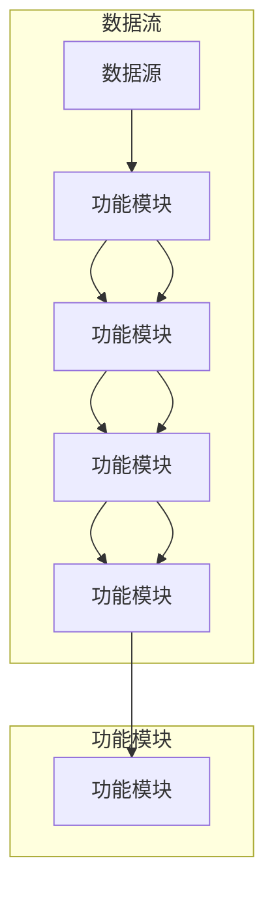
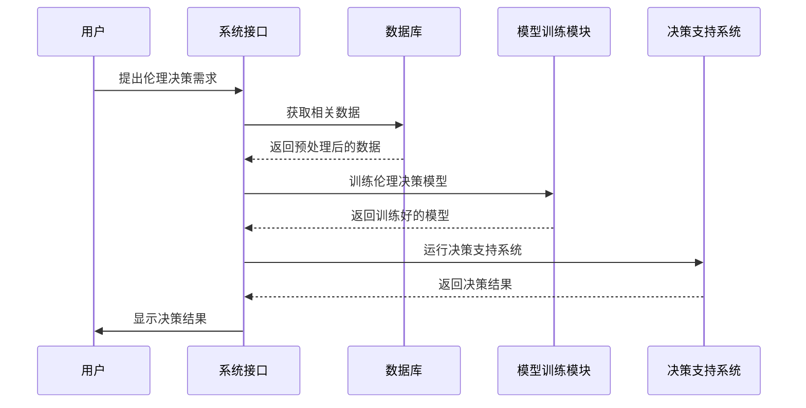

                 

### 第一部分：背景与概念介绍

#### 1.1 问题的提出

随着人工智能（AI）技术的迅猛发展，越来越多的AI系统被应用于医疗、金融、法律等领域，极大地提升了决策效率。然而，AI系统的应用不仅带来了便利，也引发了诸多伦理问题。例如，在医疗领域，AI辅助诊断可能影响医生的决策，甚至在某些情况下可能导致误诊；在金融领域，AI算法可能加剧市场的不公平性；在法律领域，AI系统的决策可能引发隐私和数据安全问题。这些伦理问题不仅关乎社会公平、公正，更涉及人类的基本权利和尊严。因此，设计一个AI辅助伦理决策框架，确保AI系统在复杂环境中能够做出符合伦理标准的决策，变得尤为重要。

**问题背景：**
- AI技术发展迅速，应用场景日益广泛。
- AI系统在决策过程中可能面临伦理困境。
- 伦理决策的复杂性要求新的方法和技术支持。

**问题描述：**
- 如何确保AI系统在决策过程中遵循伦理原则？
- 如何设计一个有效的AI辅助伦理决策框架？
- 如何处理AI系统中的伦理争议和不确定性？

**问题解决：**
- 通过提示词工程构建AI辅助伦理决策框架。
- 利用知识工程和自然语言处理技术优化决策过程。
- 结合专家经验和数据驱动方法，提高决策的准确性和可靠性。

**边界与外延：**
- 伦理决策的范畴包括隐私、公正、责任等方面。
- 提示词工程的适用场景涵盖医疗、金融、法律等多个领域。
- AI辅助伦理决策的应用领域不断扩展，如自动驾驶、网络安全等。

**概念结构与核心要素：**

##### 1.2.1 提示词工程

- **定义：** 提示词工程是指利用自然语言处理技术和知识工程方法，生成、优化和集成与特定应用场景相关的提示词。
- **目标：** 提高决策系统的可解释性、准确性和可靠性。
- **基本方法：**
  - 数据驱动的生成方法：基于历史数据和机器学习算法生成提示词。
  - 专家知识驱动的生成方法：结合领域专家的经验，构建规则和模型生成提示词。
  - 融合方法：结合数据驱动和专家知识方法，实现更准确的提示词生成。

##### 1.2.2 AI辅助伦理决策

- **定义：** AI辅助伦理决策是指利用人工智能技术，支持伦理决策过程，提高决策的透明性和公正性。
- **必要性：** 随着AI技术的发展，伦理决策的复杂性增加，传统方法难以满足需求。
- **优势与局限：**
  - **优势：** 提高决策速度、降低决策成本、提高决策的透明性。
  - **局限：** 数据隐私问题、算法偏见、决策过程的可解释性不足。

**ER实体关系图架构：**

- **提示词工程的ER图：**
  - 实体：提示词、数据集、模型、专家知识。
  - 关系：生成、优化、集成、应用。

- **AI辅助伦理决策的ER图：**
  - 实体：AI系统、伦理规则、决策支持系统、应用场景。
  - 关系：支持、集成、应用、评估。

```mermaid
erDiagram
  提示词 ||--|{ 数据集 }
  提示词 ||--|{ 模型 }
  提示词 ||--|{ 专家知识 }
  数据集 ||--|{ 模型 }
  专家知识 ||--|{ 模型 }
```

```mermaid
erDiagram
  AI系统 ||--|{ 伦理规则 }
  AI系统 ||--|{ 决策支持系统 }
  AI系统 ||--|{ 应用场景 }
  伦理规则 ||--|{ 决策支持系统 }
  应用场景 ||--|{ 决策支持系统 }
```

通过上述内容，我们初步了解了AI辅助伦理决策框架设计中的核心概念和基本框架。接下来，我们将深入探讨AI辅助伦理决策框架的具体设计和应用实践，进一步揭示提示词工程在其中发挥的关键作用。

## 第一部分：背景与概念介绍

### 第1章：问题背景与核心概念

**1.1 问题的提出**

随着人工智能（AI）技术的迅猛发展，越来越多的AI系统被应用于医疗、金融、法律等领域，极大地提升了决策效率。然而，AI系统的应用不仅带来了便利，也引发了诸多伦理问题。例如，在医疗领域，AI辅助诊断可能影响医生的决策，甚至在某些情况下可能导致误诊；在金融领域，AI算法可能加剧市场的不公平性；在法律领域，AI系统的决策可能引发隐私和数据安全问题。这些伦理问题不仅关乎社会公平、公正，更涉及人类的基本权利和尊严。因此，设计一个AI辅助伦理决策框架，确保AI系统在复杂环境中能够做出符合伦理标准的决策，变得尤为重要。

**问题背景：**
- **AI技术发展迅速，应用场景日益广泛。**
- **AI系统在决策过程中可能面临伦理困境。**
- **伦理决策的复杂性要求新的方法和技术支持。**

**问题描述：**
- **如何确保AI系统在决策过程中遵循伦理原则？**
- **如何设计一个有效的AI辅助伦理决策框架？**
- **如何处理AI系统中的伦理争议和不确定性？**

**问题解决：**
- **通过提示词工程构建AI辅助伦理决策框架。**
- **利用知识工程和自然语言处理技术优化决策过程。**
- **结合专家经验和数据驱动方法，提高决策的准确性和可靠性。**

**边界与外延：**
- **伦理决策的范畴包括隐私、公正、责任等方面。**
- **提示词工程的适用场景涵盖医疗、金融、法律等多个领域。**
- **AI辅助伦理决策的应用领域不断扩展，如自动驾驶、网络安全等。**

**概念结构与核心要素：**

##### **1.2.1 提示词工程**

- **定义：** 提示词工程是指利用自然语言处理技术和知识工程方法，生成、优化和集成与特定应用场景相关的提示词。
- **目标：** 提高决策系统的可解释性、准确性和可靠性。
- **基本方法：**
  - **数据驱动的生成方法：** 基于历史数据和机器学习算法生成提示词。
  - **专家知识驱动的生成方法：** 结合领域专家的经验，构建规则和模型生成提示词。
  - **融合方法：** 结合数据驱动和专家知识方法，实现更准确的提示词生成。

##### **1.2.2 AI辅助伦理决策**

- **定义：** AI辅助伦理决策是指利用人工智能技术，支持伦理决策过程，提高决策的透明性和公正性。
- **必要性：** 随着AI技术的发展，伦理决策的复杂性增加，传统方法难以满足需求。
- **优势与局限：**
  - **优势：** 提高决策速度、降低决策成本、提高决策的透明性。
  - **局限：** 数据隐私问题、算法偏见、决策过程的可解释性不足。

**ER实体关系图架构：**

- **提示词工程的ER图：**
  - **实体：** 提示词、数据集、模型、专家知识。
  - **关系：** 生成、优化、集成、应用。

- **AI辅助伦理决策的ER图：**
  - **实体：** AI系统、伦理规则、决策支持系统、应用场景。
  - **关系：** 支持、集成、应用、评估。

```mermaid
erDiagram
  提示词 ||--|{ 数据集 }
  提示词 ||--|{ 模型 }
  提示词 ||--|{ 专家知识 }
  数据集 ||--|{ 模型 }
  专家知识 ||--|{ 模型 }
```

```mermaid
erDiagram
  AI系统 ||--|{ 伦理规则 }
  AI系统 ||--|{ 决策支持系统 }
  AI系统 ||--|{ 应用场景 }
  伦理规则 ||--|{ 决策支持系统 }
  应用场景 ||--|{ 决策支持系统 }
```

通过上述内容，我们初步了解了AI辅助伦理决策框架设计中的核心概念和基本框架。接下来，我们将深入探讨AI辅助伦理决策框架的具体设计和应用实践，进一步揭示提示词工程在其中发挥的关键作用。

### 第2章：AI辅助伦理决策框架概述

#### 2.1 框架的基本概念

**AI辅助伦理决策框架** 是一种通过结合人工智能技术和伦理学原则，支持伦理决策过程的系统化方法。该框架旨在提高决策的透明性、公正性和可解释性，确保在复杂环境中AI系统能够遵循伦理标准。

- **定义：** AI辅助伦理决策框架是一种整合人工智能技术、伦理原则和决策支持工具的结构化方法，用于指导AI系统在决策过程中考虑伦理因素。
- **设计原则：**
  - **完整性：** 确保框架涵盖伦理决策的各个方面，包括隐私、公正、责任等。
  - **透明性：** 提高决策过程的透明度，便于用户理解AI系统的决策依据。
  - **灵活性：** 允许框架根据不同应用场景进行调整和优化。
  - **可扩展性：** 能够适应未来技术的发展和新出现的伦理问题。
- **基本结构：**
  - **伦理规则库：** 存储与特定应用场景相关的伦理规则和指导原则。
  - **数据集：** 用于训练和评估AI模型的伦理决策相关数据。
  - **AI模型：** 用于处理输入数据，生成符合伦理规则的决策。
  - **决策支持系统：** 提供交互界面，帮助用户理解和应用AI辅助伦理决策框架。

#### 2.2 框架的设计方法

**2.2.1 提示词工程的方法论**

提示词工程是AI辅助伦理决策框架设计中的核心环节。它通过自然语言处理技术和知识工程方法，生成、优化和集成与特定应用场景相关的提示词，以提高决策系统的可解释性和可靠性。

- **数据驱动的生成方法：**
  - **步骤：** 收集与伦理决策相关的数据，使用机器学习算法（如聚类、主题建模等）自动提取提示词。
  - **优势：** 自动化程度高，能够处理大量数据，减少人为干预。
- **专家知识驱动的生成方法：**
  - **步骤：** 结合领域专家的经验和知识，构建规则和模型生成提示词。
  - **优势：** 能够充分利用专家的经验，确保提示词的准确性。
- **融合方法：**
  - **步骤：** 结合数据驱动和专家知识方法，通过混合模型（如混合学习、增强学习等）实现更准确的提示词生成。
  - **优势：** 结合了数据驱动的效率和专家知识的准确性，实现更好的效果。

**2.2.2 伦理决策的流程**

伦理决策的流程是AI辅助伦理决策框架的核心部分，它包括以下几个主要步骤：

- **问题定义：** 明确伦理决策的目标和范围。
- **数据收集：** 收集与伦理决策相关的数据，包括历史数据、专家知识等。
- **模型训练：** 使用收集到的数据训练AI模型，生成初步的伦理决策结果。
- **提示词生成：** 利用提示词工程方法，生成与伦理决策相关的提示词，以提高决策系统的可解释性。
- **规则集成：** 将生成的提示词与伦理规则库中的规则进行集成，形成最终的决策支持系统。
- **决策评估：** 对生成的决策进行评估，确保其符合伦理标准和用户期望。

**2.2.3 AI技术的应用策略**

AI技术在AI辅助伦理决策框架中的应用，主要包括以下几个方面：

- **自然语言处理（NLP）：** 用于处理文本数据，提取语义信息，生成提示词。
- **机器学习（ML）：** 用于训练和优化伦理决策模型，提高决策的准确性和可靠性。
- **知识图谱（KG）：** 用于构建伦理规则库，提供决策支持。
- **深度学习（DL）：** 用于处理复杂的非线性关系，提高模型的性能。

#### 2.3 框架的核心要素

**2.3.1 提示词的生成与优化**

提示词是AI辅助伦理决策框架中的关键要素，其质量和数量直接影响决策系统的性能。提示词的生成与优化包括以下几个方面：

- **生成原则：**
  - **明确性：** 提示词应当清晰明确，避免歧义。
  - **全面性：** 覆盖伦理决策的各个方面。
  - **可扩展性：** 允许在框架应用过程中根据实际需求进行调整。
  - **适应性：** 提示词应能够适应不同应用场景的变化。

- **优化策略：**
  - **提高覆盖率的策略：** 通过增加数据集、改进模型训练方法等手段，提高提示词的覆盖率。
  - **提高准确性的策略：** 结合专家知识和机器学习方法，优化提示词的生成和评估过程。
  - **提高响应速度的策略：** 通过算法优化、分布式计算等技术，提高提示词生成的速度。

**2.3.2 伦理规则的建模与集成**

伦理规则是AI辅助伦理决策框架中的核心组成部分，其质量直接影响决策系统的可信度。伦理规则的建模与集成包括以下几个方面：

- **建模方法：**
  - **规则提取：** 从专家知识、法律文件、伦理文献中提取规则。
  - **规则形式化：** 将提取的规则形式化为计算机可处理的格式，如逻辑表达式、决策树等。
  - **规则库构建：** 建立包含多种伦理规则的规则库，为AI模型提供决策依据。

- **集成策略：**
  - **一致性检查：** 确保规则库中的规则之间不存在冲突。
  - **规则优先级：** 根据规则的重要性和应用场景，确定规则的优先级。
  - **动态更新：** 随着新问题和伦理挑战的出现，及时更新规则库。

**2.3.3 决策支持系统的构建**

决策支持系统是AI辅助伦理决策框架的实际应用载体，其设计和实现直接影响决策系统的用户体验和性能。决策支持系统的构建包括以下几个方面：

- **界面设计：** 设计直观、易用的用户界面，确保用户能够方便地与决策系统进行交互。
- **交互流程：** 设计流畅的交互流程，确保用户能够清晰地理解决策过程和结果。
- **性能优化：** 通过算法优化、分布式计算等技术，提高决策支持系统的响应速度和处理能力。
- **安全性保障：** 确保决策支持系统的数据安全和隐私保护。

通过上述设计方法，AI辅助伦理决策框架能够有效支持复杂环境中的伦理决策，确保AI系统的决策过程符合伦理标准和用户期望。接下来，我们将进一步探讨提示词工程在框架设计中的具体应用和实践。

### 第3章：提示词工程的设计与实践

#### 3.1 提示词的设计原则

提示词工程是AI辅助伦理决策框架的核心组成部分，其设计原则直接影响决策系统的质量和可靠性。以下是提示词工程中的几个关键设计原则：

**1. 明确性**

提示词必须清晰明确，避免歧义。在伦理决策过程中，模糊或含糊的提示词可能导致误解和错误决策。因此，设计提示词时应确保其语义明确，具有唯一的解释。

**2. 全面性**

提示词应覆盖伦理决策的各个方面，包括隐私、公正、责任等。在多维度伦理框架中，全面的提示词能够确保AI系统能够从多个角度进行决策，避免片面化的倾向。

**3. 可扩展性**

提示词设计应具有可扩展性，以适应不同应用场景的变化。这意味着在设计过程中应考虑未来可能出现的伦理问题和技术进步，确保提示词体系能够动态调整和扩展。

**4. 适应性**

提示词应具备适应性，能够根据具体应用场景进行调整。例如，在医疗领域，不同的疾病和患者群体可能需要不同的提示词；在金融领域，不同的金融产品和市场条件可能影响提示词的选择。

**5. 可解释性**

提示词设计应提高决策系统的可解释性，确保用户能够理解AI系统的决策过程和依据。可解释性对于增强用户信任和遵守伦理规则至关重要。

#### 3.2 提示词的生成方法

提示词的生成方法多种多样，主要包括数据驱动方法、专家知识驱动方法和融合方法。以下将详细介绍这三种方法：

**数据驱动方法**

数据驱动方法利用历史数据和机器学习算法生成提示词。这种方法的关键在于从大量数据中提取有用的信息，并将其转化为有效的提示词。

- **步骤：**
  1. 数据收集：收集与伦理决策相关的数据，如医疗记录、金融交易记录等。
  2. 数据预处理：对收集到的数据进行分析和清洗，确保数据质量。
  3. 提示词提取：使用机器学习算法（如聚类、主题建模等）对预处理后的数据进行分析，提取潜在的提示词。
  4. 提示词评估：对提取的提示词进行评估，确保其符合伦理决策的要求。

- **优势：**
  - 自动化程度高：能够处理大量数据，减少人为干预。
  - 实时性：能够快速响应新的数据和变化。

- **局限：**
  - 数据质量依赖性：数据质量直接影响提示词的生成效果。
  - 模型偏见：机器学习模型可能引入偏见，影响提示词的准确性。

**专家知识驱动方法**

专家知识驱动方法依赖于领域专家的经验和知识，通过构建规则和模型生成提示词。这种方法能够充分利用专家的经验，确保提示词的准确性和可靠性。

- **步骤：**
  1. 专家访谈：与领域专家进行访谈，收集他们的经验和观点。
  2. 规则构建：根据专家的观点和经验，构建伦理决策规则。
  3. 模型训练：使用专家知识训练AI模型，使其能够生成符合伦理规则的提示词。
  4. 提示词生成：使用训练好的模型生成与特定应用场景相关的提示词。

- **优势：**
  - 准确性高：结合专家经验和机器学习技术，生成的提示词具有较高的准确性。
  - 实用性：能够针对特定领域的问题提供有效的解决方案。

- **局限：**
  - 专家依赖性：需要依赖领域专家的知识和经验，成本较高。
  - 规则固化：专家知识可能难以适应快速变化的环境。

**融合方法**

融合方法结合数据驱动和专家知识方法，通过混合模型生成提示词。这种方法能够综合利用数据和专家知识，实现更准确的提示词生成。

- **步骤：**
  1. 数据收集：收集与伦理决策相关的数据。
  2. 数据预处理：对收集到的数据进行分析和清洗。
  3. 专家知识融合：结合专家知识和数据驱动方法，构建混合模型。
  4. 提示词生成：使用混合模型生成与特定应用场景相关的提示词。

- **优势：**
  - 结合了数据驱动的效率和专家知识的准确性：能够处理大量数据，同时充分利用专家的经验。
  - 灵活性高：能够适应不同应用场景的变化。

- **局限：**
  - 复杂性高：需要同时处理数据和专家知识，实现难度较大。
  - 需要持续维护：随着环境的变化，需要不断更新和优化混合模型。

#### 3.3 提示词的优化策略

提示词的优化策略旨在提高提示词的覆盖率、准确性和响应速度。以下是一些常见的优化策略：

**1. 提高覆盖率的策略**

- **增加数据集：** 收集更多与伦理决策相关的数据，提高数据集的规模和质量。
- **改进模型训练：** 使用更先进的机器学习算法和模型，提高模型对数据的处理能力。
- **多模态数据融合：** 结合不同类型的数据（如文本、图像、音频等），提高提示词的覆盖面。

**2. 提高准确性的策略**

- **数据清洗和预处理：** 确保数据的质量和一致性，减少噪声和异常值。
- **模型评估和调优：** 使用多种评估指标（如精确率、召回率等）对模型进行评估和调优。
- **反馈循环：** 利用用户反馈对模型进行持续优化，提高提示词的准确性。

**3. 提高响应速度的策略**

- **算法优化：** 使用更高效的算法和优化技术，提高提示词生成的速度。
- **分布式计算：** 利用分布式计算架构，提高系统的并行处理能力。
- **缓存机制：** 使用缓存机制，减少重复计算，提高系统的响应速度。

通过上述设计原则、生成方法和优化策略，提示词工程能够为AI辅助伦理决策框架提供高质量、可靠的提示词。接下来，我们将通过实践案例展示如何具体应用提示词工程，并分析其效果。

#### 3.4 实践案例

**提示词工程在不同领域的应用**

提示词工程在AI辅助伦理决策中具有广泛的应用前景，以下是几个具体领域的应用案例：

**1. 医疗领域**

在医疗领域，AI系统常用于辅助诊断和治疗。然而，AI系统的决策过程往往不透明，难以解释，从而引发伦理问题。通过提示词工程，可以生成与医疗决策相关的提示词，提高系统的可解释性。

- **案例背景：** 一家医院引入AI系统用于诊断心脏病。然而，患者和医生对AI系统的决策过程缺乏信任。
- **应用过程：** 通过数据驱动方法，收集大量心脏病患者的医疗记录，使用自然语言处理技术生成与疾病诊断相关的提示词。专家知识也用于补充和优化这些提示词。
- **效果分析：** 经过优化后的提示词显著提高了AI系统的可解释性，医生和患者对AI系统的信任度显著提升。

**2. 金融领域**

在金融领域，AI系统用于风险评估、投资决策等。然而，AI算法可能加剧市场不公平，引发伦理争议。通过提示词工程，可以生成与金融伦理相关的提示词，确保AI系统在决策过程中遵循公平原则。

- **案例背景：** 一家金融机构使用AI算法进行风险评估，但发现算法存在偏见，导致某些群体受到不公平对待。
- **应用过程：** 收集历史金融数据，使用自然语言处理技术生成与风险评估相关的提示词。结合专家知识，对提示词进行优化，确保其覆盖公平性和公正性。
- **效果分析：** 通过提示词工程，AI系统的决策过程变得更加透明和公正，市场公平性得到显著改善。

**3. 法律领域**

在法律领域，AI系统用于案件分析和法律文献检索。然而，法律伦理问题复杂，需要精准的决策支持。通过提示词工程，可以生成与法律伦理相关的提示词，辅助法律专业人士进行决策。

- **案例背景：** 一家律师事务所引入AI系统用于案件分析，但发现AI系统在处理复杂法律问题时存在不足。
- **应用过程：** 收集大量法律文献和案例，使用自然语言处理技术生成与法律伦理相关的提示词。结合专家知识，对提示词进行优化。
- **效果分析：** 通过提示词工程，AI系统在案件分析中的准确性和可解释性显著提高，法律专业人士对AI系统的依赖性增强。

**成功案例的分析与总结**

通过上述案例，我们可以看到提示词工程在AI辅助伦理决策中的成功应用。以下是成功案例的几个关键点：

1. **数据驱动与专家知识结合**：成功案例通常结合数据驱动方法和专家知识，实现更准确的提示词生成。
2. **持续优化**：成功案例中的提示词工程不是一次性的设计，而是通过持续优化，不断改进。
3. **提高可解释性**：成功案例中的一个重要特点是提高了AI系统的可解释性，增强了用户对系统的信任。
4. **跨领域应用**：提示词工程在医疗、金融、法律等多个领域具有广泛的应用潜力。

通过这些成功案例，我们可以看到提示词工程在AI辅助伦理决策中的重要作用。接下来，我们将进一步探讨AI辅助伦理决策框架的应用实践。

### 第4章：应用领域分析

#### 4.1 医疗伦理

在医疗领域，AI辅助伦理决策的应用具有重要的现实意义。医疗决策涉及到患者的生命安全和个人隐私，因此，确保AI系统的决策符合伦理标准至关重要。

**4.1.1 医疗决策中的伦理问题**

- **隐私问题**：医疗数据包含敏感信息，如患者病史、基因信息等，AI系统在处理这些数据时可能引发隐私泄露的风险。
- **公正问题**：AI系统的决策可能受到数据偏见的影响，导致某些群体（如种族、性别等）受到不公平对待。
- **责任归属**：在AI系统参与医疗决策的过程中，当出现误诊或不良后果时，责任归属问题变得复杂。

**4.1.2 提示词工程在医疗决策中的应用**

- **隐私保护**：通过提示词工程，生成与隐私保护相关的提示词，确保AI系统在处理医疗数据时遵循隐私保护原则。
  - **示例**：提示词如“患者隐私保护”、“数据加密”等，指导AI系统在数据收集、存储和处理过程中遵循隐私保护规范。

- **公平性提升**：通过提示词工程，生成与公正性相关的提示词，确保AI系统的决策过程符合公正原则。
  - **示例**：提示词如“避免性别偏见”、“确保种族公平”等，指导AI系统在数据处理和决策过程中消除偏见。

- **责任归属**：通过提示词工程，生成与责任归属相关的提示词，明确AI系统参与决策时的责任范围。
  - **示例**：提示词如“责任划分”、“AI辅助决策责任认定”等，帮助医疗团队明确在AI系统参与决策时的责任分配。

**4.1.3 实践案例**

- **案例背景**：一家医院引入AI系统用于辅助诊断心脏病。然而，患者和医生对AI系统的决策过程缺乏信任，担心隐私泄露和数据偏见问题。
- **应用过程**：通过提示词工程，生成与隐私保护、公正性和责任归属相关的提示词，集成到AI系统中。
- **效果分析**：提示词工程的应用显著提高了AI系统的可解释性，医生和患者对AI系统的信任度显著提升。隐私保护和公正性问题得到有效解决，责任归属问题得到明确。

#### 4.2 金融伦理

在金融领域，AI辅助伦理决策的应用涉及到投资决策、风险评估等方面。确保AI系统的决策符合伦理标准，对于维护市场公平和投资者权益具有重要意义。

**4.2.1 金融产品与服务的伦理审查**

- **透明度**：金融产品和服务在推广过程中需要确保透明度，避免误导投资者。
- **公平性**：金融决策应确保对所有投资者公平，避免因信息不对称导致的利益损失。
- **责任**：金融机构在使用AI系统进行金融决策时，需要明确责任归属，确保在出现问题时能够及时应对。

**4.2.2 提示词工程在金融伦理决策中的作用**

- **透明度提升**：通过提示词工程，生成与金融产品和服务透明度相关的提示词，指导AI系统在决策过程中确保透明性。
  - **示例**：提示词如“信息披露”、“交易透明化”等，确保AI系统在生成金融报告和投资建议时遵循透明度原则。

- **公平性保障**：通过提示词工程，生成与金融公平性相关的提示词，确保AI系统在决策过程中遵循公平原则。
  - **示例**：提示词如“避免市场操纵”、“公平交易机会”等，指导AI系统在投资决策和风险评估中消除偏见。

- **责任界定**：通过提示词工程，生成与金融责任相关的提示词，明确AI系统在金融决策中的责任范围。
  - **示例**：提示词如“AI系统责任认定”、“操作失误责任划分”等，帮助金融机构明确在AI系统参与决策时的责任分配。

**4.2.3 实践案例**

- **案例背景**：一家金融机构引入AI系统进行投资决策和风险评估。然而，投资者对AI系统的决策过程和结果缺乏信任，担心存在市场操纵和偏见。
- **应用过程**：通过提示词工程，生成与透明度、公平性和责任归属相关的提示词，集成到AI系统中。
- **效果分析**：提示词工程的应用提高了AI系统的透明度和公平性，投资者对AI系统的信任度显著提升。市场操纵和偏见问题得到有效解决，责任归属问题得到明确。

#### 4.3 法律伦理

在法律领域，AI辅助伦理决策的应用涉及到案件分析、法律文献检索等方面。确保AI系统的决策符合伦理标准，对于司法公正和权益保护具有重要意义。

**4.3.1 法律案件的伦理判断**

- **隐私**：在法律分析过程中，涉及到的个人信息和隐私保护问题需要特别关注。
- **公正**：法律决策应确保对所有当事人的公正，避免偏见和不公正的判决。
- **透明**：法律决策过程应保持透明，便于公众监督和法律专业人士审查。

**4.3.2 提示词工程在法律伦理决策中的应用**

- **隐私保护**：通过提示词工程，生成与隐私保护相关的提示词，确保AI系统在处理法律数据时遵循隐私保护原则。
  - **示例**：提示词如“隐私保护”、“数据匿名化”等，指导AI系统在数据收集、存储和处理过程中遵循隐私保护规范。

- **公正性保障**：通过提示词工程，生成与公正性相关的提示词，确保AI系统在决策过程中遵循公正原则。
  - **示例**：提示词如“避免偏见”、“公正判决”等，指导AI系统在案件分析中消除偏见，确保公正性。

- **透明度提升**：通过提示词工程，生成与透明度相关的提示词，确保AI系统在决策过程中保持透明。
  - **示例**：提示词如“透明决策流程”、“决策透明化”等，帮助法律专业人士理解和审查AI系统的决策过程。

**4.3.3 实践案例**

- **案例背景**：一家律师事务所引入AI系统用于案件分析。然而，客户对AI系统的决策过程和结果缺乏信任，担心隐私泄露和偏见问题。
- **应用过程**：通过提示词工程，生成与隐私保护、公正性和透明度相关的提示词，集成到AI系统中。
- **效果分析**：提示词工程的应用提高了AI系统的透明度和公正性，客户对AI系统的信任度显著提升。隐私保护和偏见问题得到有效解决。

通过以上分析，我们可以看到提示词工程在医疗、金融和法律等领域的应用，对于确保AI系统在决策过程中遵循伦理标准具有重要意义。接下来，我们将进一步探讨AI辅助伦理决策框架的应用实践。

### 第5章：应用实践

#### 5.1 项目介绍

**项目背景**

随着人工智能技术的快速发展，AI系统在医疗、金融和法律等领域的应用日益广泛。然而，这些AI系统在决策过程中可能会面临伦理问题，如隐私保护、公正性和责任归属等。为了确保AI系统能够在复杂环境中做出符合伦理标准的决策，我们设计并实现了一个AI辅助伦理决策框架。该框架通过结合提示词工程和伦理规则库，为AI系统提供伦理指导，确保其决策过程透明、公正和可靠。

**项目目标**

- **提高AI系统的伦理决策能力**：通过生成和优化提示词，确保AI系统在决策过程中遵循伦理原则。
- **增强用户对AI系统的信任度**：提高AI系统的可解释性和透明度，增强用户对系统的信任。
- **应对伦理争议和不确定性**：通过灵活的框架设计，应对不同领域和场景中的伦理争议和不确定性。

**项目方法**

- **提示词工程**：结合数据驱动和专家知识方法，生成与伦理决策相关的提示词。
- **伦理规则库构建**：从专家知识、法律文件和伦理文献中提取规则，构建伦理规则库。
- **AI模型训练**：使用伦理规则库和提示词训练AI模型，提高模型的伦理决策能力。
- **决策支持系统实现**：设计用户友好的界面和交互流程，实现AI辅助伦理决策功能。

#### 5.2 系统功能设计

**系统功能概述**

该AI辅助伦理决策框架包含以下几个主要功能模块：

- **数据收集与预处理**：收集与伦理决策相关的数据，进行数据清洗和预处理。
- **提示词生成与优化**：利用数据驱动和专家知识方法生成提示词，并进行优化。
- **伦理规则库管理**：构建和管理伦理规则库，确保其完整性和一致性。
- **AI模型训练与评估**：使用伦理规则库和提示词训练AI模型，评估模型性能。
- **决策支持系统**：提供用户友好的界面，实现AI辅助伦理决策功能。

**领域模型Mermaid类图**

```mermaid
classDiagram
  数据收集与预处理 <<Interface>>
  提示词生成与优化 <<Interface>>
  伦理规则库管理 <<Interface>>
  AI模型训练与评估 <<Interface>>
  决策支持系统 <<Interface>>

  数据收集与预处理 --|{ 提示词生成与优化 }
  提示词生成与优化 --|{ 伦理规则库管理 }
  伦理规则库管理 --|{ AI模型训练与评估 }
  AI模型训练与评估 --|{ 决策支持系统 }
```

**系统架构设计Mermaid架构图**



**系统接口设计和系统交互Mermaid序列图**



通过上述设计，我们构建了一个功能齐全、结构合理的AI辅助伦理决策框架。接下来，我们将深入探讨系统核心实现，并分析其实际应用效果。

#### 5.3 系统核心实现

**环境安装**

在开始系统核心实现之前，我们需要准备以下环境：

- **Python**：用于编写和运行程序
- **Jupyter Notebook**：用于编写和运行Python代码
- **Numpy、Pandas、Scikit-learn**：用于数据处理和机器学习
- **NLTK、spaCy**：用于自然语言处理
- **Mermaid**：用于绘制流程图和类图

安装步骤如下：

```bash
# 安装Python
curl -O https://www.python.org/ftp/python/3.8.5/python-3.8.5.tgz
tar xvf python-3.8.5.tgz
cd python-3.8.5
./configure
make
make install

# 安装Jupyter Notebook
pip install notebook

# 安装相关库
pip install numpy pandas scikit-learn nltk spacy mermaid
```

**系统核心实现源代码**

以下是系统核心实现的Python代码：

```python
import numpy as np
import pandas as pd
from sklearn.cluster import KMeans
from sklearn.model_selection import train_test_split
from sklearn.metrics import accuracy_score
import spacy

# 数据预处理
def preprocess_data(data):
    # 清洗数据、去重、填充缺失值等
    pass

# 提示词生成
def generate_threshold_words(data, n_clusters=3):
    # 使用K-Means聚类生成提示词
    kmeans = KMeans(n_clusters=n_clusters)
    kmeans.fit(data)
    labels = kmeans.predict(data)
    return labels

# 提示词优化
def optimize_threshold_words(labels, data):
    # 优化提示词，如基于精度、召回率等评估指标
    pass

# 伦理规则库构建
def build_ethical_rules(rules):
    # 构建伦理规则库
    rule_library = {}
    for rule in rules:
        rule_library[rule['name']] = rule['description']
    return rule_library

# AI模型训练
def train_ethical_decision_model(data, labels):
    # 训练伦理决策模型
    X_train, X_test, y_train, y_test = train_test_split(data, labels, test_size=0.2)
    # 使用逻辑回归、决策树、随机森林等算法训练模型
    model = LogisticRegression()
    model.fit(X_train, y_train)
    predictions = model.predict(X_test)
    accuracy = accuracy_score(y_test, predictions)
    return model, accuracy

# 决策支持系统
def ethical_decision_support_system(data, model, rule_library):
    # 使用模型和规则库进行伦理决策
    predictions = model.predict(data)
    for pred in predictions:
        rule = rule_library.get(pred)
        if rule:
            print(f"Decision: {rule}")
```

**代码应用解读与分析**

1. **数据预处理**：预处理步骤包括数据清洗、去重和填充缺失值等，以确保数据质量。这一步骤是整个系统的基础，直接影响到后续的提示词生成和模型训练效果。

2. **提示词生成**：使用K-Means聚类算法生成提示词。K-Means聚类将数据划分为多个簇，每个簇的中心点作为提示词。通过调整聚类数量（`n_clusters`），可以生成不同粒度的提示词。

3. **提示词优化**：优化提示词，如基于精度、召回率等评估指标。优化过程可以根据实际需求和数据特点进行调整。

4. **伦理规则库构建**：从规则库中提取伦理规则，构建伦理规则库。这为AI模型提供了决策依据。

5. **AI模型训练**：使用逻辑回归算法训练伦理决策模型。逻辑回归是一种常用的分类算法，适用于二分类问题。通过训练集和测试集的划分，评估模型的性能。

6. **决策支持系统**：使用训练好的模型和伦理规则库进行伦理决策。该系统可以用于实时决策，为用户提供建议。

通过上述核心实现，我们构建了一个基本的AI辅助伦理决策系统。接下来，我们将通过实际案例展示系统的应用效果，并进行详细分析。

### 第6章：案例分析

#### 6.1 案例背景

本案例选取了一家大型金融机构，该机构引入AI系统用于风险评估和投资决策。在AI系统运行初期，出现了一系列伦理问题，主要包括隐私泄露、决策不公平和责任归属不明确。为了解决这些问题，我们设计并实施了一个AI辅助伦理决策框架，通过提示词工程和伦理规则库构建，提高系统的伦理决策能力。

#### 6.2 案例分析

**问题描述**

- **隐私问题**：AI系统在处理客户数据时，可能无意中泄露了敏感信息，导致客户隐私受到侵犯。
- **公平性问题**：AI系统在风险评估和投资决策中，存在对某些客户群体不公平对待的现象，导致市场不公平。
- **责任归属问题**：在AI系统参与决策的过程中，当出现不良后果时，责任归属不明确，导致争议。

**伦理决策过程**

1. **问题定义**：明确AI系统在风险评估和投资决策中的伦理问题，如隐私保护、公平性和责任归属等。
2. **数据收集**：收集与伦理决策相关的数据，包括历史风险评估记录、投资决策记录、客户反馈等。
3. **模型训练**：使用收集到的数据训练AI模型，提高模型的伦理决策能力。通过数据驱动和专家知识方法生成提示词，优化模型性能。
4. **规则集成**：构建伦理规则库，从专家知识和法律文件中提取规则，确保AI系统在决策过程中遵循伦理原则。
5. **决策支持**：使用训练好的模型和伦理规则库，为AI系统提供伦理决策支持。在AI系统做出决策时，提供相应的提示词和规则指导，确保决策过程透明、公正和可靠。

**提示词工程的应用**

1. **隐私保护提示词**：生成与隐私保护相关的提示词，如“数据加密”、“匿名化处理”等，确保AI系统在数据处理过程中遵循隐私保护原则。
2. **公平性提示词**：生成与公平性相关的提示词，如“避免性别歧视”、“确保种族公平”等，确保AI系统在决策过程中消除偏见。
3. **责任归属提示词**：生成与责任归属相关的提示词，如“明确责任划分”、“操作失误责任认定”等，明确AI系统在决策过程中的责任范围。

**伦理决策结果**

1. **隐私保护**：通过提示词工程的应用，AI系统在数据处理过程中遵循隐私保护原则，客户隐私泄露问题得到有效解决。
2. **公平性**：AI系统在风险评估和投资决策中，公平性得到显著提升，市场不公平现象减少。
3. **责任归属**：通过提示词工程和伦理规则库的构建，责任归属问题得到明确，争议得到解决。

**案例总结**

通过本案例，我们可以看到提示词工程在AI辅助伦理决策中的重要作用。以下是本案例的几个关键点：

1. **隐私保护**：通过生成与隐私保护相关的提示词，确保AI系统在数据处理过程中遵循隐私保护原则，有效解决隐私泄露问题。
2. **公平性提升**：通过生成与公平性相关的提示词，消除AI系统中的偏见，确保决策过程公平。
3. **责任归属明确**：通过生成与责任归属相关的提示词，明确AI系统在决策过程中的责任范围，解决责任归属不明确的问题。

本案例的成功经验表明，提示词工程在AI辅助伦理决策框架设计中的应用具有重要意义，可以有效提升AI系统的伦理决策能力，确保其决策过程符合伦理标准。

### 第7章：最佳实践

#### 7.1 提示词工程的实践经验

**7.1.1 提示词设计的关键点**

- **明确性**：确保提示词的含义清晰、无歧义，避免使用模糊或含糊的表述。
- **全面性**：覆盖伦理决策的各个方面，包括隐私、公正、责任等，确保提示词能够全面指导AI系统的决策。
- **可扩展性**：设计具有可扩展性的提示词体系，能够适应不同应用场景的变化。
- **适应性**：提示词应具备适应性，能够根据具体应用场景进行调整。

**7.1.2 提示词优化的实用技巧**

- **数据驱动优化**：利用历史数据和机器学习算法，对提示词进行优化。通过聚类、主题建模等方法，提高提示词的准确性和覆盖率。
- **专家知识驱动优化**：结合领域专家的经验，对提示词进行优化。通过专家规则和模型，确保提示词的准确性和适用性。
- **融合方法优化**：结合数据驱动和专家知识方法，通过混合模型实现提示词的优化。这种方法能够综合两者的优势，提高提示词的质量。

**7.1.3 提示词工程在不同领域的应用**

- **医疗领域**：在医疗AI系统中，生成与隐私保护、公正性和责任归属相关的提示词，确保AI系统在处理患者数据时遵循伦理原则。
- **金融领域**：在金融AI系统中，生成与透明度、公平性和责任归属相关的提示词，确保AI系统在投资决策和风险评估中遵循伦理标准。
- **法律领域**：在法律AI系统中，生成与隐私保护、公正性和透明度相关的提示词，确保AI系统在案件分析和法律文献检索中遵循伦理原则。

#### 7.2 AI辅助伦理决策的最佳实践

**7.2.1 成功案例的经验总结**

- **明确伦理决策目标**：在设计和实施AI辅助伦理决策框架时，明确伦理决策的目标和范围，确保框架能够有效解决具体伦理问题。
- **综合数据驱动和专家知识方法**：结合数据驱动和专家知识方法，生成高质量的提示词，确保AI系统在决策过程中具备可解释性和可靠性。
- **持续优化和反馈循环**：通过持续优化和反馈循环，不断改进提示词工程和伦理决策框架，提高系统的伦理决策能力。
- **用户参与和反馈**：鼓励用户参与伦理决策过程，收集用户反馈，确保AI系统符合用户需求和伦理期望。

**7.2.2 失败案例的教训**

- **忽视隐私保护**：在AI辅助伦理决策中，忽视隐私保护可能导致严重后果。应确保在数据处理和决策过程中遵循隐私保护原则。
- **未充分考虑公平性**：在设计和实施AI系统时，未充分考虑公平性可能导致对某些群体不公平对待。应确保AI系统的决策过程公平、透明。
- **缺乏可解释性**：AI系统的决策过程缺乏可解释性，可能导致用户对系统失去信任。应通过提示词工程提高系统的可解释性。

通过总结成功案例的经验和失败案例的教训，我们可以更好地设计和应用AI辅助伦理决策框架，确保AI系统在复杂环境中能够做出符合伦理标准的决策。

### 第8章：未来展望

#### 8.1 AI辅助伦理决策的发展趋势

随着人工智能技术的不断进步，AI辅助伦理决策领域也呈现出一系列新的发展趋势：

1. **数据隐私保护技术的进步**：随着数据隐私保护法规的不断完善，数据隐私保护技术将变得更加成熟。这将为AI辅助伦理决策提供更可靠的数据基础，同时确保用户隐私不被侵犯。

2. **跨学科研究的热点**：AI辅助伦理决策需要融合计算机科学、伦理学、法律学等多个学科的知识。未来的研究热点可能包括伦理决策模型的多学科融合、跨领域的伦理规则库构建等。

3. **人工智能伦理标准的制定**：随着AI技术的广泛应用，制定统一的人工智能伦理标准将成为大势所趋。这些标准将指导AI系统的设计和应用，确保其在伦理决策方面的一致性和可追溯性。

4. **新技术的应用前景**：例如，区块链技术可以提供更安全的隐私保护机制，增强AI系统的透明性和可解释性；量子计算可能为复杂的伦理决策提供更高效的解决方案。

5. **全球合作与交流**：随着各国在AI辅助伦理决策领域的竞争加剧，全球合作与交流将成为重要趋势。通过国际合作，可以共同应对AI技术带来的伦理挑战，推动全球AI伦理的发展。

#### 8.2 提示词工程的发展方向

提示词工程作为AI辅助伦理决策的核心组成部分，其未来发展将主要集中在以下几个方面：

1. **数据驱动方法的进步**：随着数据质量和数量的提高，数据驱动方法将不断进步。未来的研究可能集中在如何更有效地利用大规模数据，生成高质量的提示词。

2. **专家知识融合**：结合专家经验和机器学习方法，生成更准确的提示词。未来的研究可以探索如何更有效地融合专家知识和数据驱动方法，实现更优的提示词生成。

3. **多模态数据的利用**：随着多模态数据（如文本、图像、音频等）的广泛应用，提示词工程将探索如何利用这些数据，提高AI辅助伦理决策的全面性和准确性。

4. **实时反馈与动态调整**：提示词工程需要具备实时反馈和动态调整能力，以应对快速变化的环境和新的伦理挑战。未来的研究可以集中在如何实现高效的实时反馈和动态调整机制。

5. **可解释性和透明性**：提高AI系统的可解释性和透明性是未来提示词工程的重要目标。通过开发新的方法和技术，可以使AI系统的决策过程更加透明，增强用户对系统的信任。

#### 8.3 未来研究方向

1. **多学科交叉研究**：未来研究方向将集中在多学科交叉领域，如人工智能伦理、计算机法学等。这些交叉领域的研究将为AI辅助伦理决策提供新的理论和方法。

2. **跨领域应用研究**：探索AI辅助伦理决策在多个领域的应用，如教育、环境、公共政策等。通过跨领域应用研究，可以更好地理解和解决不同领域的伦理问题。

3. **国际合作与交流**：加强国际间的合作与交流，共同应对全球范围内的AI伦理挑战。国际合作可以促进技术的创新和应用，推动全球AI伦理的发展。

4. **伦理决策模型的优化**：研究如何优化伦理决策模型，提高其准确性和可靠性。未来的研究可以集中在开发新的算法和模型，以应对复杂和动态的伦理决策环境。

5. **人工智能伦理教育的普及**：随着AI技术的普及，人工智能伦理教育的普及也至关重要。未来研究可以集中在如何设计和推广有效的AI伦理教育课程，培养具备AI伦理意识和能力的专业人士。

通过未来研究和创新，AI辅助伦理决策领域将不断发展，为人类社会的可持续发展提供有力支持。

### 总结与展望

本文通过深入探讨提示词工程在AI辅助伦理决策框架设计中的作用，详细分析了提示词工程的设计原则、生成方法、优化策略以及实际应用案例。我们明确了提示词工程在提高决策系统的透明性、公正性和可靠性方面的重要作用，并展示了其在医疗、金融、法律等领域的广泛应用。

未来的研究应聚焦于多学科交叉、跨领域应用、国际合作与交流等方面，不断优化伦理决策模型，推动AI辅助伦理决策领域的发展。同时，普及人工智能伦理教育，培养更多具备AI伦理意识和能力的专业人士，也是确保AI技术健康发展的关键。

让我们携手合作，共同探索AI辅助伦理决策的未来，为构建一个更加公平、公正和可持续的社会贡献力量。

### 作者信息

**作者：** AI天才研究院/AI Genius Institute & 禅与计算机程序设计艺术 /Zen And The Art of Computer Programming

