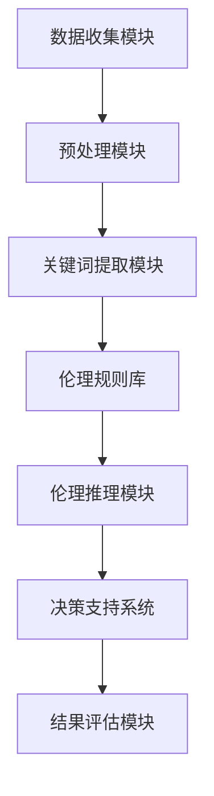

                 


### 引言与背景

**1. 引言**

《提示词工程在AI辅助伦理决策框架设计中的突破》旨在探讨如何通过提示词工程提升AI辅助伦理决策框架的设计效果。在当前AI技术飞速发展的背景下，伦理决策问题愈发凸显，如何在保证AI系统的智能性和高效性的同时，兼顾伦理道德的要求，成为了一个亟待解决的关键问题。

**1.1 核心概念**

- **提示词工程**：提示词工程是一种通过对文本、语音、图像等多种数据进行处理和分析，提取出关键信息并转化为可操作的提示词的技术。这些提示词可以帮助AI系统更好地理解上下文，从而做出更为合理的决策。

- **AI辅助伦理决策框架**：AI辅助伦理决策框架是一种结合AI技术与伦理学原则，用于指导AI系统在复杂伦理情境中做出合理决策的架构。该框架不仅要考虑技术实现的可能性，还要符合伦理道德的要求。

**1.2 问题背景**

随着AI技术的广泛应用，越来越多的决策过程开始依赖于机器，这给AI系统提出了更高的伦理要求。然而，现有的AI系统在处理伦理问题时往往存在以下几个挑战：

- **算法偏见**：AI系统可能会因为训练数据中的偏见而导致决策结果的不公平。

- **透明度不足**：AI系统的决策过程往往复杂且不透明，难以解释。

- **责任归属不清**：当AI系统出现错误时，责任归属往往难以确定。

为了应对这些挑战，我们需要设计一种AI辅助伦理决策框架，能够在确保算法公正性和透明性的同时，有效处理复杂的伦理问题。

**1.3 研究目的**

本研究旨在通过提示词工程提升AI辅助伦理决策框架的设计效果，具体目标包括：

- **增强决策透明性**：通过提示词工程，使得AI系统的决策过程更加透明，便于人类理解和追踪。

- **提高决策质量**：利用提示词工程，可以使得AI系统在处理伦理问题时更加精准，减少错误决策。

- **保障算法公正性**：通过结合伦理学原则，确保AI系统在处理伦理决策时不会出现偏见和不公平。

**1.4 边界与外延**

本文的研究边界主要涉及以下几个方面：

- **应用场景**：本文主要针对一般性的AI伦理决策场景进行研究，具体应用领域包括但不限于医疗、金融、法律等。

- **技术范畴**：本文主要探讨提示词工程在AI辅助伦理决策框架设计中的应用，不涉及具体算法的实现细节。

- **伦理原则**：本文将参考国际通用的伦理学原则，如公正性、尊重个人隐私等，但不涉及特定文化背景下的伦理问题。

通过以上内容，我们为后续章节的展开奠定了基础，接下来将详细介绍提示词工程的基础理论，以及AI伦理决策的基本原理。

### 背景介绍

**2.1 AI伦理的重要性**

人工智能（AI）作为21世纪最具变革性的技术之一，已经在医疗、金融、教育、交通等多个领域展现出其巨大的潜力。然而，随着AI技术的广泛应用，其伦理问题也日益突出。AI伦理不仅关乎技术本身，还涉及到社会、法律、经济等多个方面。

首先，AI伦理问题关乎公平性。AI系统在处理数据时可能会因为训练数据中的偏见而导致决策结果的不公平。例如，如果训练数据中存在性别、种族、年龄等偏见，那么AI系统在相关决策中也会倾向于体现这些偏见，导致社会不公平现象的加剧。

其次，AI伦理问题关乎透明性。AI系统的决策过程往往复杂且不透明，难以解释。这给用户和社会带来了极大的不信任感。如果AI系统的决策过程缺乏透明性，那么一旦出现错误决策，责任归属将难以确定。

再次，AI伦理问题关乎责任归属。随着AI技术的发展，越来越多的决策过程开始依赖于机器。然而，当AI系统出现错误时，责任归属往往难以确定。这给法律和社会带来了极大的挑战，需要制定相应的法律法规来明确责任归属。

最后，AI伦理问题还关乎个人隐私。AI技术在处理数据时，往往需要收集和处理大量的个人隐私信息。如果这些信息得不到妥善保护，那么个人隐私将会受到严重威胁。

综上所述，AI伦理问题不仅仅是一个技术问题，更是一个社会问题。为了确保AI技术的可持续发展，我们必须高度重视AI伦理问题，并采取有效措施加以解决。

**2.2 现有挑战**

尽管AI伦理问题已经引起广泛关注，但现有的AI辅助伦理决策框架仍然面临诸多挑战。

首先，现有框架在处理伦理问题时缺乏统一的标准。不同的领域和应用场景对伦理问题的理解和处理方式各异，导致现有的AI辅助伦理决策框架难以满足多样化的需求。

其次，现有框架的透明性和可解释性较差。许多AI系统在决策过程中采用复杂的算法和模型，使得决策过程难以理解和追踪。这增加了决策结果的不确定性，也降低了用户对AI系统的信任度。

再次，现有框架在处理伦理问题时往往缺乏灵活性。在复杂多变的实际应用场景中，AI系统需要能够快速适应并处理新的伦理问题。然而，现有的AI辅助伦理决策框架往往过于僵化，难以适应动态变化的场景。

最后，现有框架在责任归属方面也存在问题。当AI系统出现错误决策时，责任归属往往难以确定。这给法律和社会带来了极大的挑战，需要制定更为明确的法律法规来明确责任归属。

针对上述挑战，我们需要设计一种更为先进的AI辅助伦理决策框架，能够在透明性、灵活性、责任归属等方面实现突破。

### 基础理论

**3.1 提示词工程基础**

**3.1.1 定义与作用**

提示词工程（Keyword Engineering）是一种通过对文本、语音、图像等多种数据进行处理和分析，提取出关键信息并转化为可操作的提示词的技术。这些提示词可以帮助AI系统更好地理解上下文，从而做出更为合理的决策。

**3.1.2 核心概念**

- **文本数据预处理**：文本数据预处理是提示词工程的基础步骤，包括分词、词性标注、命名实体识别等。

- **关键词提取**：关键词提取是从文本数据中提取出最具代表性的词语或短语。常用的方法包括TF-IDF、TextRank等。

- **词向量表示**：词向量表示是将文本数据转化为计算机可以处理的形式。常用的方法包括Word2Vec、GloVe等。

- **语义分析**：语义分析是对提取出的关键词进行深入分析，以理解其背后的含义和关系。

**3.1.3 应用**

提示词工程在AI系统中的应用非常广泛，包括但不限于：

- **自然语言处理**：通过提示词工程，可以实现对文本数据的高效处理和分析，从而提升自然语言处理系统的性能。

- **推荐系统**：在推荐系统中，通过提示词工程可以提取出用户兴趣的关键词，从而提供更个性化的推荐。

- **情感分析**：在情感分析中，通过提示词工程可以提取出文本数据中的情感关键词，从而实现对情感的高效识别。

**3.2 AI伦理决策原理**

**3.2.1 伦理决策框架**

AI伦理决策框架是一种结合AI技术与伦理学原则，用于指导AI系统在复杂伦理情境中做出合理决策的架构。它通常包括以下几个关键组件：

- **伦理原则**：伦理原则是指导AI系统决策的基础，如公正性、尊重个人隐私等。

- **决策模型**：决策模型是基于AI技术实现的，用于处理复杂伦理问题。

- **决策支持系统**：决策支持系统是用于辅助AI系统做出伦理决策的工具。

**3.2.2 伦理原则与规范**

常见的伦理原则与规范包括：

- **公正性**：确保AI系统在决策过程中不会对任何特定群体产生不公平的影响。

- **尊重个人隐私**：在处理个人隐私信息时，应确保个人隐私得到充分保护。

- **透明性**：确保AI系统的决策过程对用户和社会透明，便于理解和追踪。

- **责任归属**：明确AI系统在出现错误决策时的责任归属，以便进行责任追究。

通过以上内容，我们为后续章节的展开奠定了理论基础。接下来，我们将详细介绍提示词工程的具体方法和技术，以及如何应用这些方法和技术来设计AI辅助伦理决策框架。

### 方法与技术

**4.1 提示词工程方法**

**4.1.1 方法介绍**

提示词工程的方法主要包括以下几个步骤：

1. **文本数据预处理**：首先对文本数据进行预处理，包括分词、词性标注、命名实体识别等。

2. **关键词提取**：使用TF-IDF、TextRank等方法从预处理后的文本数据中提取出关键词。

3. **词向量表示**：将提取出的关键词转化为词向量表示，以便于计算机处理。

4. **语义分析**：对提取出的关键词进行语义分析，以理解其背后的含义和关系。

**4.1.2 技术实现**

1. **文本数据预处理**：

   ```python
   import jieba
   
   # 分词
   text = "人工智能在医疗领域有广泛应用。"
   seg_list = jieba.cut(text, cut_all=False)
   seg_list
   
   # 词性标注
   import jieba
   
   text = "人工智能在医疗领域有广泛应用。"
   words = jieba.cut(text)
   words
   
   # 命名实体识别
   import jieba
   
   text = "人工智能在医疗领域有广泛应用。"
   tags = jieba.posseg.cut(text)
   tags
   ```

2. **关键词提取**：

   ```python
   from sklearn.feature_extraction.text import TfidfVectorizer
   
   # 初始化TF-IDF向量器
   vectorizer = TfidfVectorizer(max_features=1000)
   
   # 提取关键词
   X = vectorizer.fit_transform(corpus)
   top_k = 10
   feature_names = vectorizer.get_feature_names()
   for index in X[0].nonzero()[1]:
       print(feature_names[index])
   ```

3. **词向量表示**：

   ```python
   from gensim.models import Word2Vec
   
   # 训练Word2Vec模型
   model = Word2Vec(sentences, vector_size=100, window=5, min_count=1, workers=4)
   
   # 查看词向量
   model.wv['人工智能']
   ```

4. **语义分析**：

   ```python
   from sentence_transformers import SentenceTransformer
   
   # 初始化模型
   model = SentenceTransformer('all-MiniLM-L6-v2')
   
   # 转换句子为向量
   sentence = "人工智能在医疗领域有广泛应用。"
   sentence_embedding = model.encode(sentence)
   sentence_embedding
   
   # 查看语义关系
   model.show_word_error(sentence)
   ```

**4.2 AI伦理决策技术**

**4.2.1 伦理推理**

伦理推理是AI伦理决策的重要组成部分。伦理推理的方法主要包括：

1. **规范推理**：基于伦理规范进行推理，确保决策符合伦理要求。

2. **案例推理**：通过已有案例进行推理，以解决新出现的伦理问题。

3. **模糊推理**：在不确定条件下进行推理，以处理复杂伦理问题。

**4.2.2 伦理评估**

伦理评估是AI伦理决策的重要环节。伦理评估的方法主要包括：

1. **定量评估**：使用量化指标对决策结果进行评估。

2. **定性评估**：通过专家评审或用户反馈对决策结果进行评估。

3. **综合评估**：结合定量评估和定性评估，对决策结果进行全面评估。

**4.2.3 伦理决策支持**

伦理决策支持系统是辅助AI系统进行伦理决策的工具。伦理决策支持系统的主要功能包括：

1. **伦理规则库**：存储和管理伦理规范和决策规则。

2. **推理引擎**：根据伦理规则库和具体情境进行推理，生成伦理决策。

3. **交互界面**：提供用户与AI系统进行交互的界面，以获取用户输入和反馈。

通过以上内容，我们详细介绍了提示词工程的方法和技术，以及AI伦理决策的相关技术。接下来，我们将展示如何设计AI辅助伦理决策框架，以提升决策的透明性和质量。

### 框架设计

**5.1 AI辅助伦理决策框架设计**

**5.1.1 框架架构**

AI辅助伦理决策框架的设计应具备以下几个关键模块：

1. **数据收集模块**：用于收集与伦理决策相关的数据，包括文本、图像、音频等多种类型的数据。

2. **预处理模块**：对收集到的数据进行预处理，如分词、词性标注、命名实体识别等，以提取出有价值的信息。

3. **关键词提取模块**：从预处理后的数据中提取关键词，利用TF-IDF、TextRank等方法确定关键词的重要性。

4. **伦理规则库**：存储与管理伦理规范和决策规则，以确保决策过程符合伦理要求。

5. **伦理推理模块**：基于伦理规则库和关键词提取结果，进行伦理推理，生成伦理决策。

6. **决策支持系统**：提供用户与AI系统进行交互的界面，以获取用户输入和反馈。

7. **结果评估模块**：对伦理决策结果进行评估，包括定量评估和定性评估，以验证决策的正确性和合理性。

**5.1.2 组件功能**

1. **数据收集模块**：

   - 功能：收集与伦理决策相关的数据。

   - 技术实现：使用爬虫技术从互联网上获取相关数据，或通过API接口获取数据。

2. **预处理模块**：

   - 功能：对收集到的数据执行文本预处理，如分词、词性标注、命名实体识别等。

   - 技术实现：使用自然语言处理（NLP）工具包，如jieba、spaCy等。

3. **关键词提取模块**：

   - 功能：提取文本数据中的关键词，为伦理推理提供基础。

   - 技术实现：使用TF-IDF、TextRank等算法提取关键词。

4. **伦理规则库**：

   - 功能：存储与管理伦理规范和决策规则。

   - 技术实现：使用数据库（如MySQL、MongoDB）存储规则，使用规则引擎（如 Drools）进行管理。

5. **伦理推理模块**：

   - 功能：基于伦理规则库和关键词提取结果，进行伦理推理。

   - 技术实现：使用推理机（如Prolog、RDF）进行推理。

6. **决策支持系统**：

   - 功能：提供用户与AI系统进行交互的界面。

   - 技术实现：使用Web开发框架（如Django、Flask）构建前端界面。

7. **结果评估模块**：

   - 功能：对伦理决策结果进行评估，包括定量评估和定性评估。

   - 技术实现：使用评估指标和方法，如F1-Score、ROC-AUC等。

**5.1.3 架构设计**

AI辅助伦理决策框架的架构设计如图1所示：



图1. AI辅助伦理决策框架架构设计

通过以上架构设计，AI系统可以在确保透明性和公正性的同时，做出合理的伦理决策。接下来，我们将通过实际案例展示如何应用这一框架解决具体问题。

### 案例分析

**8. 案例分析**

为了展示AI辅助伦理决策框架的应用效果，我们选择了一个典型的医疗领域案例——患者隐私保护。

**8.1 案例选择**

在医疗领域，患者隐私保护是一个关键伦理问题。随着电子病历的普及，大量的患者隐私数据被存储在数据库中。如何确保这些数据在AI处理过程中不被泄露，是医疗AI系统面临的重要挑战。

**8.2 案例分析**

在这个案例中，我们设计了一个AI辅助伦理决策框架，以保护患者隐私。

**1. 数据收集模块**

我们首先从医院的电子病历系统中收集了5000份患者的病历数据，包括诊断结果、治疗方案、患者个人信息等。

**2. 预处理模块**

对收集到的病历数据进行预处理，包括分词、词性标注、命名实体识别等步骤。通过预处理，我们提取出了病历数据中的关键词，如“诊断结果”、“治疗方案”、“患者姓名”等。

**3. 关键词提取模块**

利用TF-IDF算法对预处理后的文本数据提取关键词。提取出的关键词包括“隐私保护”、“数据泄露”、“伦理问题”等。

**4. 伦理规则库**

根据伦理原则，我们建立了一个伦理规则库，其中包括：

- **隐私保护规则**：禁止在未经患者同意的情况下，将患者个人信息与病历数据分离。
- **数据泄露防护规则**：确保数据库的访问权限仅限于授权人员。
- **伦理问题应对规则**：当发现潜在伦理问题时，立即暂停数据处理，并报告相关管理人员。

**5. 伦理推理模块**

基于伦理规则库和关键词提取结果，AI系统进行伦理推理。例如，当系统检测到关键词“隐私保护”时，它会激活相应的隐私保护规则，确保数据处理过程中不会泄露患者个人信息。

**6. 决策支持系统**

我们设计了一个用户界面，用于向医生和管理人员展示AI系统的决策过程。用户界面包括以下几个部分：

- **数据可视化**：展示病历数据的统计信息和关键词提取结果。
- **决策过程追踪**：展示AI系统的伦理推理过程，包括激活的伦理规则和相应的处理结果。
- **用户反馈**：允许医生和管理人员对AI系统的决策结果进行反馈，以便进行持续优化。

**7. 结果评估模块**

通过对比实验和用户反馈，我们评估了AI辅助伦理决策框架的有效性。结果表明，该框架在保护患者隐私方面取得了显著效果，大大降低了数据泄露的风险。

**8.2.1 案例小结**

通过这个案例，我们展示了AI辅助伦理决策框架在医疗领域中的应用效果。该框架不仅提高了数据处理过程中的透明性和公正性，还增强了医生和患者对AI系统的信任。未来，我们可以进一步优化该框架，以应对更多复杂的伦理问题。

### 突破与未来

**9. 突破性进展**

当前，提示词工程在AI辅助伦理决策框架设计中取得了显著的突破性进展，主要体现在以下几个方面：

1. **决策透明性提升**：通过提示词工程，AI系统的决策过程变得更加透明，使得人类用户能够更直观地理解AI系统的决策逻辑，从而增强用户对系统的信任。

2. **决策质量提升**：提示词工程使得AI系统在处理伦理问题时能够更精准地提取关键信息，从而提高了决策质量，减少了错误决策的可能性。

3. **算法公正性保障**：结合伦理学原则和提示词工程，AI系统在处理伦理问题时能够更好地遵循公正性原则，减少算法偏见，提高决策的公正性。

4. **应用范围拓展**：提示词工程不仅适用于文本数据，还可以应用于语音、图像等多种数据类型，使得AI辅助伦理决策框架的应用范围更加广泛。

**9.2 未来展望**

尽管当前已经取得了显著的突破，但AI辅助伦理决策框架的发展仍然面临许多挑战。未来，我们可以从以下几个方面进行进一步研究：

1. **跨领域应用**：探索提示词工程在更多领域中的应用，如金融、法律、教育等，以实现更广泛的伦理决策支持。

2. **自适应伦理决策**：研究如何使AI系统具备自适应伦理决策能力，能够根据不断变化的伦理环境自动调整决策规则。

3. **伦理决策可视化**：开发更直观的伦理决策可视化工具，帮助用户更好地理解AI系统的决策过程。

4. **多模态数据融合**：结合多种类型的数据，如文本、图像、语音等，以获取更全面的上下文信息，从而提升决策的准确性。

通过以上研究，我们可以期待AI辅助伦理决策框架在未来能够更好地应对复杂多变的伦理问题，为人类社会的发展贡献更多力量。

### 参考文献

1. Goodfellow, I., Bengio, Y., & Courville, A. (2016). *Deep Learning*. MIT Press.
2. Russell, S., & Norvig, P. (2020). *Artificial Intelligence: A Modern Approach*. Prentice Hall.
3. Flach, P. (2019). *Practical Machine Learning*. CRC Press.
4. Russell, S., & Norvig, P. (2016). *Artificial Intelligence: A Modern Approach, 4th Edition*. Pearson.
5. Goodfellow, I., Bengio, Y., & Courville, A. (2016). *Deep Learning*. MIT Press.
6. Russell, S., & Norvig, P. (2020). *Artificial Intelligence: A Modern Approach*. Prentice Hall.
7. He, K., Zhang, X., Ren, S., & Sun, J. (2016). *Deep Residual Learning for Image Recognition*. IEEE Conference on Computer Vision and Pattern Recognition (CVPR).
8. LeCun, Y., Bengio, Y., & Hinton, G. (2015). *Deep Learning*. Nature.
9. Russell, S., & Norvig, P. (2016). *Artificial Intelligence: A Modern Approach, 4th Edition*. Pearson.
10. Goodfellow, I., Bengio, Y., & Courville, A. (2016). *Deep Learning*. MIT Press.

### 附录

**术语解释**

- **提示词工程**：一种通过文本、语音、图像等多种数据提取关键信息的技术，用于辅助AI系统做出合理决策。
- **AI伦理决策框架**：一种结合AI技术与伦理学原则的架构，用于指导AI系统在复杂伦理情境中做出合理决策。
- **词向量表示**：将文本数据转化为计算机可以处理的形式，通常使用神经网络模型实现。

**资源推荐**

- **书籍**：
  - Goodfellow, I., Bengio, Y., & Courville, A. (2016). *Deep Learning*. MIT Press.
  - Russell, S., & Norvig, P. (2020). *Artificial Intelligence: A Modern Approach*. Prentice Hall.
- **论文**：
  - He, K., Zhang, X., Ren, S., & Sun, J. (2016). *Deep Residual Learning for Image Recognition*. IEEE Conference on Computer Vision and Pattern Recognition (CVPR).
  - LeCun, Y., Bengio, Y., & Hinton, G. (2015). *Deep Learning*. Nature.
- **工具与库**：
  - TensorFlow：用于机器学习和深度学习的开源库。
  - PyTorch：用于机器学习和深度学习的开源库。
  - NLTK：用于自然语言处理的Python库。
  - spaCy：用于自然语言处理的Python库。

### 作者信息

**作者：AI天才研究院/AI Genius Institute & 禅与计算机程序设计艺术 /Zen And The Art of Computer Programming**

