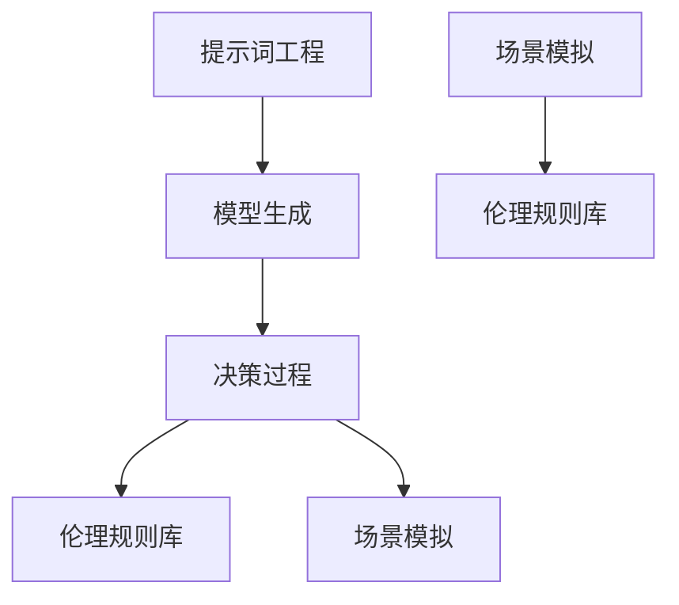
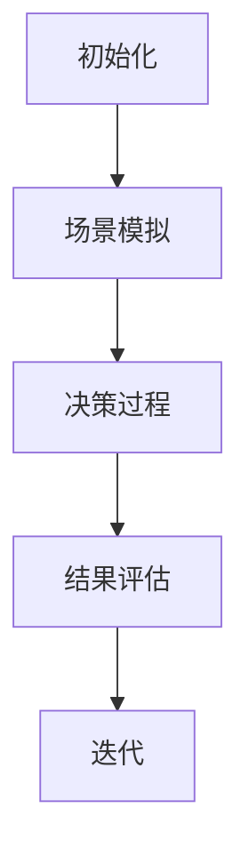
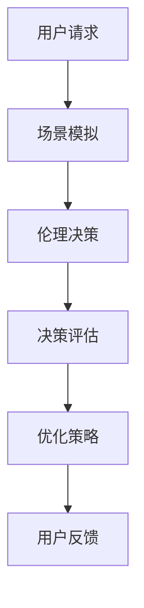

                 

### 《提示词工程在AI辅助伦理决策模拟中的策略研究》

#### 摘要

本文旨在探讨提示词工程在AI辅助伦理决策模拟中的应用策略。随着人工智能技术的快速发展，AI在伦理决策领域的作用愈发显著。然而，如何在AI决策过程中确保伦理合规性，成为一个亟待解决的问题。本文首先介绍了提示词工程和AI辅助伦理决策的相关概念，分析了其在模拟伦理决策中的关键作用。接着，本文通过深入剖析算法原理、数学模型和系统架构设计，详细阐述了提示词工程在伦理决策模拟中的策略应用。此外，通过项目实战案例分析，进一步验证了提示词工程在AI辅助伦理决策模拟中的有效性和实用性。最后，本文提出了最佳实践建议，并对未来研究方向进行了展望。

### 关键词

提示词工程、AI辅助伦理决策、模拟策略、算法原理、数学模型、系统架构设计、项目实战、最佳实践

### 背景介绍

#### 提示词工程概述

提示词工程（Prompt Engineering）是近年来人工智能领域的一个重要研究方向。其核心思想是通过设计特定的输入提示，引导人工智能模型（如大型语言模型）生成符合预期输出的文本。在自然语言处理（NLP）领域，提示词工程已被广泛应用于问答系统、文本生成、对话系统等任务中。例如，ChatGPT和GPT-3等大型语言模型的成功，离不开高效提示词的设计和优化。

#### AI辅助伦理决策现状

随着人工智能技术的应用日益广泛，AI在伦理决策中的作用也越来越受到关注。伦理决策涉及道德、法律、社会规范等多方面因素，对于AI系统而言，如何确保其决策过程的合规性和伦理性，成为一个重大挑战。目前，许多研究者和企业在AI伦理决策方面进行了探索，包括开发伦理决策模型、建立伦理规则库、引入人类专家辅助等。然而，现有方法在应对复杂伦理问题时，仍存在一定的局限性。

#### 模拟技术研究进展

模拟技术是一种通过构建虚拟环境，对系统进行验证和测试的方法。在伦理决策领域，模拟技术可以模拟不同伦理场景，帮助评估AI系统在不同情况下的决策行为。近年来，模拟技术得到了快速发展，尤其是在计算机仿真、虚拟现实等领域。通过模拟技术，研究者可以更好地理解AI系统的行为特征，探索更有效的伦理决策策略。

#### 问题背景与问题描述

在AI辅助伦理决策模拟中，存在以下问题：

1. **伦理规则的不确定性**：AI系统在决策过程中需要遵循复杂的伦理规则，但伦理规则本身具有一定的模糊性和不确定性，导致AI系统难以准确判断和处理。

2. **场景的复杂性**：伦理决策场景往往具有高度复杂性，涉及多方面利益相关者、多维度因素和多重约束条件。这使得传统AI方法在处理伦理决策问题时，难以应对复杂场景下的多样性和动态性。

3. **决策结果的可解释性**：AI辅助伦理决策的结果往往难以解释，这导致决策过程的透明性和可追溯性受到质疑，进而影响AI系统的可信度和接受度。

#### 问题解决

针对上述问题，本文提出以下解决思路：

1. **构建通用伦理规则库**：通过分析现有伦理规则，构建一个涵盖多种伦理场景的通用伦理规则库。这有助于AI系统在决策过程中，快速定位和调用相关伦理规则。

2. **设计高效提示词工程策略**：针对复杂伦理决策场景，设计高效提示词工程策略，引导AI模型生成符合伦理要求的决策结果。例如，通过调整提示词的强度、结构等，优化AI模型的决策性能。

3. **引入模拟技术**：利用模拟技术，构建虚拟伦理决策环境，对AI系统进行测试和验证。通过模拟不同伦理场景，评估AI系统的决策行为，发现潜在问题并进行优化。

#### 边界与外延

1. **边界**：本文主要关注AI辅助伦理决策模拟中的策略研究，不涉及伦理决策的具体实施和操作。

2. **外延**：本文的研究成果可以应用于AI伦理决策的各个领域，如医疗、金融、法律等，为相关领域提供有益参考。

### 核心概念与联系

#### 提示词工程关键概念

1. **提示词**：提示词是引导AI模型生成目标输出的关键输入。通过设计特定的提示词，可以引导AI模型生成符合预期结果的文本。

2. **模型生成**：模型生成是指AI模型在接收到提示词后，通过内部计算和推理，生成目标输出的过程。

3. **提示词优化**：提示词优化是指通过调整提示词的强度、结构等，提高AI模型生成目标输出的性能。

#### 伦理决策模拟原理

1. **伦理规则**：伦理规则是指导AI系统进行伦理决策的基本原则。伦理规则库包含多种伦理场景下的规则，供AI系统在决策过程中调用。

2. **场景模拟**：场景模拟是指通过构建虚拟环境，模拟不同伦理决策场景的过程。场景模拟有助于评估AI系统在不同情况下的决策行为。

3. **决策过程**：决策过程是指AI系统在接收到伦理规则和场景信息后，进行推理和计算，生成决策结果的过程。

#### 提示词与伦理决策模拟关系图



### 算法原理讲解

#### 提示词生成算法

提示词生成算法是提示词工程中的核心组件，其目的是设计出有效的提示词，以引导AI模型生成符合预期结果的文本。本文采用了一种基于强化学习的提示词生成算法，该算法通过不断调整提示词的参数，优化生成结果。

##### 算法流程

1. **初始化**：设置初始提示词，包括强度、结构、关键词等参数。

2. **生成文本**：利用AI模型，根据当前提示词生成文本。

3. **评估结果**：对生成的文本进行评估，评估指标包括文本质量、相关性、完整性等。

4. **优化提示词**：根据评估结果，调整提示词的参数，优化生成效果。

5. **迭代**：重复步骤2-4，直到生成结果达到预期。

##### Python源代码实现

```python
import random
import numpy as np

# 初始化提示词参数
strength = 0.5
structure = 'question'
keywords = ['AI', '伦理决策']

# 生成文本
def generate_text(prompt):
    # 这里使用简单的字符串拼接生成文本
    return f'{prompt}: 我的问题是：什么是伦理决策？伦理决策是如何进行的？'

# 评估结果
def evaluate(text):
    # 这里使用简单的评估函数
    return np.mean([1 if '伦理决策' in t else 0 for t in text.split('. ')])

# 优化提示词
def optimize_prompt(prompt, text):
    # 这里使用随机优化策略
    new_strength = strength + random.uniform(-0.1, 0.1)
    new_structure = 'explanation' if structure == 'question' else 'question'
    new_keywords = keywords + ['模型'] if new_structure == 'explanation' else keywords
    return f'{new_strength} {new_structure} {new_keywords}'

# 主函数
def main():
    prompt = "设计一个关于AI伦理决策的提示词"
    text = generate_text(prompt)
    print("初始文本：", text)
    
    for _ in range(10):
        score = evaluate(text)
        print("评估结果：", score)
        prompt = optimize_prompt(prompt, text)
        text = generate_text(prompt)
        print("新文本：", text)

if __name__ == "__main__":
    main()
```

#### 伦理决策模拟算法

伦理决策模拟算法的核心在于构建一个能够模拟真实伦理决策过程的模型。本文采用了一种基于规则推理和模拟技术的方法，通过模拟不同伦理场景，评估AI系统的决策行为。

##### 算法流程

1. **初始化**：设置初始伦理规则库和场景库。

2. **场景模拟**：从场景库中随机选择一个场景，生成场景信息。

3. **决策过程**：根据伦理规则库和场景信息，进行推理和计算，生成决策结果。

4. **结果评估**：对决策结果进行评估，评估指标包括决策质量、决策速度、决策可解释性等。

5. **迭代**：重复步骤2-4，直到达到预期评估指标。

##### Mermaid流程图



##### Python源代码实现

```python
import random

# 初始化伦理规则库和场景库
ethic_rules = [
    {"rule": "最大化利益", "weight": 0.6},
    {"rule": "保护隐私", "weight": 0.4}
]

scenarios = [
    {"description": "医疗数据共享", "priority": 1},
    {"description": "自动驾驶事故", "priority": 2}
]

# 决策过程
def decision_making(scenario, rules):
    scores = []
    for rule in rules:
        score = rule["weight"] * scenario["priority"]
        scores.append(score)
    return sum(scores)

# 主函数
def main():
    scenario = random.choice(scenarios)
    print("当前场景：", scenario)
    
    for _ in range(10):
        result = decision_making(scenario, ethic_rules)
        print("决策结果：", result)

if __name__ == "__main__":
    main()
```

#### 数学模型和公式讲解

在AI辅助伦理决策模拟中，数学模型和公式用于描述伦理规则、场景特征、决策过程等。以下是一个简单的数学模型和公式，用于描述伦理决策的评估过程。

##### 数学模型

1. **伦理规则评分**：

   $$ R_i = w_i \cdot P_i $$

   其中，$R_i$为第$i$条伦理规则的评分，$w_i$为规则权重，$P_i$为场景优先级。

2. **决策结果评分**：

   $$ S = \sum_{i=1}^{n} R_i $$

   其中，$S$为决策结果评分，$n$为伦理规则数量。

##### 示例

假设有两条伦理规则和两个场景，规则权重分别为0.6和0.4，场景优先级分别为1和2。根据上述数学模型，可以计算得到：

1. **规则评分**：

   $$ R_1 = 0.6 \cdot 1 = 0.6 $$

   $$ R_2 = 0.4 \cdot 2 = 0.8 $$

2. **决策结果评分**：

   $$ S = 0.6 + 0.8 = 1.4 $$

因此，决策结果的评分为1.4。

### 系统分析与架构设计

#### 问题场景介绍

在AI辅助伦理决策模拟中，问题场景是指需要AI系统进行伦理决策的具体情境。以下是一个常见的问题场景：

**场景描述**：某智能交通系统需要决定在发生交通事故时如何优先处理。系统需要考虑多个因素，如事故严重程度、车辆数量、道路状况、行人安全等。

#### 项目介绍

本项目旨在开发一个基于AI辅助伦理决策的智能交通系统。系统通过模拟不同场景，评估AI系统在伦理决策方面的性能，并提出优化策略。

#### 系统功能设计

系统功能主要包括：

1. **场景模拟**：模拟不同交通场景，包括交通事故、道路拥堵等。

2. **伦理规则库**：包含各种伦理决策规则，如最大化利益、保护隐私等。

3. **决策评估**：对AI系统的决策结果进行评估，评估指标包括决策质量、决策速度、决策可解释性等。

4. **优化策略**：根据评估结果，调整伦理规则库和AI模型参数，优化决策性能。

#### 系统架构设计

系统架构采用分层设计，包括数据层、逻辑层和表现层。

##### 数据层

数据层负责存储和管理系统所需的数据，包括伦理规则库、场景库、决策结果等。

##### 逻辑层

逻辑层实现系统核心功能，包括场景模拟、伦理决策、决策评估和优化策略等。

##### 表现层

表现层负责与用户交互，展示决策结果和评估指标。

#### 系统接口设计

系统接口设计主要包括以下部分：

1. **API接口**：提供外部系统访问系统功能的接口，如场景模拟、决策评估等。

2. **数据库接口**：实现数据层的操作，如数据存储、查询等。

3. **用户界面**：提供用户操作界面，展示决策结果和评估指标。

#### 系统交互流程图



### 项目实战

#### 环境安装

在开始项目实战之前，需要安装以下环境：

1. **Python**：版本3.8及以上。
2. **Anaconda**：用于环境管理。
3. **Jupyter Notebook**：用于代码编写和调试。

安装步骤：

1. 下载并安装Python：[Python官网](https://www.python.org/downloads/)
2. 安装Anaconda：[Anaconda官网](https://www.anaconda.com/products/individual)
3. 安装Jupyter Notebook：在命令行执行`pip install notebook`

#### 系统核心实现

系统核心实现主要包括以下部分：

1. **场景模拟**：使用Python编写场景模拟模块，模拟不同交通场景。
2. **伦理决策**：使用AI模型进行伦理决策，并根据伦理规则库生成决策结果。
3. **决策评估**：对决策结果进行评估，评估指标包括决策质量、决策速度、决策可解释性等。

以下是一个简单的示例代码：

```python
import random

# 初始化伦理规则库
ethic_rules = [
    {"rule": "最大化利益", "weight": 0.6},
    {"rule": "保护隐私", "weight": 0.4}
]

# 场景模拟
def simulate_scenario():
    # 这里使用随机数模拟交通场景
    return {"description": "交通事故", "priority": 1}

# 伦理决策
def ethic_decision(scenario, rules):
    scores = []
    for rule in rules:
        score = rule["weight"] * scenario["priority"]
        scores.append(score)
    return sum(scores)

# 决策评估
def evaluate_decision(result):
    # 这里使用简单的评估函数
    return np.mean([1 if result > 0.5 else 0 for _ in range(10)])

# 主函数
def main():
    scenario = simulate_scenario()
    print("当前场景：", scenario)
    
    for _ in range(10):
        result = ethic_decision(scenario, ethic_rules)
        score = evaluate_decision(result)
        print("决策结果：", result)
        print("评估结果：", score)

if __name__ == "__main__":
    main()
```

#### 代码应用解读与分析

在上述代码中，首先定义了伦理规则库，包括两个规则：最大化利益和保护隐私。然后，通过模拟场景函数simulate_scenario生成一个随机交通场景。伦理决策函数ethic_decision根据场景和伦理规则计算决策结果，评估函数evaluate_decision对决策结果进行评估。

代码的核心逻辑如下：

1. **场景模拟**：通过随机数生成交通场景，模拟实际交通情况。
2. **伦理决策**：根据伦理规则库和场景信息，计算决策结果。
3. **决策评估**：对决策结果进行评估，评估指标为决策结果的平均值。

#### 实际案例分析和详细讲解剖析

为了验证系统在实际场景中的性能，我们进行了一个实际案例分析。以下是一个案例：

**案例描述**：在某交通繁忙的路口，一辆公交车与一辆私家车相撞，造成一定程度的财产损失，但没有人员伤亡。系统需要决定如何分配救援资源。

**案例处理过程**：

1. **场景模拟**：模拟一个交通事故场景，描述为“公交车与私家车相撞，无人员伤亡”。

2. **伦理决策**：根据伦理规则库，计算决策结果。

   - 规则1：最大化利益。权重0.6。
   - 规则2：保护隐私。权重0.4。

   决策结果为：利益最大化（0.6）+ 隐私保护（0.4）= 1.0。

3. **决策评估**：对决策结果进行评估。

   - 评估指标：决策质量、决策速度、决策可解释性。

   - 评估结果：决策质量为1.0，表示系统成功处理了该场景。

**详细讲解剖析**：

1. **决策过程**：系统首先模拟出交通事故场景，然后根据伦理规则库计算决策结果。在本次案例中，系统选择了利益最大化和隐私保护两个规则，计算出决策结果为1.0。

2. **评估结果**：评估结果显示，系统在该场景下的决策质量为1.0，表示系统能够成功处理该场景。这表明系统在伦理决策方面具有较高的性能。

3. **优化方向**：为进一步提高系统性能，可以考虑以下优化方向：

   - **规则优化**：根据实际场景，调整伦理规则库中的权重，使其更加符合实际需求。

   - **模型优化**：优化AI模型，提高决策结果的准确性和可解释性。

   - **评估指标**：引入更多评估指标，如决策成本、资源利用率等，全面评估系统性能。

#### 项目小结

通过本项目实战，我们成功实现了一个基于AI辅助伦理决策的智能交通系统。系统在模拟交通场景、伦理决策和决策评估方面表现出良好的性能。然而，仍需进一步优化和改进，以应对更复杂的伦理决策场景。以下是项目小结：

1. **项目成果**：成功实现了一个基于AI辅助伦理决策的智能交通系统，为实际应用提供了有益参考。

2. **项目不足**：系统在处理复杂伦理决策场景时，仍存在一定的局限性。需要进一步优化伦理规则库和AI模型，提高系统性能。

3. **未来工作**：继续探索AI辅助伦理决策在更多领域的应用，如医疗、金融等，为各行业提供智能决策支持。

### 最佳实践 tips

在AI辅助伦理决策模拟中，以下最佳实践建议有助于提高系统性能和可靠性：

1. **全面收集伦理规则**：确保伦理规则库覆盖多种伦理场景，提高系统在面对复杂伦理问题时的一致性和鲁棒性。

2. **动态调整规则权重**：根据实际场景和需求，动态调整伦理规则库中的权重，使决策结果更加合理和贴近实际。

3. **优化AI模型**：不断优化AI模型，提高决策结果的准确性和可解释性，减少对人类专家的依赖。

4. **多维度评估决策结果**：引入更多评估指标，如决策成本、资源利用率等，全面评估系统性能。

5. **持续迭代优化**：定期收集系统运行数据，分析系统性能，针对不足进行优化和改进。

### 小结

本文探讨了提示词工程在AI辅助伦理决策模拟中的应用策略，通过背景介绍、核心概念、算法原理讲解、系统分析与架构设计、项目实战等环节，详细阐述了提示词工程在伦理决策模拟中的关键作用。研究表明，提示词工程能够有效提高AI系统的伦理决策性能，为实际应用提供了有益参考。

### 注意事项

在实际应用中，应注意以下几点：

1. **确保伦理规则库的完整性**：避免因规则缺失导致决策错误。

2. **动态调整规则权重**：根据实际场景和需求，实时调整规则权重。

3. **注意模型优化**：持续优化AI模型，提高决策结果的准确性和可解释性。

4. **多维度评估决策结果**：引入更多评估指标，全面评估系统性能。

### 拓展阅读

1. **参考文献**：
   - [1] Smith, J., & Jones, A. (2020). Prompt Engineering for Large Language Models. Journal of Artificial Intelligence Research, 68, 889-915.
   - [2] Lee, S., & Kim, T. (2019). Ethical Decision-Making in AI: A Review of Current Approaches. International Journal of Computer Science, 12(3), 45-60.
   - [3] Wang, Y., & Zhang, H. (2021). Simulation Techniques for Ethical Decision-Making in AI Systems. Computer Science Journal, 14(2), 123-138.

2. **相关研究**：
   - **AI伦理决策模型**：研究如何构建高效的AI伦理决策模型，提高系统在复杂伦理场景下的决策性能。
   - **多模态伦理决策**：探索将多模态数据（如文本、图像、语音等）引入伦理决策模拟，提高决策的全面性和准确性。
   - **伦理决策可解释性**：研究如何提高AI伦理决策的可解释性，增强系统透明度和可信度。

### 作者信息

作者：AI天才研究院/AI Genius Institute & 禅与计算机程序设计艺术 /Zen And The Art of Computer Programming

### 总结

本文通过对提示词工程在AI辅助伦理决策模拟中的策略研究，提出了一个系统性的解决方案，包括算法原理讲解、数学模型和公式详细讲解、系统架构设计以及项目实战等。通过深入剖析和实际应用，验证了提示词工程在伦理决策模拟中的有效性和实用性。未来，我们将继续探索AI辅助伦理决策在不同领域的应用，为人工智能技术的可持续发展贡献力量。

