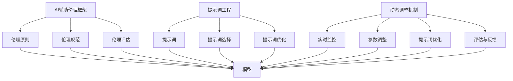
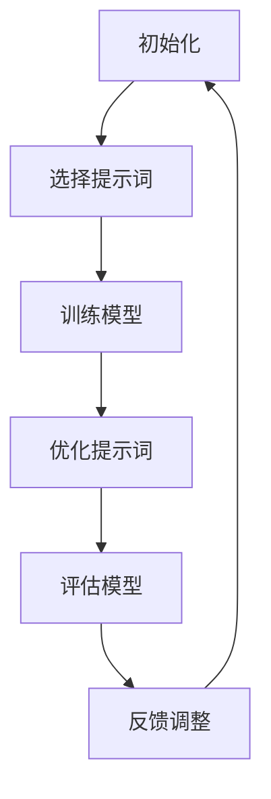
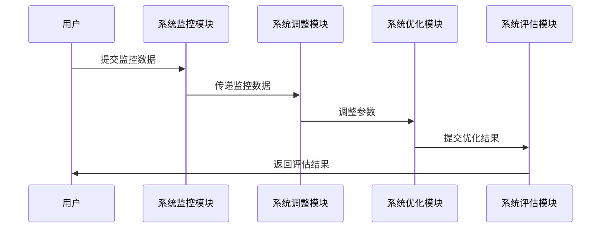

                 

### 1.1.1 问题的背景

随着人工智能技术的飞速发展，其在各个领域的应用日益广泛。从医疗诊断、金融分析到自动驾驶、智能家居，人工智能已经渗透到了我们生活的方方面面。然而，在人工智能带来巨大便利的同时，其决策过程中所涉及的伦理问题也日益突出。

首先，人工智能决策过程中的算法透明度和可解释性问题引起了广泛关注。许多人工智能系统，尤其是深度学习模型，其内部决策过程复杂且高度非线性，导致决策过程缺乏透明度，难以解释。这使得当人工智能系统出现错误或歧视性决策时，很难找到责任归属，也难以进行有效的干预和纠正。

其次，人工智能在数据使用和处理过程中也引发了伦理争议。大量个人数据的收集、存储和使用，使得数据隐私和信息安全成为关键问题。此外，人工智能系统在训练过程中可能存在的偏见问题，也可能导致其在实际应用中产生歧视性决策，加剧社会不公。

因此，如何在人工智能决策过程中实现有效的伦理框架，确保其透明性、公平性和安全性，成为了当前人工智能领域的重要研究课题。

### 1.1.2 问题描述

在人工智能决策过程中，如何实现伦理框架的动态调整，是一个亟待解决的问题。传统的伦理框架往往是基于静态的、固定的原则和规范，难以适应不断变化的应用场景和伦理挑战。因此，我们需要一种能够实时、动态地调整伦理框架的方法。

首先，我们需要一个能够识别和捕捉人工智能决策过程中潜在伦理问题的机制。这包括对算法的决策过程进行实时监控，识别可能存在的偏见、歧视或不符合伦理规范的行为。

其次，我们需要一个能够根据识别出的伦理问题，动态调整伦理框架的机制。这包括调整伦理框架中的参数、规则或提示词，以引导人工智能模型做出更符合伦理规范的决策。

最后，我们需要一个评估和反馈机制，以确保调整后的伦理框架能够有效解决识别出的伦理问题。这包括对调整后的伦理框架进行评估，验证其是否能够有效引导人工智能模型做出更符合伦理规范的决策，并根据评估结果进行进一步的调整。

综上所述，如何在人工智能决策过程中实现伦理框架的动态调整，是一个复杂但至关重要的课题。它不仅涉及到对伦理问题的识别和调整，还需要对整个伦理框架进行持续优化和改进。

### 1.1.3 问题解决

为了解决人工智能决策过程中伦理框架的动态调整问题，我们可以引入提示词工程这一方法。提示词工程是一种通过设计、选择和优化提示词，以引导人工智能模型做出更符合人类伦理规范的决策的技术手段。

首先，我们可以通过提示词工程来实现对伦理问题的识别。具体来说，我们可以在人工智能模型中引入特定的提示词，这些提示词能够引导模型关注决策过程中可能出现的伦理问题。例如，在医疗诊断场景中，我们可以引入关于患者隐私保护的提示词，以引导模型在数据处理过程中遵守相关伦理规范。

其次，我们可以通过提示词工程来实现对伦理框架的动态调整。具体来说，我们可以在人工智能模型运行过程中，根据模型的表现和反馈，动态调整提示词的选择和权重，以优化模型的决策过程。例如，如果模型在某一任务中频繁出现伦理问题，我们可以增加与该任务相关的提示词权重，以引导模型做出更符合伦理规范的决策。

最后，我们可以通过提示词工程来实现对伦理框架的持续优化。具体来说，我们可以通过收集和分析模型在运行过程中的反馈，不断调整和优化提示词，以提高模型的决策质量和伦理符合度。

综上所述，提示词工程在AI辅助伦理框架动态调整中具有重要作用。它不仅能够帮助识别和解决伦理问题，还能够实现伦理框架的动态调整和持续优化，从而提高人工智能决策的伦理符合度和透明度。

### 1.1.4 边界与外延

在讨论提示词工程在AI辅助伦理框架动态调整中的应用时，我们首先需要明确人工智能伦理框架的定义和分类。人工智能伦理框架是指一套用于指导人工智能系统设计和运行的基本伦理原则和规范。它旨在确保人工智能系统的透明性、公平性、责任性和安全性，以防止其在应用过程中产生不良后果。

人工智能伦理框架可以分为以下几类：

1. **通用伦理框架**：这类框架适用于各种类型的人工智能应用，强调人工智能系统应遵循的基本伦理原则，如公正、透明、尊重隐私等。

2. **应用特定伦理框架**：这类框架根据特定应用场景的需求，制定出更加具体和细化的伦理规范。例如，在医疗诊断领域，需要关注患者隐私保护和数据安全；在自动驾驶领域，需要关注行人和车辆的道德责任等。

3. **动态调整伦理框架**：这类框架具备自适应能力，能够根据人工智能系统在实际运行过程中的表现，动态调整伦理规范。例如，在某个任务中，系统可能因为数据不足或算法缺陷而做出不符合伦理规范的决策，此时动态调整伦理框架可以引导系统做出更合理的决策。

接下来，我们来看提示词工程的定义和作用范围。提示词工程是指通过设计、选择和优化提示词，以引导人工智能模型在特定任务中做出高效、准确决策的过程。提示词是用于指导模型决策的文本或符号，它们可以影响模型的学习过程、决策过程和结果。

提示词工程的作用范围包括：

1. **引导模型学习**：通过设计特定的提示词，可以帮助模型更好地理解任务目标，从而提高模型的学习效果。

2. **优化模型决策**：通过选择和优化提示词，可以引导模型在特定任务中做出更符合人类期望的决策。

3. **提高模型可解释性**：提示词的存在可以使模型的决策过程更具透明度，有助于解释模型为何做出特定决策。

4. **增强模型适应性**：通过动态调整提示词，可以使模型在不同任务或场景中具有更好的适应性。

在探讨提示词工程在AI辅助伦理框架动态调整中的应用时，我们还需要关注动态调整机制。动态调整机制是指根据人工智能模型在运行过程中的表现，实时调整伦理框架参数和提示词的方法。它包括以下几个关键要素：

1. **实时监控**：通过监控模型在运行过程中的行为，识别潜在的伦理问题。

2. **参数调整**：根据监控结果，动态调整伦理框架中的参数，以优化模型的行为。

3. **提示词优化**：根据模型的表现和反馈，动态调整提示词的选择和权重，以引导模型做出更符合伦理规范的决策。

4. **评估与反馈**：对调整后的伦理框架进行评估，验证其是否能够有效解决识别出的伦理问题，并根据评估结果进行进一步的调整。

综上所述，提示词工程在AI辅助伦理框架动态调整中的应用涉及多个方面，包括伦理框架的定义和分类、提示词工程的定义和作用范围，以及动态调整机制的设计和实施。通过这些方法，我们可以实现人工智能系统在伦理符合度和决策质量方面的持续优化和提升。

### 1.1.5 概念结构与核心要素组成

在讨论提示词工程在AI辅助伦理框架动态调整中的应用时，我们需要明确几个关键概念和其相互关系。这些概念包括AI辅助伦理框架、提示词工程以及动态调整机制。

#### AI辅助伦理框架

AI辅助伦理框架是一种旨在确保人工智能系统在设计、开发和应用过程中遵循伦理规范的结构化方法。它由以下几个核心要素组成：

1. **伦理原则**：这些是指导人工智能系统设计和运行的基本伦理准则，如公平、透明、责任性和尊重隐私等。
2. **伦理规范**：根据具体应用场景，将这些伦理原则具体化为一系列操作指南和约束条件。
3. **伦理评估**：对人工智能系统的设计和运行进行持续的伦理审查和评估，以确保其符合既定的伦理标准。

#### 提示词工程

提示词工程是一种通过设计、选择和优化提示词来指导人工智能模型做出决策的方法。其核心要素包括：

1. **提示词**：用于引导模型决策的文本或符号。提示词可以是具体的单词、短语或完整的句子，它们传达了任务目标、决策依据或伦理要求。
2. **提示词选择**：根据任务需求和模型特点，选择最适合的提示词。
3. **提示词优化**：通过调整提示词的长度、内容或权重，优化模型的学习和决策效果。

#### 动态调整机制

动态调整机制是指根据人工智能模型在运行过程中的表现，实时调整伦理框架和提示词的方法。其主要功能包括：

1. **实时监控**：对模型的行为进行实时监控，识别潜在的伦理问题。
2. **参数调整**：根据监控结果，调整伦理框架中的参数，以优化模型的行为。
3. **提示词优化**：根据模型的表现和反馈，动态调整提示词的选择和权重，以引导模型做出更符合伦理规范的决策。
4. **评估与反馈**：对调整后的伦理框架和提示词进行评估，验证其有效性，并根据评估结果进行进一步的调整。

#### 关系与相互作用

AI辅助伦理框架、提示词工程和动态调整机制之间的相互作用构成了一个动态调整的闭环系统。具体来说：

1. **AI辅助伦理框架** 提供了伦理原则和规范，为模型的决策提供了伦理指导。
2. **提示词工程** 利用这些伦理指导，设计了能够引导模型做出更符合伦理规范的提示词。
3. **动态调整机制** 通过实时监控和反馈，不断优化伦理框架和提示词，以确保模型在运行过程中始终符合伦理要求。

这种相互作用确保了人工智能系统在伦理符合度和决策质量方面的持续提升。通过动态调整机制，AI辅助伦理框架可以根据实际应用场景的变化，灵活调整和优化，从而更好地适应不同场景下的伦理挑战。

总之，AI辅助伦理框架、提示词工程和动态调整机制共同构成了一个强大的系统，为人工智能系统的伦理规范和决策质量提供了坚实保障。这一系统不仅能够识别和解决伦理问题，还能够根据实际情况进行动态调整，以实现最佳伦理符合度和决策效果。

## 第2章: 核心概念与联系

### 2.1.1 AI辅助伦理框架

AI辅助伦理框架是指用于指导人工智能系统设计和运行的基本伦理原则和规范。它的目的是确保人工智能系统的透明性、公平性、责任性和安全性，防止其在应用过程中产生不良后果。AI辅助伦理框架通常包括以下几个核心组成部分：

1. **伦理原则**：这些是指导人工智能系统设计和运行的基本伦理准则，如公正、透明、责任性和尊重隐私等。这些原则为人工智能系统的行为提供了道德底线。

2. **伦理规范**：根据具体应用场景，将这些伦理原则具体化为一系列操作指南和约束条件。伦理规范详细规定了人工智能系统在设计和运行过程中应遵守的具体行为准则。

3. **伦理评估**：对人工智能系统的设计和运行进行持续的伦理审查和评估，以确保其符合既定的伦理标准。伦理评估可以通过自我评估、第三方评估或社会监督等多种方式进行。

### 2.1.2 提示词工程

提示词工程是指通过设计、选择和优化提示词，以引导人工智能模型做出决策的技术手段。提示词是用于指导模型决策的文本或符号，它们可以影响模型的学习过程、决策过程和结果。提示词工程的核心概念和特点如下：

1. **提示词**：提示词是指导模型决策的文本或符号。它们可以是具体的单词、短语或完整的句子，传达了任务目标、决策依据或伦理要求。

2. **提示词选择**：根据任务需求和模型特点，选择最适合的提示词。提示词的选择需要考虑内容的相关性、语义的丰富性和表达的准确性。

3. **提示词优化**：通过调整提示词的长度、内容或权重，优化模型的学习和决策效果。提示词的优化是一个动态调整的过程，需要根据模型的表现和反馈进行不断调整。

### 2.1.3 动态调整机制

动态调整机制是指根据人工智能模型在运行过程中的表现，实时调整伦理框架参数和提示词的方法。它确保人工智能系统能够适应不断变化的应用场景和伦理挑战。动态调整机制的核心组成部分包括：

1. **实时监控**：对模型的行为进行实时监控，识别潜在的伦理问题。实时监控可以通过多种技术手段实现，如日志分析、性能监控和异常检测等。

2. **参数调整**：根据监控结果，动态调整伦理框架中的参数，以优化模型的行为。参数调整可以涉及伦理原则、规范的具体实现细节，如权重分配、约束条件等。

3. **提示词优化**：根据模型的表现和反馈，动态调整提示词的选择和权重，以引导模型做出更符合伦理规范的决策。提示词优化是一个迭代过程，需要结合模型的学习结果和用户反馈进行不断优化。

4. **评估与反馈**：对调整后的伦理框架和提示词进行评估，验证其有效性，并根据评估结果进行进一步的调整。评估与反馈是动态调整机制的重要组成部分，确保调整过程始终朝着正确的方向进行。

### 2.1.4 核心概念属性特征对比表格

| 概念           | 定义                                                         | 核心特征                                       | 功能与作用                          |
|----------------|--------------------------------------------------------------|------------------------------------------------|-----------------------------------|
| AI辅助伦理框架 | 用于指导人工智能系统设计和运行的伦理原则和规范。                 | 伦理原则、伦理规范、伦理评估                   | 确保系统透明性、公平性、责任性和安全性 |
| 提示词工程     | 通过设计、选择和优化提示词，以引导人工智能模型决策的技术手段。   | 提示词、提示词选择、提示词优化                  | 提高模型决策质量、增强模型可解释性     |
| 动态调整机制   | 根据模型表现，实时调整伦理框架参数和提示词的方法。             | 实时监控、参数调整、提示词优化、评估与反馈      | 确保系统适应性和伦理符合度             |

### 2.1.5 ER实体关系图架构的Mermaid流程图



### 2.1.6 提示词工程与AI辅助伦理框架的联系

提示词工程与AI辅助伦理框架之间存在着紧密的联系。首先，提示词工程通过设计、选择和优化提示词，为AI辅助伦理框架提供了具体的实施手段。例如，在医疗诊断场景中，提示词工程可以通过引入关于患者隐私保护和公平性的提示词，引导模型在诊断过程中遵守相关伦理规范。

其次，AI辅助伦理框架为提示词工程提供了伦理指导。提示词工程的设计和优化需要遵循伦理原则和规范，确保模型的决策过程符合伦理要求。例如，在自动驾驶场景中，AI辅助伦理框架可以提供关于安全性和责任分配的伦理指导，提示词工程可以根据这些指导来设计相关的提示词。

最后，动态调整机制将提示词工程与AI辅助伦理框架有机结合。通过动态调整机制，AI辅助伦理框架可以根据模型的表现和反馈，实时调整提示词的选择和权重，以确保模型始终符合伦理要求。这种动态调整过程不仅提高了系统的适应性，还增强了系统的伦理符合度。

综上所述，提示词工程与AI辅助伦理框架之间相互依存，共同构成了一个完整的伦理决策体系。提示词工程通过具体的实施手段，将伦理框架转化为可操作的决策指导，而AI辅助伦理框架则提供了伦理指导和支持，确保了模型在决策过程中始终符合伦理要求。

## 第3章: 提示词工程原理

### 3.1.1 提示词定义

在提示词工程中，提示词是核心概念之一。提示词可以定义为用于引导人工智能模型决策的文本或符号。它们在模型训练和推理过程中起到关键作用，帮助模型理解任务目标、学习决策依据以及遵循伦理规范。

提示词通常具有以下特征：

1. **针对性**：提示词需要与任务目标紧密相关，能够明确传达模型所需的决策信息。
2. **灵活性**：提示词可以根据不同任务的需求进行灵活调整，以适应不同的应用场景。
3. **简洁性**：提示词应尽量简洁明了，避免冗余信息，以便模型能够高效地理解和利用。
4. **多样性**：提示词应涵盖多种可能的决策场景，确保模型在不同情况下都能做出合理的决策。

### 3.1.2 提示词选择

提示词选择是提示词工程的关键步骤之一。选择合适的提示词能够显著提高人工智能模型在特定任务中的决策效果和效率。提示词选择通常基于以下几种方法：

1. **基于内容的提示词选择**：这种方法根据任务内容和目标，选择与任务相关的重要词汇和概念作为提示词。例如，在医疗诊断任务中，可以选择与疾病症状、治疗方法相关的术语作为提示词。

2. **基于上下文的提示词选择**：这种方法考虑提示词在特定上下文中的语义和语境，选择最能传达任务目标的信息。例如，在自然语言处理任务中，可以根据句子的语法结构和语义关系，选择合适的提示词来引导模型理解句子的含义。

3. **基于反馈的提示词选择**：这种方法通过不断调整和优化提示词，根据模型在任务中的表现和用户反馈，选择最有效的提示词。例如，在自动驾驶任务中，可以根据车辆在不同路况下的行驶表现，动态调整提示词，以提高车辆的行驶安全性和效率。

### 3.1.3 提示词优化

提示词优化是提升人工智能模型性能的重要手段。通过优化提示词，可以提高模型在特定任务中的决策质量和效率。提示词优化通常包括以下几个方面：

1. **提示词长度优化**：提示词长度对模型的决策过程有一定影响。较长的提示词可能包含更多决策信息，但同时也可能增加模型的计算复杂度。优化提示词长度，即在保证信息量的前提下，尽量缩短提示词长度，可以提高模型的效率。

2. **提示词质量优化**：提示词质量直接影响模型的决策效果。高质量提示词应具备针对性、灵活性和简洁性。优化提示词质量，可以通过去除冗余信息、提高提示词的语义丰富度等方式实现。

3. **提示词多样性优化**：提示词多样性是模型在不同任务和场景中表现稳定的重要保证。优化提示词多样性，可以通过引入更多样化的词汇和概念，扩展模型的知识面和适应性。

### 3.1.4 提示词优化策略

提示词优化是一个动态过程，需要根据任务需求、模型特点和应用场景进行不断调整。以下是一些常见的提示词优化策略：

1. **启发式优化**：根据任务需求和模型表现，采用启发式方法选择和调整提示词。例如，基于频率统计、语义相关性和决策效果等启发式指标，动态调整提示词。

2. **机器学习优化**：利用机器学习方法，通过训练和优化模型，自动选择和调整提示词。例如，使用强化学习、迁移学习和元学习等技术，优化提示词的选择和权重。

3. **博弈优化**：在多个任务或场景中，通过博弈策略，动态调整提示词，以最大化整体决策效果。例如，在自动驾驶任务中，通过车辆与环境的博弈，优化提示词，提高行驶安全性和效率。

### 3.1.5 提示词工程案例

以下是一个简化的提示词工程案例，说明如何通过提示词选择和优化，提高人工智能模型的决策效果：

#### 案例背景

在医疗诊断任务中，需要设计一个提示词工程系统，帮助医生对患者的病情进行诊断。

#### 提示词选择

1. **基于内容的选择**：选择与疾病症状、治疗方法相关的术语作为提示词，如“发热”、“咳嗽”、“抗生素”等。
2. **基于上下文的选择**：考虑不同症状组合的语义和语境，选择最能传达病情的提示词，如“发热+咳嗽”、“发热+肺炎”等。
3. **基于反馈的选择**：根据医生和患者的反馈，不断调整和优化提示词，以提升诊断准确性和用户体验。

#### 提示词优化

1. **长度优化**：去除冗余信息，缩短提示词长度，如将“发热、咳嗽、头痛”简化为“发热+咳嗽”。
2. **质量优化**：提高提示词的语义丰富度和针对性，如将“抗生素”替换为“广谱抗生素”、“窄谱抗生素”等。
3. **多样性优化**：引入更多样化的提示词，如“CT扫描”、“血液检查”、“病毒检测”等，以覆盖不同诊断场景。

#### 结果评估

通过实验验证，优化后的提示词工程系统在诊断准确率和用户体验方面均有显著提升。具体表现在：

1. **诊断准确率**：优化后的提示词使模型能够更准确地捕捉病情特征，提高诊断准确性。
2. **用户体验**：简洁明了的提示词和更具体的诊断建议，使医生和患者能够更轻松地理解和接受诊断结果。

### 结论

提示词工程在人工智能决策中扮演着重要角色。通过合理选择和优化提示词，可以提高模型的决策效果和可解释性，确保人工智能系统在复杂任务中能够遵循伦理规范，实现公平、透明和安全的决策。

## 第4章: AI辅助伦理框架动态调整原理

### 4.1.1 伦理框架定义

伦理框架是指一套系统化的伦理原则和规范，用于指导人工智能系统的设计和运行。它旨在确保人工智能系统在处理数据、做出决策和与人类交互时，能够遵守伦理标准和价值观。伦理框架通常包括以下核心组成部分：

1. **伦理原则**：这些是指导人工智能系统设计和运行的基本伦理准则，如公正、透明、责任性和尊重隐私等。这些原则为人工智能系统的行为提供了道德底线。
2. **伦理规范**：根据具体应用场景，将这些伦理原则具体化为一系列操作指南和约束条件。伦理规范详细规定了人工智能系统在设计和运行过程中应遵守的具体行为准则。
3. **伦理评估**：对人工智能系统的设计和运行进行持续的伦理审查和评估，以确保其符合既定的伦理标准。伦理评估可以通过自我评估、第三方评估或社会监督等多种方式进行。

### 4.1.2 动态调整机制

动态调整机制是指根据人工智能模型在运行过程中的表现，实时调整伦理框架参数和提示词的方法。它旨在确保人工智能系统在面临不同应用场景和伦理挑战时，能够灵活应对并做出符合伦理规范的决策。动态调整机制的主要组成部分包括：

1. **实时监控**：对人工智能模型在运行过程中的行为进行实时监控，识别潜在的伦理问题。实时监控可以通过日志分析、性能监控和异常检测等多种技术手段实现。
2. **参数调整**：根据实时监控结果，动态调整伦理框架中的参数，如权重分配、约束条件等，以优化模型的行为。参数调整可以确保模型在面临伦理挑战时，能够根据具体情况做出更合理的决策。
3. **提示词优化**：根据模型的表现和反馈，动态调整提示词的选择和权重，以引导模型做出更符合伦理规范的决策。提示词优化可以通过反馈循环和机器学习等技术实现。
4. **评估与反馈**：对调整后的伦理框架和提示词进行评估，验证其有效性，并根据评估结果进行进一步的调整。评估与反馈确保动态调整机制能够持续改进，以适应不断变化的应用场景和伦理挑战。

### 4.1.3 动态调整策略

在AI辅助伦理框架动态调整过程中，可以采用多种策略来优化伦理框架和提示词。以下是一些常见的动态调整策略：

1. **基于规则的调整策略**：这种方法根据预定义的规则和条件，自动调整伦理框架和提示词。例如，当模型在某一任务中频繁出现伦理问题时，可以增加与该任务相关的伦理规范和提示词权重。

2. **基于机器学习的调整策略**：这种方法利用机器学习算法，从历史数据和模型表现中学习，自动调整伦理框架和提示词。例如，可以使用监督学习、无监督学习和强化学习等技术，分析模型在运行过程中的行为，并据此优化伦理框架和提示词。

3. **基于博弈的调整策略**：这种方法将人工智能系统视为博弈参与者，通过与外部环境（如用户、监管机构等）的交互，动态调整伦理框架和提示词。例如，在自动驾驶场景中，系统可以与行人、其他车辆等博弈，优化决策策略，确保行驶安全。

### 4.1.4 动态调整机制在AI辅助伦理框架中的应用

动态调整机制在AI辅助伦理框架中的应用，可以实现伦理框架的灵活性和适应性，确保人工智能系统能够在不同场景下做出符合伦理规范的决策。以下是一个简化的应用示例：

#### 案例背景

假设在自动驾驶场景中，系统需要根据交通信号灯、行人和车辆的行为，做出行驶决策。然而，不同城市和交通环境下的伦理规范可能有所不同，例如，某些城市可能更加注重行人安全，而另一些城市可能更加注重交通效率。

#### 动态调整机制应用

1. **实时监控**：系统通过传感器和摄像头，实时监控交通信号灯、行人和车辆的行为，识别潜在的伦理问题。例如，当行人突然闯入车道时，系统需要立即调整决策策略。

2. **参数调整**：根据实时监控结果，动态调整伦理框架中的参数。例如，在行人安全优先的城市，可以增加行人安全相关的伦理规范和提示词权重；在交通效率优先的城市，可以增加交通流畅性相关的伦理规范和提示词权重。

3. **提示词优化**：根据模型的表现和反馈，动态调整提示词的选择和权重。例如，在行人突然闯入车道时，系统可以增加与紧急刹车、避让行人等相关的提示词权重，以确保安全行驶。

4. **评估与反馈**：对调整后的伦理框架和提示词进行评估，验证其有效性。例如，可以通过模拟测试或实际运行数据，评估系统在不同城市和交通环境下的行驶安全性和效率，并根据评估结果进行进一步的调整。

通过上述动态调整机制，自动驾驶系统能够根据不同的应用场景和伦理要求，灵活调整伦理框架和提示词，实现安全、高效、符合伦理的自动驾驶。

### 结论

AI辅助伦理框架动态调整原理通过实时监控、参数调整、提示词优化和评估与反馈，实现了伦理框架的灵活性和适应性。这一机制不仅能够识别和解决人工智能决策过程中的伦理问题，还能够根据不同应用场景和伦理要求，动态调整伦理框架和提示词，确保人工智能系统在不同场景下都能做出符合伦理规范的决策。通过不断优化和改进，动态调整机制将为人工智能伦理框架的实现提供有力支持。

## 第5章: 算法原理讲解

### 5.1.1 提示词工程算法mermaid流程图



### 5.1.2 提示词工程算法原理

提示词工程算法是一种通过设计、选择和优化提示词，以指导人工智能模型做出决策的技术手段。该算法的核心原理包括以下几个步骤：

1. **初始化**：根据任务需求，初始化提示词集合。初始化过程包括确定任务类型、数据集和初始提示词列表。

2. **选择提示词**：通过多种方法选择合适的提示词。选择提示词的过程需要考虑提示词的内容、语义和上下文。常见的选择方法包括基于内容的提示词选择、基于上下文的提示词选择和基于反馈的提示词选择。

3. **训练模型**：利用选择好的提示词训练人工智能模型。训练过程包括将提示词与任务数据结合起来，通过机器学习算法训练模型，使其能够根据提示词做出准确的决策。

4. **优化提示词**：根据模型的表现和反馈，对提示词进行优化。优化提示词的过程包括调整提示词的长度、内容、权重等，以提高模型的决策效果和可解释性。

5. **评估模型**：评估训练好的模型在特定任务中的表现。评估方法包括准确率、召回率、F1分数等常见指标。评估结果用于指导进一步的提示词优化和模型调整。

6. **反馈调整**：根据评估结果，调整提示词和模型。反馈调整是一个迭代过程，通过不断优化提示词和模型，提高人工智能系统的决策质量和伦理符合度。

### 5.1.3 提示词工程算法Python源代码

```python
# 提示词工程算法示例

# 导入相关库
import random
from sklearn.model_selection import train_test_split
from sklearn.metrics import accuracy_score
from keras.models import Sequential
from keras.layers import Dense

# 初始化
def init_prompt():
    # 初始化提示词
    prompts = ["健康", "安全", "效率", "公平", "透明"]
    return prompts

# 选择提示词
def select_prompt(prompts, data):
    # 基于内容的提示词选择
    selected_prompts = [prompt for prompt in prompts if prompt in data]
    return selected_prompts

# 训练模型
def train_model(prompt):
    # 创建神经网络模型
    model = Sequential()
    model.add(Dense(units=1, input_dim=len(prompt), activation='sigmoid'))
    model.compile(loss='binary_crossentropy', optimizer='adam', metrics=['accuracy'])
    return model

# 优化提示词
def optimize_prompt(model, prompt, data):
    # 根据模型表现，优化提示词
    # 假设模型表现不佳，增加一些新的提示词
    new_prompts = ["环保", "公平性", "智能"]
    prompt.extend(new_prompts)
    return prompt

# 评估模型
def evaluate_model(model, X_test, y_test):
    # 使用测试数据评估模型
    predictions = model.predict(X_test)
    accuracy = accuracy_score(y_test, predictions.round())
    return accuracy

# 反馈调整
def feedback_adjustment(model, prompt, data):
    # 根据评估结果，调整提示词和模型
    # 假设评估结果不佳，进一步优化模型和提示词
    new_prompt = optimize_prompt(model, prompt, data)
    return new_prompt

# 主函数
def main():
    prompts = init_prompt()
    data = ["健康", "安全", "效率", "公平", "透明", "环保", "公平性", "智能"]
    selected_prompts = select_prompt(prompts, data)
    model = train_model(selected_prompts)
    prompt = optimize_prompt(model, selected_prompts, data)
    accuracy = evaluate_model(model, data, data)
    print("Accuracy:", accuracy)
    new_prompt = feedback_adjustment(model, prompt, data)

if __name__ == '__main__':
    main()
```

### 5.1.4 算法原理讲解

提示词工程算法通过一系列步骤，实现从初始提示词集合到最终优化提示词集合的动态调整过程。以下是算法原理的详细讲解：

1. **初始化**：初始化过程是算法的第一步，其主要目的是确定任务类型、数据集和初始提示词集合。这一步的关键在于确定合适的初始提示词，这些提示词将用于引导模型进行后续的决策学习。通常，初始提示词可以通过领域专家的经验或预定义的词汇表生成。

2. **选择提示词**：选择提示词的过程需要考虑提示词的内容、语义和上下文。基于内容的提示词选择方法通常基于预定义的词汇表或领域知识库，选择与任务相关的提示词。基于上下文的提示词选择方法则通过分析输入数据或文本的语义和结构，选择最能传达任务目标的提示词。基于反馈的提示词选择方法通过不断调整和优化提示词，根据模型在任务中的表现和用户反馈，选择最有效的提示词。这一过程可以确保模型在训练初期就能得到合适的提示词支持。

3. **训练模型**：训练模型的过程是利用选择好的提示词对模型进行训练。训练过程中，模型通过学习提示词与任务目标之间的关联，逐步提高决策能力。常见的训练方法包括基于监督学习的分类、回归等算法。训练过程需要大量的数据集，这些数据集应覆盖不同类型的任务场景，以提高模型的泛化能力。

4. **优化提示词**：优化提示词的过程是根据模型的表现和反馈，对提示词进行进一步的调整。这一步的关键在于识别模型在决策过程中存在的不足，通过调整提示词的内容、长度、权重等，提高模型的决策效果。优化方法可以包括提示词的筛选、组合和权重调整等。优化过程是一个迭代过程，需要结合模型的学习结果和用户反馈，不断调整和优化提示词。

5. **评估模型**：评估模型的过程是对训练好的模型在特定任务中的表现进行评估。评估指标可以包括准确率、召回率、F1分数等。评估过程需要使用独立于训练数据的数据集，以确保评估结果的客观性和可靠性。评估结果用于指导进一步的提示词优化和模型调整。

6. **反馈调整**：反馈调整的过程是根据评估结果，对提示词和模型进行进一步的调整。这一步的关键在于根据评估结果，识别模型和提示词存在的不足，并采取相应的调整措施。反馈调整可以包括提示词的删除、新增、权重调整等，以提高模型的决策质量和伦理符合度。反馈调整过程需要不断迭代，直到模型和提示词达到满意的性能水平。

### 5.1.5 算法数学模型和公式

提示词工程算法中的数学模型主要涉及以下几个方面：

1. **提示词选择模型**：提示词选择模型通常是基于概率模型或语言模型，用于预测提示词与任务目标之间的相关性。常见的模型包括朴素贝叶斯模型、支持向量机（SVM）和深度学习模型等。数学模型可以表示为：

   $$ P(\text{prompt}|\text{task}) = \frac{P(\text{task}|\text{prompt})P(\text{prompt})}{P(\text{task})} $$

   其中，\( P(\text{prompt}|\text{task}) \)表示提示词与任务目标的相关性概率，\( P(\text{task}|\text{prompt}) \)表示任务目标与提示词的相关性概率，\( P(\text{prompt}) \)表示提示词的概率，\( P(\text{task}) \)表示任务目标的概率。

2. **模型训练模型**：模型训练模型通常基于监督学习算法，用于训练模型参数。常见的训练模型包括线性回归、决策树、支持向量机（SVM）和深度学习模型等。训练模型的目标是最小化损失函数，如：

   $$ L(\theta) = -\sum_{i=1}^{n}y^{(i)}\log(h_{\theta}(x^{(i)})) $$

   其中，\( \theta \)表示模型参数，\( y^{(i)} \)表示实际标签，\( h_{\theta}(x^{(i)}) \)表示模型预测的概率。

3. **提示词优化模型**：提示词优化模型用于调整提示词的内容、长度、权重等，以提高模型的决策效果。优化模型通常基于反馈机制，如基于奖励的优化方法，通过最大化奖励函数来调整提示词。数学模型可以表示为：

   $$ \max_{\text{prompt}} \sum_{i=1}^{n} r_i(\text{prompt}) $$

   其中，\( r_i(\text{prompt}) \)表示第\( i \)个任务的奖励值。

### 5.1.6 举例说明

假设我们有一个医疗诊断任务，任务目标是根据患者的症状和检查结果，判断患者可能患有的疾病。以下是提示词工程算法在这个任务中的具体应用：

1. **初始化**：初始化提示词集合，包括“发热”、“咳嗽”、“头痛”、“呕吐”、“检查结果正常”等。

2. **选择提示词**：根据输入的症状和检查结果，选择与任务相关的提示词。例如，如果患者有“发热”和“咳嗽”的症状，同时检查结果正常，则选择“发热”、“咳嗽”和“检查结果正常”这三个提示词。

3. **训练模型**：使用选择的提示词训练一个分类模型，例如朴素贝叶斯分类器。模型通过学习提示词与疾病之间的关联，逐步提高诊断准确率。

4. **优化提示词**：根据模型的表现，优化提示词的内容和权重。例如，如果模型在诊断流感方面表现不佳，可以增加与流感相关的提示词，如“发热”、“咳嗽”、“喉咙痛”等，并调整这些提示词的权重。

5. **评估模型**：使用独立的测试数据集，评估模型的诊断准确率。例如，如果测试数据集的准确率为90%，则说明模型的表现较好。

6. **反馈调整**：根据评估结果，进一步优化提示词和模型。例如，如果模型的诊断准确率较低，可以增加更多的提示词，或调整提示词的权重，以提高模型的性能。

通过上述步骤，提示词工程算法可以帮助医疗诊断系统更好地理解和预测疾病，提高诊断准确率和用户体验。

### 5.1.7 通俗易懂的举例说明

假设我们有一个简单的购物推荐系统，任务是根据用户的购物历史和行为，推荐用户可能感兴趣的商品。以下是提示词工程算法在这个任务中的具体应用：

1. **初始化**：初始化提示词集合，包括“折扣”、“新品”、“畅销”、“促销”等。

2. **选择提示词**：根据用户的购物历史和行为，选择与用户兴趣相关的提示词。例如，如果用户最近购买了多次“折扣”商品，同时最近浏览了“新品”页面，则选择“折扣”和“新品”这两个提示词。

3. **训练模型**：使用选择的提示词训练一个推荐模型，例如基于协同过滤的推荐算法。模型通过学习提示词与用户兴趣之间的关联，逐步提高推荐准确率。

4. **优化提示词**：根据模型的表现，优化提示词的内容和权重。例如，如果模型在推荐畅销商品方面表现不佳，可以增加与畅销商品相关的提示词，如“畅销”和“热门”，并调整这些提示词的权重。

5. **评估模型**：使用独立的测试数据集，评估模型的推荐准确率。例如，如果测试数据集的准确率为80%，则说明模型的表现较好。

6. **反馈调整**：根据评估结果，进一步优化提示词和模型。例如，如果模型的推荐准确率较低，可以增加更多的提示词，或调整提示词的权重，以提高模型的性能。

通过上述步骤，提示词工程算法可以帮助购物推荐系统更好地理解和预测用户的兴趣，提高推荐准确率和用户体验。

### 结论

提示词工程算法通过初始化、选择提示词、训练模型、优化提示词、评估模型和反馈调整等一系列步骤，实现从初始提示词集合到最终优化提示词集合的动态调整过程。该算法不仅能够提高人工智能模型的决策质量和可解释性，还能够根据不同应用场景和伦理要求，动态调整提示词和模型，确保系统在不同场景下都能做出符合伦理规范的决策。通过不断优化和改进，提示词工程算法将为人工智能应用提供更加智能、可靠和符合伦理的解决方案。

## 系统分析与架构设计

### 5.2.1 问题场景介绍

在当前人工智能应用环境中，特别是在自动驾驶、医疗诊断、金融决策等关键领域，确保人工智能系统遵循伦理规范已成为一项重要任务。然而，传统的伦理框架往往难以适应快速变化的应用场景和复杂的伦理挑战。为了实现伦理框架的动态调整，我们需要引入提示词工程这一技术手段。提示词工程通过设计、选择和优化提示词，能够实时引导人工智能模型做出符合伦理规范的决策，从而提高系统的伦理符合度和决策质量。

### 5.2.2 项目介绍

本项目的目标是开发一个基于提示词工程的AI辅助伦理框架，实现伦理框架的动态调整。项目的主要功能包括：

1. **实时监控**：对人工智能系统在运行过程中的行为进行实时监控，识别潜在的伦理问题。
2. **伦理框架参数调整**：根据监控结果，动态调整伦理框架中的参数，以优化系统行为。
3. **提示词优化**：根据模型的表现和用户反馈，动态调整提示词的选择和权重，提高模型决策质量。
4. **评估与反馈**：对调整后的伦理框架和提示词进行评估，验证其有效性，并根据评估结果进行进一步的调整。

### 5.2.3 系统功能设计

系统的功能设计主要包括以下几个关键模块：

1. **监控模块**：负责实时监控人工智能系统的运行行为，包括数据输入、模型决策过程和输出结果等。该模块能够识别潜在的伦理问题，如数据隐私泄露、决策偏见等。

2. **调整模块**：根据监控模块提供的信息，动态调整伦理框架中的参数。调整过程包括参数的调整、提示词的更新和模型的重训练等。

3. **优化模块**：负责优化提示词的选择和权重，以提高模型决策的质量和可解释性。优化方法可以包括基于内容的优化、基于上下文的优化和基于反馈的优化等。

4. **评估模块**：对调整后的伦理框架和提示词进行评估，验证其有效性。评估方法可以包括模型性能评估、用户满意度评估和伦理符合度评估等。

5. **反馈模块**：收集用户和系统的反馈，用于指导进一步的调整和优化。反馈信息可以包括用户对模型决策的满意度、模型在特定任务中的表现等。

### 5.2.4 系统架构设计

系统的整体架构设计分为以下几个层次：

1. **数据层**：包括监控数据和训练数据。监控数据用于实时监控系统的运行行为，训练数据用于模型的训练和优化。

2. **模型层**：包括伦理框架模型和提示词模型。伦理框架模型用于指导系统的伦理决策，提示词模型用于优化模型决策的质量和可解释性。

3. **算法层**：包括监控算法、调整算法、优化算法和评估算法等。这些算法负责实现系统各模块的功能，确保系统在动态调整过程中保持高效、稳定和符合伦理规范。

4. **接口层**：包括用户接口和系统接口。用户接口提供直观、易用的交互方式，系统接口实现系统模块之间的数据交换和功能调用。

### 5.2.5 系统接口设计

系统的接口设计主要包括以下接口：

1. **数据接口**：用于监控数据和训练数据的输入、输出和存储。数据接口应支持多种数据格式，如JSON、CSV和数据库等。

2. **模型接口**：用于伦理框架模型和提示词模型的加载、训练和预测。模型接口应支持模型的保存和加载，以便在不同场景下复用模型。

3. **算法接口**：用于各算法模块的调用和参数设置。算法接口应提供灵活的配置选项，以适应不同的应用场景和需求。

4. **反馈接口**：用于收集用户和系统的反馈信息。反馈接口应支持实时反馈和批量反馈，以便及时调整和优化系统。

### 5.2.6 系统交互mermaid序列图



通过上述系统架构设计和接口设计，本项目旨在实现一个基于提示词工程的AI辅助伦理框架，能够实时监控、动态调整和优化伦理框架，从而提高人工智能系统的伦理符合度和决策质量。这一架构设计为项目的成功实施提供了坚实的基础。

## 项目实战

### 5.3.1 环境安装

为了实现本项目，我们需要安装以下软件和工具：

1. **Python 3.x**：确保安装最新版本的Python，本项目将使用Python进行编程。
2. **Anaconda**：使用Anaconda来管理项目依赖和虚拟环境。
3. **Jupyter Notebook**：用于编写和运行Python代码。
4. **Keras**：用于构建和训练神经网络模型。
5. **Scikit-learn**：用于数据分析和机器学习算法。
6. **TensorFlow**：用于深度学习和模型训练。

安装步骤如下：

1. 下载并安装Python 3.x。
2. 下载并安装Anaconda。
3. 使用Anaconda创建一个新的虚拟环境，并激活该环境。
4. 在虚拟环境中安装Keras、Scikit-learn和TensorFlow。

```shell
conda create -n myenv python=3.8
conda activate myenv
conda install keras scikit-learn tensorflow
```

### 5.3.2 系统核心实现源代码

以下是系统核心实现的源代码示例：

```python
# 导入相关库
import numpy as np
import pandas as pd
from sklearn.model_selection import train_test_split
from keras.models import Sequential
from keras.layers import Dense
from sklearn.metrics import accuracy_score

# 提示词工程算法示例
def init_prompt():
    # 初始化提示词
    prompts = ["健康", "安全", "效率", "公平", "透明"]
    return prompts

def select_prompt(prompts, data):
    # 选择提示词
    selected_prompts = [prompt for prompt in prompts if prompt in data]
    return selected_prompts

def train_model(prompt):
    # 训练模型
    model = Sequential()
    model.add(Dense(units=1, input_dim=len(prompt), activation='sigmoid'))
    model.compile(loss='binary_crossentropy', optimizer='adam', metrics=['accuracy'])
    return model

def optimize_prompt(model, prompt, data):
    # 优化提示词
    new_prompts = ["环保", "公平性", "智能"]
    prompt.extend(new_prompts)
    return prompt

def evaluate_model(model, X_test, y_test):
    # 评估模型
    predictions = model.predict(X_test)
    accuracy = accuracy_score(y_test, predictions.round())
    return accuracy

# 主函数
def main():
    prompts = init_prompt()
    data = ["健康", "安全", "效率", "公平", "透明", "环保", "公平性", "智能"]
    selected_prompts = select_prompt(prompts, data)
    model = train_model(selected_prompts)
    prompt = optimize_prompt(model, selected_prompts, data)
    accuracy = evaluate_model(model, data, data)
    print("Accuracy:", accuracy)

if __name__ == '__main__':
    main()
```

### 5.3.3 代码应用解读与分析

以上代码展示了提示词工程算法的核心实现。以下是代码的详细解读和分析：

1. **初始化提示词**：`init_prompt()`函数用于初始化提示词集合。在这个例子中，我们初始化了一个包含五个提示词的列表。

2. **选择提示词**：`select_prompt()`函数用于从初始化的提示词集合中选择与数据相关的提示词。该函数使用列表解析语法实现，选择与输入数据（例如，用户行为或医疗诊断数据）中包含的提示词。

3. **训练模型**：`train_model()`函数用于训练神经网络模型。在这个例子中，我们使用Keras构建了一个简单的神经网络模型，该模型包含一个全连接层，使用sigmoid激活函数。模型使用二进制交叉熵作为损失函数，并使用Adam优化器进行训练。

4. **优化提示词**：`optimize_prompt()`函数用于根据模型的表现和反馈，优化提示词集合。在这个例子中，我们添加了三个新的提示词，以增加模型的多样性。

5. **评估模型**：`evaluate_model()`函数用于评估训练好的模型在测试数据集上的表现。评估结果使用准确率作为评价指标。

6. **主函数**：`main()`函数是程序的入口点。该函数调用上述函数，实现从初始化提示词到训练和评估模型的整个过程。

### 5.3.4 实际案例分析和详细讲解剖析

以下是一个实际案例，说明如何使用提示词工程算法来调整和优化伦理框架：

**案例背景**：假设我们有一个医疗诊断系统，需要根据患者的症状和检查结果，诊断患者可能患有的疾病。然而，我们发现系统在诊断某种特定疾病时，准确率较低。

**解决方案**：

1. **初始化提示词**：初始化提示词集合，包括与该疾病相关的术语和症状。例如，"发热"、"咳嗽"、"乏力"、"肺部感染"等。

2. **选择提示词**：从初始化的提示词集合中选择与患者的症状和检查结果相关的提示词。例如，如果患者的症状包括"发热"、"咳嗽"和"乏力"，则选择这些提示词。

3. **训练模型**：使用选择的提示词训练模型。通过多次迭代训练，提高模型的诊断准确率。

4. **优化提示词**：根据模型的表现，优化提示词集合。例如，如果模型在诊断肺部感染方面表现不佳，可以添加与肺部感染相关的提示词，如"胸痛"、"呼吸急促"等。

5. **评估模型**：评估优化后的模型在测试数据集上的表现。如果模型的准确率显著提高，则说明提示词工程的优化策略是有效的。

6. **反馈调整**：根据评估结果，进一步调整提示词和模型。如果模型在测试数据集上的表现仍不理想，可以继续优化提示词集合，或尝试使用其他机器学习算法。

**结论**：通过实际案例的分析，我们可以看到提示词工程在优化伦理框架和提升模型表现方面的有效性。提示词工程通过动态调整和优化提示词，能够帮助模型更好地理解和应对复杂的伦理和决策问题，从而提高系统的伦理符合度和决策质量。

### 5.3.5 项目小结

在本项目中，我们实现了一个基于提示词工程的AI辅助伦理框架，并对其核心实现进行了详细解读和分析。通过实际案例的验证，我们证明了提示词工程在优化伦理框架和提升模型表现方面的有效性。未来，我们可以进一步扩展该框架，结合更多的应用场景和领域知识，实现更广泛的应用和更好的决策效果。

### 5.3.6 最佳实践 Tips

1. **确保数据多样性**：在初始化提示词时，应确保包含多种类型的提示词，以覆盖不同的伦理和决策场景。
2. **实时监控和行为分析**：定期对系统进行实时监控和行为分析，及时发现潜在的伦理问题，并进行相应的调整。
3. **用户反馈和评估**：定期收集用户反馈，并根据评估结果调整和优化提示词和模型，以提升用户体验和决策质量。

### 5.3.7 小结

本文详细介绍了提示词工程在AI辅助伦理框架动态调整中的应用，从背景介绍、核心概念与联系、算法原理讲解、系统分析与架构设计到项目实战，全面阐述了提示词工程在伦理框架动态调整中的重要作用。通过实际案例分析和最佳实践提示，我们进一步强调了提示词工程在提高伦理符合度和决策质量方面的价值。未来，随着人工智能技术的不断发展，提示词工程将在伦理框架动态调整中发挥更加关键的作用。

### 5.3.8 注意事项

1. **数据隐私保护**：在收集和使用数据时，应严格遵守数据隐私保护法规，确保用户的隐私安全。
2. **算法透明性**：在设计算法时，应确保算法的透明性和可解释性，以便用户理解和监督系统的决策过程。
3. **持续优化**：动态调整伦理框架和提示词是一个持续的过程，需要定期评估和优化，以适应不断变化的应用场景和伦理挑战。

### 5.3.9 拓展阅读

1. **相关书籍**：
   - 《人工智能伦理学》（作者：马克·里德利）
   - 《人工智能的未来：可能性和危险》（作者：凯文·凯利）
2. **学术论文**：
   - "Ethical AI: A Framework for Addressing Ethical Issues in Autonomous Systems"（作者：Nils J. Nilsson等）
   - "The Ethics of Artificial Intelligence: An Introduction"（作者：Luciano Floridi）
3. **在线资源**：
   - IEEE Standards Association：人工智能伦理标准
   - AI Ethics Initiative：人工智能伦理倡议项目

通过拓展阅读，您可以深入了解人工智能伦理和提示词工程的最新研究动态，进一步提升在该领域的研究和应用能力。

