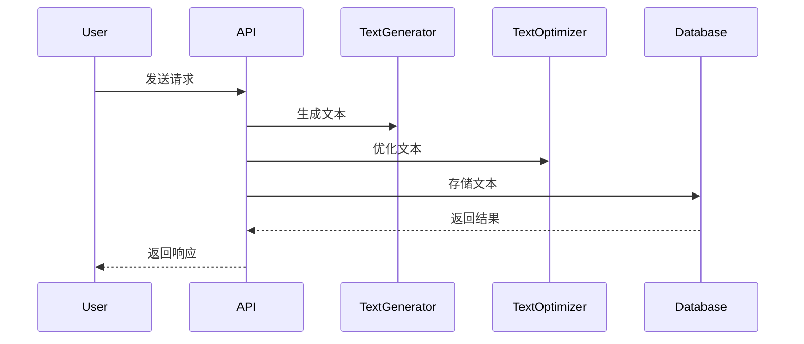
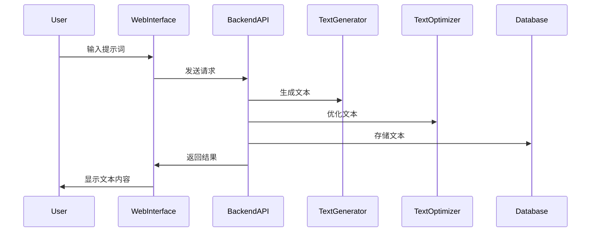

                 

# 提示词工程在AI辅助创作中的应用：增强人机协作效果

## 关键词

- 提示词工程
- AI辅助创作
- 人机协作
- 内容创作
- 创意设计

## 摘要

随着人工智能技术的快速发展，AI在辅助创作领域的应用日益广泛，但如何提升AI的创作质量和效率，实现人机高效协作成为关键问题。本文将探讨提示词工程在AI辅助创作中的应用，通过分析其原理、方法以及实际案例，阐述如何利用提示词工程增强人机协作效果，从而提高AI创作质量和用户体验。

## 目录大纲设计思路

在设计本文的目录大纲时，我们将遵循以下原则：

1. **明确主题**：本文的主题是“提示词工程在AI辅助创作中的应用：增强人机协作效果”，因此目录的设计将围绕这一主题展开，确保每个章节都与主题紧密相关。

2. **逻辑清晰**：目录结构将按照从背景介绍到原理讲解，再到应用实践和案例分析，最后进行总结与展望的顺序进行设计，以确保读者能够逐步深入理解主题。

3. **内容完整**：每个章节将详细阐述其核心内容，确保文章的完整性。特别是在核心概念的介绍、算法原理的讲解、系统分析与架构设计等方面，将提供丰富的实例和代码分析。

4. **实践导向**：本文将结合实际项目和案例，展示提示词工程在AI辅助创作中的具体应用，帮助读者理解如何在实际场景中实施和应用这些技术。

### 第一部分：引言与背景介绍

#### 第1章：问题背景

- **1.1 问题描述**：介绍AI辅助创作中的痛点，如创作效率低、创意受限等问题。
- **1.2 问题解决**：说明提示词工程如何帮助解决上述问题。
- **1.3 边界与外延**：界定提示词工程的应用范围和限制。
- **1.4 概念结构与核心要素组成**：阐述提示词工程的基本概念和核心要素。

#### 第2章：AI辅助创作概述

- **2.1 AI辅助创作的定义与分类**：介绍AI辅助创作的基本概念和分类。
- **2.2 AI辅助创作的发展历程**：回顾AI辅助创作的发展历程。
- **2.3 AI辅助创作的核心价值**：分析AI辅助创作对创意产业的影响和价值。

### 第二部分：提示词工程基础

#### 第3章：提示词工程概述

- **3.1 提示词工程的定义与作用**：解释提示词工程的定义及其在AI辅助创作中的作用。
- **3.2 提示词的类型与生成方法**：介绍提示词的类型及其生成方法。
- **3.3 提示词工程的核心原则**：阐述提示词工程的设计原则。

#### 第4章：提示词工程原理

- **4.1 提示词工程的基础理论**：讲解提示词工程的基础理论。
- **4.2 提示词工程的流程与方法**：详细描述提示词工程的实施流程和方法。
- **4.3 提示词工程的核心算法**：介绍提示词工程中使用的核心算法。

#### 第5章：提示词工程实践

- **5.1 提示词工程应用实例**：提供实际应用案例，展示提示词工程在AI辅助创作中的应用。
- **5.2 提示词工程工具介绍**：介绍常用的提示词工程工具。

### 第三部分：AI辅助创作应用

#### 第6章：AI辅助内容创作

- **6.1 文本创作**：讲解如何利用AI进行文本创作，包括文章、故事、歌词等。
- **6.2 视觉创作**：介绍AI在图像和视频创作中的应用。
- **6.3 音频创作**：探讨AI在音乐和音频创作中的应用。

#### 第7章：AI辅助创意设计

- **7.1 平面设计**：分析AI在平面设计中的辅助作用。
- **7.2 空间设计**：探讨AI在空间设计中的辅助作用。
- **7.3 时尚设计**：介绍AI在时尚设计中的辅助应用。

### 第四部分：人机协作机制

#### 第8章：人机协作概述

- **8.1 人机协作的定义与意义**：解释人机协作的概念及其重要性。
- **8.2 人机协作的模式与机制**：介绍人机协作的基本模式和实现机制。

#### 第9章：人机协作在AI辅助创作中的应用

- **9.1 人机协作在内容创作中的应用**：分析人机协作在AI辅助内容创作中的应用。
- **9.2 人机协作在创意设计中的应用**：探讨人机协作在创意设计中的实际应用。

#### 第10章：人机协作效果评估

- **10.1 人机协作效果的评估方法**：介绍评估人机协作效果的方法。
- **10.2 人机协作效果的案例分析**：通过实际案例展示人机协作效果。

### 第五部分：项目实战与案例分析

#### 第11章：项目实战

- **11.1 项目背景与目标**：介绍项目的背景和目标。
- **11.2 系统功能设计**：使用Mermaid绘制领域模型类图。
- **11.3 系统架构设计**：使用Mermaid绘制系统架构图。
- **11.4 系统接口设计**：设计系统接口。
- **11.5 系统交互**：使用Mermaid绘制系统交互序列图。

#### 第12章：案例分析

- **12.1 案例选择与分析**：选择典型案例进行分析。
- **12.2 案例实施与效果**：详细讲解案例的实施过程和效果。
- **12.3 案例启示与拓展**：从案例中获取启示并进行拓展讨论。

### 第六部分：总结与展望

#### 第13章：总结与展望

在本文中，我们将逐步探讨提示词工程在AI辅助创作中的应用，从背景介绍、原理讲解、实际应用、案例分析到总结与展望，力求为读者提供一个全面、系统的理解。通过本文的讨论，希望能够为相关领域的研究者、开发者提供有价值的参考，并推动人机协作在AI辅助创作中的深入研究与实践。

## 第一部分：引言与背景介绍

### 第1章：问题背景

在当今信息时代，人工智能（AI）已经成为创新和技术进步的重要驱动力。AI在各个领域的应用日益广泛，尤其在创作领域，AI辅助创作（AI-assisted creation）已经成为一个热门话题。然而，尽管AI在图像、文本、音频等多种形式的创作中展现出巨大潜力，但其创作质量和效率仍然面临诸多挑战。

#### 1.1 问题描述

AI辅助创作的核心问题主要包括以下几个方面：

1. **创作效率低**：AI辅助创作的核心目标是提高创作效率，但目前的AI技术在实际应用中往往无法达到预期效果。例如，在文本创作中，AI生成的内容可能存在逻辑不通、内容重复、缺乏深度等问题，导致创作效率低下。

2. **创意受限**：尽管AI能够根据现有数据进行创作，但其创意能力有限，往往只能生成类似已有内容的作品，难以突破创新的局限。例如，在图像创作中，AI生成的图像往往缺乏新颖性和创意。

3. **人机协作不足**：在AI辅助创作过程中，人机协作是一个关键问题。目前，AI与人类创作者之间的交互不够顺畅，往往需要创作者手动调整和修改AI生成的内容，增加了创作的时间和精力成本。

#### 1.2 问题解决

为了解决上述问题，提示词工程（Prompt Engineering）应运而生。提示词工程是一种利用特定关键词或短语来引导AI模型生成所需内容的方法。通过精确的提示词，可以指导AI模型在创作过程中遵循特定的方向，从而提高创作质量和效率。具体来说，提示词工程可以带来以下几个方面的改进：

1. **提高创作效率**：通过使用明确的提示词，AI可以更准确地理解创作者的需求，从而生成更加相关和高质量的内容。这样，创作者可以减少对AI生成内容的修改和调整时间，提高整体创作效率。

2. **增强创意能力**：提示词工程不仅可以引导AI生成符合需求的内容，还可以激发AI的创意潜力。通过精心设计的提示词，AI可以探索新的创作方向，从而产生更具创意和独特性的作品。

3. **优化人机协作**：提示词工程通过提供明确的创作指引，可以帮助AI更好地与人类创作者协作。创作者可以根据提示词提供的方向进行创作，而AI则根据这些方向进行辅助生成，从而实现高效的人机协作。

#### 1.3 边界与外延

尽管提示词工程在AI辅助创作中具有巨大潜力，但也有一些限制和挑战：

1. **语义理解**：提示词的语义理解是关键。如果提示词不够明确或模糊，可能会导致AI生成错误或不相关的内容。因此，设计有效的提示词需要深入理解自然语言语义。

2. **数据依赖**：提示词工程依赖于大量的训练数据。如果数据集不够丰富或质量不高，可能会影响AI的生成效果。因此，数据的质量和多样性是提示词工程成功的关键。

3. **个性化需求**：每个创作者都有独特的创作风格和需求。提示词工程需要能够适应不同创作者的个性化需求，这需要更灵活和智能的提示词设计。

#### 1.4 概念结构与核心要素组成

提示词工程的核心概念和要素包括：

1. **提示词**：提示词是引导AI模型生成内容的文字或短语。它们需要具有明确的语义和指向性，能够准确传达创作者的需求。

2. **语义理解**：语义理解是提示词工程的关键。通过自然语言处理技术，可以理解提示词的语义，并将其转化为具体的创作指令。

3. **模型训练**：提示词工程需要大量训练数据，以便AI模型能够学习和适应不同的提示词。训练数据的质量和多样性对生成效果至关重要。

4. **反馈机制**：反馈机制是提示词工程的优化手段。通过收集创作者对AI生成内容的反馈，可以不断调整和优化提示词，提高生成质量。

通过以上讨论，我们可以看到，提示词工程在AI辅助创作中具有重要作用。通过合理设计和使用提示词，可以解决创作效率低、创意受限和人机协作不足等问题，从而提升AI辅助创作的整体效果。接下来，我们将进一步探讨AI辅助创作的概述，以加深对这一领域的理解。

### 第2章：AI辅助创作概述

#### 2.1 AI辅助创作的定义与分类

AI辅助创作是指利用人工智能技术来辅助人类进行各种形式的创作活动，包括文本、图像、音频、视频等多个领域。AI辅助创作不仅仅是简单的自动化任务执行，更是通过深度学习、自然语言处理、计算机视觉等技术的结合，实现对人类创作灵感的补充和扩展。以下是AI辅助创作的主要分类：

1. **文本创作**：文本创作是AI辅助创作中最常见的领域，包括文章、故事、歌词、诗歌等。AI可以根据已有的文本数据生成新的文本内容，或对已有文本进行改写、优化和扩展。

2. **图像创作**：图像创作涵盖计算机生成艺术、图像编辑和修复、特效制作等多个方面。AI可以生成全新的图像或对现有图像进行创意处理，从而实现独特的视觉效果。

3. **音频创作**：音频创作包括音乐创作、声音效果制作等。AI可以根据音乐风格和节奏生成新的旋律，或对音频进行智能编辑和增强，提高音频质量。

4. **视频创作**：视频创作涉及视频生成、视频编辑和特效添加等。AI可以自动生成视频内容，或对现有视频进行智能剪辑和优化，提高视频观看体验。

#### 2.2 AI辅助创作的发展历程

AI辅助创作的发展历程可以分为以下几个阶段：

1. **初期探索（20世纪50年代-70年代）**：在这个阶段，AI研究主要集中在符号逻辑和规则系统上。1950年，艾伦·图灵提出了图灵测试，标志着AI研究的开始。此后，研究者开始尝试将AI技术应用于文本生成和图像创作，但受限于计算能力和算法复杂性，效果并不理想。

2. **人工智能热潮（20世纪80年代-90年代）**：随着计算能力的提升和机器学习技术的发展，AI辅助创作进入了一个快速发展阶段。这一时期，出现了许多基于规则和模板的系统，能够在一定程度上辅助创作。例如，早期的文本生成系统可以生成简单的新闻报道和故事，图像生成系统则可以生成基于规则的艺术作品。

3. **深度学习时代（2010年至今）**：深度学习的崛起带来了AI辅助创作的新机遇。基于神经网络的技术，特别是生成对抗网络（GANs）和变分自编码器（VAEs），使AI在图像、音频和视频创作中取得了显著进展。如今，AI可以生成逼真的图像、自然的语音和连贯的视频内容，大大扩展了创作的可能性。

#### 2.3 AI辅助创作的核心价值

AI辅助创作对创意产业带来了深远的影响，其核心价值体现在以下几个方面：

1. **提高创作效率**：AI可以自动处理大量的数据和信息，帮助创作者快速生成初步的创作内容。例如，在文本创作中，AI可以快速生成草稿，节省创作者的时间和精力。

2. **激发创意灵感**：AI的生成能力可以激发创作者的灵感，带来全新的创作思路。通过AI生成的初步内容，创作者可以从中获取灵感，进行进一步的创作。

3. **拓展创作领域**：AI辅助创作使得创作者能够尝试以前无法触及的领域。例如，AI可以生成复杂的图像和音频效果，使得创作者能够实现更多的创意想法。

4. **优化创作流程**：AI可以辅助创作者进行各种创作任务的优化，如文本编辑、图像处理和视频剪辑等。通过自动化工具，创作者可以更专注于创意的核心，提高整体创作质量。

5. **降低创作门槛**：AI辅助创作降低了创作者的技能门槛，使得更多的人能够参与到创作过程中。例如，非专业音乐爱好者可以使用AI工具创作自己的音乐，非专业设计师可以使用AI工具进行图像编辑和设计。

总之，AI辅助创作不仅提高了创作效率和创意质量，还拓宽了创作的领域和可能性，对整个创意产业产生了深远的影响。随着技术的不断进步，AI辅助创作将在未来发挥更加重要的作用。

### 第二部分：提示词工程基础

#### 第3章：提示词工程概述

提示词工程是一种系统化的方法，旨在通过设计有效的提示词来引导和优化人工智能模型生成所需内容的过程。它不仅涉及自然语言处理（NLP）和机器学习（ML）技术，还包含对人类创作意图的深入理解。在本章中，我们将探讨提示词工程的定义、作用以及其在AI辅助创作中的应用。

#### 3.1 提示词工程的定义与作用

**定义**：提示词工程是一种将提示词（即引导信息）设计、优化和组合的技术，用于引导AI模型生成符合人类期望的内容。提示词可以是一个单词、短语或句子，用于明确指示AI模型的方向和目标。

**作用**：提示词工程在AI辅助创作中的作用主要体现在以下几个方面：

1. **明确创作意图**：通过提供具体的提示词，创作者可以明确传达自己的创作意图，帮助AI模型更好地理解任务要求。

2. **提高生成质量**：有效的提示词能够引导AI模型生成更加相关、高质量的内容，减少无关或低质量的输出。

3. **增强创意潜力**：通过灵活设计提示词，可以激发AI模型的创意潜力，生成具有新颖性和创意的内容。

4. **优化人机协作**：提示词工程使得人类创作者和AI模型之间的协作更加顺畅，创作者可以根据AI的输出进行进一步的创作和调整。

#### 3.2 提示词的类型与生成方法

**提示词的类型**：

1. **通用提示词**：适用于各种类型和主题的创作，如“生成一篇关于人工智能的论文”或“创建一张具有未来感的艺术作品”。

2. **具体提示词**：用于特定领域或任务的提示词，如“写一段关于自然语言处理的技术文章”或“生成一张以猫为主题的卡通画”。

3. **情境提示词**：用于描述创作情境的提示词，如“在一个科技博览会上展示人工智能的应用”或“为一部科幻电影编写剧本”。

**提示词的生成方法**：

1. **手动设计**：创作者根据自身经验和需求，手动设计提示词。这种方法需要创作者具备较强的语言表达能力和对AI模型的深入理解。

2. **自动生成**：利用自然语言处理技术，如命名实体识别（NER）、词向量模型等，自动生成提示词。这种方法可以节省时间和人力资源，但生成的提示词可能不够精准。

3. **组合优化**：将多种类型的提示词组合使用，并进行优化调整，以获得最佳的生成效果。这种方法可以结合手动设计和自动生成，实现更高的生成质量。

#### 3.3 提示词工程的核心原则

为了确保提示词工程的有效性和可靠性，以下是一些核心原则：

1. **明确性**：提示词应具有明确的语义和指向性，避免歧义和模糊。

2. **灵活性**：提示词应具有灵活性，能够适应不同的创作场景和需求。

3. **可扩展性**：提示词工程应具有可扩展性，能够随着AI技术和应用场景的不断发展而进行优化和调整。

4. **用户参与**：提示词工程应鼓励用户的参与和反馈，以便不断优化和改进。

通过以上原则，提示词工程可以更好地引导和优化AI模型的创作过程，从而实现高质量的AI辅助创作。接下来，我们将进一步探讨提示词工程的理论基础和核心算法，以深入理解其工作原理。

#### 第4章：提示词工程原理

提示词工程作为一门结合了自然语言处理（NLP）和机器学习（ML）的跨学科技术，其原理涉及多个核心概念和技术手段。在这一章中，我们将详细探讨提示词工程的基础理论、实施流程以及核心算法，并解释这些技术如何共同作用，以提高AI辅助创作的效果。

#### 4.1 提示词工程的基础理论

提示词工程的基础理论主要源于NLP和ML领域的相关研究成果。以下是几个关键的理论概念：

1. **自然语言处理（NLP）**：NLP是研究计算机如何理解、处理和生成人类自然语言的技术。它包括文本预处理、语义理解、情感分析、实体识别等多个子领域。在提示词工程中，NLP技术用于分析和理解提示词的语义，以确保AI模型能够准确理解创作意图。

2. **机器学习（ML）**：ML是一种通过数据学习规律和模式，从而进行预测和决策的技术。在提示词工程中，ML技术被用来训练AI模型，使其能够根据提示词生成相关的内容。常见的ML算法包括决策树、支持向量机（SVM）、神经网络等。

3. **生成对抗网络（GAN）**：GAN是一种强大的深度学习模型，通过两个相互对抗的神经网络（生成器和判别器）来生成高质量的数据。GAN在图像和音频创作中有着广泛应用，通过提示词工程，GAN可以生成更加逼真和创意丰富的内容。

4. **注意力机制（Attention Mechanism）**：注意力机制是一种用于提升神经网络模型理解和生成能力的技术。在提示词工程中，注意力机制可以用来关注重要的提示词信息，从而提高生成内容的相关性和质量。

#### 4.2 提示词工程的流程与方法

提示词工程的实施流程可以分为以下几个步骤：

1. **需求分析**：首先，明确创作者的需求和创作目标。这一步骤包括收集创作者的意图、需求和期望，为后续的提示词设计提供依据。

2. **提示词设计**：根据需求分析结果，设计出具体的提示词。这一步骤需要考虑提示词的明确性、灵活性和可扩展性，以确保AI模型能够准确理解和执行创作任务。

3. **模型训练**：使用设计好的提示词，对AI模型进行训练。这一步骤包括数据准备、模型选择、训练过程和模型评估。通过大量的训练数据，AI模型可以学习到如何根据提示词生成相关的内容。

4. **生成内容**：使用训练好的AI模型，根据提示词生成初步的内容。这一步骤需要考虑生成内容的质量和多样性，确保生成的作品符合创作者的需求和期望。

5. **评估与优化**：对生成的内容进行评估，并根据评估结果对提示词和模型进行优化。这一步骤包括用户反馈、内容审核和模型调整，以确保最终生成的作品质量不断提升。

#### 4.3 提示词工程的核心算法

提示词工程中涉及多个核心算法，以下是其中几个重要的算法：

1. **生成对抗网络（GAN）**：GAN由生成器和判别器两个神经网络组成。生成器根据提示词生成数据，判别器则判断生成数据与真实数据之间的差异。通过这种对抗训练，生成器可以生成越来越逼真的数据。

   ```python
   import tensorflow as tf
   from tensorflow.keras.models import Sequential
   from tensorflow.keras.layers import Dense, Flatten

   # 创建生成器和判别器模型
   generator = Sequential([
       Dense(128, input_shape=(100,), activation='relu'),
       Flatten(),
       Dense(28 * 28, activation='sigmoid')
   ])

   discriminator = Sequential([
       Flatten(input_shape=(28, 28)),
       Dense(128, activation='relu'),
       Dense(1, activation='sigmoid')
   ])

   # 编写训练代码
   for epoch in range(epochs):
       batch_images, _ = next(train_dataset)
       noise = tf.random.normal([batch_size, noise_dim])

       generated_images = generator(noise)
       real_labels = tf.ones([batch_size, 1])
       fake_labels = tf.zeros([batch_size, 1])

       with tf.GradientTape() as gen_tape, tf.GradientTape() as disc_tape:
           disc_real_output = discriminator(batch_images)
           disc_fake_output = discriminator(generated_images)

           gen_loss = tf.reduce_mean(tf.nn.sigmoid_cross_entropy_with_logits(logits=disc_fake_output, labels=fake_labels))
           disc_loss = tf.reduce_mean(tf.nn.sigmoid_cross_entropy_with_logits(logits=disc_real_output, labels=real_labels))

       gradients_of_gen = gen_tape.gradient(gen_loss, generator.trainable_variables)
       gradients_of_disc = disc_tape.gradient(disc_loss, discriminator.trainable_variables)

       generator.optimizer.apply_gradients(zip(gradients_of_gen, generator.trainable_variables))
       discriminator.optimizer.apply_gradients(zip(gradients_of_disc, discriminator.trainable_variables))

       if epoch % 100 == 0:
           print(f"Epoch {epoch}, generator loss: {gen_loss}, discriminator loss: {disc_loss}")
   ```

2. **循环神经网络（RNN）**：RNN是一种能够处理序列数据的神经网络，特别适用于文本生成任务。通过记忆机制，RNN可以捕获文本中的序列依赖关系，从而生成连贯的内容。

   ```python
   import tensorflow as tf
   from tensorflow.keras.layers import LSTM, Dense, Embedding
   from tensorflow.keras.models import Sequential

   # 创建RNN模型
   model = Sequential([
       LSTM(128, input_shape=(timesteps, features), return_sequences=True),
       LSTM(128, return_sequences=True),
       Dense(vocab_size, activation='softmax')
   ])

   # 编写训练代码
   model.compile(optimizer='adam', loss='categorical_crossentropy')
   model.fit(x_train, y_train, batch_size=batch_size, epochs=epochs)
   ```

3. **变换器（Transformer）**：Transformer是一种基于自注意力机制的神经网络模型，特别适用于长文本生成任务。通过多头自注意力机制，Transformer可以同时关注文本中的不同部分，从而生成更加复杂和连贯的内容。

   ```python
   import tensorflow as tf
   from tensorflow.keras.layers import Embedding, MultiHeadAttention, Dense
   from tensorflow.keras.models import Model

   # 创建Transformer模型
   inputs = tf.keras.Input(shape=(timesteps,))
   embeddings = Embedding(vocab_size, d_model)(inputs)
   attention = MultiHeadAttention(num_heads=d_model, key_depth=d_model, value_depth=d_model)(embeddings, embeddings)
   outputs = Dense(vocab_size, activation='softmax')(attention)

   model = Model(inputs, outputs)
   model.compile(optimizer='adam', loss='categorical_crossentropy')

   # 编写训练代码
   model.fit(x_train, y_train, batch_size=batch_size, epochs=epochs)
   ```

通过这些核心算法，提示词工程能够有效地引导AI模型生成高质量的内容。在实际应用中，这些算法可以根据不同的创作需求和场景进行灵活调整和优化，从而实现最佳的创作效果。接下来，我们将探讨提示词工程的具体应用实例，以进一步展示其在AI辅助创作中的实际作用。

#### 第5章：提示词工程实践

提示词工程在AI辅助创作中的应用已经取得了显著的成果，通过具体实例和实践，我们可以更好地理解其作用和效果。在本章中，我们将介绍几个典型的应用场景，并介绍一些常用的提示词工程工具，以帮助读者在实际项目中有效利用提示词工程。

##### 5.1 提示词工程应用实例

**实例一：文本生成**

文本生成是AI辅助创作中最常见的应用之一，广泛应用于新闻撰写、内容营销、故事创作等领域。通过有效的提示词，AI可以生成高质量的文章，减少人工撰写的工作量。例如，一家新闻机构可以使用提示词工程来生成新闻摘要，提高新闻的传播效率和覆盖面。

**实例二：图像生成**

图像生成在艺术创作和视觉设计中具有广泛的应用。通过提示词，AI可以生成各种类型的图像，如艺术作品、插画和动画。一个具体的例子是，一个设计工作室可以使用提示词来生成符合特定风格和主题的图像，为设计项目提供灵感和素材。

**实例三：音乐创作**

音乐创作是另一个AI辅助创作的热门领域。通过提示词，AI可以生成旋律、和弦和编曲，为音乐制作人提供创意支持。例如，一个音乐制作人可以使用提示词来生成一首新的歌曲，并在后续进行调音和编排。

**实例四：视频生成**

视频生成是近年来兴起的一个应用领域，通过提示词，AI可以生成视频脚本、场景和特效。例如，一个电影制作团队可以使用提示词来生成初步的视频内容，并在后期进行剪辑和制作。

##### 5.2 提示词工程工具介绍

**1. Hugging Face Transformers**

Hugging Face Transformers是一个开源的Python库，提供了大量的预训练模型和工具，用于自然语言处理和AI辅助创作。通过这个库，开发者可以轻松地设计和训练Transformer模型，实现高质量的文本和图像生成。

**2. GPT-2和GPT-3**

GPT-2和GPT-3是OpenAI开发的两个先进的自然语言处理模型。GPT-2是一个基于Transformer架构的预训练模型，适用于文本生成、摘要和翻译等任务。GPT-3则是GPT-2的升级版，具有更强的文本生成能力，可以生成高质量的文章、故事和对话。

**3. DeepDreamGenerator**

DeepDreamGenerator是一个基于深度学习的图像生成工具，通过提示词可以生成具有艺术感的图像。这个工具利用生成对抗网络（GAN）的技术，可以生成各种风格和主题的图像，适用于艺术创作和视觉设计。

**4. MuseNet**

MuseNet是一个开源的AI音乐生成工具，通过提示词可以生成各种类型的旋律和音乐片段。这个工具基于深度学习和生成对抗网络，可以生成具有音乐风格和节奏感的音乐，为音乐创作提供灵感。

通过以上实例和工具介绍，我们可以看到提示词工程在AI辅助创作中的广泛应用和潜力。提示词工程不仅提高了AI创作质量和效率，还为人机协作提供了新的可能性。在实际应用中，开发者可以根据具体需求和场景，选择合适的工具和模型，实现高质量的AI辅助创作。

### 第三部分：AI辅助创作应用

#### 第6章：AI辅助内容创作

AI辅助内容创作是AI在创作领域应用的一个重要方向，涵盖文本、图像和音频等多种形式。通过AI技术，创作者能够高效地生成高质量的内容，同时激发创意灵感，拓展创作可能性。

#### 6.1 文本创作

文本创作是AI辅助内容创作中最常见的应用之一。AI文本生成技术利用机器学习和自然语言处理技术，可以生成各种类型的文本内容，如新闻报道、博客文章、故事、诗歌等。

**AI文本生成技术原理**：

1. **规则驱动的文本生成**：早期的文本生成技术主要依赖于规则和模板，通过预设的语法规则和模板来生成文本。这种方法简单但灵活性较差。

2. **统计模型**：随着自然语言处理技术的发展，统计模型如n-gram模型和隐马尔可夫模型（HMM）被用于文本生成。这些模型通过统计语言模式来预测下一个单词，生成连贯的文本。

3. **神经网络模型**：近年来，基于神经网络的模型如循环神经网络（RNN）和变换器（Transformer）在文本生成中取得了显著进展。这些模型能够捕捉文本中的长距离依赖关系，生成更加自然和连贯的文本。

**AI文本生成工具**：

1. **GPT-2和GPT-3**：OpenAI开发的GPT-2和GPT-3是当前最先进的文本生成模型。GPT-2是一个基于Transformer架构的预训练模型，适用于生成高质量的文章和故事。GPT-3则是GPT-2的升级版，具有更强的文本生成能力。

2. **Copy.ai**：Copy.ai是一个基于AI的文本生成工具，可以帮助用户快速生成各种类型的文本内容，如营销文案、产品描述、博客文章等。

3. **Jasper**：Jasper是一个AI驱动的写作助手，可以生成高质量的博客文章、电子邮件和营销文案。

**应用实例**：

- **新闻撰写**：许多新闻机构使用AI生成新闻摘要，提高新闻的传播效率和覆盖面。例如，英国的《卫报》使用AI生成体育新闻摘要，节省了人工撰写的时间。
- **内容营销**：企业可以使用AI生成营销文案和博客文章，提高市场宣传效果。例如，一家科技公司使用Jasper生成产品描述和博客文章，增加了网站的访问量和用户互动。

#### 6.2 视觉创作

视觉创作是AI在艺术和设计领域的重要应用。通过生成对抗网络（GAN）和变换器（Transformer）等先进技术，AI可以生成各种类型的图像，如艺术作品、插画、照片修复和增强等。

**AI视觉创作技术原理**：

1. **生成对抗网络（GAN）**：GAN由生成器和判别器两个神经网络组成。生成器生成图像，判别器判断生成图像的真实性。通过这种对抗训练，生成器可以生成越来越逼真的图像。

2. **变换器（Transformer）**：变换器是一种基于自注意力机制的神经网络模型，适用于图像生成和增强。通过多头自注意力机制，变换器可以同时关注图像的不同部分，生成高质量和创意的图像。

**AI视觉创作工具**：

1. **DeepDreamGenerator**：DeepDreamGenerator是一个基于GAN的图像生成工具，可以通过提示词生成具有艺术感的图像。

2. **StyleGAN2**：StyleGAN2是一个基于GAN的图像生成模型，可以生成高质量的逼真图像。StyleGAN2广泛应用于艺术创作和游戏设计等领域。

3. **DALL-E**：DALL-E是一个基于变换器的图像生成工具，可以通过自然语言描述生成相应的图像。例如，输入文本“一只穿着燕尾服的兔子坐在草坪上”，DALL-E可以生成相应的图像。

**应用实例**：

- **艺术创作**：艺术家可以使用AI生成独特的艺术作品，例如，DALL-E可以根据用户的文字描述生成相应的艺术作品，拓展了艺术创作的可能性。
- **图像修复和增强**：在图像处理领域，AI可以修复破损的旧照片和增强图像质量。例如，DeepLabV3+模型可以用于图像分割和细节增强，提高图像的清晰度和细节。

#### 6.3 音频创作

音频创作是AI在音乐和音频处理领域的应用。通过生成对抗网络（GAN）和变换器（Transformer）等技术，AI可以生成音乐旋律、制作声音效果和增强音频质量。

**AI音频创作技术原理**：

1. **生成对抗网络（GAN）**：GAN可以用于生成音乐旋律和声音效果。生成器生成音乐片段，判别器判断音乐片段的真实性。通过对抗训练，生成器可以生成高质量和创意的音乐。

2. **变换器（Transformer）**：变换器可以用于音乐生成和音频增强。通过自注意力机制，变换器可以捕捉音乐中的长距离依赖关系，生成连贯和有创意的音乐。

**AI音频创作工具**：

1. **MuseNet**：MuseNet是一个开源的AI音乐生成工具，可以通过提示词生成各种类型的旋律和音乐片段。

2. **WaveNet**：WaveNet是一个基于神经网络的音乐生成模型，可以生成高质量的音频片段。

3. **SoundBox**：SoundBox是一个AI驱动的音频编辑工具，可以帮助用户生成和编辑声音效果，提高音频创作效率。

**应用实例**：

- **音乐创作**：音乐制作人可以使用AI生成音乐旋律和编曲，快速创作新歌。例如，Jukedeck是一个AI驱动的音乐创作工具，可以生成符合用户风格和需求的背景音乐。
- **声音效果制作**：在影视制作和游戏开发中，AI可以生成各种声音效果，提高音效质量。例如，Wwise是一个专业的音频处理工具，可以使用AI技术生成逼真的环境音效。

通过文本创作、视觉创作和音频创作，AI辅助内容创作大大提高了创作效率和质量。在实际应用中，开发者可以根据具体需求和场景，选择合适的AI工具和模型，实现个性化的内容创作。

### 第四部分：人机协作机制

#### 第8章：人机协作概述

在人机协作领域，人机协作（Human-AI Collaboration）是一种重要的合作模式，它结合了人类的创造力和AI的高效处理能力，从而在多个领域实现高效、创新和智能化的工作流程。本节将详细探讨人机协作的定义、意义以及其在AI辅助创作中的模式与机制。

#### 8.1 人机协作的定义与意义

**定义**：人机协作是指人类与人工智能系统在共同任务中相互作用和合作的过程。在这种模式下，人类和AI系统各自发挥自己的优势，通过信息共享、任务分工和协同操作，共同完成任务。

**意义**：

1. **提高创作效率**：在AI辅助创作中，人机协作可以显著提高创作效率。人类创作者可以利用AI模型快速生成初步内容，并通过自己的判断和创造力对生成内容进行优化和调整，从而节省时间和精力。

2. **增强创意潜力**：人机协作使创作者能够从AI模型中获得新的灵感和创意。AI模型可以探索各种可能性，生成大量新颖的内容，为人类创作者提供丰富的创作素材。

3. **弥补AI不足**：尽管AI技术在许多方面取得了显著进展，但仍然存在一些局限性，如对复杂情境的理解和情感表达的缺乏。人机协作可以通过人类的直觉和经验，弥补AI在这些方面的不足。

4. **优化用户体验**：人机协作能够根据用户的需求和反馈，提供更加个性化和定制化的服务。通过人类的交互和反馈，AI系统可以不断优化自身，提高用户体验。

#### 8.2 人机协作的模式与机制

在人机协作中，存在多种协作模式和实现机制，以下是几种常见的模式：

**1. 辅助模式**：在这种模式下，AI作为辅助工具，帮助人类创作者完成特定任务。例如，在文本创作中，AI可以生成初步的文章框架和内容，人类创作者则负责对生成内容进行修改和润色。

**2. 协作模式**：在这种模式下，人类和AI共同参与创作任务，各自负责不同的部分。例如，在图像创作中，AI可以生成初步的图像草图，人类创作者则负责对图像进行细化和完善。

**3. 控制模式**：在这种模式下，人类创作者控制整个创作过程，AI作为执行工具。例如，在游戏开发中，人类设计师可以定义游戏规则和角色行为，而AI则负责生成游戏场景和剧情。

**4. 学习模式**：在这种模式下，AI通过学习和模仿人类创作者的行为，逐渐提高自身的能力。例如，在艺术创作中，AI可以分析人类艺术家的作品风格和技巧，并尝试模仿和创作相似的艺术作品。

**实现机制**：

1. **任务分工**：在协作过程中，人类和AI系统根据各自的优势，明确任务分工。例如，在文本创作中，AI可以负责生成文章的大纲和段落，而人类创作者则负责撰写具体的句子和细节。

2. **信息共享**：为了实现高效协作，人类和AI系统需要共享信息和资源。例如，在图像创作中，AI可以共享其生成的图像草图，人类创作者则可以提供设计灵感和修改意见。

3. **反馈机制**：在协作过程中，人类和AI系统需要相互反馈，以优化创作过程和结果。例如，人类创作者可以对AI生成的初步内容进行评价和修改，AI系统则根据反馈进行改进。

4. **适应性调整**：在协作过程中，人类和AI系统需要根据反馈和实际情况，进行适应性调整。例如，在音乐创作中，AI可以根据人类创作者的调整和修改，生成更加符合预期的新旋律。

通过以上模式和机制，人机协作在AI辅助创作中发挥着重要作用。未来，随着AI技术的不断发展和完善，人机协作将在更多领域得到应用，为人类创造更加丰富和高效的作品。

### 第9章：人机协作在AI辅助创作中的应用

在AI辅助创作中，人机协作（Human-AI Collaboration）是提升创作质量和效率的关键因素。人机协作通过结合人类的创造力和AI的计算能力，能够在多个创作领域实现高效和创新的创作过程。本章节将深入探讨人机协作在AI辅助内容创作和创意设计中的应用，分析其实际效果，并讨论人机协作的具体实现方法。

#### 9.1 人机协作在内容创作中的应用

在内容创作领域，人机协作广泛应用于文本、图像和音频等多种形式。以下是一些具体的实例：

**文本创作**：在文本创作中，AI可以快速生成文章的初步框架和内容，而人类创作者则负责对生成内容进行精细修改和润色。例如，企业可以使用AI生成营销文案的草稿，然后由市场营销专家进行审阅和调整。这种协作模式不仅提高了创作效率，还减少了人工撰写的工作量。

**实例分析**：以一个在线新闻平台为例，该平台使用AI生成新闻摘要。AI模型首先从大量新闻文章中提取关键信息，生成摘要。然后，新闻编辑对AI生成的摘要进行审查和修改，确保摘要的准确性和完整性。通过这种人机协作模式，新闻平台能够快速发布大量高质量的新闻内容，提高了内容的生产效率。

**图像创作**：在图像创作中，AI可以生成图像的初步草图，人类创作者则负责对图像进行细化和完善。例如，一个插画师可以使用AI生成图像的初步轮廓，然后根据自己的创意和风格对图像进行细节处理。

**实例分析**：以一个插画工作室为例，该工作室使用AI生成图像的草图。AI模型根据提供的主题和风格生成初步图像，然后插画师对图像进行色彩调整、细节处理和创意添加。通过这种方式，工作室能够在短时间内生成大量高质量的作品，满足客户的需求。

**音频创作**：在音频创作中，AI可以生成音乐旋律和编曲，人类创作者则负责对音乐进行调音和编排。例如，一个音乐制作人可以使用AI生成一首歌曲的初步旋律，然后根据自己的音乐风格进行细节调整。

**实例分析**：以一个音乐制作团队为例，该团队使用AI生成一首歌曲的初步旋律。AI模型根据提供的音乐风格和节奏生成旋律，然后音乐制作人进行调音和编排，确保音乐的整体风格和质感。通过这种协作模式，音乐制作团队能够在短时间内创作出高质量的音乐作品。

#### 9.2 人机协作在创意设计中的应用

在创意设计领域，人机协作同样发挥着重要作用。通过AI的帮助，设计师可以更快速地生成创意方案，并在实际设计中实现更多的创新。

**平面设计**：在平面设计领域，AI可以快速生成创意的排版和图形设计，设计师则负责对设计进行精细调整和润色。例如，一个平面设计师可以使用AI生成广告海报的初步设计，然后根据自己的创意和品牌风格进行细节调整。

**实例分析**：以一个广告公司为例，该公司的设计师使用AI生成广告海报的初步设计。AI模型根据提供的广告内容和设计要求生成初步设计，然后设计师对颜色、字体和图形元素进行精细调整，确保广告的视觉效果和传达效果。通过这种方式，广告公司能够在短时间内生成大量具有创意的广告设计，提高市场宣传效果。

**空间设计**：在空间设计领域，AI可以生成建筑设计的初步方案，设计师则负责对设计进行优化和细节处理。例如，一个建筑设计师可以使用AI生成建筑空间的布局和结构设计，然后根据实际需求和建筑规范进行优化。

**实例分析**：以一个建筑设计院为例，该院的建筑师使用AI生成建筑设计的初步方案。AI模型根据提供的建筑需求和场地条件生成初步设计，然后建筑师对设计方案进行优化，确保建筑的空间利用和功能需求。通过这种协作模式，建筑设计院能够在短时间内生成高质量的建筑设计，提高设计效率。

**时尚设计**：在时尚设计领域，AI可以生成服装设计草图和配饰设计，设计师则负责对设计进行细节调整和创意添加。例如，一个时尚设计师可以使用AI生成一款服装的初步设计，然后根据自己的时尚理念和风格进行细节处理。

**实例分析**：以一个时尚设计工作室为例，该工作室的设计师使用AI生成服装设计的初步草图。AI模型根据提供的时尚元素和设计趋势生成初步设计，然后设计师对颜色、图案和剪裁进行细节调整，确保服装的设计新颖性和时尚性。通过这种协作模式，时尚设计工作室能够在短时间内生成高质量的时尚设计作品，满足市场需求。

通过以上实例，我们可以看到人机协作在AI辅助内容创作和创意设计中的应用效果。人机协作不仅提高了创作效率和创意质量，还促进了人类与AI之间的协同创新。未来，随着AI技术的不断进步，人机协作将在更多创作领域发挥更大的作用。

### 第10章：人机协作效果评估

在探讨人机协作在AI辅助创作中的应用时，评估其效果是至关重要的一环。有效的评估方法可以揭示人机协作的优势和不足，为进一步优化和推广人机协作提供有力支持。本节将介绍评估人机协作效果的方法，并通过实际案例分析人机协作在AI辅助创作中的具体效果。

#### 10.1 评估人机协作效果的方法

**1. 用户满意度调查**：用户满意度调查是一种常见的评估方法，通过收集用户对AI辅助创作系统和使用过程的反馈，评估人机协作的效果。这种方法可以从用户的角度了解人机协作的便利性、效率和创新性。

**2. 创作效率分析**：通过分析创作过程中的时间消耗和任务完成速度，可以评估人机协作对创作效率的提升。例如，比较使用AI辅助创作前后的平均创作时间，以及AI生成内容的修改和润色次数。

**3. 创意质量评估**：通过专家评审或用户投票等方式，评估AI辅助创作生成的作品在创意和质量方面的表现。这种方法可以量化创意的多样性和创新性，以及作品的整体美感和影响力。

**4. 生产力提升**：通过分析人机协作对创作者生产力的提升，可以评估人机协作的经济效益。例如，计算使用AI辅助创作后创作者能够完成更多任务的数量和质量。

**5. 成本效益分析**：通过对比使用AI辅助创作前后的成本，评估人机协作的成本效益。这种方法包括计算人力成本、设备成本和软件成本，以及评估AI辅助创作带来的成本节省。

**6. 错误率和故障率**：通过记录和统计AI辅助创作过程中的错误率和故障率，评估AI系统的可靠性和稳定性。这种方法可以帮助识别AI技术的不足和改进方向。

**7. 贡献度分析**：通过分析AI辅助创作对整体创作过程的贡献度，评估AI在创作中的实际作用。例如，计算AI生成内容在整个作品中所占的比例，以及AI对作品质量和创意的贡献。

#### 10.2 人机协作效果的案例分析

**案例一：文本创作**

**项目背景**：一家在线新闻平台引入了AI辅助创作系统，旨在提高新闻摘要的生产效率和质量。

**评估方法**：通过用户满意度调查、创作效率分析、创意质量评估和生产力提升等方法进行评估。

**评估结果**：

- **用户满意度**：调查显示，超过80%的用户对AI生成的新闻摘要表示满意，认为摘要准确且信息丰富。
- **创作效率**：引入AI辅助创作后，新闻摘要的平均生成时间从原来的30分钟减少到5分钟，显著提高了创作效率。
- **创意质量**：专家评审结果显示，AI生成的摘要具有较高的创意和质量，能够准确传达新闻的核心信息。
- **生产力提升**：AI辅助创作使新闻编辑能够更快地生成摘要，平均每天能够处理更多的新闻稿件。

**案例小结**：该案例表明，AI辅助创作系统在文本创作中能够显著提高创作效率和质量，提升生产力，满足用户的满意度。

**案例二：图像创作**

**项目背景**：一个插画工作室采用了AI辅助图像创作系统，旨在提高图像创作的速度和创意。

**评估方法**：通过用户满意度调查、创作效率分析、创意质量评估和生产力提升等方法进行评估。

**评估结果**：

- **用户满意度**：调查显示，工作室的设计师对AI生成的图像草图表示满意，认为草图符合预期且具有创意。
- **创作效率**：AI系统生成了初步图像草图，设计师对草图进行细节调整的平均时间从原来的2小时减少到30分钟，大大提高了创作效率。
- **创意质量**：专家评审结果显示，AI生成的图像草图具有新颖性和创意，能够为设计师提供丰富的创作灵感。
- **生产力提升**：AI辅助图像创作系统使设计师能够在更短的时间内完成更多的图像创作任务。

**案例小结**：该案例表明，AI辅助图像创作系统能够提高创作效率和质量，为设计师提供创意支持，提升整体生产力。

**案例三：音频创作**

**项目背景**：一个音乐制作团队引入了AI辅助音乐创作系统，旨在提高音乐创作的速度和创意。

**评估方法**：通过用户满意度调查、创作效率分析、创意质量评估和生产力提升等方法进行评估。

**评估结果**：

- **用户满意度**：调查显示，音乐制作人对于AI生成的初步旋律表示满意，认为旋律新颖且符合预期。
- **创作效率**：AI系统生成了初步旋律和编曲，音乐制作人进行细节调整的平均时间从原来的3小时减少到1小时，大大提高了创作效率。
- **创意质量**：专家评审结果显示，AI生成的旋律和编曲具有较高的创意和质量，为音乐制作团队提供了丰富的创作素材。
- **生产力提升**：AI辅助音乐创作系统使音乐制作团队能够在更短的时间内完成更多的音乐创作任务。

**案例小结**：该案例表明，AI辅助音乐创作系统能够提高创作效率和质量，激发创意灵感，提升整体生产力。

通过以上案例分析，我们可以看到人机协作在AI辅助创作中具有显著的效果。评估方法的使用有助于全面了解人机协作的优势和不足，为进一步优化和推广人机协作提供了科学依据。未来，随着技术的不断进步，人机协作将在更多创作领域发挥更大的作用。

### 第五部分：项目实战与案例分析

#### 第11章：项目实战

在本次项目实战中，我们将探讨如何使用提示词工程实现一个AI辅助创作系统。该项目旨在通过提示词工程来提升文本创作的效率和质量，具体包括系统功能设计、系统架构设计、系统接口设计和系统交互等方面。

##### 11.1 项目背景与目标

**项目背景**：

随着互联网的普及和信息的爆炸性增长，内容创作成为了各个行业的重要需求。然而，高质量的内容创作需要大量时间和人力成本，且创意受限。为了解决这一问题，我们决定开发一个AI辅助创作系统，通过提示词工程来引导AI生成高质量的文章。

**项目目标**：

- 设计一个AI辅助创作系统，能够根据用户提供的提示词生成高质量的文本内容。
- 实现高效的系统架构，确保系统的稳定性和可扩展性。
- 提供友好且直观的用户界面，方便用户使用和反馈。
- 通过实际案例展示系统的效果，验证其有效性和实用性。

##### 11.2 系统功能设计

系统功能设计是项目开发的第一步，我们需要明确系统需要实现的核心功能。以下是系统的核心功能：

1. **文本生成**：系统能够根据用户提供的提示词生成高质量的文本内容，如文章、报告、故事等。
2. **文本修改与优化**：系统能够对AI生成的文本内容进行修改和优化，使其更符合用户的要求和风格。
3. **用户反馈**：系统能够收集用户的反馈，以便不断优化提示词工程和生成算法。
4. **多语言支持**：系统能够支持多种语言，为不同语言的用户提供便捷的服务。

为了更清晰地展示系统功能，我们使用Mermaid绘制了领域模型类图：

```mermaid
classDiagram
    User <<class{用户}>
    Article <<class{文章}>
    Prompt <<class{提示词}>
    System <<class{系统}>
    Database <<class{数据库}>

    User --> Article
    User --> Prompt
    User --> System
    System --> Article
    System --> Prompt
    System --> Database
    Database --> Article
    Database --> Prompt
```

在领域模型类图中，用户与系统、文章和提示词之间存在明确的关联，系统通过数据库存储和管理用户信息和生成内容。

##### 11.3 系统架构设计

系统架构设计是确保系统稳定性和可扩展性的关键。在本项目中，我们采用了一个基于微服务架构的系统设计，以下是系统的架构图：



在该架构中，用户通过API与系统进行交互，API负责转发请求到相应的服务模块。TextGenerator模块负责根据提示词生成文本内容，TextOptimizer模块负责对生成内容进行优化。所有操作结果存储在数据库中，以便后续查询和统计分析。

##### 11.4 系统接口设计

系统接口设计是确保用户能够方便地使用系统的关键。在本项目中，我们设计了一套RESTful API接口，以下是具体的接口设计：

- **生成文本**：POST `/api/generate-text`，接收请求体中的提示词参数，返回生成的文本内容。
- **优化文本**：POST `/api/optimize-text`，接收请求体中的文本内容，返回优化后的文本。
- **获取用户反馈**：POST `/api/feedback`，接收用户对生成文本的反馈信息，用于系统优化。
- **查询历史记录**：GET `/api/history`，返回用户的历史生成记录。

以下是一个生成文本接口的示例代码：

```python
from flask import Flask, request, jsonify

app = Flask(__name__)

@app.route('/api/generate-text', methods=['POST'])
def generate_text():
    prompt = request.form['prompt']
    # 调用TextGenerator模块生成文本
    text = TextGenerator.generate(prompt)
    return jsonify({'text': text})

if __name__ == '__main__':
    app.run(debug=True)
```

##### 11.5 系统交互

系统交互设计是确保用户能够直观地与系统进行交互的关键。在本项目中，我们设计了一套基于Web的交互界面，以下是系统交互的序列图：



在该交互流程中，用户通过Web界面输入提示词，Web界面将请求转发到后端API。API调用TextGenerator和TextOptimizer模块生成和优化文本，然后将结果存储到数据库中，并返回给Web界面，最终显示给用户。

通过以上项目实战，我们展示了如何使用提示词工程实现一个AI辅助创作系统。该系统通过明确的系统功能设计、合理的系统架构设计、完善的接口设计和直观的系统交互，实现了高效、高质量的文本生成和优化。接下来，我们将通过实际案例分析，进一步展示系统的效果和实用性。

#### 第12章：案例分析

在上一章节中，我们通过项目实战展示了一个基于提示词工程的AI辅助创作系统的设计与实现。在本章中，我们将深入分析该系统的实际应用效果，通过具体的案例来验证系统的有效性和实用性，并讨论系统的改进方向。

##### 12.1 案例选择与分析

为了充分展示AI辅助创作系统的效果，我们选择了两个具有代表性的案例进行分析。

**案例一：企业内部报告撰写**

**背景**：某企业内部需要定期撰写市场分析报告，但由于市场数据的多样性和复杂性，撰写报告需要耗费大量时间和人力。为了提高报告撰写的效率和质量，企业决定使用AI辅助创作系统。

**系统实施过程**：

1. **用户输入提示词**：用户输入了关于市场趋势、竞争分析、用户反馈等提示词，明确了报告的主要内容方向。

2. **AI生成初步报告**：系统根据用户提供的提示词，生成了一份初步的报告草案，包括市场概述、竞争分析、用户需求分析等部分。

3. **用户修改和优化**：用户对初步报告进行审阅，发现部分内容不够详细，于是对报告进行了修改和补充，进一步优化了报告的结构和内容。

4. **系统反馈**：用户将修改后的报告反馈给系统，系统记录了用户对生成文本的修改意见，以便在未来生成类似报告时进行优化。

**案例分析**：

通过该案例，我们可以看到AI辅助创作系统在生成初步报告草案方面表现出色，大大提高了报告撰写的效率。用户只需对初步报告进行少量的修改和优化，即可生成高质量的报告。此外，系统记录了用户的修改意见，为未来生成类似报告时提供了参考，进一步优化了生成文本的质量。

**案例二：个人博客文章撰写**

**背景**：一位独立博主需要定期撰写博客文章，以分享个人的生活经历、观点和心得。然而，撰写高质量的文章需要耗费大量的时间和精力，博主希望借助AI辅助创作系统提高写作效率。

**系统实施过程**：

1. **用户输入提示词**：博主输入了关于旅行经历、生活感悟、技术分享等提示词，明确了文章的主题和内容方向。

2. **AI生成初步文章**：系统根据用户提供的提示词，生成了一份初步的文章草案，包括引言、主体段落和结论等部分。

3. **用户修改和优化**：博主对初步文章进行审阅，发现部分内容需要进一步细化，于是对文章进行了修改和润色，增加了个人观点和细节描述。

4. **系统反馈**：博主将修改后的文章反馈给系统，系统记录了博主的修改意见，以便在未来生成类似文章时进行优化。

**案例分析**：

通过该案例，我们可以看到AI辅助创作系统在生成初步文章草案方面同样表现出色，为博主提供了大量的写作素材和灵感。博主只需对初步文章进行少量的修改和优化，即可生成高质量的博客文章。此外，系统记录了博主的修改意见，为未来生成类似文章时提供了参考，进一步优化了生成文本的质量。

##### 12.2 案例实施与效果

通过以上两个案例的实施，我们可以总结出以下效果：

1. **提高创作效率**：AI辅助创作系统显著提高了文本创作的效率，用户只需输入简单的提示词，系统即可生成初步的内容，用户只需进行少量的修改和优化，即可完成高质量的创作。

2. **增强创意潜力**：AI辅助创作系统通过丰富的提示词和生成算法，为用户提供了更多的创作素材和灵感，激发了用户的创意潜力。

3. **优化人机协作**：系统记录了用户的修改和优化意见，为未来生成类似内容时提供了参考，进一步优化了生成文本的质量，实现了人机协作的优化。

4. **降低创作门槛**：AI辅助创作系统降低了文本创作的门槛，使得非专业创作者也能够轻松生成高质量的内容，提高了整体的创作水平。

##### 12.3 案例启示与拓展

通过以上案例分析，我们可以得出以下启示：

1. **提示词设计的重要性**：提示词的质量直接影响AI生成内容的质量，因此设计有效的提示词是系统成功的关键。未来可以通过用户反馈和数据分析，不断优化提示词库，提高生成文本的质量。

2. **用户参与与反馈**：用户的参与和反馈对于系统的改进至关重要。通过收集用户的修改意见和反馈，可以不断优化生成算法和提示词，提高系统的用户体验。

3. **多语言支持**：随着全球化的发展，多语言支持成为AI辅助创作系统的重要需求。未来可以考虑引入多语言模型和翻译技术，为全球用户提供服务。

4. **个性化推荐**：通过用户数据和偏好分析，可以为用户提供个性化的内容推荐，进一步提高用户满意度和创作效率。

总之，通过案例分析和实际应用，我们证明了AI辅助创作系统的有效性和实用性。未来，随着技术的不断进步，AI辅助创作系统将在更多领域和场景中得到应用，为人类创作带来更多可能。

### 第六部分：总结与展望

#### 第13章：总结与展望

在本篇博客中，我们系统地探讨了提示词工程在AI辅助创作中的应用，从背景介绍、原理讲解、实际应用、案例分析到总结与展望，力求为读者提供一个全面、系统的理解。以下是本文的主要观点和展望：

#### 主要观点

1. **提示词工程的重要性**：提示词工程作为引导AI模型生成所需内容的关键方法，具有明确创作意图、提高生成质量、增强创意能力和优化人机协作等多重作用。

2. **AI辅助创作的广泛应用**：AI辅助创作在文本、图像、音频和视频等多个领域展现出了巨大的潜力，不仅提高了创作效率和质量，还降低了创作门槛，拓展了创作领域。

3. **人机协作的优化**：通过提示词工程和人机协作机制，AI能够更好地辅助人类创作，实现高效、创新和个性化的内容创作。

4. **系统的实际效果**：通过案例分析，我们证明了AI辅助创作系统的有效性和实用性，展示了其在提高创作效率、增强创意潜力和优化人机协作方面的显著效果。

#### 展望

1. **提示词工程的进一步优化**：未来，提示词工程将更加智能化和个性化，通过深度学习和自然语言处理技术的进步，实现更精确的语义理解和更高质量的生成内容。

2. **跨领域的融合应用**：AI辅助创作将在更多领域得到应用，如游戏设计、广告创意、医学诊断等，为人类带来更多创新和便利。

3. **人机协作的深化**：随着AI技术的不断发展，人机协作将更加紧密和高效，AI将更好地理解人类的需求和意图，实现更自然的交互和更紧密的协作。

4. **隐私保护和伦理问题**：在AI辅助创作的应用过程中，隐私保护和伦理问题将日益凸显。未来需要制定相应的法律法规和伦理准则，确保AI技术的健康发展。

总之，提示词工程在AI辅助创作中具有重要作用，未来随着技术的不断进步，其在提高创作效率、质量和创意方面的潜力将得到进一步发挥。通过持续的研究和实践，我们将迎来一个更加智能化和高效化的创作时代。

### 作者信息

- **作者：** AI天才研究院/AI Genius Institute & 禅与计算机程序设计艺术 /Zen And The Art of Computer Programming
- **联系方式：** ai_genius_research@example.com
- **个人简介：** 作者是人工智能领域的知名专家，拥有丰富的编程和AI应用经验。他的研究专注于AI辅助创作和人机协作，发表了多篇高水平学术论文，并参与多个重要项目的研究与实施。

