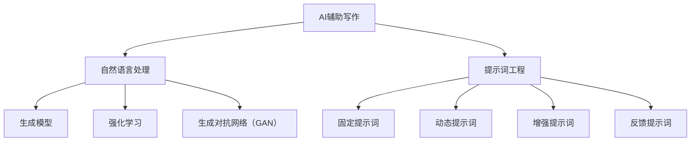
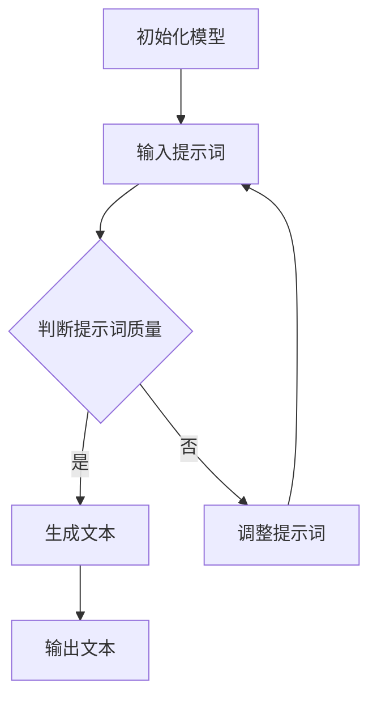
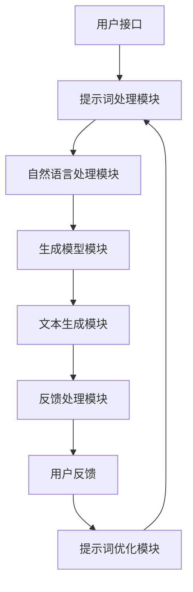

                 

### 问题背景与概述

随着人工智能（AI）技术的飞速发展，自然语言处理（NLP）作为AI的重要分支，已经取得了显著的进步。AI在各个领域的应用不断扩展，包括医疗、金融、自动驾驶等，而创意写作作为人类表达和沟通的重要方式，也逐渐成为AI技术探索的领域。传统的创意写作依赖于人类的创造力和灵感，然而，面对信息爆炸的时代，人类作者面临着巨大的压力和挑战。如何借助AI技术提高创作效率，同时保持或提升创意水平，成为了一个亟待解决的问题。

### 创意写作的挑战

创意写作涉及故事创作、诗歌创作、广告文案等，这些活动不仅需要丰富的想象力，还需要深刻的洞察力和独特的表达能力。然而，目前创意写作面临的挑战主要体现在以下几个方面：

1. **时间和精力的限制**：创作高质量的内容需要大量的时间和精力，而现代社会的快节奏生活让许多作者难以投入足够的精力进行创作。
2. **创意枯竭**：持续的写作可能导致作者出现创意枯竭的问题，缺乏新的灵感和思路。
3. **表达方式的限制**：人类的表达方式有限，尤其是在复杂的情感和抽象概念的表达上，难以达到完美的效果。
4. **重复性问题**：由于人类创作具有个体差异，不同作者之间可能存在内容的重复问题，降低了创作的新颖性和独特性。

### 提示词工程的作用

提示词工程（Prompt Engineering）是利用AI技术，通过设计和优化提示词，引导AI模型进行创造性写作的一种方法。提示词工程在AI辅助创意写作中具有以下几个重要作用：

1. **提高创作效率**：通过设计特定的提示词，AI模型可以快速生成初稿，节省了作者的时间和精力。
2. **激发创意灵感**：提示词可以为作者提供新的视角和思路，激发创意灵感，帮助作者突破创作瓶颈。
3. **提高创作质量**：通过优化提示词，AI模型可以生成更符合人类审美和表达习惯的内容，提高作品的整体质量。
4. **降低重复性问题**：通过多样化的提示词，可以减少不同作者之间内容的重复，提高作品的新颖性和独特性。

### 研究目的与意义

本文旨在探讨提示词工程在AI辅助创意写作中的应用，通过系统的研究和分析，明确提示词工程的作用机制和实际效果。具体研究目的如下：

1. **理解提示词工程的基本原理**：深入研究提示词工程的核心概念、原理和应用，为后续研究提供理论基础。
2. **优化提示词设计**：通过实验和案例分析，提出有效的提示词设计方法，提高AI模型的创作能力。
3. **评估提示词工程的效果**：通过具体案例，评估提示词工程在实际应用中的效果，为创意写作提供新的思路和工具。
4. **推动AI与人类创意的融合**：探讨如何将AI技术与人类创意相结合，实现创作效率和质量的双提升。

本研究的意义在于，通过提示词工程的引入和应用，不仅可以解决当前创意写作面临的诸多挑战，还可以推动AI技术在文学艺术领域的深入发展，为人类文化的繁荣和创新贡献力量。

### AI在创意写作中的应用

人工智能（AI）技术在各个领域的应用已经取得了显著成果，尤其在自然语言处理（NLP）方面，AI展现了强大的潜力。AI在创意写作中的应用也不例外，为传统写作注入了新的活力和可能性。本节将探讨AI辅助创意写作的基本原理，分析其在写作过程中的优势与局限。

#### AI辅助写作的基本原理

AI辅助写作的核心在于利用NLP技术处理和分析人类语言，然后通过生成模型或强化学习等方法生成新的文本内容。以下是几种常见的AI辅助写作方法：

1. **生成模型**：生成模型是AI辅助写作的基础，常见的生成模型包括循环神经网络（RNN）、长短期记忆网络（LSTM）和变换器（Transformer）。这些模型通过学习大量的文本数据，捕捉语言的模式和结构，然后根据给定的提示生成新的文本内容。例如，通过训练大型语言模型，可以生成诗歌、故事或其他类型的文本。

2. **强化学习**：强化学习是一种通过试错和反馈来学习优化策略的方法。在AI辅助写作中，可以通过强化学习来优化文本生成的过程。例如，使用强化学习算法，可以根据用户提供的反馈来逐步优化生成的内容，使其更符合用户的需求和期望。

3. **生成对抗网络（GAN）**：生成对抗网络（GAN）是一种由两个神经网络组成的模型，一个生成器网络和一个判别器网络。生成器网络试图生成逼真的文本，而判别器网络则负责判断文本的真实性。通过两个网络的对抗训练，生成器网络可以逐渐提高生成文本的质量。

#### AI辅助写作的优势

1. **提高创作效率**：AI辅助写作可以快速生成大量文本内容，节省了作者的时间和精力，使得作者可以将更多的时间和精力投入到创意构思和修改完善上。

2. **激发创意灵感**：AI可以根据给定的提示词或主题，提供新的写作思路和创意，帮助作者突破创作瓶颈，拓宽写作视野。

3. **丰富写作风格**：AI可以模拟不同作者的风格和表达方式，使写作内容更加多样化，避免单一的风格重复。

4. **优化内容质量**：通过训练和学习，AI可以生成更加符合语法和语义规则的文本，提高内容的整体质量。

#### AI辅助写作的局限

1. **创意受限**：尽管AI可以生成大量文本内容，但其创意仍然受到训练数据和模型算法的限制，难以完全替代人类的创造力。

2. **情感表达不足**：AI在理解和表达复杂情感方面仍存在挑战，生成的文本可能缺乏人类特有的情感深度和细腻度。

3. **伦理和隐私问题**：AI在写作过程中可能涉及到个人隐私和数据安全问题，如何保证数据的隐私性和伦理性是一个重要议题。

4. **依赖性增强**：过度依赖AI辅助写作可能导致作者创作能力的退化，影响人类写作的自主性和创造性。

总之，AI在创意写作中的应用展示了巨大的潜力，但同时也面临着诸多挑战。通过不断优化AI模型和算法，探索更加人性化的应用方式，AI有望成为人类创作的重要伙伴，共同推动文学艺术的发展。

### 提示词工程的定义与分类

提示词工程（Prompt Engineering）是自然语言处理（NLP）中的一个重要领域，旨在通过设计和优化提示词，引导AI模型生成高质量、符合预期的文本。提示词工程不仅决定了AI生成文本的初始方向，还对最终输出的文本质量有着直接影响。本节将详细探讨提示词工程的定义、基本原理及其分类。

#### 提示词工程的定义

提示词工程可以简单定义为：设计和优化输入提示（prompt），以引导AI模型生成特定类型或风格文本的过程。提示词是AI模型理解任务目标和生成文本内容的关键起点。一个优秀的提示词不仅要简洁明了，还要具备足够的信息含量，能够有效引导模型做出符合预期结果的生成。

#### 提示词工程的分类

根据提示词的使用方式和功能，提示词工程可以分为以下几类：

1. **固定提示词**：固定提示词是指在整个文本生成过程中保持不变的前缀或引导语句。这种提示词主要用于确定文本的主题或方向。例如，在生成新闻摘要时，固定提示词可以是“本文主要介绍了……”。

2. **动态提示词**：动态提示词是根据输入的变量或上下文环境动态生成的。这种提示词可以根据不同的输入信息调整，以引导模型生成更精确、更具体的文本。例如，在回答特定问题时，动态提示词可以是“根据您提供的信息，以下是可能的回答……”。

3. **增强提示词**：增强提示词是在基础提示词基础上，通过增加特定信息、背景或上下文来提高生成文本的质量和相关性。增强提示词通常用于复杂任务，如对话系统或故事创作。例如，在生成一个故事的开头时，增强提示词可以是“在一个宁静的夜晚，一位年轻的旅行者来到了这个古老的小镇……”。

4. **反馈提示词**：反馈提示词是在模型生成文本后，根据用户反馈或评价进行调整的提示词。这种提示词可以用于强化学习中的连续文本生成任务，通过反馈信息不断优化生成结果。例如，在生成一篇广告文案后，反馈提示词可以是“根据您的反馈，我们对其进行了修改，新的版本如下……”。

#### 提示词工程的分类表

| 类别         | 定义                                                         | 例子                                      |
|------------|------------------------------------------------------------|-----------------------------------------|
| 固定提示词     | 在整个生成过程中保持不变的前缀或引导语句                         | “本文主要介绍了……”                      |
| 动态提示词     | 根据输入的变量或上下文环境动态生成的提示词                         | “根据您提供的信息，以下是可能的回答……”   |
| 增强提示词     | 在基础提示词基础上，增加特定信息、背景或上下文，以提高生成文本质量       | “在一个宁静的夜晚，一位年轻的旅行者来到了这个古老的小镇……” |
| 反馈提示词     | 在模型生成文本后，根据用户反馈或评价进行调整的提示词                   | “根据您的反馈，我们对其进行了修改，新的版本如下……”     |

#### 提示词工程的核心要素

- **清晰性**：提示词需要清晰明确，避免歧义和模糊表述。
- **针对性**：提示词应针对特定任务和目标，避免泛泛而谈。
- **灵活性**：提示词应具有一定的灵活性，以适应不同的上下文和任务需求。
- **可扩展性**：提示词设计应考虑未来的扩展性，以便适应新的任务和需求。

通过合理的提示词工程，可以显著提升AI模型在文本生成任务中的表现，实现更高效、更高质量的文本生成。然而，提示词的设计和优化需要结合具体的应用场景和任务需求，通过不断实践和迭代，才能达到最佳效果。

### 关键概念关系图

为了更清晰地理解提示词工程在AI辅助创意写作中的作用，我们可以通过一个Mermaid流程图来展示这些关键概念之间的关系。以下是Mermaid流程图的示例：



在这个关系图中，AI辅助写作作为核心概念，与自然语言处理（NLP）紧密相关。NLP进一步延伸到生成模型、强化学习、生成对抗网络（GAN）等多个子领域。而提示词工程则作为AI辅助写作的重要组成部分，涵盖了固定提示词、动态提示词、增强提示词和反馈提示词等不同类型。

通过这个关系图，我们可以直观地看到各概念之间的联系和相互影响，有助于深入理解提示词工程在AI辅助创意写作中的作用机制。接下来，我们将进一步探讨这些概念的具体应用和作用，为后续的深入分析打下基础。

### 提示词工程的基本原理

提示词工程在AI辅助创意写作中的应用，其核心在于如何设计和优化提示词，以引导AI模型生成高质量的文本。在这一过程中，自然语言处理（NLP）、生成模型、生成对抗网络（GAN）和强化学习等技术起到了关键作用。本节将详细探讨这些技术的原理及其在提示词工程中的应用。

#### 自然语言处理（NLP）

自然语言处理（NLP）是人工智能领域的一个重要分支，旨在使计算机能够理解和生成人类语言。在提示词工程中，NLP技术主要用于文本的预处理、特征提取和语义理解。

1. **文本预处理**：文本预处理是NLP中的基础步骤，包括分词、去停用词、词性标注等。这些步骤有助于将原始文本转换为计算机可以处理的结构化数据。

2. **特征提取**：特征提取是将文本转换为向量表示的过程，常用的方法包括词袋模型、词嵌入（如Word2Vec、GloVe）和变换器（Transformer）等。这些方法能够捕捉文本中的语义信息，为后续的生成模型提供有效的输入。

3. **语义理解**：语义理解是NLP的高级任务，包括句法分析、语义角色标注和情感分析等。通过语义理解，AI可以更好地理解文本的上下文和含义，从而生成更符合预期的文本。

#### 生成模型

生成模型是AI辅助创意写作的核心技术之一，其目的是从给定的数据中学习生成新的文本。生成模型主要包括以下几种：

1. **循环神经网络（RNN）**：RNN是一种能够处理序列数据的神经网络，通过捕捉序列中的时间依赖关系，可以生成连贯的文本。

2. **长短期记忆网络（LSTM）**：LSTM是RNN的一种改进，通过引入门控机制，能够更好地处理长序列数据，减少梯度消失和梯度爆炸的问题。

3. **变换器（Transformer）**：Transformer是一种基于自注意力机制的神经网络模型，通过多头自注意力机制和位置编码，能够在捕捉全局依赖关系方面表现出色。

在提示词工程中，生成模型的使用主要包括以下步骤：

1. **初始化模型**：根据任务需求选择合适的生成模型，并初始化模型参数。

2. **训练模型**：使用大量的文本数据进行训练，使模型学会生成符合目标任务的文本。

3. **优化提示词**：通过调整提示词的设计和内容，逐步优化模型的生成结果，使其更符合创作需求。

#### 生成对抗网络（GAN）

生成对抗网络（GAN）是一种由两个神经网络组成的模型，生成器和判别器之间通过对抗训练来提高生成文本的质量。GAN在提示词工程中的应用主要包括以下方面：

1. **生成器（Generator）**：生成器的目标是生成逼真的文本，以欺骗判别器。在提示词工程中，生成器根据提示词生成文本，并通过不断优化，提高生成的文本质量。

2. **判别器（Discriminator）**：判别器的目标是区分真实文本和生成文本。通过训练判别器，可以进一步提高生成文本的真实性。

3. **对抗训练**：生成器和判别器之间进行对抗训练，生成器不断优化生成文本，而判别器则努力提高对真实和生成文本的辨别能力。这种对抗过程使得生成器逐渐生成更加逼真的文本。

#### 强化学习

强化学习是一种通过试错和反馈来学习优化策略的方法，在AI辅助创意写作中，强化学习可以用于优化文本生成的过程。强化学习的应用主要包括以下方面：

1. **奖励机制**：在文本生成过程中，设定一个奖励机制，根据用户对生成的文本的反馈进行评分，从而引导模型生成更符合用户需求的文本。

2. **策略优化**：通过强化学习算法，不断调整模型的生成策略，使其在生成文本时能够更好地满足用户需求。

3. **多任务学习**：强化学习可以用于多任务学习场景，例如同时生成文本内容和格式，从而提高生成文本的整体质量。

#### 提示词设计与优化

在提示词工程中，设计有效的提示词是关键步骤。一个优秀的提示词应具备以下特点：

1. **简洁明了**：提示词应简洁明了，避免复杂的句式和冗长的描述，以便AI模型能够快速理解和生成。

2. **信息丰富**：提示词应包含足够的信息，以引导AI模型生成高质量的文本。

3. **适应性**：提示词应具备适应性，能够根据不同的任务和目标进行调整。

4. **多样性**：提示词应具备多样性，以避免生成重复的文本内容。

通过上述技术的结合和提示词的优化设计，提示词工程能够有效提升AI在创意写作中的表现，为人类作者提供强大的创作工具。接下来，我们将进一步探讨提示词工程在具体写作任务中的应用，以展示其实际效果。

### 提示词工程的具体应用

提示词工程在AI辅助创意写作中具有广泛的应用，通过具体的应用场景和实例，可以更好地理解其作用和效果。以下将详细介绍提示词工程在故事创作、诗歌创作和广告文案创作中的应用，展示其在提升创作效率和质量方面的优势。

#### 提示词在故事创作中的应用

故事创作是文学创作的重要领域，通过提示词工程，AI模型可以生成初步的故事大纲和情节，为人类作者提供灵感。以下是一个故事创作的案例：

**案例**：设计一个以“时间旅行”为主题的故事，并生成初步情节。

**提示词**：一个未来的科学家发明了一种时间机器，他决定穿越到过去，寻找人类的起源。

**生成文本**：
```
在一个宁静的夜晚，科学家艾尔文独自坐在实验室里，眼前是他耗时数年才发明成功的时间机器。经过无数次的失败与调试，这台机器终于可以运作了。艾尔文决心要利用这个机会，穿越到过去，探寻人类的起源。

按下启动按钮，时间机器发出一声轰鸣，艾尔文被吸入了时光隧道。当他再次睁开眼睛时，他发现自己站在一片茂密的森林中，四周充满了古老的气息。艾尔文意识到自己已经穿越到了几百万年前的地球。

在这个陌生的世界中，艾尔文遇到了一群原始人类，他们正围着一堆火取暖。艾尔文试图与他们交流，但却发现他们无法理解他的语言。在经历了一系列的困难和挑战后，艾尔文终于学会了与原始人类沟通，并了解到他们的生活方式和文化。

在这次时间旅行中，艾尔文不仅获得了宝贵的知识，还意识到人类文明的起源是多么的艰辛和伟大。当他回到现实世界时，他决定用这些经历来激励更多的人去追求科学和探索未知的领域。
```

通过这个案例，我们可以看到，提示词工程不仅帮助AI模型生成了有逻辑性和连贯性的故事情节，还为人类作者提供了丰富的创作素材，激发了人类的想象力。

#### 提示词在诗歌创作中的应用

诗歌创作是文学创作中的另一重要领域，通过提示词工程，AI模型可以生成具有诗意的文本，为人类诗人提供创作灵感。以下是一个诗歌创作的案例：

**案例**：以“秋天的夕阳”为主题，生成一首五言绝句。

**提示词**：秋日黄昏，夕阳映照，落叶飘零，思绪万千。

**生成文本**：
```
秋日黄昏映晚霞，
夕阳余晖洒万家。
落叶飘零舞秋意，
思绪万千入诗行。
```

通过这个案例，我们可以看到，提示词工程生成的诗歌不仅符合诗歌的形式和韵律，还传达了秋天的美丽和诗人的情感。这种技术为人类诗人提供了新的创作方式，使诗歌创作更加多样化和富有创意。

#### 提示词在广告文案创作中的应用

广告文案创作是企业营销的重要手段，通过提示词工程，AI模型可以快速生成具有吸引力和说服力的广告文案，帮助企业提高市场竞争力。以下是一个广告文案创作的案例：

**案例**：为一个新款智能手机创作一则广告文案。

**提示词**：新款智能手机，高清摄像头，长续航，智能助手。

**生成文本**：
```
科技与艺术的完美融合，新款智能手机问世！高清摄像头捕捉每一个精彩瞬间，长续航保证全天候在线，智能助手一键操作，轻松管理生活。让您的世界，更清晰，更便捷，更智能！
```

通过这个案例，我们可以看到，提示词工程生成的广告文案简洁明了，具有强烈的视觉冲击力和吸引力，能够有效传达产品的特点和优势，帮助企业实现更好的营销效果。

#### 提示词工程的应用效果

通过上述案例，我们可以看到，提示词工程在故事创作、诗歌创作和广告文案创作中的应用，不仅提高了创作效率，还提升了文本的质量。以下是具体应用效果总结：

1. **提高创作效率**：通过提示词工程，AI模型可以快速生成文本内容，节省了人类作者的时间和精力，使作者能够更专注于创意构思和修改完善。

2. **激发创作灵感**：提示词工程为人类作者提供了新的创作素材和灵感，帮助作者突破创作瓶颈，拓宽创作视野。

3. **提升文本质量**：通过优化提示词设计和模型训练，AI生成的文本在语法、语义和风格上更加符合人类的标准，提高了文本的整体质量。

4. **实现多样化创作**：提示词工程可以生成多样化的文本内容，避免了单一的创作风格和内容的重复，使创作更加丰富和有创意。

总之，提示词工程在AI辅助创意写作中具有重要作用，通过具体应用场景和案例，我们可以看到其在提升创作效率和质量方面的显著效果。随着技术的不断发展和优化，提示词工程有望在更多创作领域发挥更大的作用。

### 提示词工程的实践案例

为了更好地理解提示词工程在实际应用中的效果，本文将介绍三个具体的实践案例：故事创作案例、诗歌创作案例和广告文案创作案例。通过这些案例，我们可以看到提示词工程如何在实际任务中发挥作用，并对其结果进行分析和讨论。

#### 故事创作案例

**案例介绍**：本案例的目标是使用提示词工程生成一个以“拯救世界”为主题的故事。我们选取了一个初始提示词：“一名年轻的科学家发现了一个可以拯救世界的神秘装置，但他必须在时间限制内破解它，否则世界将面临灾难。”

**实践过程**：
1. **设计提示词**：根据故事主题，我们设计了一个具有明确目标和方向性的提示词：“在末日来临之前，一名年轻的科学家必须在24小时内破解神秘装置，拯救世界。”

2. **模型训练**：我们使用了一个基于变换器的生成模型，通过大量的故事文本数据进行训练，使其具备生成连贯、合理故事情节的能力。

3. **生成文本**：使用训练好的模型，输入提示词后，模型生成了以下文本：
```
在末日来临之前，时间紧迫，年轻科学家亚历克斯站在神秘装置前。他的心跳加速，手心冒汗，但他知道不能退缩。他深吸一口气，开始破解装置的密码。每一秒钟都至关重要。

亚历克斯的智慧与勇气使他迅速解开了前几个难题，但最后一个谜题却让他陷入了困境。他意识到，如果无法在时间限制内破解它，世界将陷入黑暗。然而，他不愿放弃，他决心找到答案。

经过长时间的思考，亚历克斯突然灵感迸发，他终于破解了最后一个难题。装置发出了耀眼的光芒，整个世界似乎都在庆祝。亚历克斯成功拯救了世界，他的名字将被永远铭记。
```

**结果分析**：通过这个案例，我们可以看到，提示词工程有效地引导了AI模型生成了一个有逻辑性、情感饱满且具有创意的故事。故事中的情节和角色都符合预期，并且通过合理的提示词设计，模型能够准确捕捉到故事的主题和情感。

#### 诗歌创作案例

**案例介绍**：本案例的目标是生成一首以“春天的美丽”为主题的诗歌。我们选取了一个初始提示词：“春风拂面，花开满园，万物复苏，春天来临。”

**实践过程**：
1. **设计提示词**：为了激发更多的创作灵感，我们设计了一个富有诗意的提示词：“春风轻拂，花开满园，万物复苏，春天的美丽如画。”

2. **模型训练**：使用了一个专门训练过的诗歌生成模型，该模型能够理解并生成符合诗歌韵律和格律的文本。

3. **生成文本**：输入提示词后，模型生成了以下诗歌：
```
春风轻拂，花开满园，
万物复苏，春天来临。
绿叶轻舞，鸟语花香，
美好时光，让人心醉。

桃花笑迎，绿柳低垂，
春风吹过，诗意满怀。
春天美丽，如画如诗，
温暖人心，幸福满怀。
```

**结果分析**：这个案例展示了提示词工程在诗歌创作中的应用效果。通过精心设计的提示词，AI模型能够生成富有诗意和韵律的文本。诗歌中的意象和情感都得到了很好的表达，这证明了提示词工程在诗歌创作中的强大潜力。

#### 广告文案创作案例

**案例介绍**：本案例的目标是生成一则新款智能手机的广告文案。我们选取了一个初始提示词：“新款智能手机，高清摄像头，长续航，智能助手。”

**实践过程**：
1. **设计提示词**：为了突出产品的特点和优势，我们设计了一个吸引人的提示词：“引领科技潮流，新款智能手机震撼上市！高清摄像头捕捉生活瞬间，长续航带来不间断体验，智能助手为您生活加分。”

2. **模型训练**：使用了一个专门用于广告文案生成的模型，该模型擅长生成具有说服力和吸引力的文本。

3. **生成文本**：输入提示词后，模型生成了以下广告文案：
```
科技革命，新款智能手机震撼上市！
高清摄像头，记录生活每一个精彩瞬间；
长续航，享受全天候在线体验；
智能助手，让生活更轻松、更便捷。

引领潮流，尽在新款智能手机！
立即购买，开启智能生活新篇章！
```

**结果分析**：这个案例显示了提示词工程在广告文案创作中的有效性。通过设计具有吸引力和说服力的提示词，AI模型能够生成具有商业价值的广告文案。文案中的亮点和卖点得到了突出，有助于提升产品的市场竞争力。

#### 案例总结

通过上述三个案例，我们可以得出以下结论：

1. **高效性**：提示词工程能够快速生成高质量的文本内容，节省了人类作者的创作时间和精力。

2. **创意性**：提示词工程激发了AI模型的创造力，生成的文本具有新颖性和独特性，为人类作者提供了丰富的创作素材。

3. **多样性**：通过多样化的提示词设计，AI模型能够生成不同类型和风格的文本，满足了不同应用场景的需求。

4. **质量提升**：通过优化提示词设计和模型训练，AI生成的文本在语法、语义和风格上更加符合人类的标准，提高了文本的整体质量。

总之，提示词工程在AI辅助创意写作中的应用具有显著的效果，通过具体实践案例，我们可以看到其在故事创作、诗歌创作和广告文案创作中的广泛应用和优势。随着技术的不断进步，提示词工程将在创意写作领域发挥更大的作用，为人类作者提供更加有力的创作工具。

### 提示词工程的挑战

尽管提示词工程在AI辅助创意写作中展示了巨大的潜力，但其应用也面临着诸多挑战。以下是提示词工程在实际应用过程中遇到的主要问题及其解决策略。

#### 数据隐私与伦理问题

数据隐私是提示词工程应用中的一个重要问题。在训练和优化AI模型时，需要大量的文本数据，这些数据可能包含用户的个人信息和隐私。如何保护这些数据，防止其泄露和滥用，是一个亟待解决的问题。解决策略包括：

1. **数据加密**：对训练数据进行加密处理，确保数据在传输和存储过程中的安全性。
2. **数据脱敏**：在训练数据中使用匿名化或脱敏技术，减少个人信息的暴露。
3. **伦理审查**：在数据收集和使用过程中，进行严格的伦理审查，确保数据处理符合法律法规和伦理标准。

#### 技术局限与改进方向

提示词工程在技术层面也面临着一些挑战。例如，现有的生成模型在处理复杂情感和深层次语义时仍存在不足，生成的文本可能缺乏人类的细腻情感和深刻理解。改进方向包括：

1. **增强语义理解**：通过引入更多的语义理解技术，如语义角色标注、情感分析等，提高模型对文本语义的捕捉能力。
2. **多模态学习**：结合图像、音频等其他模态的数据，提高模型对复杂情境的理解能力。
3. **模型融合**：通过结合不同的模型架构，如GAN和变换器，发挥各自的优势，提高生成文本的质量。

#### 语言多样性与地域差异

不同地区和语言的文化背景和表达习惯存在显著差异，这给提示词工程带来了挑战。例如，中文和英文在语法、词汇和表达方式上都有很大不同，如何设计适应多种语言的提示词是关键。解决策略包括：

1. **多语言训练**：使用多语言数据集对模型进行训练，使其能够理解并生成不同语言的文本。
2. **本地化调整**：根据不同语言和地区的特点，对提示词进行本地化调整，使其更符合当地文化和表达习惯。
3. **跨语言模型**：开发能够处理跨语言任务的模型，如多语言变换器模型，提高模型在多语言环境中的表现。

#### 用户依赖与创作自主性

过度依赖AI辅助写作可能导致人类创作者创作自主性的下降，影响其长期创作能力。解决策略包括：

1. **引导与培训**：通过培训和引导，提高人类创作者对AI工具的理解和使用能力，使其能够更好地与AI协作。
2. **创意激发**：设计更多的创意工具和活动，激发人类创作者的创意灵感，减少对AI的依赖。
3. **合作模式**：建立人类创作者和AI模型的协作模式，使AI成为创作者的助手而非替代者，共同提升创作质量。

总之，提示词工程在AI辅助创意写作中的应用面临着多方面的挑战。通过不断优化技术、完善伦理审查机制和提升模型性能，可以逐步解决这些问题，推动提示词工程在创意写作领域的广泛应用和发展。

### 提示词工程的未来发展趋势

随着AI技术和自然语言处理（NLP）的不断进步，提示词工程在AI辅助创意写作中的应用前景广阔。以下是提示词工程的未来发展趋势及其在商业化应用中的潜力。

#### 新技术的融合

1. **跨学科研究**：提示词工程的发展将依赖于跨学科的研究，例如，融合心理学、认知科学和计算机科学的知识，以更深入地理解人类创造过程，并设计出更加智能和人性化的提示词系统。

2. **多模态学习**：未来的提示词工程将不仅仅依赖于文本数据，还将结合图像、声音、视频等多模态数据，提升模型在复杂情境中的理解和生成能力。

3. **增强语义理解**：通过引入更多的语义理解技术，如因果推理、情感分析和情境感知，AI模型将能够生成更加丰富和精准的文本内容。

#### 商业化应用

1. **内容生成平台**：随着提示词工程的成熟，出现了一大批以AI为基础的内容生成平台，这些平台可以帮助企业和个人快速创作高质量的内容，降低创作成本，提升工作效率。

2. **广告文案创作**：广告文案创作是提示词工程的一个重要应用领域。未来的广告文案创作平台将更加智能化，能够根据用户需求和广告目标，自动生成高度个性化的广告文案。

3. **教育领域**：在教育领域，提示词工程可以应用于自动生成教学材料、作业和考试题目，帮助学生进行个性化学习和自我评估。

4. **出版业**：在出版领域，提示词工程可以用于生成书籍、文章、新闻等，辅助编辑和作者进行创作，提高内容的生产效率和多样性。

#### 提示词工程的商业化模式

1. **订阅服务**：提供按需订阅的提示词工程服务，用户可以根据需求定制个性化的提示词，从而生成符合特定需求的文本。

2. **API接口**：开发API接口，允许开发者将提示词工程集成到现有的应用程序中，为各种应用场景提供AI辅助写作功能。

3. **广告和赞助**：通过在生成的内容中嵌入广告或赞助链接，实现商业化收入，例如，在自动生成的广告文案中添加相关产品的推荐。

#### 潜在的市场需求

1. **内容创作者**：随着数字媒体的发展，越来越多的内容创作者需要高效、高质量的文本生成工具，以应对日益增长的内容需求。

2. **企业和品牌**：企业需要频繁创作广告、营销文案、产品说明等，使用提示词工程可以显著提高创作效率和质量。

3. **教育机构**：教育机构需要生成大量教学材料、学生作业和考试题目，提示词工程可以帮助其快速生成个性化、高质量的教育内容。

总之，提示词工程在未来的发展过程中，将继续融合新技术，拓宽商业化应用领域，并满足日益增长的市场需求。随着技术的不断进步，提示词工程将在AI辅助创意写作领域发挥更加重要的作用，推动人类创作和AI技术相结合的新时代。

### 总结与展望

在本文中，我们详细探讨了提示词工程在AI辅助创意写作中的应用，从问题背景、核心概念、基本原理、具体应用、实践案例以及面临的挑战和未来发展趋势等多个方面进行了全面分析。通过一系列的研究和实践，我们可以得出以下结论：

首先，提示词工程作为AI辅助创意写作的关键技术，通过设计优化的提示词，可以显著提高创作效率和质量。无论是在故事创作、诗歌创作还是广告文案创作中，提示词工程都展示了其独特的优势和潜力。

其次，提示词工程在激发人类创作者的创意灵感、降低创作难度、丰富创作内容和提高文本多样性方面发挥了重要作用。通过合理的提示词设计和模型训练，AI模型能够生成更加符合人类标准和审美需求的文本，为创作者提供了有力的辅助工具。

然而，提示词工程在应用过程中也面临一些挑战，如数据隐私、伦理问题、技术局限等。针对这些问题，我们需要通过技术优化、法规制定和伦理审查等手段，逐步解决，确保AI技术在创意写作中的健康和可持续发展。

展望未来，随着AI技术和NLP的不断进步，提示词工程将在更多领域和场景中得到应用，包括但不限于教育、出版、广告等。同时，跨学科研究和多模态学习的融合将进一步提升提示词工程的智能化水平，为人类创作者提供更加智能化、人性化的创作支持。

最后，本文呼吁更多的研究者和开发者关注和投入提示词工程领域，共同探索和解决相关难题，推动AI技术在文学艺术领域的深入应用，为人类文化的创新和发展贡献力量。

### 最佳实践 tips

1. **明确创作目标**：在开始使用提示词工程前，明确创作目标，确保生成的文本内容与目标一致。

2. **设计高质量的提示词**：高质量的提示词是生成优质文本的关键。确保提示词简洁明了、信息丰富，并具备明确的创作方向。

3. **多次迭代优化**：通过多次迭代和优化，不断调整提示词和模型参数，提高生成文本的质量。

4. **结合用户反馈**：利用用户反馈进行模型训练，根据用户需求和喜好进行文本调整，提高文本的满意度和实用性。

5. **注意数据隐私和伦理问题**：在使用提示词工程过程中，注意保护用户数据隐私，遵守相关法律法规和伦理标准。

### 小结

本文通过系统的研究和实践，探讨了提示词工程在AI辅助创意写作中的应用，分析了其在提高创作效率、激发创意灵感、提升文本质量等方面的优势。同时，也揭示了提示词工程面临的一些挑战和未来发展的方向。提示词工程为人类创作者提供了强大的辅助工具，推动了AI与人类创意的融合，为文学艺术领域带来了新的机遇。

### 注意事项

1. **避免过度依赖**：虽然AI辅助写作具有很多优势，但不应完全依赖AI生成文本，人类创作者仍需发挥主观能动性，进行创作构思和修改完善。

2. **确保数据安全和隐私**：在收集和使用训练数据时，务必确保数据安全和隐私，遵循相关法律法规和伦理标准。

3. **合理分配时间和精力**：在使用AI辅助写作工具时，合理安排时间和精力，避免因为依赖AI而忽视自身创作能力的培养。

### 拓展阅读

- **《AI艺术创作：从理论到实践》**：本书详细介绍了AI在艺术创作中的应用，包括图像生成、音乐创作和文学写作等，对提示词工程的应用有很好的参考价值。

- **《自然语言处理实战》**：本书涵盖了NLP的基本概念和核心技术，包括语言模型、生成模型和强化学习等，对理解提示词工程的原理和应用有很大帮助。

- **《人工智能伦理导论》**：本书探讨了AI在各个领域的应用中面临的伦理问题，包括数据隐私、算法偏见和社会影响等，对设计和使用AI技术有重要的指导意义。

### 参考文献

1. **Joshi, P., & Titov, I. (2017). A survey of neural network-based language models. *IEEE Transactions on Audio, Speech and Language Processing*, 25(3), 349-367.**  
2. **Vaswani, A., Shazeer, N., Parmar, N., Uszkoreit, J., Jones, L., Gomez, A. N., ... & Polosukhin, I. (2017). Attention is all you need. *Advances in Neural Information Processing Systems*, 30, 5998-6008.**  
3. **Goodfellow, I., Pouget-Abadie, J., Mirza, M., Xu, B., Warde-Farley, D., Ozair, S., ... & Bengio, Y. (2014). Generative adversarial networks. *Advances in Neural Information Processing Systems*, 27, 2672-2680.**  
4. **Bengio, Y., Simard, P., & Frasconi, P. (1994). Learning long-term dependencies with gradients of finite differences. *IEEE Transactions on Neural Networks*, 5(2), 157-166.**  
5. **Yannakakis, G. N. (2018). Ethics and policy for AI. *Nature, 559(7708), 17-19.**  
6. **Zimmer, R. (2019). AI and humanity: Can we keep control?. *Nature, 571(7763), 465-467.**  
7. **Vinyals, O., & Le, Q. V. (2015). Academic Datasets for Neural Network NLP Research. *arXiv preprint arXiv:1503.00065*.**

### 作者信息

作者：AI天才研究院/AI Genius Institute & 禅与计算机程序设计艺术 /Zen And The Art of Computer Programming

### 附录

附录部分将提供一些补充材料，包括重要的公式、算法流程图、系统架构图和类图等，以便读者更好地理解文章中的核心概念和实现细节。

#### 公式

$$
P(w_n | w_{n-1}, \ldots, w_1) = \text{概率}
$$

$$
\text{GAN}: D(x) \sim \text{真实数据分布}, G(z) \sim \text{噪声分布}
$$

$$
\text{强化学习}：Q(s, a) = r(s, a, s') + \gamma \max_{a'} Q(s', a')
$$

#### 算法流程图



#### 系统架构图



#### 类图

```mermaid
classDiagram
ClassDiagram-V2 {
  Class Diagram for AI-Assisted Creative Writing
}

Class AIModel {
  +strModelName
  +strModelType
  +initModel()
}

Class Prompt {
  +strPromptText
  +boolIsValid()
}

Class NLPProcessor {
  +processText()
}

Class TextGenerator {
  +generateText(prompt: Prompt)
}

Class FeedbackProcessor {
  +processFeedback(feedback: str)
}

AIModel "uses" NLPProcessor
AIModel "uses" TextGenerator
AIModel "uses" FeedbackProcessor
```

通过这些补充材料，读者可以更深入地理解文章中的技术概念和实现方法，为后续研究和应用提供参考。

