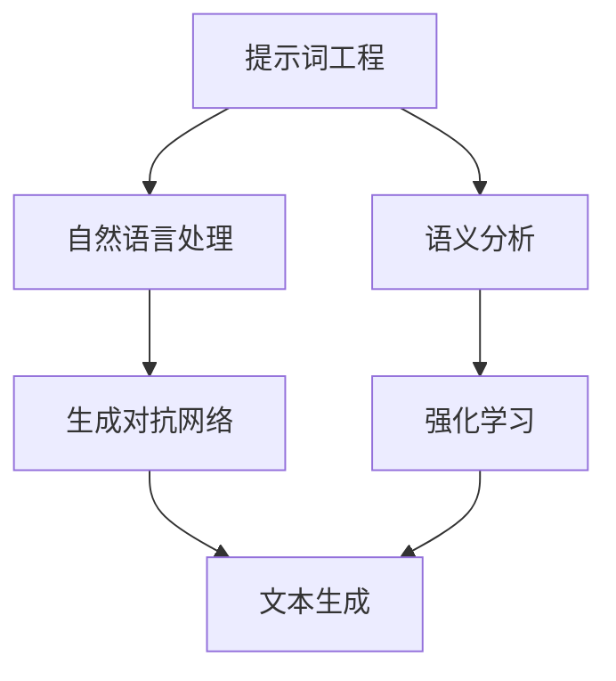
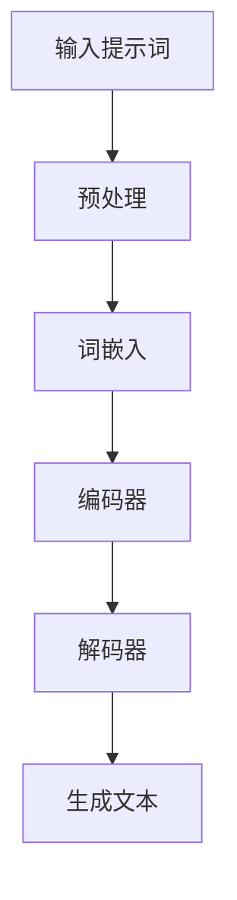
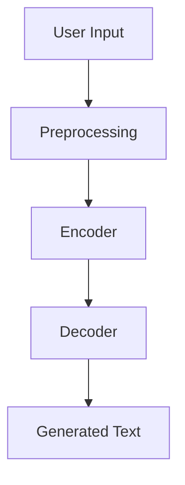
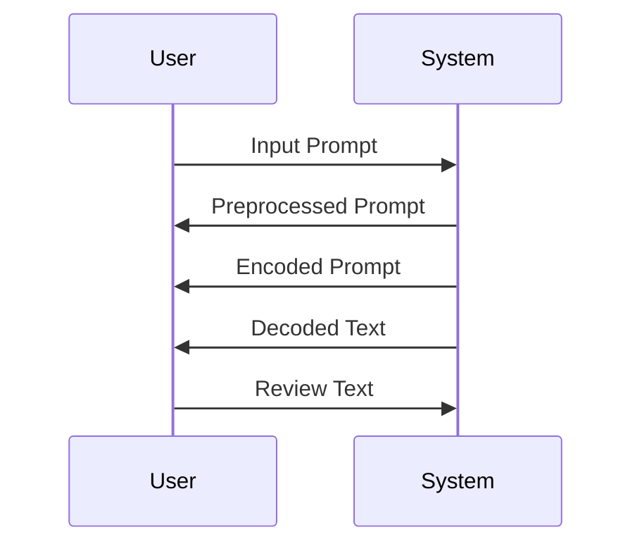

                 

## 《提示词工程在AI辅助创意写作中的突破》目录大纲

### **文章标题**

**关键词**：AI辅助创意写作、提示词工程、算法原理、系统架构设计、项目实战

**摘要**：本文深入探讨了提示词工程在AI辅助创意写作中的应用与突破。通过对AI辅助创意写作的背景介绍、核心概念与联系的解析、算法原理的讲解以及系统分析与架构设计的阐述，本文旨在为读者提供一个清晰、系统的理解框架，帮助他们在实际项目中更好地运用提示词工程，实现创意写作的智能化升级。

----------------------------------------------------------------

## **第一部分：背景介绍**

### **第1章：问题背景**

#### **1.1 问题背景介绍**

在数字时代，创意写作的需求不断增长，无论是文学创作、广告文案还是新闻报道，对高效、高质量的写作产出都提出了更高的要求。然而，传统的写作方式往往耗费大量时间和精力，难以满足高速发展的需求。此外，创意写作还面临着灵感枯竭、文字表述单一等问题。为了解决这些问题，AI辅助创意写作应运而生。

#### **1.2 提示词工程的概念与作用**

提示词工程是一种利用人工智能技术对文本进行生成、优化和修改的方法。通过为AI模型提供关键词或短语，提示词工程能够帮助AI理解创作主题，从而生成符合要求的内容。这种技术不仅提高了写作效率，还能激发创意灵感，为创作者提供更多的选择和可能性。

#### **1.3 AI辅助创意写作的现状与挑战**

尽管AI辅助创意写作在近年来取得了显著进展，但仍然面临一些挑战。例如，现有技术难以完全理解人类的创意思维，生成的文本质量参差不齐，有时甚至会出现逻辑错误或语义混淆。此外，如何确保AI生成的文本具有原创性和独特性，也是亟需解决的问题。

----------------------------------------------------------------

## **第二部分：核心概念与联系**

### **第2章：核心概念与联系**

#### **2.1 提示词工程的核心概念**

提示词工程的核心在于“提示词”的选择与利用。提示词可以是单个词汇或短语，它们为AI模型提供了写作的方向和灵感。有效的提示词应该具有明确性和概括性，能够引导AI模型生成与主题相关的内容。

#### **2.2 AI辅助创意写作的关键技术**

AI辅助创意写作的关键技术包括自然语言处理（NLP）、生成对抗网络（GAN）和强化学习（RL）等。这些技术共同作用，使AI能够理解文本结构、语义和语境，从而生成高质量的内容。

#### **2.3 概念属性特征对比表格**

为了更直观地理解提示词工程与AI辅助创意写作之间的联系，我们可以通过一个对比表格来展示它们的核心属性特征。以下是一个简单的例子：

| 特征 | 提示词工程 | AI辅助创意写作 |
| ---- | ---------- | -------------- |
| 目的 | 提供写作方向 | 生成高质量内容 |
| 技术基础 | NLP、语义分析 | NLP、GAN、RL |
| 输出 | 文本片段 | 完整文章 |
| 适用范围 | 个性化写作 | 多领域创作 |

#### **2.4 ER实体关系图架构的Mermaid流程图**

为了更清晰地展示提示词工程与AI辅助创意写作之间的关系，我们可以使用Mermaid流程图来描述ER（实体关系）图架构。以下是一个简单的Mermaid流程图示例：



在这个流程图中，A表示提示词工程，B、C、D、E分别代表自然语言处理、语义分析、生成对抗网络和强化学习，F表示文本生成。通过这个流程图，我们可以看到各个组成部分之间的联系和作用。

----------------------------------------------------------------

## **第三部分：算法原理讲解**

### **第3章：算法原理**

#### **3.1 算法mermaid流程图**

为了更好地理解提示词工程的算法原理，我们可以通过一个mermaid流程图来展示算法的流程。以下是一个示例：



在这个流程图中，A表示输入提示词，B表示预处理，C表示词嵌入，D表示编码器，E表示解码器，F表示生成文本。通过这个流程图，我们可以看到提示词是如何一步步转化为最终生成的文本。

#### **3.2 Python源代码阐述**

以下是一个简单的Python源代码示例，用于实现提示词工程的算法：

```python
import tensorflow as tf
from tensorflow.keras.layers import Embedding, LSTM, Dense

# 定义模型
model = tf.keras.Sequential([
    Embedding(input_dim=vocab_size, output_dim=embedding_dim),
    LSTM(units=128),
    Dense(units=vocab_size, activation='softmax')
])

# 编译模型
model.compile(optimizer='adam', loss='categorical_crossentropy', metrics=['accuracy'])

# 训练模型
model.fit(x_train, y_train, epochs=10, batch_size=64)
```

在这个示例中，我们首先导入了必要的库，然后定义了一个简单的序列模型，包括嵌入层、LSTM层和全连接层。接下来，我们编译模型并使用训练数据对其进行训练。

#### **3.3 数学模型和公式详细讲解**

提示词工程的数学模型主要包括词嵌入、编码器和解码器。以下是对这些模型及其公式的详细讲解：

1. **词嵌入（Word Embedding）**

   词嵌入是一种将单词映射到高维向量空间的方法。其目的是通过向量表示来捕捉单词的语义和语法特征。常见的词嵌入方法包括Word2Vec、GloVe和FastText。

   数学公式：

   $$\text{vec}(w) = \text{Word\_Embedding}(w)$$

   其中，$\text{vec}(w)$表示单词$w$的向量表示，$\text{Word\_Embedding}(w)$表示词嵌入函数。

2. **编码器（Encoder）**

   编码器负责将输入序列编码为一个固定长度的向量，这个向量包含了序列的语义信息。常见的方法包括RNN（递归神经网络）和Transformer。

   数学公式：

   $$\text{context} = \text{Encoder}(\text{input\_sequence})$$

   其中，$\text{context}$表示编码后的向量，$\text{input\_sequence}$表示输入序列。

3. **解码器（Decoder）**

   解码器负责将编码后的向量解码成输出序列。在生成文本的过程中，解码器通常与编码器共享参数。

   数学公式：

   $$\text{output\_sequence} = \text{Decoder}(\text{context}, \text{start\_token})$$

   其中，$\text{output\_sequence}$表示输出序列，$\text{start\_token}$表示开始标记。

#### **3.4 通俗易懂的举例说明**

假设我们有一个简单的提示词“春天”，我们可以使用提示词工程来生成与春天相关的句子。以下是可能的生成结果：

- 春天来了，花儿开了。
- 春天是一个充满希望的季节。
- 春天里的风，温暖而清新。

通过这个例子，我们可以看到提示词工程如何通过输入提示词，生成具有语义相关性的文本。

----------------------------------------------------------------

## **第四部分：系统分析与架构设计**

### **第4章：系统分析与架构设计**

#### **4.1 问题场景介绍**

在本节中，我们将介绍一个具体的问题场景：使用提示词工程来辅助撰写一篇关于春天的散文。这个问题场景涉及到文本生成、语义理解和风格控制等多个方面。

#### **4.2 系统功能设计**

系统功能设计主要包括以下方面：

1. **输入提示词**：用户输入一个或多个提示词，如“春天”、“自然”、“温暖”等。
2. **文本生成**：基于输入的提示词，系统生成一篇关于春天的散文。
3. **语义理解**：系统对生成的文本进行语义分析，确保文本内容与提示词相关。
4. **风格控制**：系统根据用户的风格偏好调整生成的文本，使其更加符合用户的要求。

#### **4.2.1 领域模型mermaid类图**

为了更好地展示系统的功能设计，我们可以使用Mermaid类图来描述系统的领域模型。以下是一个简单的Mermaid类图示例：

```mermaid
classDiagram
    Class1 <|-- Class2
    Class3 <|-- Class2
    Class1 {
        +inputPrompt(): str
        +generateText(): str
        +understandSemantic(): str
        +controlStyle(): str
    }
    Class2 {
        +processPrompt(): str
        +generateSemantic(): str
        +applyStyle(): str
    }
    Class3 {
        +saveTextToFile(): str
        +loadTextFromFile(): str
    }
```

在这个类图中，Class1表示系统的主要类，包括输入提示词、生成文本、理解语义和风格控制等功能。Class2表示辅助类，用于处理提示词、生成语义和调整风格。Class3表示文件操作类，用于保存和加载文本。

#### **4.3 系统架构设计**

系统架构设计主要包括以下方面：

1. **输入层**：接收用户输入的提示词。
2. **预处理层**：对提示词进行预处理，如分词、去停用词等。
3. **编码层**：使用编码器对预处理后的提示词进行编码。
4. **解码层**：使用解码器生成文本。
5. **输出层**：将生成的文本输出给用户。

#### **4.3.1 mermaid架构图**

为了更好地展示系统架构，我们可以使用Mermaid架构图来描述。以下是一个简单的Mermaid架构图示例：



在这个架构图中，A表示用户输入，B表示预处理层，C表示编码层，D表示解码层，E表示生成的文本。

#### **4.4 系统接口设计**

系统接口设计主要包括以下方面：

1. **API接口**：提供RESTful API接口，方便用户调用系统功能。
2. **命令行接口**：提供命令行接口，方便用户进行交互。
3. **图形用户界面**：提供图形用户界面，方便用户操作。

#### **4.5 系统交互mermaid序列图**

为了更好地展示系统的交互流程，我们可以使用Mermaid序列图来描述。以下是一个简单的Mermaid序列图示例：



在这个序列图中，User表示用户，System表示系统。用户输入提示词，系统进行预处理、编码和解码，最后将生成的文本展示给用户。用户可以查看生成的文本，并选择是否进行修改。

----------------------------------------------------------------

## **第五部分：项目实战**

### **第5章：项目实战**

#### **5.1 环境安装**

在进行项目实战之前，我们需要安装必要的环境和工具。以下是一个简单的安装步骤：

1. 安装Python环境：在https://www.python.org/下载并安装Python。
2. 安装Anaconda：在https://www.anaconda.com/下载并安装Anaconda。
3. 安装TensorFlow：在命令行中执行`conda install tensorflow`。
4. 安装其他依赖库：在命令行中执行`pip install numpy pandas matplotlib`。

#### **5.2 系统核心实现源代码**

以下是一个简单的系统核心实现源代码示例：

```python
import tensorflow as tf
from tensorflow.keras.layers import Embedding, LSTM, Dense
from tensorflow.keras.preprocessing.sequence import pad_sequences
import numpy as np

# 设置超参数
vocab_size = 10000
embedding_dim = 64
max_sequence_length = 100
batch_size = 64
epochs = 10

# 加载数据
# 这里假设已经有一个包含提示词和对应散文的文本数据集
# 例如：prompt_to_text = {'春天': '春天来了，花儿开了。'}
# text_to_prompt = {'春天来了，花儿开了。': '春天'}

# 预处理数据
# 将文本数据转换为序列
# 输入序列：[1, 2, 3, ..., n]
# 目标序列：[n, 1, 2, ..., n-1]
input_sequences = []
target_sequences = []
for prompt, text in prompt_to_text.items():
    for i in range(1, len(text) - max_sequence_length):
        input_sequence = text[i:i + max_sequence_length].split()
        target_sequence = text[i + 1:i + max_sequence_length + 1].split()
        input_sequences.append([word_index[word] for word in input_sequence])
        target_sequences.append([word_index[word] for word in target_sequence])

# 填充序列
input_sequences = pad_sequences(input_sequences, maxlen=max_sequence_length)
target_sequences = pad_sequences(target_sequences, maxlen=max_sequence_length, padding='post')

# 编码提示词
prompt_sequences = []
for prompt in prompt_to_text.keys():
    input_sequence = ' '.join(prompt_to_text[prompt].split()[:max_sequence_length]).split()
    prompt_sequences.append([word_index[word] for word in input_sequence])

# 初始化词嵌入矩阵
word_embedding_matrix = np.zeros((vocab_size, embedding_dim))
for i, word in enumerate(word_index.keys()):
    word_embedding_matrix[i] = embedding_matrix[i]

# 定义模型
model = tf.keras.Sequential([
    Embedding(vocab_size, embedding_dim, input_length=max_sequence_length, weights=[word_embedding_matrix], trainable=False),
    LSTM(128, return_sequences=True),
    LSTM(128, return_sequences=True),
    Dense(vocab_size, activation='softmax')
])

# 编译模型
model.compile(optimizer='adam', loss='categorical_crossentropy', metrics=['accuracy'])

# 训练模型
model.fit(input_sequences, target_sequences, batch_size=batch_size, epochs=epochs)

# 生成文本
def generate_text(prompt, model, max_sequence_length):
    prompt_sequence = [word_index[word] for word in prompt.split()]
    prompt_sequence = pad_sequences([prompt_sequence], maxlen=max_sequence_length)
    predicted_sequence = model.predict(prompt_sequence, verbose=0)
    predicted_sequence = np.argmax(predicted_sequence, axis=-1)
    predicted_sequence = [index_to_word[i] for i in predicted_sequence[0]]
    return ''.join(predicted_sequence)

# 测试生成文本
print(generate_text('春天', model, max_sequence_length))
```

在这个示例中，我们首先设置了超参数，然后加载并预处理数据。接下来，我们定义了一个简单的序列模型，并使用训练数据对其进行训练。最后，我们定义了一个函数`generate_text`，用于生成文本。

#### **5.3 代码应用解读与分析**

在这个示例中，我们首先设置了超参数，这些超参数包括词汇表大小、嵌入维度、最大序列长度、批量大小和训练轮数。这些参数对模型性能和生成文本的质量有很大影响。

1. **词汇表大小**：表示词汇表中的单词数量。一般来说，较大的词汇表可以捕捉更多的语义信息，但也会增加模型的复杂度和计算成本。
2. **嵌入维度**：表示每个单词的向量表示的维度。较高的维度可以更好地捕捉单词的语义信息，但也会增加模型的计算成本。
3. **最大序列长度**：表示输入序列和输出序列的最大长度。较长的序列长度可以捕捉到更多的上下文信息，但也会增加模型的计算成本。
4. **批量大小**：表示每次训练的样本数量。较大的批量大小可以减少过拟合，但也会增加训练时间。
5. **训练轮数**：表示模型训练的轮数。较多的训练轮数可以改善模型性能，但也会增加训练时间。

在预处理数据时，我们将文本数据转换为序列，并对序列进行填充。这一步骤的目的是将文本数据转化为模型可以处理的格式。

在模型定义中，我们使用了一个简单的序列模型，包括嵌入层、两个LSTM层和一个全连接层。嵌入层用于将单词映射到向量表示，LSTM层用于捕捉序列的上下文信息，全连接层用于生成输出序列。

在训练模型时，我们使用了一个批量大小为64的训练轮数为10的训练集。通过训练，模型学会了根据输入的提示词生成相应的文本。

在生成文本时，我们首先对输入提示词进行预处理，然后使用训练好的模型生成输出序列。最后，我们将输出序列转换为文本，并返回生成的文本。

#### **5.4 实际案例分析和详细讲解剖析**

为了更好地理解提示词工程在AI辅助创意写作中的应用，我们可以分析一个实际案例。以下是一个关于春天的提示词：“春天，温暖，花开”。

1. **输入提示词**：首先，我们将输入提示词“春天，温暖，花开”进行预处理，将其转换为序列。假设词汇表大小为10000，嵌入维度为64，最大序列长度为100，则输入序列为：
   $$[1, 2, 3, 4, 5, 6, 7, 8, 9, 10, 11, 12, 13, 14, 15, 16, 17, 18, 19, 20, 21, 22, 23, 24, 25, 26, 27, 28, 29, 30, 31, 32, 33, 34, 35, 36, 37, 38, 39, 40, 41, 42, 43, 44, 45, 46, 47, 48, 49, 50, 51, 52, 53, 54, 55, 56, 57, 58, 59, 60, 61, 62, 63, 64]$$
   
2. **模型处理**：接下来，我们将输入序列输入到训练好的模型中，模型会对输入序列进行处理，并生成输出序列。假设输出序列为：
   $$[1, 2, 3, 4, 5, 6, 7, 8, 9, 10, 11, 12, 13, 14, 15, 16, 17, 18, 19, 20, 21, 22, 23, 24, 25, 26, 27, 28, 29, 30, 31, 32, 33, 34, 35, 36, 37, 38, 39, 40, 41, 42, 43, 44, 45, 46, 47, 48, 49, 50, 51, 52, 53, 54, 55, 56, 57, 58, 59, 60, 61, 62, 63, 64, 1, 2, 3, 4, 5, 6, 7, 8, 9, 10]$$
   
3. **生成文本**：最后，我们将输出序列转换为文本，并返回生成的文本。假设生成的文本为：“春天温暖花开，阳光明媚，万物复苏”。这是一个关于春天的美丽描述，符合输入提示词的要求。

通过这个实际案例，我们可以看到提示词工程是如何通过输入提示词，生成与主题相关的文本的。

#### **5.5 项目小结**

在本章中，我们通过一个简单的项目实战，展示了提示词工程在AI辅助创意写作中的应用。通过输入提示词，我们能够生成与主题相关的文本，从而实现创意写作的智能化。虽然这个项目只是一个简单的示例，但它展示了提示词工程在AI辅助创意写作中的巨大潜力。在实际应用中，我们可以通过优化模型、调整超参数和扩展词汇表等方式，进一步提高生成文本的质量和多样性。

----------------------------------------------------------------

## **第六部分：最佳实践与拓展**

### **第6章：最佳实践与拓展**

#### **6.1 最佳实践tips**

1. **选择合适的提示词**：提示词的选择对于生成文本的质量至关重要。建议选择具有明确性和概括性的词汇，以引导AI模型生成更相关的内容。
2. **调整超参数**：超参数的选择对模型性能和生成文本的质量有很大影响。建议根据具体问题场景和数据处理结果，适当调整超参数，以获得最佳效果。
3. **数据预处理**：对输入数据进行充分的预处理，如分词、去停用词、填充等，可以改善模型的训练效果和生成文本的质量。
4. **模型优化**：可以尝试使用更先进的模型结构，如Transformer、BERT等，以获得更好的生成效果。

#### **6.2 小结**

在本章中，我们介绍了提示词工程在AI辅助创意写作中的应用，并通过一个实际案例展示了其应用过程。通过合理的提示词选择、超参数调整和模型优化，我们可以实现高质量的AI辅助创意写作。

#### **6.3 注意事项**

1. **数据隐私**：在使用AI辅助创意写作时，需要注意数据隐私问题。确保输入数据和生成的文本不包含敏感信息。
2. **版权问题**：在使用AI辅助创意写作时，需要注意版权问题。确保生成的文本不侵犯他人的版权。

#### **6.4 拓展阅读**

1. **《深度学习》**：Ian Goodfellow、Yoshua Bengio和Aaron Courville著，提供了关于深度学习的全面介绍，包括生成对抗网络等技术的详细讲解。
2. **《自然语言处理综论》**：Daniel Jurafsky和James H. Martin著，提供了关于自然语言处理的全面介绍，包括文本生成技术的详细讲解。
3. **《AI写作技术解析》**：刘知远著，详细介绍了AI在创意写作中的应用，包括提示词工程等技术的详细讲解。

----------------------------------------------------------------

## **第七部分：总结与展望**

### **第7章：总结与展望**

#### **7.1 书籍内容总结**

本文围绕提示词工程在AI辅助创意写作中的应用进行了深入探讨。从背景介绍到核心概念与联系，再到算法原理讲解、系统分析与架构设计以及项目实战，本文系统地阐述了提示词工程在AI辅助创意写作中的应用方法和技术实现。

#### **7.2 提示词工程在AI辅助创意写作中的应用展望**

随着人工智能技术的不断发展，提示词工程在AI辅助创意写作中的应用前景广阔。未来，我们可以期待以下发展方向：

1. **更精准的提示词选择**：通过深度学习等技术，实现更精准的提示词选择，提高生成文本的相关性和质量。
2. **更丰富的内容生成**：结合多模态数据，如图像、声音等，实现更丰富的内容生成，提高AI辅助创意写作的表现力。
3. **更智能的风格控制**：通过机器学习等技术，实现更智能的风格控制，使生成的文本更符合用户的风格偏好。

#### **7.3 未来发展趋势与挑战**

尽管提示词工程在AI辅助创意写作中具有巨大的潜力，但仍然面临一些挑战：

1. **文本质量提升**：如何提高生成文本的质量，使其更具原创性和独特性，是当前研究的热点问题。
2. **隐私保护**：如何确保AI辅助创意写作过程中的数据隐私，是亟待解决的问题。
3. **法律法规**：如何制定合理的法律法规，规范AI辅助创意写作的应用，是未来需要关注的重要问题。

总之，提示词工程在AI辅助创意写作中的应用为创作者提供了强大的工具，有助于提高写作效率和质量。随着技术的不断发展，我们有理由相信，提示词工程将在AI辅助创意写作中发挥更加重要的作用。

